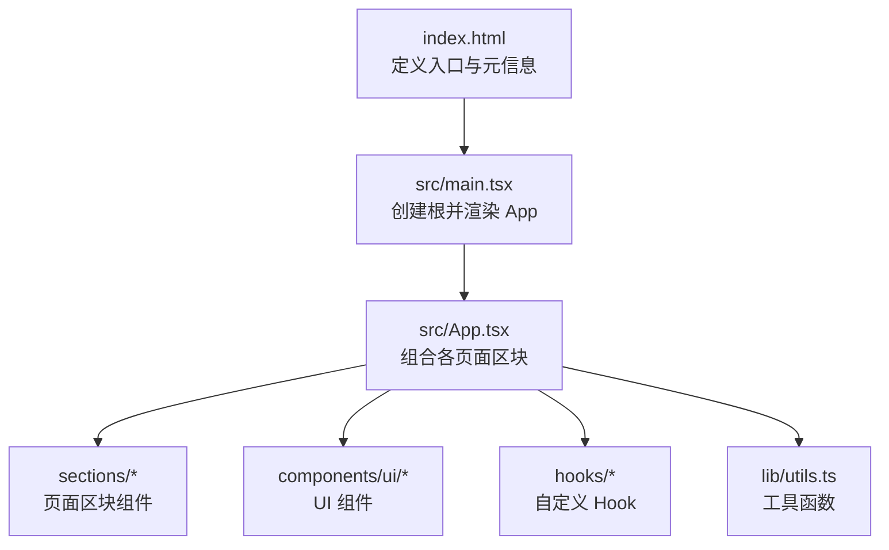

# 快速开始

<cite>
**本文引用的文件**
- [README.md](file://README.md)
- [package.json](file://package.json)
- [vite.config.ts](file://vite.config.ts)
- [index.html](file://index.html)
- [src/main.tsx](file://src/main.tsx)
- [src/App.tsx](file://src/App.tsx)
</cite>

## 目录
1. [简介](#简介)
2. [环境准备](#环境准备)
3. [克隆与安装](#克隆与安装)
4. [启动开发服务器与预览](#启动开发服务器与预览)
5. [构建与部署](#构建与部署)
6. [项目结构与入口流程](#项目结构与入口流程)
7. [常见问题与故障排除](#常见问题与故障排除)
8. [结论](#结论)

## 简介
本指南面向首次接触“挠荔枝官网”项目的开发者，帮助你在最短时间内完成环境准备、依赖安装、本地运行、构建与基础部署。项目基于 React + TypeScript + Vite + Tailwind CSS 技术栈，采用模块化组织方式，入口为 index.html，应用根组件为 App.tsx，并通过 main.tsx 挂载到 DOM。

## 环境准备
- Node.js：建议使用较新的 LTS 版本（例如 18.x 或 20.x）。本项目使用 ES Module 类型脚本与 Vite 7，Node.js 18+ 可良好兼容。
- 包管理器：npm（也可使用 pnpm/yarn，但需确保与 package-lock.json 一致时使用 npm 以保持一致性）。
- 操作系统：macOS / Windows / Linux 均可。
- 浏览器：现代浏览器（Chrome/Edge/Firefox/Safari）即可。

说明：
- 项目声明了 "type": "module"，因此需要支持 ESM 的 Node.js 环境。
- 构建脚本包含 TypeScript 编译步骤，请确保系统具备可用的编译器（由 TypeScript 提供）。

章节来源
- [package.json:1-11](file://package.json#L1-L11)
- [README.md:29-43](file://README.md#L29-L43)

## 克隆与安装
1. 克隆仓库
   - 使用 Git 将仓库克隆到本地任意目录。
2. 进入项目目录
   - 在终端中 cd 到项目根目录。
3. 安装依赖
   - 执行 npm install，该命令会读取 package.json 并安装所有依赖。
4. 验证安装
   - 安装完成后，可直接进行下一步启动开发服务器。

提示：
- 若网络较慢，可使用国内镜像源加速 npm 安装。
- 如遇权限问题，请在当前用户目录下执行，避免使用 sudo。

章节来源
- [README.md:29-43](file://README.md#L29-L43)
- [package.json:1-11](file://package.json#L1-L11)

## 启动开发服务器与预览
- 启动开发服务器
  - 执行 npm run dev，Vite 会在本地启动热更新服务，默认端口通常为 5173。
- 打开页面
  - 在浏览器访问 http://localhost:5173 即可看到首页。
- 预览生产构建
  - 先执行 npm run build 生成 dist 目录，再执行 npm run preview 预览构建产物。

说明：
- 开发模式使用 Vite 提供的 HMR（热模块替换），修改代码后会自动刷新。
- 预览模式用于模拟生产环境的静态资源加载行为。

章节来源
- [README.md:29-43](file://README.md#L29-L43)
- [package.json:6-11](file://package.json#L6-L11)

## 构建与部署
- 构建生产版本
  - 执行 npm run build，该命令会先进行 TypeScript 类型检查与编译，然后调用 Vite 打包输出至 dist 目录。
- 预览构建产物
  - 执行 npm run preview，本地启动一个静态服务器预览 dist 内容。
- 部署建议
  - 将 dist 目录部署到任意静态站点托管平台（如 GitHub Pages、Vercel、Netlify、Nginx/Apache 等）。
  - 注意 base 路径：项目配置 base 为相对路径 "./"，适合部署到子路径场景；如需部署到站点根路径，可根据实际部署平台调整 base 值。

章节来源
- [package.json:6-11](file://package.json#L6-L11)
- [vite.config.ts:6-14](file://vite.config.ts#L6-L14)

## 项目结构与入口流程
- 入口 HTML
  - index.html 定义了页面标题、SEO 元信息、OG 标签以及引入主脚本的路径。
- 应用挂载
  - src/main.tsx 通过 createRoot 将 React 应用渲染到 #root 节点，并启用 StrictMode。
- 根组件
  - src/App.tsx 作为根组件，组合多个页面区块（Navbar、Hero、Features、TTSDemo、Highlights、CTA、Footer）和背景特效（FluidCanvas、EarParticles）。
- 别名配置
  - vite.config.ts 配置了 @ 指向 src 目录，便于在代码中使用短路径导入。

图表来源
- [index.html:44-47](file://index.html#L44-L47)
- [src/main.tsx:1-11](file://src/main.tsx#L1-L11)
- [src/App.tsx:1-30](file://src/App.tsx#L1-L30)
- [vite.config.ts:9-13](file://vite.config.ts#L9-L13)

章节来源
- [index.html:1-49](file://index.html#L1-L49)
- [src/main.tsx:1-11](file://src/main.tsx#L1-L11)
- [src/App.tsx:1-30](file://src/App.tsx#L1-L30)
- [vite.config.ts:1-15](file://vite.config.ts#L1-L15)

## 常见问题与故障排除
- 无法找到 node_modules 或安装失败
  - 确认已执行 npm install，且当前目录为项目根目录。
  - 若网络受限，尝试切换 npm 镜像源或使用代理。
- 端口占用导致开发服务器无法启动
  - 默认端口可能被其他进程占用，可在终端中查看报错信息，必要时停止占用端口的进程或更换端口。
- 构建时报 TypeScript 错误
  - 先修复类型错误后再执行构建；可通过 npm run build 查看具体错误位置。
- 页面空白或样式未生效
  - 确认 index.html 中的入口脚本路径未被修改。
  - 检查是否引入了必要的 CSS（项目已在 main.tsx 中引入全局样式）。
- 部署后资源路径不正确
  - 根据部署平台调整 vite.config.ts 中的 base 值；当前配置为相对路径 "./"，适用于子路径部署。

章节来源
- [README.md:29-43](file://README.md#L29-L43)
- [package.json:6-11](file://package.json#L6-L11)
- [vite.config.ts:6-14](file://vite.config.ts#L6-L14)
- [src/main.tsx:1-11](file://src/main.tsx#L1-L11)
- [index.html:44-47](file://index.html#L44-L47)

## 结论
通过以上步骤，你可以在几分钟内完成本地环境搭建、依赖安装、开发服务器启动与预览，并掌握基本的构建与部署流程。建议在后续开发中结合 ESLint 与 TypeScript 的类型提示提升代码质量，并根据部署平台需求调整 Vite 的 base 路径。