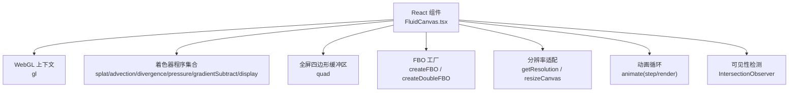
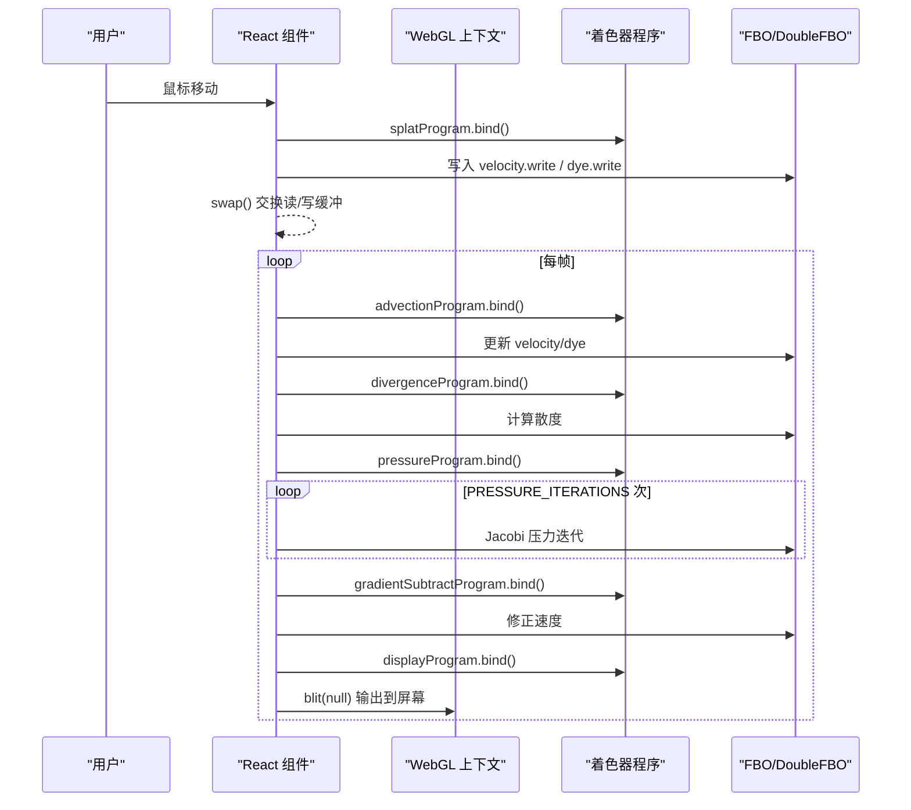
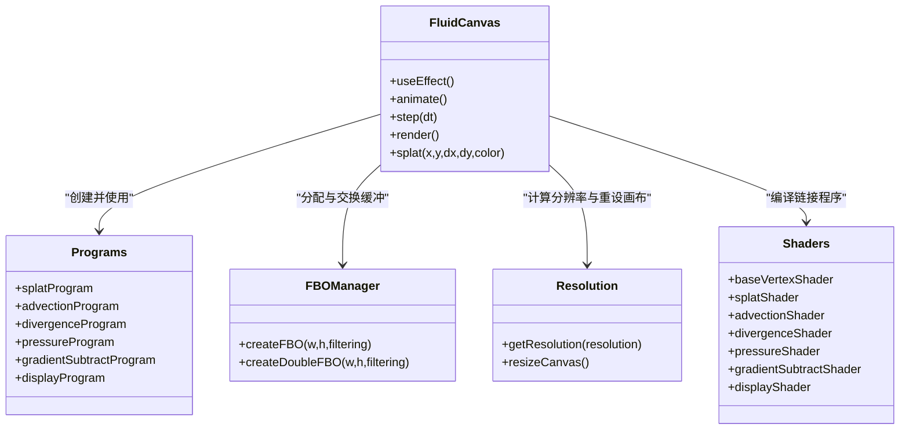

# WebGL渲染优化

<cite>
**本文引用的文件**
- [FluidCanvas.tsx](file://src/sections/FluidCanvas.tsx)
- [README.md](file://README.md)
</cite>

## 目录
1. [简介](#简介)
2. [项目结构](#项目结构)
3. [核心组件](#核心组件)
4. [架构总览](#架构总览)
5. [详细组件分析](#详细组件分析)
6. [依赖关系分析](#依赖关系分析)
7. [性能考量与优化策略](#性能考量与优化策略)
8. [故障排查指南](#故障排查指南)
9. [结论](#结论)
10. [附录](#附录)

## 简介
本指南面向挠荔枝官网的WebGL流体动画系统，聚焦于着色器程序优化、帧缓冲对象(FBO)管理与内存控制、GPU计算优化技巧（半精度浮点纹理、纹理过滤、绘制调用批处理）、关键参数调优（压力迭代次数、消散系数、粒子半径等）、不同设备的降级策略，以及性能监控方法与关键指标分析。目标是帮助开发者在保持视觉质量的前提下，显著提升流畅度并降低资源占用。

## 项目结构
本项目为基于React + TypeScript的前端站点，流体动画由单个React组件实现，包含内嵌GLSL着色器、FBO管理、双缓冲机制、交互注入与渲染循环。

图表来源
- [FluidCanvas.tsx:153-470](file://src/sections/FluidCanvas.tsx#L153-L470)

章节来源
- [FluidCanvas.tsx:153-470](file://src/sections/FluidCanvas.tsx#L153-L470)
- [README.md:20-28](file://README.md#L20-L28)

## 核心组件
- 着色器程序：基础顶点着色器与多个片段着色器（溅射、平流、散度、压力求解、梯度减、显示）。
- FBO与DoubleFBO：用于速度场、密度场、散度场与压力场的读写缓冲与交换。
- 分辨率适配：根据屏幕宽高比与目标分辨率生成模拟与渲染分辨率。
- 动画循环：按时间步长执行平流、散度、压力求解、梯度减、显示绘制；鼠标移动触发溅射注入。
- 可见性控制：使用IntersectionObserver在不可见时暂停渲染。

章节来源
- [FluidCanvas.tsx:5-123](file://src/sections/FluidCanvas.tsx#L5-L123)
- [FluidCanvas.tsx:127-149](file://src/sections/FluidCanvas.tsx#L127-L149)
- [FluidCanvas.tsx:239-278](file://src/sections/FluidCanvas.tsx#L239-L278)
- [FluidCanvas.tsx:288-321](file://src/sections/FluidCanvas.tsx#L288-L321)
- [FluidCanvas.tsx:371-419](file://src/sections/FluidCanvas.tsx#L371-L419)
- [FluidCanvas.tsx:421-452](file://src/sections/FluidCanvas.tsx#L421-L452)

## 架构总览
下图展示了单帧内的数据流与控制流：从输入事件到步进计算再到最终显示。

图表来源
- [FluidCanvas.tsx:344-419](file://src/sections/FluidCanvas.tsx#L344-L419)
- [FluidCanvas.tsx:429-452](file://src/sections/FluidCanvas.tsx#L429-L452)

## 详细组件分析

### 着色器程序与SIM/DYE分辨率调优
- 顶点着色器负责将全屏四边形映射到UV空间，并预计算相邻采样坐标，便于后续片元着色器进行差分与邻域采样。
- 片段着色器分别实现：
  - 溅射：以高斯核向速度与密度场注入扰动。
  - 平流：沿速度场对源纹理进行反推采样，实现对流扩散。
  - 散度：计算速度场的散度，供压力求解使用。
  - 压力求解：Jacobi迭代逐步逼近不可压条件。
  - 梯度减：用压力梯度修正速度场，使其近似无散。
  - 显示：将密度场作为透明度合成到屏幕。
- SIM_RESOLUTION与DYE_RESOLUTION通过getResolution函数结合屏幕宽高比生成实际分辨率，影响每个阶段的像素级计算量与内存占用。

优化要点
- 降低SIM_RESOLUTION可显著减少压力迭代与散度计算的开销，适合低端设备或电池优先场景。
- DYE_RESOLUTION决定最终渲染细节，可在保证视觉质量的同时适度下调以提升性能。
- 建议在不同设备上动态调整这两个参数，并结合FPS反馈自动回退。

章节来源
- [FluidCanvas.tsx:5-123](file://src/sections/FluidCanvas.tsx#L5-L123)
- [FluidCanvas.tsx:288-312](file://src/sections/FluidCanvas.tsx#L288-L312)

### 帧缓冲对象(FBO)管理与内存控制
- FBO封装了纹理与帧缓冲绑定，提供attach方法激活纹理单元并返回索引，避免重复状态设置。
- DoubleFBO维护两个FBO实例，通过swap实现读写缓冲交替，避免在同一帧中同时读写同一纹理导致的未定义行为。
- 纹理类型选择：优先使用半精度浮点(HALF_FLOAT_OES)，若不支持则回退至UNSIGNED_BYTE，兼顾精度与带宽。
- 纹理过滤：速度场与密度场使用线性插值(LINEAR)以获得平滑效果；散度与压力场使用最近邻(NEAREST)以减少不必要的插值开销。
- 纹理包裹模式统一为CLAMP_TO_EDGE，避免边界外采样带来的额外分支。

内存估算与建议
- 每个RGBA纹理占用的显存约为 width × height × 4 字节（全精度）或 width × height × 2 字节（半精度）。
- 当前实现包含速度场、密度场、散度场、压力场共四个主纹理，且速度/密度/压力采用双缓冲，需关注峰值显存占用。
- 建议在低端设备上降低分辨率或关闭半精度线性过滤扩展，必要时回退到更低精度的纹理格式。

章节来源
- [FluidCanvas.tsx:235-278](file://src/sections/FluidCanvas.tsx#L235-L278)
- [FluidCanvas.tsx:305-312](file://src/sections/FluidCanvas.tsx#L305-L312)

### GPU计算优化技巧
- 半精度浮点纹理：通过OES_texture_half_float与OES_texture_half_float_linear扩展，降低带宽与存储成本，提升吞吐。
- 纹理过滤器选择：
  - 速度场与密度场使用LINEAR，确保平滑过渡。
  - 散度与压力场使用NEAREST，减少插值计算。
- 绘制调用批处理：
  - 使用单一全屏四边形与drawElements批量绘制，减少状态切换。
  - 通过attach方法复用纹理单元，避免频繁bindTexture。
- 最小化uniform更新：仅在需要时更新uniform，如dt、dissipation、texelSize等。

章节来源
- [FluidCanvas.tsx:184-185](file://src/sections/FluidCanvas.tsx#L184-L185)
- [FluidCanvas.tsx:239-264](file://src/sections/FluidCanvas.tsx#L239-L264)
- [FluidCanvas.tsx:215-233](file://src/sections/FluidCanvas.tsx#L215-L233)

### 流体模拟参数调优示例
以下为可调参数的作用与调优方向（不直接展示代码内容，仅给出路径参考）：
- 压力迭代次数(PRESSURE_ITERATIONS)：控制不可压条件的收敛程度。数值越高越稳定但更耗时。
  - 参考位置：[FluidCanvas.tsx:164-172](file://src/sections/FluidCanvas.tsx#L164-L172), [FluidCanvas.tsx:399-403](file://src/sections/FluidCanvas.tsx#L399-L403)
- 消散系数(DENSITY_DISSIPATION, VELOCITY_DISSIPATION)：控制密度与速度的衰减速度，影响“烟雾”持久性与拖尾长度。
  - 参考位置：[FluidCanvas.tsx:164-172](file://src/sections/FluidCanvas.tsx#L164-L172), [FluidCanvas.tsx:379-387](file://src/sections/FluidCanvas.tsx#L379-L387)
- 粒子半径(SPLAT_RADIUS)与力度(SPLAT_FORCE)：控制注入扰动的范围与强度，影响交互响应与视觉表现。
  - 参考位置：[FluidCanvas.tsx:164-172](file://src/sections/FluidCanvas.tsx#L164-L172), [FluidCanvas.tsx:344-359](file://src/sections/FluidCanvas.tsx#L344-L359)

章节来源
- [FluidCanvas.tsx:164-172](file://src/sections/FluidCanvas.tsx#L164-L172)
- [FluidCanvas.tsx:344-359](file://src/sections/FluidCanvas.tsx#L344-L359)
- [FluidCanvas.tsx:371-412](file://src/sections/FluidCanvas.tsx#L371-L412)

### 设备降级策略
- 移动端禁用：当窗口宽度小于阈值时跳过WebGL初始化，避免低端设备卡顿。
  - 参考位置：[FluidCanvas.tsx:160-162](file://src/sections/FluidCanvas.tsx#L160-L162)
- DPR限制：将devicePixelRatio上限设为2，防止超高分屏导致过高的渲染负载。
  - 参考位置：[FluidCanvas.tsx:315-321](file://src/sections/FluidCanvas.tsx#L315-L321)
- 可见性检测：使用IntersectionObserver在元素不可见时暂停动画，节省CPU/GPU资源。
  - 参考位置：[FluidCanvas.tsx:421-427](file://src/sections/FluidCanvas.tsx#L421-L427)

章节来源
- [FluidCanvas.tsx:160-162](file://src/sections/FluidCanvas.tsx#L160-L162)
- [FluidCanvas.tsx:315-321](file://src/sections/FluidCanvas.tsx#L315-L321)
- [FluidCanvas.tsx:421-427](file://src/sections/FluidCanvas.tsx#L421-L427)

## 依赖关系分析
组件内部模块之间的依赖关系如下：

图表来源
- [FluidCanvas.tsx:153-470](file://src/sections/FluidCanvas.tsx#L153-L470)
- [FluidCanvas.tsx:5-123](file://src/sections/FluidCanvas.tsx#L5-L123)
- [FluidCanvas.tsx:239-278](file://src/sections/FluidCanvas.tsx#L239-L278)
- [FluidCanvas.tsx:288-321](file://src/sections/FluidCanvas.tsx#L288-L321)

章节来源
- [FluidCanvas.tsx:153-470](file://src/sections/FluidCanvas.tsx#L153-L470)

## 性能考量与优化策略

### 分辨率参数调优
- SIM_RESOLUTION：控制速度场、散度场与压力场的网格分辨率。降低该值能显著减少压力迭代的像素工作量，适合低端设备或省电模式。
- DYE_RESOLUTION：控制密度场渲染分辨率。适当降低可减少最终显示的像素填充压力，同时保持较好的视觉效果。
- 自适应策略：根据设备能力与实时FPS动态调整这两个参数，例如在低FPS时逐步降低SIM_RESOLUTION，再考虑降低DYE_RESOLUTION。

章节来源
- [FluidCanvas.tsx:288-312](file://src/sections/FluidCanvas.tsx#L288-L312)

### FBO与纹理格式选择
- 半精度浮点纹理：优先启用HALF_FLOAT_OES与线性过滤扩展，降低带宽与内存占用。
- 纹理过滤：速度场与密度场使用LINEAR，散度与压力场使用NEAREST，平衡质量与性能。
- 双缓冲机制：DoubleFBO通过swap避免读写冲突，减少同步开销。

章节来源
- [FluidCanvas.tsx:235-278](file://src/sections/FluidCanvas.tsx#L235-L278)

### GPU计算优化
- 绘制调用批处理：使用全屏四边形与drawElements，减少状态切换与驱动开销。
- 纹理单元复用：通过attach方法集中管理纹理绑定，避免频繁bindTexture。
- 最小化uniform更新：仅在必要时更新uniform，减少CPU-GPU同步。

章节来源
- [FluidCanvas.tsx:215-233](file://src/sections/FluidCanvas.tsx#L215-L233)
- [FluidCanvas.tsx:258-264](file://src/sections/FluidCanvas.tsx#L258-L264)

### 关键参数调优建议
- 压力迭代次数：在低端设备上适当减少，以换取更高帧率；高端设备可适当增加以提高稳定性。
- 消散系数：增大消散系数使烟雾更快消失，降低累积效应，有助于维持稳定帧率。
- 粒子半径与力度：减小半径与力度可降低每次注入的计算量，同时保持交互感。

章节来源
- [FluidCanvas.tsx:164-172](file://src/sections/FluidCanvas.tsx#L164-L172)
- [FluidCanvas.tsx:344-359](file://src/sections/FluidCanvas.tsx#L344-L359)
- [FluidCanvas.tsx:371-412](file://src/sections/FluidCanvas.tsx#L371-L412)

### 设备降级策略
- 移动端禁用：在小屏设备上完全跳过WebGL，避免卡顿与耗电。
- DPR上限：限制devicePixelRatio，防止超高分屏带来过高渲染负载。
- 可见性检测：不可见时暂停渲染，节省资源。

章节来源
- [FluidCanvas.tsx:160-162](file://src/sections/FluidCanvas.tsx#L160-L162)
- [FluidCanvas.tsx:315-321](file://src/sections/FluidCanvas.tsx#L315-L321)
- [FluidCanvas.tsx:421-427](file://src/sections/FluidCanvas.tsx#L421-L427)

### 性能监控工具与关键指标
- FPS监控：在动画循环中使用performance.now()计算时间差，统计每秒帧数，作为主要流畅度指标。
  - 参考位置：[FluidCanvas.tsx:429-452](file://src/sections/FluidCanvas.tsx#L429-L452)
- 内存使用分析：通过浏览器开发者工具的Memory面板观察WebGL纹理与帧缓冲的显存占用，评估半精度纹理与分辨率调整的效果。
- GPU利用率统计：使用Performance或GPU Profiler查看绘制调用次数、纹理带宽与着色器执行时间，定位瓶颈。
- 可见性检测有效性：确认IntersectionObserver正确触发，避免后台标签页持续渲染。

章节来源
- [FluidCanvas.tsx:429-452](file://src/sections/FluidCanvas.tsx#L429-L452)
- [FluidCanvas.tsx:421-427](file://src/sections/FluidCanvas.tsx#L421-L427)

## 故障排查指南
- 无法获取WebGL上下文：检查canvas.getContext("webgl")返回值，确保浏览器支持并开启硬件加速。
  - 参考位置：[FluidCanvas.tsx:174-182](file://src/sections/FluidCanvas.tsx#L174-L182)
- 半精度纹理不可用：若OES_texture_half_float扩展缺失，系统将回退到UNSIGNED_BYTE，注意精度下降。
  - 参考位置：[FluidCanvas.tsx:184-185](file://src/sections/FluidCanvas.tsx#L184-185), [FluidCanvas.tsx:236-237](file://src/sections/FluidCanvas.tsx#L236-L237)
- 渲染异常或闪烁：确认DoubleFBO的swap顺序正确，避免在同一帧中同时读写同一缓冲。
  - 参考位置：[FluidCanvas.tsx:266-278](file://src/sections/FluidCanvas.tsx#L266-L278)
- 性能抖动：检查是否频繁更新uniform或重新创建FBO，尽量在初始化阶段完成一次配置。
  - 参考位置：[FluidCanvas.tsx:239-278](file://src/sections/FluidCanvas.tsx#L239-L278)
- 移动端卡顿：确认已启用移动端降级与DPR限制，并在不可见时暂停渲染。
  - 参考位置：[FluidCanvas.tsx:160-162](file://src/sections/FluidCanvas.tsx#L160-L162), [FluidCanvas.tsx:315-321](file://src/sections/FluidCanvas.tsx#L315-L321), [FluidCanvas.tsx:421-427](file://src/sections/FluidCanvas.tsx#L421-L427)

章节来源
- [FluidCanvas.tsx:174-182](file://src/sections/FluidCanvas.tsx#L174-L182)
- [FluidCanvas.tsx:184-185](file://src/sections/FluidCanvas.tsx#L184-185)
- [FluidCanvas.tsx:236-237](file://src/sections/FluidCanvas.tsx#L236-L237)
- [FluidCanvas.tsx:266-278](file://src/sections/FluidCanvas.tsx#L266-L278)
- [FluidCanvas.tsx:160-162](file://src/sections/FluidCanvas.tsx#L160-L162)
- [FluidCanvas.tsx:315-321](file://src/sections/FluidCanvas.tsx#L315-L321)
- [FluidCanvas.tsx:421-427](file://src/sections/FluidCanvas.tsx#L421-L427)

## 结论
通过对分辨率参数、FBO与纹理格式、GPU计算流程的系统性优化，可以在保证视觉质量的同时显著提升WebGL流体动画的性能。结合设备降级策略与性能监控工具，可实现跨设备的稳定体验。建议在生产环境中引入自适应分辨率与动态参数调节，依据实时FPS与资源占用进行闭环优化。

## 附录
- 技术栈概览：React 19、TypeScript、Vite 7、Tailwind CSS 3、shadcn/ui。
  - 参考位置：[README.md:20-28](file://README.md#L20-L28)