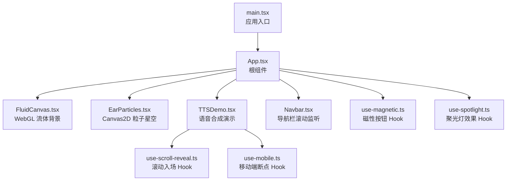
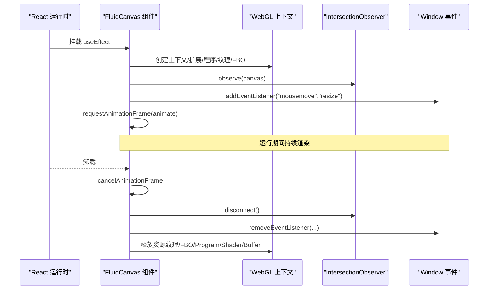
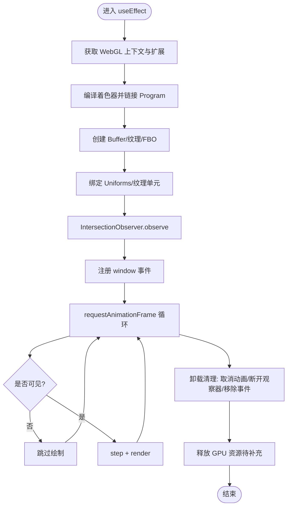
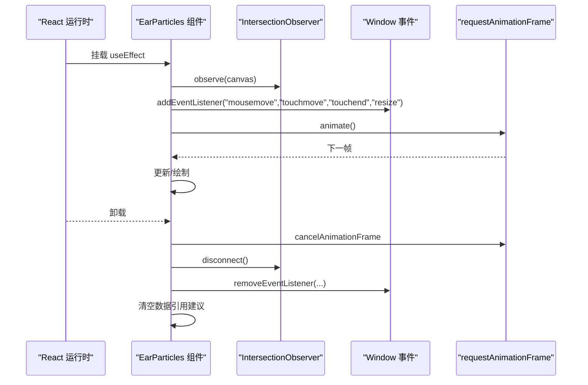
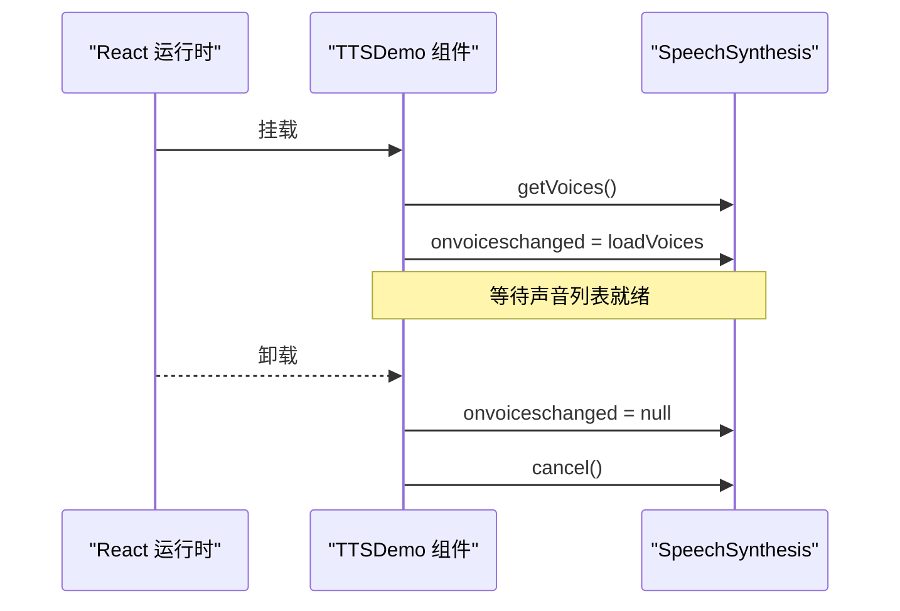
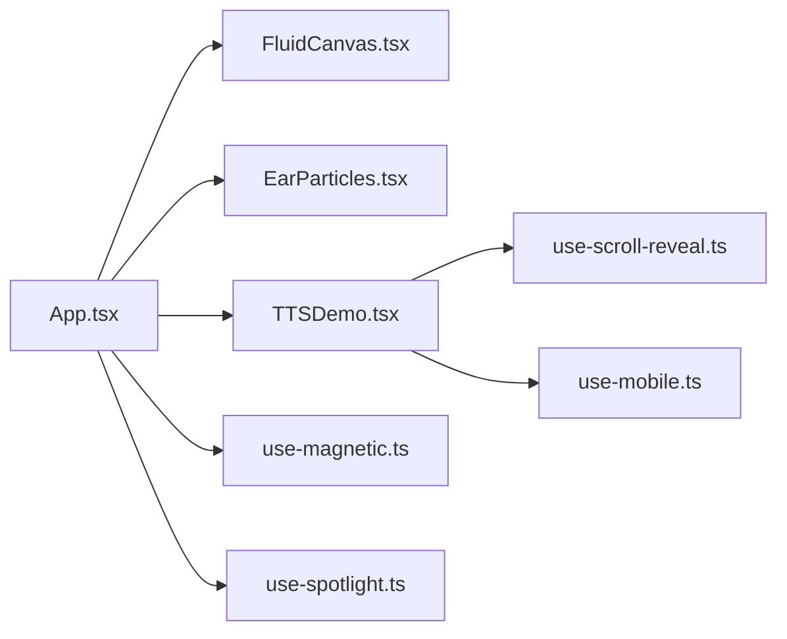

# 内存管理和清理

<cite>
**本文引用的文件**   
- [README.md](file://README.md)
- [main.tsx](file://src/main.tsx)
- [App.tsx](file://src/App.tsx)
- [FluidCanvas.tsx](file://src/sections/FluidCanvas.tsx)
- [EarParticles.tsx](file://src/sections/EarParticles.tsx)
- [TTSDemo.tsx](file://src/sections/TTSDemo.tsx)
- [use-mobile.ts](file://src/hooks/use-mobile.ts)
- [use-scroll-reveal.ts](file://src/hooks/use-scroll-reveal.ts)
- [use-magnetic.ts](file://src/hooks/use-magnetic.ts)
- [use-spotlight.ts](file://src/hooks/use-spotlight.ts)
- [Navbar.tsx](file://src/sections/Navbar.tsx)
</cite>

## 目录
1. [简介](#简介)
2. [项目结构](#项目结构)
3. [核心组件](#核心组件)
4. [架构总览](#架构总览)
5. [详细组件分析](#详细组件分析)
6. [依赖关系分析](#依赖关系分析)
7. [性能与内存优化建议](#性能与内存优化建议)
8. [故障排查指南](#故障排查指南)
9. [结论](#结论)
10. [附录](#附录)

## 简介
本指南面向挠荔枝官网的内存管理与资源清理，聚焦以下目标：
- WebGL 资源的正确释放（纹理、帧缓冲、着色器程序）
- React 组件生命周期中的内存泄漏防护（事件监听器移除、定时器/动画循环清理）
- 自定义 Hooks 的内存管理最佳实践（useEffect 清理函数实现）
- JavaScript 垃圾回收机制与常见泄漏场景及避免方法
- 使用 Chrome DevTools Memory 面板与 Performance 进行监控与分析
- 大型应用中的内存优化策略（对象池、增量更新等）

## 项目结构
本项目采用基于功能分层的组织方式：页面区块位于 sections，通用交互逻辑封装在 hooks，UI 基础组件位于 components/ui。根入口通过 main.tsx 挂载 App，App 组合多个页面区块，其中包含两个重绘型可视化模块：流体背景（WebGL）与粒子星空（Canvas 2D）。

图表来源
- [main.tsx:1-11](file://src/main.tsx#L1-L11)
- [App.tsx:1-30](file://src/App.tsx#L1-L30)
- [FluidCanvas.tsx:153-470](file://src/sections/FluidCanvas.tsx#L153-L470)
- [EarParticles.tsx:104-560](file://src/sections/EarParticles.tsx#L104-L560)
- [TTSDemo.tsx:1-344](file://src/sections/TTSDemo.tsx#L1-L344)
- [Navbar.tsx:33-34](file://src/sections/Navbar.tsx#L33-L34)
- [use-scroll-reveal.ts:1-34](file://src/hooks/use-scroll-reveal.ts#L1-L34)
- [use-mobile.ts:1-19](file://src/hooks/use-mobile.ts#L1-L19)
- [use-magnetic.ts:1-32](file://src/hooks/use-magnetic.ts#L1-L32)
- [use-spotlight.ts:1-21](file://src/hooks/use-spotlight.ts#L1-L21)

章节来源
- [README.md:1-73](file://README.md#L1-L73)
- [main.tsx:1-11](file://src/main.tsx#L1-L11)
- [App.tsx:1-30](file://src/App.tsx#L1-L30)

## 核心组件
- FluidCanvas（WebGL 流体背景）
  - 创建 WebGL 上下文、编译着色器、链接程序、创建并绑定纹理与帧缓冲、维护双缓冲 FBO、注册窗口事件与 IntersectionObserver、启动 requestAnimationFrame 动画循环。
  - 关键风险点：未显式销毁 WebGL 资源（纹理、FBO、Program、Shader、Buffer），可能导致 GPU 内存泄漏；事件与观察器需在卸载时清理。
- EarParticles（Canvas2D 粒子星空）
  - 使用 Canvas2D 绘制大量粒子、流星与鼠标拖尾，维护动画循环与多类事件监听，使用 IntersectionObserver 控制可见性以节省 CPU/GPU。
  - 关键风险点：若未在清理中取消动画与移除事件，将导致持续渲染与内存占用。
- TTSDemo（语音合成演示）
  - 使用 SpeechSynthesis API，加载声音列表、设置 onvoiceschanged 回调、在卸载时 cancel 朗读。
  - 关键风险点：onvoiceschanged 需解绑；频繁创建 SpeechSynthesisUtterance 应确保及时释放引用。
- 通用 Hooks
  - use-mobile：监听 matchMedia change，提供响应式断点状态。
  - use-scroll-reveal：IntersectionObserver 触发一次后 unobserve，并在清理中 disconnect。
  - use-magnetic / use-spotlight：纯 UI 交互，无全局副作用，内存风险较低。

章节来源
- [FluidCanvas.tsx:153-470](file://src/sections/FluidCanvas.tsx#L153-L470)
- [EarParticles.tsx:104-560](file://src/sections/EarParticles.tsx#L104-L560)
- [TTSDemo.tsx:56-98](file://src/sections/TTSDemo.tsx#L56-L98)
- [use-mobile.ts:1-19](file://src/hooks/use-mobile.ts#L1-L19)
- [use-scroll-reveal.ts:1-34](file://src/hooks/use-scroll-reveal.ts#L1-L34)
- [use-magnetic.ts:1-32](file://src/hooks/use-magnetic.ts#L1-L32)
- [use-spotlight.ts:1-21](file://src/hooks/use-spotlight.ts#L1-L21)

## 架构总览
从内存视角看，系统由“渲染管线”和“交互管线”组成：
- 渲染管线：WebGL 流体与 Canvas2D 粒子各自维护独立的生命周期与资源集合，均受 IntersectionObserver 控制以减少不可见时的开销。
- 交互管线：window 级事件（mousemove/touchmove/resize/scroll）与浏览器 API（SpeechSynthesis）需要严格配对添加与移除。

图表来源
- [FluidCanvas.tsx:156-460](file://src/sections/FluidCanvas.tsx#L156-L460)

## 详细组件分析

### WebGL 流体背景（FluidCanvas）
- 初始化流程
  - 获取 WebGL 上下文与半浮点纹理扩展
  - 编译顶点/片段着色器并链接为 Program
  - 创建全屏四边形 Buffer
  - 创建 FBO/DoubleFBO（速度场、密度场、散度、压力）
  - 绑定 Uniforms 与纹理单元
- 运行期
  - 监听 mousemove 与 resize
  - 使用 IntersectionObserver 控制可见性
  - requestAnimationFrame 驱动 step/render 流水线
- 清理现状
  - 已取消动画、断开观察器、移除 window 事件
  - 缺失：未显式调用 gl.deleteTexture/gl.deleteFramebuffer/gl.deleteProgram/gl.deleteShader/gl.deleteBuffer 等释放 GPU 资源

图表来源
- [FluidCanvas.tsx:156-460](file://src/sections/FluidCanvas.tsx#L156-L460)

章节来源
- [FluidCanvas.tsx:156-460](file://src/sections/FluidCanvas.tsx#L156-L460)

### Canvas2D 粒子星空（EarParticles）
- 初始化流程
  - 获取 Canvas2D 上下文
  - 使用 IntersectionObserver 控制可见性
  - 初始化粒子、流星、鼠标轨迹等数据结构
  - 注册 window 事件（mousemove/touchmove/touchend/resize）
  - 启动 requestAnimationFrame 循环
- 清理现状
  - 已取消动画、断开观察器、移除所有 window 事件
  - Canvas2D 资源通常随 DOM 节点回收，但仍建议在卸载时清空数组引用以降低 GC 压力

图表来源
- [EarParticles.tsx:110-550](file://src/sections/EarParticles.tsx#L110-L550)

章节来源
- [EarParticles.tsx:110-550](file://src/sections/EarParticles.tsx#L110-L550)

### 语音合成演示（TTSDemo）
- 关键点
  - 异步加载 voices，设置 onvoiceschanged 回调，并在卸载时置空
  - 在卸载时调用 speechSynthesis.cancel() 停止播放
  - speak 中创建 SpeechSynthesisUtterance 并设置 onboundary/onend/onerror
- 清理现状
  - 已处理 onvoiceschanged 与 cancel，但建议在 speak 前统一 cancel，避免并发实例残留

图表来源
- [TTSDemo.tsx:56-98](file://src/sections/TTSDemo.tsx#L56-L98)

章节来源
- [TTSDemo.tsx:56-98](file://src/sections/TTSDemo.tsx#L56-L98)

### 通用 Hooks 内存要点
- use-mobile
  - 使用 matchMedia.addEventListener("change", ...)，在清理中 removeEventListener，符合规范
- use-scroll-reveal
  - IntersectionObserver.observe 后在清理中 disconnect，且触发一次后 unobserve，避免重复观测
- use-magnetic / use-spotlight
  - 仅操作 DOM 样式属性，无全局副作用，无需额外清理

章节来源
- [use-mobile.ts:8-16](file://src/hooks/use-mobile.ts#L8-L16)
- [use-scroll-reveal.ts:12-30](file://src/hooks/use-scroll-reveal.ts#L12-L30)
- [use-magnetic.ts:1-32](file://src/hooks/use-magnetic.ts#L1-L32)
- [use-spotlight.ts:1-21](file://src/hooks/use-spotlight.ts#L1-L21)

## 依赖关系分析
- 组件耦合
  - App 组合各区块，彼此低耦合
  - 视觉区块（FluidCanvas、EarParticles）各自管理自身生命周期与资源
- 外部依赖
  - WebGL/Canvas2D 渲染 API
  - Window 事件与 IntersectionObserver
  - SpeechSynthesis 浏览器 API

图表来源
- [App.tsx:1-30](file://src/App.tsx#L1-L30)
- [FluidCanvas.tsx:153-470](file://src/sections/FluidCanvas.tsx#L153-L470)
- [EarParticles.tsx:104-560](file://src/sections/EarParticles.tsx#L104-L560)
- [TTSDemo.tsx:1-344](file://src/sections/TTSDemo.tsx#L1-L344)
- [use-scroll-reveal.ts:1-34](file://src/hooks/use-scroll-reveal.ts#L1-L34)
- [use-mobile.ts:1-19](file://src/hooks/use-mobile.ts#L1-L19)
- [use-magnetic.ts:1-32](file://src/hooks/use-magnetic.ts#L1-L32)
- [use-spotlight.ts:1-21](file://src/hooks/use-spotlight.ts#L1-L21)

章节来源
- [App.tsx:1-30](file://src/App.tsx#L1-L30)

## 性能与内存优化建议
- WebGL 资源释放清单（针对 FluidCanvas）
  - 删除纹理：gl.deleteTexture(texture)
  - 删除帧缓冲：gl.deleteFramebuffer(fbo)
  - 删除程序：gl.deleteProgram(program)
  - 删除着色器：gl.deleteShader(shader)
  - 删除缓冲区：gl.deleteBuffer(buffer)
  - 建议在 useEffect 返回的清理函数中集中执行，或在组件卸载钩子中统一释放
- Canvas2D 内存优化（针对 EarParticles）
  - 在清理中清空大数组引用（stars/dust/meteors/trails），帮助 GC 更快回收
  - 保持 passive 事件监听，减少主线程阻塞
- 动画与可见性
  - 使用 IntersectionObserver 控制不可见时暂停绘制（当前已实现）
  - 对长列表或复杂场景，考虑节流/降采样渲染
- 事件与观察者
  - 确保每个 addEventListener 都有对应的 removeEventListener
  - IntersectionObserver 在不再需要时务必 disconnect
- 语音合成
  - 在 speak 前先 cancel，避免并发实例
  - 在卸载时置空 onvoiceschanged 并 cancel
- 大型应用策略
  - 对象池：复用频繁创建的对象（如粒子、流星），减少分配抖动
  - 增量更新：按区域或层级分批更新，降低单帧压力
  - 懒加载与按需初始化：仅在可视区域内初始化重型资源
  - 资源去重与缓存：共享 Program/纹理等资源，避免重复创建

[本节为通用指导，不直接分析具体文件]

## 故障排查指南
- 现象：切换路由或隐藏区块后内存持续增长
  - 检查是否存在未移除的事件监听器与未断开的观察器
  - 确认 WebGL 资源是否在清理中释放
- 现象：页面长时间运行后卡顿
  - 使用 Chrome DevTools Memory 面板录制 Heap Snapshot，对比两次快照查找增长对象
  - 使用 Performance 面板查看长任务与掉帧原因
- 现象：语音仍在后台播放
  - 确认卸载时调用了 cancel，并确保 speak 前会先 cancel
- 常用工具
  - Memory 面板：Heap Snapshot、Allocation instrumentation on timeline
  - Performance 面板：帧率、主线程耗时、布局与绘制成本
  - 网络面板：检查是否有异常的资源加载导致内存膨胀

章节来源
- [Navbar.tsx:33-34](file://src/sections/Navbar.tsx#L33-L34)

## 结论
本项目在事件与观察器的清理方面已有良好实践，但在 WebGL 资源释放上仍需完善。建议优先补齐 FluidCanvas 的 GPU 资源清理逻辑，并对 Canvas2D 的大对象进行引用清理。结合 Chrome DevTools 的 Memory 与 Performance 面板进行定期巡检，配合对象池与增量更新策略，可显著提升大型应用的内存稳定性与流畅度。

[本节为总结性内容，不直接分析具体文件]

## 附录
- 术语
  - FBO：Frame Buffer Object，离屏渲染目标
  - DoubleFBO：双缓冲 FBO，用于读写交替
  - Program：着色器程序，由顶点与片段着色器链接而成
- 参考路径
  - WebGL 初始化与清理位置：[FluidCanvas.tsx:156-460](file://src/sections/FluidCanvas.tsx#L156-L460)
  - Canvas2D 动画与清理位置：[EarParticles.tsx:110-550](file://src/sections/EarParticles.tsx#L110-L550)
  - 语音合成清理位置：[TTSDemo.tsx:56-98](file://src/sections/TTSDemo.tsx#L56-L98)
  - 滚动观察器清理位置：[use-scroll-reveal.ts:12-30](file://src/hooks/use-scroll-reveal.ts#L12-L30)
  - 移动端断点监听清理位置：[use-mobile.ts:8-16](file://src/hooks/use-mobile.ts#L8-L16)