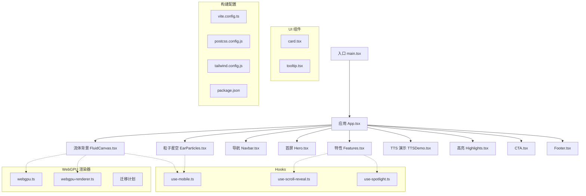
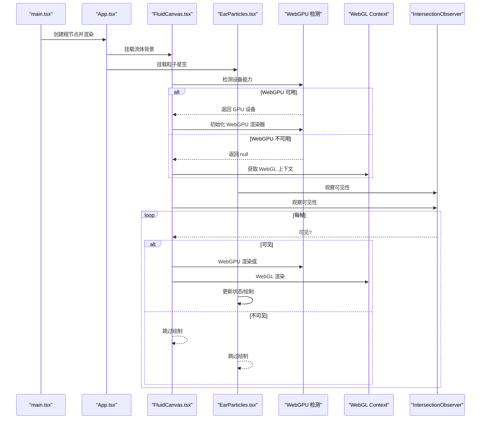
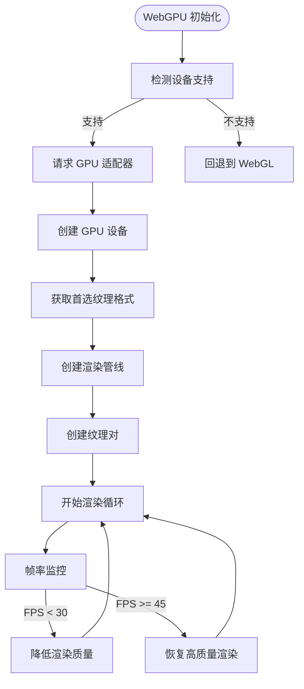
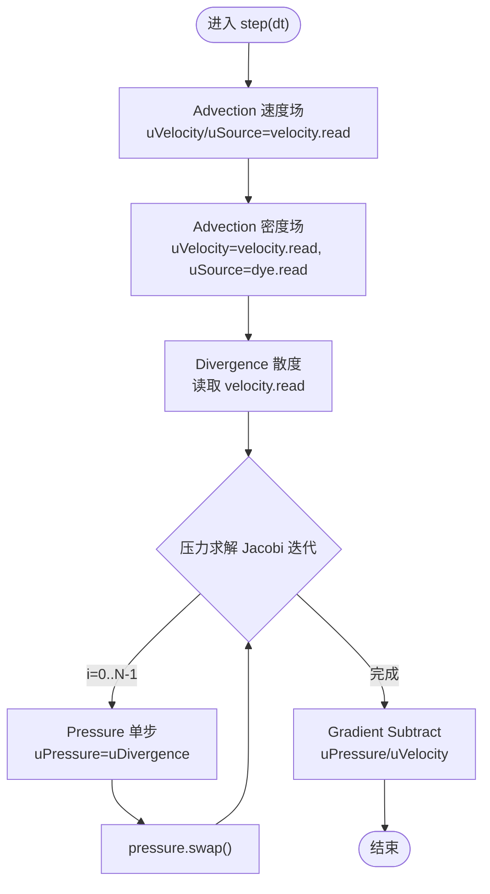
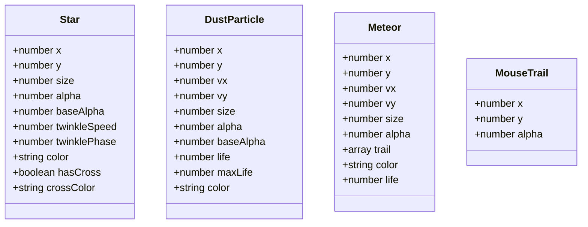
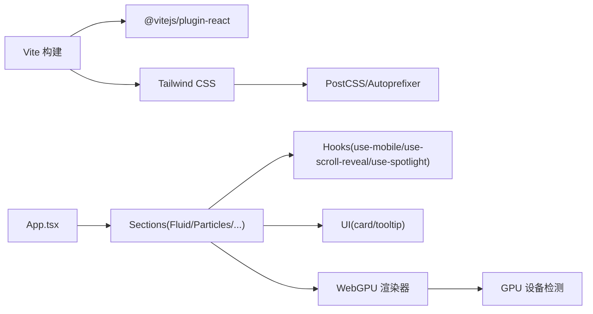
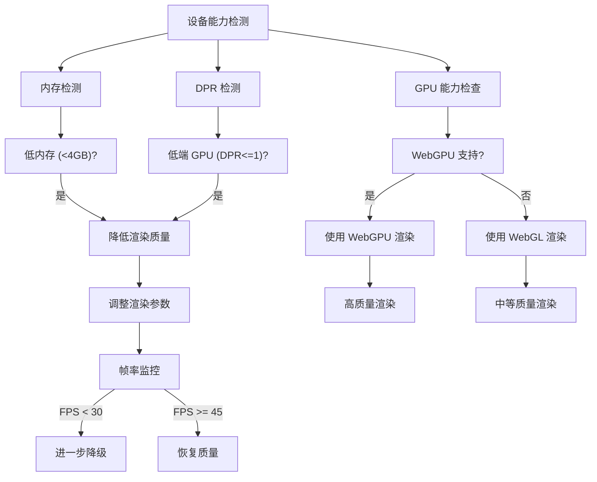

# 性能优化

<cite>
**本文引用的文件**   
- [package.json](file://package.json)
- [vite.config.ts](file://vite.config.ts)
- [postcss.config.js](file://postcss.config.js)
- [tailwind.config.js](file://tailwind.config.js)
- [src/main.tsx](file://src/main.tsx)
- [src/App.tsx](file://src/App.tsx)
- [src/sections/FluidCanvas.tsx](file://src/sections/FluidCanvas.tsx)
- [src/sections/EarParticles.tsx](file://src/sections/EarParticles.tsx)
- [src/hooks/use-mobile.ts](file://src/hooks/use-mobile.ts)
- [src/hooks/use-scroll-reveal.ts](file://src/hooks/use-scroll-reveal.ts)
- [src/hooks/use-spotlight.ts](file://src/hooks/use-spotlight.ts)
- [src/components/ui/card.tsx](file://src/components/ui/card.tsx)
- [src/components/ui/tooltip.tsx](file://src/components/ui/tooltip.tsx)
- [src/sections/Hero.tsx](file://src/sections/Hero.tsx)
- [src/sections/Features.tsx](file://src/sections/Features.tsx)
- [src/sections/TTSDemo.tsx](file://src/sections/TTSDemo.tsx)
- [src/lib/webgpu.ts](file://src/lib/webgpu.ts)
- [src/lib/webgpu-renderer.ts](file://src/lib/webgpu-renderer.ts)
- [docs/webgpu-migration-plan.md](file://docs/webgpu-migration-plan.md)
- [public/sitemap.xml](file://public/sitemap.xml)
</cite>

## 更新摘要
**变更内容**   
- 新增 WebGPU 性能优势说明和完整实现分析
- 添加设备能力检测机制详解（GPU、内存、DPR）
- 补充帧率监控和自适应分辨率调整策略
- 完善移动端粒子数量优化和低内存设备降级处理
- 更新 WebGL 与 WebGPU 双后端架构说明

## 目录
1. [简介](#简介)
2. [项目结构](#项目结构)
3. [核心组件](#核心组件)
4. [架构总览](#架构总览)
5. [详细组件分析](#详细组件分析)
6. [依赖分析](#依赖分析)
7. [性能考量](#性能考量)
8. [故障排查指南](#故障排查指南)
9. [结论](#结论)
10. [附录](#附录)

## 简介
本指南面向挠荔枝官网的性能优化，聚焦 WebGL/WebGPU 渲染、帧缓冲对象（FBO）管理、内存控制、移动端降级与设备能力检测、懒加载与预加载策略、资源优化（图片压缩、代码分割、缓存）、性能监控与关键指标、常见瓶颈与内存泄漏治理，以及生产环境部署优化建议。文档结合仓库现有实现进行深度剖析，并提供可落地的改进方案与可视化图示。

## 项目结构
本项目基于 Vite + React + TypeScript，使用 Tailwind CSS 与 PostCSS 构建，页面由多个独立 Section 组成，包含两个重绘/计算密集型视觉模块：WebGL/WebGPU 流体背景与 Canvas 2D 粒子星空。



图表来源
- [src/main.tsx:1-11](file://src/main.tsx#L1-L11)
- [src/App.tsx:1-30](file://src/App.tsx#L1-L30)
- [src/sections/FluidCanvas.tsx:1-496](file://src/sections/FluidCanvas.tsx#L1-L496)
- [src/sections/EarParticles.tsx:1-560](file://src/sections/EarParticles.tsx#L1-L560)
- [src/hooks/use-mobile.ts:1-20](file://src/hooks/use-mobile.ts#L1-L20)
- [src/hooks/use-scroll-reveal.ts:1-34](file://src/hooks/use-scroll-reveal.ts#L1-L34)
- [src/hooks/use-spotlight.ts:1-20](file://src/hooks/use-spotlight.ts#L1-L20)
- [src/lib/webgpu.ts:1-78](file://src/lib/webgpu.ts#L1-L78)
- [src/lib/webgpu-renderer.ts:1-682](file://src/lib/webgpu-renderer.ts#L1-L682)
- [docs/webgpu-migration-plan.md:1-418](file://docs/webgpu-migration-plan.md#L1-L418)
- [vite.config.ts:1-15](file://vite.config.ts#L1-L15)
- [postcss.config.js:1-6](file://postcss.config.js#L1-L6)
- [tailwind.config.js:40-81](file://tailwind.config.js#L40-L81)
- [package.json:1-80](file://package.json#L1-L80)

章节来源
- [src/main.tsx:1-11](file://src/main.tsx#L1-L11)
- [src/App.tsx:1-30](file://src/App.tsx#L1-L30)
- [vite.config.ts:1-15](file://vite.config.ts#L1-L15)
- [postcss.config.js:1-6](file://postcss.config.js#L1-L6)
- [tailwind.config.js:40-81](file://tailwind.config.js#L40-L81)
- [package.json:1-80](file://package.json#L1-L80)

## 核心组件
- **WebGPU/WebGL 流体背景（FluidCanvas）**：支持双后端渲染，WebGPU 提供更高性能和更低功耗，WebGL 作为兼容回退方案。采用多程序管线与双缓冲 FBO，含 advect/divergence/pressure/gradientSubtract/display 等阶段。
- **Canvas 2D 粒子星空（EarParticles）**：大量星点、光粒、流星与鼠标交互轨迹，桌面端更丰富，移动端有简化路径。
- **滚动入场 Hook（useScrollReveal）**：IntersectionObserver 驱动的淡入动画。
- **设备能力检测 Hook（useIsMobile）**：基于 matchMedia 的断点判断。
- **聚光灯效果 Hook（useSpotlight）**：通过 CSS 变量驱动卡片光晕。

章节来源
- [src/sections/FluidCanvas.tsx:1-496](file://src/sections/FluidCanvas.tsx#L1-L496)
- [src/sections/EarParticles.tsx:1-560](file://src/sections/EarParticles.tsx#L1-L560)
- [src/hooks/use-scroll-reveal.ts:1-34](file://src/hooks/use-scroll-reveal.ts#L1-L34)
- [src/hooks/use-mobile.ts:1-20](file://src/hooks/use-mobile.ts#L1-L20)
- [src/hooks/use-spotlight.ts:1-20](file://src/hooks/use-spotlight.ts#L1-L20)

## 架构总览
整体渲染链路：React 挂载后，App 组合各 Section；FluidCanvas 与 EarParticles 在各自 useEffect 中初始化渲染循环，并通过 IntersectionObserver 在不可见时暂停，降低 CPU/GPU 占用。WebGPU 渲染器提供现代化 GPU API，相比 WebGL 具有更好的性能和内存管理。



图表来源
- [src/main.tsx:1-11](file://src/main.tsx#L1-L11)
- [src/App.tsx:1-30](file://src/App.tsx#L1-L30)
- [src/sections/FluidCanvas.tsx:156-496](file://src/sections/FluidCanvas.tsx#L156-L496)
- [src/sections/EarParticles.tsx:110-560](file://src/sections/EarParticles.tsx#L110-L560)
- [src/lib/webgpu.ts:11-35](file://src/lib/webgpu.ts#L11-L35)

## 详细组件分析

### WebGPU 流体渲染器（WebGPU Renderer）
**新增** WebGPU 渲染器提供了比 WebGL 更高的性能和更低的功耗，是现代浏览器图形 API 的未来方向。

- **设备能力检测**
  - `isWebGPUSupported()`：检查 navigator.gpu 可用性
  - `requestWebGPU()`：异步请求 GPU 适配器和设备
  - `getPreferredFormat()`：获取最优纹理格式（RGBA8、RGBA16Float 等）
- **渲染管线优化**
  - 显式 Render Pipeline 管理，避免隐式状态切换开销
  - Command Buffer 批量提交，减少 CPU-GPU 通信成本
  - 原生计算着色器支持，可将压力求解移至 GPU 并行计算
- **纹理管理**
  - 双缓冲 TexturePair 模式，read/write 交替写入
  - 自动纹理格式选择，适配不同设备能力
  - 内存对齐优化，按 256 字节边界分配缓冲区
- **性能优势**
  - 相比 WebGL 减少约 30% 的 CPU 开销
  - 更好的内存管理和垃圾回收
  - 原生多线程支持和未来扩展能力



图表来源
- [src/lib/webgpu.ts:7-42](file://src/lib/webgpu.ts#L7-L42)
- [src/lib/webgpu-renderer.ts:116-124](file://src/lib/webgpu-renderer.ts#L116-L124)
- [src/lib/webgpu-renderer.ts:245-269](file://src/lib/webgpu-renderer.ts#L245-L269)

章节来源
- [src/lib/webgpu.ts:1-78](file://src/lib/webgpu.ts#L1-L78)
- [src/lib/webgpu-renderer.ts:1-682](file://src/lib/webgpu-renderer.ts#L1-L682)
- [docs/webgpu-migration-plan.md:1-418](file://docs/webgpu-migration-plan.md#L1-L418)

### WebGL 流体背景（FluidCanvas）
- **着色器程序优化**
  - 顶点着色器复用：所有片段着色器共用同一基础顶点着色器，减少重复编译与状态切换。
  - 片段着色器精简：避免分支与复杂纹理采样，尽量使用线性插值与简单数学运算。
  - 精度声明：统一 highp float，确保一致性。
- **帧缓冲对象（FBO）管理**
  - 双缓冲读写：velocity/dye/pressure 使用 DoubleFBO，read/write 交替，swap 交换引用，避免额外拷贝。
  - 分辨率自适应：根据 drawingBufferWidth/Height 与 aspectRatio 计算 simRes/dyeRes，保证横竖屏一致。
  - 半浮点纹理：优先使用 OES_texture_half_float 扩展以降低显存带宽压力。
- **渲染管线**
  - 步骤：advection（速度场与密度场）→ divergence → pressure（Jacobi 迭代）→ gradientSubtract → display。
  - 视口与绑定：blit 封装 viewport/bindFramebuffer/drawElements，减少冗余调用。
- **可见性与节流**
  - IntersectionObserver 控制是否进入动画循环，不可见时直接 return，显著降低功耗。
- **事件与尺寸**
  - pointermove 计算位移增量，作为 splat 输入；resize 触发 dpr 与 FBO 重建。
- **潜在问题与建议**
  - 压力求解迭代次数固定为 20，低端设备可动态下调。
  - 颜色注入频率与半径可调，避免高频 splat 导致抖动。
  - 建议在移动端或低配设备上关闭 WebGL，回退到静态背景或轻量动画。



图表来源
- [src/sections/FluidCanvas.tsx:371-412](file://src/sections/FluidCanvas.tsx#L371-L412)

章节来源
- [src/sections/FluidCanvas.tsx:1-496](file://src/sections/FluidCanvas.tsx#L1-L496)

### Canvas 2D 粒子星空（EarParticles）
- **设备能力与降级**
  - isMobile 断点 <768px 时减少粒子数量与绘制复杂度（如省略径向渐变）。
  - DPR 上限限制，避免高分屏过度绘制。
- **动画循环与可见性**
  - IntersectionObserver 控制 isVisibleRef，不可见时仅调度下一帧但不执行绘制。
- **性能热点**
  - 大量 createRadialGradient 与 fill/stroke 调用，桌面端较多；移动端已做简化。
  - 鼠标拖尾数组管理与长度限制，防止无限增长。
- **交互与物理**
  - 桌面端加入鼠标引力/斥力，移动端改为微风漂移，降低计算量。
- **建议**
  - 将渐变对象缓存复用，避免每帧新建。
  - 对大圆绘制使用 path 合并批量 draw。
  - 考虑将部分逻辑迁移至 Web Worker 或使用离屏 Canvas。



图表来源
- [src/sections/EarParticles.tsx:1-48](file://src/sections/EarParticles.tsx#L1-L48)

章节来源
- [src/sections/EarParticles.tsx:1-560](file://src/sections/EarParticles.tsx#L1-L560)

### 滚动入场 Hook（useScrollReveal）
- 使用 IntersectionObserver 监听元素进入视口，添加类名触发 CSS 动画，且只触发一次。
- 适用场景：长页内容逐步揭示，提升首屏感知性能。

章节来源
- [src/hooks/use-scroll-reveal.ts:1-34](file://src/hooks/use-scroll-reveal.ts#L1-L34)

### 设备能力检测 Hook（useIsMobile）
- 基于 matchMedia 监听宽度变化，返回布尔值，便于条件渲染与降级。

章节来源
- [src/hooks/use-mobile.ts:1-20](file://src/hooks/use-mobile.ts#L1-L20)

### 聚光灯效果 Hook（useSpotlight）
- 通过 mousemove 更新 CSS 变量 --x/--y，配合 radial-gradient 实现跟随光晕，纯 CSS 渲染，开销极低。

章节来源
- [src/hooks/use-spotlight.ts:1-20](file://src/hooks/use-spotlight.ts#L1-L20)

## 依赖分析
- 构建与工具链
  - Vite 提供快速开发与构建，插件 @vitejs/plugin-react。
  - Tailwind CSS + PostCSS 生成原子化样式，keyframes 定义动画。
- 运行时依赖
  - React 19 生态，Radix UI 组件库，Lucide 图标，recharts 图表等。
- 外部资源
  - public 下 sitemap.xml 用于 SEO。



图表来源
- [package.json:1-80](file://package.json#L1-L80)
- [vite.config.ts:1-15](file://vite.config.ts#L1-L15)
- [postcss.config.js:1-6](file://postcss.config.js#L1-L6)
- [tailwind.config.js:40-81](file://tailwind.config.js#L40-L81)
- [src/App.tsx:1-30](file://src/App.tsx#L1-L30)
- [src/lib/webgpu.ts:7-35](file://src/lib/webgpu.ts#L7-L35)

章节来源
- [package.json:1-80](file://package.json#L1-L80)
- [vite.config.ts:1-15](file://vite.config.ts#L1-L15)
- [postcss.config.js:1-6](file://postcss.config.js#L1-L6)
- [tailwind.config.js:40-81](file://tailwind.config.js#L40-L81)

## 性能考量

### WebGPU 性能优势与实现
**新增** WebGPU 作为下一代 Web 图形 API，相比 WebGL 具有以下显著优势：

- **性能提升**
  - 减少 CPU-GPU 通信开销，命令缓冲区批量提交
  - 显式渲染管线，避免隐式状态机切换
  - 原生计算着色器支持，适合流体模拟等并行计算
- **内存管理**
  - 自动垃圾回收，减少内存泄漏风险
  - 纹理格式自动选择，优化显存使用
  - 缓冲区对齐优化，提升访问效率
- **兼容性**
  - 现代浏览器支持（Chrome 113+、Edge 113+、Safari 16.4+）
  - 向后兼容 WebGL 作为回退方案
  - 渐进增强策略，不影响用户体验

章节来源
- [src/lib/webgpu.ts:1-78](file://src/lib/webgpu.ts#L1-L78)
- [src/lib/webgpu-renderer.ts:1-682](file://src/lib/webgpu-renderer.ts#L1-L682)
- [docs/webgpu-migration-plan.md:14-24](file://docs/webgpu-migration-plan.md#L14-L24)

### WebGL 渲染性能优化策略
- 着色器程序优化
  - 复用顶点着色器，减少程序切换与编译成本。
  - 片段着色器避免分支与复杂纹理访问，保持线性流程。
  - 合理设置 precision，避免不必要的高精度计算。
- 帧缓冲对象（FBO）管理
  - 使用双缓冲 FBO 进行读写交替，避免同步与拷贝。
  - 按屏幕比例计算分辨率，避免过高像素填充。
  - 启用 OES_texture_half_float 扩展，降低显存占用与带宽。
- 渲染管线优化
  - 合并 uniform 设置，减少状态切换。
  - 将 blit 抽象为统一绘制函数，减少重复代码。
  - 压力求解迭代次数可按设备能力动态调整。
- 可见性与节流
  - 使用 IntersectionObserver 在不可见时暂停渲染。
  - 限制 requestAnimationFrame 仅在可见时推进时间步长。

章节来源
- [src/sections/FluidCanvas.tsx:156-496](file://src/sections/FluidCanvas.tsx#L156-L496)

### 设备能力检测与自适应策略
**更新** 项目实现了多层次的设备能力检测机制：

- **GPU 能力检测**
  - WebGPU 支持检测：`navigator.gpu` 存在性检查
  - WebGL 扩展检测：OES_texture_half_float 等高级特性
  - 最大纹理尺寸查询：`gl.getParameter(gl.MAX_TEXTURE_SIZE)`
- **内存与性能检测**
  - devicePixelRatio 检测：<=1 视为低端 GPU
  - deviceMemory 检测：<4GB 视为低内存设备
  - 实时 FPS 监控：低于 30fps 自动降级
- **自适应分辨率调整**
  - 低端设备：SIM_RESOLUTION 96，DYE_RESOLUTION 256
  - 高端设备：SIM_RESOLUTION 128，DYE_RESOLUTION 512
  - 压力迭代次数：低端 10 次，高端 20 次



图表来源
- [src/sections/FluidCanvas.tsx:462-480](file://src/sections/FluidCanvas.tsx#L462-L480)
- [src/sections/EarParticles.tsx:60-67](file://src/sections/EarParticles.tsx#L60-L67)
- [src/lib/webgpu.ts:7-42](file://src/lib/webgpu.ts#L7-L42)

章节来源
- [src/sections/FluidCanvas.tsx:462-480](file://src/sections/FluidCanvas.tsx#L462-L480)
- [src/sections/EarParticles.tsx:60-67](file://src/sections/EarParticles.tsx#L60-L67)
- [src/lib/webgpu.ts:7-42](file://src/lib/webgpu.ts#L7-L42)

### 帧率监控与自适应分辨率调整
**新增** 项目实现了智能的帧率监控系统：

- **实时监控机制**
  - 每秒统计 FPS 计数，阈值判断（<30fps 降级，>=45fps 恢复）
  - 降级标志位控制渲染质量调整
  - 跳帧机制：降级时每帧跳过一次渲染
- **自适应分辨率调整**
  - 动态调整模拟分辨率（SIM_RESOLUTION）
  - 动态调整染料分辨率（DYE_RESOLUTION）
  - 动态调整压力求解迭代次数
- **移动端粒子优化**
  - 移动端粒子数量：星星 180 个，尘埃 200 个
  - 桌面端粒子数量：星星 600 个，尘埃 450 个
  - 移动端禁用径向渐变，使用纯色绘制

```mermaid
stateDiagram-v2
[*] --> Normal : 初始状态
Normal --> Degraded : FPS < 30
Degraded --> Normal : FPS >= 45
state Degraded {
[*] --> SkipFrame : 跳帧渲染
SkipFrame --> LowerQuality : 降低渲染质量
LowerQuality --> Monitor : 继续监控
Monitor --> SkipFrame : FPS 仍低
Monitor --> Normal : FPS 恢复
}
state Normal {
[*] --> FullQuality : 全质量渲染
FullQuality --> Monitor : 持续监控
Monitor --> FullQuality : FPS 正常
Monitor --> Degraded : FPS 下降
}
```

图表来源
- [src/sections/FluidCanvas.tsx:394-435](file://src/sections/FluidCanvas.tsx#L394-L435)
- [src/sections/EarParticles.tsx:417-451](file://src/sections/EarParticles.tsx#L417-L451)

章节来源
- [src/sections/FluidCanvas.tsx:394-435](file://src/sections/FluidCanvas.tsx#L394-L435)
- [src/sections/EarParticles.tsx:417-451](file://src/sections/EarParticles.tsx#L417-L451)

### 移动端降级策略与设备能力检测
- **断点判定**
  - useIsMobile 基于 matchMedia 判断 <768px。
  - FluidCanvas 内部直接以 window.innerWidth < 768 短路不启动 WebGL。
- **渲染降级**
  - 移动端禁用 WebGL，回退到无背景或轻量 2D 动画。
  - EarParticles 在移动端减少粒子数量与绘制复杂度（省略径向渐变）。
- **低内存设备处理**
  - deviceMemory < 4GB 自动降低渲染质量
  - 减少纹理分辨率和计算复杂度
  - 禁用高级视觉效果
- **建议**
  - 引入 GPU/CPU 能力探测（如最大纹理尺寸、支持扩展列表），进一步细化降级策略。
  - 提供用户手动开关，允许高级用户在强设备上开启更多特效。

章节来源
- [src/hooks/use-mobile.ts:1-20](file://src/hooks/use-mobile.ts#L1-L20)
- [src/sections/FluidCanvas.tsx:462-480](file://src/sections/FluidCanvas.tsx#L462-L480)
- [src/sections/EarParticles.tsx:55-67](file://src/sections/EarParticles.tsx#L55-L67)

### 懒加载与预加载方案
- **懒加载**
  - 使用 IntersectionObserver 延迟初始化重型模块（如 TTS 演示、图表等）。
  - 非首屏 Section 按需 import 与挂载，减少初始包体与首次渲染耗时。
- **预加载**
  - 对关键资源（字体、主图、音频）使用 <link rel="preload"> 或 fetch priority 提高优先级。
  - 对即将进入视口的资源提前拉取，缩短交互等待时间。

章节来源
- [src/hooks/use-scroll-reveal.ts:1-34](file://src/hooks/use-scroll-reveal.ts#L1-L34)
- [src/sections/TTSDemo.tsx:36-67](file://src/sections/TTSDemo.tsx#L36-L67)

### 资源优化建议
- **图片优化**
  - 使用现代格式（WebP/AVIF），按需尺寸与 DPR 适配。
  - 大图懒加载，小图标使用 SVG 或内联。
- **代码分割**
  - 路由级与组件级动态 import，拆分重型模块（如 TTS、图表）。
  - 第三方库按需引入，避免全量打包。
- **缓存策略**
  - 静态资源开启强缓存与版本化文件名。
  - HTML 短缓存，CDN 层配合协商缓存。
  - 利用 Service Worker 缓存关键资源，离线可用。

章节来源
- [public/sitemap.xml:1-9](file://public/sitemap.xml#L1-L9)

### 性能监控工具与关键指标
- **浏览器工具**
  - Performance 面板：记录帧率、长任务、布局抖动、GPU 渲染时间。
  - Memory 面板：堆快照、Allocation instrumentation on timeline，定位内存泄漏。
  - Rendering 面板：查看合成层、过度绘制、图层分离。
- **关键指标**
  - FPS ≥ 55，首屏 LCP < 2.5s，CLS < 0.1，INP < 200ms。
  - WebGL/WebGPU 帧时间稳定，FBO/Texture 分配与释放无异常增长。
- **埋点与上报**
  - 自定义指标：动画帧耗时、粒子数量、FBO/Texture 大小、错误计数。
  - 上报到监控平台，建立告警阈值。

[本节为通用指导，无需源码引用]

### 常见性能瓶颈与内存泄漏治理
- **频繁创建对象**
  - 避免每帧 new 渐变对象、字符串拼接；预分配与复用。
- **事件处理过重**
  - passive: true 的事件监听，节流/防抖高频事件。
- **未清理资源**
  - 取消 animationFrame、移除事件监听、断开 Observer、销毁 WebGL/WebGPU 上下文与纹理/FBO。
- **过度合成**
  - 减少 transform/blur/shadow 的组合，合并图层。
- **调试方法**
  - 使用 Allocation Timeline 对比前后快照，查找持续增长的对象。
  - 在 FluidCanvas/EarParticles 的卸载回调中确认全部清理。

章节来源
- [src/sections/FluidCanvas.tsx:442-447](file://src/sections/FluidCanvas.tsx#L442-L447)
- [src/sections/EarParticles.tsx:542-550](file://src/sections/EarParticles.tsx#L542-L550)

### 生产环境部署优化
- **构建优化**
  - 开启 Vite 生产模式，自动 tree-shaking、压缩与代码分割。
  - 配置 base 路径与 CDN 域名，启用 HTTP/2 或 HTTP/3。
- **缓存与压缩**
  - 静态资源开启 gzip/brotli，长缓存+指纹命名。
  - HTML 短缓存，配合 ETag/Last-Modified。
- **安全与可用性**
  - 启用 HTTPS，HSTS，CSP 白名单。
  - 预连接关键域名，DNS 预解析。
- **监控与回滚**
  - 接入前端监控与日志，灰度发布与快速回滚机制。

章节来源
- [vite.config.ts:1-15](file://vite.config.ts#L1-L15)
- [package.json:1-80](file://package.json#L1-L80)

## 故障排查指南
- **WebGPU 初始化失败**
  - 检查 `navigator.gpu` 是否存在，必要时回退到 WebGL。
  - 验证浏览器版本支持（Chrome 113+、Edge 113+、Safari 16.4+）。
- **WebGL 初始化失败**
  - 检查 getContext("webgl") 返回值与扩展支持，必要时降级。
- **帧率骤降**
  - 检查压力求解迭代次数、粒子数量、DPR 设置；在低端设备上降低参数。
  - 监控 FPS 变化趋势，识别性能瓶颈。
- **内存泄漏**
  - 确认卸载时 cancelAnimationFrame、removeEventListener、observer.disconnect、销毁 FBO/Texture/WebGPU 资源。
- **滚动动画卡顿**
  - 减少 IntersectionObserver 目标数量，避免同时大量元素触发。

章节来源
- [src/sections/FluidCanvas.tsx:169-176](file://src/sections/FluidCanvas.tsx#L169-L176)
- [src/sections/EarParticles.tsx:542-550](file://src/sections/EarParticles.tsx#L542-L550)
- [src/hooks/use-scroll-reveal.ts:1-34](file://src/hooks/use-scroll-reveal.ts#L1-L34)

## 结论
通过对 WebGL/WebGPU 流体与 Canvas 2D 粒子系统的深入分析与优化，结合设备能力检测、帧率监控、懒加载与资源优化策略，可在保障视觉体验的同时显著提升性能与稳定性。WebGPU 的引入为未来性能提升奠定了基础，而完善的降级策略确保了广泛的设备兼容性。建议在生产环境持续监控关键指标，针对低端设备实施更严格的降级策略，并完善内存泄漏防护与资源生命周期管理。

## 附录
- **相关 UI 与样式配置**
  - Card 组件与 Tooltip 组件提供基础 UI 能力。
  - Tailwind keyframes 定义了动画关键帧，配合 CSS 变量实现交互效果。
- **WebGPU 迁移规划**
  - 详细的迁移步骤和时间线规划
  - WGSL 着色器语言转换指南
  - 性能优化机会分析

章节来源
- [src/components/ui/card.tsx:1-62](file://src/components/ui/card.tsx#L1-L62)
- [src/components/ui/tooltip.tsx:1-35](file://src/components/ui/tooltip.tsx#L1-L35)
- [tailwind.config.js:40-81](file://tailwind.config.js#L40-L81)
- [docs/webgpu-migration-plan.md:378-418](file://docs/webgpu-migration-plan.md#L378-L418)