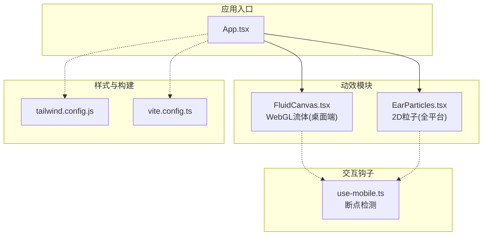
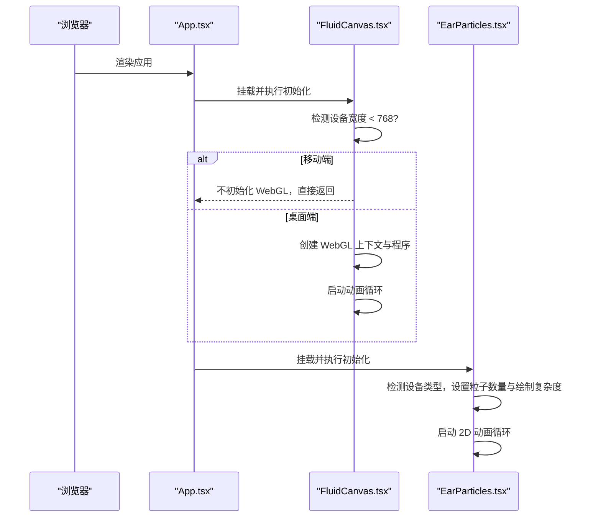
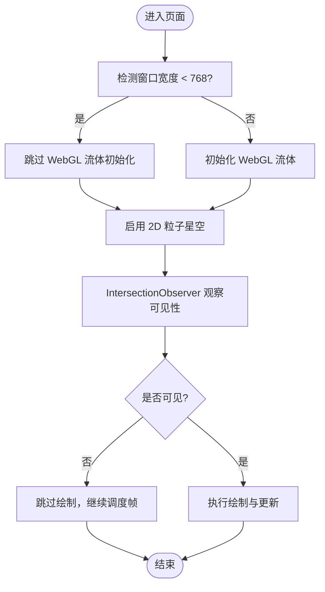
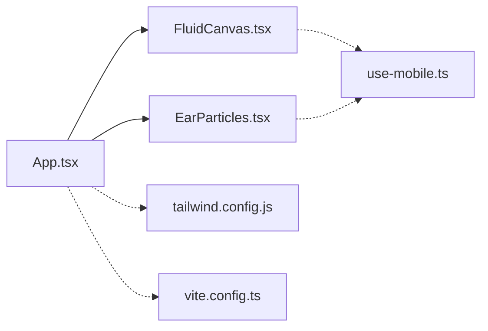

# 移动端降级策略

<cite>
**本文引用的文件**   
- [src/hooks/use-mobile.ts](file://src/hooks/use-mobile.ts)
- [src/sections/FluidCanvas.tsx](file://src/sections/FluidCanvas.tsx)
- [src/sections/EarParticles.tsx](file://src/sections/EarParticles.tsx)
- [src/App.tsx](file://src/App.tsx)
- [tailwind.config.js](file://tailwind.config.js)
- [vite.config.ts](file://vite.config.ts)
</cite>

## 目录
1. [引言](#引言)
2. [项目结构](#项目结构)
3. [核心组件](#核心组件)
4. [架构总览](#架构总览)
5. [详细组件分析](#详细组件分析)
6. [依赖关系分析](#依赖关系分析)
7. [性能考量](#性能考量)
8. [故障排查指南](#故障排查指南)
9. [结论](#结论)
10. [附录](#附录)

## 引言
本指南围绕挠荔枝官网的移动端性能降级策略，系统化梳理设备能力检测、WebGL流体动画的禁用条件与替代方案、响应式最佳实践（触摸事件优化、滚动性能提升、内存管理）、移动端特有性能问题（电池消耗、热管理、网络请求）以及兼容性测试与调试技巧。目标是确保在低端设备上也能获得流畅、省电且稳定的浏览体验。

## 项目结构
本项目采用基于功能分层的组织方式：
- hooks：可复用的交互与状态钩子（如移动端判断、磁性按钮、聚光灯、滚动入场）
- sections：页面级视觉与动效模块（流体背景、粒子星空等）
- App：应用入口，组合各模块
- 配置：Tailwind 主题与 Vite 构建配置

图表来源
- [src/App.tsx:1-30](file://src/App.tsx#L1-L30)
- [src/sections/FluidCanvas.tsx:153-163](file://src/sections/FluidCanvas.tsx#L153-L163)
- [src/sections/EarParticles.tsx:51-57](file://src/sections/EarParticles.tsx#L51-L57)
- [src/hooks/use-mobile.ts:1-20](file://src/hooks/use-mobile.ts#L1-L20)
- [tailwind.config.js:1-92](file://tailwind.config.js#L1-L92)
- [vite.config.ts:1-15](file://vite.config.ts#L1-L15)

章节来源
- [src/App.tsx:1-30](file://src/App.tsx#L1-L30)
- [tailwind.config.js:1-92](file://tailwind.config.js#L1-L92)
- [vite.config.ts:1-15](file://vite.config.ts#L1-L15)

## 核心组件
- 流体背景（WebGL）：在桌面端启用，移动端直接跳过初始化，避免GPU压力。
- 粒子星空（2D Canvas）：全平台运行，但根据设备类型调整粒子数量、绘制复杂度与交互逻辑。
- 移动端断点钩子：提供统一的断点判断能力，便于全局降级控制。

章节来源
- [src/sections/FluidCanvas.tsx:153-163](file://src/sections/FluidCanvas.tsx#L153-L163)
- [src/sections/EarParticles.tsx:51-57](file://src/sections/EarParticles.tsx#L51-L57)
- [src/hooks/use-mobile.ts:1-20](file://src/hooks/use-mobile.ts#L1-L20)

## 架构总览
整体渲染管线由 React 应用编排，两个高性能画布层叠加：
- 底层：WebGL 流体（仅桌面端）
- 上层：2D 粒子星空（全平台，按设备能力降级）

图表来源
- [src/App.tsx:1-30](file://src/App.tsx#L1-L30)
- [src/sections/FluidCanvas.tsx:153-163](file://src/sections/FluidCanvas.tsx#L153-L163)
- [src/sections/EarParticles.tsx:51-57](file://src/sections/EarParticles.tsx#L51-L57)

## 详细组件分析

### 设备能力检测机制
- 屏幕尺寸断点
  - useIsMobile 使用 matchMedia 监听 max-width: 767px，统一暴露 isMobile 布尔值，适合在 UI 层做响应式切换。
  - 流体组件内部也使用 window.innerWidth < 768 作为快速降级开关。
- 像素密度与分辨率
  - 流体组件对 devicePixelRatio 进行上限限制，避免高分屏导致过高的渲染负载。
  - 粒子组件同样对 DPR 进行限制，并在移动端保持较低 DPR 上限。
- WebGL 支持检测
  - 流体组件尝试获取 webgl 上下文，失败则静默回退；同时请求 OES_texture_half_float 扩展用于半精度纹理。
- 可见性感知
  - 两个画布均使用 IntersectionObserver，当不可见时暂停或跳过绘制，显著降低后台能耗。

章节来源
- [src/hooks/use-mobile.ts:1-20](file://src/hooks/use-mobile.ts#L1-L20)
- [src/sections/FluidCanvas.tsx:153-163](file://src/sections/FluidCanvas.tsx#L153-L163)
- [src/sections/FluidCanvas.tsx:174-186](file://src/sections/FluidCanvas.tsx#L174-L186)
- [src/sections/FluidCanvas.tsx:315-321](file://src/sections/FluidCanvas.tsx#L315-L321)
- [src/sections/EarParticles.tsx:116-126](file://src/sections/EarParticles.tsx#L116-L126)
- [src/sections/EarParticles.tsx:143-151](file://src/sections/EarParticles.tsx#L143-L151)

### 移动端降级逻辑与替代方案
- WebGL 流体动画
  - 降级条件：窗口宽度小于 768 时直接跳过初始化，避免 GPU 开销。
  - 替代方案：保留 2D 粒子星空作为背景，保证视觉层次与品牌氛围。
- 2D 粒子系统
  - 移动端减少粒子数量，简化光晕绘制，关闭鼠标引力等重计算逻辑，改用轻量微风效果。
  - 通过 IntersectionObserver 在不可见时跳过绘制，仅在调度下一帧以维持响应性。

图表来源
- [src/sections/FluidCanvas.tsx:153-163](file://src/sections/FluidCanvas.tsx#L153-L163)
- [src/sections/EarParticles.tsx:116-126](file://src/sections/EarParticles.tsx#L116-L126)
- [src/sections/EarParticles.tsx:391-396](file://src/sections/EarParticles.tsx#L391-L396)

章节来源
- [src/sections/FluidCanvas.tsx:153-163](file://src/sections/FluidCanvas.tsx#L153-L163)
- [src/sections/EarParticles.tsx:51-57](file://src/sections/EarParticles.tsx#L51-L57)
- [src/sections/EarParticles.tsx:314-331](file://src/sections/EarParticles.tsx#L314-L331)
- [src/sections/EarParticles.tsx:391-396](file://src/sections/EarParticles.tsx#L391-L396)

### 响应式设计最佳实践
- 触摸事件优化
  - 为 touchmove/touchend 添加 passive: true，避免阻塞主线程滚动。
  - 将指针移动采样与距离阈值结合，减少高频事件带来的额外计算。
- 滚动性能提升
  - 使用 IntersectionObserver 触发入场动画，避免 scroll 事件导致的布局抖动。
  - 动画元素尽量使用 transform 与 opacity，减少重排重绘。
- 内存管理策略
  - 在组件卸载时取消 requestAnimationFrame、移除事件监听器、断开观察者，防止内存泄漏。
  - 合理限制 DPR 上限，避免高分屏下显存暴涨。

章节来源
- [src/sections/EarParticles.tsx:255-258](file://src/sections/EarParticles.tsx#L255-L258)
- [src/hooks/use-scroll-reveal.ts:12-30](file://src/hooks/use-scroll-reveal.ts#L12-L30)
- [src/sections/EarParticles.tsx:542-549](file://src/sections/EarParticles.tsx#L542-L549)
- [src/sections/FluidCanvas.tsx:454-459](file://src/sections/FluidCanvas.tsx#L454-L459)

### 移动端特有的性能问题与解决方案
- 电池消耗优化
  - 不可见时跳过绘制，仅保留最小调度；减少不必要的数学运算与复杂渐变。
- 热管理考虑
  - 限制 DPR 与粒子数量，避免长时间高负载导致发热降频。
- 网络请求优化
  - 建议将资源按需加载与缓存，减少首屏体积；图片使用现代格式与自适应尺寸（本节为通用建议）。

章节来源
- [src/sections/EarParticles.tsx:391-396](file://src/sections/EarParticles.tsx#L391-L396)
- [src/sections/EarParticles.tsx:143-151](file://src/sections/EarParticles.tsx#L143-L151)
- [src/sections/FluidCanvas.tsx:315-321](file://src/sections/FluidCanvas.tsx#L315-L321)

### 不同移动设备的兼容性测试方法与调试技巧
- 兼容性测试方法
  - 使用 Chrome DevTools 的设备模拟器覆盖常见 DPI 与视口尺寸。
  - 在真实设备上开启“省电模式”与“低亮度”，验证功耗与温度表现。
- 调试技巧
  - 在流体组件中打印 WebGL 上下文与扩展可用性，确认降级路径是否生效。
  - 使用 Performance 面板记录帧时间，定位卡顿来源（JS 计算 vs 绘制）。
  - 针对低端机，逐步提高粒子数量与 DPR 上限，找到稳定帧率的平衡点。

[本节为通用指导，无需源码引用]

### 用户体验优化建议（低端设备）
- 优先保障内容可读性与交互流畅度，弱化非关键动效。
- 使用更柔和的色彩与较小半径的光晕，降低混合成本。
- 将复杂交互拆分为渐进增强：基础体验可用，高端设备再解锁高级效果。

[本节为通用指导，无需源码引用]

## 依赖关系分析
- 组件耦合
  - App 组合 FluidCanvas 与 EarParticles，二者相互独立，分别负责 WebGL 与 2D 渲染。
  - 移动端断点由 useIsMobile 提供，但当前流体组件仍内联判断窗口宽度，存在轻微不一致风险。
- 外部依赖
  - Tailwind 提供样式原子化能力，Vite 提供构建与别名解析。

图表来源
- [src/App.tsx:1-30](file://src/App.tsx#L1-L30)
- [src/sections/FluidCanvas.tsx:153-163](file://src/sections/FluidCanvas.tsx#L153-L163)
- [src/sections/EarParticles.tsx:51-57](file://src/sections/EarParticles.tsx#L51-L57)
- [src/hooks/use-mobile.ts:1-20](file://src/hooks/use-mobile.ts#L1-L20)
- [tailwind.config.js:1-92](file://tailwind.config.js#L1-L92)
- [vite.config.ts:1-15](file://vite.config.ts#L1-L15)

章节来源
- [src/App.tsx:1-30](file://src/App.tsx#L1-L30)
- [tailwind.config.js:1-92](file://tailwind.config.js#L1-L92)
- [vite.config.ts:1-15](file://vite.config.ts#L1-L15)

## 性能考量
- 渲染管线
  - 桌面端：WebGL 流体 + 2D 粒子叠加，视觉丰富但成本高。
  - 移动端：仅 2D 粒子，且数量与复杂度受限，保证流畅。
- 资源与内存
  - 限制 DPR 上限，避免高分屏显存占用过高。
  - 及时释放动画帧、事件监听与观察者，防止内存泄漏。
- 能耗与发热
  - 不可见时跳过绘制，减少无效计算。
  - 降低粒子数量与光晕半径，减少混合与渐变开销。

[本节为通用讨论，无需源码引用]

## 故障排查指南
- WebGL 未启用
  - 检查 getContext("webgl") 返回值是否为空；确认 OES_texture_half_float 扩展是否可用。
- 移动端仍然卡顿
  - 确认窗口宽度判断是否正确；检查 DPR 上限与粒子数量是否过大。
- 动画不暂停
  - 检查 IntersectionObserver 是否正确观察 canvas；确认 isVisibleRef 是否在动画循环中被读取。
- 内存泄漏
  - 确认 useEffect 清理函数是否移除所有事件监听、取消动画帧与断开观察者。

章节来源
- [src/sections/FluidCanvas.tsx:174-186](file://src/sections/FluidCanvas.tsx#L174-L186)
- [src/sections/FluidCanvas.tsx:454-459](file://src/sections/FluidCanvas.tsx#L454-L459)
- [src/sections/EarParticles.tsx:116-126](file://src/sections/EarParticles.tsx#L116-L126)
- [src/sections/EarParticles.tsx:542-549](file://src/sections/EarParticles.tsx#L542-L549)

## 结论
通过在移动端禁用 WebGL 流体、精简 2D 粒子系统与引入可见性感知，项目在低端设备上实现了良好的性能与能耗平衡。建议后续进一步统一设备能力检测入口，完善基准测试与自动化兼容测试，持续优化用户体验。

[本节为总结，无需源码引用]

## 附录
- 相关实现位置参考
  - 移动端断点检测：[src/hooks/use-mobile.ts:1-20](file://src/hooks/use-mobile.ts#L1-L20)
  - 流体降级条件：[src/sections/FluidCanvas.tsx:153-163](file://src/sections/FluidCanvas.tsx#L153-L163)
  - 粒子数量与绘制降级：[src/sections/EarParticles.tsx:51-57](file://src/sections/EarParticles.tsx#L51-L57), [src/sections/EarParticles.tsx:314-331](file://src/sections/EarParticles.tsx#L314-L331)
  - 可见性感知与清理：[src/sections/EarParticles.tsx:116-126](file://src/sections/EarParticles.tsx#L116-L126), [src/sections/EarParticles.tsx:542-549](file://src/sections/EarParticles.tsx#L542-L549)