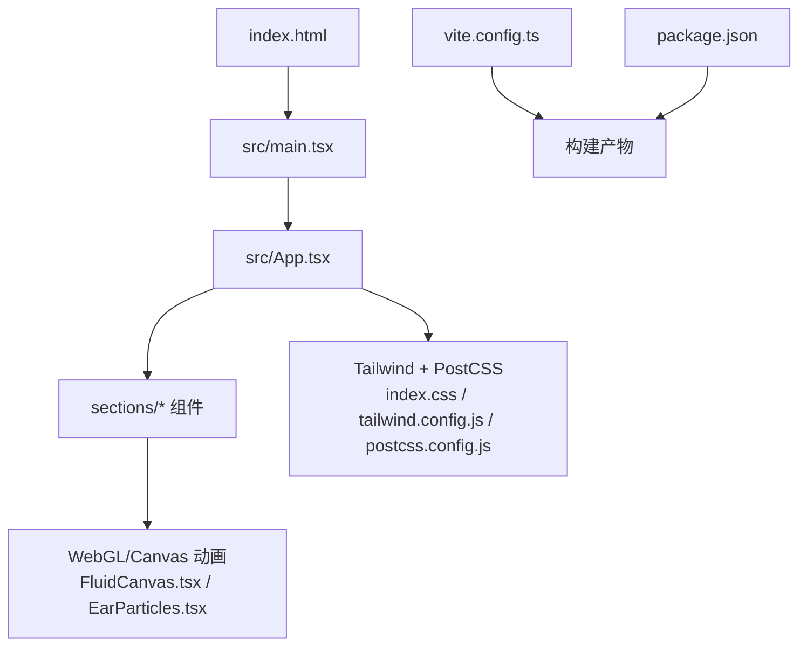
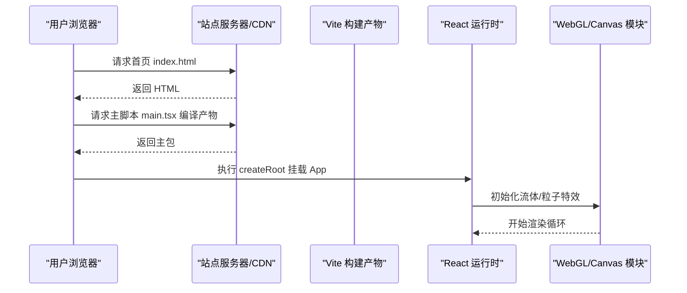
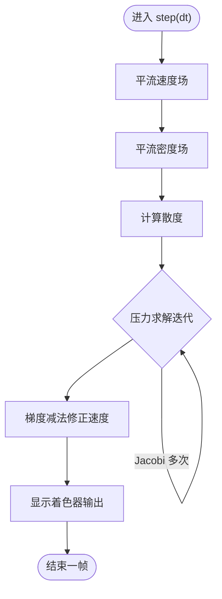
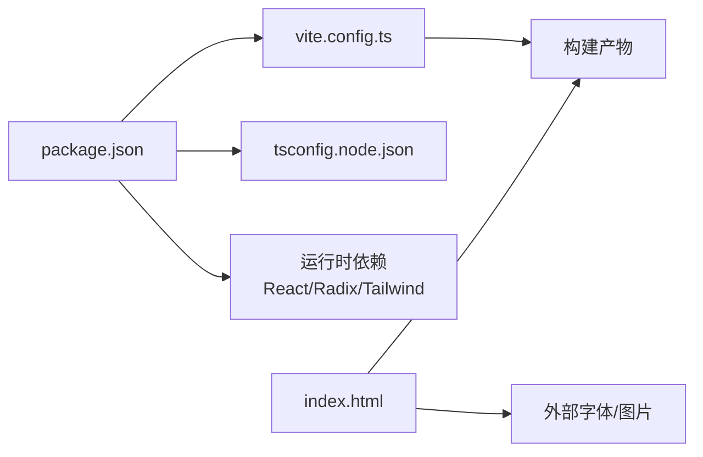

# 资源加载优化

<cite>
**本文引用的文件**
- [vite.config.ts](file://vite.config.ts)
- [package.json](file://package.json)
- [index.html](file://index.html)
- [src/main.tsx](file://src/main.tsx)
- [src/App.tsx](file://src/App.tsx)
- [src/index.css](file://src/index.css)
- [postcss.config.js](file://postcss.config.js)
- [tailwind.config.js](file://tailwind.config.js)
- [tsconfig.node.json](file://tsconfig.node.json)
- [src/sections/FluidCanvas.tsx](file://src/sections/FluidCanvas.tsx)
- [src/sections/EarParticles.tsx](file://src/sections/EarParticles.tsx)
</cite>

## 目录
1. [简介](#简介)
2. [项目结构](#项目结构)
3. [核心组件](#核心组件)
4. [架构总览](#架构总览)
5. [详细组件分析](#详细组件分析)
6. [依赖分析](#依赖分析)
7. [性能考虑](#性能考虑)
8. [故障排查指南](#故障排查指南)
9. [结论](#结论)
10. [附录](#附录)

## 简介
本方案面向挠荔枝官网，围绕 Vite 构建与运行时资源加载进行系统性优化。重点覆盖：
- 代码分割策略（动态导入、路由级懒加载）
- 静态资源优化（图片压缩、字体预加载、CDN 部署）
- 缓存策略（HTTP 缓存头与服务端缓存）
- 第三方库按需引入与 Tree Shaking
- 资源预加载与预连接（提升首屏体验）
- 生产环境监控与分析（定位瓶颈与持续优化）

## 项目结构
当前工程采用单页应用结构，入口为 index.html 与 src/main.tsx，页面内容以 React 组件拼装，视觉特效集中在 sections 下的 Canvas/WebGL 组件中。Vite 配置简洁，未开启高级打包与资源优化选项，具备较大优化空间。

图示来源
- [index.html:1-49](file://index.html#L1-L49)
- [src/main.tsx:1-11](file://src/main.tsx#L1-L11)
- [src/App.tsx:1-30](file://src/App.tsx#L1-L30)
- [src/sections/FluidCanvas.tsx:1-470](file://src/sections/FluidCanvas.tsx#L1-L470)
- [src/sections/EarParticles.tsx:1-560](file://src/sections/EarParticles.tsx#L1-L560)
- [src/index.css:1-38](file://src/index.css#L1-L38)
- [postcss.config.js:1-6](file://postcss.config.js#L1-L6)
- [tailwind.config.js:40-81](file://tailwind.config.js#L40-L81)
- [vite.config.ts:1-15](file://vite.config.ts#L1-L15)
- [package.json:1-80](file://package.json#L1-L80)

章节来源
- [index.html:1-49](file://index.html#L1-L49)
- [src/main.tsx:1-11](file://src/main.tsx#L1-L11)
- [src/App.tsx:1-30](file://src/App.tsx#L1-L30)
- [vite.config.ts:1-15](file://vite.config.ts#L1-L15)
- [package.json:1-80](file://package.json#L1-L80)

## 核心组件
- 应用入口与挂载
  - index.html 提供 HTML 骨架与元信息，包含 SEO、OG 标签与结构化数据。
  - src/main.tsx 使用 createRoot 挂载 App。
- 页面装配
  - src/App.tsx 聚合各 section 组件，形成首屏渲染树。
- 样式系统
  - src/index.css 通过 @import 引入 Google Fonts，并启用 Tailwind 基础层。
  - postcss.config.js 与 tailwind.config.js 控制样式处理与主题变量。
- 视觉特效
  - FluidCanvas.tsx 基于 WebGL 实现流体效果，含多阶段 shader 与 FBO 管线。
  - EarParticles.tsx 基于 Canvas 2D 实现星空、流星、光粒等粒子效果。

章节来源
- [index.html:1-49](file://index.html#L1-L49)
- [src/main.tsx:1-11](file://src/main.tsx#L1-L11)
- [src/App.tsx:1-30](file://src/App.tsx#L1-L30)
- [src/index.css:1-38](file://src/index.css#L1-L38)
- [postcss.config.js:1-6](file://postcss.config.js#L1-L6)
- [tailwind.config.js:40-81](file://tailwind.config.js#L40-L81)
- [src/sections/FluidCanvas.tsx:1-470](file://src/sections/FluidCanvas.tsx#L1-L470)
- [src/sections/EarParticles.tsx:1-560](file://src/sections/EarParticles.tsx#L1-L560)

## 架构总览
从“构建—部署—运行”的视角看，资源加载链路如下：
- 构建期：Vite 将源码打包为 JS/CSS/静态资源；当前 vite.config.ts 仅设置 base 与别名，未配置代码分割与资源优化。
- 部署期：HTML 由 CDN/服务器返回，浏览器解析后请求主包与首屏所需资源。
- 运行期：React 渲染 App 树，WebGL/Canvas 初始化并进入动画循环。

图示来源
- [index.html:1-49](file://index.html#L1-L49)
- [src/main.tsx:1-11](file://src/main.tsx#L1-L11)
- [src/App.tsx:1-30](file://src/App.tsx#L1-L30)
- [src/sections/FluidCanvas.tsx:1-470](file://src/sections/FluidCanvas.tsx#L1-L470)
- [src/sections/EarParticles.tsx:1-560](file://src/sections/EarParticles.tsx#L1-L560)

## 详细组件分析

### 代码分割与懒加载策略
现状
- 当前所有 section 在 App.tsx 中同步 import，首屏会一次性加载全部模块。
- 无路由切换场景，但仍有大量非首屏关键模块可延迟加载。

建议
- 对非首屏或重型模块使用动态导入（如懒加载 Features、Highlights、TTSDemo 等），结合 Suspense 展示占位。
- 对 WebGL/Canvas 特效模块（FluidCanvas、EarParticles）按条件加载：移动端降级或滚动到可视区域再加载。
- 若后续引入多页面，建议使用路由级懒加载（例如 react-router v6 的 lazy）。

参考路径
- [src/App.tsx:1-30](file://src/App.tsx#L1-L30)
- [src/sections/FluidCanvas.tsx:1-470](file://src/sections/FluidCanvas.tsx#L1-L470)
- [src/sections/EarParticles.tsx:1-560](file://src/sections/EarParticles.tsx#L1-L560)

### 构建期代码分割与分包
现状
- vite.config.ts 仅定义 base 与别名，未配置 build.rollupOptions.output.manualChunks 或 splitChunks 相关策略。

建议
- 将 React、ReactDOM、Radix UI 等稳定依赖拆分为 vendor chunk，提高缓存命中率。
- 将大体积特效模块独立成 chunk，配合动态导入按需加载。
- 针对 CSS 拆分，确保首屏最小化 CSS 体积。

参考路径
- [vite.config.ts:1-15](file://vite.config.ts#L1-L15)

### 静态资源优化
现状
- index.html 引用 favicon.svg 与 og-image.png；src/index.css 通过 @import 远程加载 Google Fonts。
- 未见本地图片资源目录与压缩流程。

建议
- 图片
  - 统一转换为 WebP/AVIF，保留 PNG/JPG 回退；使用构建插件自动转换与生成 <picture>。
  - 大图使用响应式尺寸与懒加载（loading="lazy"）。
- 字体
  - 使用 font-display: swap 避免阻塞首屏；优先加载必要字重；必要时自托管字体至 CDN。
  - 使用 rel="preload" 与 rel="preconnect" 加速字体获取。
- 图标与 SVG
  - 使用内联 SVG 或雪碧图减少请求；按需引入 lucide-react 图标。

参考路径
- [index.html:1-49](file://index.html#L1-L49)
- [src/index.css:1-38](file://src/index.css#L1-L38)

### 缓存策略配置
现状
- 未在服务端配置 HTTP 缓存头；Vite 默认产物带哈希，利于长期缓存。

建议
- 静态资源（JS/CSS/图片/字体）
  - Cache-Control: public, max-age=31536000, immutable（带指纹的文件）
  - ETag/Last-Modified 用于校验更新
- HTML
  - Cache-Control: no-cache（或短 max-age + 强校验）
- CDN
  - 开启 gzip/brotli 压缩；启用 HTTP/2 或 HTTP/3；开启边缘缓存与版本化路径。

参考路径
- [vite.config.ts:1-15](file://vite.config.ts#L1-L15)
- [index.html:1-49](file://index.html#L1-L49)

### 第三方库按需引入与 Tree Shaking
现状
- package.json 引入大量 Radix UI 子包与工具库，存在潜在冗余。
- lucide-react 可按需引入具体图标以减少体积。

建议
- 替换整包引入为子包按需引入（如 @radix-ui/react-slot 已按需，其余同理）。
- 使用 vite-plugin-tree-shake 或 Rollup 的 sideEffects 标记，确保无用导出被剔除。
- 对大型图表库（recharts）按需引入组件与工具函数。

参考路径
- [package.json:1-80](file://package.json#L1-L80)

### 资源预加载与预连接
现状
- index.html 未显式声明 preload/preconnect。

建议
- 预连接关键域名（Google Fonts、CDN）
- 预加载首屏关键资源（主包、首屏字体、首屏图片）
- 使用 fetchpriority="high" 提升关键资源优先级

参考路径
- [index.html:1-49](file://index.html#L1-L49)

### 运行时性能与渲染管线
现状
- FluidCanvas.tsx 使用 WebGL 多阶段 shader 与双缓冲 FBO，包含 advect/divergence/pressure/gradientSubtract/display 等步骤。
- EarParticles.tsx 使用 Canvas 2D 绘制大量粒子，并在不可见时暂停动画。

优化要点
- 降低模拟分辨率与迭代次数，限制 DPR 上限。
- 使用 IntersectionObserver 在不可见时暂停渲染（已部分实现）。
- 合并 draw 调用，减少状态切换；批量更新数组，避免频繁分配。

图示来源
- [src/sections/FluidCanvas.tsx:371-412](file://src/sections/FluidCanvas.tsx#L371-L412)

章节来源
- [src/sections/FluidCanvas.tsx:1-470](file://src/sections/FluidCanvas.tsx#L1-L470)
- [src/sections/EarParticles.tsx:1-560](file://src/sections/EarParticles.tsx#L1-L560)

## 依赖分析
- 构建与开发
  - Vite 作为构建工具，TypeScript 与 ESLint 参与类型检查与规范。
- 运行时依赖
  - React 生态（react、react-dom）、Radix UI 系列组件、Tailwind 与 PostCSS。
- 外部资源
  - Google Fonts 远程字体；favicon/og-image 等静态资源。

图示来源
- [package.json:1-80](file://package.json#L1-L80)
- [vite.config.ts:1-15](file://vite.config.ts#L1-L15)
- [tsconfig.node.json:1-26](file://tsconfig.node.json#L1-L26)
- [index.html:1-49](file://index.html#L1-L49)

章节来源
- [package.json:1-80](file://package.json#L1-L80)
- [vite.config.ts:1-15](file://vite.config.ts#L1-L15)
- [tsconfig.node.json:1-26](file://tsconfig.node.json#L1-L26)
- [index.html:1-49](file://index.html#L1-L49)

## 性能考虑
- 首屏关键路径
  - 减少首屏 JS/CSS 体积；延迟非关键模块与特效；预连接与预加载关键资源。
- 网络与缓存
  - 启用 HTTP/2/3、Brotli/Gzip；合理设置缓存头；利用 CDN 就近分发。
- 渲染与 GPU
  - 降低 WebGL 分辨率与迭代次数；限制 DPR；不可见时暂停动画；合并绘制。
- 资源格式
  - 图片转 WebP/AVIF；字体 subset 与 display: swap；SVG 内联或雪碧图。
- 依赖瘦身
  - 按需引入 Radix UI 子包与 lucide-react 图标；移除未使用依赖。

[本节为通用指导，不直接分析具体文件]

## 故障排查指南
- 构建产物过大
  - 使用 Vite 内置分析插件查看包体构成，定位大依赖与重复打包。
- 首屏卡顿
  - 检查是否过早初始化 WebGL/Canvas；确认 IntersectionObserver 生效；评估 DPR 与分辨率参数。
- 字体闪烁或阻塞
  - 检查 font-display 策略与预加载是否正确；确认网络可达与跨域。
- 缓存未命中
  - 核对文件名是否带哈希；服务端是否对静态资源设置了 long-term cache。

[本节为通用指导，不直接分析具体文件]

## 结论
通过对构建配置、代码分割、静态资源、缓存策略、按需引入与预加载的系统性优化，并结合运行时渲染调优与生产监控，可显著提升挠荔枝官网的首屏加载速度与交互流畅度。建议在上线前建立性能基线，持续用真实用户数据驱动优化闭环。

[本节为总结性内容，不直接分析具体文件]

## 附录

### 实施清单（建议）
- 构建与打包
  - 配置 manualChunks 拆分 vendor 与业务模块
  - 启用 CSS 代码分割与去重
- 资源与字体
  - 图片自动化转换与响应式输出
  - 字体预加载与自托管/CDN
- 缓存与 CDN
  - 静态资源长缓存 + HTML 短缓存
  - 开启 Brotli/Gzip、HTTP/2/3
- 按需与 Tree Shaking
  - 替换整包为子包引入
  - 标注 sideEffects，清理未使用导出
- 预加载与预连接
  - 在 index.html 添加 preconnect/preload/fetchpriority
- 运行时优化
  - 惰性加载重型模块与特效
  - 限制 DPR/分辨率/迭代次数，不可见时暂停
- 监控与分析
  - 接入前端性能监控（LCP/INP/FID/CLS）
  - 定期产出构建分析报告与线上性能报告

[本节为操作清单，不直接分析具体文件]