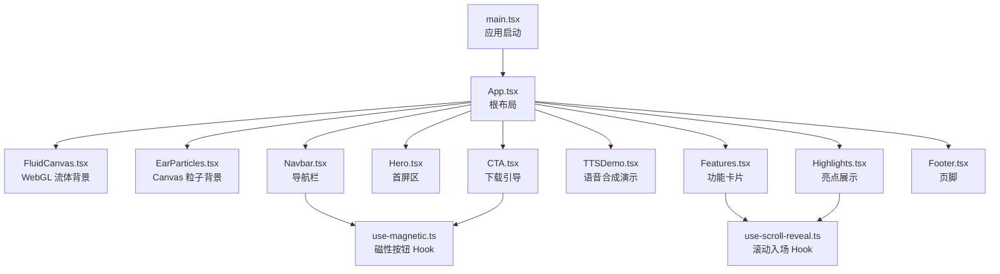
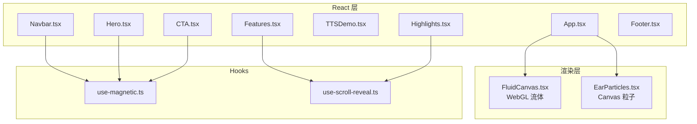
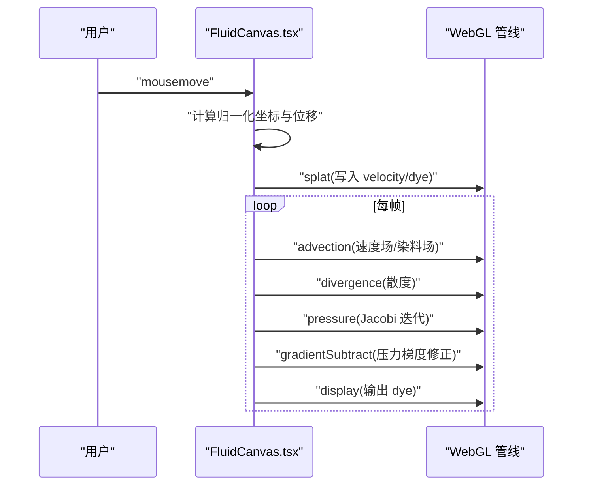
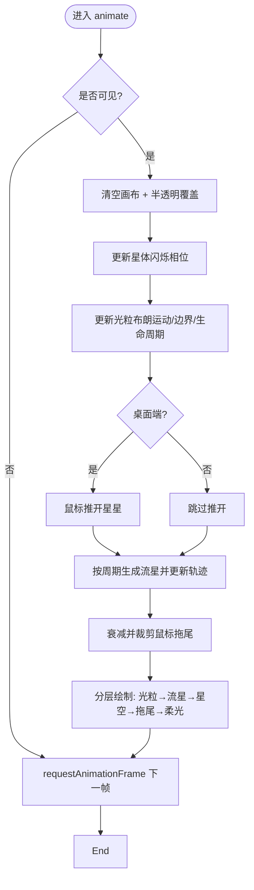
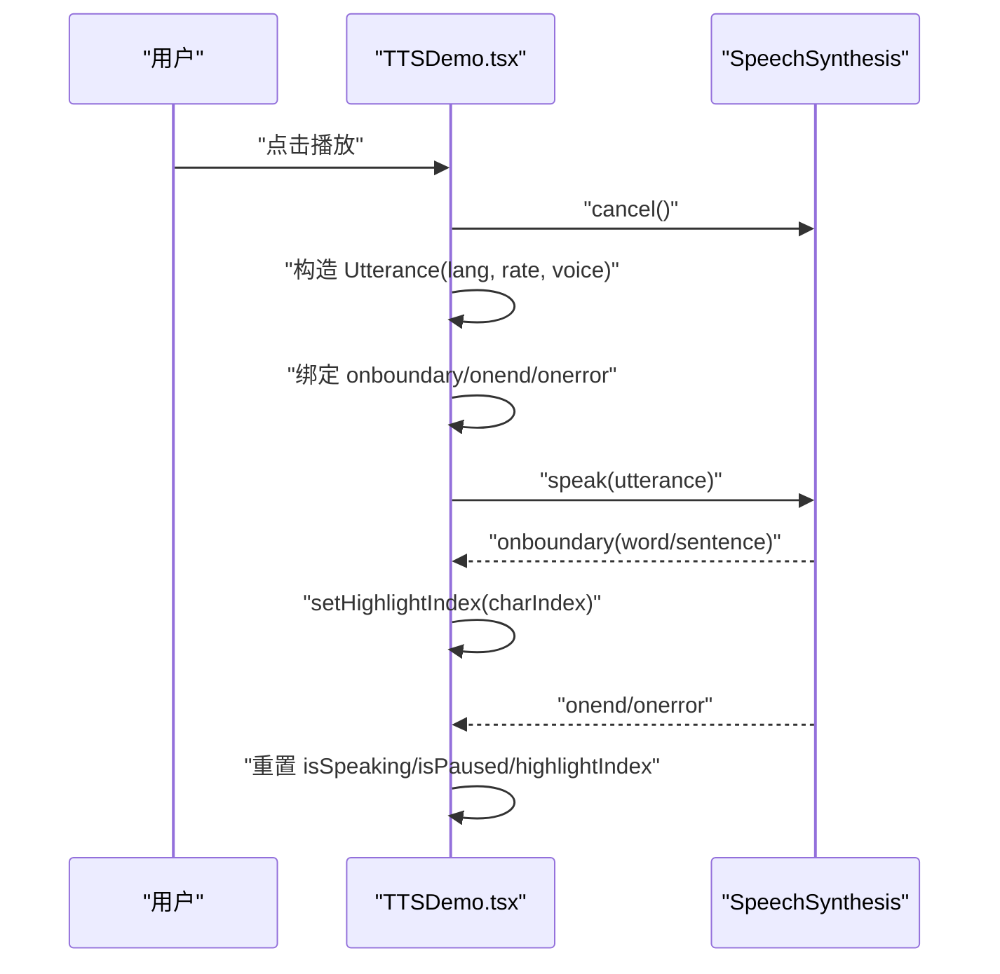
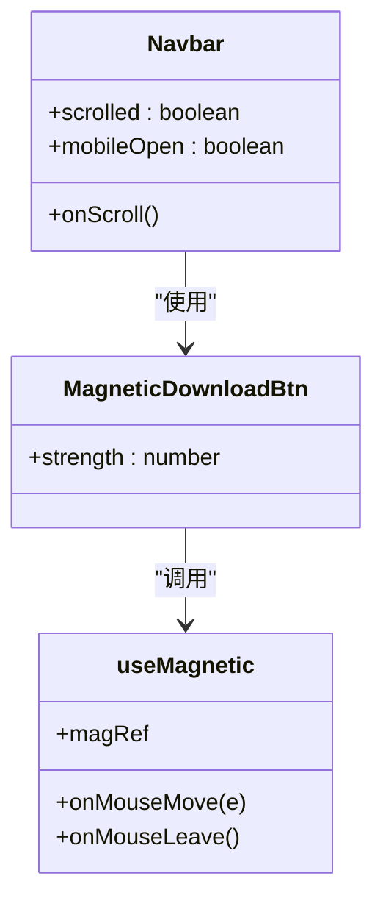
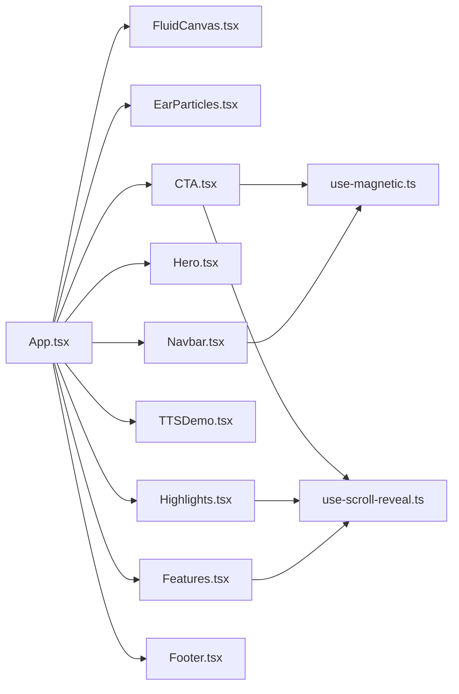
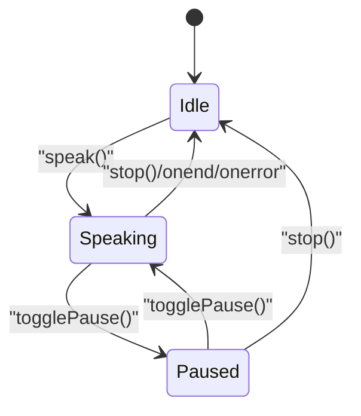

# 数据流设计

<cite>
**本文引用的文件**
- [main.tsx](file://src/main.tsx)
- [App.tsx](file://src/App.tsx)
- [FluidCanvas.tsx](file://src/sections/FluidCanvas.tsx)
- [EarParticles.tsx](file://src/sections/EarParticles.tsx)
- [TTSDemo.tsx](file://src/sections/TTSDemo.tsx)
- [Hero.tsx](file://src/sections/Hero.tsx)
- [Navbar.tsx](file://src/sections/Navbar.tsx)
- [use-magnetic.ts](file://src/hooks/use-magnetic.ts)
- [use-scroll-reveal.ts](file://src/hooks/use-scroll-reveal.ts)
- [Features.tsx](file://src/sections/Features.tsx)
- [Highlights.tsx](file://src/sections/Highlights.tsx)
- [CTA.tsx](file://src/sections/CTA.tsx)
- [Footer.tsx](file://src/sections/Footer.tsx)
- [utils.ts](file://src/lib/utils.ts)
</cite>

## 目录
1. [引言](#引言)
2. [项目结构](#项目结构)
3. [核心组件与数据域](#核心组件与数据域)
4. [架构总览](#架构总览)
5. [详细组件分析](#详细组件分析)
6. [依赖关系分析](#依赖关系分析)
7. [性能考量](#性能考量)
8. [故障排查指南](#故障排查指南)
9. [结论](#结论)
10. [附录：关键流程图与状态图](#附录关键流程图与状态图)

## 引言
本文件面向挠荔枝官网的数据流设计与状态管理，聚焦以下目标：
- 描述用户交互事件到视图更新的完整数据流
- 梳理自定义 Hooks 的数据获取、状态管理与副作用模式
- 解释 WebGL 流体动画与 Canvas 粒子系统的数据同步机制和渲染循环
- 阐述语音合成演示的状态管理与实时高亮同步
- 记录工具函数的数据转换与处理逻辑
- 给出错误处理策略、性能监控与缓存机制建议
- 提供数据流图与状态转换图，帮助理解关键业务逻辑的数据流转

## 项目结构
应用采用 React + TypeScript + Vite 的单页结构。根入口挂载 App，页面由多个“区块”（sections）组合而成；视觉动效通过两个独立的全屏 Canvas/WebGL 层叠加实现；交互与滚动效果通过自定义 Hooks 复用。



图表来源
- [main.tsx:1-11](file://src/main.tsx#L1-L11)
- [App.tsx:1-30](file://src/App.tsx#L1-L30)
- [FluidCanvas.tsx:153-470](file://src/sections/FluidCanvas.tsx#L153-L470)
- [EarParticles.tsx:106-560](file://src/sections/EarParticles.tsx#L106-L560)
- [Navbar.tsx:1-117](file://src/sections/Navbar.tsx#L1-L117)
- [Hero.tsx:1-141](file://src/sections/Hero.tsx#L1-L141)
- [Features.tsx:1-127](file://src/sections/Features.tsx#L1-L127)
- [TTSDemo.tsx:1-344](file://src/sections/TTSDemo.tsx#L1-L344)
- [Highlights.tsx:1-168](file://src/sections/Highlights.tsx#L1-L168)
- [CTA.tsx:1-65](file://src/sections/CTA.tsx#L1-L65)
- [Footer.tsx:1-62](file://src/sections/Footer.tsx#L1-L62)
- [use-magnetic.ts:1-32](file://src/hooks/use-magnetic.ts#L1-L32)
- [use-scroll-reveal.ts:1-34](file://src/hooks/use-scroll-reveal.ts#L1-L34)

章节来源
- [main.tsx:1-11](file://src/main.tsx#L1-L11)
- [App.tsx:1-30](file://src/App.tsx#L1-L30)

## 核心组件与数据域
- 全局渲染层
  - WebGL 流体背景：全屏固定定位，不拦截指针事件，作为底层视觉层
  - Canvas 粒子背景：全屏固定定位，承载星空、光粒、流星、鼠标拖尾等
- 业务区块
  - 导航栏：滚动监听、移动端菜单开关、磁性下载按钮
  - 首屏区：鼠标倾斜视差
  - 功能卡片：滚动入场、聚光灯跟随
  - 语音合成演示：语言选择、声音列表加载、播放控制、实时高亮
  - 亮点展示：图文交替排版
  - 下载引导：磁性按钮、外部链接跳转
  - 页脚：静态信息与法律链接
- 自定义 Hooks
  - useMagnetic：计算鼠标相对元素中心偏移并驱动 transform
  - useScrollReveal：IntersectionObserver 触发一次性的 reveal 类名切换

章节来源
- [FluidCanvas.tsx:153-470](file://src/sections/FluidCanvas.tsx#L153-L470)
- [EarParticles.tsx:106-560](file://src/sections/EarParticles.tsx#L106-L560)
- [Navbar.tsx:1-117](file://src/sections/Navbar.tsx#L1-L117)
- [Hero.tsx:1-141](file://src/sections/Hero.tsx#L1-L141)
- [Features.tsx:1-127](file://src/sections/Features.tsx#L1-L127)
- [TTSDemo.tsx:1-344](file://src/sections/TTSDemo.tsx#L1-L344)
- [Highlights.tsx:1-168](file://src/sections/Highlights.tsx#L1-L168)
- [CTA.tsx:1-65](file://src/sections/CTA.tsx#L1-L65)
- [Footer.tsx:1-62](file://src/sections/Footer.tsx#L1-L62)
- [use-magnetic.ts:1-32](file://src/hooks/use-magnetic.ts#L1-L32)
- [use-scroll-reveal.ts:1-34](file://src/hooks/use-scroll-reveal.ts#L1-L34)

## 架构总览
整体为“React 组件树 + 独立渲染层”的架构：
- React 负责 UI 状态与交互
- WebGL/Canvas 渲染层通过 ref 直接操作 GPU/CPU 图形管线，避免频繁 React 重渲染
- 自定义 Hooks 封装通用副作用与 DOM 观察逻辑，降低耦合



图表来源
- [App.tsx:1-30](file://src/App.tsx#L1-L30)
- [FluidCanvas.tsx:153-470](file://src/sections/FluidCanvas.tsx#L153-L470)
- [EarParticles.tsx:106-560](file://src/sections/EarParticles.tsx#L106-L560)
- [Navbar.tsx:1-117](file://src/sections/Navbar.tsx#L1-L117)
- [Hero.tsx:1-141](file://src/sections/Hero.tsx#L1-L141)
- [Features.tsx:1-127](file://src/sections/Features.tsx#L1-L127)
- [Highlights.tsx:1-168](file://src/sections/Highlights.tsx#L1-L168)
- [CTA.tsx:1-65](file://src/sections/CTA.tsx#L1-L65)
- [use-magnetic.ts:1-32](file://src/hooks/use-magnetic.ts#L1-L32)
- [use-scroll-reveal.ts:1-34](file://src/hooks/use-scroll-reveal.ts#L1-L34)

## 详细组件分析

### WebGL 流体动画（FluidCanvas）
- 数据源与输入
  - 窗口尺寸变化 → 更新 canvas 宽高与 FBO 分辨率
  - 鼠标移动 → 归一化坐标与位移增量，注入速度场与染料场
- 内部状态
  - DoubleFBO 双缓冲：velocity、dye、pressure
  - 单缓冲：divergence
  - 程序对象集合：splat/advection/divergence/pressure/gradientSubtract/display
- 渲染循环
  - requestAnimationFrame 驱动
  - IntersectionObserver 不可见时跳过绘制
  - 每帧：advection → divergence → pressure(Jacobi) → gradientSubtract → display
- 输出
  - 将 dye 纹理 blit 至屏幕



图表来源
- [FluidCanvas.tsx:153-470](file://src/sections/FluidCanvas.tsx#L153-L470)

章节来源
- [FluidCanvas.tsx:153-470](file://src/sections/FluidCanvas.tsx#L153-L470)

### Canvas 粒子系统（EarParticles）
- 数据模型
  - Star/DustParticle/Meteor/MouseTrail 四类实体，包含位置、速度、透明度、生命周期等
- 初始化与规模
  - 桌面端与移动端分别设定不同数量与复杂度
- 事件与物理
  - 鼠标/触摸移动 → 生成拖尾点
  - 桌面端：鼠标引力影响光粒、推开星星
  - 移动端：微风漂移
- 渲染循环
  - 透明清除 + 半透明覆盖以透出底层流体
  - 分层绘制：光粒 → 流星 → 星空 → 鼠标拖尾 → 光标柔光大光晕
- 性能优化
  - 不可见时跳过绘制但保持调度
  - 预计算颜色字符串减少运行时开销
  - 限制拖尾长度与最大数量



图表来源
- [EarParticles.tsx:106-560](file://src/sections/EarParticles.tsx#L106-L560)

章节来源
- [EarParticles.tsx:106-560](file://src/sections/EarParticles.tsx#L106-L560)

### 语音合成演示（TTSDemo）
- 状态字段
  - text、selectedLang、isSpeaking、isPaused、highlightIndex、supported、voices、filteredVoices、selectedVoiceURI、waveKey
- 数据获取
  - 使用 SpeechSynthesis.getVoices 异步加载声音列表，监听 voiceschanged 事件
  - 根据 selectedLang 过滤并自动选择高质量声音
- 交互流程
  - speak：创建 Utterance，绑定 onboundary/onend/onerror，设置 voice/lang/rate，调用 speak
  - togglePause：暂停/继续
  - stop：取消并重置状态
  - selectPreset：停止当前朗读，切换预设文本与语言
- 实时高亮
  - onboundary 中根据 charIndex 更新 highlightIndex，渲染时将文本切分为前后两段进行样式区分
- 波形动画
  - 通过 waveKey 强制子节点重建，配合 CSS 动画产生动态波形



图表来源
- [TTSDemo.tsx:1-344](file://src/sections/TTSDemo.tsx#L1-L344)

章节来源
- [TTSDemo.tsx:1-344](file://src/sections/TTSDemo.tsx#L1-L344)

### 导航栏与磁性按钮（Navbar + useMagnetic）
- Navbar
  - 滚动监听：window.scrollY > 20 切换背景模糊与阴影
  - 移动端菜单：mobileOpen 控制展开/收起
- MagneticDownloadBtn
  - 使用 useMagnetic(strength=0.25) 计算鼠标相对中心偏移，驱动 a 标签 transform
- useMagnetic
  - 返回 magRef、onMouseMove、onMouseLeave
  - onMouseMove 计算 dx/dy 并设置 translate
  - onMouseLeave 复位 transform



图表来源
- [Navbar.tsx:1-117](file://src/sections/Navbar.tsx#L1-L117)
- [use-magnetic.ts:1-32](file://src/hooks/use-magnetic.ts#L1-L32)

章节来源
- [Navbar.tsx:1-117](file://src/sections/Navbar.tsx#L1-L117)
- [use-magnetic.ts:1-32](file://src/hooks/use-magnetic.ts#L1-L32)

### 首屏区（Hero）
- 状态：tilt = { x, y }
- 交互：onMouseMove 计算归一化坐标映射到旋转角度；onMouseLeave 复位
- 输出：外层容器 style.transform 应用 rotateX/rotateY

章节来源
- [Hero.tsx:1-141](file://src/sections/Hero.tsx#L1-L141)

### 功能卡片（Features + Spotlight）
- 使用 useScrollReveal 对标题与卡片容器添加 reveal 类
- 每个卡片使用 useSpotlight（未在本仓库列出具体实现）驱动 hover 光晕
- 数据：FEATURES 常量数组驱动渲染

章节来源
- [Features.tsx:1-127](file://src/sections/Features.tsx#L1-L127)

### 亮点展示（Highlights）
- 使用 useScrollReveal 驱动标题区域入场
- 图片与文案交替布局，部分项支持 reversed 反转

章节来源
- [Highlights.tsx:1-168](file://src/sections/Highlights.tsx#L1-L168)

### 下载引导（CTA）
- 使用 useMagnetic 驱动 App Store 徽章按钮的磁吸效果
- 使用 useScrollReveal 驱动区域入场

章节来源
- [CTA.tsx:1-65](file://src/sections/CTA.tsx#L1-L65)
- [use-magnetic.ts:1-32](file://src/hooks/use-magnetic.ts#L1-L32)
- [use-scroll-reveal.ts:1-34](file://src/hooks/use-scroll-reveal.ts#L1-L34)

### 页脚（Footer）
- 纯静态信息展示，无复杂状态

章节来源
- [Footer.tsx:1-62](file://src/sections/Footer.tsx#L1-L62)

### 工具函数（utils.ts）
- cn(...inputs): 合并 clsx 与 tailwind-merge 的结果，用于条件类名拼接

章节来源
- [utils.ts:1-7](file://src/lib/utils.ts#L1-L7)

## 依赖关系分析
- 组件间耦合
  - App 聚合各区块，区块之间基本解耦
  - 视觉层（FluidCanvas、EarParticles）与业务区块完全解耦，仅通过 DOM 层级叠加
- Hook 复用
  - useMagnetic 被 Navbar 与 CTA 复用
  - useScrollReveal 被 Features、Highlights、CTA 复用
- 外部 API
  - WebGL 扩展 OES_texture_half_float / linear
  - SpeechSynthesis 接口
  - IntersectionObserver 与 requestAnimationFrame



图表来源
- [App.tsx:1-30](file://src/App.tsx#L1-L30)
- [FluidCanvas.tsx:153-470](file://src/sections/FluidCanvas.tsx#L153-L470)
- [EarParticles.tsx:106-560](file://src/sections/EarParticles.tsx#L106-L560)
- [Navbar.tsx:1-117](file://src/sections/Navbar.tsx#L1-L117)
- [Hero.tsx:1-141](file://src/sections/Hero.tsx#L1-L141)
- [Features.tsx:1-127](file://src/sections/Features.tsx#L1-L127)
- [TTSDemo.tsx:1-344](file://src/sections/TTSDemo.tsx#L1-L344)
- [Highlights.tsx:1-168](file://src/sections/Highlights.tsx#L1-L168)
- [CTA.tsx:1-65](file://src/sections/CTA.tsx#L1-L65)
- [Footer.tsx:1-62](file://src/sections/Footer.tsx#L1-L62)
- [use-magnetic.ts:1-32](file://src/hooks/use-magnetic.ts#L1-L32)
- [use-scroll-reveal.ts:1-34](file://src/hooks/use-scroll-reveal.ts#L1-L34)

## 性能考量
- WebGL 流体
  - 移动端降级：宽度小于阈值时直接跳过 WebGL 初始化
  - 使用 half-float 纹理提升精度与带宽效率
  - 不可见时通过 IntersectionObserver 暂停渲染
  - 合理设置 SIM_RESOLUTION/DYE_RESOLUTION 与 PRESSURE_ITERATIONS 平衡质量与性能
- Canvas 粒子
  - 桌面端与移动端差异化粒子数量与绘制复杂度
  - 预计算颜色字符串，减少运行时字符串拼接
  - 限制拖尾长度与数量，避免数组膨胀
  - 不可见时跳过绘制
- React 渲染
  - 高频交互尽量在 effect 内直接操作 DOM/GPU，避免频繁 state 更新导致重渲染
  - 使用 key 或 waveKey 精确触发必要重渲染（如波形）

[本节为通用指导，无需源码引用]

## 故障排查指南
- WebGL 不可用
  - 检查浏览器是否支持 WebGL 与 OES_texture_half_float 扩展
  - 确认 canvas 上下文创建成功
- 流体异常
  - 检查 FBO 分辨率与设备像素比匹配
  - 校验 shader uniform 绑定顺序与纹理单元分配
- 粒子卡顿
  - 降低粒子数量或关闭桌面端鼠标引力
  - 检查 IntersectionObserver 是否正确断开
- 语音合成
  - 检测 window.speechSynthesis 是否存在
  - 确保 voiceschanged 事件已触发后再读取声音列表
  - 处理 onerror 回调，重置状态并提示用户

章节来源
- [FluidCanvas.tsx:153-470](file://src/sections/FluidCanvas.tsx#L153-L470)
- [EarParticles.tsx:106-560](file://src/sections/EarParticles.tsx#L106-L560)
- [TTSDemo.tsx:1-344](file://src/sections/TTSDemo.tsx#L1-L344)

## 结论
本项目采用“React 组件 + 独立渲染层”的清晰分层，结合自定义 Hooks 抽象通用交互与观测逻辑，实现了高性能的视觉体验与稳定的业务交互。WebGL 流体与 Canvas 粒子均具备完善的可见性控制与资源释放策略；语音合成演示通过事件驱动的高亮同步提供了良好的用户体验。建议在后续迭代中引入更细粒度的性能埋点与错误上报，进一步提升稳定性与可观测性。

[本节为总结，无需源码引用]

## 附录：关键流程图与状态图

### 语音合成演示状态机


图表来源
- [TTSDemo.tsx:1-344](file://src/sections/TTSDemo.tsx#L1-L344)

### 导航栏滚动与菜单状态
```mermaid
stateDiagram-v2
[*] --> Default
Default --> Scrolled : "scrollY > 20"
Scrolled --> Default : "scrollY <= 20"
Default --> MobileOpen : "点击菜单按钮"
MobileOpen --> Default : "再次点击/点击链接"
```

图表来源
- [Navbar.tsx:1-117](file://src/sections/Navbar.tsx#L1-L117)