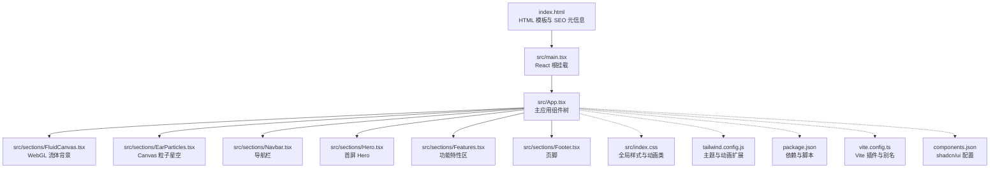
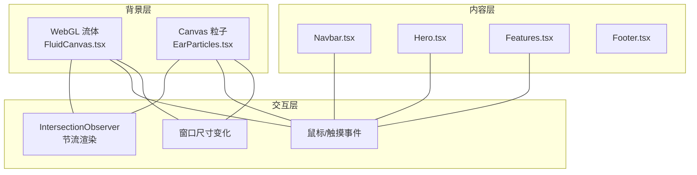
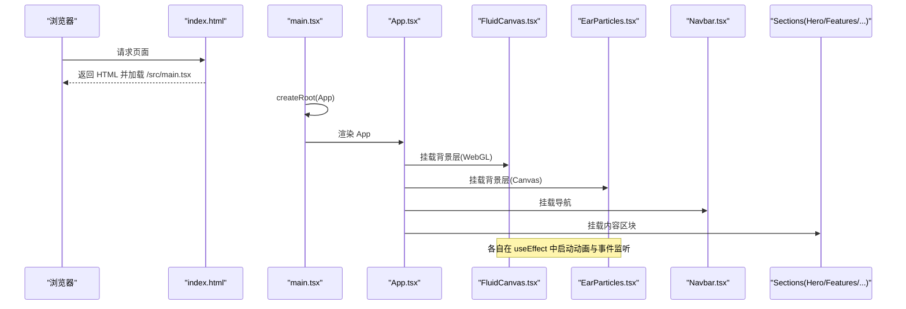
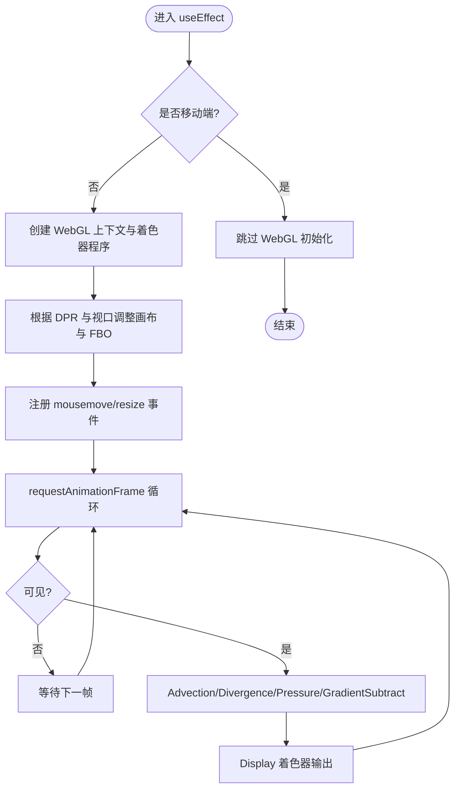
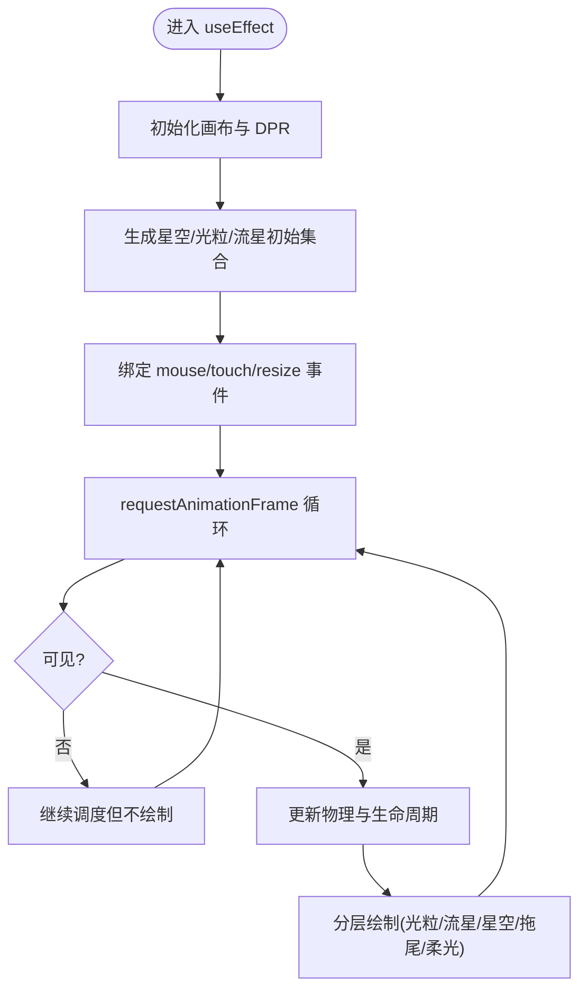
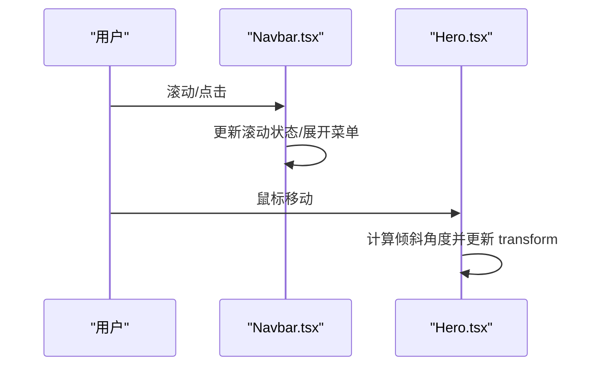
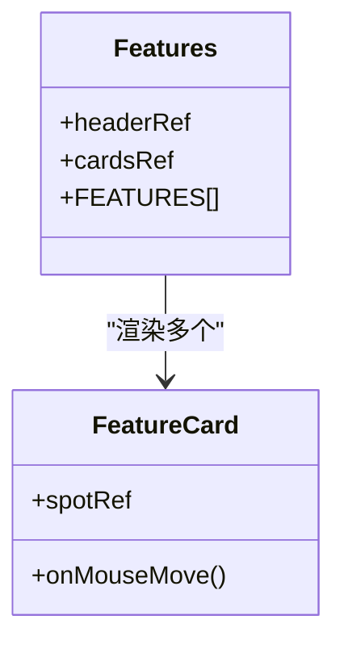
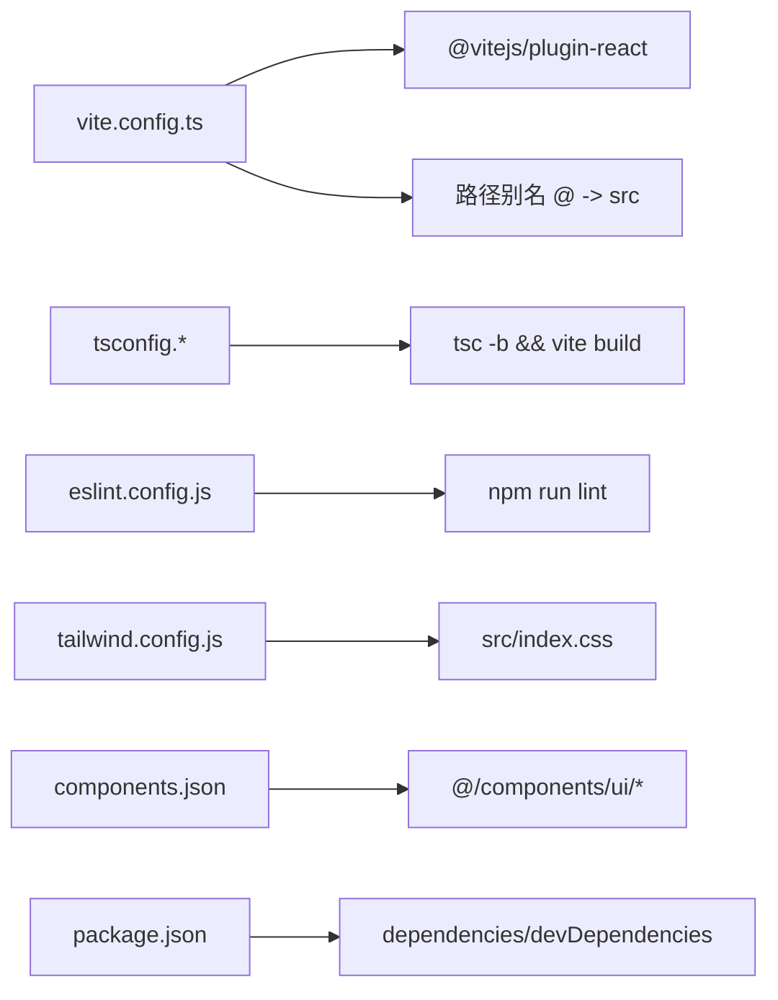

# 整体架构

<cite>
**本文引用的文件**   
- [index.html](file://index.html)
- [main.tsx](file://src/main.tsx)
- [App.tsx](file://src/App.tsx)
- [vite.config.ts](file://vite.config.ts)
- [package.json](file://package.json)
- [tailwind.config.js](file://tailwind.config.js)
- [components.json](file://components.json)
- [index.css](file://src/index.css)
- [FluidCanvas.tsx](file://src/sections/FluidCanvas.tsx)
- [EarParticles.tsx](file://src/sections/EarParticles.tsx)
- [Navbar.tsx](file://src/sections/Navbar.tsx)
- [Hero.tsx](file://src/sections/Hero.tsx)
- [Features.tsx](file://src/sections/Features.tsx)
- [Footer.tsx](file://src/sections/Footer.tsx)
- [use-mobile.ts](file://src/hooks/use-mobile.ts)
</cite>

## 目录
1. [简介](#简介)
2. [项目结构](#项目结构)
3. [核心组件](#核心组件)
4. [架构总览](#架构总览)
5. [详细组件分析](#详细组件分析)
6. [依赖分析](#依赖分析)
7. [性能考量](#性能考量)
8. [故障排查指南](#故障排查指南)
9. [结论](#结论)
10. [附录](#附录)

## 简介
本文件为挠荔枝官网的整体架构文档，面向产品、设计与工程团队。文档从系统边界、分层架构、渲染流程、路由策略、响应式与移动端适配、外部依赖集成点与扩展机制等维度进行系统化阐述，并辅以架构图与组件关系图，帮助读者快速理解应用的高层设计模式与实现要点。

## 项目结构
本项目采用 Vite + React（TypeScript）构建的单页应用，入口由 index.html 提供根节点，main.tsx 挂载 React 根实例，App.tsx 作为主应用组件组织页面区块与背景层。样式体系基于 Tailwind CSS 与自定义变量，UI 组件来自 shadcn/ui 生态并通过 components.json 配置别名。

图表来源
- [index.html:1-49](file://index.html#L1-L49)
- [main.tsx:1-11](file://src/main.tsx#L1-L11)
- [App.tsx:1-30](file://src/App.tsx#L1-L30)
- [FluidCanvas.tsx:1-470](file://src/sections/FluidCanvas.tsx#L1-L470)
- [EarParticles.tsx:1-560](file://src/sections/EarParticles.tsx#L1-L560)
- [Navbar.tsx:1-117](file://src/sections/Navbar.tsx#L1-L117)
- [Hero.tsx:1-141](file://src/sections/Hero.tsx#L1-L141)
- [Features.tsx:1-122](file://src/sections/Features.tsx#L1-L122)
- [Footer.tsx:1-62](file://src/sections/Footer.tsx#L1-L62)
- [index.css:1-116](file://src/index.css#L1-L116)
- [tailwind.config.js:1-92](file://tailwind.config.js#L1-L92)
- [package.json:1-80](file://package.json#L1-L80)
- [vite.config.ts:1-15](file://vite.config.ts#L1-L15)
- [components.json:1-23](file://components.json#L1-L23)

章节来源
- [index.html:1-49](file://index.html#L1-L49)
- [main.tsx:1-11](file://src/main.tsx#L1-L11)
- [App.tsx:1-30](file://src/App.tsx#L1-L30)
- [vite.config.ts:1-15](file://vite.config.ts#L1-L15)
- [package.json:1-80](file://package.json#L1-L80)
- [tailwind.config.js:1-92](file://tailwind.config.js#L1-L92)
- [components.json:1-23](file://components.json#L1-L23)
- [index.css:1-116](file://src/index.css#L1-L116)

## 核心组件
- 入口与挂载
  - index.html 提供根容器与 SEO 元信息，加载模块入口 main.tsx。
  - main.tsx 使用 React 19 createRoot 在 StrictMode 下挂载 App。
- 主应用组件 App.tsx
  - 负责组合背景层（WebGL 流体、Canvas 粒子）、导航、内容区块与页脚。
  - 通过相对定位与 z-index 将背景层置于底层，内容层浮于其上。
- 背景层
  - FluidCanvas：基于 WebGL 的流体模拟，仅在桌面端启用，移动端降级。
  - EarParticles：基于 Canvas 2D 的星空与光粒效果，支持鼠标/触摸交互与 IntersectionObserver 节流。
- 内容层
  - Navbar：固定顶部导航，滚动时背景模糊与阴影变化，移动端折叠菜单。
  - Hero：首屏文案与设备样机，包含 3D 倾斜跟随与下载引导。
  - Features：功能卡片网格，内置聚光灯与滚动入场动画。
  - Footer：品牌信息与法律链接。
- 样式与主题
  - index.css 定义暗色主题变量与滚动入场、聚光灯光晕等工具类。
  - tailwind.config.js 扩展字体、颜色、圆角、阴影与动画。
  - components.json 配置 shadcn/ui 的别名与图标库。

章节来源
- [index.html:1-49](file://index.html#L1-L49)
- [main.tsx:1-11](file://src/main.tsx#L1-L11)
- [App.tsx:1-30](file://src/App.tsx#L1-L30)
- [FluidCanvas.tsx:1-470](file://src/sections/FluidCanvas.tsx#L1-L470)
- [EarParticles.tsx:1-560](file://src/sections/EarParticles.tsx#L1-L560)
- [Navbar.tsx:1-117](file://src/sections/Navbar.tsx#L1-L117)
- [Hero.tsx:1-141](file://src/sections/Hero.tsx#L1-L141)
- [Features.tsx:1-122](file://src/sections/Features.tsx#L1-L122)
- [Footer.tsx:1-62](file://src/sections/Footer.tsx#L1-L62)
- [index.css:1-116](file://src/index.css#L1-L116)
- [tailwind.config.js:1-92](file://tailwind.config.js#L1-L92)
- [components.json:1-23](file://components.json#L1-L23)

## 架构总览
应用采用“背景层 + 内容层”的分层渲染模型：
- 背景层：两个全屏 canvas 分别承载 WebGL 流体与 Canvas 2D 粒子，固定定位且 pointer-events-none，不拦截用户交互。
- 内容层：以单页滚动为主，无客户端路由；各 section 通过锚点跳转。
- 交互层：事件监听集中在各自组件内部（如鼠标移动、触摸、窗口 resize），通过 IntersectionObserver 控制不可见时的渲染节流。

图表来源
- [FluidCanvas.tsx:1-470](file://src/sections/FluidCanvas.tsx#L1-L470)
- [EarParticles.tsx:1-560](file://src/sections/EarParticles.tsx#L1-L560)
- [Navbar.tsx:1-117](file://src/sections/Navbar.tsx#L1-L117)
- [Hero.tsx:1-141](file://src/sections/Hero.tsx#L1-L141)
- [Features.tsx:1-122](file://src/sections/Features.tsx#L1-L122)

## 详细组件分析

### 主应用组件 App.tsx 的组件树与渲染流程
- 组件树
  - 根容器设置深色背景与抗锯齿文本。
  - 背景层：FluidCanvas、EarParticles 置于最底层。
  - 内容层：Navbar 固定置顶，main 内顺序渲染 Hero、Features、TTSDemo、Highlights、CTA。
  - 页脚：Footer 位于底部。
- 渲染流程
  - 浏览器加载 index.html → main.tsx 创建 React 根 → 渲染 App → 子组件依次挂载。
  - 背景层在 useEffect 中初始化 WebGL/Canvas 上下文与动画循环，并在卸载时清理资源。
  - 内容层通过 Tailwind 布局与动画类完成排版与动效。

图表来源
- [index.html:1-49](file://index.html#L1-L49)
- [main.tsx:1-11](file://src/main.tsx#L1-L11)
- [App.tsx:1-30](file://src/App.tsx#L1-L30)
- [FluidCanvas.tsx:1-470](file://src/sections/FluidCanvas.tsx#L1-L470)
- [EarParticles.tsx:1-560](file://src/sections/EarParticles.tsx#L1-L560)
- [Navbar.tsx:1-117](file://src/sections/Navbar.tsx#L1-L117)
- [Hero.tsx:1-141](file://src/sections/Hero.tsx#L1-L141)
- [Features.tsx:1-122](file://src/sections/Features.tsx#L1-L122)

章节来源
- [App.tsx:1-30](file://src/App.tsx#L1-L30)
- [main.tsx:1-11](file://src/main.tsx#L1-L11)
- [index.html:1-49](file://index.html#L1-L49)

### WebGL 背景层：FluidCanvas.tsx
- 设计目标
  - 在桌面端提供低干扰的流体背景，增强沉浸感；移动端自动降级以避免性能问题。
- 关键实现
  - 使用 WebGL 着色器管线：splat、advection、divergence、pressure、gradientSubtract、display。
  - 双缓冲 FBO 管理速度场与染料场，按分辨率自适应计算 texelSize。
  - 通过 IntersectionObserver 检测可视性，不可见时暂停帧循环。
  - 鼠标移动注入 splat，产生随机星云色调的扰动。
- 数据流
  - 输入：指针位置与位移 → 更新 velocity/dye 纹理 → 压力求解与梯度减法 → 输出到屏幕。
- 复杂度与优化
  - 每帧多次 GPU 读写，迭代次数与分辨率决定性能开销；移动端直接跳过初始化。

图表来源
- [FluidCanvas.tsx:1-470](file://src/sections/FluidCanvas.tsx#L1-L470)

章节来源
- [FluidCanvas.tsx:1-470](file://src/sections/FluidCanvas.tsx#L1-L470)

### Canvas 粒子层：EarParticles.tsx
- 设计目标
  - 提供星空、光粒、流星与鼠标柔光拖尾等视觉层次，兼顾移动端性能。
- 关键实现
  - 预计算颜色数组减少运行时开销；桌面端增加粒子密度与交互力场。
  - 使用 IntersectionObserver 与时间片控制，不可见时仅调度不绘制。
  - 鼠标轨迹与柔光跟随采用 lerp 插值，营造延迟流体感。
- 数据流
  - 事件驱动更新状态（位置、速度、生命周期）→ 逐层绘制（光粒→流星→星空→鼠标拖尾→柔光）。
- 复杂度与优化
  - 桌面端粒子数量显著高于移动端；对亮星额外绘制十字芒与光晕，需权衡性能。

图表来源
- [EarParticles.tsx:1-560](file://src/sections/EarParticles.tsx#L1-L560)

章节来源
- [EarParticles.tsx:1-560](file://src/sections/EarParticles.tsx#L1-L560)

### 导航与首屏：Navbar.tsx 与 Hero.tsx
- Navbar
  - 滚动监听切换背景模糊与阴影；移动端折叠菜单；磁吸下载按钮复用 useMagnetic hook。
- Hero
  - 首屏文案与设备样机，鼠标移动触发 3D 倾斜；提供 App Store 下载入口与向下滚动提示。

图表来源
- [Navbar.tsx:1-117](file://src/sections/Navbar.tsx#L1-L117)
- [Hero.tsx:1-141](file://src/sections/Hero.tsx#L1-L141)

章节来源
- [Navbar.tsx:1-117](file://src/sections/Navbar.tsx#L1-L117)
- [Hero.tsx:1-141](file://src/sections/Hero.tsx#L1-L141)

### 功能展示：Features.tsx
- 使用滚动入场动画与聚光灯效果，卡片网格在 md 断点后三列布局。
- 每个卡片通过 useSpotlight 跟踪鼠标位置，动态更新 CSS 变量实现径向渐变光晕。

图表来源
- [Features.tsx:1-122](file://src/sections/Features.tsx#L1-L122)

章节来源
- [Features.tsx:1-122](file://src/sections/Features.tsx#L1-L122)

### 页脚：Footer.tsx
- 展示品牌、导航链接、GitHub 入口与隐私/协议链接，底部版权信息。

章节来源
- [Footer.tsx:1-62](file://src/sections/Footer.tsx#L1-L62)

## 依赖分析
- 构建与运行
  - Vite 作为开发服务器与打包工具，启用 @vitejs/plugin-react 与路径别名 @。
  - TypeScript 编译与类型检查，ESLint 静态检查。
- UI 与样式
  - Tailwind CSS 提供原子化样式，配合 tailwindcss-animate 与自定义 keyframes。
  - shadcn/ui 组件通过 components.json 配置别名与图标库（lucide）。
- 第三方库
  - React 19、react-dom 19；lucide-react 图标；embla-carousel-react、recharts、sonner 等按需引入。
- 外部资源
  - Google Fonts（Inter、Noto Sans SC）；favicon 与 OG 图片静态资源。

图表来源
- [vite.config.ts:1-15](file://vite.config.ts#L1-L15)
- [tailwind.config.js:1-92](file://tailwind.config.js#L1-L92)
- [components.json:1-23](file://components.json#L1-L23)
- [package.json:1-80](file://package.json#L1-L80)

章节来源
- [vite.config.ts:1-15](file://vite.config.ts#L1-L15)
- [tailwind.config.js:1-92](file://tailwind.config.js#L1-L92)
- [components.json:1-23](file://components.json#L1-L23)
- [package.json:1-80](file://package.json#L1-L80)

## 性能考量
- 背景层节流
  - 使用 IntersectionObserver 在元素不可见时暂停渲染循环，降低 CPU/GPU 占用。
- 移动端降级
  - WebGL 流体在移动端禁用；Canvas 粒子在移动端减少绘制细节与数量。
- 高分屏适配
  - 使用 devicePixelRatio 限制最大倍率，避免过高的像素填充成本。
- 动画与重绘
  - 尽量使用 CSS transform/opacity 提升合成效率；复杂图形在离屏 FBO/Canvas 上计算后一次性 blit。
- 资源与网络
  - 静态资源（图片、字体）建议开启缓存与压缩；OG 图片尺寸合理以减少首屏负载。

[本节为通用指导，无需源码引用]

## 故障排查指南
- WebGL 不可用或报错
  - 检查 getContext("webgl") 返回值与 OES_texture_half_float 扩展可用性；确认移动端已降级。
- 背景闪烁或撕裂
  - 检查 preserveDrawingBuffer 与 viewport 设置；确保每次 blit 前正确绑定 framebuffer。
- 移动端卡顿
  - 降低 SIM_RESOLUTION/DYE_RESOLUTION 与 PRESSURE_ITERATIONS；关闭不必要的辉光与十字芒。
- 事件未触发或内存泄漏
  - 确认 useEffect 清理函数移除所有 window 事件与 observer；避免重复绑定。
- 样式错乱
  - 检查 Tailwind 指令与变量是否正确导入；确认 dark 模式类名生效。

章节来源
- [FluidCanvas.tsx:1-470](file://src/sections/FluidCanvas.tsx#L1-L470)
- [EarParticles.tsx:1-560](file://src/sections/EarParticles.tsx#L1-L560)
- [index.css:1-116](file://src/index.css#L1-L116)

## 结论
该网站采用清晰的分层架构与单页滚动模式，背景层与内容层解耦，交互事件在各组件内局部处理，结合 IntersectionObserver 与移动端降级策略，实现了良好的视觉表现与性能平衡。通过 Tailwind 与 shadcn/ui 的组合，样式与组件可维护性强，易于扩展新的页面区块与交互效果。

[本节为总结，无需源码引用]

## 附录

### 路由策略与页面组织
- 当前为单页滚动站点，无客户端路由；通过锚点 #features、#download 等进行页面内导航。
- 如需多页面，可在 App.tsx 中引入 react-router-dom 并替换为 Router/Route 结构，同时保留背景层在全局挂载。

章节来源
- [App.tsx:1-30](file://src/App.tsx#L1-L30)
- [Navbar.tsx:1-117](file://src/sections/Navbar.tsx#L1-L117)
- [Hero.tsx:1-141](file://src/sections/Hero.tsx#L1-L141)

### 响应式布局与移动端适配方案
- 断点策略
  - 使用 Tailwind 响应式前缀（sm/md/lg/xl）控制栅格与间距；hooks/use-mobile.ts 提供 JS 侧断点判断。
- 背景层适配
  - 移动端禁用 WebGL 流体；Canvas 粒子减少密度与特效，保持流畅。
- 交互适配
  - 统一处理 mouse/touch 事件；移动端优先触摸体验，必要时隐藏复杂鼠标特效。

章节来源
- [use-mobile.ts:1-20](file://src/hooks/use-mobile.ts#L1-L20)
- [FluidCanvas.tsx:1-470](file://src/sections/FluidCanvas.tsx#L1-L470)
- [EarParticles.tsx:1-560](file://src/sections/EarParticles.tsx#L1-L560)
- [tailwind.config.js:1-92](file://tailwind.config.js#L1-L92)

### 系统边界与外部依赖集成点
- 系统边界
  - 前端应用边界：浏览器环境，DOM/CSS/WebGL/Canvas API。
  - 外部资源：Google Fonts、静态图片与 OG 封面。
- 集成点
  - Vite 插件与别名、Tailwind 主题与动画、shadcn/ui 组件与图标库、SEO 元数据与结构化数据。

章节来源
- [index.html:1-49](file://index.html#L1-L49)
- [vite.config.ts:1-15](file://vite.config.ts#L1-L15)
- [tailwind.config.js:1-92](file://tailwind.config.js#L1-L92)
- [components.json:1-23](file://components.json#L1-L23)
- [package.json:1-80](file://package.json#L1-L80)

### 扩展机制
- 新增页面区块
  - 在 sections 目录下新建组件，并在 App.tsx 中插入到 main 区域相应位置。
- 新增背景特效
  - 参考 FluidCanvas/EarParticles 的实现模式，封装独立组件，注意 IntersectionObserver 与事件清理。
- 新增交互 Hook
  - 在 hooks 目录添加自定义 Hook，供组件复用（如 use-magnetic、use-spotlight、use-scroll-reveal）。

章节来源
- [App.tsx:1-30](file://src/App.tsx#L1-L30)
- [FluidCanvas.tsx:1-470](file://src/sections/FluidCanvas.tsx#L1-L470)
- [EarParticles.tsx:1-560](file://src/sections/EarParticles.tsx#L1-L560)