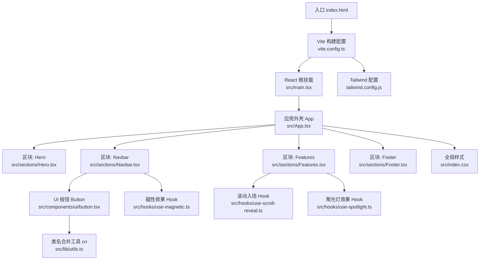
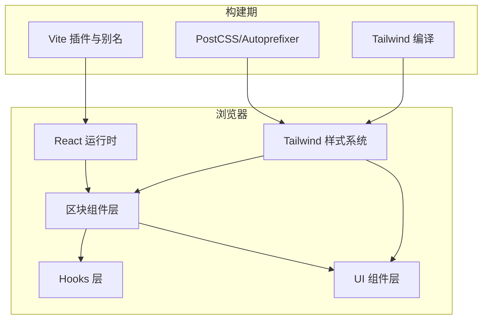
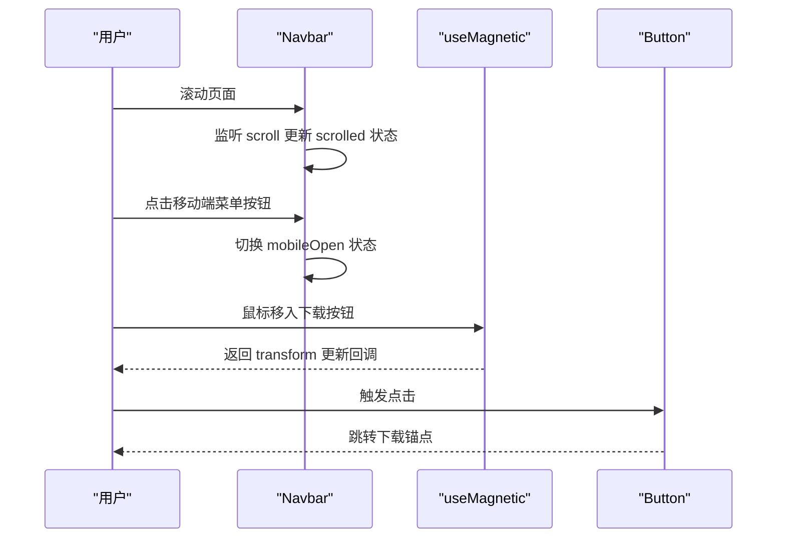
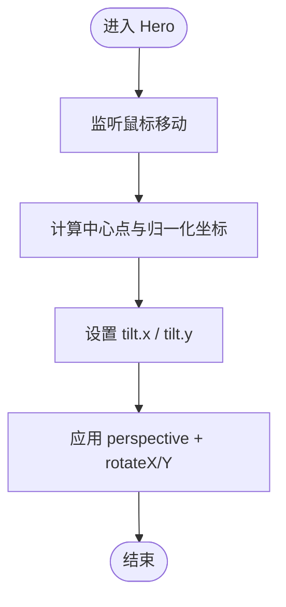
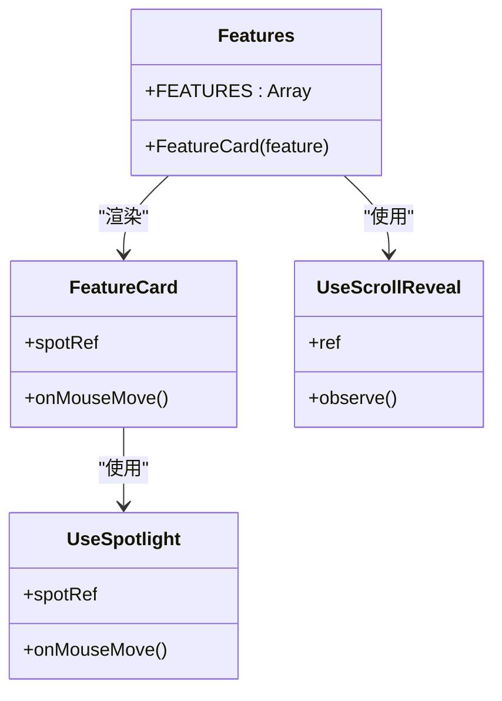
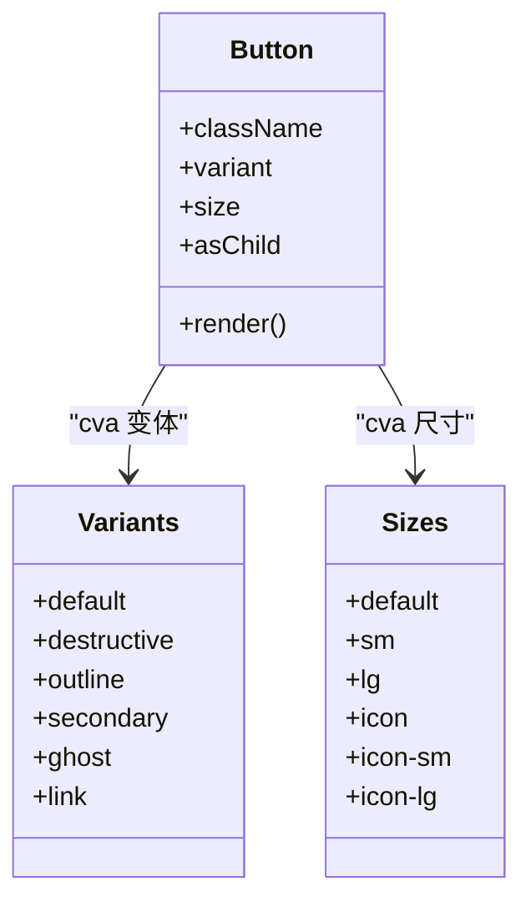
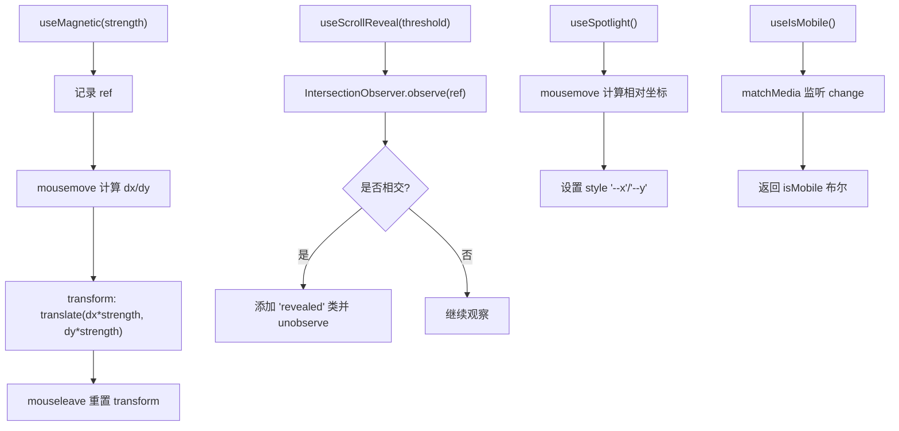
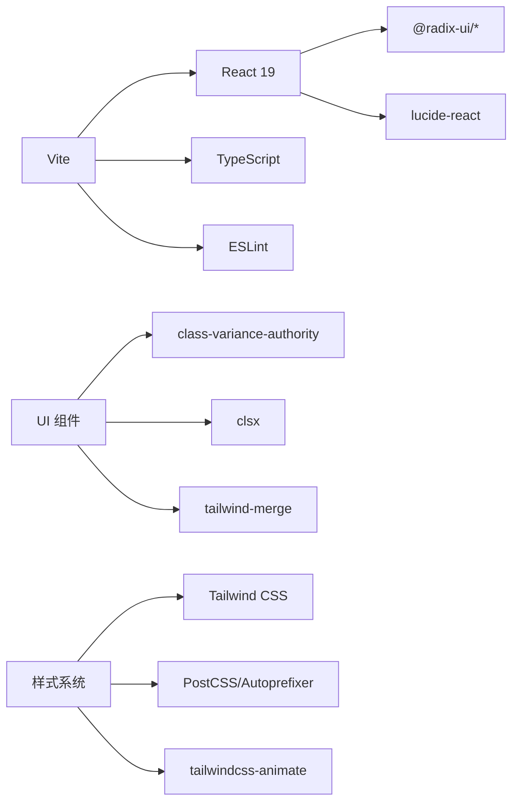
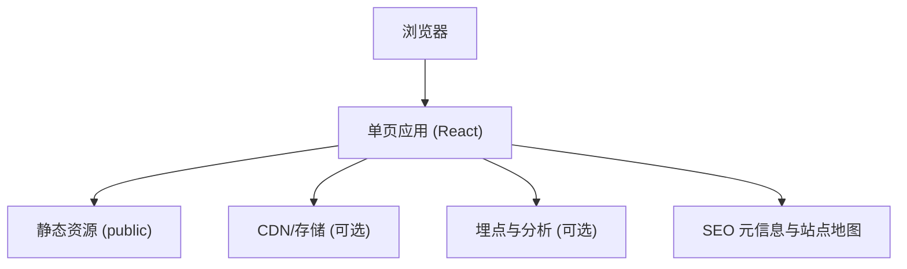
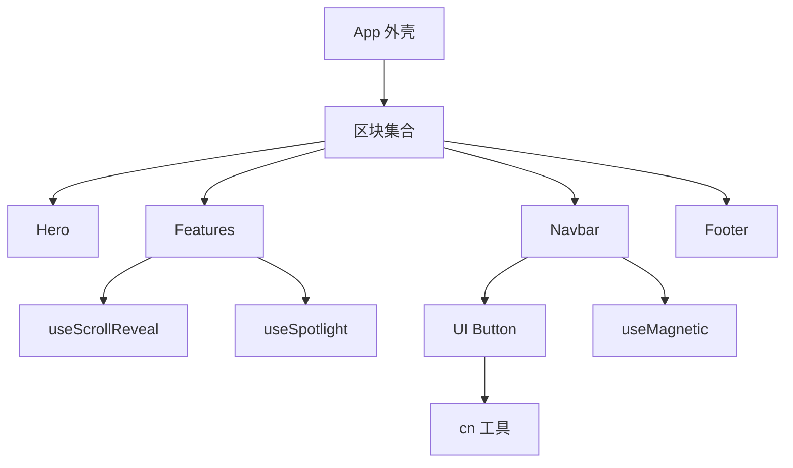

# 架构设计

<cite>
**本文引用的文件**   
- [package.json](file://package.json)
- [vite.config.ts](file://vite.config.ts)
- [tailwind.config.js](file://tailwind.config.js)
- [index.html](file://index.html)
- [src/main.tsx](file://src/main.tsx)
- [src/App.tsx](file://src/App.tsx)
- [src/index.css](file://src/index.css)
- [src/components/ui/button.tsx](file://src/components/ui/button.tsx)
- [src/lib/utils.ts](file://src/lib/utils.ts)
- [src/hooks/use-magnetic.ts](file://src/hooks/use-magnetic.ts)
- [src/hooks/use-mobile.ts](file://src/hooks/use-mobile.ts)
- [src/hooks/use-scroll-reveal.ts](file://src/hooks/use-scroll-reveal.ts)
- [src/hooks/use-spotlight.ts](file://src/hooks/use-spotlight.ts)
- [src/sections/Hero.tsx](file://src/sections/Hero.tsx)
- [src/sections/Navbar.tsx](file://src/sections/Navbar.tsx)
- [src/sections/Features.tsx](file://src/sections/Features.tsx)
- [src/sections/Footer.tsx](file://src/sections/Footer.tsx)
</cite>

## 目录
1. [简介](#简介)
2. [项目结构](#项目结构)
3. [核心组件](#核心组件)
4. [架构总览](#架构总览)
5. [详细组件分析](#详细组件分析)
6. [依赖分析](#依赖分析)
7. [性能考虑](#性能考虑)
8. [故障排查指南](#故障排查指南)
9. [结论](#结论)
10. [附录](#附录)

## 简介
本文件为“挠荔枝官网”的架构设计文档，面向产品、设计与工程团队，旨在清晰描述系统边界、高层架构、React 组件组织方式、数据流与状态管理策略、样式与主题体系、响应式策略、技术栈与第三方依赖、以及性能与兼容性考量。文档同时提供系统上下文图与组件分解图，帮助读者快速理解整体设计与关键实现路径。

## 项目结构
本项目采用 Vite + React + TypeScript 的单页应用（SPA）结构，页面以“区块（Section）”为单位进行组合，UI 组件库位于 components/ui，通用交互逻辑封装在 hooks，工具函数集中在 lib。构建与样式通过 Tailwind CSS 与 PostCSS 处理，资源静态托管于 public。

图表来源
- [vite.config.ts:1-15](file://vite.config.ts#L1-L15)
- [src/main.tsx:1-11](file://src/main.tsx#L1-L11)
- [src/App.tsx:1-30](file://src/App.tsx#L1-L30)
- [src/sections/Hero.tsx:1-141](file://src/sections/Hero.tsx#L1-L141)
- [src/sections/Features.tsx:1-91](file://src/sections/Features.tsx#L1-L91)
- [src/sections/Navbar.tsx:1-117](file://src/sections/Navbar.tsx#L1-L117)
- [src/sections/Footer.tsx:1-62](file://src/sections/Footer.tsx#L1-L62)
- [src/components/ui/button.tsx:1-63](file://src/components/ui/button.tsx#L1-L63)
- [src/lib/utils.ts:1-7](file://src/lib/utils.ts#L1-L7)
- [src/hooks/use-magnetic.ts:1-32](file://src/hooks/use-magnetic.ts#L1-L32)
- [src/hooks/use-scroll-reveal.ts:1-34](file://src/hooks/use-scroll-reveal.ts#L1-L34)
- [src/hooks/use-spotlight.ts:1-21](file://src/hooks/use-spotlight.ts#L1-L21)
- [tailwind.config.js:1-92](file://tailwind.config.js#L1-L92)

章节来源
- [vite.config.ts:1-15](file://vite.config.ts#L1-L15)
- [src/main.tsx:1-11](file://src/main.tsx#L1-L11)
- [src/App.tsx:1-30](file://src/App.tsx#L1-L30)
- [tailwind.config.js:1-92](file://tailwind.config.js#L1-L92)

## 核心组件
- 应用外壳 App：负责页面骨架与区块组合，设置全局背景与排版基础样式。
- 区块组件（Sections）：Hero、Features、Navbar、Footer 等，按业务语义划分，便于独立维护与复用。
- UI 组件库：Button 等原子化组件，基于 Radix UI 与 class-variance-authority 实现变体与尺寸控制。
- 自定义 Hooks：useMagnetic、useScrollReveal、useSpotlight、useIsMobile 等，封装跨组件复用的交互与能力。
- 工具函数：cn 用于安全合并 Tailwind 类名，避免冲突并提升可读性。

章节来源
- [src/App.tsx:1-30](file://src/App.tsx#L1-L30)
- [src/sections/Hero.tsx:1-141](file://src/sections/Hero.tsx#L1-L141)
- [src/sections/Features.tsx:1-91](file://src/sections/Features.tsx#L1-L91)
- [src/sections/Navbar.tsx:1-117](file://src/sections/Navbar.tsx#L1-L117)
- [src/sections/Footer.tsx:1-62](file://src/sections/Footer.tsx#L1-L62)
- [src/components/ui/button.tsx:1-63](file://src/components/ui/button.tsx#L1-L63)
- [src/hooks/use-magnetic.ts:1-32](file://src/hooks/use-magnetic.ts#L1-L32)
- [src/hooks/use-scroll-reveal.ts:1-34](file://src/hooks/use-scroll-reveal.ts#L1-L34)
- [src/hooks/use-spotlight.ts:1-21](file://src/hooks/use-spotlight.ts#L1-L21)
- [src/hooks/use-mobile.ts:1-20](file://src/hooks/use-mobile.ts#L1-L20)
- [src/lib/utils.ts:1-7](file://src/lib/utils.ts#L1-L7)

## 架构总览
系统边界清晰：浏览器端 SPA，无服务端渲染；静态资源由 Vite 打包输出；样式与主题通过 Tailwind 变量驱动；交互与动画通过原生 DOM API 与 CSS 变量完成，降低运行时开销。

图表来源
- [vite.config.ts:1-15](file://vite.config.ts#L1-L15)
- [tailwind.config.js:1-92](file://tailwind.config.js#L1-L92)
- [src/main.tsx:1-11](file://src/main.tsx#L1-L11)
- [src/App.tsx:1-30](file://src/App.tsx#L1-L30)

## 详细组件分析

### 应用外壳与页面组合
- 职责：定义全局布局容器、背景色与字体反锯齿；组合各区块形成完整落地页。
- 数据流：无外部数据源，纯展示型组合。
- 可访问性与体验：使用相对定位与层级 z-index 确保内容浮层不被背景特效遮挡。

章节来源
- [src/App.tsx:1-30](file://src/App.tsx#L1-L30)

### 导航栏 Navbar
- 职责：顶部固定导航、滚动时背景模糊与阴影变化、移动端菜单展开/收起、磁吸下载按钮。
- 状态管理：本地 state 控制滚动态与移动端菜单开关；事件监听 scroll 更新状态。
- 交互增强：通过 useMagnetic 实现鼠标靠近时的位移吸引效果。
- 响应式：桌面端水平链接+按钮，移动端折叠菜单。

图表来源
- [src/sections/Navbar.tsx:1-117](file://src/sections/Navbar.tsx#L1-L117)
- [src/hooks/use-magnetic.ts:1-32](file://src/hooks/use-magnetic.ts#L1-L32)
- [src/components/ui/button.tsx:1-63](file://src/components/ui/button.tsx#L1-L63)

章节来源
- [src/sections/Navbar.tsx:1-117](file://src/sections/Navbar.tsx#L1-L117)
- [src/hooks/use-magnetic.ts:1-32](file://src/hooks/use-magnetic.ts#L1-L32)
- [src/components/ui/button.tsx:1-63](file://src/components/ui/button.tsx#L1-L63)

### 首屏 Hero
- 职责：品牌主张、价值点展示、CTA 引导与设备样机演示。
- 交互：鼠标移动计算倾斜角度，配合 perspective 与 rotateX/Y 产生 3D 视差。
- 视觉：动态波形与光晕装饰，强调音频朗读主题。

图表来源
- [src/sections/Hero.tsx:1-141](file://src/sections/Hero.tsx#L1-L141)

章节来源
- [src/sections/Hero.tsx:1-141](file://src/sections/Hero.tsx#L1-L141)

### 特性区 Features
- 职责：以卡片形式呈现三大核心能力，配合滚动入场与聚光灯效果。
- 交互：useScrollReveal 在元素进入视口时添加 revealed 类；useSpotlight 将鼠标位置写入 CSS 变量 --x/--y，驱动径向渐变光晕。
- 数据模型：FEATURES 数组驱动卡片渲染，便于扩展与维护。

图表来源
- [src/sections/Features.tsx:1-91](file://src/sections/Features.tsx#L1-L91)
- [src/hooks/use-scroll-reveal.ts:1-34](file://src/hooks/use-scroll-reveal.ts#L1-L34)
- [src/hooks/use-spotlight.ts:1-21](file://src/hooks/use-spotlight.ts#L1-L21)

章节来源
- [src/sections/Features.tsx:1-91](file://src/sections/Features.tsx#L1-L91)
- [src/hooks/use-scroll-reveal.ts:1-34](file://src/hooks/use-scroll-reveal.ts#L1-L34)
- [src/hooks/use-spotlight.ts:1-21](file://src/hooks/use-spotlight.ts#L1-L21)

### 底部 Footer
- 职责：品牌信息、站点导航、法律链接与版权信息。
- 特点：简洁、稳定、SEO 友好（包含站点标识与链接）。

章节来源
- [src/sections/Footer.tsx:1-62](file://src/sections/Footer.tsx#L1-L62)

### UI 组件 Button
- 职责：统一按钮外观与行为，支持多 variant 与 size，兼容 asChild 透传。
- 设计模式：基于 class-variance-authority 声明变体，结合 cn 工具合并类名，保证样式优先级与可维护性。

图表来源
- [src/components/ui/button.tsx:1-63](file://src/components/ui/button.tsx#L1-L63)
- [src/lib/utils.ts:1-7](file://src/lib/utils.ts#L1-L7)

章节来源
- [src/components/ui/button.tsx:1-63](file://src/components/ui/button.tsx#L1-L63)
- [src/lib/utils.ts:1-7](file://src/lib/utils.ts#L1-L7)

### 自定义 Hooks 详解
- useMagnetic：根据鼠标相对元素中心的偏移量，按比例计算 translate 位移，营造“磁吸”感。
- useScrollReveal：基于 IntersectionObserver 监听元素进入视口，添加 reveal 类触发 CSS 动画，且仅触发一次。
- useSpotlight：将鼠标位置写入 CSS 变量 --x/--y，供 CSS 径向渐变使用，实现跟随光晕。
- useIsMobile：基于 matchMedia 监听断点变化，返回布尔值，辅助响应式分支。

图表来源
- [src/hooks/use-magnetic.ts:1-32](file://src/hooks/use-magnetic.ts#L1-L32)
- [src/hooks/use-scroll-reveal.ts:1-34](file://src/hooks/use-scroll-reveal.ts#L1-L34)
- [src/hooks/use-spotlight.ts:1-21](file://src/hooks/use-spotlight.ts#L1-L21)
- [src/hooks/use-mobile.ts:1-20](file://src/hooks/use-mobile.ts#L1-L20)

章节来源
- [src/hooks/use-magnetic.ts:1-32](file://src/hooks/use-magnetic.ts#L1-L32)
- [src/hooks/use-scroll-reveal.ts:1-34](file://src/hooks/use-scroll-reveal.ts#L1-L34)
- [src/hooks/use-spotlight.ts:1-21](file://src/hooks/use-spotlight.ts#L1-L21)
- [src/hooks/use-mobile.ts:1-20](file://src/hooks/use-mobile.ts#L1-L20)

## 依赖分析
- 构建与开发
  - Vite：作为开发与构建工具，启用 React 插件与路径别名 @。
  - TypeScript：类型检查与编译。
  - ESLint：代码规范检查。
- 运行时依赖
  - React 19：前端框架。
  - Radix UI 系列：无障碍友好的基础组件（如 Dialog、Tooltip 等），当前项目中已引入 Tooltip 并在 UI 中使用。
  - class-variance-authority + clsx + tailwind-merge：样式变体与类名合并方案。
  - lucide-react：图标库。
  - next-themes：主题切换（当前未直接使用，但已引入）。
  - date-fns、recharts、embla-carousel 等：按需引入，当前页面未直接依赖。
- 样式与主题
  - Tailwind CSS：原子化样式，darkMode 使用 class 策略，通过 CSS 变量映射主题色板。
  - PostCSS + Autoprefixer：自动补全前缀。
  - tailwindcss-animate：动画 keyframes 与 animation 预设。

图表来源
- [package.json:1-80](file://package.json#L1-L80)
- [vite.config.ts:1-15](file://vite.config.ts#L1-L15)
- [tailwind.config.js:1-92](file://tailwind.config.js#L1-L92)

章节来源
- [package.json:1-80](file://package.json#L1-L80)
- [vite.config.ts:1-15](file://vite.config.ts#L1-L15)
- [tailwind.config.js:1-92](file://tailwind.config.js#L1-L92)

## 性能考虑
- 渲染与重排
  - 使用 CSS 变量与 transform 实现动效，减少布局抖动与重排。
  - IntersectionObserver 仅触发一次，避免重复计算。
- 资源与体积
  - 按需引入 Radix 子包与图标，避免全量引入。
  - 静态资源（图片、SVG）放置于 public，构建期优化。
- 样式生成
  - Tailwind 仅扫描 src 与 index.html，减少无用样式。
- 交互成本
  - 磁吸与聚光灯效果仅在必要区域绑定事件，避免全局监听。
- 可访问性
  - 使用 Radix 组件保障键盘与屏幕阅读器体验。
  - 按钮与链接具备合适的 aria-label 与焦点样式。

[本节为通用指导，不直接分析具体文件]

## 故障排查指南
- 构建失败
  - 检查 TypeScript 版本与 React 类型匹配，确认 vite.config.ts 中别名 @ 指向正确。
  - 若 Tailwind 样式未生效，确认 content 路径覆盖到所有 .tsx/.ts 文件。
- 样式冲突
  - 使用 cn 工具合并类名，避免 Tailwind 类名顺序导致的覆盖问题。
- 动效异常
  - 检查 CSS 变量 --x/--y 是否正确设置；确认 IntersectionObserver 的 threshold 与目标元素可见性。
- 移动端适配
  - 使用 useIsMobile 判断断点，确保菜单与布局在小屏下正常显示。
- 主题与暗色模式
  - darkMode 使用 class 策略，需确保根节点或父级存在对应 class。

章节来源
- [vite.config.ts:1-15](file://vite.config.ts#L1-L15)
- [tailwind.config.js:1-92](file://tailwind.config.js#L1-L92)
- [src/lib/utils.ts:1-7](file://src/lib/utils.ts#L1-L7)
- [src/hooks/use-scroll-reveal.ts:1-34](file://src/hooks/use-scroll-reveal.ts#L1-L34)
- [src/hooks/use-spotlight.ts:1-21](file://src/hooks/use-spotlight.ts#L1-L21)
- [src/hooks/use-mobile.ts:1-20](file://src/hooks/use-mobile.ts#L1-L20)

## 结论
本项目采用清晰的“区块 + UI 组件 + Hooks”分层架构，结合 Tailwind 与 Radix 生态，实现了高可维护性与良好用户体验。通过 CSS 变量与原生 API 实现动效，兼顾性能与可访问性。后续可在以下方向持续优化：
- 引入路由与懒加载，进一步提升首屏性能。
- 完善主题系统，集中管理颜色与间距 Token。
- 增加单元测试与端到端测试，保障交互稳定性。

[本节为总结性内容，不直接分析具体文件]

## 附录

### 系统上下文图

[此图为概念性说明，无需源码映射]

### 组件分解图

图表来源
- [src/App.tsx:1-30](file://src/App.tsx#L1-L30)
- [src/sections/Hero.tsx:1-141](file://src/sections/Hero.tsx#L1-L141)
- [src/sections/Features.tsx:1-91](file://src/sections/Features.tsx#L1-L91)
- [src/sections/Navbar.tsx:1-117](file://src/sections/Navbar.tsx#L1-L117)
- [src/sections/Footer.tsx:1-62](file://src/sections/Footer.tsx#L1-L62)
- [src/components/ui/button.tsx:1-63](file://src/components/ui/button.tsx#L1-L63)
- [src/hooks/use-scroll-reveal.ts:1-34](file://src/hooks/use-scroll-reveal.ts#L1-L34)
- [src/hooks/use-spotlight.ts:1-21](file://src/hooks/use-spotlight.ts#L1-L21)
- [src/hooks/use-magnetic.ts:1-32](file://src/hooks/use-magnetic.ts#L1-L32)
- [src/lib/utils.ts:1-7](file://src/lib/utils.ts#L1-L7)

### 基础设施要求
- Node.js 环境（建议与 package.json 中脚本兼容的版本）
- 现代浏览器（支持 CSS 变量、IntersectionObserver、matchMedia）
- 静态资源托管（Vite 构建产物）

[本节为通用指导，不直接分析具体文件]

### 响应式设计策略
- 断点：使用 Tailwind 内置断点与 useIsMobile 钩子协同。
- 布局：网格与弹性布局结合，小屏优先堆叠，大屏分栏。
- 交互：移动端隐藏复杂悬停效果，保留触摸友好操作。

章节来源
- [tailwind.config.js:1-92](file://tailwind.config.js#L1-L92)
- [src/hooks/use-mobile.ts:1-20](file://src/hooks/use-mobile.ts#L1-L20)

### 横切关注点
- 样式系统：Tailwind + CSS 变量，统一主题色板与圆角、阴影、动画。
- 主题管理：darkMode 使用 class 策略，可通过 next-themes 集成（当前未直接使用）。
- 浏览器兼容性：Autoprefixer 自动补全前缀，IntersectionObserver 与 matchMedia 广泛支持。

章节来源
- [tailwind.config.js:1-92](file://tailwind.config.js#L1-L92)
- [package.json:1-80](file://package.json#L1-L80)

### 技术栈与版本兼容性
- 框架与语言：React 19、TypeScript ~5.9
- 构建工具：Vite ^7.2、@vitejs/plugin-react ^5.1
- 样式：Tailwind CSS ^3.4、PostCSS ^8.5、Autoprefixer ^10.4
- UI 基础：Radix UI 系列（Dialog、Tooltip 等）、class-variance-authority、clsx、tailwind-merge
- 图标：lucide-react ^0.562
- 其他：next-themes、date-fns、recharts、embla-carousel、sonner、zod、react-hook-form 等（按需引入）

章节来源
- [package.json:1-80](file://package.json#L1-L80)