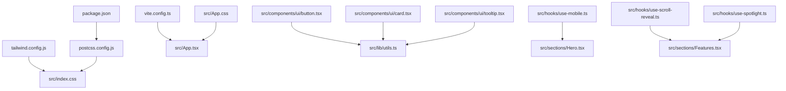
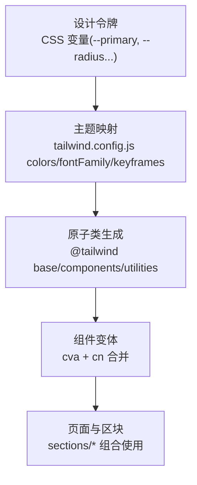
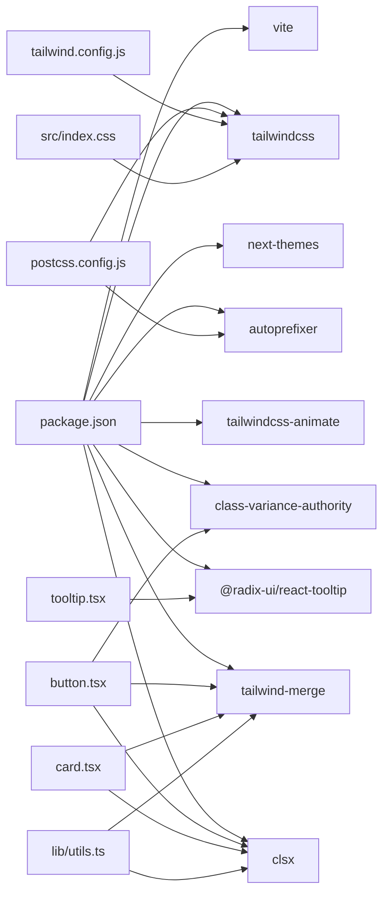

# 样式系统

<cite>
**本文引用的文件**
- [tailwind.config.js](file://tailwind.config.js)
- [postcss.config.js](file://postcss.config.js)
- [src/index.css](file://src/index.css)
- [src/App.css](file://src/App.css)
- [components.json](file://components.json)
- [vite.config.ts](file://vite.config.ts)
- [package.json](file://package.json)
- [src/components/ui/button.tsx](file://src/components/ui/button.tsx)
- [src/components/ui/card.tsx](file://src/components/ui/card.tsx)
- [src/components/ui/tooltip.tsx](file://src/components/ui/tooltip.tsx)
- [src/lib/utils.ts](file://src/lib/utils.ts)
- [src/hooks/use-mobile.ts](file://src/hooks/use-mobile.ts)
- [src/hooks/use-scroll-reveal.ts](file://src/hooks/use-scroll-reveal.ts)
- [src/hooks/use-spotlight.ts](file://src/hooks/use-spotlight.ts)
- [src/sections/Hero.tsx](file://src/sections/Hero.tsx)
- [src/sections/Features.tsx](file://src/sections/Features.tsx)
</cite>

## 目录
1. [简介](#简介)
2. [项目结构](#项目结构)
3. [核心组件](#核心组件)
4. [架构总览](#架构总览)
5. [详细组件分析](#详细组件分析)
6. [依赖分析](#依赖分析)
7. [性能考虑](#性能考虑)
8. [故障排查指南](#故障排查指南)
9. [结论](#结论)
10. [附录](#附录)

## 简介
本样式系统文档面向挠荔枝官网的样式工程，围绕基于 Tailwind CSS 的原子化样式架构与设计令牌体系展开。内容涵盖主题配置、颜色与字体规范、响应式策略与断点管理、CSS 自定义属性与全局样式组织、动画与过渡效果、视觉设计规范、样式性能优化、浏览器兼容性处理、开发工作流、样式定制与主题扩展方法，以及 PostCSS 配置与构建优化策略。目标是帮助开发者快速理解并高效扩展样式系统。

## 项目结构
样式相关的关键文件与职责：
- 构建与工具链
  - tailwind.config.js：Tailwind 主题扩展、设计令牌映射、动画与插件
  - postcss.config.js：PostCSS 插件（Tailwind、Autoprefixer）
  - vite.config.ts：Vite 别名与基础路径
  - package.json：脚本与依赖版本
- 全局样式与令牌
  - src/index.css：Tailwind 层注入、CSS 变量（明/暗主题）、滚动入场与聚光灯光晕等通用工具类
  - src/App.css：平滑滚动、选择高亮、滚动条美化
- UI 组件与变体
  - src/components/ui/*：基于 class-variance-authority 的按钮、卡片、提示框等可复用组件
  - src/lib/utils.ts：clsx + tailwind-merge 的工具函数 cn
- 交互与动效 Hook
  - use-mobile.ts：移动端断点判断
  - use-scroll-reveal.ts：滚动入场观察器
  - use-spotlight.ts：鼠标跟随光晕
- 页面与区块
  - sections/*：使用上述样式系统与组件组合而成的业务区块

图表来源
- [tailwind.config.js:1-92](file://tailwind.config.js#L1-L92)
- [postcss.config.js:1-7](file://postcss.config.js#L1-L7)
- [src/index.css:1-116](file://src/index.css#L1-L116)
- [vite.config.ts:1-15](file://vite.config.ts#L1-L15)
- [package.json:1-80](file://package.json#L1-L80)
- [src/components/ui/button.tsx:1-63](file://src/components/ui/button.tsx#L1-L63)
- [src/components/ui/card.tsx:1-93](file://src/components/ui/card.tsx#L1-L93)
- [src/components/ui/tooltip.tsx:1-62](file://src/components/ui/tooltip.tsx#L1-L62)
- [src/lib/utils.ts:1-7](file://src/lib/utils.ts#L1-L7)
- [src/hooks/use-mobile.ts:1-19](file://src/hooks/use-mobile.ts#L1-L19)
- [src/hooks/use-scroll-reveal.ts:1-34](file://src/hooks/use-scroll-reveal.ts#L1-L34)
- [src/hooks/use-spotlight.ts:1-20](file://src/hooks/use-spotlight.ts#L1-L20)
- [src/sections/Hero.tsx:1-141](file://src/sections/Hero.tsx#L1-L141)
- [src/sections/Features.tsx:1-127](file://src/sections/Features.tsx#L1-L127)

章节来源
- [tailwind.config.js:1-92](file://tailwind.config.js#L1-L92)
- [postcss.config.js:1-7](file://postcss.config.js#L1-L7)
- [src/index.css:1-116](file://src/index.css#L1-L116)
- [src/App.css:1-29](file://src/App.css#L1-L29)
- [vite.config.ts:1-15](file://vite.config.ts#L1-L15)
- [package.json:1-80](file://package.json#L1-L80)

## 核心组件
- 按钮 Button
  - 使用 class-variance-authority 定义 variant 与 size 变体，结合 cn 合并类名，统一焦点环、禁用态与图标尺寸等细节。
  - 通过 data-slot/data-variant/data-size 标记便于调试与测试定位。
- 卡片 Card 系列
  - 提供 Card、CardHeader、CardTitle、CardDescription、CardAction、CardContent、CardFooter 等语义化子块，内部使用容器查询与网格布局实现灵活排版。
- 提示 Tooltip
  - 基于 Radix UI 封装，内置进入/退出动画与箭头定位，使用数据状态驱动样式切换。

章节来源
- [src/components/ui/button.tsx:1-63](file://src/components/ui/button.tsx#L1-L63)
- [src/components/ui/card.tsx:1-93](file://src/components/ui/card.tsx#L1-L93)
- [src/components/ui/tooltip.tsx:1-62](file://src/components/ui/tooltip.tsx#L1-L62)
- [src/lib/utils.ts:1-7](file://src/lib/utils.ts#L1-L7)

## 架构总览
样式系统采用“设计令牌 → 主题映射 → 原子类 → 组件变体”的分层架构：
- 设计令牌：以 CSS 自定义属性集中定义明/暗主题色板、圆角、阴影等
- 主题映射：在 Tailwind 配置中将 token 映射到语义化颜色键（如 primary、destructive）
- 原子类：通过 @tailwind base/components/utilities 注入，配合 utilities 层扩展通用工具类
- 组件变体：UI 组件通过 cva 组合原子类，形成稳定一致的交互与外观

图表来源
- [tailwind.config.js:1-92](file://tailwind.config.js#L1-L92)
- [src/index.css:1-116](file://src/index.css#L1-L116)
- [src/components/ui/button.tsx:1-63](file://src/components/ui/button.tsx#L1-L63)
- [src/components/ui/card.tsx:1-93](file://src/components/ui/card.tsx#L1-L93)
- [src/components/ui/tooltip.tsx:1-62](file://src/components/ui/tooltip.tsx#L1-L62)

## 详细组件分析

### 主题与颜色系统
- 设计令牌
  - 在根 :root 与 .dark 下定义背景、前景、主色、强调、破坏、边框、输入、环、圆角等变量，确保明/暗模式一致的可维护性。
  - 品牌主色为荔枝红，用于 primary 及其前景色、ring 等关键交互元素。
- 主题映射
  - Tailwind 的 colors 扩展将语义化键映射到对应 CSS 变量，支持 alpha 值语法；borderRadius 与 boxShadow 也基于变量派生。
- 字体规范
  - 默认无衬线字体族包含 Inter 与 Noto Sans SC，兼顾英文与中文显示质量。
- 全局样式
  - index.css 中引入 Google Fonts，并通过 @layer base 设置 body 默认背景与文本颜色，统一全站基础样式。
  - App.css 提供平滑滚动、选择高亮与 WebKit 滚动条美化。

章节来源
- [src/index.css:1-116](file://src/index.css#L1-L116)
- [tailwind.config.js:1-92](file://tailwind.config.js#L1-L92)
- [src/App.css:1-29](file://src/App.css#L1-L29)

### 响应式设计与断点管理
- Tailwind 默认断点体系（sm/md/lg/xl 等）在各区块广泛使用，如 Hero 中的栅格与间距在不同屏幕下的适配。
- 运行时断点
  - use-mobile.ts 暴露 useIsMobile Hook，基于 matchMedia 监听 768px 以下，供需要 JS 分支逻辑的场景使用。

章节来源
- [src/sections/Hero.tsx:1-141](file://src/sections/Hero.tsx#L1-L141)
- [src/hooks/use-mobile.ts:1-19](file://src/hooks/use-mobile.ts#L1-L19)

### CSS 自定义属性与全局样式组织
- 自定义属性
  - 所有主题色、圆角、阴影均通过 CSS 变量暴露，Tailwind 通过 hsl(var(...)) 引用，实现运行时主题切换。
- 分层组织
  - @layer base：基础重置与全局默认
  - @layer components：组件级样式（由 shadcn 生成的组件内联原子类为主）
  - @layer utilities：通用工具类（如 reveal、spotlight-glow）
- 工具类
  - reveal/reveal-stagger：滚动入场与交错延迟
  - spotlight-card/spotlight-glow：配合 useSpotlight Hook 实现鼠标跟随光晕

章节来源
- [src/index.css:71-116](file://src/index.css#L71-L116)
- [src/hooks/use-spotlight.ts:1-20](file://src/hooks/use-spotlight.ts#L1-L20)

### 动画系统与过渡效果
- Tailwind 动画
  - 通过 tailwindcss-animate 与 keyframes/animation 扩展，提供折叠面板、光标闪烁、波形等动画。
- 自定义动画
  - 滚动入场：reveal 与 reveal-stagger 配合 IntersectionObserver 触发 revealed 类
  - 聚光灯：useSpotlight 更新 --x/--y，spotlight-glow 用径向渐变渲染光晕
  - 音频波形：TTSDemo 中使用 animate-wave 模拟频谱跳动
- 过渡与微交互
  - 按钮 hover/focus-visible、卡片 hover 位移与缩放、阴影增强等

章节来源
- [tailwind.config.js:65-92](file://tailwind.config.js#L65-L92)
- [src/index.css:80-116](file://src/index.css#L80-L116)
- [src/hooks/use-scroll-reveal.ts:1-34](file://src/hooks/use-scroll-reveal.ts#L1-L34)
- [src/hooks/use-spotlight.ts:1-20](file://src/hooks/use-spotlight.ts#L1-L20)
- [src/sections/TTSDemo.tsx:276-343](file://src/sections/TTSDemo.tsx#L276-L343)

### 视觉设计规范
- 色彩
  - 明/暗两套色板，主色用于品牌强调与焦点环；辅助色用于次级信息与装饰。
- 字体
  - 标题层级使用更粗字重与紧凑行距，正文保持可读性与舒适行高。
- 圆角与阴影
  - 圆角基于 --radius 派生 sm/md/lg/xl/xs；阴影 xs 作为轻量层级区分。
- 间距与栅格
  - 使用 Tailwind 间距与栅格类，保证多端一致性。

章节来源
- [tailwind.config.js:55-64](file://tailwind.config.js#L55-L64)
- [src/index.css:71-78](file://src/index.css#L71-L78)

### 组件样式实现要点
- Button
  - 变体：default、destructive、outline、secondary、ghost、link
  - 尺寸：default、sm、lg、icon/icon-sm/icon-lg
  - 焦点环与无障碍：focus-visible ring、aria-invalid 状态
- Card
  - 头部网格布局与操作区对齐，描述文字使用 muted 色与较小字号
- Tooltip
  - 进入/退出动画、箭头定位、z-index 层级控制

章节来源
- [src/components/ui/button.tsx:1-63](file://src/components/ui/button.tsx#L1-L63)
- [src/components/ui/card.tsx:1-93](file://src/components/ui/card.tsx#L1-L93)
- [src/components/ui/tooltip.tsx:1-62](file://src/components/ui/tooltip.tsx#L1-L62)

### 页面与区块示例
- Hero
  - 使用响应式栅格与间距，主标题与副文案层次清晰，CTA 按钮带阴影与悬停位移
- Features
  - 使用 reveal-stagger 实现卡片列表交错入场，FeatureCard 集成聚光灯效果

章节来源
- [src/sections/Hero.tsx:1-141](file://src/sections/Hero.tsx#L1-L141)
- [src/sections/Features.tsx:1-127](file://src/sections/Features.tsx#L1-L127)

## 依赖分析
样式相关的依赖关系如下：

图表来源
- [package.json:1-80](file://package.json#L1-L80)
- [postcss.config.js:1-7](file://postcss.config.js#L1-L7)
- [tailwind.config.js:1-92](file://tailwind.config.js#L1-L92)
- [src/index.css:1-116](file://src/index.css#L1-L116)
- [src/components/ui/button.tsx:1-63](file://src/components/ui/button.tsx#L1-L63)
- [src/components/ui/card.tsx:1-93](file://src/components/ui/card.tsx#L1-L93)
- [src/components/ui/tooltip.tsx:1-62](file://src/components/ui/tooltip.tsx#L1-L62)
- [src/lib/utils.ts:1-7](file://src/lib/utils.ts#L1-L7)

章节来源
- [package.json:1-80](file://package.json#L1-L80)
- [postcss.config.js:1-7](file://postcss.config.js#L1-L7)
- [tailwind.config.js:1-92](file://tailwind.config.js#L1-L92)
- [src/index.css:1-116](file://src/index.css#L1-L116)
- [src/components/ui/button.tsx:1-63](file://src/components/ui/button.tsx#L1-L63)
- [src/components/ui/card.tsx:1-93](file://src/components/ui/card.tsx#L1-L93)
- [src/components/ui/tooltip.tsx:1-62](file://src/components/ui/tooltip.tsx#L1-L62)
- [src/lib/utils.ts:1-7](file://src/lib/utils.ts#L1-L7)

## 性能考虑
- 构建期优化
  - Tailwind 仅扫描 content 路径，避免未使用样式进入产物
  - Autoprefixer 按需添加前缀，减少冗余
- 运行时优化
  - 动画优先使用 transform/opacity，避免布局抖动
  - 滚动入场使用 IntersectionObserver 且只触发一次，降低重复计算
  - 聚光灯效果通过 CSS 变量与径向渐变，避免复杂 DOM 操作
- 资源加载
  - 字体通过 Google Fonts 异步加载，注意网络与缓存策略
  - Canvas 动画仅在可见时运行，减少不必要的绘制

[本节为通用指导，不直接分析具体文件]

## 故障排查指南
- 主题变量未生效
  - 检查 index.css 中 :root/.dark 是否包含所需变量，确认 darkMode 策略与根节点 class 是否正确
- 颜色或圆角不一致
  - 核对 tailwind.config.js 的 colors/borderRadius 映射是否与 CSS 变量同名
- 动画未触发
  - 确认 reveal/revealed 类是否被正确添加；IntersectionObserver 阈值与回调是否正常
- 聚光灯位置异常
  - 检查 useSpotlight 绑定的 ref 与 onMouseMove 事件，确认 --x/--y 变量已更新
- 组件样式冲突
  - 使用 cn 合并类名，确保优先级与覆盖顺序符合预期

章节来源
- [src/index.css:71-116](file://src/index.css#L71-L116)
- [tailwind.config.js:1-92](file://tailwind.config.js#L1-L92)
- [src/hooks/use-scroll-reveal.ts:1-34](file://src/hooks/use-scroll-reveal.ts#L1-L34)
- [src/hooks/use-spotlight.ts:1-20](file://src/hooks/use-spotlight.ts#L1-L20)
- [src/lib/utils.ts:1-7](file://src/lib/utils.ts#L1-L7)

## 结论
本样式系统以 CSS 自定义属性为核心，结合 Tailwind 的原子化能力与 class-variance-authority 的组件变体机制，实现了高内聚、低耦合、易扩展的主题与组件体系。通过统一的令牌、清晰的层级与完善的动效规范，既保证了视觉一致性，又提升了开发与迭代效率。

[本节为总结性内容，不直接分析具体文件]

## 附录

### 主题定制与扩展指南
- 新增颜色
  - 在 index.css 的 :root/.dark 中添加新变量，并在 tailwind.config.js 的 colors 中映射语义化键
- 调整圆角与阴影
  - 修改 --radius 与 boxShadow 扩展项，即可全局生效
- 新增字体
  - 在 fontFamily 中追加字体族，并在 index.css 中引入字体资源
- 新增动画
  - 在 keyframes/animation 中注册新动画，或在 utilities 层编写工具类

章节来源
- [tailwind.config.js:1-92](file://tailwind.config.js#L1-L92)
- [src/index.css:1-116](file://src/index.css#L1-L116)

### PostCSS 配置与构建优化
- 插件链
  - tailwindcss 负责原子类生成与主题解析
  - autoprefixer 负责跨浏览器前缀注入
- 构建脚本
  - dev/build/preview 脚本由 Vite 驱动，TypeScript 编译后打包
- 别名与路径
  - 通过 Vite resolve.alias 简化导入路径

章节来源
- [postcss.config.js:1-7](file://postcss.config.js#L1-L7)
- [package.json:1-80](file://package.json#L1-L80)
- [vite.config.ts:1-15](file://vite.config.ts#L1-L15)

### 开发工作流建议
- 组件样式
  - 优先使用原子类与 cn 合并，必要时在 utilities 层抽取通用工具类
- 主题切换
  - 使用 next-themes 管理主题状态，确保根节点 class 同步
- 代码审查
  - 关注变量命名一致性、动画性能与可访问性（焦点环、ARIA）

章节来源
- [components.json:1-23](file://components.json#L1-L23)
- [src/components/ui/button.tsx:1-63](file://src/components/ui/button.tsx#L1-L63)
- [src/components/ui/card.tsx:1-93](file://src/components/ui/card.tsx#L1-L93)
- [src/components/ui/tooltip.tsx:1-62](file://src/components/ui/tooltip.tsx#L1-L62)