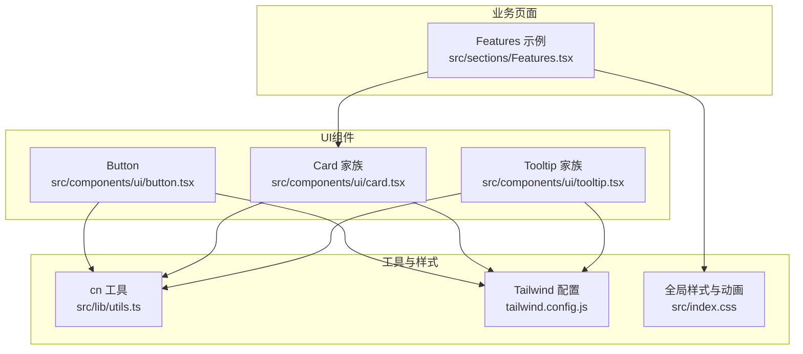
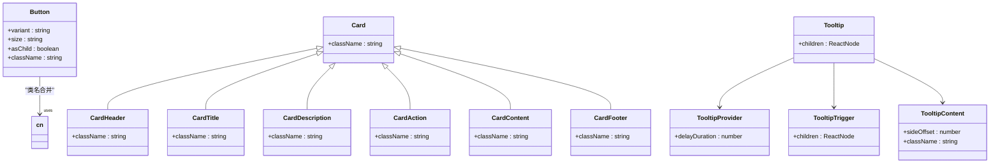
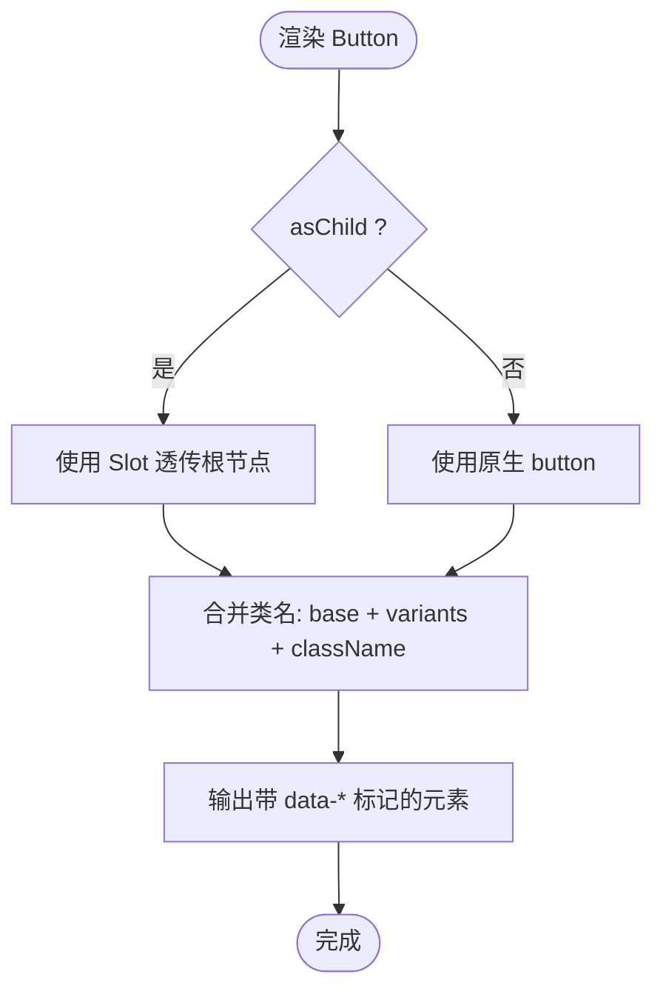
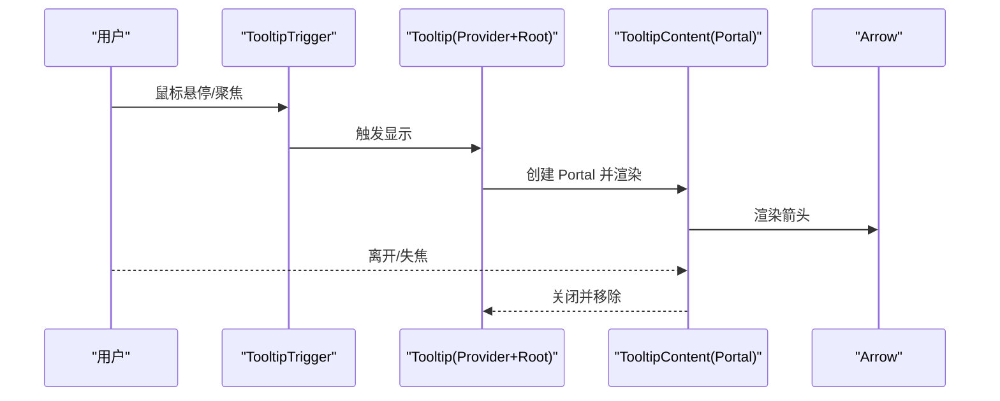
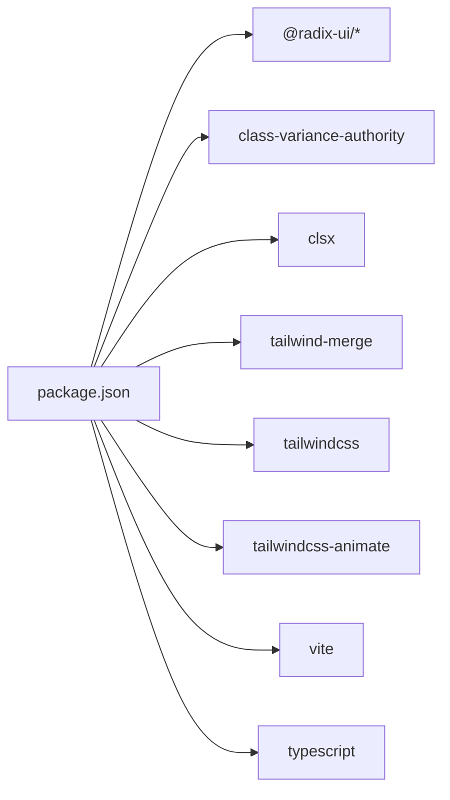

# UI组件库

<cite>
**本文引用的文件**   
- [button.tsx](file://src/components/ui/button.tsx)
- [card.tsx](file://src/components/ui/card.tsx)
- [tooltip.tsx](file://src/components/ui/tooltip.tsx)
- [utils.ts](file://src/lib/utils.ts)
- [tailwind.config.js](file://tailwind.config.js)
- [components.json](file://components.json)
- [package.json](file://package.json)
- [index.css](file://src/index.css)
- [Features.tsx](file://src/sections/Features.tsx)
</cite>

## 目录
1. [简介](#简介)
2. [项目结构](#项目结构)
3. [核心组件](#核心组件)
4. [架构总览](#架构总览)
5. [详细组件分析](#详细组件分析)
6. [依赖关系分析](#依赖关系分析)
7. [性能考虑](#性能考虑)
8. [故障排查指南](#故障排查指南)
9. [结论](#结论)
10. [附录：新增组件规范与示例](#附录新增组件规范与示例)

## 简介
本文件为“挠荔枝官网”的UI组件库文档，聚焦基础UI组件的设计理念、API设计、样式定制与主题支持，并阐述基于Radix UI的可访问性实现。同时提供组合使用模式、扩展机制、测试策略与性能建议，帮助团队快速复用与扩展高质量、可访问的基础组件。

## 项目结构
UI组件位于 src/components/ui 下，采用“按功能拆分 + 原子化样式”的组织方式；样式通过 Tailwind CSS 与 CSS 变量体系管理，主题色、圆角、阴影等均可在配置中统一调整。工具函数 cn 用于合并类名，避免冲突。



图表来源
- [button.tsx:1-63](file://src/components/ui/button.tsx#L1-L63)
- [card.tsx:1-93](file://src/components/ui/card.tsx#L1-L93)
- [tooltip.tsx:1-62](file://src/components/ui/tooltip.tsx#L1-L62)
- [utils.ts:1-7](file://src/lib/utils.ts#L1-L7)
- [tailwind.config.js:1-92](file://tailwind.config.js#L1-L92)
- [index.css:71-116](file://src/index.css#L71-L116)
- [Features.tsx:1-127](file://src/sections/Features.tsx#L1-L127)

章节来源
- [components.json:1-23](file://components.json#L1-L23)
- [package.json:1-80](file://package.json#L1-L80)

## 核心组件
- Button 按钮：基于 class-variance-authority 的变体系统，支持多 variant/size，asChild 透传渲染，内置焦点环与无障碍属性。
- Card 卡片：由 Card、CardHeader、CardTitle、CardDescription、CardAction、CardContent、CardFooter 组成的复合组件，语义清晰、布局灵活。
- Tooltip 提示框：基于 Radix Tooltip 封装，包含 Provider/Root/Trigger/Content/Arrow，默认动画与定位，Portal 挂载。

章节来源
- [button.tsx:1-63](file://src/components/ui/button.tsx#L1-L63)
- [card.tsx:1-93](file://src/components/ui/card.tsx#L1-L93)
- [tooltip.tsx:1-62](file://src/components/ui/tooltip.tsx#L1-L62)

## 架构总览
组件层遵循“无状态外观 + 行为委托”的原则：
- 外观层：通过 Tailwind 原子类与 CSS 变量驱动主题与响应式。
- 行为层：Tooltip 使用 Radix 提供的受控状态与无障碍能力；Button 通过 Slot 将子元素作为原生 button 或自定义根节点渲染。
- 工具层：cn 负责类名合并，确保覆盖与优先级可控。



图表来源
- [button.tsx:1-63](file://src/components/ui/button.tsx#L1-L63)
- [card.tsx:1-93](file://src/components/ui/card.tsx#L1-L93)
- [tooltip.tsx:1-62](file://src/components/ui/tooltip.tsx#L1-L62)
- [utils.ts:1-7](file://src/lib/utils.ts#L1-L7)

## 详细组件分析

### Button 按钮
- 设计理念
  - 以 cva 定义变体矩阵（variant × size），集中管理视觉差异。
  - asChild 透传渲染，便于与路由链接、第三方交互组件无缝集成。
  - 内建键盘可达性与焦点可见性，适配深色主题。
- API 接口
  - 属性
    - variant: default | destructive | outline | secondary | ghost | link
    - size: default | sm | lg | icon | icon-sm | icon-lg
    - asChild: boolean
    - className: string
    - 其余原生 button 属性透传
  - 导出
    - Button 组件
    - buttonVariants 变体工厂（供外部复用）
- 样式定制
  - 通过 Tailwind 颜色 token（primary、destructive、background 等）实现主题切换。
  - 使用 data-variant/data-size 进行调试与选择器增强。
- 无障碍
  - 保留原生 button 语义；禁用态 pointer-events 与透明度处理；focus-visible 环与 aria-invalid 错误态。
- 组合与扩展
  - 与图标库配合（SVG 自动尺寸与收缩）。
  - 通过 asChild 包裹 Link 或第三方按钮，保持可访问性与样式一致。



图表来源
- [button.tsx:1-63](file://src/components/ui/button.tsx#L1-L63)
- [utils.ts:1-7](file://src/lib/utils.ts#L1-L7)

章节来源
- [button.tsx:1-63](file://src/components/ui/button.tsx#L1-L63)
- [tailwind.config.js:10-54](file://tailwind.config.js#L10-L54)

### Card 卡片
- 设计理念
  - 复合组件拆分职责：容器、头部、标题、描述、动作区、内容、底部，便于组合与复用。
  - 使用 grid 与 @container 提升布局弹性，支持右侧 Action 区域对齐。
- API 接口
  - Card / CardHeader / CardTitle / CardDescription / CardAction / CardContent / CardFooter
  - 均接受 className 与原生 div 属性透传
- 样式定制
  - 通过 data-slot 标记定位各子块，便于调试与选择器增强。
  - 主题色 card/card-foreground 控制背景与文字。
- 无障碍
  - 语义化标签组合，适合屏幕阅读器阅读顺序。
- 组合与扩展
  - 可与 Button 组合形成操作区；与 Tooltip 组合提供说明信息。

```mermaid
sequenceDiagram
participant App as "业务页面"
participant Card as "Card"
participant Header as "CardHeader"
participant Title as "CardTitle"
participant Desc as "CardDescription"
participant Content as "CardContent"
participant Footer as "CardFooter"
App->>Card : 渲染卡片容器
Card->>Header : 渲染头部
Header->>Title : 渲染标题
Header->>Desc : 渲染描述
Card->>Content : 渲染主体内容
Card->>Footer : 渲染底部操作
Note over App,Footer : 通过 data-slot 与 grid 布局组织
```

图表来源
- [card.tsx:1-93](file://src/components/ui/card.tsx#L1-L93)

章节来源
- [card.tsx:1-93](file://src/components/ui/card.tsx#L1-L93)
- [tailwind.config.js:40-54](file://tailwind.config.js#L40-L54)

### Tooltip 提示框
- 设计理念
  - 基于 Radix Tooltip 构建，提供 Portal 渲染、箭头、入场动画与定位计算。
  - 内部自动注入 TooltipProvider，简化使用。
- API 接口
  - TooltipProvider: delayDuration
  - Tooltip: Root 容器
  - TooltipTrigger: 触发器
  - TooltipContent: sideOffset、children、className
- 样式定制
  - 默认使用 foreground/background 配色，支持 data-[state] 与 data-[side] 选择器。
  - 可通过 className 覆盖默认样式。
- 无障碍
  - 由 Radix 管理 focus 管理、ARIA 属性与键盘交互。
- 组合与扩展
  - 与 Button/Card 组合提供上下文说明；可嵌套于复杂布局中。



图表来源
- [tooltip.tsx:1-62](file://src/components/ui/tooltip.tsx#L1-L62)

章节来源
- [tooltip.tsx:1-62](file://src/components/ui/tooltip.tsx#L1-L62)
- [package.json:39-39](file://package.json#L39-L39)

## 依赖关系分析
- 运行时依赖
  - React 与 ReactDOM
  - Radix UI 系列（@radix-ui/react-tooltip、@radix-ui/react-slot 等）
  - class-variance-authority、clsx、tailwind-merge
  - tailwindcss 与插件（animate）
- 构建与开发
  - Vite、TypeScript、ESLint、PostCSS、Autoprefixer



图表来源
- [package.json:1-80](file://package.json#L1-L80)

章节来源
- [package.json:1-80](file://package.json#L1-L80)

## 性能考虑
- 类名合并
  - 使用 cn 合并 clsx 与 tailwind-merge，减少重复与冲突，降低重排风险。
- 动画与过渡
  - 使用 Tailwind 动画与 transform/opacity 优化，避免昂贵布局属性。
- Portal 与层级
  - Tooltip 使用 Portal 渲染，避免父级 overflow 裁剪与 z-index 问题。
- 条件渲染
  - 仅在需要时渲染 TooltipContent，减少 DOM 节点数量。
- 主题切换
  - 通过 CSS 变量切换主题，避免全量样式重建。

[本节为通用指导，不直接分析具体文件]

## 故障排查指南
- 样式未生效
  - 检查 Tailwind content 路径是否包含组件所在目录。
  - 确认 index.css 已引入并在入口加载。
- 主题色不一致
  - 核对 tailwind.config.js 中的 color 映射与 CSS 变量值。
- Tooltip 被遮挡
  - 检查父级 overflow 与 z-index；必要时调整 sideOffset 或外层容器。
- 按钮点击无效
  - 若使用 asChild，确保透传的根节点支持事件冒泡与可点击语义。

章节来源
- [tailwind.config.js:1-10](file://tailwind.config.js#L1-L10)
- [index.css:71-116](file://src/index.css#L71-L116)

## 结论
本组件库以 Radix 为基础保障可访问性，结合 Tailwind 与 CSS 变量实现高内聚、低耦合的样式体系。Button、Card、Tooltip 三类基础组件覆盖了常见交互场景，并通过清晰的 API 与数据标记便于调试与扩展。建议在业务中优先复用这些组件，并遵循统一的命名与主题约定，以保证一致的体验与维护效率。

[本节为总结，不直接分析具体文件]

## 附录：新增组件规范与示例

### 设计规范
- 文件位置
  - 新增组件放入 src/components/ui/<name>.tsx
- 命名与导出
  - 组件名 PascalCase，按需导出；如需要暴露变体工厂，一并导出。
- 样式策略
  - 使用 Tailwind 原子类与 CSS 变量；必要时使用 data-slot 标记。
  - 通过 cn 合并类名，避免冲突。
- 可访问性
  - 优先使用 Radix 原语；保留原生语义；确保键盘可达与 ARIA 正确。
- 主题支持
  - 使用 primary/secondary/foreground 等 token，支持明暗主题。
- 类型安全
  - 使用 React.ComponentProps<"xxx"> 继承原生属性；对自定义属性显式声明。

### 示例：如何组合使用
- 在 Features 中使用 Card 与自定义光晕效果
  - 参考路径：[Features.tsx:1-127](file://src/sections/Features.tsx#L1-L127)
- 在页面中使用 Button 与 Tooltip
  - 参考路径：
    - [button.tsx:1-63](file://src/components/ui/button.tsx#L1-L63)
    - [tooltip.tsx:1-62](file://src/components/ui/tooltip.tsx#L1-L62)

### 测试策略
- 单元测试
  - 使用 React Testing Library 断言渲染结果与属性透传。
  - 针对 Button 的 variant/size/asChild 分支进行覆盖。
- 交互测试
  - 使用 Playwright/Cypress 模拟 hover/focus/blur，验证 Tooltip 显示与隐藏。
- 可访问性测试
  - 使用 axe-core 扫描页面，确保无关键无障碍问题。
- 快照测试
  - 对复杂 Card 组合进行快照对比，防止意外回归。

[本节为通用指导，不直接分析具体文件]