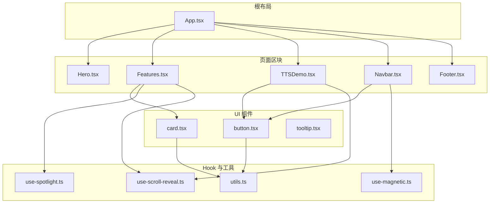
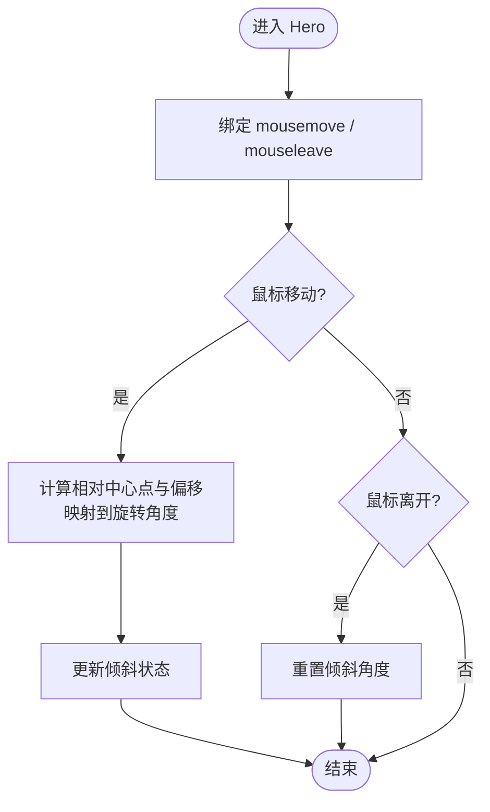
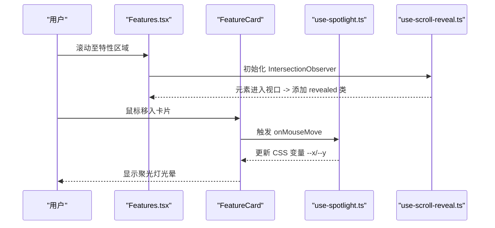
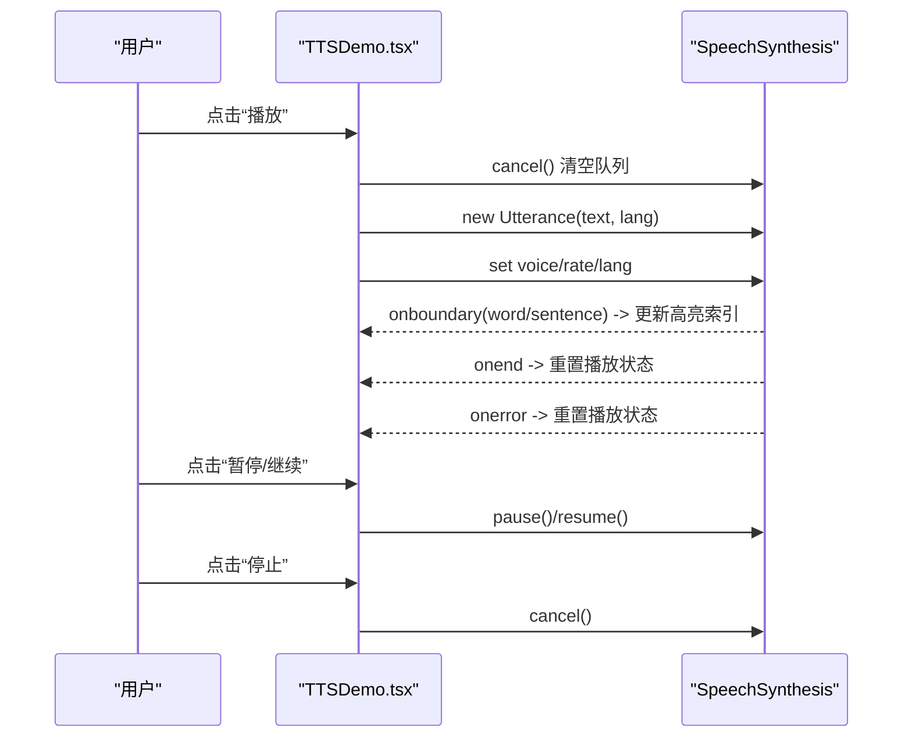
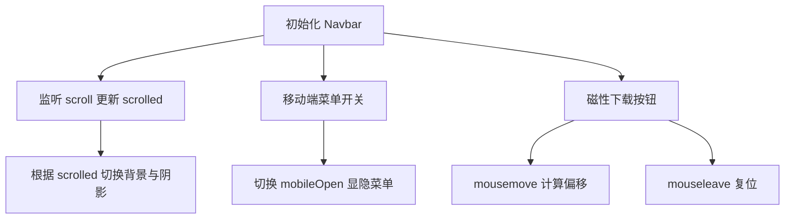
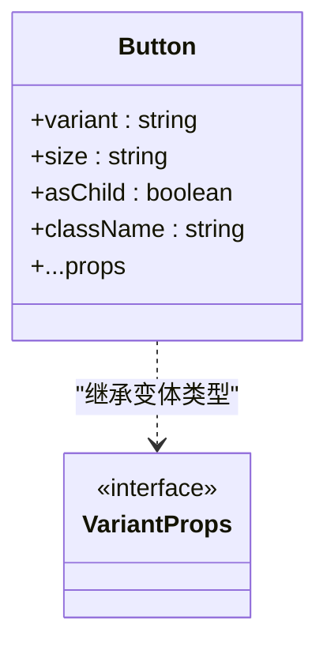
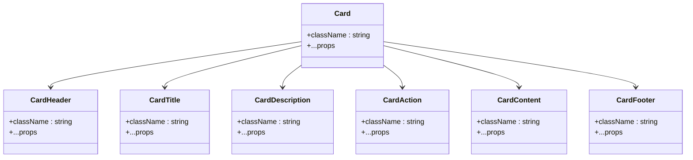
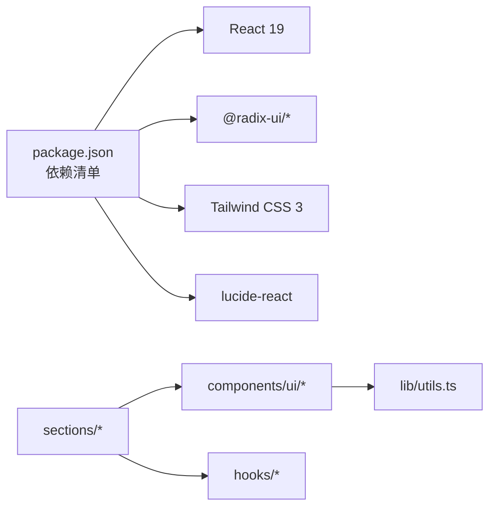

# 组件架构

<cite>
**本文引用的文件**   
- [main.tsx](file://src/main.tsx)
- [App.tsx](file://src/App.tsx)
- [Hero.tsx](file://src/sections/Hero.tsx)
- [Features.tsx](file://src/sections/Features.tsx)
- [TTSDemo.tsx](file://src/sections/TTSDemo.tsx)
- [Navbar.tsx](file://src/sections/Navbar.tsx)
- [Footer.tsx](file://src/sections/Footer.tsx)
- [button.tsx](file://src/components/ui/button.tsx)
- [card.tsx](file://src/components/ui/card.tsx)
- [tooltip.tsx](file://src/components/ui/tooltip.tsx)
- [use-scroll-reveal.ts](file://src/hooks/use-scroll-reveal.ts)
- [use-spotlight.ts](file://src/hooks/use-spotlight.ts)
- [use-magnetic.ts](file://src/hooks/use-magnetic.ts)
- [utils.ts](file://src/lib/utils.ts)
- [package.json](file://package.json)
- [README.md](file://README.md)
</cite>

## 目录
1. [简介](#简介)
2. [项目结构](#项目结构)
3. [核心组件](#核心组件)
4. [架构总览](#架构总览)
5. [详细组件分析](#详细组件分析)
6. [依赖关系分析](#依赖关系分析)
7. [性能考量](#性能考量)
8. [故障排查指南](#故障排查指南)
9. [结论](#结论)
10. [附录：使用示例与最佳实践](#附录使用示例与最佳实践)

## 简介
本文件为“挠荔枝官网”的 React 组件架构文档，聚焦页面区块（sections）、UI 组件库（components/ui）与工具组件的职责划分、组件间依赖与通信机制、可复用性与组合模式，并深入解析 Hero、Features、TTSDemo 等核心页面组件的实现架构。同时记录 UI 组件库的设计规范与扩展方法，涵盖生命周期管理、性能优化策略与错误处理机制，并提供使用示例与最佳实践。

## 项目结构
- 入口与根布局
  - 应用入口在 main.tsx 中通过 createRoot 挂载 App 组件，并使用 StrictMode 开启严格模式。
  - App.tsx 作为根容器，组织全局背景层（流体画布、粒子）、导航栏、主内容区（多个 sections）与页脚。
- 页面区块（sections）
  - 按功能分块：Hero、Features、TTSDemo、Highlights、CTA、Navbar、Footer 等，每个区块负责独立的内容与交互。
- UI 组件库（components/ui）
  - 基于 shadcn/ui 与 Radix primitives 的可复用基础组件：Button、Card、Tooltip 等，统一样式与变体。
- 自定义 Hooks（hooks）
  - 提供滚动入场、聚光灯跟随、磁性按钮等通用交互能力，供页面区块复用。
- 工具函数（lib）
  - 提供 className 合并工具 cn，用于 Tailwind 类名安全合并。

```mermaid
graph TB
A["main.tsx<br/>应用入口"] --> B["App.tsx<br/>根布局"]
B --> C["Navbar.tsx<br/>导航栏"]
B --> D["Hero.tsx<br/>首屏"]
B --> E["Features.tsx<br/>特性展示"]
B --> F["TTSDemo.tsx<br/>TTS 演示"]
B --> G["Highlights.tsx<br/>亮点展示"]
B --> H["CTA.tsx<br/>行动号召"]
B --> I["Footer.tsx<br/>页脚"]
E --> J["use-spotlight.ts<br/>聚光灯 Hook"]
E --> K["use-scroll-reveal.ts<br/>滚动入场 Hook"]
F --> L["use-scroll-reveal.ts"]
C --> M["use-magnetic.ts<br/>磁性效果 Hook"]
F --> N["button.tsx<br/>UI Button"]
E --> O["card.tsx<br/>UI Card"]
N --> P["utils.ts<br/>cn 工具"]
O --> P
```

图表来源
- [main.tsx:1-11](file://src/main.tsx#L1-L11)
- [App.tsx:1-30](file://src/App.tsx#L1-L30)
- [Navbar.tsx:1-117](file://src/sections/Navbar.tsx#L1-L117)
- [Hero.tsx:1-141](file://src/sections/Hero.tsx#L1-L141)
- [Features.tsx:1-127](file://src/sections/Features.tsx#L1-L127)
- [TTSDemo.tsx:1-344](file://src/sections/TTSDemo.tsx#L1-L344)
- [button.tsx:1-63](file://src/components/ui/button.tsx#L1-L63)
- [card.tsx:1-93](file://src/components/ui/card.tsx#L1-L93)
- [use-scroll-reveal.ts:1-34](file://src/hooks/use-scroll-reveal.ts#L1-L34)
- [use-spotlight.ts:1-21](file://src/hooks/use-spotlight.ts#L1-L21)
- [use-magnetic.ts:1-32](file://src/hooks/use-magnetic.ts#L1-L32)
- [utils.ts:1-7](file://src/lib/utils.ts#L1-L7)

章节来源
- [main.tsx:1-11](file://src/main.tsx#L1-L11)
- [App.tsx:1-30](file://src/App.tsx#L1-L30)
- [README.md:45-56](file://README.md#L45-L56)

## 核心组件
- 页面区块（sections）
  - 职责：承载业务内容与交互，组合 UI 组件与自定义 Hook，形成完整的页面段落。
  - 典型成员：Hero、Features、TTSDemo、Navbar、Footer 等。
- UI 组件库（components/ui）
  - 职责：提供无业务逻辑的基础控件，封装样式变体与可访问性细节。
  - 典型成员：Button、Card、Tooltip。
- 工具组件与 Hook（hooks、lib）
  - 职责：实现跨组件复用的交互与工具能力，如滚动入场、聚光灯、磁性按钮、类名合并。

章节来源
- [App.tsx:1-30](file://src/App.tsx#L1-L30)
- [button.tsx:1-63](file://src/components/ui/button.tsx#L1-L63)
- [card.tsx:1-93](file://src/components/ui/card.tsx#L1-L93)
- [tooltip.tsx:1-62](file://src/components/ui/tooltip.tsx#L1-L62)
- [use-scroll-reveal.ts:1-34](file://src/hooks/use-scroll-reveal.ts#L1-L34)
- [use-spotlight.ts:1-21](file://src/hooks/use-spotlight.ts#L1-L21)
- [use-magnetic.ts:1-32](file://src/hooks/use-magnetic.ts#L1-L32)
- [utils.ts:1-7](file://src/lib/utils.ts#L1-L7)

## 架构总览
整体采用“根布局 + 页面区块 + 基础 UI + 自定义 Hook”的分层设计：
- 根布局（App）负责全局背景层与区块编排。
- 页面区块负责具体业务呈现与交互，按需引入 UI 组件与 Hook。
- UI 组件保持纯展示与交互，不耦合业务数据。
- Hook 提供可复用的副作用与状态管理能力。

图表来源
- [App.tsx:1-30](file://src/App.tsx#L1-L30)
- [Hero.tsx:1-141](file://src/sections/Hero.tsx#L1-L141)
- [Features.tsx:1-127](file://src/sections/Features.tsx#L1-L127)
- [TTSDemo.tsx:1-344](file://src/sections/TTSDemo.tsx#L1-L344)
- [Navbar.tsx:1-117](file://src/sections/Navbar.tsx#L1-L117)
- [Footer.tsx:1-62](file://src/sections/Footer.tsx#L1-L62)
- [button.tsx:1-63](file://src/components/ui/button.tsx#L1-L63)
- [card.tsx:1-93](file://src/components/ui/card.tsx#L1-L93)
- [tooltip.tsx:1-62](file://src/components/ui/tooltip.tsx#L1-L62)
- [use-scroll-reveal.ts:1-34](file://src/hooks/use-scroll-reveal.ts#L1-L34)
- [use-spotlight.ts:1-21](file://src/hooks/use-spotlight.ts#L1-L21)
- [use-magnetic.ts:1-32](file://src/hooks/use-magnetic.ts#L1-L32)
- [utils.ts:1-7](file://src/lib/utils.ts#L1-L7)

## 详细组件分析

### Hero 组件
- 职责与交互
  - 首屏信息展示与设备样机展示，包含鼠标倾斜视差效果。
  - 通过本地状态控制倾斜角度，并在鼠标离开时复位。
- 数据流与事件
  - 监听容器的 mousemove/mouseleave，计算相对坐标映射到旋转角度。
- 可复用性
  - 当前为页面级展示组件，未暴露 props；如需复用可抽取倾斜逻辑为 Hook。
- 性能
  - 使用 useCallback 缓存事件处理器，避免不必要的重渲染。

图表来源
- [Hero.tsx:1-141](file://src/sections/Hero.tsx#L1-L141)

章节来源
- [Hero.tsx:1-141](file://src/sections/Hero.tsx#L1-L141)

### Features 组件
- 职责与交互
  - 展示产品特性卡片，支持滚动入场动画与卡片聚光灯跟随效果。
- 数据流与事件
  - 使用 useScrollReveal 为标题与卡片容器添加入场动画。
  - 使用 useSpotlight 为每张卡片设置鼠标跟随光晕。
- 组合模式
  - 将 FeatureCard 作为内部子组件，接收 feature 对象进行渲染。
- 可复用性
  - 卡片样式与交互由 Hook 与 UI 组件组合而成，便于在其他区块复用。

图表来源
- [Features.tsx:1-127](file://src/sections/Features.tsx#L1-L127)
- [use-spotlight.ts:1-21](file://src/hooks/use-spotlight.ts#L1-L21)
- [use-scroll-reveal.ts:1-34](file://src/hooks/use-scroll-reveal.ts#L1-L34)

章节来源
- [Features.tsx:1-127](file://src/sections/Features.tsx#L1-L127)
- [use-spotlight.ts:1-21](file://src/hooks/use-spotlight.ts#L1-L21)
- [use-scroll-reveal.ts:1-34](file://src/hooks/use-scroll-reveal.ts#L1-L34)

### TTSDemo 组件
- 职责与交互
  - 在线语音合成演示：选择语言、声音、输入文本、播放/暂停/停止、实时高亮。
- 数据流与状态
  - 本地状态包括文本、语言、播放状态、暂停状态、高亮索引、可用声音列表与过滤结果、选中声音 URI。
  - 使用 ref 保存 SpeechSynthesisUtterance 实例，以便控制播放。
- 浏览器 API 集成
  - 检测 speechSynthesis 支持，异步加载 voices，根据语言过滤并自动选择高质量声音。
  - 订阅 onboundary 事件实现逐词/句高亮，onend/onerror 清理状态。
- 生命周期管理
  - 组件卸载时取消朗读，避免后台任务残留。
- 错误处理
  - 不支持浏览器时降级提示；onerror 回调确保状态回退。

图表来源
- [TTSDemo.tsx:1-344](file://src/sections/TTSDemo.tsx#L1-L344)

章节来源
- [TTSDemo.tsx:1-344](file://src/sections/TTSDemo.tsx#L1-L344)

### Navbar 组件
- 职责与交互
  - 固定顶部导航，滚动时背景模糊与阴影变化；移动端菜单展开/收起。
  - 下载按钮具备磁性跟随效果。
- 数据流与事件
  - 监听 window.scroll 更新 scrolled 状态；切换 mobileOpen 控制菜单显隐。
  - 使用 useMagnetic 实现按钮磁吸位移。
- 可复用性
  - MagneticDownloadBtn 可作为独立磁性按钮示例复用。

图表来源
- [Navbar.tsx:1-117](file://src/sections/Navbar.tsx#L1-L117)
- [use-magnetic.ts:1-32](file://src/hooks/use-magnetic.ts#L1-L32)

章节来源
- [Navbar.tsx:1-117](file://src/sections/Navbar.tsx#L1-L117)
- [use-magnetic.ts:1-32](file://src/hooks/use-magnetic.ts#L1-L32)

### Footer 组件
- 职责与交互
  - 品牌信息与链接、法律条款链接、版权信息。
- 可复用性
  - 纯展示组件，易于在不同页面复用。

章节来源
- [Footer.tsx:1-62](file://src/sections/Footer.tsx#L1-L62)

### UI 组件库

#### Button 组件
- 设计要点
  - 基于 class-variance-authority 定义 variant 与 size 变体，默认 default。
  - 支持 asChild 透传 Slot，兼容 a/button 等原生元素。
  - 使用 cn 工具合并类名，保证 Tailwind 优先级正确。
- 扩展方式
  - 新增变体或尺寸只需在 buttonVariants 中声明，无需改动组件主体。

图表来源
- [button.tsx:1-63](file://src/components/ui/button.tsx#L1-L63)

章节来源
- [button.tsx:1-63](file://src/components/ui/button.tsx#L1-L63)
- [utils.ts:1-7](file://src/lib/utils.ts#L1-L7)

#### Card 组件族
- 设计要点
  - 拆分为 Card、CardHeader、CardTitle、CardDescription、CardAction、CardContent、CardFooter 等子组件，通过 data-slot 标记语义化。
  - 使用 cn 合并类名，保持样式一致性与可扩展性。
- 扩展方式
  - 新增子区域可通过新增 data-slot 的子组件实现，遵循现有命名与结构约定。

图表来源
- [card.tsx:1-93](file://src/components/ui/card.tsx#L1-L93)

章节来源
- [card.tsx:1-93](file://src/components/ui/card.tsx#L1-L93)
- [utils.ts:1-7](file://src/lib/utils.ts#L1-L7)

#### Tooltip 组件族
- 设计要点
  - 基于 @radix-ui/react-tooltip 构建，提供 Provider/Root/Trigger/Content 组合。
  - 内置 Portal 渲染与动画过渡，提升可访问性与体验。
- 扩展方式
  - 通过 sideOffset、className 等属性定制定位与样式；可在 Provider 层统一配置延迟等。

章节来源
- [tooltip.tsx:1-62](file://src/components/ui/tooltip.tsx#L1-L62)

### 自定义 Hook 与工具

#### useScrollReveal
- 作用：当元素进入视口时添加 revealed 类，仅触发一次。
- 参数：threshold 控制触发比例。
- 适用场景：滚动入场动画。

章节来源
- [use-scroll-reveal.ts:1-34](file://src/hooks/use-scroll-reveal.ts#L1-L34)

#### useSpotlight
- 作用：为卡片添加鼠标跟随光晕，更新 CSS 变量 --x/--y。
- 适用场景：卡片悬停高亮、聚光灯效果。

章节来源
- [use-spotlight.ts:1-21](file://src/hooks/use-spotlight.ts#L1-L21)

#### useMagnetic
- 作用：磁性按钮效果，根据鼠标位置计算偏移量。
- 参数：strength 控制磁力强度。
- 适用场景：强调型按钮或图标。

章节来源
- [use-magnetic.ts:1-32](file://src/hooks/use-magnetic.ts#L1-L32)

#### cn 工具
- 作用：合并 clsx 与 tailwind-merge，确保类名冲突正确覆盖。
- 适用场景：所有 UI 组件与动态类名拼接。

章节来源
- [utils.ts:1-7](file://src/lib/utils.ts#L1-L7)

## 依赖关系分析
- 外部依赖
  - React 19、Radix UI 系列、Tailwind CSS、Lucide React 图标等。
- 模块内依赖
  - 页面区块依赖 UI 组件与自定义 Hook。
  - UI 组件依赖 utils.ts 的 cn 工具。
  - 部分页面区块依赖浏览器 API（如 SpeechSynthesis）。

图表来源
- [package.json:1-80](file://package.json#L1-L80)
- [App.tsx:1-30](file://src/App.tsx#L1-L30)
- [button.tsx:1-63](file://src/components/ui/button.tsx#L1-L63)
- [card.tsx:1-93](file://src/components/ui/card.tsx#L1-L93)
- [tooltip.tsx:1-62](file://src/components/ui/tooltip.tsx#L1-L62)
- [use-scroll-reveal.ts:1-34](file://src/hooks/use-scroll-reveal.ts#L1-L34)
- [use-spotlight.ts:1-21](file://src/hooks/use-spotlight.ts#L1-L21)
- [use-magnetic.ts:1-32](file://src/hooks/use-magnetic.ts#L1-L32)
- [utils.ts:1-7](file://src/lib/utils.ts#L1-L7)

章节来源
- [package.json:1-80](file://package.json#L1-L80)
- [README.md:20-28](file://README.md#L20-L28)

## 性能考量
- 事件处理优化
  - 使用 useCallback 缓存事件处理器，减少重渲染开销（如 Hero 的倾斜事件、TTSDemo 的 speak/togglePause/stop）。
- 副作用清理
  - 在 useEffect 返回清理函数，避免内存泄漏与后台任务残留（如 TTSDemo 卸载时 cancel 朗读、Navbar 移除 scroll 监听）。
- 条件渲染与降级
  - 对浏览器 API 支持进行检测与降级（如 TTSDemo 不支持时显示提示）。
- 样式与动画
  - 使用 CSS 变量与 transform 提升合成性能，避免频繁回流。
- 组件粒度
  - 将复杂区块拆分为小部件（如 FeatureCard），提高局部更新效率。

[本节为通用指导，不直接分析具体文件]

## 故障排查指南
- 语音合成不可用
  - 现象：TTSDemo 显示不支持提示。
  - 排查：确认浏览器是否支持 speechSynthesis；检查是否在非 HTTPS 环境受限；验证 voices 是否异步加载完成。
- 高亮不同步
  - 现象：朗读时高亮位置异常。
  - 排查：检查 onboundary 事件是否被正确触发；确认文本切片逻辑与 highlightIndex 更新时机。
- 聚光灯不生效
  - 现象：卡片悬停无光晕。
  - 排查：确认 spotRef 是否正确绑定；检查 onMouseMove 是否更新 --x/--y；确认 CSS 中使用 var(--x)/var(--y)。
- 磁性按钮无效
  - 现象：按钮无磁吸效果。
  - 排查：确认 magRef 绑定到可交互元素；检查 onMouseMove/onMouseLeave 是否执行；确认 strength 参数合理。
- 滚动入场不触发
  - 现象：元素进入视口无动画。
  - 排查：确认 ref 绑定到目标元素；检查 threshold 配置；确认 CSS 中 .revealed 类存在且有效。

章节来源
- [TTSDemo.tsx:1-344](file://src/sections/TTSDemo.tsx#L1-L344)
- [use-spotlight.ts:1-21](file://src/hooks/use-spotlight.ts#L1-L21)
- [use-magnetic.ts:1-32](file://src/hooks/use-magnetic.ts#L1-L32)
- [use-scroll-reveal.ts:1-34](file://src/hooks/use-scroll-reveal.ts#L1-L34)

## 结论
本项目采用清晰的分层架构：根布局编排页面区块，页面区块组合 UI 组件与自定义 Hook，UI 组件保持无业务逻辑与高可复用性。通过合理的状态管理、事件处理与副作用清理，保证了良好的用户体验与性能表现。未来可按需扩展 UI 组件变体与页面区块，保持低耦合与高内聚。

[本节为总结，不直接分析具体文件]

## 附录：使用示例与最佳实践
- 页面区块使用
  - 在 App.tsx 中按顺序引入并渲染各 sections，必要时为锚点跳转提供 id。
  - 参考路径：[App.tsx:1-30](file://src/App.tsx#L1-L30)
- UI 组件使用
  - 通过 Button 的 variant/size 快速适配不同场景；使用 asChild 嵌入 a 标签。
  - 参考路径：[button.tsx:1-63](file://src/components/ui/button.tsx#L1-L63)
  - 使用 Card 家族组合内容区块，注意 data-slot 语义。
  - 参考路径：[card.tsx:1-93](file://src/components/ui/card.tsx#L1-L93)
- Hook 使用
  - 在需要滚动入场处调用 useScrollReveal，并将返回的 ref 绑定到目标元素。
  - 参考路径：[use-scroll-reveal.ts:1-34](file://src/hooks/use-scroll-reveal.ts#L1-L34)
  - 在卡片容器上绑定 useSpotlight 的 spotRef 与 onMouseMove。
  - 参考路径：[use-spotlight.ts:1-21](file://src/hooks/use-spotlight.ts#L1-L21)
  - 在强调按钮上使用 useMagnetic 增强交互。
  - 参考路径：[use-magnetic.ts:1-32](file://src/hooks/use-magnetic.ts#L1-L32)
- 类名合并
  - 使用 cn 工具合并动态类名，避免冲突。
  - 参考路径：[utils.ts:1-7](file://src/lib/utils.ts#L1-L7)
- 依赖与脚本
  - 开发/构建/预览脚本与依赖版本见 package.json。
  - 参考路径：[package.json:1-80](file://package.json#L1-L80)

章节来源
- [App.tsx:1-30](file://src/App.tsx#L1-L30)
- [button.tsx:1-63](file://src/components/ui/button.tsx#L1-L63)
- [card.tsx:1-93](file://src/components/ui/card.tsx#L1-L93)
- [use-scroll-reveal.ts:1-34](file://src/hooks/use-scroll-reveal.ts#L1-L34)
- [use-spotlight.ts:1-21](file://src/hooks/use-spotlight.ts#L1-L21)
- [use-magnetic.ts:1-32](file://src/hooks/use-magnetic.ts#L1-L32)
- [utils.ts:1-7](file://src/lib/utils.ts#L1-L7)
- [package.json:1-80](file://package.json#L1-L80)