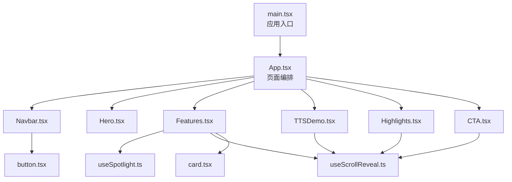
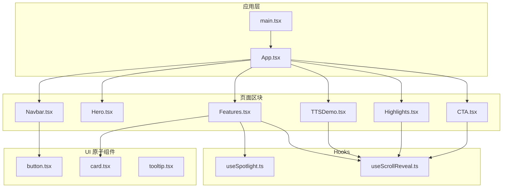
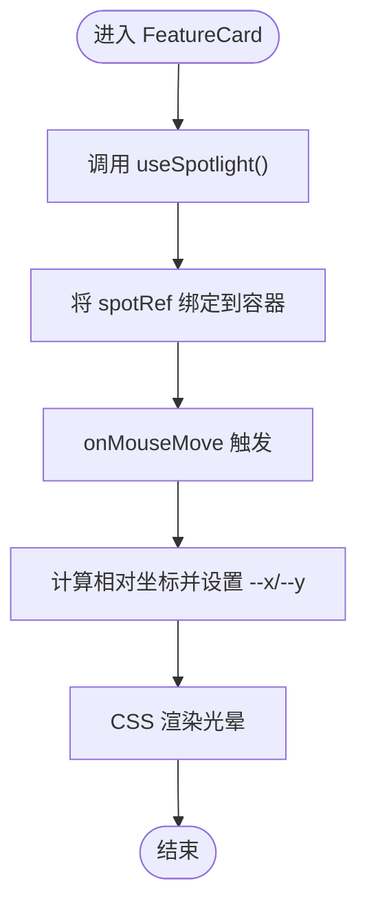
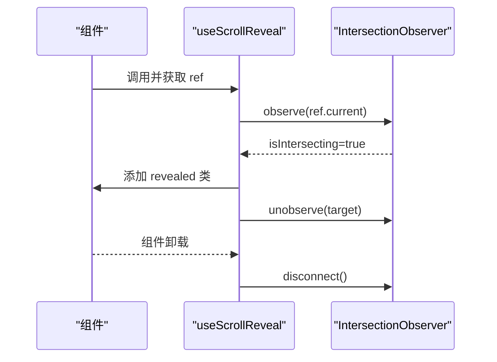
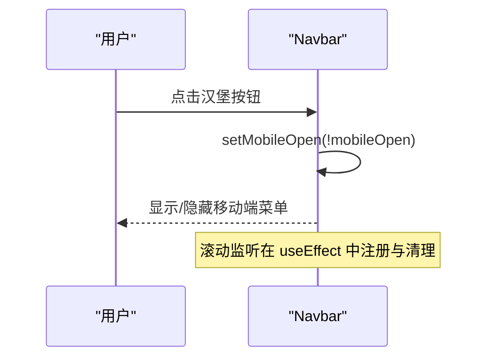
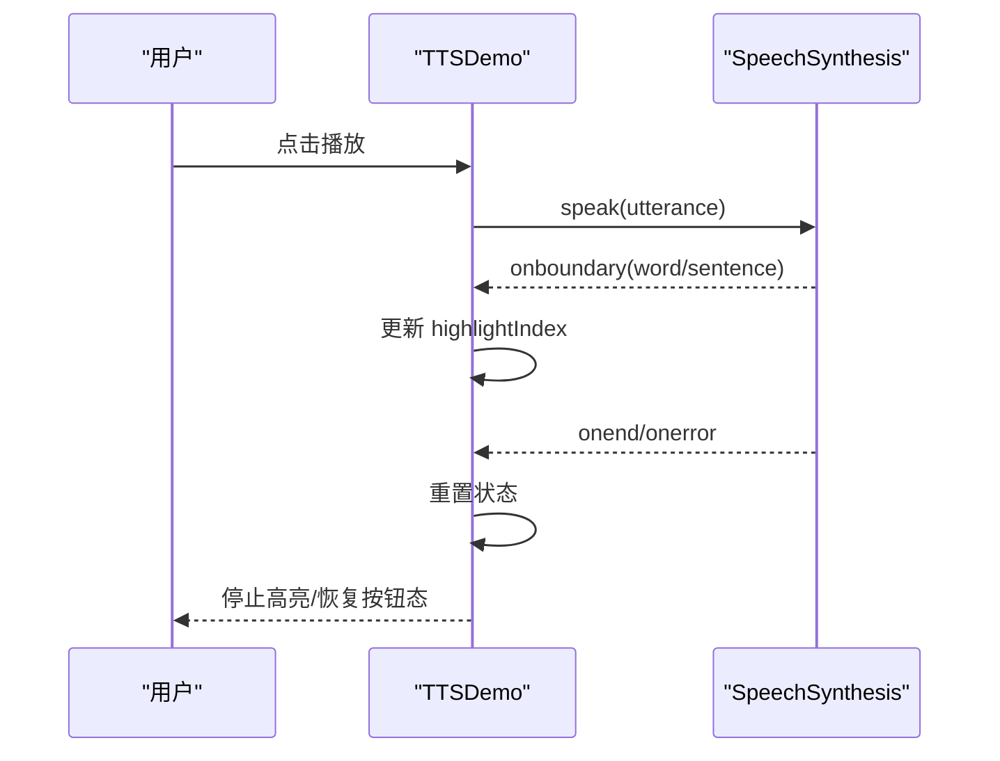
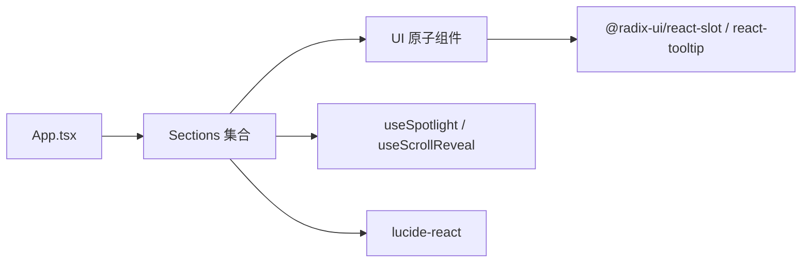

# 组件通信模式

<cite>
**本文引用的文件**
- [src/main.tsx](file://src/main.tsx)
- [src/App.tsx](file://src/App.tsx)
- [src/hooks/use-spotlight.ts](file://src/hooks/use-spotlight.ts)
- [src/hooks/use-scroll-reveal.ts](file://src/hooks/use-scroll-reveal.ts)
- [src/sections/Hero.tsx](file://src/sections/Hero.tsx)
- [src/sections/Features.tsx](file://src/sections/Features.tsx)
- [src/sections/Highlights.tsx](file://src/sections/Highlights.tsx)
- [src/sections/CTA.tsx](file://src/sections/CTA.tsx)
- [src/sections/Navbar.tsx](file://src/sections/Navbar.tsx)
- [src/sections/TTSDemo.tsx](file://src/sections/TTSDemo.tsx)
- [src/components/ui/button.tsx](file://src/components/ui/button.tsx)
- [src/components/ui/card.tsx](file://src/components/ui/card.tsx)
- [src/components/ui/tooltip.tsx](file://src/components/ui/tooltip.tsx)
</cite>

## 目录
1. [简介](#简介)
2. [项目结构](#项目结构)
3. [核心组件与通信模式](#核心组件与通信模式)
4. [架构总览](#架构总览)
5. [详细组件分析](#详细组件分析)
6. [依赖关系分析](#依赖关系分析)
7. [性能考量](#性能考量)
8. [故障排查指南](#故障排查指南)
9. [结论](#结论)
10. [附录](#附录)

## 简介
本文件面向挠荔枝官网的 React 组件通信，系统梳理以下主题：
- 数据传递与状态共享：props 向下传递、事件向上冒泡、Context 全局状态管理（现状与建议）
- 自定义 Hooks 在通信中的作用：useSpotlight 聚光灯效果、useScrollReveal 滚动动画 Hook 的复用与共享
- 生命周期管理与内存清理策略：事件监听、IntersectionObserver、requestAnimationFrame 等资源的正确释放
- 事件总线与发布订阅模式：当前未使用，给出适用场景与落地建议
- 组件解耦与依赖注入：通过 props、组合式 Hook、UI 原子组件实现松耦合
- 调试技巧与常见问题：Canvas/WebGL 降级、TTS 支持检测、移动端适配等

## 项目结构
本项目采用“页面区块 + UI 原子组件 + 通用 Hooks”的组织方式。App 作为根容器编排各 Section；Section 内部通过 Props 和 Hooks 完成局部交互；UI 层提供可复用的 Button/Card/Tooltip 等基础组件。

图表来源
- [src/main.tsx:1-11](file://src/main.tsx#L1-L11)
- [src/App.tsx:1-30](file://src/App.tsx#L1-L30)
- [src/sections/Navbar.tsx:1-117](file://src/sections/Navbar.tsx#L1-L117)
- [src/sections/Hero.tsx:1-141](file://src/sections/Hero.tsx#L1-L141)
- [src/sections/Features.tsx:1-127](file://src/sections/Features.tsx#L1-L127)
- [src/sections/TTSDemo.tsx:1-344](file://src/sections/TTSDemo.tsx#L1-L344)
- [src/sections/Highlights.tsx:1-168](file://src/sections/Highlights.tsx#L1-L168)
- [src/sections/CTA.tsx:1-65](file://src/sections/CTA.tsx#L1-L65)
- [src/hooks/use-spotlight.ts:1-21](file://src/hooks/use-spotlight.ts#L1-L21)
- [src/hooks/use-scroll-reveal.ts:1-34](file://src/hooks/use-scroll-reveal.ts#L1-L34)
- [src/components/ui/button.tsx:1-63](file://src/components/ui/button.tsx#L1-L63)
- [src/components/ui/card.tsx:1-93](file://src/components/ui/card.tsx#L1-L93)

章节来源
- [src/main.tsx:1-11](file://src/main.tsx#L1-L11)
- [src/App.tsx:1-30](file://src/App.tsx#L1-L30)

## 核心组件与通信模式
- 自上而下的 Props 传递
  - App 将子区块以 JSX 形式组合，子区块通过自身 Props 接收配置（如 Features 中的卡片数据）。
  - UI 原子组件（Button/Card/Tooltip）通过 props 暴露样式变体与行为开关，供上层按需组合。
- 自下而上的事件冒泡
  - 子组件通过回调函数向父组件上报事件（例如 Navbar 中按钮点击关闭菜单、TTSDemo 中播放/暂停控制）。
- 基于 Hooks 的横向能力复用
  - useSpotlight：为任意卡片容器提供鼠标跟随光晕（通过 CSS 变量 --x/--y），被 FeatureCard 复用。
  - useScrollReveal：为任意元素添加 IntersectionObserver 驱动的入场动画，被多个 Section 复用。
- Context 全局状态管理（现状与建议）
  - 当前代码未使用 Context；若未来需要跨多模块共享主题、语言或 TTS 会话状态，可在 App 层提供 Provider，并通过 useContext 消费。

章节来源
- [src/components/ui/button.tsx:1-63](file://src/components/ui/button.tsx#L1-L63)
- [src/components/ui/card.tsx:1-93](file://src/components/ui/card.tsx#L1-L93)
- [src/components/ui/tooltip.tsx:1-62](file://src/components/ui/tooltip.tsx#L1-L62)
- [src/sections/Features.tsx:1-127](file://src/sections/Features.tsx#L1-L127)
- [src/hooks/use-spotlight.ts:1-21](file://src/hooks/use-spotlight.ts#L1-L21)
- [src/hooks/use-scroll-reveal.ts:1-34](file://src/hooks/use-scroll-reveal.ts#L1-L34)

## 架构总览
下图展示从入口到各 Section 的组合关系以及关键 Hooks 的使用位置。

图表来源
- [src/main.tsx:1-11](file://src/main.tsx#L1-L11)
- [src/App.tsx:1-30](file://src/App.tsx#L1-L30)
- [src/sections/Navbar.tsx:1-117](file://src/sections/Navbar.tsx#L1-L117)
- [src/sections/Hero.tsx:1-141](file://src/sections/Hero.tsx#L1-L141)
- [src/sections/Features.tsx:1-127](file://src/sections/Features.tsx#L1-L127)
- [src/sections/TTSDemo.tsx:1-344](file://src/sections/TTSDemo.tsx#L1-L344)
- [src/sections/Highlights.tsx:1-168](file://src/sections/Highlights.tsx#L1-L168)
- [src/sections/CTA.tsx:1-65](file://src/sections/CTA.tsx#L1-L65)
- [src/hooks/use-spotlight.ts:1-21](file://src/hooks/use-spotlight.ts#L1-L21)
- [src/hooks/use-scroll-reveal.ts:1-34](file://src/hooks/use-scroll-reveal.ts#L1-L34)
- [src/components/ui/button.tsx:1-63](file://src/components/ui/button.tsx#L1-L63)
- [src/components/ui/card.tsx:1-93](file://src/components/ui/card.tsx#L1-L93)
- [src/components/ui/tooltip.tsx:1-62](file://src/components/ui/tooltip.tsx#L1-L62)

## 详细组件分析

### 聚光灯效果 Hook：useSpotlight
- 职责
  - 返回 ref 与 mousemove 处理器，将鼠标相对坐标写入 CSS 变量 --x/--y，配合 CSS 径向渐变实现光晕跟随。
- 使用方式
  - 在卡片容器上绑定 ref 与 onMouseMove，即可启用效果。
- 复杂度与优化
  - 时间复杂度 O(1)，仅更新两个 CSS 属性；避免频繁重排的关键在于不直接操作 DOM 布局属性。
- 内存与生命周期
  - 无外部监听器，无需额外清理。

图表来源
- [src/hooks/use-spotlight.ts:1-21](file://src/hooks/use-spotlight.ts#L1-L21)
- [src/sections/Features.tsx:62-97](file://src/sections/Features.tsx#L62-L97)

章节来源
- [src/hooks/use-spotlight.ts:1-21](file://src/hooks/use-spotlight.ts#L1-L21)
- [src/sections/Features.tsx:62-97](file://src/sections/Features.tsx#L62-L97)

### 滚动入场动画 Hook：useScrollReveal
- 职责
  - 为传入元素创建 IntersectionObserver，进入视口时添加类名触发动画，且只触发一次。
- 使用方式
  - 在目标元素上绑定返回的 ref，可选 threshold 参数控制触发比例。
- 复杂度与优化
  - 观察单个元素，O(1)；observer.unobserve 确保一次性触发，避免重复处理。
- 内存与生命周期
  - useEffect 返回清理函数，组件卸载时 disconnect Observer，防止泄漏。

图表来源
- [src/hooks/use-scroll-reveal.ts:1-34](file://src/hooks/use-scroll-reveal.ts#L1-L34)

章节来源
- [src/hooks/use-scroll-reveal.ts:1-34](file://src/hooks/use-scroll-reveal.ts#L1-L34)
- [src/sections/Features.tsx:99-127](file://src/sections/Features.tsx#L99-L127)
- [src/sections/Highlights.tsx:121-168](file://src/sections/Highlights.tsx#L121-L168)
- [src/sections/CTA.tsx:1-65](file://src/sections/CTA.tsx#L1-L65)
- [src/sections/TTSDemo.tsx:1-344](file://src/sections/TTSDemo.tsx#L1-L344)

### 导航栏：Navbar（事件冒泡与本地状态）
- 职责
  - 顶部导航、滚动吸顶样式切换、移动端菜单展开/收起、磁吸下载按钮。
- 通信模式
  - 本地 state 管理 mobileOpen 与 scrolled；点击事件通过 setState 驱动 UI 变化。
- 生命周期与清理
  - 使用 useEffect 注册 window.scroll 监听，并在清理函数中移除监听，避免内存泄漏。

图表来源
- [src/sections/Navbar.tsx:1-117](file://src/sections/Navbar.tsx#L1-L117)

章节来源
- [src/sections/Navbar.tsx:1-117](file://src/sections/Navbar.tsx#L1-L117)

### 首屏倾斜效果：Hero（局部状态与事件）
- 职责
  - 根据鼠标位置计算倾斜角度，驱动设备模型 3D 变换。
- 通信模式
  - 组件内维护 tilt 状态，onMouseMove/onMouseLeave 更新状态，属于典型的“局部状态 + 事件驱动”。

章节来源
- [src/sections/Hero.tsx:1-141](file://src/sections/Hero.tsx#L1-L141)

### 功能特性区：Features（Props + Hooks 组合）
- 职责
  - 展示功能卡片，每个卡片内置聚光灯效果；整体区域使用滚动入场动画。
- 通信模式
  - FEATURES 常量作为数据源，通过 props 传递给 FeatureCard；FeatureCard 内部使用 useSpotlight 与 CardContent 组合。

章节来源
- [src/sections/Features.tsx:1-127](file://src/sections/Features.tsx#L1-L127)
- [src/components/ui/card.tsx:1-93](file://src/components/ui/card.tsx#L1-L93)
- [src/hooks/use-spotlight.ts:1-21](file://src/hooks/use-spotlight.ts#L1-L21)

### 亮点展示：Highlights（滚动动画）
- 职责
  - 图文混排的功能亮点展示，标题区域使用滚动入场动画。
- 通信模式
  - 通过 useScrollReveal 为标题容器绑定 ref，实现淡入效果。

章节来源
- [src/sections/Highlights.tsx:1-168](file://src/sections/Highlights.tsx#L1-L168)
- [src/hooks/use-scroll-reveal.ts:1-34](file://src/hooks/use-scroll-reveal.ts#L1-L34)

### 行动号召：CTA（滚动动画 + 磁吸按钮）
- 职责
  - 引导下载，结合滚动动画与磁吸按钮增强交互感。
- 通信模式
  - 使用 useScrollReveal 控制入场；磁吸效果由 useMagnetic 提供（不在本仓库 hooks 目录中，但用法一致）。

章节来源
- [src/sections/CTA.tsx:1-65](file://src/sections/CTA.tsx#L1-L65)
- [src/hooks/use-scroll-reveal.ts:1-34](file://src/hooks/use-scroll-reveal.ts#L1-L34)

### 语音合成演示：TTSDemo（浏览器 API + 状态机）
- 职责
  - 在线体验语音合成：选择语言/声音、输入文本、播放/暂停/停止、实时高亮。
- 通信模式
  - 组件内维护 isSpeaking/isPaused/highlightIndex 等状态；通过 SpeechSynthesisUtterance 的事件 onboundary/onend/onerror 驱动 UI。
- 生命周期与清理
  - 组件卸载时 cancel 正在进行的朗读，避免后台继续占用资源。

图表来源
- [src/sections/TTSDemo.tsx:1-344](file://src/sections/TTSDemo.tsx#L1-L344)

章节来源
- [src/sections/TTSDemo.tsx:1-344](file://src/sections/TTSDemo.tsx#L1-L344)

### UI 原子组件：Button / Card / Tooltip
- 职责
  - 提供一致的样式变体与语义化结构，便于上层组合。
- 通信模式
  - 通过 props 暴露 variant/size/asChild 等配置项；Tooltip 封装 Radix 的 Provider/Root/Trigger/Content，简化使用。

章节来源
- [src/components/ui/button.tsx:1-63](file://src/components/ui/button.tsx#L1-L63)
- [src/components/ui/card.tsx:1-93](file://src/components/ui/card.tsx#L1-L93)
- [src/components/ui/tooltip.tsx:1-62](file://src/components/ui/tooltip.tsx#L1-L62)

## 依赖关系分析
- 组件耦合
  - App 对 Section 是“组合型”耦合，Section 之间相互独立，符合单一职责原则。
  - Section 对 UI 原子组件是“使用型”耦合，通过 props 配置，保持低耦合。
- Hooks 复用
  - useSpotlight 与 useScrollReveal 被多处复用，显著降低重复逻辑。
- 外部依赖
  - 使用 Radix UI 的 Slot 与 Tooltip 原语；使用 lucide-react 图标库。

图表来源
- [src/App.tsx:1-30](file://src/App.tsx#L1-L30)
- [src/components/ui/button.tsx:1-63](file://src/components/ui/button.tsx#L1-L63)
- [src/components/ui/tooltip.tsx:1-62](file://src/components/ui/tooltip.tsx#L1-L62)
- [src/hooks/use-spotlight.ts:1-21](file://src/hooks/use-spotlight.ts#L1-L21)
- [src/hooks/use-scroll-reveal.ts:1-34](file://src/hooks/use-scroll-reveal.ts#L1-L34)

章节来源
- [src/App.tsx:1-30](file://src/App.tsx#L1-L30)
- [src/components/ui/button.tsx:1-63](file://src/components/ui/button.tsx#L1-L63)
- [src/components/ui/tooltip.tsx:1-62](file://src/components/ui/tooltip.tsx#L1-L62)
- [src/hooks/use-spotlight.ts:1-21](file://src/hooks/use-spotlight.ts#L1-L21)
- [src/hooks/use-scroll-reveal.ts:1-34](file://src/hooks/use-scroll-reveal.ts#L1-L34)

## 性能考量
- Canvas/WebGL 背景
  - 桌面端启用 WebGL 流体背景，移动端自动降级，减少 GPU/CPU 压力。
  - 使用 IntersectionObserver 在不可见时跳过绘制，节省资源。
- 粒子与星空
  - 根据设备类型调整粒子数量与绘制路径；桌面端增加引力与拖尾效果，移动端简化。
- 动画循环
  - requestAnimationFrame 在清理函数中取消，避免悬挂任务。
- 滚动动画
  - IntersectionObserver 仅观察单个元素，且 once 触发后 unobserve，避免持续开销。

章节来源
- [src/sections/FluidCanvas.tsx:1-470](file://src/sections/FluidCanvas.tsx#L1-L470)
- [src/sections/EarParticles.tsx:1-560](file://src/sections/EarParticles.tsx#L1-L560)
- [src/hooks/use-scroll-reveal.ts:1-34](file://src/hooks/use-scroll-reveal.ts#L1-L34)

## 故障排查指南
- 语音合成不可用
  - 现象：TTSDemo 提示不支持语音合成。
  - 排查：检查浏览器是否支持 speechSynthesis；确认 voiceschanged 事件已加载；在组件卸载时 cancel 以避免残留。
- 滚动动画未触发
  - 现象：元素进入视口无动画。
  - 排查：确认 ref 是否正确绑定；检查阈值 threshold；确认 CSS 类名 reveal/revealed 是否存在。
- 聚光灯无效
  - 现象：卡片无光晕跟随。
  - 排查：确认 spotRef 绑定到外层容器；onMouseMove 是否挂载；CSS 变量 --x/--y 是否被读取。
- 导航栏滚动监听异常
  - 现象：滚动样式不生效或内存泄漏。
  - 排查：确认 useEffect 的清理函数移除了 scroll 监听；避免重复注册。
- Canvas/WebGL 性能问题
  - 现象：卡顿或掉帧。
  - 排查：确认移动端已降级；检查 IntersectionObserver 是否工作；适当降低分辨率与粒子数量。

章节来源
- [src/sections/TTSDemo.tsx:1-344](file://src/sections/TTSDemo.tsx#L1-L344)
- [src/hooks/use-scroll-reveal.ts:1-34](file://src/hooks/use-scroll-reveal.ts#L1-L34)
- [src/hooks/use-spotlight.ts:1-21](file://src/hooks/use-spotlight.ts#L1-L21)
- [src/sections/Navbar.tsx:1-117](file://src/sections/Navbar.tsx#L1-L117)
- [src/sections/FluidCanvas.tsx:1-470](file://src/sections/FluidCanvas.tsx#L1-L470)
- [src/sections/EarParticles.tsx:1-560](file://src/sections/EarParticles.tsx#L1-L560)

## 结论
- 当前项目以“组合式 Hooks + 局部状态 + 事件冒泡”为主，实现了良好的解耦与复用。
- 对于跨模块全局状态（如主题、语言、TTS 会话），建议在 App 层引入 Context Provider，统一分发与消费。
- 针对复杂交互（Canvas/WebGL、粒子系统），务必做好可见性检测与资源清理，保障性能与稳定性。
- 事件总线/发布订阅在当前项目中未使用；当出现深层级或多处广播需求时，可考虑轻量事件中心或基于 Context 的状态流。

## 附录
- 最佳实践清单
  - 优先使用 props 与组合式 Hooks 进行通信，必要时再引入 Context。
  - 所有外部监听（scroll/mouse/touch/resize/Observers）必须在清理函数中注销。
  - 对高频更新（mousemove、动画循环）做节流/防抖或条件执行（如不可见时跳过）。
  - UI 原子组件尽量无副作用，通过 props 暴露行为与样式变体。
  - 对外部 API（WebGL、SpeechSynthesis）做能力检测与降级策略。