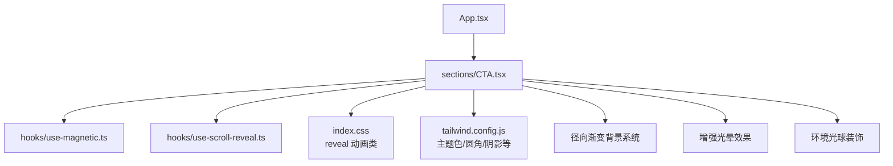
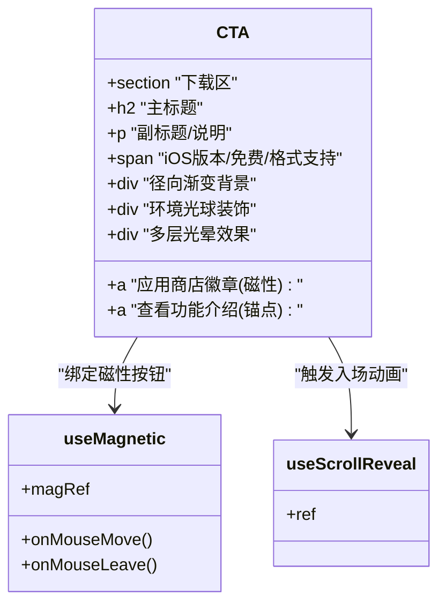
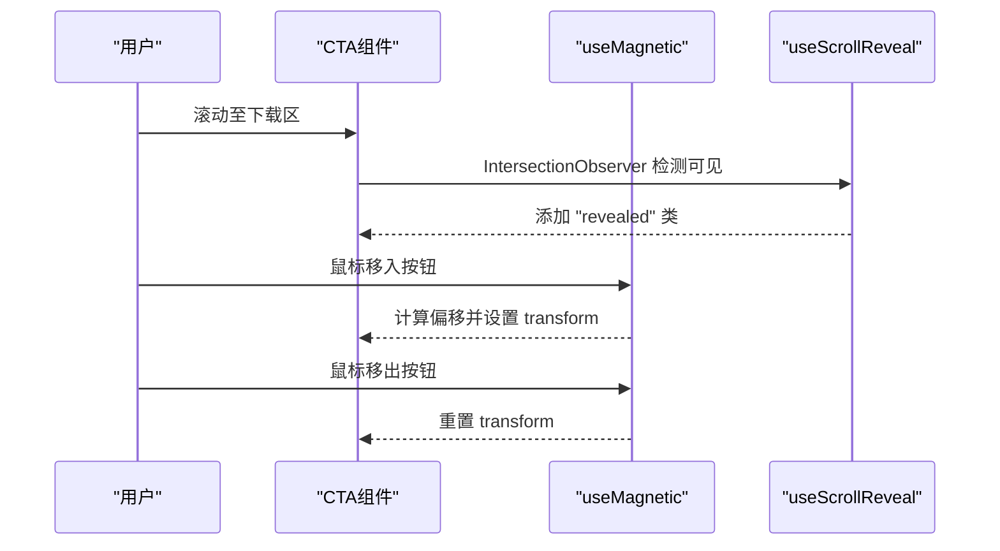
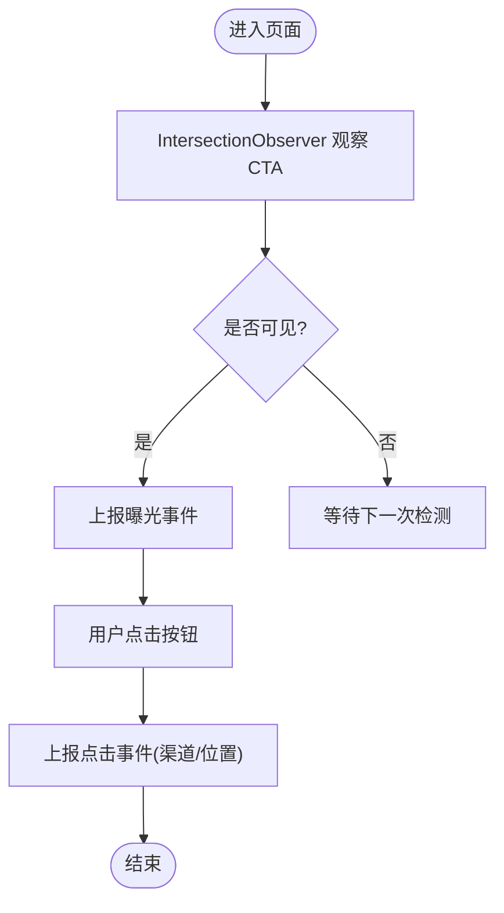
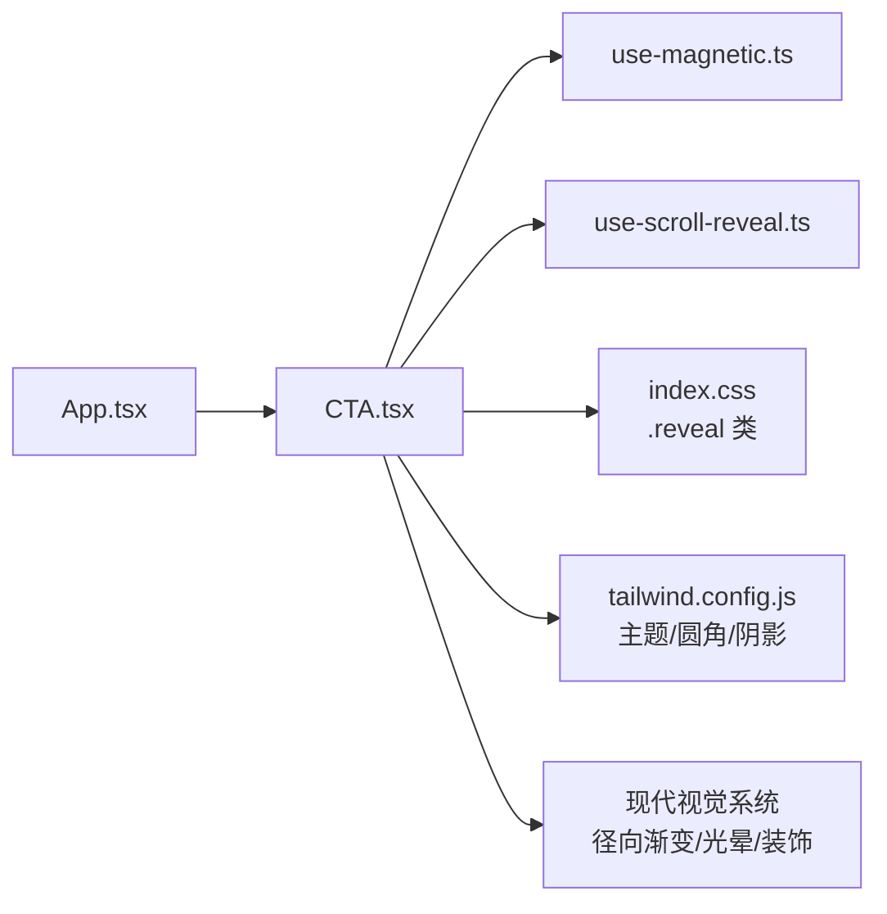

# CTA组件

<cite>
**本文引用的文件**
- [src/sections/CTA.tsx](file://src/sections/CTA.tsx)
- [src/hooks/use-magnetic.ts](file://src/hooks/use-magnetic.ts)
- [src/hooks/use-scroll-reveal.ts](file://src/hooks/use-scroll-reveal.ts)
- [src/index.css](file://src/index.css)
- [tailwind.config.js](file://tailwind.config.js)
- [src/App.tsx](file://src/App.tsx)
</cite>

## 更新摘要
**变更内容**
- 完全重新设计的现代径向渐变背景系统，替代原有的线性渐变
- 增强的光晕效果和空间层次结构
- 环境光球装饰元素和精修的阴影效果
- 重新定位的装饰元素，采用紫罗兰色和白色配色方案
- 改进的视觉吸引力和用户体验

## 目录
1. [简介](#简介)
2. [项目结构](#项目结构)
3. [核心组件](#核心组件)
4. [架构总览](#架构总览)
5. [详细组件分析](#详细组件分析)
6. [依赖关系分析](#依赖关系分析)
7. [性能考量](#性能考量)
8. [故障排查指南](#故障排查指南)
9. [结论](#结论)
10. [附录](#附录)

## 简介
本文件为"行动号召（CTA）"组件的完整技术文档，围绕其全新重新设计的视觉系统和实现细节与优化策略展开。内容涵盖：
- **全新视觉设计系统**：现代径向渐变背景、增强光晕效果、环境光球装饰
- **交互效果**：磁性按钮、滚动入场动画
- **响应式布局适配**：移动端到桌面端的间距、字号与排版变化
- **用户行为追踪集成建议、A/B测试支持方案**
- **可访问性实现要点**
- **样式定制方法与文案配置选项**
- **转化率优化建议与用户体验最佳实践**

## 项目结构
CTA 组件位于 sections 目录下，作为页面级区块被 App 根组件引入并渲染。其全新的视觉系统与动效由全局样式与 Tailwind 配置驱动，交互逻辑通过自定义 Hook 提供。

**图表来源**
- [src/App.tsx:1-30](file://src/App.tsx#L1-L30)
- [src/sections/CTA.tsx:1-71](file://src/sections/CTA.tsx#L1-L71)
- [src/hooks/use-magnetic.ts:1-32](file://src/hooks/use-magnetic.ts#L1-L32)
- [src/hooks/use-scroll-reveal.ts:1-34](file://src/hooks/use-scroll-reveal.ts#L1-L34)
- [src/index.css:80-116](file://src/index.css#L80-L116)
- [tailwind.config.js:1-92](file://tailwind.config.js#L1-L92)

**章节来源**
- [src/App.tsx:1-30](file://src/App.tsx#L1-L30)
- [src/sections/CTA.tsx:1-71](file://src/sections/CTA.tsx#L1-L71)

## 核心组件
CTA 组件负责展示下载引导区域，包含标题、描述、主行动按钮（应用商店徽章链接）、功能入口锚点以及平台与特性标签。其关键能力包括：
- **全新视觉系统**：现代径向渐变背景配合多层光晕效果和环境光球装饰
- **滚动进入视口时触发淡入上移动画**
- **主按钮具备磁性跟随鼠标偏移的交互**
- **增强的空间层次结构和阴影效果**
- **响应式排版与间距，适配不同屏幕尺寸**

**章节来源**
- [src/sections/CTA.tsx:1-71](file://src/sections/CTA.tsx#L1-L71)

## 架构总览
CTA 组件采用"组件 + Hook + 样式"的分层组织方式：
- **组件层**：CTA.tsx 组合 UI 结构与业务文案
- **交互层**：useMagnetic 提供磁性效果；useScrollReveal 提供滚动入场
- **样式层**：Tailwind 原子类 + index.css 中的 reveal 动画类
- **主题层**：tailwind.config.js 定义品牌色、圆角、阴影等
- **视觉层**：现代径向渐变背景系统、增强光晕效果、环境光球装饰

**图表来源**
- [src/sections/CTA.tsx:1-71](file://src/sections/CTA.tsx#L1-L71)
- [src/hooks/use-magnetic.ts:1-32](file://src/hooks/use-magnetic.ts#L1-L32)
- [src/hooks/use-scroll-reveal.ts:1-34](file://src/hooks/use-scroll-reveal.ts#L1-L34)

## 详细组件分析

### 全新视觉设计与样式体系

**重大更新** 组件采用了完全重新设计的现代视觉系统：

- **径向渐变背景系统**：使用 `bg-[radial-gradient(ellipse_at_center,rgba(139,92,246,0.08),transparent_70%)]` 创建从中心向外扩散的柔和紫色渐变，营造深度感和空间感
- **多层环境光球装饰**：
  - 主光球：`w-[600px] h-[400px] bg-violet-500/10 blur-[120px]` - 大型模糊圆形，营造氛围
  - 次光球：`w-[300px] h-[300px] bg-blue-400/8 blur-[80px]` - 小型蓝色光球，增加层次感
- **卡片内部装饰系统**：
  - 右上角白色光晕：`bg-white/10 blur-[80px]`
  - 左下角紫罗兰光晕：`bg-violet-300/15 blur-[80px]`
  - 右下角辅助光晕：`bg-white/8 blur-[60px]`
- **增强的阴影层次**：`shadow-2xl shadow-violet-500/20` 提供深紫色调的柔和阴影
- **渐变卡片背景**：`bg-gradient-to-br from-blue-600 via-violet-500 to-purple-500` 创建丰富的色彩过渡
- **字体与排版**：标题加粗且字距收紧，副标题使用半透明白色，信息层级清晰
- **响应式**：在不同断点下调整内边距、字号与行高，确保多端一致体验

**章节来源**
- [src/sections/CTA.tsx:10-25](file://src/sections/CTA.tsx#L10-L25)
- [src/index.css:80-116](file://src/index.css#L80-L116)
- [tailwind.config.js:1-92](file://tailwind.config.js#L1-L92)

### 交互效果与动画
- **滚动入场**：当 CTA 区块进入视口时，添加 revealed 类，触发 opacity 与 transform 过渡
- **磁性按钮**：鼠标移动时计算按钮中心与指针位置差值，按强度系数进行 translate 偏移；离开时复位
- **悬停反馈**：按钮阴影加深、颜色变亮，配合短时长过渡，提升点击欲望

**图表来源**
- [src/hooks/use-scroll-reveal.ts:1-34](file://src/hooks/use-scroll-reveal.ts#L1-L34)
- [src/hooks/use-magnetic.ts:1-32](file://src/hooks/use-magnetic.ts#L1-L32)
- [src/sections/CTA.tsx:5-8](file://src/sections/CTA.tsx#L5-L8)

**章节来源**
- [src/hooks/use-scroll-reveal.ts:1-34](file://src/hooks/use-scroll-reveal.ts#L1-L34)
- [src/hooks/use-magnetic.ts:1-32](file://src/hooks/use-magnetic.ts#L1-L32)
- [src/sections/CTA.tsx:5-8](file://src/sections/CTA.tsx#L5-L8)

### 响应式布局适配
- **间距**：在小屏使用较小内边距，在大屏增加上下左右留白，保证呼吸感
- **字号**：标题随断点递增，副标题保持可读性与层级区分
- **排列**：移动端纵向堆叠，平板及以上横向排列，便于同时展示多个行动项
- **图标与徽章**：固定高度，避免在不同设备上比例失衡

**章节来源**
- [src/sections/CTA.tsx:10-27](file://src/sections/CTA.tsx#L10-L27)

### 用户行为追踪集成
建议在以下时机埋点上报（示例思路，非代码）：
- **曝光事件**：当 CTA 区块首次进入视口（IntersectionObserver 触发 revealed）时上报一次
- **点击事件**：对应用商店徽章链接与"查看功能介绍"锚点分别上报
- **滚动深度**：记录用户到达下载区的滚动百分比，用于评估注意力分布

[此图为概念流程，不直接映射具体源码]

### A/B 测试支持
- **文案变量化**：将标题、副标题、按钮文案抽离为配置对象或环境变量，便于快速切换
- **实验分组**：根据路由参数或本地存储标记加载不同文案与视觉风格
- **指标采集**：为不同组别分别上报曝光与点击数据，统计转化率差异

**章节来源**
- [src/sections/CTA.tsx:19-25](file://src/sections/CTA.tsx#L19-L25)

### 可访问性实现
- **语义化标签**：使用 section、h2、p、a 等原生语义元素，利于屏幕阅读器理解
- **外部链接安全**：外链 target="_blank" 搭配 rel="noopener noreferrer"，防止新窗口劫持
- **图片替代文本**：应用商店徽章 img 提供 alt 文本，辅助工具可朗读
- **焦点可见性**：按钮与链接默认具备键盘可聚焦能力，必要时可补充 focus-visible 样式

**章节来源**
- [src/sections/CTA.tsx:28-49](file://src/sections/CTA.tsx#L28-L49)

### 样式定制方法
- **主题色**：通过 tailwind.config.js 中 --primary 等 CSS 变量统一控制，修改一处即可全局生效
- **圆角与阴影**：在 tailwind.config.js 扩展 borderRadius 与 boxShadow，保持设计一致性
- **动画类**：在 index.css 的 @layer utilities 中维护 reveal 相关类，便于复用与调试
- **组件内样式**：优先使用 Tailwind 原子类，减少自定义 CSS 耦合
- **径向渐变定制**：可通过修改 CTA.tsx 中的 radial-gradient 参数调整背景效果

**章节来源**
- [tailwind.config.js:1-92](file://tailwind.config.js#L1-L92)
- [src/index.css:80-116](file://src/index.css#L80-L116)

### 文案配置选项
- **标题与副标题**：可直接在组件中替换，建议抽取为常量或配置文件
- **按钮文案**：应用商店徽章链接与"查看功能介绍"文案可按渠道差异化
- **标签信息**：iOS 版本要求、免费下载、格式支持等标签可根据产品阶段动态更新

**章节来源**
- [src/sections/CTA.tsx:19-25](file://src/sections/CTA.tsx#L19-L25)
- [src/sections/CTA.tsx:44-58](file://src/sections/CTA.tsx#L44-L58)

### 转化率优化建议与用户体验最佳实践
- **明确价值主张**：标题强调收益，副标题给出下一步动作与利益点
- **降低认知负荷**：仅保留一个主要行动按钮，次要链接弱化但可发现
- **强化信任信号**：展示平台兼容性、免费、格式支持等关键信息
- **微动效克制**：磁性效果与阴影变化不宜过度，避免干扰阅读
- **首屏可见性**：尽量将 CTA 置于用户自然滚动路径上，减少寻找成本
- **视觉层次优化**：利用新的径向渐变和光晕效果创造清晰的视觉焦点

[本节为通用指导，不直接分析具体文件]

## 依赖关系分析
CTA 组件依赖如下模块与资源：
- **自定义 Hook**：useMagnetic、useScrollReveal
- **全局样式**：index.css 中的 reveal 动画类
- **主题配置**：tailwind.config.js 中的颜色、圆角、阴影等
- **页面挂载**：App.tsx 引入并渲染 CTA
- **视觉系统**：现代径向渐变背景、光晕效果、环境光球装饰

**图表来源**
- [src/App.tsx:1-30](file://src/App.tsx#L1-L30)
- [src/sections/CTA.tsx:1-71](file://src/sections/CTA.tsx#L1-L71)
- [src/hooks/use-magnetic.ts:1-32](file://src/hooks/use-magnetic.ts#L1-L32)
- [src/hooks/use-scroll-reveal.ts:1-34](file://src/hooks/use-scroll-reveal.ts#L1-L34)
- [src/index.css:80-116](file://src/index.css#L80-L116)
- [tailwind.config.js:1-92](file://tailwind.config.js#L1-L92)

**章节来源**
- [src/App.tsx:1-30](file://src/App.tsx#L1-L30)
- [src/sections/CTA.tsx:1-71](file://src/sections/CTA.tsx#L1-L71)

## 性能考量
- **动画性能**：使用 CSS transition 与 transform，避免重排重绘；IntersectionObserver 仅在可见时添加类名，减少 DOM 操作
- **事件处理**：磁性效果使用 useCallback 缓存回调，避免不必要的重新渲染
- **资源体积**：SVG 图标与徽章图片按需加载，注意压缩与懒加载
- **可感知性能**：合理设置过渡时长与缓动函数，确保流畅且不突兀
- **视觉效果优化**：径向渐变和光晕效果使用 GPU 加速的 CSS 属性，确保流畅渲染

**章节来源**
- [src/hooks/use-magnetic.ts:1-32](file://src/hooks/use-magnetic.ts#L1-L32)
- [src/hooks/use-scroll-reveal.ts:1-34](file://src/hooks/use-scroll-reveal.ts#L1-L34)
- [src/index.css:80-116](file://src/index.css#L80-L116)

## 故障排查指南
- **动画未触发**：检查 reveal 与 revealed 类是否正确添加；确认 IntersectionObserver 阈值与监听元素
- **磁性效果异常**：确认 magRef 正确绑定到目标元素；检查鼠标事件是否在可交互元素上触发
- **样式覆盖问题**：核对 Tailwind 优先级与自定义 CSS 顺序；必要时使用更具体的选择器
- **外链安全问题**：确保 target="_blank" 搭配 rel="noopener noreferrer"，避免安全风险
- **视觉效果问题**：检查径向渐变参数、光晕透明度、模糊半径等 CSS 属性是否正确

**章节来源**
- [src/hooks/use-scroll-reveal.ts:1-34](file://src/hooks/use-scroll-reveal.ts#L1-L34)
- [src/hooks/use-magnetic.ts:1-32](file://src/hooks/use-magnetic.ts#L1-L32)
- [src/sections/CTA.tsx:28-49](file://src/sections/CTA.tsx#L28-L49)

## 结论
CTA 组件经过全新重新设计后，通过现代径向渐变背景系统、增强的光晕效果和精心布置的环境光球装饰，实现了更加出色的视觉吸引力。新的设计不仅提升了用户体验，还保持了良好的性能和可访问性。结合磁性按钮交互、滚动入场动画和完善的文案配置系统，该组件能够在不改动核心逻辑的前提下持续优化转化表现。

[本节为总结，不直接分析具体文件]

## 附录

### 关键实现路径参考
- **组件主体与结构**：[src/sections/CTA.tsx](file://src/sections/CTA.tsx)
- **磁性交互 Hook**：[src/hooks/use-magnetic.ts](file://src/hooks/use-magnetic.ts)
- **滚动入场 Hook**：[src/hooks/use-scroll-reveal.ts](file://src/hooks/use-scroll-reveal.ts)
- **动画样式类**：[src/index.css](file://src/index.css)
- **主题与样式配置**：[tailwind.config.js](file://tailwind.config.js)
- **页面挂载位置**：[src/App.tsx](file://src/App.tsx)

### 新视觉系统特性
- **径向渐变背景**：使用 CSS radial-gradient 创建从中心向外扩散的柔和渐变效果
- **多层光晕系统**：通过不同大小、透明度和模糊半径的圆形元素营造深度感
- **环境光球装饰**：精心布置的光球元素，增强整体视觉层次
- **紫罗兰色配色方案**：采用 violet、blue、purple 等色调创造现代感
- **精修阴影效果**：使用带颜色的阴影增强立体感和视觉焦点