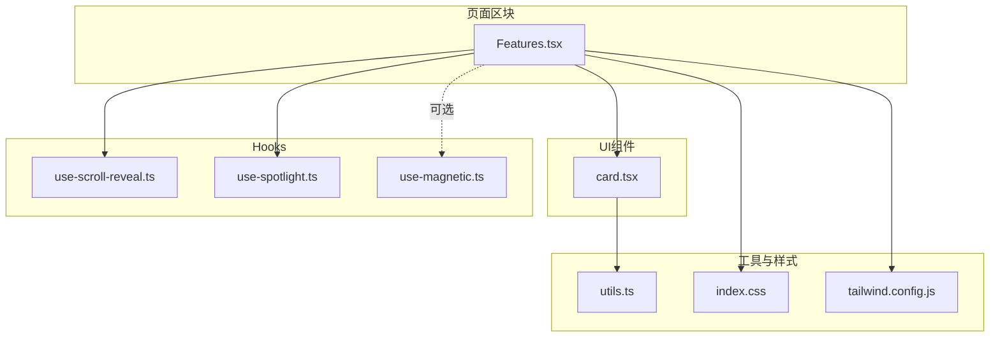
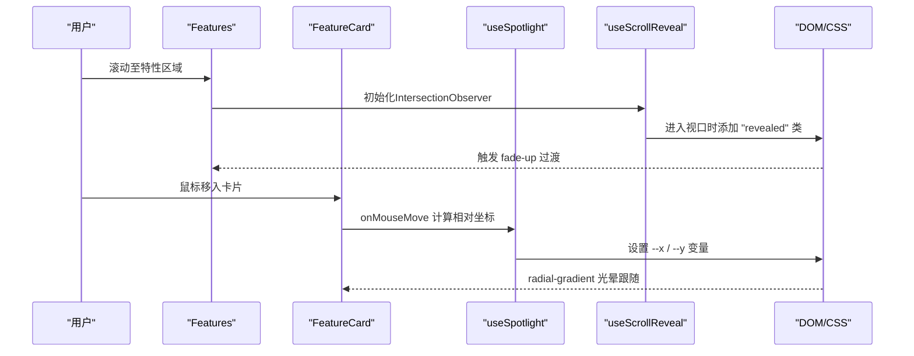
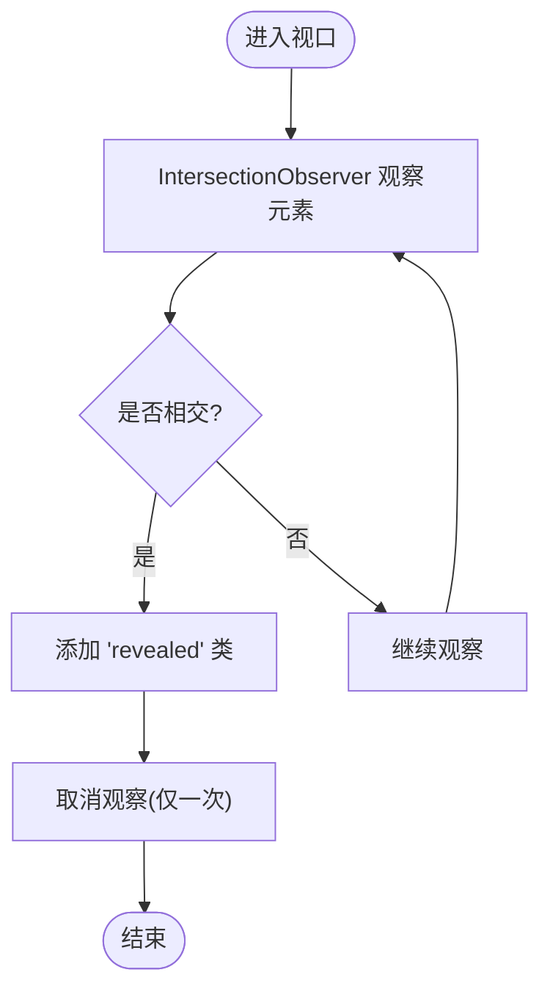
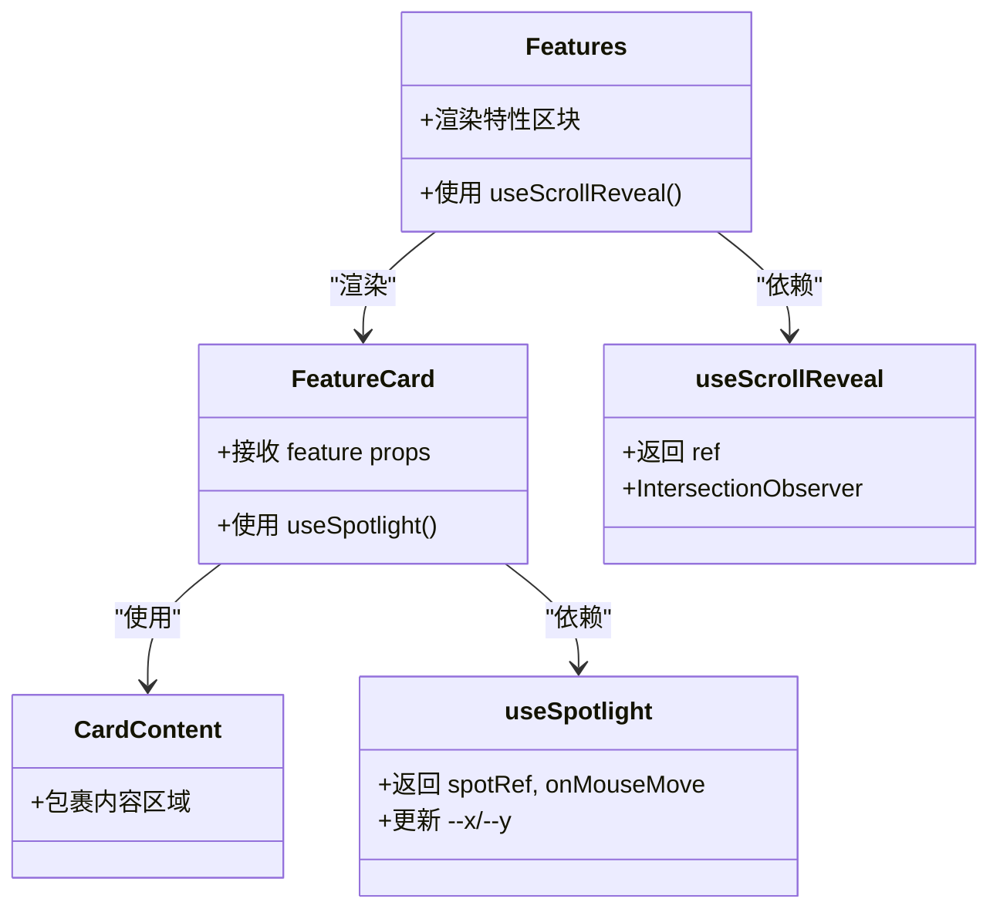

# Features组件

<cite>
**本文引用的文件**   
- [src/sections/Features.tsx](file://src/sections/Features.tsx)
- [src/components/ui/card.tsx](file://src/components/ui/card.tsx)
- [src/hooks/use-scroll-reveal.ts](file://src/hooks/use-scroll-reveal.ts)
- [src/hooks/use-spotlight.ts](file://src/hooks/use-spotlight.ts)
- [src/hooks/use-magnetic.ts](file://src/hooks/use-magnetic.ts)
- [src/lib/utils.ts](file://src/lib/utils.ts)
- [src/index.css](file://src/index.css)
- [tailwind.config.js](file://tailwind.config.js)
</cite>

## 目录
1. [简介](#简介)
2. [项目结构](#项目结构)
3. [核心组件与数据模型](#核心组件与数据模型)
4. [架构总览](#架构总览)
5. [详细组件分析](#详细组件分析)
6. [依赖关系分析](#依赖关系分析)
7. [性能考量](#性能考量)
8. [故障排查指南](#故障排查指南)
9. [结论](#结论)
10. [附录：扩展与自定义样式](#附录扩展与自定义样式)

## 简介
本文件为“特性展示”（Features）组件的完整技术文档。该组件以数据驱动的方式渲染一组功能卡片，结合滚动入场动画、鼠标跟随聚光灯效果与响应式网格布局，提供流畅且可访问的用户体验。文档覆盖设计模式、实现细节、Props接口、状态管理、动画机制、无障碍支持、扩展方法与性能优化策略。

## 项目结构
Features组件位于页面区块模块中，使用UI层卡片组件与多个自定义Hooks组合完成交互与动效；样式通过Tailwind与全局CSS变量协同控制。

图表来源
- [src/sections/Features.tsx:1-127](file://src/sections/Features.tsx#L1-L127)
- [src/components/ui/card.tsx:1-93](file://src/components/ui/card.tsx#L1-L93)
- [src/hooks/use-scroll-reveal.ts:1-34](file://src/hooks/use-scroll-reveal.ts#L1-L34)
- [src/hooks/use-spotlight.ts:1-21](file://src/hooks/use-spotlight.ts#L1-L21)
- [src/hooks/use-magnetic.ts:1-32](file://src/hooks/use-magnetic.ts#L1-L32)
- [src/lib/utils.ts:1-7](file://src/lib/utils.ts#L1-L7)
- [src/index.css:80-116](file://src/index.css#L80-L116)
- [tailwind.config.js:1-92](file://tailwind.config.js#L1-L92)

章节来源
- [src/sections/Features.tsx:1-127](file://src/sections/Features.tsx#L1-L127)
- [src/components/ui/card.tsx:1-93](file://src/components/ui/card.tsx#L1-L93)
- [src/hooks/use-scroll-reveal.ts:1-34](file://src/hooks/use-scroll-reveal.ts#L1-L34)
- [src/hooks/use-spotlight.ts:1-21](file://src/hooks/use-spotlight.ts#L1-L21)
- [src/hooks/use-magnetic.ts:1-32](file://src/hooks/use-magnetic.ts#L1-L32)
- [src/lib/utils.ts:1-7](file://src/lib/utils.ts#L1-L7)
- [src/index.css:80-116](file://src/index.css#L80-L116)
- [tailwind.config.js:1-92](file://tailwind.config.js#L1-L92)

## 核心组件与数据模型
- 数据源：组件内定义的特性数组，包含标题、描述、图标类名与SVG图标节点。
- 卡片容器：外层div负责聚光灯光晕与悬停过渡，内部使用CardContent承载内容。
- 滚动入场：使用IntersectionObserver在元素进入视口时添加revealed类，触发CSS过渡。
- 聚光灯效果：通过更新CSS变量--x/--y，配合radial-gradient实现跟随光标的光晕。
- 响应式网格：基于Tailwind的grid-cols在不同断点切换列数，形成自适应布局。

章节来源
- [src/sections/Features.tsx:5-97](file://src/sections/Features.tsx#L5-L97)
- [src/components/ui/card.tsx:64-72](file://src/components/ui/card.tsx#L64-L72)
- [src/hooks/use-scroll-reveal.ts:1-34](file://src/hooks/use-scroll-reveal.ts#L1-L34)
- [src/hooks/use-spotlight.ts:1-21](file://src/hooks/use-spotlight.ts#L1-L21)
- [src/index.css:80-116](file://src/index.css#L80-L116)

## 架构总览
Features组件采用“数据驱动 + Hooks组合”的轻量架构：
- 数据层：常量数组作为唯一数据源，便于维护与扩展。
- 视图层：React函数组件负责渲染，将数据映射到卡片列表。
- 交互层：useSpotlight处理鼠标移动事件并更新CSS变量；useScrollReveal监听滚动进入视口并注入动画类。
- 样式层：Tailwind原子类与全局CSS变量共同控制主题、间距、圆角、阴影与动画曲线。

图表来源
- [src/sections/Features.tsx:99-126](file://src/sections/Features.tsx#L99-L126)
- [src/hooks/use-spotlight.ts:8-20](file://src/hooks/use-spotlight.ts#L8-L20)
- [src/hooks/use-scroll-reveal.ts:7-33](file://src/hooks/use-scroll-reveal.ts#L7-L33)
- [src/index.css:80-116](file://src/index.css#L80-L116)

## 详细组件分析

### 数据驱动渲染与Props接口
- 数据模型字段
  - title: 卡片标题文本
  - description: 卡片描述文本
  - iconClass: 图标颜色类名（如 amber/red/green）
  - icon: 图标JSX（SVG节点）
- 渲染方式
  - 遍历数据数组，为每项创建FeatureCard实例
  - 每个卡片接收feature对象作为props
- 可扩展性
  - 新增特性只需在数据数组追加对象，无需修改渲染逻辑
  - 可通过扩展iconClass或新增背景色映射来支持新主题色

章节来源
- [src/sections/Features.tsx:5-60](file://src/sections/Features.tsx#L5-L60)
- [src/sections/Features.tsx:63-97](file://src/sections/Features.tsx#L63-L97)

### 卡片布局系统与响应式网格
- 布局容器
  - 使用grid布局，md断点下三列，gap统一间距
  - 最大宽度居中，左右留白适配不同屏幕
- 卡片结构
  - 外层容器负责边框、半透明背景、模糊、悬停位移与光晕层
  - 内层CardContent承载图标、标题与描述
- 图标区
  - 根据iconClass动态生成背景色块，悬停放大
  - 图标颜色由iconClass控制，保持视觉一致性

章节来源
- [src/sections/Features.tsx:104-122](file://src/sections/Features.tsx#L104-L122)
- [src/sections/Features.tsx:74-96](file://src/sections/Features.tsx#L74-L96)
- [src/components/ui/card.tsx:64-72](file://src/components/ui/card.tsx#L64-L72)

### 图标集成方案
- 图标来源
  - 直接内联SVG JSX，避免额外资源请求
- 样式绑定
  - 通过iconClass传递颜色类名，统一控制图标与背景色块
- 可替换性
  - 可将SVG替换为外部图标库组件，保持接口不变

章节来源
- [src/sections/Features.tsx:11-59](file://src/sections/Features.tsx#L11-L59)
- [src/sections/Features.tsx:84-90](file://src/sections/Features.tsx#L84-L90)

### 动画效果实现
- 滚动入场
  - useScrollReveal使用IntersectionObserver监听元素进入视口
  - 进入后添加revealed类，触发CSS定义的fade-up过渡
  - 父容器使用reveal-stagger实现子项延迟入场
- 聚光灯光晕
  - useSpotlight在mousemove事件中计算光标相对位置，写入--x/--y
  - CSS中使用radial-gradient(circle at var(--x) var(--y), ...)绘制光晕
- 悬停微动效
  - 卡片悬停轻微上移、边框变亮、背景透明度变化
  - 图标区域悬停放大

图表来源
- [src/hooks/use-scroll-reveal.ts:12-30](file://src/hooks/use-scroll-reveal.ts#L12-L30)
- [src/index.css:80-103](file://src/index.css#L80-L103)

章节来源
- [src/hooks/use-scroll-reveal.ts:1-34](file://src/hooks/use-scroll-reveal.ts#L1-L34)
- [src/hooks/use-spotlight.ts:1-21](file://src/hooks/use-spotlight.ts#L1-L21)
- [src/index.css:80-116](file://src/index.css#L80-L116)

### 状态管理机制
- 无全局状态
  - 所有交互状态均通过本地ref与CSS变量管理
- 局部状态
  - useScrollReveal返回ref，用于挂载观察者
  - useSpotlight返回ref与onMouseMove回调，更新--x/--y
- 副作用清理
  - IntersectionObserver在卸载时断开，避免内存泄漏

章节来源
- [src/hooks/use-scroll-reveal.ts:12-30](file://src/hooks/use-scroll-reveal.ts#L12-L30)
- [src/hooks/use-spotlight.ts:11-17](file://src/hooks/use-spotlight.ts#L11-L17)

### 无障碍访问支持
- 语义化标签
  - 使用section、h2、p等语义标签提升可读性与可访问性
- 焦点与键盘导航
  - 当前卡片为纯展示，不涉及交互焦点；如需扩展按钮或链接，建议遵循Button组件的可访问性约定
- 对比度与可读性
  - 文本颜色与背景对比度满足基础可读性要求；深色模式下通过CSS变量调整

章节来源
- [src/sections/Features.tsx:104-115](file://src/sections/Features.tsx#L104-L115)
- [src/components/ui/button.tsx:1-63](file://src/components/ui/button.tsx#L1-L63)
- [src/index.css:8-68](file://src/index.css#L8-L68)

### 错误处理最佳实践
- 空数据保护
  - 若数据为空，应渲染占位提示或隐藏区块
- 观察者异常
  - IntersectionObserver在旧环境可能不可用，需降级处理
- 事件安全
  - 在onMouseMove中检查元素引用存在性，避免空指针

章节来源
- [src/hooks/use-scroll-reveal.ts:12-22](file://src/hooks/use-scroll-reveal.ts#L12-L22)
- [src/hooks/use-spotlight.ts:11-17](file://src/hooks/use-spotlight.ts#L11-L17)

## 依赖关系分析
- 组件依赖
  - Features依赖CardContent进行内容包裹
  - FeatureCard依赖useSpotlight实现光晕
  - 整体依赖useScrollReveal实现滚动入场
- 工具与样式
  - cn工具函数合并类名
  - Tailwind配置提供主题色、圆角、阴影与动画
  - index.css定义入场动画与光晕渐变

图表来源
- [src/sections/Features.tsx:63-126](file://src/sections/Features.tsx#L63-L126)
- [src/components/ui/card.tsx:64-72](file://src/components/ui/card.tsx#L64-L72)
- [src/hooks/use-spotlight.ts:8-20](file://src/hooks/use-spotlight.ts#L8-L20)
- [src/hooks/use-scroll-reveal.ts:7-33](file://src/hooks/use-scroll-reveal.ts#L7-L33)

章节来源
- [src/sections/Features.tsx:1-127](file://src/sections/Features.tsx#L1-L127)
- [src/components/ui/card.tsx:1-93](file://src/components/ui/card.tsx#L1-L93)
- [src/hooks/use-spotlight.ts:1-21](file://src/hooks/use-spotlight.ts#L1-L21)
- [src/hooks/use-scroll-reveal.ts:1-34](file://src/hooks/use-scroll-reveal.ts#L1-L34)

## 性能考量
- 减少重排重绘
  - 使用transform与opacity进行动画，避免触发布局抖动
  - 光晕通过CSS变量与渐变实现，不引入复杂JS动画循环
- 观察者优化
  - IntersectionObserver只触发一次，及时unobserve释放资源
- 事件节流
  - 高频mousemove可考虑节流或requestAnimationFrame优化（按需）
- 样式合并
  - 使用cn工具函数合并类名，避免重复计算

章节来源
- [src/hooks/use-scroll-reveal.ts:12-30](file://src/hooks/use-scroll-reveal.ts#L12-L30)
- [src/index.css:80-116](file://src/index.css#L80-L116)
- [src/lib/utils.ts:4-6](file://src/lib/utils.ts#L4-L6)

## 故障排查指南
- 动画未触发
  - 检查父容器是否应用了reveal或reveal-stagger类
  - 确认元素进入视口的阈值threshold是否合理
- 光晕不跟随
  - 确认spotRef已绑定到卡片容器
  - 检查onMouseMove是否正确传入
  - 验证CSS变量--x/--y是否被正确设置
- 样式冲突
  - 核对Tailwind类名与自定义CSS优先级
  - 确保dark模式变量生效

章节来源
- [src/hooks/use-scroll-reveal.ts:12-30](file://src/hooks/use-scroll-reveal.ts#L12-L30)
- [src/hooks/use-spotlight.ts:11-17](file://src/hooks/use-spotlight.ts#L11-L17)
- [src/index.css:80-116](file://src/index.css#L80-L116)

## 结论
Features组件以简洁的数据驱动模式与Hooks组合实现了高可用、易扩展的特性展示能力。通过IntersectionObserver与CSS变量的协作，既保证了动画性能，又降低了复杂度。响应式网格与主题变量使组件在多端与多主题场景下保持一致体验。

## 附录：扩展与自定义样式
- 扩展方法
  - 新增特性：在数据数组追加对象，保持字段一致
  - 新增图标主题：扩展getBgColor映射逻辑，增加对应背景色类
  - 替换图标：将SVG替换为图标组件，保持icon字段类型兼容
- 自定义样式
  - 调整入场动画：修改index.css中的.reveal与.reveal-stagger过渡参数
  - 调整光晕半径与颜色：修改spotlight-glow的radial-gradient参数
  - 调整网格间距与列数：修改grid与gap的Tailwind类
- 主题配置
  - 通过tailwind.config.js扩展colors、borderRadius、boxShadow等
  - 通过index.css的CSS变量统一管理明暗主题

章节来源
- [src/sections/Features.tsx:67-72](file://src/sections/Features.tsx#L67-L72)
- [src/index.css:80-116](file://src/index.css#L80-L116)
- [tailwind.config.js:1-92](file://tailwind.config.js#L1-L92)