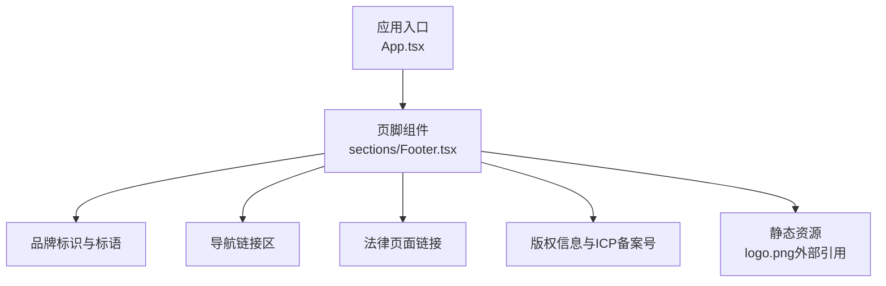
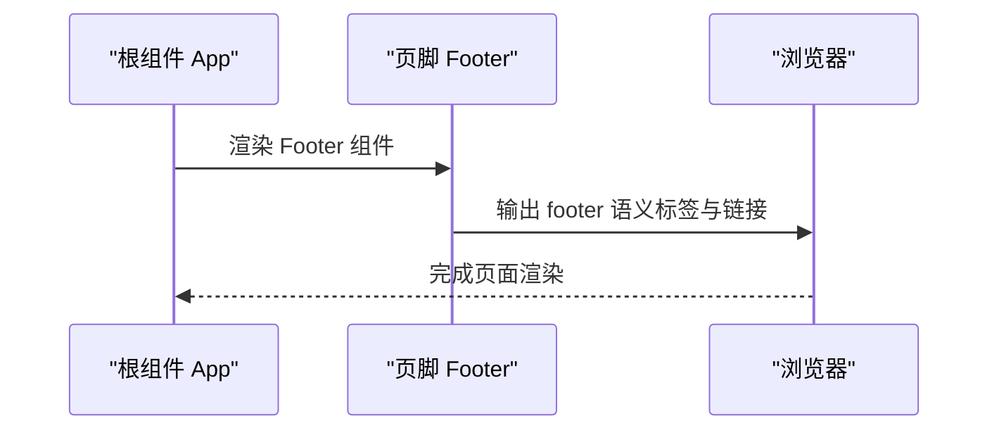
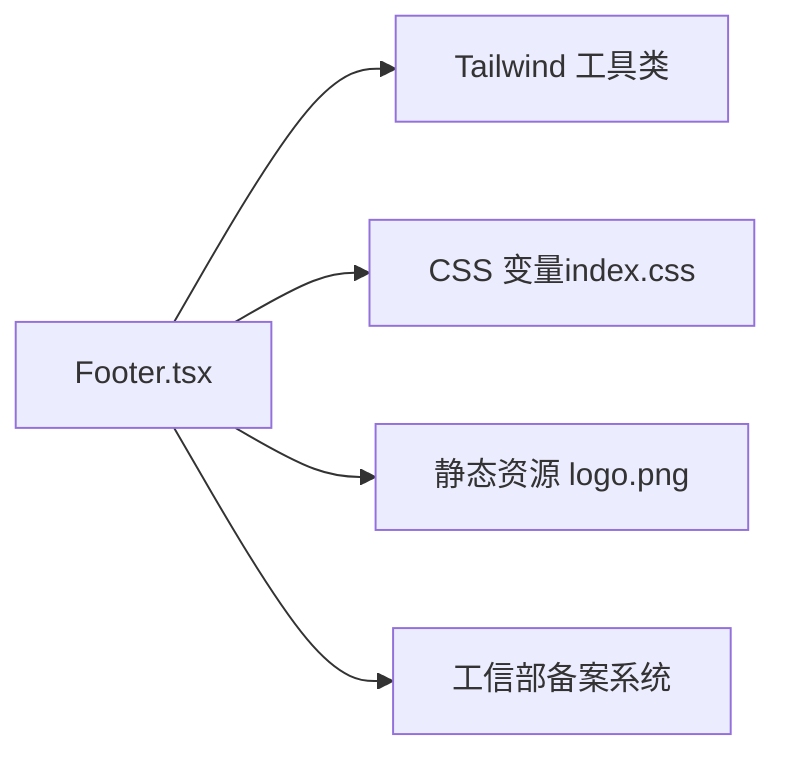
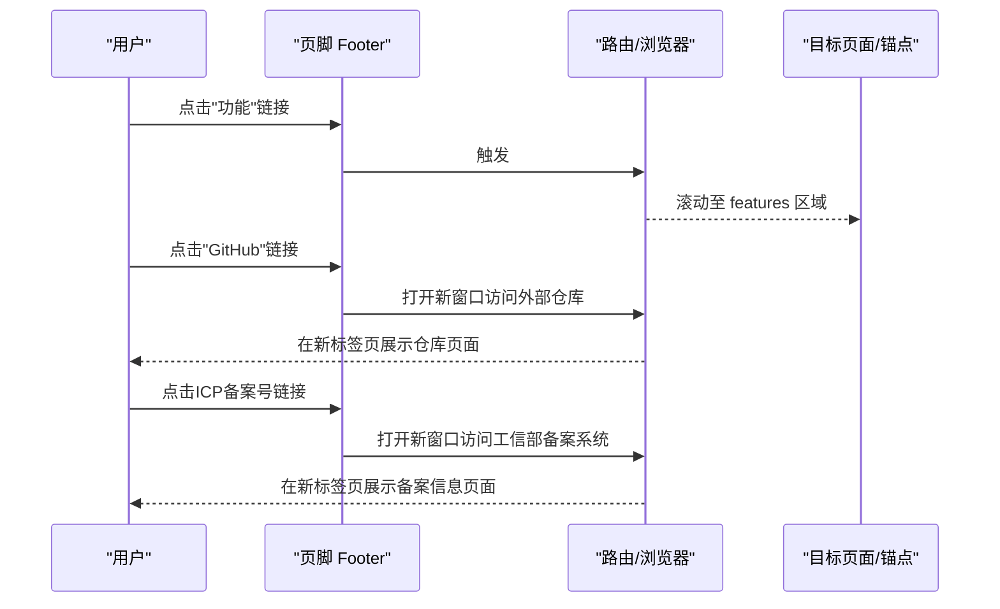

# Footer组件

<cite>
**本文引用的文件**
- [Footer.tsx](file://src/sections/Footer.tsx)
- [App.tsx](file://src/App.tsx)
- [index.css](file://src/index.css)
- [tailwind.config.js](file://tailwind.config.js)
- [privacy.html](file://public/privacy.html)
- [terms.html](file://public/terms.html)
- [robots.txt](file://public/robots.txt)
- [sitemap.xml](file://public/sitemap.xml)
- [README.md](file://README.md)
</cite>

## 更新摘要
**所做更改**
- 更新了版权信息管理章节，反映ICP备案号的正式化
- 新增了可点击备案号链接的安全属性说明
- 完善了合规信息展示的实现细节
- 更新了故障排查指南中的合规相关检查项

## 目录
1. [简介](#简介)
2. [项目结构](#项目结构)
3. [核心组件](#核心组件)
4. [架构总览](#架构总览)
5. [详细组件分析](#详细组件分析)
6. [依赖分析](#依赖分析)
7. [性能考虑](#性能考虑)
8. [故障排查指南](#故障排查指南)
9. [结论](#结论)
10. [附录](#附录)

## 简介
本文件为"Footer"页脚组件的权威文档，面向产品、设计与工程团队。内容涵盖信息架构设计、链接组织方式、版权信息管理、多列布局实现、社交媒体图标集成方案、法律页面链接管理、SEO优化策略、结构化数据标记建议、可访问性支持、内容更新指南与样式定制方法，以及多语言支持与国际化配置建议。

## 项目结构
Footer 作为 Landing Page 的底部区块，位于 sections 目录下，并在应用根组件中被引入渲染。

图示来源
- [App.tsx:1-30](file://src/App.tsx#L1-L30)
- [Footer.tsx:1-69](file://src/sections/Footer.tsx#L1-L69)

章节来源
- [App.tsx:1-30](file://src/App.tsx#L1-L30)
- [Footer.tsx:1-69](file://src/sections/Footer.tsx#L1-L69)

## 核心组件
- 组件职责：承载品牌标识、站点导航、法律声明链接、版权与合规信息，提供一致的视觉收尾体验。
- 技术栈：React + TypeScript；样式基于 Tailwind CSS；主题色通过 CSS 变量驱动。
- 布局模式：响应式 Flex 布局，移动端纵向堆叠，桌面端横向分布；上下分区（主信息区与版权条）。

章节来源
- [Footer.tsx:1-69](file://src/sections/Footer.tsx#L1-L69)
- [index.css:1-116](file://src/index.css#L1-L116)
- [tailwind.config.js:1-92](file://tailwind.config.js#L1-L92)

## 架构总览
Footer 在应用中的挂载位置与层级关系如下：

图示来源
- [App.tsx:1-30](file://src/App.tsx#L1-L30)
- [Footer.tsx:1-69](file://src/sections/Footer.tsx#L1-L69)

## 详细组件分析

### 信息架构与内容分区
- 品牌区：包含 Logo 图片、品牌名与口号，用于强化品牌识别。
- 导航链接区：功能、下载、GitHub 等关键入口，便于用户快速跳转或前往源码仓库。
- 法律链接区：隐私政策与用户协议，使用分隔符区分，提升可读性与可点击区域。
- 版权条：动态年份、域名与正式ICP备案号，满足国内网站合规要求。

**更新** 版权信息现已包含正式的ICP备案号"沪ICP备2026030941号-1"，替代了之前的占位符"备案中"。

章节来源
- [Footer.tsx:1-69](file://src/sections/Footer.tsx#L1-L69)

### 多列布局实现
- 采用 Flex 布局，移动端纵向排列，桌面端横向分布，保证在小屏设备上的可读性与操作便捷性。
- 间距与对齐：统一 gap 与 items-center 控制元素间距与垂直居中，确保在不同屏幕尺寸下的一致性。
- 最大宽度与内边距：通过 max-w-7xl 与不同断点的 px 值，适配大屏留白与小屏紧凑布局。

章节来源
- [Footer.tsx:1-69](file://src/sections/Footer.tsx#L1-L69)

### 链接组织方式
- 内部锚点链接：如"功能"、"下载"，指向页面内 section 的 id，提升单页浏览体验。
- 外部链接：如 GitHub，使用 target="_blank" 并配合 rel="noopener noreferrer" 保障安全与性能。
- 法律页面链接：指向静态 HTML 文件，保持独立且易于维护。
- **新增** ICP备案号链接：指向工信部备案系统，具备完整的安全属性和悬停效果。

**更新** ICP备案号现在是一个可点击的外部链接，指向 https://beian.miit.gov.cn/，并包含了必要的安全属性。

章节来源
- [Footer.tsx:1-69](file://src/sections/Footer.tsx#L1-L69)

### 社交媒体图标集成
- 当前未集成社交图标。建议在"导航链接区"新增社交图标按钮，遵循以下实践：
  - 使用统一的图标库（例如 Lucide React），保持风格一致。
  - 为每个图标添加 aria-label 描述用途，提升可访问性。
  - 外链目标窗口需设置 rel="noopener noreferrer"。
  - 悬停与焦点态应提供清晰的视觉反馈（颜色变化、描边加粗等）。

[本节为概念性建议，不直接分析具体代码文件]

### 法律页面链接管理
- 隐私政策与用户协议以静态 HTML 形式存放于 public 目录，便于 SEO 抓取与独立访问。
- 建议：
  - 为每个法律页面补充 <meta name="description"> 与合适的标题，利于搜索引擎理解。
  - 将法律页面纳入 sitemap.xml，提高收录概率。
  - 在 robots.txt 中允许抓取这些页面。

章节来源
- [privacy.html:1-34](file://public/privacy.html#L1-L34)
- [terms.html:1-37](file://public/terms.html#L1-L37)
- [robots.txt:1-5](file://public/robots.txt#L1-L5)
- [sitemap.xml:1-10](file://public/sitemap.xml#L1-L10)

### 版权信息管理
- 年份动态生成，避免每年手动修改。
- 显示域名与正式ICP备案号，符合国内网站合规要求。
- **更新** ICP备案号现在是可点击的外部链接，指向工信部备案系统，便于用户验证网站合法性。
- 建议：
  - 若涉及多主体或多产品线，可在版权信息中加入主体名称或商标声明。
  - 如需多语言，可将版权文本抽离为 i18n 键值。
  - 定期更新ICP备案号信息，确保与实际备案状态保持一致。

**更新** 实现了完整的ICP备案号展示，包括可点击链接和安全属性，提升了合规性和用户体验。

章节来源
- [Footer.tsx:1-69](file://src/sections/Footer.tsx#L1-L69)

### 样式定制方法
- 主题色与字体：通过 index.css 中的 CSS 变量与 tailwind.config.js 扩展，统一全局色彩与字体族。
- 背景与模糊效果：使用半透明深色背景与 backdrop-blur 营造层次感。
- 自定义类名：Tailwind 工具类组合实现响应式与交互态（hover、transition-colors）。
- **新增** 备案号链接样式：继承统一的悬停效果和过渡动画，确保与其他链接一致的交互体验。

章节来源
- [index.css:1-116](file://src/index.css#L1-L116)
- [tailwind.config.js:1-92](file://tailwind.config.js#L1-L92)
- [Footer.tsx:1-69](file://src/sections/Footer.tsx#L1-L69)

### SEO 优化策略
- 语义化标签：footer 标签有助于搜索引擎理解页面结构。
- 链接质量：内部锚点与外部仓库链接均具备明确目的，有利于用户体验与权重传递。
- 静态法律页面：HTML 格式利于爬虫解析，建议完善 meta 描述与标题。
- Sitemap 与 robots：确保法律页面被收录，robots 允许抓取。
- **新增** ICP备案号链接：为搜索引擎提供额外的外部链接信号，增强网站可信度。

章节来源
- [Footer.tsx:1-69](file://src/sections/Footer.tsx#L1-L69)
- [privacy.html:1-34](file://public/privacy.html#L1-L34)
- [terms.html:1-37](file://public/terms.html#L1-L37)
- [robots.txt:1-5](file://public/robots.txt#L1-L5)
- [sitemap.xml:1-10](file://public/sitemap.xml#L1-L10)

### 结构化数据标记
- 建议在首页或相关页面注入 Organization 或 WebSite 的 JSON-LD，增强搜索结果富摘要能力。
- 对于法律页面，可考虑添加 Article 或 LegalService 的结构化数据（视业务场景而定）。
- **建议** 可为ICP备案号添加更多的结构化数据标记，帮助搜索引擎更好地理解网站的合规状态。

[本节为概念性建议，不直接分析具体代码文件]

### 可访问性支持
- 语义化：使用 footer、a 等原生标签，确保屏幕阅读器正确识别。
- 图像 alt：Logo 图片提供有意义的替代文本。
- 键盘可达：所有链接可通过 Tab 聚焦，hover 与 focus 态应有清晰视觉反馈。
- 对比度：文字与背景对比度良好，降低阅读负担。
- 外链安全：target="_blank" 配合 rel="noopener noreferrer" 防止新窗口劫持。
- **新增** ICP备案号链接的可访问性：具备完整的键盘导航支持和屏幕阅读器兼容性。

**更新** ICP备案号链接遵循了所有可访问性最佳实践，包括安全属性和适当的交互反馈。

章节来源
- [Footer.tsx:1-69](file://src/sections/Footer.tsx#L1-L69)

### 内容更新指南
- 更新品牌信息：修改品牌名与口号，注意同步 README 的品牌说明。
- 调整链接：新增或删除导航项时，保持分类清晰与一致性。
- 法律页面：更新 privacy.html 与 terms.html 后，检查 Footer 链接是否仍有效。
- 版权年份：无需手动修改，组件已动态获取当前年份。
- **新增** ICP备案号更新：当ICP备案号变更时，需要同时更新Footer组件中的备案号和链接地址。

**更新** 增加了ICP备案号更新的指导流程，确保合规信息的及时性和准确性。

章节来源
- [README.md:1-73](file://README.md#L1-L73)
- [Footer.tsx:1-69](file://src/sections/Footer.tsx#L1-L69)
- [privacy.html:1-34](file://public/privacy.html#L1-L34)
- [terms.html:1-37](file://public/terms.html#L1-L37)

### 多语言支持与国际化配置建议
- 当前文案为中文硬编码。建议：
  - 引入 i18n 库（如 react-i18next），将文案抽取到语言包。
  - 根据浏览器语言或用户选择切换语言。
  - 为所有可访问性文本（alt、aria-label）提供多语言版本。
  - 对日期与数字进行本地化处理（如需要）。
  - **新增** ICP备案号的多语言处理：虽然备案号本身不需要翻译，但相关的说明文本可能需要多语言支持。

[本节为概念性建议，不直接分析具体代码文件]

## 依赖分析
- 组件耦合：Footer 仅依赖 React 与 Tailwind 工具类，无复杂外部依赖，内聚度高。
- 样式依赖：主题色与字体由 index.css 与 tailwind.config.js 提供，便于统一维护。
- 资源依赖：Logo 图片路径为相对路径，需确保 public/logo.png 存在。
- **新增** 外部服务依赖：ICP备案号链接依赖工信部备案系统的可用性。

图示来源
- [Footer.tsx:1-69](file://src/sections/Footer.tsx#L1-L69)
- [index.css:1-116](file://src/index.css#L1-L116)
- [tailwind.config.js:1-92](file://tailwind.config.js#L1-L92)

章节来源
- [Footer.tsx:1-69](file://src/sections/Footer.tsx#L1-L69)
- [index.css:1-116](file://src/index.css#L1-L116)
- [tailwind.config.js:1-92](file://tailwind.config.js#L1-L92)

## 性能考虑
- 轻量渲染：Footer 为纯展示组件，无副作用与状态，渲染开销极低。
- 图片加载：Logo 使用静态资源，建议启用缓存与懒加载策略（若后续增加更多图片）。
- 动画与过渡：使用 transition-colors 实现平滑的颜色过渡，避免重排重绘。
- **新增** 外部链接性能：ICP备案号链接使用标准的外部链接方式，不会显著影响页面性能。

[本节为通用指导，不直接分析具体代码文件]

## 故障排查指南
- 链接无效：
  - 检查内部锚点是否存在对应 section id。
  - 确认法律页面路径是否正确，robots.txt 是否允许抓取。
  - **新增** 验证ICP备案号链接是否正常工作，确保工信部备案系统可访问。
- 图片缺失：
  - 确认 public/logo.png 存在且路径正确。
- 样式异常：
  - 检查 Tailwind 构建是否生效，CSS 变量是否定义。
  - **新增** 检查备案号链接的悬停效果是否正常显示。
- 可访问性问题：
  - 为外链添加 rel="noopener noreferrer"。
  - 为图标与图片补充 alt 或 aria-label。
  - **新增** 验证ICP备案号链接的键盘导航和屏幕阅读器支持。
- 合规问题：
  - **新增** 定期检查ICP备案号是否与工信部备案系统记录一致。
  - **新增** 确保备案号链接指向正确的工信部官方网站。

**更新** 新增了ICP备案号相关的故障排查项，确保合规信息的准确性和可用性。

章节来源
- [Footer.tsx:1-69](file://src/sections/Footer.tsx#L1-L69)
- [robots.txt:1-5](file://public/robots.txt#L1-L5)
- [index.css:1-116](file://src/index.css#L1-L116)

## 结论
Footer 组件以简洁的信息架构与响应式布局，提供了品牌展示、导航入口、法律声明与版权信息的完整呈现。其实现遵循语义化与可访问性最佳实践，并通过 Tailwind 与 CSS 变量实现灵活的样式定制。**最新更新** 实现了正式的ICP备案号展示，包含可点击链接和安全属性，进一步增强了网站的合规性和专业性。建议在未来迭代中逐步引入社交图标、i18n 与结构化数据，进一步提升用户体验与 SEO 表现。

[本节为总结性内容，不直接分析具体代码文件]

## 附录

### 关键流程时序图（链接点击）

图示来源
- [Footer.tsx:1-69](file://src/sections/Footer.tsx#L1-L69)

### ICP备案号实现细节
ICP备案号链接的具体实现包含以下关键特性：

- **安全属性**：`target="_blank"` 和 `rel="noopener noreferrer"` 确保外部链接的安全性
- **样式一致性**：使用与其他链接相同的悬停效果和过渡动画
- **可访问性**：支持键盘导航和屏幕阅读器
- **合规性**：指向工信部官方备案系统，便于用户验证网站合法性

**更新** 实现了完整的ICP备案号功能，从占位符升级为正式的备案号链接。

章节来源
- [Footer.tsx:55-62](file://src/sections/Footer.tsx#L55-L62)