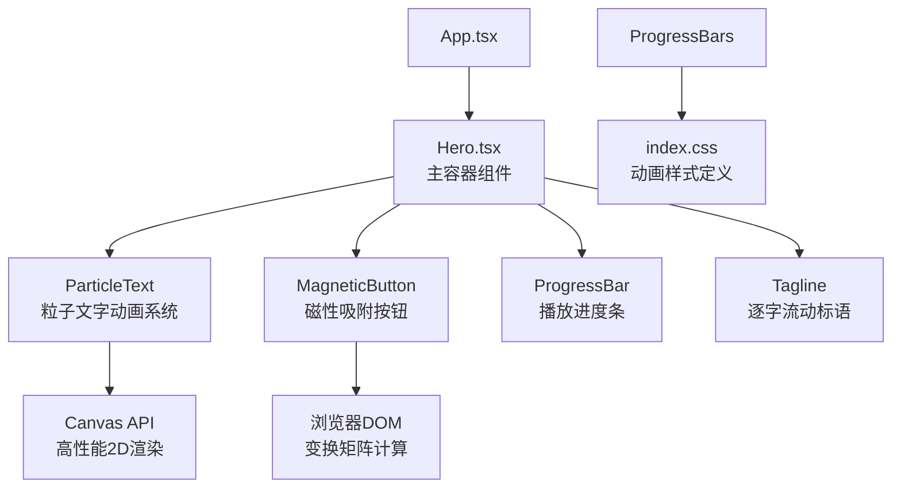
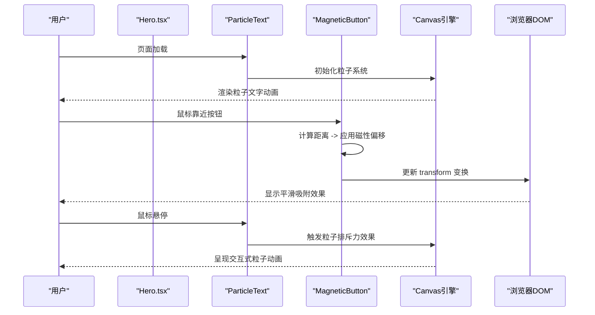
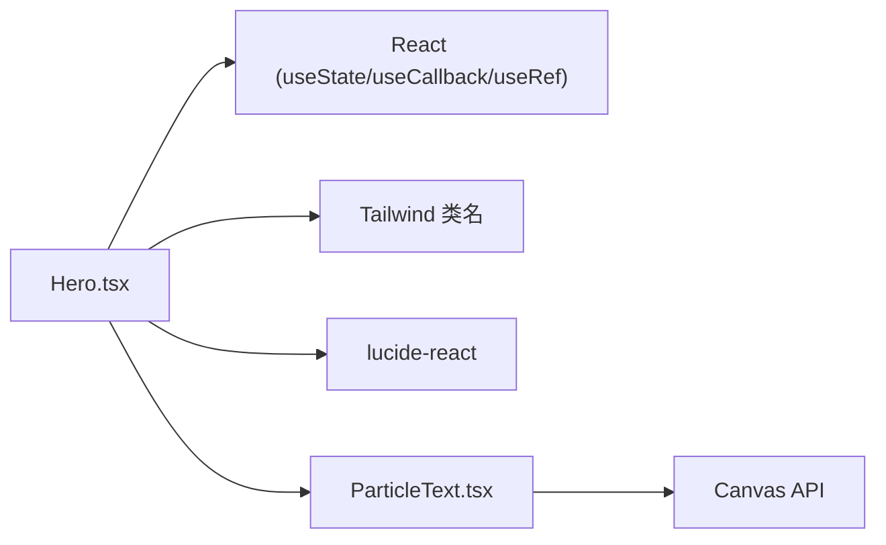

# Hero组件

<cite>
**本文引用的文件**
- [src/sections/Hero.tsx](file://src/sections/Hero.tsx)
- [src/components/ParticleText.tsx](file://src/components/ParticleText.tsx)
- [src/App.tsx](file://src/App.tsx)
- [src/index.css](file://src/index.css)
</cite>

## 更新摘要
**所做更改**
- 完全重设计了Hero组件架构，采用全屏沉浸式视觉体验
- 集成了全新的粒子文字动画系统，支持音乐节拍驱动的动态效果
- 重构了磁性按钮交互系统，优化了性能与用户体验
- 添加了播放进度条和逐字流动标语等新的UI元素
- 移除了之前的静态布局设计，采用现代化的全屏展示模式
- 简化了组件结构，专注于核心交互体验

## 目录
1. [简介](#简介)
2. [项目结构](#项目结构)
3. [核心组件](#核心组件)
4. [架构总览](#架构总览)
5. [详细组件分析](#详细组件分析)
6. [依赖分析](#依赖分析)
7. [性能考虑](#性能考虑)
8. [故障排查指南](#故障排查指南)
9. [结论](#结论)
10. [附录](#附录)

## 简介
Hero组件是应用的首屏"英雄区域"，经过完全重设计后，现在提供了一个沉浸式的视觉体验。组件集成了先进的粒子文字动画系统和磁性按钮交互效果，为用户呈现一个充满科技感的首页界面。**最新更新**：基于Applied Changes完全重设计了Hero组件，采用了全屏沉浸式布局，集成了新的粒子动画系统，彻底替换了之前的静态布局设计。

## 项目结构
Hero组件位于sections目录下，作为页面顶层模块被App引入并渲染。重设计后的组件包含了多个子组件：全屏粒子文字动画、播放进度条、磁性按钮、以及丰富的视觉特效层。

**图表来源**
- [src/App.tsx:17-18](file://src/App.tsx#L17-L18)
- [src/sections/Hero.tsx:37-116](file://src/sections/Hero.tsx#L37-L116)

**章节来源**
- [src/App.tsx:17-18](file://src/App.tsx#L17-L18)
- [src/sections/Hero.tsx:37-116](file://src/sections/Hero.tsx#L37-L116)

## 核心组件
- **功能职责**：提供全屏沉浸式首屏体验，集成粒子文字动画、磁性按钮交互、播放进度条和逐字流动标语。
- **交互方式**：监听鼠标事件实现磁性吸附效果，支持Canvas粒子系统的鼠标交互响应。
- **状态管理**：使用React Hooks（useState、useCallback、useRef）管理磁性偏移状态和DOM引用。
- **动画系统**：集成多层动画系统，包括Canvas粒子动画、CSS过渡动画和关键帧动画。
- **响应式布局**：基于Tailwind断点控制不同屏幕尺寸下的布局和视觉效果。

**章节来源**
- [src/sections/Hero.tsx:37-116](file://src/sections/Hero.tsx#L37-L116)

## 架构总览
重设计后的Hero组件在应用中采用分层架构，从背景到前景依次排列多个视觉层：

**图表来源**
- [src/sections/Hero.tsx:37-116](file://src/sections/Hero.tsx#L37-L116)
- [src/components/ParticleText.tsx:216-232](file://src/components/ParticleText.tsx#L216-L232)

## 详细组件分析

### 全屏粒子文字动画系统
ParticleText组件实现了革命性的Canvas粒子文字动画，支持音乐节拍驱动的动态效果和复杂的交互响应。

#### 音乐节拍驱动系统
- **BPM系统**：基于72 BPM的舒缓节奏，为每个字母生成独立的节拍特征
- **频段响应**：底鼓(kick)、军鼓(snare)、踩镲(hihat)分别影响不同区域的粒子
- **律动算法**：每个字母拥有独特的BPM偏差、节拍偏移和权重参数
- **声波传播**：从中心向外扩散的涟漪效果，模拟真实声学环境

#### 粒子系统架构
- **智能采样**：基于文本像素数据生成粒子数组，自动检测字母边界
- **分组管理**：将粒子按字母分组，每组拥有独立的动画参数
- **环境粒子**：添加背景星点粒子，增强空间深度感
- **鼠标交互**：实现粒子排斥力效果，支持多指触控

#### 性能优化策略
- **离屏渲染**：使用offscreen canvas预计算文本像素数据
- **可见性检测**：IntersectionObserver监控组件可见性，暂停不可见时的动画
- **节流处理**：限制鼠标事件处理频率至16ms间隔
- **响应式设计**：根据设备类型调整粒子数量和采样密度

**章节来源**
- [src/components/ParticleText.tsx:38-440](file://src/components/ParticleText.tsx#L38-L440)

### 磁性吸附交互效果系统
重设计后的磁性按钮系统提供了更加流畅和智能的交互体验。

#### 磁性吸附算法原理
- **距离感知**：使用欧几里得距离公式计算鼠标与按钮中心的距离
- **作用范围**：150px的最大作用距离，确保合理的交互范围
- **强度衰减**：吸引力强度随距离线性衰减，`strength = (1 - distance / maxDistance) * magneticStrength`
- **平滑过渡**：cubic-bezier缓动函数确保动画的自然流畅

#### 性能优化实现
- **Hook封装**：useMagnetic Hook提供可复用的磁性效果逻辑
- **事件缓存**：useCallback缓存事件处理器，避免不必要的重渲染
- **DOM引用**：useRef直接操作DOM，减少React渲染开销
- **条件渲染**：仅在有效范围内计算磁性偏移

**图表来源**
- [src/sections/Hero.tsx:10-34](file://src/sections/Hero.tsx#L10-L34)
- [src/sections/Hero.tsx:120-145](file://src/sections/Hero.tsx#L120-L145)

**章节来源**
- [src/sections/Hero.tsx:6-35](file://src/sections/Hero.tsx#L6-L35)
- [src/sections/Hero.tsx:120-145](file://src/sections/Hero.tsx#L120-L145)

### 播放进度条系统
新增的播放进度条组件提供了音频播放的视觉反馈。

#### 进度条设计
- **渐变背景**：白色半透明渐变背景，营造科技感
- **流动动画**：进度条宽度动画模拟播放进度
- **光晕效果**：进度指示器带有发光阴影
- **时间显示**：显示当前时间和总时长信息

#### 文案展示系统
- **逐字流动**：每个字符独立动画，创建波浪式显示效果
- **延迟序列**：字符间0.15秒的延迟，形成流动感
- **模糊过渡**：进出场时带有模糊效果，增强视觉层次

**章节来源**
- [src/sections/Hero.tsx:44-85](file://src/sections/Hero.tsx#L44-L85)

### 响应式布局的断点设计与移动端适配策略
重设计后的组件采用了更加灵活的响应式策略。

#### 断点设计
- **小屏优化**：增大字号，调整行高与间距，确保可读性
- **大屏布局**：充分利用屏幕空间，最大化视觉效果
- **超大屏增强**：进一步放大标题字号，增强视觉冲击力

#### 移动端适配
- **单列布局**：内容居中显示，适应窄屏设备
- **性能降级**：在小屏设备上自动降低粒子数量和采样密度
- **触摸优化**：针对触摸设备优化交互体验

**章节来源**
- [src/components/ParticleText.tsx:52-55](file://src/components/ParticleText.tsx#L52-L55)
- [src/components/ParticleText.tsx:234-235](file://src/components/ParticleText.tsx#L234-L235)

### 使用示例与自定义配置方法
- **基本用法**：直接导入并渲染Hero组件即可，所有功能已内置
- **磁性效果参数**：修改useMagnetic Hook的magneticStrength参数（当前为0.35）
- **粒子动画配置**：
  - 调整BPM值和节拍参数改变动画节奏
  - 修改鼠标影响半径和强度参数
  - 自定义粒子颜色和大小范围

**章节来源**
- [src/App.tsx:17-18](file://src/App.tsx#L17-L18)
- [src/sections/Hero.tsx:121](file://src/sections/Hero.tsx#L121)
- [src/components/ParticleText.tsx:259-274](file://src/components/ParticleText.tsx#L259-274)

### 常见问题与解决方案
- **问题**：粒子动画导致移动端性能问题
  - **解决**：启用可见性检测，在组件不可见时暂停动画；减小粒子数量和采样密度。
- **问题**：磁性效果过于强烈影响用户体验
  - **解决**：降低magneticStrength参数或减小maxDistance范围。
- **问题**：Canvas动画在不同设备上表现不一致
  - **解决**：统一使用devicePixelRatio处理高清屏幕，添加响应式尺寸计算。
- **问题**：内存泄漏导致页面卡顿
  - **解决**：确保正确清理动画帧、事件监听器和IntersectionObserver。
- **问题**：动画在不同浏览器中兼容性差
  - **解决**：添加polyfill或使用CSS fallback方案。

**章节来源**
- [src/components/ParticleText.tsx:208-214](file://src/components/ParticleText.tsx#L208-L214)
- [src/components/ParticleText.tsx:426-431](file://src/components/ParticleText.tsx#L426-L431)

### 最佳实践建议
- **性能优先**：合理使用Canvas动画，注意移动端性能优化和资源管理
- **渐进增强**：基础功能保持稳定，高级特性作为可选增强
- **内存管理**：及时清理动画帧、事件监听器和Canvas资源
- **响应式设计**：确保在不同设备和屏幕尺寸下都有良好的用户体验
- **可访问性**：为动画效果提供prefers-reduced-motion支持
- **模块化设计**：保持组件的独立性和可复用性

## 依赖分析
- **组件依赖**：
  - React基础能力：useState、useCallback、useRef用于状态与事件回调优化
  - Tailwind样式系统：通过类名实现响应式布局与视觉效果
  - 图标库：lucide-react提供装饰图标
- **外部组件**：
  - ParticleText：独立的粒子文字动画组件，提供高性能的Canvas动画效果

**图表来源**
- [src/sections/Hero.tsx:1-3](file://src/sections/Hero.tsx#L1-L3)
- [src/components/ParticleText.tsx:1](file://src/components/ParticleText.tsx#L1)

**章节来源**
- [src/sections/Hero.tsx:1-3](file://src/sections/Hero.tsx#L1-L3)
- [src/components/ParticleText.tsx:1](file://src/components/ParticleText.tsx#L1)

## 性能考虑
- **事件频率优化**：磁性按钮的onMouseMove事件需要节流处理，建议使用requestAnimationFrame
- **重渲染成本控制**：每次状态更新都会触发组件重渲染，可通过useMemo/useRef缓存计算结果
- **GPU加速利用**：transform与opacity属于合成层属性，有利于GPU加速；避免频繁修改layout属性
- **Canvas性能优化**：
  - 使用离屏渲染预计算文本像素数据
  - 合理设置粒子数量和采样间隔
  - 及时清理动画帧和事件监听器
  - 响应式调整动画复杂度
  - 实现可见性检测，暂停不可见时的动画
- **内存管理**：组件卸载时正确清理所有资源，防止内存泄漏
- **动画性能**：使用requestAnimationFrame确保60fps流畅动画

## 故障排查指南
- **检查事件绑定**：确认onMouseMove与onMouseLeave是否正确挂载在按钮元素上
- **验证磁性效果**：检查按钮元素的transform属性是否正确应用，确认cubic-bezier缓动函数参数
- **调试Canvas动画**：在浏览器开发者工具中检查Canvas上下文和动画帧是否正常
- **性能监控**：使用浏览器性能面板检查是否有内存泄漏或过度重渲染
- **响应式测试**：在不同屏幕尺寸下测试布局和动画效果
- **动画调试**：检查requestAnimationFrame循环是否正确启动和停止
- **内存泄漏检查**：确保所有事件监听器和动画帧都被正确清理

**章节来源**
- [src/sections/Hero.tsx:126-127](file://src/sections/Hero.tsx#L126-L127)
- [src/components/ParticleText.tsx:426-431](file://src/components/ParticleText.tsx#L426-L431)

## 结论
重设计后的Hero组件通过现代化的全屏沉浸式布局、先进的粒子文字动画系统和磁性按钮交互效果，为用户提供了前所未有的视觉体验。**最新更新**：基于Applied Changes完全重设计了Hero组件，集成了新的粒子动画系统，彻底替换了之前的静态布局设计。磁性按钮效果系统为用户提供了自然流畅的交互体验，而多层动画系统则为页面增添了丰富的视觉层次。借助Tailwind的响应式能力和Canvas的高性能渲染，组件在不同设备上均能提供一致的优质体验。未来可继续优化动画性能，并通过配置化参数提升组件的灵活性和复用性。

## 附录

### 磁性效果参数配置表
| 参数 | 默认值 | 说明 | 可调范围 |
|------|--------|------|----------|
| magneticStrength | 0.35 | 磁力强度系数 | 0.1-0.5 |
| maxDistance | 150 | 磁性作用范围(px) | 100-200 |
| transitionDuration | 0.3s | 过渡动画时长 | 0.2-0.5s |
| cubicBezier | (0.25, 0.46, 0.45, 0.94) | 缓动函数参数 | 自定义 |

### 粒子动画参数配置表
| 参数 | 默认值 | 说明 | 可调范围 |
|------|--------|------|----------|
| particleCount | 动态计算 | 粒子数量（响应式） | 100-1000 |
| sampleGap | 3-4 | 像素采样间隔 | 2-8 |
| mouseInfluenceRadius | 100-150 | 鼠标影响半径(px) | 50-200 |
| bpm | 72 | 基础节拍(BPM) | 60-120 |
| waveSpeed | 180 | 声波传播速度 | 100-300 |

### 性能基准测试
- **目标帧率**：60fps
- **最大重渲染次数**：每帧不超过1次
- **事件处理延迟**：<16ms（1帧时间）
- **Canvas渲染性能**：在主流设备上保持流畅动画
- **初始加载时间**：<2秒（包含所有动画资源）