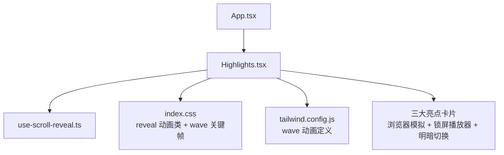
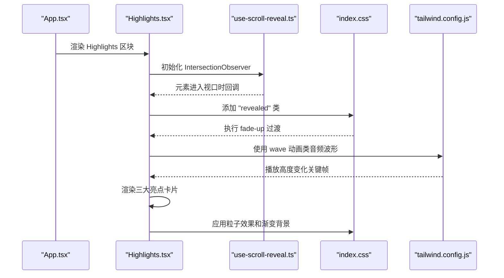
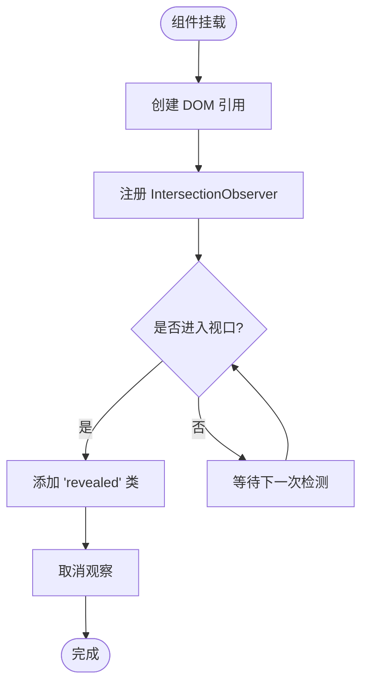
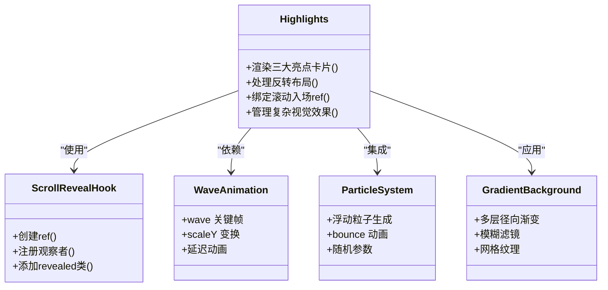
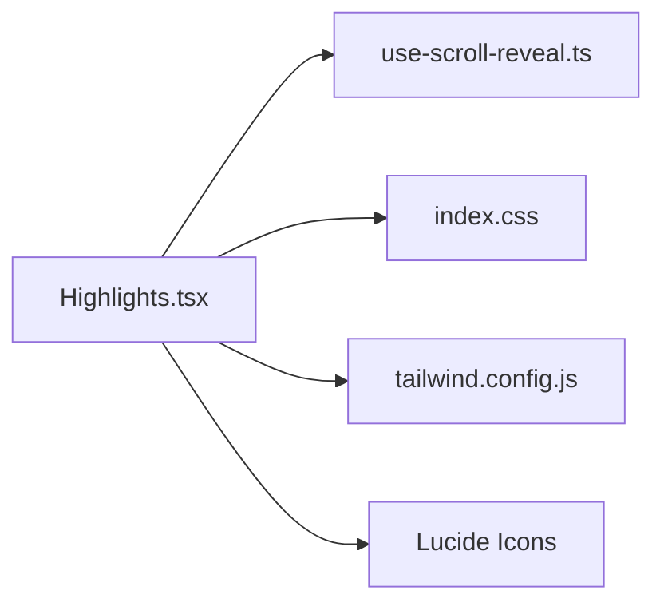

# Highlights组件

<cite>
**本文引用的文件**   
- [Highlights.tsx](file://src/sections/Highlights.tsx)
- [use-scroll-reveal.ts](file://src/hooks/use-scroll-reveal.ts)
- [index.css](file://src/index.css)
- [tailwind.config.js](file://tailwind.config.js)
- [App.tsx](file://src/App.tsx)
</cite>

## 更新摘要
**变更内容**   
- 大幅增强了三张亮点卡片的视觉效果和交互体验
- 第一张卡片新增复杂的浏览器窗口模拟、粒子效果和渐变背景
- 第二张卡片实现了详细的锁屏播放器界面，包括iOS风格状态栏、进度条和波形动画
- 第三张卡片展示了分屏设计的明暗模式切换效果
- 新增了wave动画系统用于音频波形可视化
- 优化了视觉层次设计和响应式适配策略

## 目录
1. [简介](#简介)
2. [项目结构](#项目结构)
3. [核心组件与数据模型](#核心组件与数据模型)
4. [架构总览](#架构总览)
5. [详细组件分析](#详细组件分析)
6. [依赖关系分析](#依赖关系分析)
7. [性能考量与优化建议](#性能考量与优化建议)
8. [故障排查指南](#故障排查指南)
9. [结论](#结论)
10. [附录：定制与扩展指南](#附录定制与扩展指南)

## 简介
本文件为"Highlights"组件的完整技术文档，聚焦其设计模式、实现细节与可定制性。内容涵盖：
- 亮点展示的数据驱动渲染与视觉层次
- 滚动触发机制（IntersectionObserver）与入场动画
- 音频波形等动效的实现方式
- 明暗主题与响应式适配策略
- 可扩展性与性能调优建议

**更新** 组件现已包含三个精心设计的亮点卡片，每个都拥有独特的视觉效果和交互体验。

## 项目结构
Highlights 组件位于 sections 目录中，作为页面区块被 App 主应用引入并渲染。其样式与动画由全局 CSS 与 Tailwind 配置共同提供。

图表来源
- [App.tsx:1-30](file://src/App.tsx#L1-L30)
- [Highlights.tsx:1-310](file://src/sections/Highlights.tsx#L1-L310)
- [use-scroll-reveal.ts:1-34](file://src/hooks/use-scroll-reveal.ts#L1-L34)
- [index.css:81-122](file://src/index.css#L81-L122)
- [tailwind.config.js:78-88](file://tailwind.config.js#L78-L88)

章节来源
- [App.tsx:1-30](file://src/App.tsx#L1-L30)
- [Highlights.tsx:1-310](file://src/sections/Highlights.tsx#L1-L310)

## 核心组件与数据模型
Highlights 采用"数据驱动 + 条件布局"的模式：通过常量数组描述每个亮点的图标、标题、描述与可视化图像；组件负责将数据映射到 UI，并根据配置项控制左右布局顺序。

### 数据模型要点
- **图标**：使用 React 组件引用，便于统一风格与尺寸
- **标题与描述**：纯文本，用于信息层级表达
- **图像**：内联 JSX 片段，承载各亮点的复杂可视化示意
- **reversed**：布尔值，控制图文左右顺序

### 三大亮点卡片详解

#### 第一张卡片：网页链接一键朗读
- **浏览器窗口模拟**：完整的 Safari 浏览器界面，包含地址栏、标签页和导航按钮
- **粒子效果**：浮动蓝色粒子营造科技感氛围
- **渐变背景**：多层径向渐变叠加，营造深度感
- **流程指示器**：分享 → 提取 → 朗读的三步流程可视化

#### 第二张卡片：后台播放，解放双眼
- **锁屏播放器界面**：仿 iOS 风格的完整播放器控件
- **状态栏**：时间显示、锁定图标和音乐标识
- **专辑封面区域**：带光晕效果的耳机图标
- **进度条**：渐变色进度指示和时间显示
- **控制按钮**：上一首、播放/暂停、下一首按钮
- **音频波形**：动态波形动画展示播放状态

#### 第三张卡片：明暗主题，随心切换
- **分屏设计**：左右对比展示日间模式和夜间模式
- **光线装饰**：太阳和月亮的发光效果
- **模拟阅读界面**：两种模式下不同的阅读界面预览
- **分隔线**：中间的分隔线和切换图标

章节来源
- [Highlights.tsx:4-261](file://src/sections/Highlights.tsx#L4-L261)

## 架构总览
Highlights 组件在页面中的位置与交互流程如下：

图表来源
- [App.tsx:1-30](file://src/App.tsx#L1-L30)
- [Highlights.tsx:263-310](file://src/sections/Highlights.tsx#L263-L310)
- [use-scroll-reveal.ts:1-34](file://src/hooks/use-scroll-reveal.ts#L1-L34)
- [index.css:81-122](file://src/index.css#L81-L122)
- [tailwind.config.js:78-88](file://tailwind.config.js#L78-L88)

## 详细组件分析

### 组件结构与职责
- **数据层**：HIGHLIGHTS 常量数组，声明式描述每个亮点的内容与可视化
- **视图层**：基于栅格布局（移动端单列、桌面端双列），支持图文左右互换
- **交互层**：滚动入场动画，仅触发一次，避免重复开销
- **样式层**：Tailwind 原子类 + 自定义 reveal 动画 + wave 动画 + 复杂视觉效果

### 滚动触发机制（IntersectionObserver）
- 使用自定义 hook 创建 ref，并在 useEffect 中注册观察者
- 当目标元素进入视口比例达到阈值时，为目标元素添加 "revealed" 类
- 观察完成后立即取消观察，确保动画只触发一次

图表来源
- [use-scroll-reveal.ts:1-34](file://src/hooks/use-scroll-reveal.ts#L1-L34)
- [index.css:81-102](file://src/index.css#L81-L102)

章节来源
- [use-scroll-reveal.ts:1-34](file://src/hooks/use-scroll-reveal.ts#L1-L34)
- [index.css:81-102](file://src/index.css#L81-L102)

### 动画效果实现

#### 滚动入场动画
- CSS transition 配合 opacity 与 translateY，形成淡入上移效果
- 使用 cubic-bezier 缓动函数创造自然的运动曲线

#### 音频波形动画
- 通过 CSS @keyframes 定义的 wave 动画，动态设置条状元素高度
- 每个波形条都有独立的延迟时间，创造波浪效果
- 使用 scaleY 变换优化性能

#### 粒子效果
- 动态生成的浮动粒子，使用 animate-bounce 动画
- 不同大小、位置和动画时长创造层次感
- 半透明颜色营造科技氛围

#### 渐变背景
- 多层径向渐变叠加，营造深度感和空间感
- 模糊滤镜增强光晕效果
- 网格背景增加纹理细节

图表来源
- [Highlights.tsx:263-310](file://src/sections/Highlights.tsx#L263-L310)
- [use-scroll-reveal.ts:1-34](file://src/hooks/use-scroll-reveal.ts#L1-L34)
- [index.css:118-122](file://src/index.css#L118-L122)
- [tailwind.config.js:78-88](file://tailwind.config.js#L78-L88)

章节来源
- [Highlights.tsx:10-261](file://src/sections/Highlights.tsx#L10-L261)
- [index.css:81-122](file://src/index.css#L81-L122)
- [tailwind.config.js:78-88](file://tailwind.config.js#L78-L88)

### 视觉层次与配色
- **品牌色与语义色**：通过 CSS 变量与 Tailwind 颜色体系统一管理，保证明暗主题一致性
- **背景与前景**：使用低透明度叠加与 backdrop-blur 增强层次
- **图标与强调**：图标容器使用主题色背景与描边，标题与正文通过字号与字重区分层级
- **光晕效果**：多层径向渐变和模糊滤镜营造深度感
- **粒子系统**：浮动粒子增加动态感和科技感

章节来源
- [index.css:8-68](file://src/index.css#L8-L68)
- [tailwind.config.js:10-54](file://tailwind.config.js#L10-L54)
- [Highlights.tsx:10-261](file://src/sections/Highlights.tsx#L10-L261)

### 响应式适配策略
- **栅格布局**：移动端单列，桌面端双列，并通过 lg:flex-row-reverse 控制图文顺序
- **间距与字号**：使用 sm/lg 断点调整内边距、字体大小与行高，提升可读性
- **图片比例**：固定宽高比容器，确保在不同屏幕下稳定呈现
- **复杂界面适配**：三大亮点卡片都经过响应式设计优化

章节来源
- [Highlights.tsx:278-305](file://src/sections/Highlights.tsx#L278-L305)

### 数据格式化显示
- 当前亮点数据以结构化对象形式组织，包含图标组件、标题、描述与可视化图像
- 如需新增亮点，只需在数据数组中添加对应条目，无需修改渲染逻辑
- 若需对数字或时间进行格式化，可在数据层预处理或使用工具函数封装

章节来源
- [Highlights.tsx:4-261](file://src/sections/Highlights.tsx#L4-L261)

### 颜色主题配置
- **明暗主题**：通过 CSS 变量集中管理，Tailwind 直接消费这些变量
- **组件内直接使用**：语义化颜色类名，自动跟随主题切换
- **可通过覆盖**：CSS 变量或 Tailwind 主题来定制品牌色与辅助色

章节来源
- [index.css:8-68](file://src/index.css#L8-L68)
- [tailwind.config.js:10-54](file://tailwind.config.js#L10-L54)

## 依赖关系分析
Highlights 组件对外部依赖较少，主要依赖：
- **自定义滚动钩子**：use-scroll-reveal
- **全局样式**：reveal 动画与 wave 动画
- **Tailwind 原子类**：布局、排版、色彩与动画

图表来源
- [Highlights.tsx:1-310](file://src/sections/Highlights.tsx#L1-L310)
- [use-scroll-reveal.ts:1-34](file://src/hooks/use-scroll-reveal.ts#L1-L34)
- [index.css:81-122](file://src/index.css#L81-L122)
- [tailwind.config.js:78-88](file://tailwind.config.js#L78-L88)

章节来源
- [Highlights.tsx:1-310](file://src/sections/Highlights.tsx#L1-L310)

## 性能考量与优化建议

### 滚动监听优化
- 已使用 IntersectionObserver 且仅触发一次，避免频繁计算与重排
- 建议在大数据量场景下考虑懒加载可视化图像或按需渲染复杂节点

### 动画性能
- **优先使用 transform 与 opacity 动画**：减少布局抖动
- **wave 动画优化**：使用 scaleY 变换而非高度变化，降低重绘压力
- **粒子效果优化**：限制粒子数量，使用硬件加速的 CSS 动画
- **渐变背景优化**：避免过多复杂的渐变叠加

### 样式合并与构建
- 使用 Tailwind 原子类可减少自定义样式体积
- 保持 CSS 变量集中管理，避免重复定义

### 可访问性
- 为图标与状态标签提供适当的 aria-label，提升无障碍体验
- 确保对比度满足 WCAG 标准，尤其在明暗主题切换时

### 复杂视觉效果优化
- **浏览器窗口模拟**：使用静态元素而非实时渲染，减少计算开销
- **锁屏播放器**：简化波形动画复杂度，限制同时播放的动画数量
- **明暗切换**：使用 CSS 过渡而非 JavaScript 动画，提升性能

[本节为通用指导，不直接分析具体文件]

## 故障排查指南

### 滚动动画未触发
- 检查目标元素是否具备 reveal 类，且在进入视口后是否添加了 revealed 类
- 确认 IntersectionObserver 的 threshold 配置是否符合预期

### 动画卡顿或掉帧
- 检查是否存在大量同时触发的动画
- 评估 wave 动画的条数与时长，必要时降低复杂度
- 检查粒子效果的数量和动画性能

### 主题不一致
- 确认 CSS 变量是否正确注入，Tailwind 是否读取到 dark 模式变量
- 检查组件是否使用了正确的语义化颜色类名

### 复杂界面显示问题
- 检查浏览器窗口模拟的嵌套层级和 z-index 冲突
- 验证锁屏播放器的响应式适配是否正常
- 确认明暗切换的分屏布局是否正确

章节来源
- [use-scroll-reveal.ts:1-34](file://src/hooks/use-scroll-reveal.ts#L1-L34)
- [index.css:81-122](file://src/index.css#L81-L122)
- [tailwind.config.js:78-88](file://tailwind.config.js#L78-L88)

## 结论
Highlights 组件以数据驱动为核心，结合轻量级滚动钩子与 Tailwind 动画，实现了简洁而富有层次的亮点展示。经过重大更新后，组件现在包含三个精心设计的亮点卡片，每个都拥有独特的视觉效果和交互体验。其结构清晰、扩展性强，适合在营销页或产品特性介绍中使用。通过合理的性能优化与主题配置，可在多设备与多主题环境下保持一致的用户体验。

## 附录：定制与扩展指南

### 新增亮点
- 在数据数组中添加新条目，包含图标、标题、描述与可视化图像
- 如需反转布局，设置 reversed 为 true
- 参考现有卡片的复杂视觉效果实现新的可视化

### 替换图标
- 使用任意 React SVG 组件替换现有图标引用，保持统一的尺寸与描边风格
- 推荐使用 Lucide React 图标库以保持风格一致

### 调整动画
- 修改 reveal 过渡时长与缓动曲线，或在 index.css 中扩展 stagger 延迟
- 调整 wave 动画的关键帧与持续时间，平衡视觉效果与性能
- 自定义粒子效果：调整数量、大小、颜色和动画参数

### 主题定制
- 在 CSS 变量中调整品牌色与辅助色，或通过 Tailwind 主题覆盖
- 确保明暗模式下对比度与可读性一致
- 为新的视觉效果选择合适的配色方案

### 性能调优
- 对复杂可视化图像使用懒加载或占位图
- 限制同时可见区域的动画数量，避免低端设备过载
- 优化粒子效果：减少数量、使用更简单的动画
- 简化渐变背景：减少图层数量和复杂度

### 复杂界面开发指南
- **浏览器窗口模拟**：使用绝对定位和 z-index 管理层级
- **锁屏播放器**：参考 iOS 设计规范，保持界面一致性
- **明暗切换**：使用 flexbox 或 grid 实现分屏布局
- **响应式设计**：确保所有复杂界面在小屏幕上正常显示

章节来源
- [Highlights.tsx:4-261](file://src/sections/Highlights.tsx#L4-L261)
- [index.css:81-122](file://src/index.css#L81-L122)
- [tailwind.config.js:78-88](file://tailwind.config.js#L78-L88)