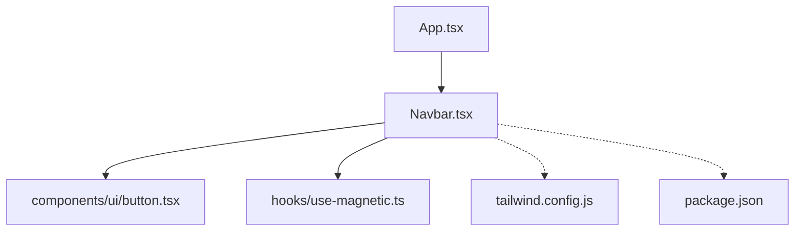
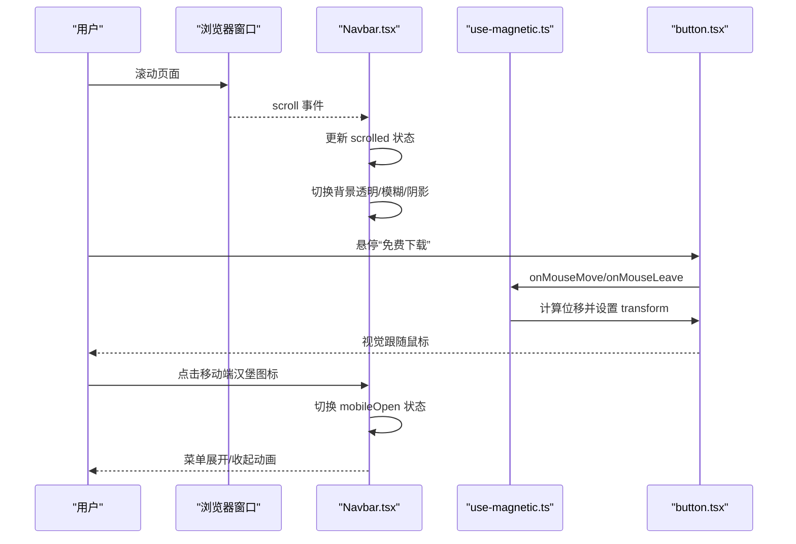
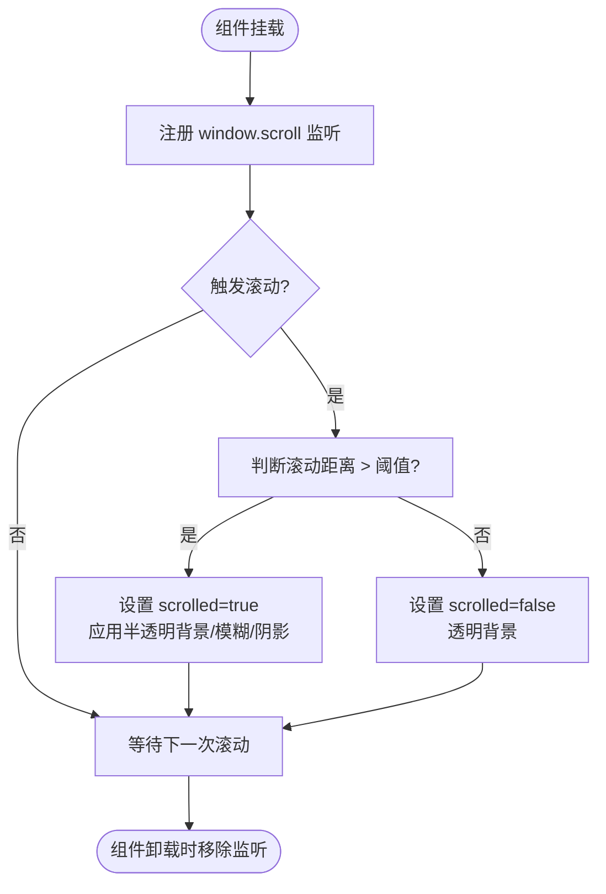
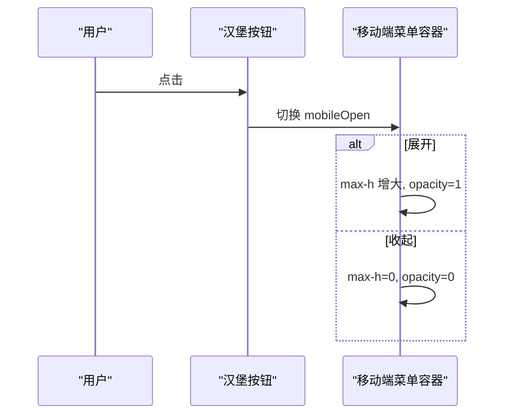
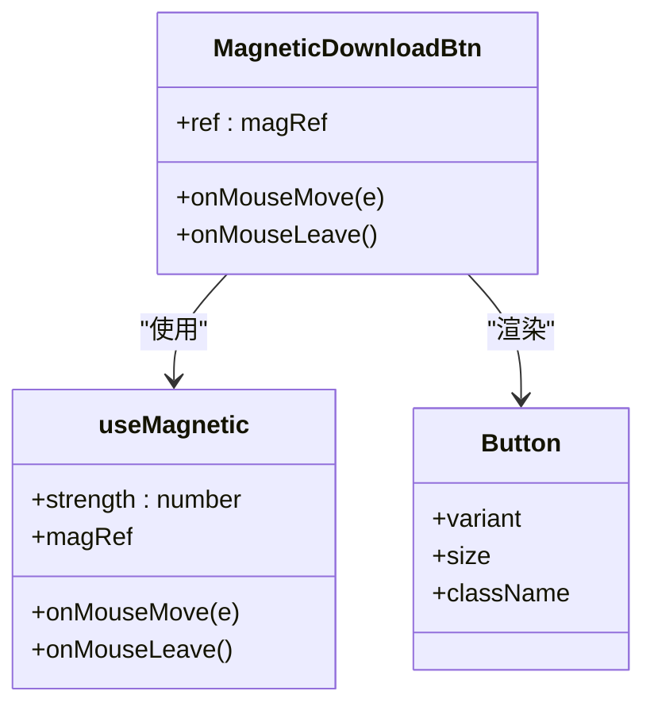
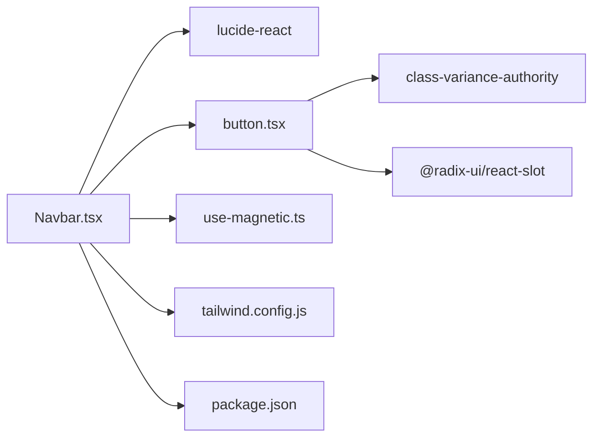

# Navbar组件

<cite>
**本文引用的文件**
- [src/sections/Navbar.tsx](file://src/sections/Navbar.tsx)
- [src/hooks/use-magnetic.ts](file://src/hooks/use-magnetic.ts)
- [src/components/ui/button.tsx](file://src/components/ui/button.tsx)
- [tailwind.config.js](file://tailwind.config.js)
- [package.json](file://package.json)
</cite>

## 目录
1. [简介](#简介)
2. [项目结构](#项目结构)
3. [核心组件](#核心组件)
4. [架构总览](#架构总览)
5. [详细组件分析](#详细组件分析)
6. [依赖关系分析](#依赖关系分析)
7. [性能考虑](#性能考虑)
8. [故障排查指南](#故障排查指南)
9. [结论](#结论)
10. [附录](#附录)

## 简介
本文件为 Navbar 导航栏组件的完整技术文档，覆盖设计模式与实现细节、滚动监听机制、菜单展开收起逻辑、移动端适配策略、粘性定位与透明度变化动画、路由跳转处理、触摸手势支持、键盘导航与无障碍访问、主题定制与品牌标识替换方法，以及性能优化与用户体验建议。目标是帮助开发者快速理解并高效扩展该组件。

## 项目结构
Navbar 位于 sections 目录下，作为页面级布局组件被应用根组件引入。其样式基于 Tailwind CSS，交互状态由 React Hooks 管理，按钮样式来自 UI 库封装，磁性动效通过自定义 Hook 提供。

图表来源
- [src/App.tsx:1-30](file://src/App.tsx#L1-L30)
- [src/sections/Navbar.tsx:1-117](file://src/sections/Navbar.tsx#L1-L117)
- [src/components/ui/button.tsx:1-63](file://src/components/ui/button.tsx#L1-L63)
- [src/hooks/use-magnetic.ts:1-32](file://src/hooks/use-magnetic.ts#L1-L32)
- [tailwind.config.js:1-92](file://tailwind.config.js#L1-L92)
- [package.json:1-80](file://package.json#L1-L80)

章节来源
- [src/App.tsx:1-30](file://src/App.tsx#L1-L30)
- [src/sections/Navbar.tsx:1-117](file://src/sections/Navbar.tsx#L1-L117)

## 核心组件
- Navbar：负责导航栏整体布局、滚动状态、移动端菜单开关、桌面端链接与下载按钮、移动端折叠菜单渲染。
- MagneticDownloadBtn：将“免费下载”按钮包裹在磁性 Hook 中，实现鼠标靠近时的位移吸引效果。
- useMagnetic：计算鼠标相对元素中心偏移，驱动 transform 位移；离开时复位。
- Button（UI）：基于 class-variance-authority 的变体化按钮组件，提供默认、尺寸、焦点态等样式组合。
- Tailwind 配置：定义颜色、圆角、阴影、动画等主题变量，供 Navbar 使用。

章节来源
- [src/sections/Navbar.tsx:1-117](file://src/sections/Navbar.tsx#L1-L117)
- [src/hooks/use-magnetic.ts:1-32](file://src/hooks/use-magnetic.ts#L1-L32)
- [src/components/ui/button.tsx:1-63](file://src/components/ui/button.tsx#L1-L63)
- [tailwind.config.js:1-92](file://tailwind.config.js#L1-L92)

## 架构总览
Navbar 采用“状态 + 副作用 + 纯展示”的组合式架构：
- 状态：滚动位置是否超过阈值、移动端菜单是否展开。
- 副作用：窗口滚动事件监听与清理。
- 展示：根据状态切换背景透明度、毛玻璃、阴影、菜单高度与不透明度。

图表来源
- [src/sections/Navbar.tsx:28-116](file://src/sections/Navbar.tsx#L28-L116)
- [src/hooks/use-magnetic.ts:7-31](file://src/hooks/use-magnetic.ts#L7-L31)
- [src/components/ui/button.tsx:39-60](file://src/components/ui/button.tsx#L39-L60)

## 详细组件分析

### 滚动监听与粘性定位
- 粘性定位：通过固定定位 top/left/right 与高 z-index 实现始终置顶显示。
- 滚动监听：在挂载时注册 window.scroll 事件，当滚动距离大于阈值时切换背景与阴影；卸载时移除监听避免内存泄漏。
- 过渡动画：背景、阴影、模糊等属性通过 transition-all 平滑过渡。

图表来源
- [src/sections/Navbar.tsx:28-45](file://src/sections/Navbar.tsx#L28-L45)

章节来源
- [src/sections/Navbar.tsx:28-45](file://src/sections/Navbar.tsx#L28-L45)

### 菜单展开收起逻辑（移动端）
- 状态：mobileOpen 控制移动端菜单可见性。
- 交互：点击汉堡图标切换状态；点击菜单项后自动关闭。
- 动画：通过 max-height 与 opacity 的过渡实现展开/收起。

图表来源
- [src/sections/Navbar.tsx:74-113](file://src/sections/Navbar.tsx#L74-L113)

章节来源
- [src/sections/Navbar.tsx:74-113](file://src/sections/Navbar.tsx#L74-L113)

### 移动端适配策略
- 响应式布局：桌面端隐藏汉堡按钮与折叠菜单，显示水平链接；移动端则相反。
- 断点：使用 Tailwind 的 md 断点进行显隐控制。
- 可访问性：汉堡按钮提供 aria-label 描述用途。

章节来源
- [src/sections/Navbar.tsx:60-82](file://src/sections/Navbar.tsx#L60-L82)

### 透明度变化与毛玻璃效果
- 未滚动：背景透明。
- 滚动后：背景变为深色半透明，叠加 backdrop-blur 与阴影，提升可读性与层次感。
- 过渡：transition-all 配合 duration 实现平滑变化。

章节来源
- [src/sections/Navbar.tsx:38-45](file://src/sections/Navbar.tsx#L38-L45)

### 路由跳转处理
- 当前实现：所有链接使用锚点 href（如 #features、#download），属于同页内跳转。
- 影响：不会触发整页刷新，适合单页落地页场景。
- 扩展建议：若需 SPA 路由，可将 href 替换为 react-router 的 Link 组件或 navigate 调用，并在滚动监听中增加对目标区域可视性的检测以优化体验。

章节来源
- [src/sections/Navbar.tsx:6-9](file://src/sections/Navbar.tsx#L6-L9)
- [src/sections/Navbar.tsx:62-71](file://src/sections/Navbar.tsx#L62-L71)
- [src/sections/Navbar.tsx:94-111](file://src/sections/Navbar.tsx#L94-L111)

### 触摸手势支持
- 当前实现：未包含滑动手势（如滑动关闭菜单）。
- 建议：可引入轻量手势库或使用 Pointer Events 监听 touchstart/touchmove/touchend，实现从右向左滑动打开、从左向右滑动关闭的交互。

章节来源
- [src/sections/Navbar.tsx:74-113](file://src/sections/Navbar.tsx#L74-L113)

### 键盘导航与无障碍访问
- 当前实现：
  - 汉堡按钮具备 aria-label，便于屏幕阅读器识别。
  - 链接与按钮均为原生可聚焦元素，支持 Tab 导航与 Enter/Space 激活。
- 建议增强：
  - 为移动端菜单添加 role="navigation" 与 aria-expanded 绑定到 toggle 按钮。
  - 菜单展开时聚焦第一个链接，收起时返回焦点至 toggle 按钮。
  - 为 Logo 与下载按钮补充 aria-label 以提升可访问性。

章节来源
- [src/sections/Navbar.tsx:75-81](file://src/sections/Navbar.tsx#L75-L81)

### 磁性按钮动效（桌面端）
- 原理：计算鼠标相对于按钮中心的偏移，乘以强度系数得到 transform 位移；鼠标离开时复位。
- 适用：仅桌面端有效，移动端无需启用。

图表来源
- [src/sections/Navbar.tsx:11-26](file://src/sections/Navbar.tsx#L11-L26)
- [src/hooks/use-magnetic.ts:7-31](file://src/hooks/use-magnetic.ts#L7-L31)
- [src/components/ui/button.tsx:39-60](file://src/components/ui/button.tsx#L39-L60)

章节来源
- [src/sections/Navbar.tsx:11-26](file://src/sections/Navbar.tsx#L11-L26)
- [src/hooks/use-magnetic.ts:1-32](file://src/hooks/use-magnetic.ts#L1-L32)
- [src/components/ui/button.tsx:1-63](file://src/components/ui/button.tsx#L1-L63)

## 依赖关系分析
- 外部依赖：
  - lucide-react：用于菜单与关闭图标。
  - @radix-ui/react-slot、class-variance-authority：构建可组合、可配置的 Button 组件。
  - tailwindcss-animate：提供动画类。
- 内部依赖：
  - useMagnetic：提供磁性动效。
  - Button：统一按钮样式与交互。
  - Tailwind 配置：定义主题色、圆角、阴影、动画等。

图表来源
- [src/sections/Navbar.tsx:1-5](file://src/sections/Navbar.tsx#L1-L5)
- [src/components/ui/button.tsx:1-6](file://src/components/ui/button.tsx#L1-L6)
- [tailwind.config.js:1-92](file://tailwind.config.js#L1-L92)
- [package.json:40-77](file://package.json#L40-L77)

章节来源
- [package.json:1-80](file://package.json#L1-L80)
- [tailwind.config.js:1-92](file://tailwind.config.js#L1-L92)

## 性能考虑
- 滚动监听优化：
  - 当前实现直接监听 scroll 事件，高频触发可能带来重排重绘压力。建议引入 requestAnimationFrame 节流或防抖，减少状态更新频率。
- 样式与动画：
  - 使用 transform 与 opacity 进行动画，GPU 加速友好；避免频繁改变 layout 属性（如 width、height）。
- 条件渲染：
  - 移动端菜单仅在 mobileOpen 时展开，已避免不必要的 DOM 开销。
- 资源加载：
  - Logo 图片路径为绝对路径，确保部署环境存在对应资源，避免闪烁与回退。

章节来源
- [src/sections/Navbar.tsx:32-36](file://src/sections/Navbar.tsx#L32-L36)
- [src/sections/Navbar.tsx:38-45](file://src/sections/Navbar.tsx#L38-L45)

## 故障排查指南
- 滚动无效果：
  - 检查是否在开发服务器下运行，某些环境下 window 对象不可用；确认 useEffect 已执行且事件监听器已注册。
- 移动端菜单无法展开：
  - 确认断点类名生效（md:hidden 等）；检查 mobileOpen 状态是否正确切换。
- 磁性动效异常：
  - 确认元素 ref 正确绑定；在非桌面设备或触摸设备上可能无效果，属预期行为。
- 主题色不一致：
  - 检查 Tailwind 配置中的 CSS 变量是否已在根样式中定义；确认构建产物包含相关类。

章节来源
- [src/sections/Navbar.tsx:32-36](file://src/sections/Navbar.tsx#L32-L36)
- [src/sections/Navbar.tsx:74-113](file://src/sections/Navbar.tsx#L74-L113)
- [src/hooks/use-magnetic.ts:10-28](file://src/hooks/use-magnetic.ts#L10-L28)
- [tailwind.config.js:10-54](file://tailwind.config.js#L10-L54)

## 结论
Navbar 组件以简洁的状态管理与 Tailwind 原子类实现了稳定的粘性导航、滚动反馈与移动端菜单交互。通过 useMagnetic 增强了桌面端的微交互体验。建议在后续迭代中完善无障碍语义、引入滚动节流与手势支持，并根据业务需求迁移到 SPA 路由方案。

## 附录

### 主题定制方法
- 颜色体系：通过 Tailwind 配置中的 HSL 变量映射到 primary、secondary、muted、accent 等语义色。修改这些变量即可全局调整导航栏与按钮的主题色。
- 圆角与阴影：在 borderRadius 与 boxShadow 中扩展默认值，影响按钮与卡片等组件外观。
- 字体族：在 fontFamily.sans 中调整首选字体，确保中文排版清晰。

章节来源
- [tailwind.config.js:5-64](file://tailwind.config.js#L5-L64)

### 品牌标识替换指南
- Logo 图片：将 src 指向新的 logo 文件路径，并确保部署资源可用。
- 文本名称：替换 Logo 旁的品牌文字，保持文案与产品一致。
- 主色调：在 Tailwind 配置中调整 primary 变量，使按钮与强调色匹配品牌。

章节来源
- [src/sections/Navbar.tsx:49-58](file://src/sections/Navbar.tsx#L49-L58)
- [tailwind.config.js:16-23](file://tailwind.config.js#L16-L23)

### 用户体验优化建议
- 滚动阈值：适当调整触发背景变化的滚动距离，平衡首屏沉浸感与内容可读性。
- 菜单交互：为移动端菜单添加 ESC 关闭、点击外部区域关闭、焦点管理等交互，提升易用性。
- 动效时长：缩短或延长过渡时间以匹配整体节奏，避免过长导致迟滞感。
- 可访问性：为关键交互补充 aria-* 属性与焦点管理，确保键盘与读屏器友好。

[本节为通用建议，不直接分析具体文件]