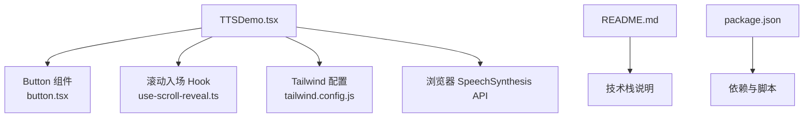
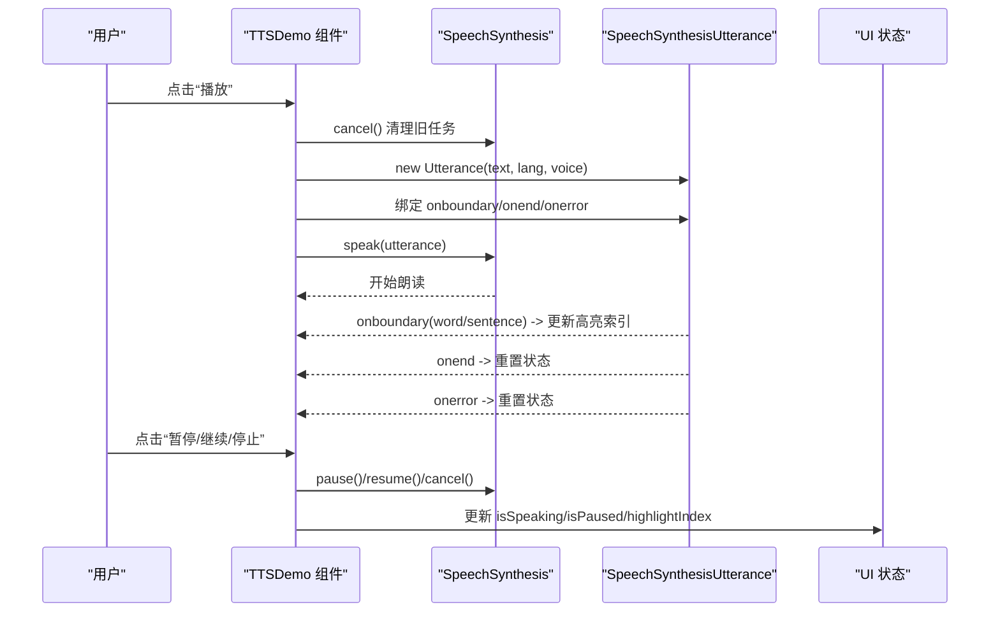
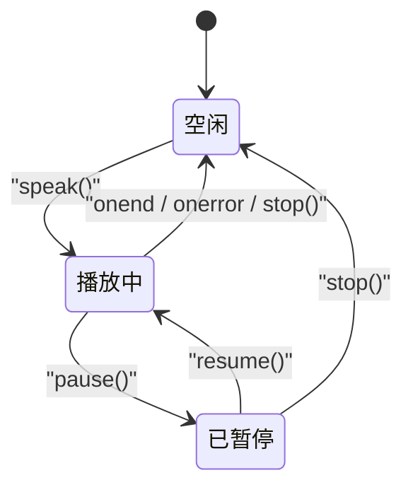
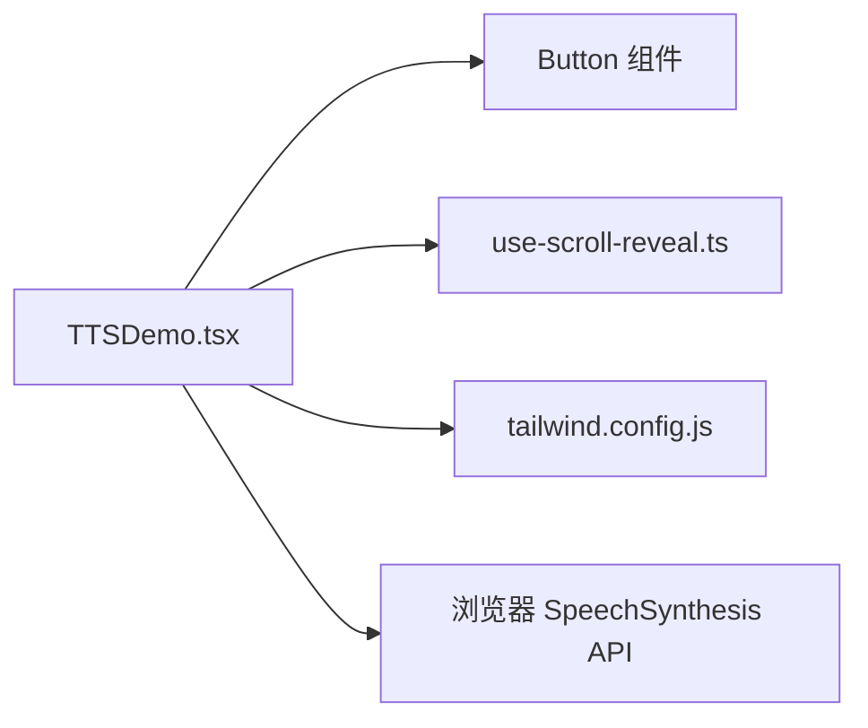

# TTSDemo组件

<cite>
**本文引用的文件**   
- [TTSDemo.tsx](file://src/sections/TTSDemo.tsx)
- [button.tsx](file://src/components/ui/button.tsx)
- [use-scroll-reveal.ts](file://src/hooks/use-scroll-reveal.ts)
- [tailwind.config.js](file://tailwind.config.js)
- [README.md](file://README.md)
- [package.json](file://package.json)
</cite>

## 目录
1. [简介](#简介)
2. [项目结构](#项目结构)
3. [核心组件](#核心组件)
4. [架构总览](#架构总览)
5. [详细组件分析](#详细组件分析)
6. [依赖关系分析](#依赖关系分析)
7. [性能考量](#性能考量)
8. [故障排查指南](#故障排查指南)
9. [结论](#结论)
10. [附录](#附录)

## 简介
本文件为 TTSDemo 组件的完整技术文档，聚焦于以下方面：
- SpeechSynthesis API 集成与状态管理
- 多语言支持与声音选择机制
- 实时文本高亮同步（按词/句）
- 播放控制（播放、暂停、停止）、进度与错误处理
- 音频波形动画的实现原理与交互事件
- 兼容性策略与调试方法
- 使用示例、自定义配置项与常见问题解决方案

该组件基于 React + TypeScript 实现，结合 Tailwind CSS 与 shadcn/ui 按钮组件，提供在线语音合成演示体验。

## 项目结构
TTSDemo 位于 sections 目录下，作为独立区块组件被页面引入；其样式与动效由 Tailwind 扩展定义；UI 控件来自 shadcn/ui 的 Button 组件；滚动入场效果通过自定义 Hook 实现。

图表来源
- [TTSDemo.tsx:1-344](file://src/sections/TTSDemo.tsx#L1-L344)
- [button.tsx:1-63](file://src/components/ui/button.tsx#L1-L63)
- [use-scroll-reveal.ts:1-34](file://src/hooks/use-scroll-reveal.ts#L1-L34)
- [tailwind.config.js:1-92](file://tailwind.config.js#L1-L92)
- [README.md:1-73](file://README.md#L1-L73)
- [package.json:1-80](file://package.json#L1-L80)

章节来源
- [README.md:20-28](file://README.md#L20-L28)
- [package.json:1-80](file://package.json#L1-L80)

## 核心组件
TTSDemo 是一个单文件 React 函数组件，负责：
- 加载并过滤可用语音（按语言前缀匹配）
- 自动选择“高质量”语音（基于名称关键词启发式）
- 创建 SpeechSynthesisUtterance 并绑定 onboundary/onend/onerror
- 维护 isSpeaking/isPaused/highlightIndex 等状态
- 渲染语言标签、语音下拉、文本输入框、高亮预览区、波形动画与控制按钮

关键特性
- 多语言预设：中文、英文、日文、韩文、法文
- 实时高亮：根据 utterance.onboundary 的 word/sentence 事件更新高亮位置
- 波形动画：通过 key 变化触发重渲染，配合 Tailwind animate-wave 实现条状跳动
- 兼容处理：检测 window.speechSynthesis 可用性，不支持时展示降级提示

章节来源
- [TTSDemo.tsx:8-34](file://src/sections/TTSDemo.tsx#L8-L34)
- [TTSDemo.tsx:38-40](file://src/sections/TTSDemo.tsx#L38-L40)
- [TTSDemo.tsx:56-98](file://src/sections/TTSDemo.tsx#L56-L98)
- [TTSDemo.tsx:100-137](file://src/sections/TTSDemo.tsx#L100-L137)
- [TTSDemo.tsx:139-157](file://src/sections/TTSDemo.tsx#L139-L157)
- [TTSDemo.tsx:167-180](file://src/sections/TTSDemo.tsx#L167-L180)
- [TTSDemo.tsx:182-190](file://src/sections/TTSDemo.tsx#L182-L190)

## 架构总览
从数据流与调用链角度，TTSDemo 的核心流程如下：

图表来源
- [TTSDemo.tsx:100-137](file://src/sections/TTSDemo.tsx#L100-L137)
- [TTSDemo.tsx:139-157](file://src/sections/TTSDemo.tsx#L139-L157)

## 详细组件分析

### 语音加载与过滤
- 在首次挂载时读取 window.speechSynthesis.getVoices()，并监听 onvoiceschanged 以获取异步加载的语音列表
- 根据当前 selectedLang 的前缀进行过滤，确保仅显示匹配语言的语音
- 若存在多个候选，优先选择名称中包含“高质量”关键词的语音（如 neural、natural、premium 等），否则回退到第一个

优化点
- 避免重复过滤：将过滤逻辑放入 useEffect，依赖 selectedLang 与 voices
- 自动选中最佳语音：减少用户操作成本，提升体验

章节来源
- [TTSDemo.tsx:56-67](file://src/sections/TTSDemo.tsx#L56-L67)
- [TTSDemo.tsx:69-84](file://src/sections/TTSDemo.tsx#L69-L84)
- [TTSDemo.tsx:38-40](file://src/sections/TTSDemo.tsx#L38-L40)

### 播放控制与状态机
- 播放：创建 Utterance，设置语言与语速，绑定边界回调，调用 speak()，置 isSpeaking=true，isPaused=false，并递增 waveKey 触发波形动画
- 暂停/继续：调用 pause()/resume()，切换 isPaused
- 停止：调用 cancel()，重置所有状态
- 文本变更：若正在朗读则自动停止，防止状态不一致

状态图

图表来源
- [TTSDemo.tsx:100-137](file://src/sections/TTSDemo.tsx#L100-L137)
- [TTSDemo.tsx:139-157](file://src/sections/TTSDemo.tsx#L139-L157)

章节来源
- [TTSDemo.tsx:100-137](file://src/sections/TTSDemo.tsx#L100-L137)
- [TTSDemo.tsx:139-157](file://src/sections/TTSDemo.tsx#L139-L157)

### 实时文本高亮同步
- 利用 utterance.onboundary 事件，当 event.name 为 word 或 sentence 时，使用 event.charIndex 更新 highlightIndex
- 渲染时将文本分为 before/after 两段，分别应用不同透明度与加粗样式，形成“逐字/逐词”跟随效果

注意
- charIndex 是字符级索引，非 DOM 节点索引，因此直接对字符串切片即可实现高亮
- 对于包含换行或复杂富文本的场景，建议保持纯文本输入以避免错位

章节来源
- [TTSDemo.tsx:113-118](file://src/sections/TTSDemo.tsx#L113-L118)
- [TTSDemo.tsx:167-180](file://src/sections/TTSDemo.tsx#L167-L180)

### 音频波形动画
- 使用固定数量的竖条（32 根）模拟频谱
- 当 isSpeaking && !isPaused 时，添加 animate-wave 类，使各条高度在 4px 与 28px 之间交替
- 通过 animationDelay 与 animationDuration 错开每根条的动画节奏，营造随机感
- 通过 key={waveKey} 在每次播放开始时强制重建子树，保证动画从初始状态开始

Tailwind 配置
- 自定义 keyframes “wave”，并在 animation 中注册 animate-wave

章节来源
- [TTSDemo.tsx:312-330](file://src/sections/TTSDemo.tsx#L312-L330)
- [tailwind.config.js:78-88](file://tailwind.config.js#L78-L88)

### 用户交互与可访问性
- 按钮具备 aria-label，便于屏幕阅读器识别
- 语言标签与语音下拉支持键盘操作
- 文本输入框在编辑时若处于朗读状态会自动停止，避免冲突

章节来源
- [TTSDemo.tsx:276-310](file://src/sections/TTSDemo.tsx#L276-L310)

### 兼容性处理
- 启动时检测 window.speechSynthesis 是否存在，不存在则渲染降级提示
- 卸载时调用 cancel() 清理资源，避免后台持续朗读
- 语音列表异步加载，需监听 onvoiceschanged 以确保拿到完整列表

章节来源
- [TTSDemo.tsx:86-91](file://src/sections/TTSDemo.tsx#L86-L91)
- [TTSDemo.tsx:93-98](file://src/sections/TTSDemo.tsx#L93-L98)
- [TTSDemo.tsx:56-67](file://src/sections/TTSDemo.tsx#L56-L67)

## 依赖关系分析
- 外部依赖
  - React 19、TypeScript、Vite 构建
  - Tailwind CSS 3 与 tailwindcss-animate 插件
  - shadcn/ui 的 Button 组件（基于 Radix UI 与 class-variance-authority）
  - Lucide React 图标库
- 内部依赖
  - useScrollReveal Hook：用于标题区域滚动入场动画
  - Button 组件：统一样式与变体
  - Tailwind 配置：扩展 wave 动画

图表来源
- [TTSDemo.tsx:1-5](file://src/sections/TTSDemo.tsx#L1-L5)
- [button.tsx:1-63](file://src/components/ui/button.tsx#L1-L63)
- [use-scroll-reveal.ts:1-34](file://src/hooks/use-scroll-reveal.ts#L1-L34)
- [tailwind.config.js:1-92](file://tailwind.config.js#L1-L92)

章节来源
- [README.md:20-28](file://README.md#L20-L28)
- [package.json:1-80](file://package.json#L1-L80)

## 性能考量
- 避免不必要的重渲染
  - 使用 useCallback 包裹 speak/togglePause/stop，减少回调重建
  - 仅在需要时递增 waveKey，避免频繁重建波形
- 语音列表过滤
  - 将过滤逻辑放入 useEffect，依赖 selectedLang 与 voices，避免每次渲染都重新计算
- 文本高亮
  - 基于字符串切片的 O(n) 操作，适合短文本；长文本场景可考虑分片或虚拟滚动
- 动画性能
  - 使用 CSS 动画而非 JS 驱动，降低主线程压力
  - 限制波形条数量（32 根），平衡视觉效果与性能

[本节为通用指导，不直接分析具体文件]

## 故障排查指南
- 无声音或无法朗读
  - 检查浏览器是否支持 speechSynthesis
  - 确认 onvoiceschanged 是否触发且 filteredVoices 非空
  - 尝试切换其他语音或语言
- 高亮不同步
  - 确认 onboundary 事件是否触发（部分浏览器可能只触发 sentence）
  - 检查文本是否包含不可见字符导致 charIndex 偏移
- 动画不生效
  - 确认 animate-wave 类是否正确注入
  - 检查 waveKey 是否在播放开始时递增
- 移动端静音或权限问题
  - iOS Safari 可能需要用户手势触发首次播放
  - 某些设备默认静音，请检查系统音量与静音开关

章节来源
- [TTSDemo.tsx:86-91](file://src/sections/TTSDemo.tsx#L86-L91)
- [TTSDemo.tsx:113-118](file://src/sections/TTSDemo.tsx#L113-L118)
- [TTSDemo.tsx:312-330](file://src/sections/TTSDemo.tsx#L312-L330)

## 结论
TTSDemo 组件以简洁的 React 模式实现了完整的 TTS 演示能力：多语言支持、高质量语音自动选择、实时高亮、波形动画与完善的错误处理。借助 Tailwind 与 shadcn/ui，组件具备良好的可维护性与可扩展性。建议在后续迭代中增加语速、音高、音量等高级参数，以及更细粒度的高粒度高亮（按词）与无障碍增强。

[本节为总结，不直接分析具体文件]

## 附录

### API 使用示例
- 基本用法
  - 导入并渲染 TTSDemo 组件即可启用在线语音合成演示
- 自定义语言与文本
  - 通过修改 PRESETS 数组中的语言代码与对应文本，快速扩展新语言示例
- 自定义高质量语音关键词
  - 调整 VOICE_QUALITY_HINTS 以适配更多平台的高质量语音名称

章节来源
- [TTSDemo.tsx:8-34](file://src/sections/TTSDemo.tsx#L8-L34)
- [TTSDemo.tsx:38-40](file://src/sections/TTSDemo.tsx#L38-L40)

### 自定义配置选项
- 语言预设
  - 新增语言：在 PRESETS 中添加 { lang, label, text }
- 高质量语音筛选
  - 在 VOICE_QUALITY_HINTS 中追加目标平台的优质语音名称片段
- 波形动画
  - 调整 tailwind.config.js 中的 wave keyframes 与 animation 时长
  - 在组件内调整波形条数量与动画延迟/时长分布

章节来源
- [TTSDemo.tsx:312-330](file://src/sections/TTSDemo.tsx#L312-L330)
- [tailwind.config.js:78-88](file://tailwind.config.js#L78-L88)

### 常见浏览器兼容性问题与解决方案
- 语音列表为空
  - 原因：语音异步加载
  - 解决：监听 onvoiceschanged，并在回调中刷新 voices 与 filteredVoices
- 高亮不触发
  - 原因：部分浏览器仅支持 sentence 级别边界
  - 解决：同时监听 word 与 sentence，并以最大 charIndex 为准
- 移动端首次播放失败
  - 原因：需要用户手势触发
  - 解决：确保在用户点击事件中调用 speak()
- 动画卡顿
  - 原因：过多 DOM 节点或复杂动画
  - 解决：减少波形条数量，使用 CSS 动画，避免在高频回调中创建对象

章节来源
- [TTSDemo.tsx:56-67](file://src/sections/TTSDemo.tsx#L56-L67)
- [TTSDemo.tsx:113-118](file://src/sections/TTSDemo.tsx#L113-L118)
- [TTSDemo.tsx:312-330](file://src/sections/TTSDemo.tsx#L312-L330)