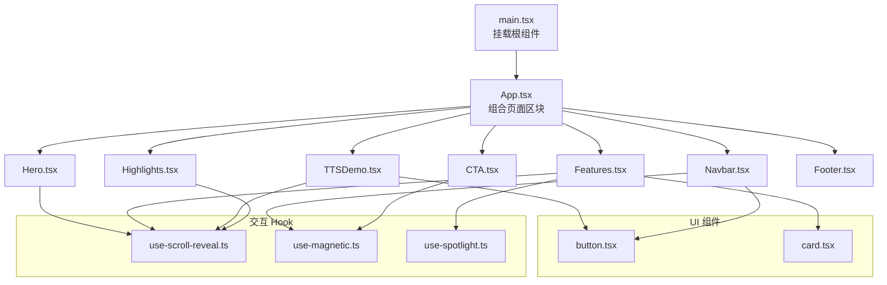
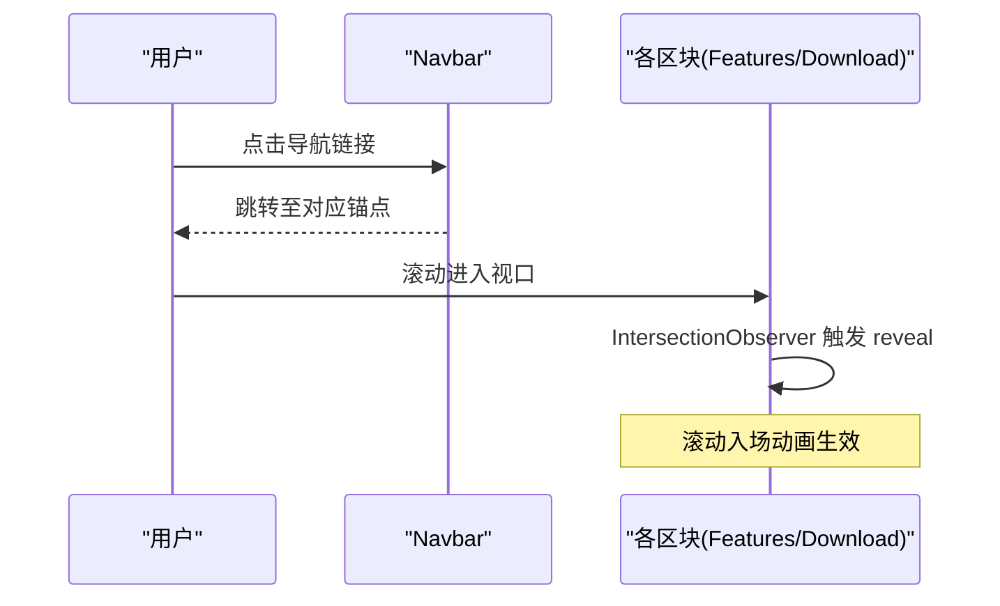
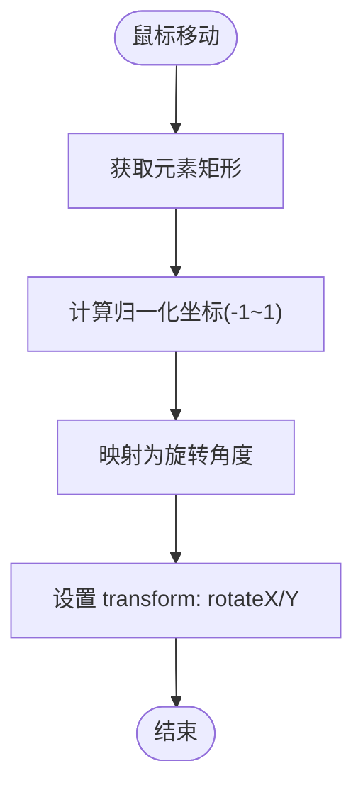
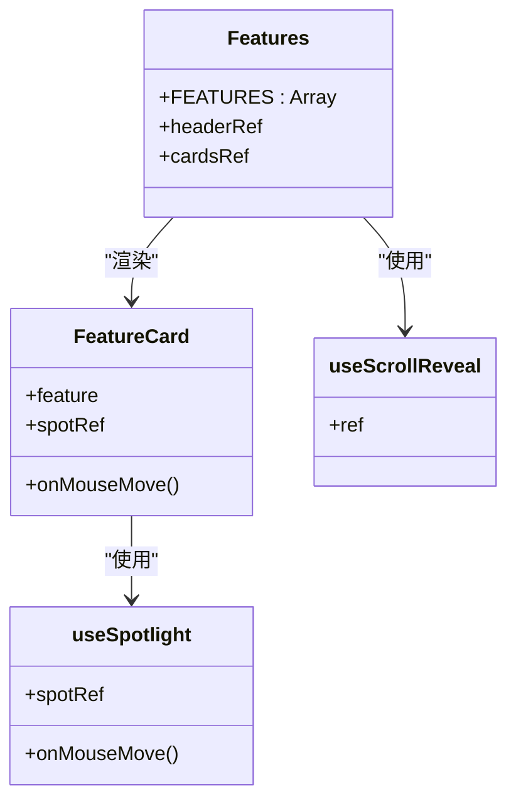
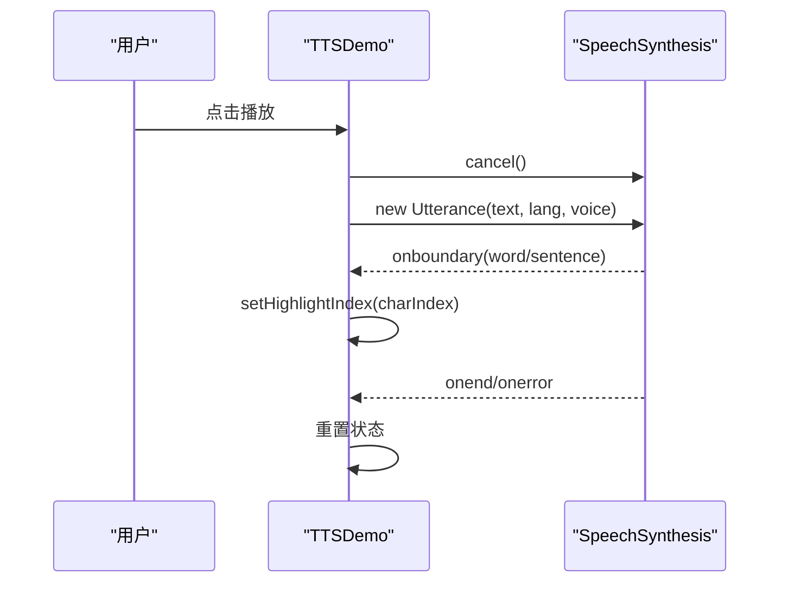
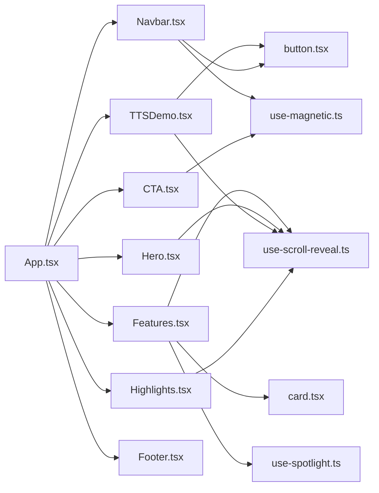

# 页面组件

<cite>
**本文引用的文件**
- [App.tsx](file://src/App.tsx)
- [main.tsx](file://src/main.tsx)
- [package.json](file://package.json)
- [README.md](file://README.md)
- [Hero.tsx](file://src/sections/Hero.tsx)
- [Features.tsx](file://src/sections/Features.tsx)
- [TTSDemo.tsx](file://src/sections/TTSDemo.tsx)
- [Highlights.tsx](file://src/sections/Highlights.tsx)
- [CTA.tsx](file://src/sections/CTA.tsx)
- [Navbar.tsx](file://src/sections/Navbar.tsx)
- [Footer.tsx](file://src/sections/Footer.tsx)
- [use-scroll-reveal.ts](file://src/hooks/use-scroll-reveal.ts)
- [use-magnetic.ts](file://src/hooks/use-magnetic.ts)
- [use-spotlight.ts](file://src/hooks/use-spotlight.ts)
- [button.tsx](file://src/components/ui/button.tsx)
- [card.tsx](file://src/components/ui/card.tsx)
</cite>

## 目录
1. [简介](#简介)
2. [项目结构](#项目结构)
3. [核心组件](#核心组件)
4. [架构总览](#架构总览)
5. [详细组件分析](#详细组件分析)
6. [依赖关系分析](#依赖关系分析)
7. [性能考量](#性能考量)
8. [故障排查指南](#故障排查指南)
9. [结论](#结论)
10. [附录](#附录)

## 简介
本文件为“挠荔枝官网”的页面区块组件文档，覆盖 Hero、Features、TTSDemo、Highlights、CTA、Navbar、Footer 等关键区域。文档从职责边界、Props 接口、状态管理、事件处理、组件通信与数据流向、交互特性（3D 倾斜、滚动动画、响应式布局）等方面展开，并提供使用示例与自定义配置方法、性能优化策略与错误处理最佳实践。

## 项目结构
- 应用入口：main.tsx 挂载根组件 App；App.tsx 组合各页面区块。
- 页面区块：位于 src/sections，按功能划分独立组件。
- 通用 UI：src/components/ui 提供 Button、Card 等基础组件。
- 交互 Hook：src/hooks 提供滚动揭示、磁性按钮、聚光灯等可复用能力。
- 静态资源与构建：public 存放静态资源；package.json 定义脚本与依赖。

图示来源
- [main.tsx:1-11](file://src/main.tsx#L1-L11)
- [App.tsx:1-30](file://src/App.tsx#L1-L30)
- [Navbar.tsx:1-117](file://src/sections/Navbar.tsx#L1-L117)
- [Hero.tsx:1-141](file://src/sections/Hero.tsx#L1-L141)
- [Features.tsx:1-127](file://src/sections/Features.tsx#L1-L127)
- [TTSDemo.tsx:1-344](file://src/sections/TTSDemo.tsx#L1-L344)
- [Highlights.tsx:1-168](file://src/sections/Highlights.tsx#L1-L168)
- [CTA.tsx:1-65](file://src/sections/CTA.tsx#L1-L65)
- [Footer.tsx:1-62](file://src/sections/Footer.tsx#L1-L62)
- [button.tsx:1-63](file://src/components/ui/button.tsx#L1-L63)
- [card.tsx:1-93](file://src/components/ui/card.tsx#L1-L93)
- [use-scroll-reveal.ts:1-34](file://src/hooks/use-scroll-reveal.ts#L1-L34)
- [use-magnetic.ts:1-32](file://src/hooks/use-magnetic.ts#L1-L32)
- [use-spotlight.ts:1-21](file://src/hooks/use-spotlight.ts#L1-L21)

章节来源
- [main.tsx:1-11](file://src/main.tsx#L1-L11)
- [App.tsx:1-30](file://src/App.tsx#L1-L30)
- [README.md:45-56](file://README.md#L45-L56)

## 核心组件
本节概述各页面区块的职责边界与对外暴露的接口约定。

- Navbar（导航栏）
  - 职责：固定顶部导航、移动端菜单切换、滚动时背景变化、下载按钮磁吸效果。
  - Props：无外部 props；内部通过锚点链接控制页面滚动。
  - 状态：滚动位置、移动端菜单展开状态。
  - 事件：滚动监听、点击切换菜单、磁吸鼠标事件。
  - 依赖：Button、useMagnetic。

- Hero（英雄区域）
  - 职责：首屏主视觉、产品标语、下载引导、设备样机展示。
  - Props：无外部 props。
  - 状态：3D 倾斜角度。
  - 事件：mousemove/mouseleave 驱动倾斜。
  - 交互：CSS perspective + rotateX/Y 实现 3D 倾斜。

- Features（特性展示）
  - 职责：以卡片形式展示三大特性，配合滚动入场与聚光灯效果。
  - Props：无外部 props；内部数据源 FEATURES 常量。
  - 状态：滚动触发类名、鼠标跟随光晕坐标。
  - 事件：IntersectionObserver 触发 reveal、mousemove 更新 CSS 变量。
  - 依赖：useScrollReveal、useSpotlight、CardContent。

- TTSDemo（语音演示）
  - 职责：在线体验 Web Speech API，支持多语言预设、声音选择、播放/暂停/停止、文本高亮、波形动画。
  - Props：无外部 props。
  - 状态：文本、语言、播放状态、暂停状态、高亮索引、浏览器支持、声音列表、选中声音 URI、波形 key。
  - 事件：voiceschanged、boundary、end、error、用户交互。
  - 依赖：Button、useScrollReveal。

- Highlights（亮点展示）
  - 职责：图文混排展示产品亮点，支持左右交替布局与滚动入场。
  - Props：无外部 props；内部数据源 HIGHLIGHTS 常量。
  - 状态：滚动触发类名。
  - 事件：IntersectionObserver 触发 reveal。
  - 依赖：useScrollReveal。

- CTA（行动号召）
  - 职责：下载引导区，包含磁吸下载按钮与辅助文案。
  - Props：无外部 props。
  - 状态：滚动触发类名、磁吸偏移。
  - 事件：mousemove/mouseleave 驱动磁吸。
  - 依赖：useScrollReveal、useMagnetic。

- Footer（页脚）
  - 职责：品牌信息、导航链接、法律链接、版权信息。
  - Props：无外部 props。
  - 状态：无。
  - 事件：无。

章节来源
- [Navbar.tsx:1-117](file://src/sections/Navbar.tsx#L1-L117)
- [Hero.tsx:1-141](file://src/sections/Hero.tsx#L1-L141)
- [Features.tsx:1-127](file://src/sections/Features.tsx#L1-L127)
- [TTSDemo.tsx:1-344](file://src/sections/TTSDemo.tsx#L1-L344)
- [Highlights.tsx:1-168](file://src/sections/Highlights.tsx#L1-L168)
- [CTA.tsx:1-65](file://src/sections/CTA.tsx#L1-L65)
- [Footer.tsx:1-62](file://src/sections/Footer.tsx#L1-L62)
- [button.tsx:1-63](file://src/components/ui/button.tsx#L1-L63)
- [card.tsx:1-93](file://src/components/ui/card.tsx#L1-L93)
- [use-scroll-reveal.ts:1-34](file://src/hooks/use-scroll-reveal.ts#L1-L34)
- [use-magnetic.ts:1-32](file://src/hooks/use-magnetic.ts#L1-L32)
- [use-spotlight.ts:1-21](file://src/hooks/use-spotlight.ts#L1-L21)

## 架构总览
整体采用“单页区块组合”的架构：App 作为编排者，将各区块顺序渲染；区块之间通过锚点链接进行页面内导航；交互能力下沉到 hooks，UI 能力下沉到基础组件。

图示来源
- [Navbar.tsx:6-10](file://src/sections/Navbar.tsx#L6-L10)
- [use-scroll-reveal.ts:12-30](file://src/hooks/use-scroll-reveal.ts#L12-L30)

## 详细组件分析

### Hero（英雄区域）
- 职责边界：首屏信息传达与下载引导，设备样机展示增强代入感。
- 状态与事件
  - 倾斜状态：记录鼠标相对中心归一化坐标，映射为旋转角度。
  - 事件：onMouseMove/onMouseLeave 计算并设置 transform。
- 交互原理
  - 3D 倾斜：父容器设置 perspective，子元素根据鼠标位置计算 rotateX/rotateY。
  - 最大倾斜角限制在合理范围，避免过度变形。
- 响应式布局
  - 使用网格与断点适配不同屏幕尺寸。
- 使用示例
  - 直接引入并在 App 中渲染，无需额外 props。
- 自定义配置
  - 可通过调整最大倾斜角度、过渡时长、样式类名定制视觉效果。

图示来源
- [Hero.tsx:7-20](file://src/sections/Hero.tsx#L7-L20)
- [Hero.tsx:72-77](file://src/sections/Hero.tsx#L72-L77)

章节来源
- [Hero.tsx:1-141](file://src/sections/Hero.tsx#L1-L141)

### Features（特性展示）
- 职责边界：以卡片矩阵呈现核心特性，强调滚动入场与悬停光晕。
- 数据结构
  - FEATURES 数组描述每个特性的标题、描述、图标与颜色类。
- 状态与事件
  - 滚动入场：useScrollReveal 返回 ref，进入视口后添加 revealed 类。
  - 聚光灯：useSpotlight 在 mousemove 时更新 --x/--y 变量，配合 CSS 径向渐变实现光晕。
- 组件关系
  - FeatureCard 内部封装聚光灯逻辑，Features 负责数据渲染与布局。
- 使用示例
  - 直接引入并在 App 中渲染。
- 自定义配置
  - 扩展 FEATURES 数据即可新增特性卡片；修改 getBgColor 映射规则以支持新配色。

图示来源
- [Features.tsx:5-97](file://src/sections/Features.tsx#L5-L97)
- [use-spotlight.ts:8-20](file://src/hooks/use-spotlight.ts#L8-L20)
- [use-scroll-reveal.ts:7-33](file://src/hooks/use-scroll-reveal.ts#L7-L33)

章节来源
- [Features.tsx:1-127](file://src/sections/Features.tsx#L1-L127)
- [card.tsx:64-72](file://src/components/ui/card.tsx#L64-L72)

### TTSDemo（语音演示）
- 职责边界：在线演示 Web Speech API，提供多语言预设、声音选择、播放控制与实时高亮。
- 状态与事件
  - 加载声音：监听 voiceschanged，维护 voices/filteredVoices/selectedVoiceURI。
  - 自动优选：根据关键词匹配高质量声音。
  - 播放流程：speak/togglePause/stop 控制合成器；onboundary 更新高亮索引；onend/onerror 清理状态。
  - 文本编辑：onChange 清空当前朗读状态。
- 数据流
  - 预设文本 -> 输入框 -> 合成器 -> onboundary -> 高亮索引 -> 渲染高亮文本。
- 兼容性处理
  - 检测 speechSynthesis 可用性，不可用时给出降级提示。
- 使用示例
  - 直接引入并在 App 中渲染。
- 自定义配置
  - 扩展 PRESETS 增加更多语言与示例文本；调整 VOICE_QUALITY_HINTS 优化声音选择策略。

图示来源
- [TTSDemo.tsx:57-98](file://src/sections/TTSDemo.tsx#L57-L98)
- [TTSDemo.tsx:101-137](file://src/sections/TTSDemo.tsx#L101-L137)
- [TTSDemo.tsx:168-180](file://src/sections/TTSDemo.tsx#L168-L180)

章节来源
- [TTSDemo.tsx:1-344](file://src/sections/TTSDemo.tsx#L1-L344)
- [button.tsx:39-60](file://src/components/ui/button.tsx#L39-L60)

### Highlights（亮点展示）
- 职责边界：图文混排展示产品亮点，支持左右交替布局与滚动入场。
- 数据结构
  - HIGHLIGHTS 数组描述每个亮点的图标、标题、描述与图片内容。
- 状态与事件
  - 滚动入场：useScrollReveal 控制 reveal 类。
- 使用示例
  - 直接引入并在 App 中渲染。
- 自定义配置
  - 扩展 HIGHLIGHTS 数据项；通过 reversed 字段控制图文左右顺序。

章节来源
- [Highlights.tsx:1-168](file://src/sections/Highlights.tsx#L1-L168)
- [use-scroll-reveal.ts:12-30](file://src/hooks/use-scroll-reveal.ts#L12-L30)

### CTA（行动号召）
- 职责边界：下载引导区，突出下载按钮与辅助说明。
- 状态与事件
  - 滚动入场：useScrollReveal。
  - 磁吸按钮：useMagnetic 在鼠标靠近时产生位移。
- 使用示例
  - 直接引入并在 App 中渲染。
- 自定义配置
  - 调整磁力强度参数；替换下载链接与文案。

章节来源
- [CTA.tsx:1-65](file://src/sections/CTA.tsx#L1-L65)
- [use-magnetic.ts:7-31](file://src/hooks/use-magnetic.ts#L7-L31)

### Navbar（导航栏）
- 职责边界：固定顶部导航、移动端菜单、滚动背景变化、下载按钮磁吸。
- 状态与事件
  - 滚动监听：window.scroll 更新 scrolled 状态。
  - 移动端菜单：mobileOpen 控制展开/收起。
  - 磁吸下载按钮：useMagnetic。
- 使用示例
  - 直接引入并在 App 中渲染。
- 自定义配置
  - 扩展 NAV_LINKS 增加导航项；调整磁吸强度。

章节来源
- [Navbar.tsx:1-117](file://src/sections/Navbar.tsx#L1-L117)
- [use-magnetic.ts:7-31](file://src/hooks/use-magnetic.ts#L7-L31)

### Footer（页脚）
- 职责边界：品牌信息、导航链接、法律链接、版权信息。
- 状态与事件：无。
- 使用示例：直接引入并在 App 中渲染。

章节来源
- [Footer.tsx:1-62](file://src/sections/Footer.tsx#L1-L62)

## 依赖关系分析
- 组件间耦合
  - App 作为编排者，低耦合地组合各区块。
  - 区块之间无直接依赖，仅通过锚点链接进行页面内导航。
- 外部依赖
  - React 19、Vite 7、Tailwind CSS 3、shadcn/ui（Button/Card）、Lucide React 图标。
- 钩子与基础组件
  - useScrollReveal、useMagnetic、useSpotlight 被多个区块复用。
  - Button/Card 提供一致的 UI 风格与变体。

图示来源
- [App.tsx:1-30](file://src/App.tsx#L1-L30)
- [Features.tsx:1-127](file://src/sections/Features.tsx#L1-L127)
- [TTSDemo.tsx:1-344](file://src/sections/TTSDemo.tsx#L1-L344)
- [Navbar.tsx:1-117](file://src/sections/Navbar.tsx#L1-L117)
- [CTA.tsx:1-65](file://src/sections/CTA.tsx#L1-L65)
- [Highlights.tsx:1-168](file://src/sections/Highlights.tsx#L1-L168)
- [Hero.tsx:1-141](file://src/sections/Hero.tsx#L1-L141)
- [card.tsx:1-93](file://src/components/ui/card.tsx#L1-L93)
- [button.tsx:1-63](file://src/components/ui/button.tsx#L1-L63)
- [use-magnetic.ts:1-32](file://src/hooks/use-magnetic.ts#L1-L32)
- [use-spotlight.ts:1-21](file://src/hooks/use-spotlight.ts#L1-L21)
- [use-scroll-reveal.ts:1-34](file://src/hooks/use-scroll-reveal.ts#L1-L34)

章节来源
- [package.json:1-80](file://package.json#L1-L80)

## 性能考量
- 减少重排与重绘
  - 使用 transform 与 opacity 做动画，避免频繁改变布局属性。
  - 3D 倾斜仅在必要元素上启用 perspective，降低 GPU 压力。
- 事件节流与去抖
  - 高频事件（mousemove、scroll）建议结合 requestAnimationFrame 或节流函数，避免过多状态更新。
- 条件渲染与懒加载
  - 对非首屏区块可使用 IntersectionObserver 延迟初始化复杂逻辑（如 TTS 初始化）。
- 声音列表缓存
  - 已实现 voiceschanged 监听与过滤缓存，避免重复计算。
- 样式与主题
  - 使用 Tailwind 原子类与 backdrop-blur 等现代特性，注意在低端设备上谨慎使用重度模糊。

[本节为通用指导，不直接分析具体文件]

## 故障排查指南
- Web Speech API 不可用
  - 现象：TTSDemo 显示不支持提示。
  - 排查：检查浏览器是否支持 speechSynthesis；确认未处于受限环境。
  - 参考路径：[TTSDemo.tsx:87-91](file://src/sections/TTSDemo.tsx#L87-L91)
- 声音列表为空
  - 现象：无法选择声音或默认声音未加载。
  - 排查：确保 voiceschanged 事件正确注册；部分浏览器需首次用户交互后才可用。
  - 参考路径：[TTSDemo.tsx:57-67](file://src/sections/TTSDemo.tsx#L57-L67)
- 高亮不生效
  - 现象：播放时无文本高亮。
  - 排查：确认 onboundary 回调触发且 event.name 为 word/sentence；检查 charIndex 是否正确更新。
  - 参考路径：[TTSDemo.tsx:114-118](file://src/sections/TTSDemo.tsx#L114-L118)
- 滚动动画未触发
  - 现象：区块进入视口无 reveal 效果。
  - 排查：确认 ref 绑定正确；检查 CSS 中 .revealed 相关样式是否存在。
  - 参考路径：[use-scroll-reveal.ts:12-30](file://src/hooks/use-scroll-reveal.ts#L12-L30)
- 磁吸效果异常
  - 现象：按钮未按预期偏移或回弹失败。
  - 排查：确认 magRef 绑定到可交互元素；检查 onMouseMove/onMouseLeave 是否成对调用。
  - 参考路径：[use-magnetic.ts:10-28](file://src/hooks/use-magnetic.ts#L10-L28)

章节来源
- [TTSDemo.tsx:87-91](file://src/sections/TTSDemo.tsx#L87-L91)
- [TTSDemo.tsx:57-67](file://src/sections/TTSDemo.tsx#L57-L67)
- [TTSDemo.tsx:114-118](file://src/sections/TTSDemo.tsx#L114-L118)
- [use-scroll-reveal.ts:12-30](file://src/hooks/use-scroll-reveal.ts#L12-L30)
- [use-magnetic.ts:10-28](file://src/hooks/use-magnetic.ts#L10-L28)

## 结论
本项目采用清晰的区块化架构与可复用的交互 Hook，实现了丰富的首屏体验与互动演示。通过合理的状态管理与事件处理，TTSDemo 提供了直观的语音朗读体验；Features 与 Highlights 借助滚动入场与聚光灯效果提升视觉层次；Navbar 与 CTA 则强化了导航与转化路径。建议在后续迭代中进一步优化高频事件的性能与跨浏览器兼容性。

[本节为总结性内容，不直接分析具体文件]

## 附录

### 组件使用示例与自定义配置
- 在 App 中引入并渲染各区块，无需额外 props。
- 自定义 Features 特性：扩展 FEATURES 数组，按需添加 iconClass 与图标。
- 自定义 TTSDemo 预设：扩展 PRESETS 数组，增加语言与示例文本；调整 VOICE_QUALITY_HINTS 优化声音选择。
- 自定义 Highlights 亮点：扩展 HIGHLIGHTS 数组，通过 reversed 控制图文顺序。
- 自定义 Navbar 导航：扩展 NAV_LINKS 数组，增加链接项。
- 自定义 CTA 磁吸强度：调整 useMagnetic 传入的 strength 参数。

章节来源
- [Features.tsx:5-60](file://src/sections/Features.tsx#L5-L60)
- [TTSDemo.tsx:8-34](file://src/sections/TTSDemo.tsx#L8-L34)
- [Highlights.tsx:4-119](file://src/sections/Highlights.tsx#L4-L119)
- [Navbar.tsx:6-9](file://src/sections/Navbar.tsx#L6-L9)
- [use-magnetic.ts:7-7](file://src/hooks/use-magnetic.ts#L7-L7)