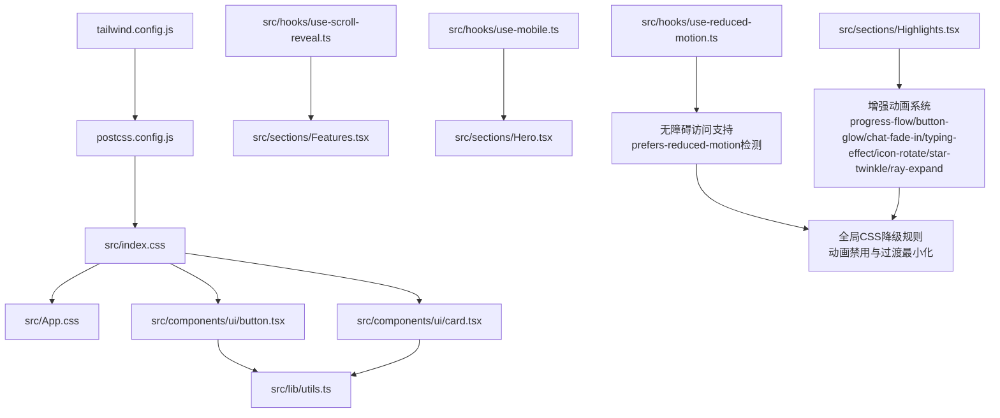
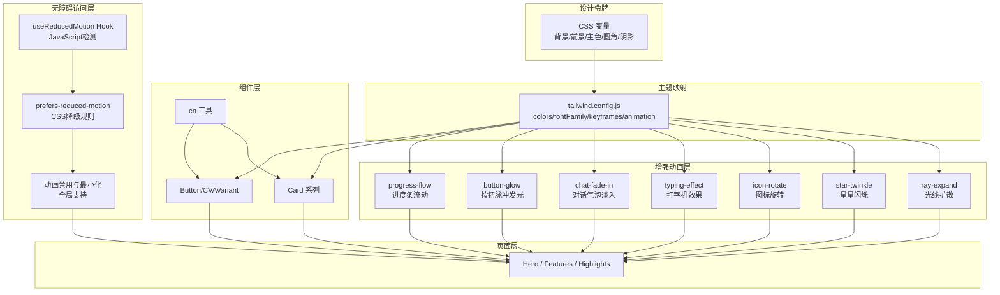
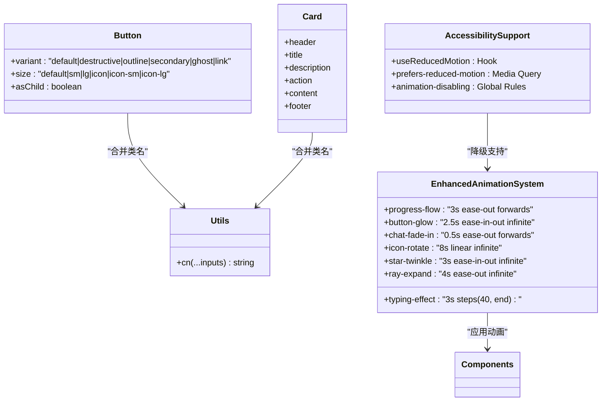
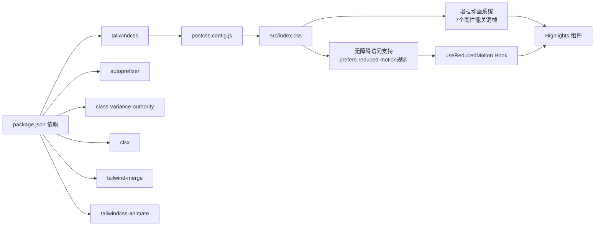

# 样式系统

<cite>
**本文引用的文件**
- [tailwind.config.js](file://tailwind.config.js)
- [postcss.config.js](file://postcss.config.js)
- [src/index.css](file://src/index.css)
- [src/App.css](file://src/App.css)
- [package.json](file://package.json)
- [components.json](file://components.json)
- [src/lib/utils.ts](file://src/lib/utils.ts)
- [src/components/ui/button.tsx](file://src/components/ui/button.tsx)
- [src/components/ui/card.tsx](file://src/components/ui/card.tsx)
- [src/hooks/use-mobile.ts](file://src/hooks/use-mobile.ts)
- [src/hooks/use-scroll-reveal.ts](file://src/hooks/use-scroll-reveal.ts)
- [src/hooks/use-reduced-motion.ts](file://src/hooks/use-reduced-motion.ts)
- [src/sections/Hero.tsx](file://src/sections/Hero.tsx)
- [src/sections/Features.tsx](file://src/sections/Features.tsx)
- [src/sections/Highlights.tsx](file://src/sections/Highlights.tsx)
</cite>

## 更新摘要
**变更内容**
- 新增全局无障碍访问CSS规则，包含prefers-reduced-motion媒体查询和动画降级支持
- 添加useReducedMotion Hook用于JavaScript层面的运动偏好检测
- 完善动画系统的无障碍访问支持，确保符合WCAG标准
- 更新故障排查指南，增加无障碍相关问题的解决方案

## 目录
1. [简介](#简介)
2. [项目结构](#项目结构)
3. [核心组件](#核心组件)
4. [架构总览](#架构总览)
5. [详细组件分析](#详细组件分析)
6. [依赖分析](#依赖分析)
7. [性能考虑](#性能考虑)
8. [故障排查指南](#故障排查指南)
9. [结论](#结论)
10. [附录](#附录)

## 简介
本文件系统化梳理挠荔枝官网的样式体系，围绕 Tailwind CSS 的配置与主题定制、颜色系统、字体规范、间距标准、断点设置、CSS 架构组织与命名约定、动画与过渡实现、响应式设计与移动端适配策略、样式性能优化与浏览器兼容性处理，以及样式调试工具与开发工作流建议展开。文档以仓库实际代码为依据，提供可追溯的来源定位与可视化图示，帮助开发者快速理解并高效扩展样式系统。**特别关注无障碍访问支持，确保所有用户都能获得良好的体验。**

## 项目结构
样式相关的关键文件与职责：
- 构建与配置
  - tailwind.config.js：Tailwind 主题扩展、深色模式、动画 keyframes 与 animation 映射、插件注册等
  - postcss.config.js：PostCSS 管线（Tailwind、Autoprefixer）
  - package.json：Tailwind、PostCSS、Autoprefixer、动画插件等依赖版本
  - components.json：Shadcn UI 风格与别名配置（影响生成组件的样式路径与变量使用方式）
- 全局样式入口
  - src/index.css：引入 Google Fonts、Tailwind 三层指令、CSS 变量主题（明/暗）、基础层与实用层自定义、**全局无障碍访问规则**
  - src/App.css：滚动行为、选中色、滚动条美化等全局体验增强
- 组件与工具
  - src/components/ui/*：基于 Tailwind 原子类与 class-variance-authority 的 UI 组件（按钮、卡片等）
  - src/lib/utils.ts：clsx + tailwind-merge 的工具函数 cn，用于合并类名
- 交互与动效钩子
  - src/hooks/use-scroll-reveal.ts：滚动入场观察器
  - src/hooks/use-mobile.ts：移动端断点判断 Hook
  - **src/hooks/use-reduced-motion.ts：运动偏好检测 Hook，用于无障碍访问支持**
- 页面示例
  - src/sections/Hero.tsx、src/sections/Features.tsx、src/sections/Highlights.tsx：大量使用 Tailwind 原子类与自定义样式组合



**图表来源**
- [tailwind.config.js:1-92](file://tailwind.config.js#L1-L92)
- [postcss.config.js:1-7](file://postcss.config.js#L1-L7)
- [src/index.css:1-286](file://src/index.css#L1-L286)
- [src/App.css:1-29](file://src/App.css#L1-L29)
- [src/components/ui/button.tsx:1-63](file://src/components/ui/button.tsx#L1-L63)
- [src/components/ui/card.tsx:1-93](file://src/components/ui/card.tsx#L1-L93)
- [src/lib/utils.ts:1-7](file://src/lib/utils.ts#L1-L7)
- [src/hooks/use-scroll-reveal.ts:1-34](file://src/hooks/use-scroll-reveal.ts#L1-L34)
- [src/hooks/use-mobile.ts:1-20](file://src/hooks/use-mobile.ts#L1-L20)
- [src/hooks/use-reduced-motion.ts:1-19](file://src/hooks/use-reduced-motion.ts#L1-L19)
- [src/sections/Hero.tsx:1-303](file://src/sections/Hero.tsx#L1-L303)
- [src/sections/Features.tsx:1-169](file://src/sections/Features.tsx#L1-L169)
- [src/sections/Highlights.tsx:1-494](file://src/sections/Highlights.tsx#L1-L494)

章节来源
- [tailwind.config.js:1-92](file://tailwind.config.js#L1-L92)
- [postcss.config.js:1-7](file://postcss.config.js#L1-L7)
- [src/index.css:1-286](file://src/index.css#L1-L286)
- [src/App.css:1-29](file://src/App.css#L1-L29)
- [package.json:59-78](file://package.json#L59-L78)
- [components.json:1-23](file://components.json#L1-L23)

## 核心组件
- 主题与变量
  - 通过 CSS 变量在 :root 与 .dark 下定义背景、前景、主色、辅助色、边框、输入、环、圆角、阴影等，形成统一的设计令牌
  - Tailwind 的 colors 扩展将语义化 token 映射到这些 CSS 变量，支持透明通道写法
- 字体系统
  - 通过 @import 引入 Inter 与 Noto Sans SC，并在 fontFamily.sans 中声明为默认无衬线族
- 动画与过渡
  - 在 theme.extend.keyframes 中定义 accordion-down/up、caret-blink、wave 等关键帧，并通过 animation 暴露为可用类名
  - 在 index.css 的 utilities 层定义 reveal、reveal-stagger、spotlight-card/glow 等实用类，配合 useScrollReveal 实现滚动入场与聚光灯光晕
  - **增强动画系统**：包含7个新增高性能动画：progress-flow（进度条流动）、button-glow（按钮脉冲发光）、chat-fade-in（对话气泡淡入）、typing-effect（打字机效果）、icon-rotate（图标旋转）、star-twinkle（星星闪烁）、ray-expand（光线扩散）
  - **无障碍访问支持**：全局 prefers-reduced-motion 媒体查询，自动禁用或最小化动画效果
- 组件样式
  - Button 使用 class-variance-authority 管理 variant 与 size 变体，结合 cn 工具合并类名；Card 系列组件采用一致的 data-slot 标记与布局原子类
- 工具函数
  - cn 封装 clsx + tailwind-merge，确保条件类名与覆盖优先级正确
- **无障碍访问 Hook**
  - useReducedMotion Hook 提供 JavaScript 层面的运动偏好检测，支持动态切换动画行为

章节来源
- [src/index.css:7-286](file://src/index.css#L7-L286)
- [tailwind.config.js:5-91](file://tailwind.config.js#L5-L91)
- [src/components/ui/button.tsx:1-63](file://src/components/ui/button.tsx#L1-L63)
- [src/components/ui/card.tsx:1-93](file://src/components/ui/card.tsx#L1-L93)
- [src/lib/utils.ts:1-7](file://src/lib/utils.ts#L1-L7)
- [src/hooks/use-scroll-reveal.ts:1-34](file://src/hooks/use-scroll-reveal.ts#L1-L34)
- [src/hooks/use-reduced-motion.ts:1-19](file://src/hooks/use-reduced-motion.ts#L1-L19)

## 架构总览
样式系统遵循"设计令牌 → Tailwind 主题 → 组件原子类 → 页面组合"的分层架构：
- 设计令牌：CSS 变量集中管理颜色、圆角、阴影等
- 主题映射：tailwind.config.js 将语义 token 映射到 CSS 变量，并提供字体、动画、阴影等扩展
- 组件层：UI 组件以原子类组合为主，辅以少量自定义类（如 spotlight）
- 页面层：页面组件通过 Tailwind 响应式前缀与布局类组合出多端表现
- **增强动画层**：新增的7个高性能动画通过 transform 和 opacity 优化，避免重排重绘
- **无障碍访问层**：全局 prefers-reduced-motion 规则和 useReducedMotion Hook 提供完整的无障碍支持



**图表来源**
- [src/index.css:7-286](file://src/index.css#L7-L286)
- [tailwind.config.js:5-91](file://tailwind.config.js#L5-L91)
- [src/components/ui/button.tsx:1-63](file://src/components/ui/button.tsx#L1-L63)
- [src/components/ui/card.tsx:1-93](file://src/components/ui/card.tsx#L1-L93)
- [src/lib/utils.ts:1-7](file://src/lib/utils.ts#L1-L7)
- [src/hooks/use-reduced-motion.ts:1-19](file://src/hooks/use-reduced-motion.ts#L1-L19)
- [src/sections/Hero.tsx:1-303](file://src/sections/Hero.tsx#L1-L303)
- [src/sections/Features.tsx:1-169](file://src/sections/Features.tsx#L1-L169)
- [src/sections/Highlights.tsx:1-494](file://src/sections/Highlights.tsx#L1-L494)

## 详细组件分析

### 颜色系统与主题定制
- 变量定义
  - 在 base 层 :root 与 .dark 下分别定义 --background、--foreground、--primary、--ring、--radius 等变量，形成明暗两套主题
  - 品牌主色为荔枝红，对应 HSL 值在 :root 中设定，作为 primary 的基础色
- 主题映射
  - tailwind.config.js 的 colors 扩展将 border/input/ring/background/foreground/primary/secondary/accent/popover/card/sidebar 等语义 token 映射到 CSS 变量
  - 支持透明通道写法，便于 hover/focus 状态下的半透明效果
- 使用建议
  - 优先使用语义 token（如 bg-primary text-primary-foreground），避免硬编码颜色值
  - 需要透明度时直接使用 /<alpha-value> 或 Tailwind 的 opacity 修饰符

章节来源
- [src/index.css:7-68](file://src/index.css#L7-L68)
- [tailwind.config.js:10-54](file://tailwind.config.js#L10-L54)

### 字体规范
- 字体加载
  - 通过 @import 引入 Inter 与 Noto Sans SC，包含多种字重
- 字体族
  - fontFamily.sans 设置为 Inter、Noto Sans SC、system-ui、sans-serif 的降级链
- 使用建议
  - 文本层级统一使用 sans 族，必要时在组件内覆盖特定标题字体

章节来源
- [src/index.css:1](file://src/index.css#L1)
- [tailwind.config.js:7-9](file://tailwind.config.js#L7-L9)

### 间距与圆角
- 圆角
  - borderRadius 扩展基于 --radius 变量派生 lg/md/sm/xs/xl 等尺寸，保证视觉一致性
- 阴影
  - boxShadow 新增 xs 级别，配合 outline-ring 等焦点态提升可访问性
- 间距
  - 主要使用 Tailwind 内置 spacing scale（p/m/gap/h/w 等），保持节奏一致

章节来源
- [tailwind.config.js:55-64](file://tailwind.config.js#L55-L64)

### 断点与响应式
- 默认断点
  - 项目未显式重写断点，沿用 Tailwind 默认断点（sm/md/lg/xl/2xl）
- 移动端 Hook
  - useIsMobile 使用 768px 作为移动端阈值，适合与 JS 逻辑联动（如菜单折叠、布局切换）
- 最佳实践
  - 优先使用 Tailwind 响应式前缀（sm: md: lg: xl:）控制不同屏幕下的布局与排版
  - 仅在需要 JS 分支时使用 useIsMobile，避免过度依赖 JS 做样式决策

章节来源
- [src/hooks/use-mobile.ts:1-20](file://src/hooks/use-mobile.ts#L1-L20)
- [src/sections/Hero.tsx:28-31](file://src/sections/Hero.tsx#L28-L31)

### 动画与过渡

**更新** 新增了7个高性能CSS关键帧动画，全部使用transform和opacity优化性能，并添加了完整的无障碍访问支持

#### 内置动画
- keyframes 与 animation 定义了 accordion-down/up、caret-blink、wave 等，可直接通过 animate-* 使用

#### 滚动入场
- reveal/reveal-stagger 配合 useScrollReveal 实现进入视口时的淡入上移与交错延迟

#### 聚光灯光晕
- spotlight-card 与 spotlight-glow 通过 CSS 变量 --x/--y 跟踪鼠标位置，实现跟随光晕

#### 增强动画系统

**1. 进度条流动动画 (animate-progress-flow)**
- 用途：模拟播放器进度条的动态效果
- 性能优化：使用 width 属性变化，3秒缓出时间
- 应用场景：Highlights 组件中的播放器界面

**2. 按钮脉冲发光动画 (animate-button-glow)**
- 用途：按钮的脉冲发光效果
- 性能优化：使用 box-shadow 和 transform scale，2.5秒循环周期
- 应用场景：AI 总结按钮等强调性操作按钮

**3. 对话气泡淡入动画 (animate-chat-fade-in)**
- 用途：聊天消息的气泡淡入效果
- 性能优化：使用 transform 和 opacity，0.5秒缓出时间
- 应用场景：AI 伴读功能的对话界面

**4. 打字机效果 (typing-effect)**
- 用途：逐字显示文字的打字机效果
- 性能优化：使用 width 变化和 steps 缓动，3秒打字 + 光标闪烁
- 应用场景：用户提问和 AI 回复的文字显示

**5. 图标旋转动画 (animate-icon-rotate)**
- 用途：图标的持续旋转效果
- 性能优化：使用 transform rotate，8秒线性循环
- 应用场景：太阳和月亮图标，象征日夜交替

**6. 星星闪烁动画 (animate-star-twinkle)**
- 用途：星星的闪烁效果
- 性能优化：使用 opacity 和 transform scale，3秒缓动循环
- 应用场景：暗黑模式界面的装饰元素

**7. 光线扩散动画 (animate-ray-expand)**
- 用途：光线的扩散效果
- 性能优化：使用 transform scale 和 opacity，4秒缓出循环
- 应用场景：明亮模式界面的光线装饰

#### 无障碍访问支持

**全局 prefers-reduced-motion 媒体查询**
- 自动检测用户的运动偏好设置
- 当用户启用减少运动选项时，自动禁用或最小化所有动画效果
- 确保符合 WCAG 2.1 无障碍标准

**动画降级策略**
- 所有动画在减少运动模式下被完全禁用
- 过渡效果时间缩短至 0.01ms，几乎立即完成
- 滚动行为恢复为默认的平滑滚动
- 特殊处理 typing-effect，移除边框和动画效果

**JavaScript 层面支持**
- useReducedMotion Hook 提供运行时检测能力
- 支持动态监听用户偏好变化
- 允许组件根据用户偏好调整行为

#### 使用建议
- 复杂动效尽量使用 GPU 友好的 transform/opacity，减少 layout/paint
- 对列表项使用 stagger 延迟，提升观感层次
- 新动画系统专注于性能优化，避免重排重绘
- 合理使用 animation-delay 创建交错的视觉效果
- **尊重用户的运动偏好设置，提供适当的降级方案**

章节来源
- [tailwind.config.js:65-88](file://tailwind.config.js#L65-L88)
- [src/index.css:80-286](file://src/index.css#L80-L286)
- [src/hooks/use-scroll-reveal.ts:1-34](file://src/hooks/use-scroll-reveal.ts#L1-L34)
- [src/hooks/use-reduced-motion.ts:1-19](file://src/hooks/use-reduced-motion.ts#L1-L19)
- [src/sections/Features.tsx:34-61](file://src/sections/Features.tsx#L34-L61)
- [src/sections/Highlights.tsx:105-494](file://src/sections/Highlights.tsx#L105-L494)

### 组件样式与命名约定
- 组件类名
  - 使用 data-slot 标记组件内部块级元素，便于选择器与测试定位
  - 组件内部以原子类组合为主，避免重复自定义样式
- 变体与尺寸
  - Button 使用 cva 管理 variant 与 size，提供 default/destructive/outline/secondary/ghost/link 等变体与 sm/lg/icon 等尺寸
- 类名合并
  - 通过 cn 工具合并条件类名，避免冲突与冗余



**图表来源**
- [src/components/ui/button.tsx:1-63](file://src/components/ui/button.tsx#L1-L63)
- [src/components/ui/card.tsx:1-93](file://src/components/ui/card.tsx#L1-L93)
- [src/lib/utils.ts:1-7](file://src/lib/utils.ts#L1-L7)
- [src/index.css:153-286](file://src/index.css#L153-L286)
- [src/hooks/use-reduced-motion.ts:1-19](file://src/hooks/use-reduced-motion.ts#L1-L19)

章节来源
- [src/components/ui/button.tsx:1-63](file://src/components/ui/button.tsx#L1-L63)
- [src/components/ui/card.tsx:1-93](file://src/components/ui/card.tsx#L1-L93)
- [src/lib/utils.ts:1-7](file://src/lib/utils.ts#L1-L7)

### 页面中的样式应用示例
- Hero 区域
  - 使用网格布局、响应式字号、品牌色高亮、阴影与悬停位移等原子类组合
  - 设备模型通过 perspective 与 transform 实现倾斜效果，配合动态波形动画
- Features 区域
  - 使用 reveal 与 reveal-stagger 实现滚动入场与交错延迟
  - 卡片使用 spotlight 光晕与 hover 缩放，突出交互反馈
- **Highlights 区域**
  - **全面应用增强动画系统**：进度条流动、按钮脉冲发光、对话气泡淡入、打字机效果、图标旋转、星星闪烁、光线扩散
  - 每个功能卡片都集成了多种动画效果，营造丰富的视觉层次
  - 使用 animation-delay 实现元素的交错动画，提升用户体验
  - 模拟真实的产品界面，包括播放器、聊天界面、主题切换等场景
  - **完整支持无障碍访问**，自动适应用户的运动偏好设置

章节来源
- [src/sections/Hero.tsx:22-303](file://src/sections/Hero.tsx#L22-L303)
- [src/sections/Features.tsx:33-169](file://src/sections/Features.tsx#L33-L169)
- [src/sections/Highlights.tsx:105-494](file://src/sections/Highlights.tsx#L105-L494)

## 依赖分析
- 构建与样式管线
  - PostCSS 插件顺序：tailwindcss → autoprefixer
  - Tailwind 扫描范围：index.html 与 src 下所有 js/ts/jsx/tsx 文件
- 运行时依赖
  - class-variance-authority：组件变体管理
  - clsx + tailwind-merge：类名合并与去重
  - tailwindcss-animate：动画插件（在 tailwind.config.js 中启用）
- 外部资源
  - Google Fonts：Inter 与 Noto Sans SC



**图表来源**
- [package.json:59-78](file://package.json#L59-L78)
- [postcss.config.js:1-7](file://postcss.config.js#L1-L7)
- [tailwind.config.js:91-92](file://tailwind.config.js#L91-L92)
- [src/index.css:3-5](file://src/index.css#L3-L5)
- [src/index.css:153-286](file://src/index.css#L153-L286)
- [src/hooks/use-reduced-motion.ts:1-19](file://src/hooks/use-reduced-motion.ts#L1-L19)
- [src/sections/Highlights.tsx:105-494](file://src/sections/Highlights.tsx#L105-L494)

章节来源
- [package.json:59-78](file://package.json#L59-L78)
- [postcss.config.js:1-7](file://postcss.config.js#L1-L7)
- [tailwind.config.js:1-4](file://tailwind.config.js#L1-L4)

## 性能考虑

**更新** 增强动画系统特别注重性能优化，同时确保无障碍访问支持不影响性能

- 样式体积与扫描
  - content 仅扫描必要路径，避免全量扫描导致构建缓慢
  - 合理使用原子类，避免过度嵌套与重复类名
- 动画与渲染
  - 优先使用 transform 与 opacity 实现动画，减少重排与重绘
  - 列表交错动画使用 transition-delay，避免同时触发造成卡顿
  - **增强动画系统优化**：所有7个新增动画都经过性能优化，使用GPU加速的属性
    - progress-flow：使用 width 属性变化，模拟进度条效果
    - button-glow：使用 box-shadow 和 transform scale，避免重排
    - chat-fade-in：仅使用 transform 和 opacity，0.5秒快速响应
    - typing-effect：使用 steps 缓动和 width 变化，模拟打字效果
    - icon-rotate：纯 transform rotate，8秒流畅循环
    - star-twinkle：opacity 和 transform scale 组合，3秒柔和闪烁
    - ray-expand：transform scale 和 opacity，4秒扩散效果
  - **无障碍访问性能优化**：减少运动模式下的动画禁用是零开销的CSS规则，不会影响正常模式下的性能
- 字体加载
  - 使用 display=swap 降低 FOIT 风险，合理设置 font-display
- 滚动与监听
  - IntersectionObserver 只观察一次后取消，避免内存泄漏
  - **useReducedMotion Hook 优化**：使用事件监听器而非轮询，只在用户偏好变化时更新状态
- 浏览器兼容
  - Autoprefixer 自动补全前缀，确保跨浏览器一致表现
  - **prefers-reduced-motion 兼容性**：现代浏览器广泛支持，旧浏览器会忽略该媒体查询

## 故障排查指南
- 主题变量未生效
  - 检查 :root 与 .dark 是否被正确挂载，确认 darkMode 策略为 class
  - 确认 Tailwind 的 colors 扩展是否正确映射到 CSS 变量
- 类名冲突或覆盖异常
  - 使用 cn 工具合并类名，确保 tailwind-merge 的优先级规则生效
- 动画不触发
  - 确认 keyframes 与 animation 名称一致，且未在构建中被移除
  - 检查元素是否具备必要的初始状态（如 opacity、transform）
  - **增强动画问题排查**：确认动画类名正确应用，检查 animation-delay 设置
- 滚动入场无效
  - 确认元素具有 reveal 类，且 useScrollReveal 已绑定 ref
  - 检查 IntersectionObserver 的 threshold 与可见区域
- 移动端断点不一致
  - 若需与 Tailwind 断点对齐，可将 MOBILE_BREAKPOINT 调整为 768（与 sm 一致）
- **增强动画性能问题**
  - 检查是否使用了过多的动画实例，避免同时运行过多动画
  - 确认动画属性都是GPU友好的（transform、opacity、box-shadow）
  - 使用浏览器开发者工具的Performance面板分析动画性能
  - 特别注意 typing-effect 的 steps 缓动可能在不同设备上表现差异
- **无障碍访问相关问题**
  - **动画在减少运动模式下仍然播放**：检查 prefers-reduced-motion 媒体查询是否正确应用，确认 !important 规则未被覆盖
  - **useReducedMotion Hook 不工作**：确认在客户端环境中运行，检查 window.matchMedia 是否可用
  - **动画降级效果不正确**：检查 CSS 规则优先级，确认全局降级规则没有被组件样式覆盖
  - **用户偏好变化后动画状态未更新**：确认 useReducedMotion Hook 的事件监听器正确注册和清理

章节来源
- [tailwind.config.js:3](file://tailwind.config.js#L3)
- [src/index.css:7-286](file://src/index.css#L7-L286)
- [src/lib/utils.ts:1-7](file://src/lib/utils.ts#L1-L7)
- [src/hooks/use-scroll-reveal.ts:1-34](file://src/hooks/use-scroll-reveal.ts#L1-L34)
- [src/hooks/use-mobile.ts:1-20](file://src/hooks/use-mobile.ts#L1-L20)
- [src/hooks/use-reduced-motion.ts:1-19](file://src/hooks/use-reduced-motion.ts#L1-L19)

## 结论
本项目样式系统以 Tailwind CSS 为核心，通过 CSS 变量与主题映射建立统一的设计令牌，结合原子类与组件化实践，实现了高一致性与可扩展的样式架构。**增强的动画系统进一步提升了用户体验，通过精心设计的7个关键帧动画，在保持流畅性的同时避免了性能开销。更重要的是，完整的无障碍访问支持确保了所有用户，无论其运动偏好如何，都能获得良好的体验。** 动画与滚动入场通过轻量钩子与 CSS 变量驱动，兼顾性能与体验。建议在后续迭代中持续遵循语义 token、原子类组合与 cn 合并类名的约定，并保持对新动画系统和无障碍访问功能的性能关注，以保持样式系统的整洁与可维护性。

## 附录

### 开发工作流建议
- 本地开发
  - 使用 dev 脚本启动 Vite，实时预览样式变更
- 构建产物
  - build 脚本会执行类型检查与打包，确保样式与类型安全
- 代码质量
  - lint 脚本运行 ESLint，建议开启 React Hooks 与刷新插件
- 样式调试
  - 浏览器开发者工具中查看 computed styles 与 CSS 变量
  - 使用 Tailwind 官方扩展或 IDE 插件进行类名补全与提示
  - **动画调试**：使用 Performance 面板分析动画性能，检查是否有重排重绘
  - **无障碍访问调试**：在浏览器设置中启用"减少运动"选项，验证动画降级效果

章节来源
- [package.json:6-11](file://package.json#L6-L11)
- [package.json:59-78](file://package.json#L59-L78)

### 常用样式清单速查
- 颜色与主题
  - 使用 bg-primary/text-primary-foreground 等语义 token
  - 通过 .dark 切换暗色主题
- 字体
  - 默认 sans 族为 Inter + Noto Sans SC
- 圆角与阴影
  - 使用 rounded-xl/lg/md/sm/xs 与 shadow-xs
- 动画
  - 使用 animate-accordion-down/up、animate-caret-blink、animate-wave
  - 自定义 reveal 与 spotlight 效果
  - **增强动画系统**：animate-progress-flow、animate-button-glow、animate-chat-fade-in、typing-effect、animate-icon-rotate、animate-star-twinkle、animate-ray-expand
- 响应式
  - 使用 sm: md: lg: xl: 前缀控制布局与排版
  - 需要 JS 分支时使用 useIsMobile
- **无障碍访问**
  - 使用 motion-safe: 和 motion-reduce: 前缀控制动画显示
  - 集成 useReducedMotion Hook 进行 JavaScript 层面的控制

章节来源
- [tailwind.config.js:5-91](file://tailwind.config.js#L5-L91)
- [src/index.css:7-286](file://src/index.css#L7-L286)
- [src/hooks/use-mobile.ts:1-20](file://src/hooks/use-mobile.ts#L1-L20)
- [src/hooks/use-reduced-motion.ts:1-19](file://src/hooks/use-reduced-motion.ts#L1-L19)

### 增强动画系统使用指南

**1. 进度条流动 (animate-progress-flow)**
```html
<div className="animate-progress-flow" style={{ width: '60%' }} />
```

**2. 按钮脉冲发光 (animate-button-glow)**
```html
<button className="animate-button-glow">点击我</button>
```

**3. 对话气泡淡入 (animate-chat-fade-in)**
```html
<div className="animate-chat-fade-in" style={{ animationDelay: '0.1s' }}>
  这是一条消息
</div>
```

**4. 打字机效果 (typing-effect)**
```html
<p className="typing-effect" data-text="这是打字机效果">这是打字机效果</p>
```

**5. 图标旋转 (animate-icon-rotate)**
```html
<Sun className="animate-icon-rotate" />
<Moon className="animate-icon-rotate" />
```

**6. 星星闪烁 (animate-star-twinkle)**
```html
<Star className="animate-star-twinkle" style={{ animationDelay: '0.5s' }} />
```

**7. 光线扩散 (animate-ray-expand)**
```html
<div className="animate-ray-expand" style={{ animationDelay: '1s' }} />
```

### 无障碍访问使用指南

**CSS 层面的控制**
```html
<!-- 仅在用户偏好允许时显示动画 -->
<div className="motion-safe:animate-pulse">
  脉冲动画（仅在非减少运动模式下）
</div>

<!-- 强制显示动画，即使用户偏好减少运动 -->
<div className="motion-reduce:animate-none">
  禁用动画（即使在正常模式下）
</div>
```

**JavaScript 层面的控制**
```typescript
import { useReducedMotion } from '@/hooks/use-reduced-motion';

function MyComponent() {
  const reducedMotion = useReducedMotion();
  
  return (
    <div>
      {reducedMotion ? (
        <p>简化版内容（无动画）</p>
      ) : (
        <AnimatedContent />
      )}
    </div>
  );
}
```

**组件集成示例**
```typescript
// 在组件中集成无障碍访问支持
function AnimatedCard({ children }) {
  const reducedMotion = useReducedMotion();
  
  return (
    <div 
      className={`
        ${!reducedMotion ? 'animate-fade-in-up' : ''}
        transition-all duration-300
      `}
    >
      {children}
    </div>
  );
}
```

章节来源
- [src/index.css:153-286](file://src/index.css#L153-L286)
- [src/hooks/use-reduced-motion.ts:1-19](file://src/hooks/use-reduced-motion.ts#L1-L19)
- [src/sections/Highlights.tsx:105-494](file://src/sections/Highlights.tsx#L105-L494)