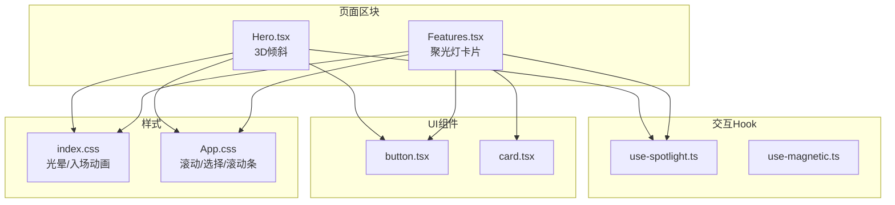
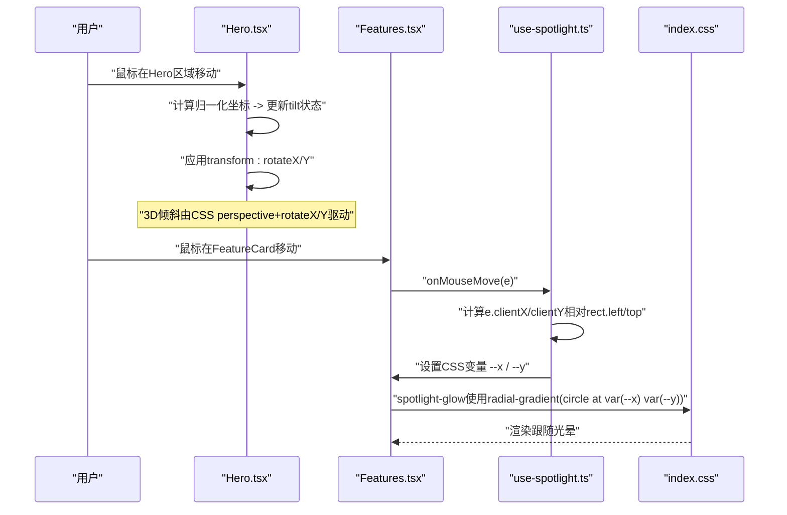
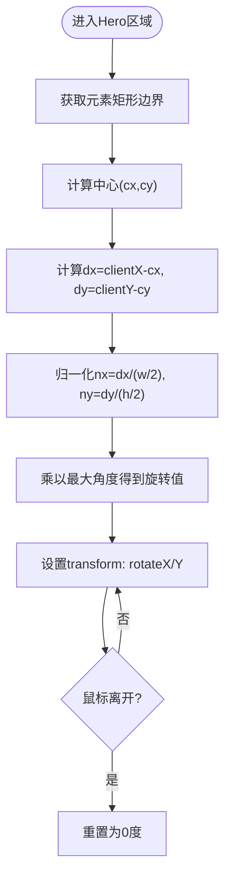
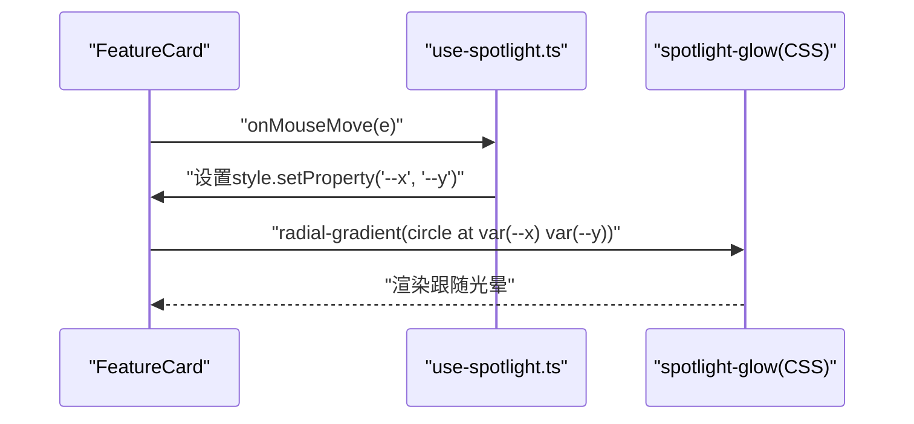
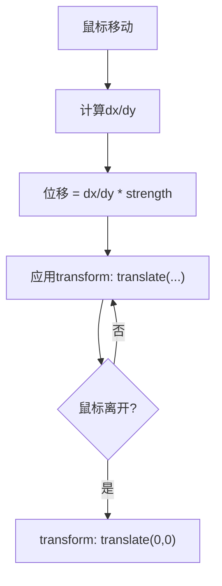
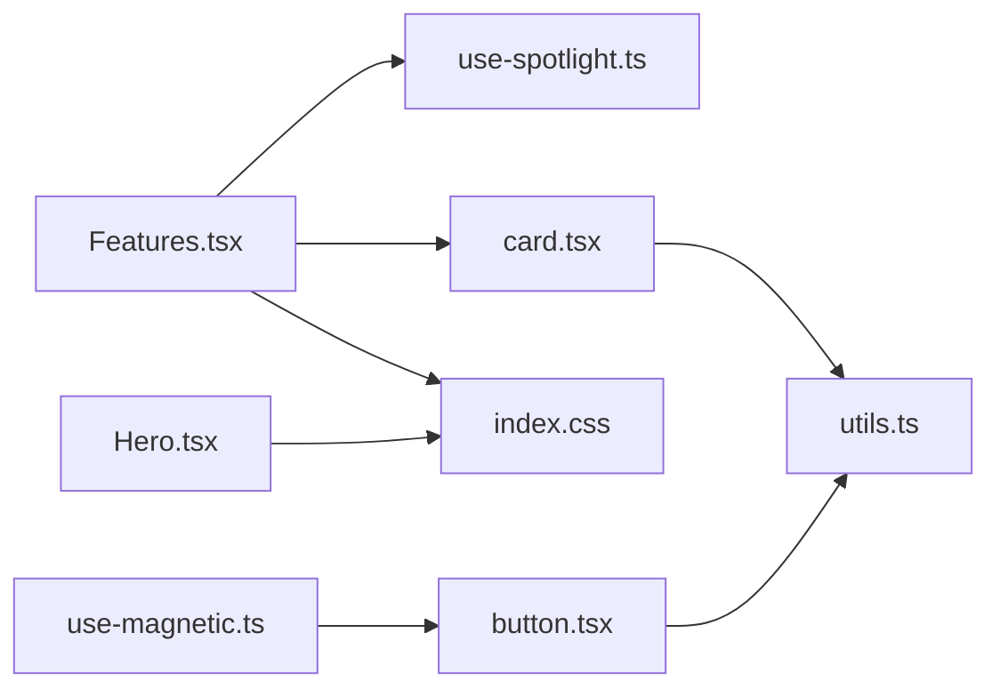

# 3D交互效果系统

<cite>
**本文引用的文件**   
- [Hero.tsx](file://src/sections/Hero.tsx)
- [use-spotlight.ts](file://src/hooks/use-spotlight.ts)
- [Features.tsx](file://src/sections/Features.tsx)
- [index.css](file://src/index.css)
- [use-magnetic.ts](file://src/hooks/use-magnetic.ts)
- [button.tsx](file://src/components/ui/button.tsx)
- [card.tsx](file://src/components/ui/card.tsx)
- [utils.ts](file://src/lib/utils.ts)
- [App.css](file://src/App.css)
</cite>

## 目录
1. [简介](#简介)
2. [项目结构](#项目结构)
3. [核心组件](#核心组件)
4. [架构总览](#架构总览)
5. [详细组件分析](#详细组件分析)
6. [依赖关系分析](#依赖关系分析)
7. [性能考量](#性能考量)
8. [故障排查指南](#故障排查指南)
9. [结论](#结论)
10. [附录：自定义与扩展示例路径](#附录自定义与扩展示例路径)

## 简介
本文件系统性地梳理并文档化仓库中的3D交互效果实现，包括：
- 3D倾斜效果的数学原理与CSS transform实现（透视投影、旋转矩阵概念、鼠标位置映射）
- 磁性吸附效果的机制（距离检测、力场计算、缓动动画）
- 聚光灯光晕效果（径向渐变、混合模式、动态定位）
- 触摸事件处理与移动端适配策略
- 性能优化技巧（will-change、requestAnimationFrame、GPU加速）
- 跨浏览器兼容性与常见问题解决
- 如何自定义参数、添加新交互行为、调整动画曲线

## 项目结构
本项目采用“按功能组织”的结构，3D与交互相关代码集中在 hooks 与 sections 中：
- hooks：可复用的交互逻辑（如磁性吸附、聚光灯跟随）
- sections：页面区块，组合UI组件与交互hook，承载具体3D效果
- components/ui：基础UI组件（按钮、卡片等），提供样式与可访问性基座
- lib：工具函数（类名合并）
- CSS：全局样式与关键动画/特效样式

图表来源
- [Hero.tsx:1-141](file://src/sections/Hero.tsx#L1-L141)
- [Features.tsx:1-127](file://src/sections/Features.tsx#L1-L127)
- [use-spotlight.ts:1-21](file://src/hooks/use-spotlight.ts#L1-L21)
- [use-magnetic.ts:1-32](file://src/hooks/use-magnetic.ts#L1-L32)
- [index.css:104-116](file://src/index.css#L104-L116)
- [App.css:1-29](file://src/App.css#L1-L29)

章节来源
- [Hero.tsx:1-141](file://src/sections/Hero.tsx#L1-L141)
- [Features.tsx:1-127](file://src/sections/Features.tsx#L1-L127)
- [use-spotlight.ts:1-21](file://src/hooks/use-spotlight.ts#L1-L21)
- [use-magnetic.ts:1-32](file://src/hooks/use-magnetic.ts#L1-L32)
- [index.css:104-116](file://src/index.css#L104-L116)
- [App.css:1-29](file://src/App.css#L1-L29)

## 核心组件
- 3D倾斜模块（Hero）：通过监听容器内鼠标移动，将鼠标相对中心坐标归一化为[-1,1]区间，再乘以最大倾斜角度得到X/Y轴旋转值，结合CSS perspective与rotateX/rotateY实现伪3D倾斜。
- 聚光灯光晕模块（Features + useSpotlight）：在卡片容器上绑定mousemove，实时计算鼠标相对于容器的坐标，写入CSS变量--x/--y；配合radial-gradient在hover时渲染跟随光标的光晕。
- 磁性吸附模块（useMagnetic）：计算鼠标与元素中心的偏移，按强度系数线性映射为translate位移，离开时复位。

章节来源
- [Hero.tsx:7-20](file://src/sections/Hero.tsx#L7-L20)
- [Hero.tsx:72-78](file://src/sections/Hero.tsx#L72-L78)
- [use-spotlight.ts:11-17](file://src/hooks/use-spotlight.ts#L11-L17)
- [Features.tsx:63-96](file://src/sections/Features.tsx#L63-L96)
- [index.css:104-116](file://src/index.css#L104-L116)
- [use-magnetic.ts:10-28](file://src/hooks/use-magnetic.ts#L10-L28)

## 架构总览
下图展示了3D倾斜与聚光灯的调用链路与数据流：

图表来源
- [Hero.tsx:7-20](file://src/sections/Hero.tsx#L7-L20)
- [Hero.tsx:72-78](file://src/sections/Hero.tsx#L72-L78)
- [use-spotlight.ts:11-17](file://src/hooks/use-spotlight.ts#L11-L17)
- [Features.tsx:63-96](file://src/sections/Features.tsx#L63-L96)
- [index.css:104-116](file://src/index.css#L104-L116)

## 详细组件分析

### 3D倾斜效果（Hero）
- 数学原理
  - 透视投影：通过CSS perspective建立Z轴深度感知，使rotateX/rotateY产生近大远小的立体感。
  - 旋转矩阵概念：rotateX对应绕X轴的二维旋转矩阵，rotateY对应绕Y轴的二维旋转矩阵；两者组合形成三维空间中的姿态变化。
  - 鼠标位置映射：将鼠标坐标从像素空间映射到[-1,1]的归一化空间，再乘以最大倾斜角，得到平滑且可控的旋转范围。
- 实现要点
  - 计算元素中心点，求dx/dy，归一化后乘以最大角度，分别赋给rotateX和rotateY。
  - 外层容器设置perspective，内层元素应用transform。
  - 离开时重置tilt，恢复默认姿态。
- 复杂度与性能
  - 时间复杂度O(1)，每帧仅做少量算术与状态更新。
  - 建议开启GPU加速（见性能章节）。

图表来源
- [Hero.tsx:7-20](file://src/sections/Hero.tsx#L7-L20)
- [Hero.tsx:72-78](file://src/sections/Hero.tsx#L72-L78)

章节来源
- [Hero.tsx:7-20](file://src/sections/Hero.tsx#L7-L20)
- [Hero.tsx:72-78](file://src/sections/Hero.tsx#L72-L78)

### 聚光灯光晕效果（Features + useSpotlight）
- 实现机制
  - 在卡片容器上监听mousemove，计算鼠标相对容器左上角的坐标，写入CSS变量--x/--y。
  - 光晕层使用radial-gradient以circle形式绘制，圆心位置由var(--x)/var(--y)决定，hover时显示。
- 视觉与混合
  - 使用半透明品牌色作为光晕主色，通过透明度控制融合程度。
  - 可通过mix-blend-mode增强与背景的混合效果（按需启用）。
- 性能
  - 仅更新两个CSS变量，避免频繁重排；配合transition实现平滑过渡。

图表来源
- [use-spotlight.ts:11-17](file://src/hooks/use-spotlight.ts#L11-L17)
- [Features.tsx:63-96](file://src/sections/Features.tsx#L63-L96)
- [index.css:104-116](file://src/index.css#L104-L116)

章节来源
- [use-spotlight.ts:11-17](file://src/hooks/use-spotlight.ts#L11-L17)
- [Features.tsx:63-96](file://src/sections/Features.tsx#L63-L96)
- [index.css:104-116](file://src/index.css#L104-L116)

### 磁性吸附效果（useMagnetic）
- 机制说明
  - 距离检测：计算鼠标与元素中心的dx/dy。
  - 力场计算：将dx/dy乘以strength系数，得到平移量。
  - 缓动动画：通过CSS transition或JS动画完成回弹复位。
- 适用场景
  - 按钮、链接、图标等小尺寸交互元素的“吸引”反馈。

图表来源
- [use-magnetic.ts:10-28](file://src/hooks/use-magnetic.ts#L10-L28)

章节来源
- [use-magnetic.ts:10-28](file://src/hooks/use-magnetic.ts#L10-L28)

### 触摸事件与移动端适配
- 现状与建议
  - 当前3D倾斜与聚光灯基于鼠标事件；移动端应补充touchstart/touchmove/touchend处理，确保手势下同样生效。
  - 建议在hooks中抽象统一的pointer事件处理器，同时兼容mouse与touch。
  - 对大屏与小屏分别限制最大倾斜角度与光晕半径，保证可读性与性能。
- 参考路径
  - 可在现有hooks基础上增加pointer事件分支，复用getBoundingClientRect与坐标计算逻辑。

[本节为通用指导，不直接分析具体文件]

### 性能优化技巧
- will-change
  - 对频繁变换的元素提前声明will-change: transform，减少合成层抖动。
- requestAnimationFrame
  - 高频动画（如惯性滑动、复杂粒子）建议使用rAF统一调度，避免阻塞主线程。
- GPU加速
  - 优先使用transform与opacity进行动画，触发合成层；避免触发布局与绘图的属性（如width/height/top/left）。
- 节流/防抖
  - 对mousemove/touchmove进行节流，降低事件频率。
- 条件渲染
  - 在小屏或非交互设备关闭重型效果，提升首屏性能。

[本节为通用指导，不直接分析具体文件]

## 依赖关系分析
- 组件与Hook耦合
  - Features.tsx依赖use-spotlight.ts与card.tsx，用于构建带光晕的卡片。
  - Hero.tsx独立实现3D倾斜，未引入额外hook。
- 样式依赖
  - index.css定义光晕与入场动画；App.css提供滚动与选择样式。
- 工具库
  - utils.ts提供类名合并能力，被UI组件广泛使用。

图表来源
- [Features.tsx:1-127](file://src/sections/Features.tsx#L1-L127)
- [use-spotlight.ts:1-21](file://src/hooks/use-spotlight.ts#L1-L21)
- [card.tsx:1-93](file://src/components/ui/card.tsx#L1-L93)
- [Hero.tsx:1-141](file://src/sections/Hero.tsx#L1-L141)
- [index.css:104-116](file://src/index.css#L104-L116)
- [use-magnetic.ts:1-32](file://src/hooks/use-magnetic.ts#L1-L32)
- [button.tsx:1-63](file://src/components/ui/button.tsx#L1-L63)
- [utils.ts:1-7](file://src/lib/utils.ts#L1-L7)

章节来源
- [Features.tsx:1-127](file://src/sections/Features.tsx#L1-L127)
- [use-spotlight.ts:1-21](file://src/hooks/use-spotlight.ts#L1-L21)
- [card.tsx:1-93](file://src/components/ui/card.tsx#L1-L93)
- [Hero.tsx:1-141](file://src/sections/Hero.tsx#L1-L141)
- [index.css:104-116](file://src/index.css#L104-L116)
- [use-magnetic.ts:1-32](file://src/hooks/use-magnetic.ts#L1-L32)
- [button.tsx:1-63](file://src/components/ui/button.tsx#L1-L63)
- [utils.ts:1-7](file://src/lib/utils.ts#L1-L7)

## 性能考量
- 3D倾斜
  - 使用transform与opacity，避免布局抖动；必要时为倾斜容器添加will-change: transform。
  - 限制最大倾斜角度，防止过度变形导致重绘开销。
- 聚光灯
  - 仅更新CSS变量，利用transition平滑过渡；在大屏设备上适当增大光晕半径，但注意不要过大影响性能。
- 磁性吸附
  - 对小元素使用轻量级位移；若需更复杂的弹性回弹，可使用rAF驱动的弹簧模型。
- 通用
  - 对mousemove/touchmove进行节流；在低性能设备上降级或禁用部分效果。

[本节为通用指导，不直接分析具体文件]

## 故障排查指南
- 光晕不跟随
  - 检查是否设置了--x/--y变量；确认容器存在getBoundingClientRect且事件绑定正确。
  - 确认CSS中使用radial-gradient引用了var(--x)/var(--y)。
- 3D倾斜无效
  - 确认外层容器设置了perspective；内层元素应用了transform。
  - 检查是否有其他transform覆盖或z-index层级问题。
- 移动端无响应
  - 补充touch事件处理；或在hooks中统一使用pointer事件。
- 卡顿或掉帧
  - 检查是否触发了布局/绘制；改用transform/opacity；考虑节流与rAF。

章节来源
- [use-spotlight.ts:11-17](file://src/hooks/use-spotlight.ts#L11-L17)
- [index.css:104-116](file://src/index.css#L104-L116)
- [Hero.tsx:72-78](file://src/sections/Hero.tsx#L72-L78)

## 结论
本系统通过轻量级的React Hooks与CSS原生特性，实现了高性能的3D倾斜、磁性吸附与聚光灯光晕效果。其核心在于：
- 将鼠标坐标映射为可控的几何变换参数
- 用CSS变量驱动动态样式
- 借助合成层与过渡动画获得流畅体验
在此基础上，可按需扩展更多交互行为，并在多端保持一致体验。

[本节为总结，不直接分析具体文件]

## 附录：自定义与扩展示例路径
- 自定义3D倾斜参数
  - 修改最大倾斜角度与映射比例，参考路径：[Hero.tsx:7-20](file://src/sections/Hero.tsx#L7-L20)、[Hero.tsx:72-78](file://src/sections/Hero.tsx#L72-L78)
- 调整聚光灯外观
  - 修改光晕颜色、半径与过渡时长，参考路径：[index.css:104-116](file://src/index.css#L104-L116)、[Features.tsx:63-96](file://src/sections/Features.tsx#L63-L96)
- 配置磁性吸附强度
  - 调整strength系数与回弹动画，参考路径：[use-magnetic.ts:7-28](file://src/hooks/use-magnetic.ts#L7-L28)
- 新增交互行为
  - 在现有hooks中增加pointer事件分支，复用坐标计算逻辑，参考路径：[use-spotlight.ts:11-17](file://src/hooks/use-spotlight.ts#L11-L17)、[use-magnetic.ts:10-28](file://src/hooks/use-magnetic.ts#L10-L28)
- 调整动画曲线
  - 修改transition的cubic-bezier或duration，参考路径：[index.css:80-103](file://src/index.css#L80-L103)

章节来源
- [Hero.tsx:7-20](file://src/sections/Hero.tsx#L7-L20)
- [Hero.tsx:72-78](file://src/sections/Hero.tsx#L72-L78)
- [index.css:104-116](file://src/index.css#L104-L116)
- [Features.tsx:63-96](file://src/sections/Features.tsx#L63-L96)
- [use-magnetic.ts:7-28](file://src/hooks/use-magnetic.ts#L7-L28)
- [use-spotlight.ts:11-17](file://src/hooks/use-spotlight.ts#L11-L17)
- [index.css:80-103](file://src/index.css#L80-L103)