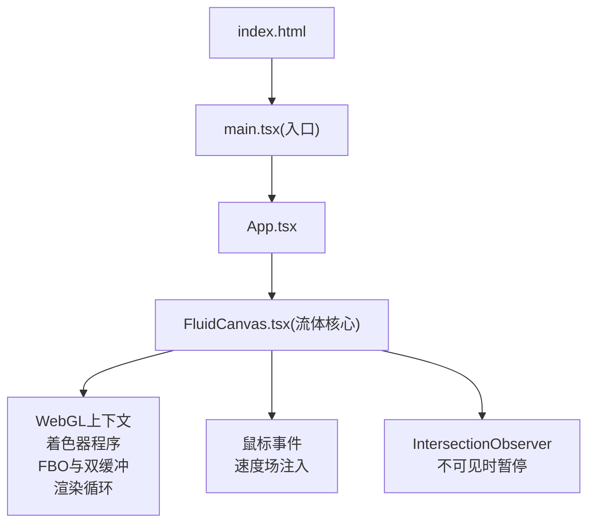
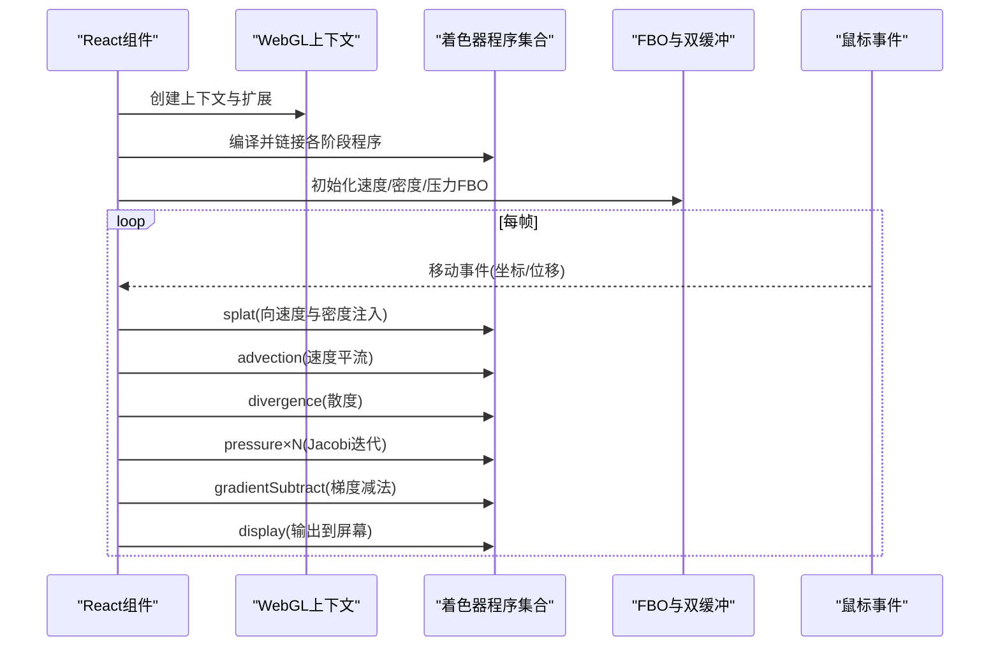
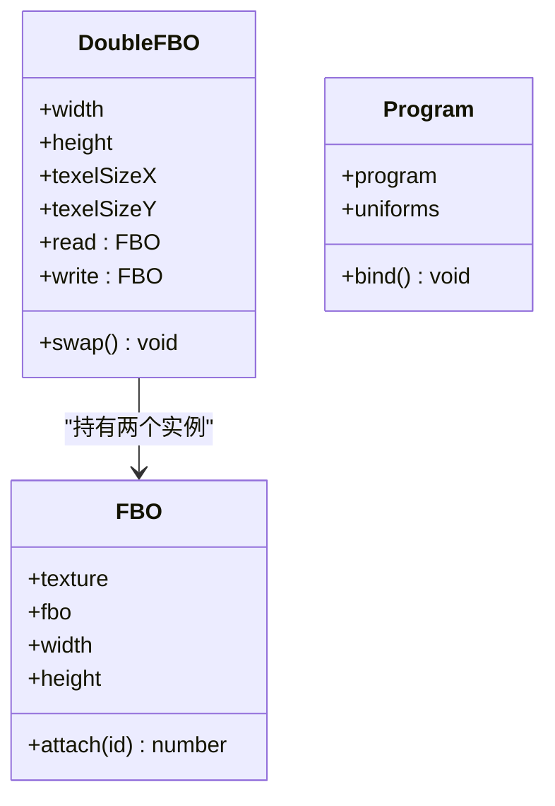
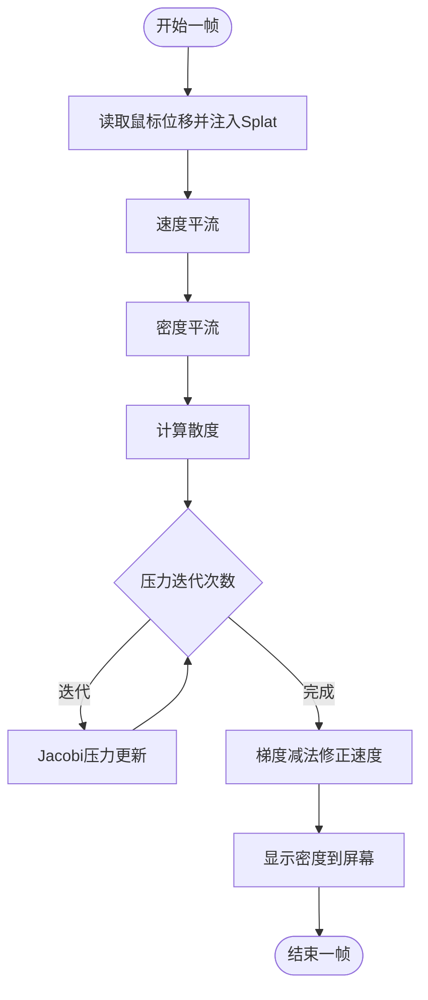
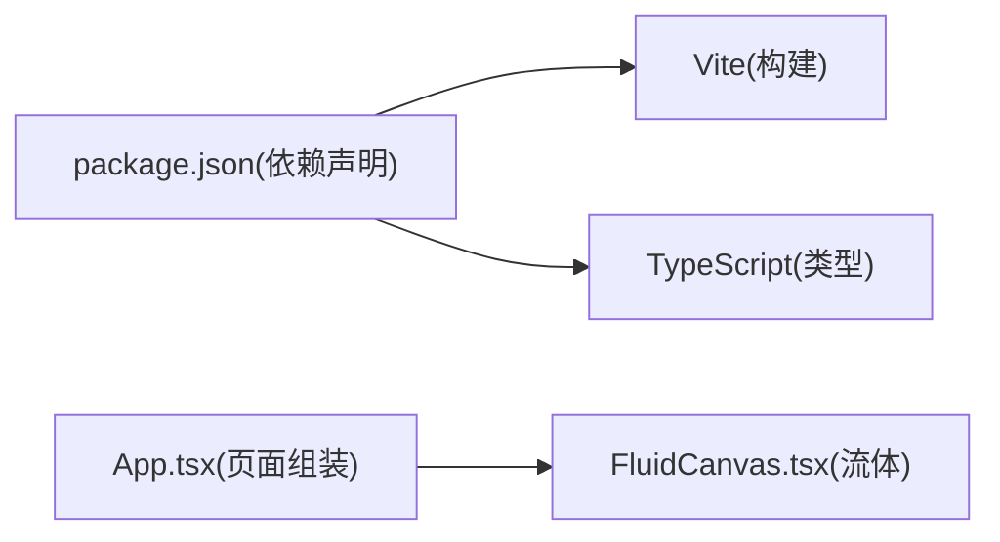

# WebGL流体动画系统

<cite>
**本文引用的文件**   
- [FluidCanvas.tsx](file://src/sections/FluidCanvas.tsx)
- [App.tsx](file://src/App.tsx)
- [package.json](file://package.json)
- [index.html](file://index.html)
</cite>

## 目录
1. [简介](#简介)
2. [项目结构](#项目结构)
3. [核心组件](#核心组件)
4. [架构总览](#架构总览)
5. [详细组件分析](#详细组件分析)
6. [依赖关系分析](#依赖关系分析)
7. [性能与兼容性](#性能与兼容性)
8. [故障排查指南](#故障排查指南)
9. [结论](#结论)
10. [附录：参数调优与React集成示例](#附录参数调优与react集成示例)

## 简介
本技术文档围绕一个基于WebGL的流体动画系统，深入解析其实现原理与工程化细节。该系统采用GPU加速的Navier-Stokes方程近似求解流程，通过FBO（帧缓冲对象）与双缓冲技术在纹理间传递数据，使用多个着色器程序完成平流、散度计算、压力求解（Jacobi迭代）、梯度减法以及最终显示等步骤。同时提供鼠标交互驱动的速度场注入、颜色系统配置、移动端降级策略、内存管理与性能优化建议，并给出在React中集成的实践方式。

## 项目结构
该流体系统以React组件形式组织，核心逻辑集中在单个组件文件中，包含所有GLSL着色器源码、FBO管理、渲染循环与事件处理。应用入口将流体背景作为全屏固定层渲染，其他UI内容在其上层展示。

图表来源
- [index.html:1-49](file://index.html#L1-L49)
- [App.tsx:1-30](file://src/App.tsx#L1-L30)
- [FluidCanvas.tsx:153-470](file://src/sections/FluidCanvas.tsx#L153-L470)

章节来源
- [index.html:1-49](file://index.html#L1-L49)
- [App.tsx:1-30](file://src/App.tsx#L1-L30)
- [FluidCanvas.tsx:153-470](file://src/sections/FluidCanvas.tsx#L153-L470)

## 核心组件
- 流体核心组件：封装了WebGL初始化、着色器编译链接、FBO创建与管理、渲染管线、交互与动画循环。
- 着色器程序：顶点着色器用于全屏四边形绘制；片段着色器分别实现Splat注入、平流、散度、压力求解、梯度减法与显示。
- 数据结构：FBO与DoubleFBO抽象纹理与帧缓冲，支持读写切换；Program抽象着色器程序与uniforms绑定。

章节来源
- [FluidCanvas.tsx:125-149](file://src/sections/FluidCanvas.tsx#L125-L149)
- [FluidCanvas.tsx:187-213](file://src/sections/FluidCanvas.tsx#L187-L213)
- [FluidCanvas.tsx:235-278](file://src/sections/FluidCanvas.tsx#L235-L278)

## 架构总览
下图展示了从React组件到WebGL渲染管线的整体流程，包括关键着色器阶段与FBO数据流向。

图表来源
- [FluidCanvas.tsx:330-359](file://src/sections/FluidCanvas.tsx#L330-L359)
- [FluidCanvas.tsx:372-419](file://src/sections/FluidCanvas.tsx#L372-L419)

## 详细组件分析

### 着色器程序与工作原理
- 基础顶点着色器：将[-1,1]的全屏四边形顶点映射为UV坐标，并预计算相邻像素偏移（左/右/上/下），供后续片段着色器采样。
- Splat片段着色器：根据鼠标位置与半径，以高斯分布向目标纹理叠加颜色或速度，形成“墨滴”效果。
- Advection片段着色器：沿速度场反向追踪坐标，对源纹理进行采样并乘以衰减系数，实现速度与密度的对流。
- Divergence片段着色器：利用四邻域速度分量差分计算散度场。
- Pressure片段着色器：基于散度场与当前压力场，执行拉普拉斯平滑（Jacobi迭代）。
- Gradient Subtract片段着色器：用压力场的梯度修正速度场，使其趋于无散。
- Display片段着色器：将密度纹理直接输出至屏幕，并根据RGB最大值设置透明度。

章节来源
- [FluidCanvas.tsx:5-22](file://src/sections/FluidCanvas.tsx#L5-L22)
- [FluidCanvas.tsx:24-39](file://src/sections/FluidCanvas.tsx#L24-L39)
- [FluidCanvas.tsx:41-54](file://src/sections/FluidCanvas.tsx#L41-L54)
- [FluidCanvas.tsx:56-72](file://src/sections/FluidCanvas.tsx#L56-L72)
- [FluidCanvas.tsx:74-92](file://src/sections/FluidCanvas.tsx#L74-L92)
- [FluidCanvas.tsx:94-112](file://src/sections/FluidCanvas.tsx#L94-L112)
- [FluidCanvas.tsx:114-123](file://src/sections/FluidCanvas.tsx#L114-L123)

### FBO与双缓冲管理机制
- FBO抽象：封装纹理与帧缓冲，提供attach方法激活纹理单元并返回索引。
- DoubleFBO：维护两个FBO实例，暴露read/write访问器与swap交换函数，避免在同一帧内读写同一纹理导致竞争。
- 分辨率适配：根据设备像素比与画布宽高比计算模拟与密度纹理的分辨率，确保在不同设备上保持合理精度与性能平衡。
- 半浮点纹理：尝试启用OES_texture_half_float扩展以降低显存占用与带宽压力，回退到UNSIGNED_BYTE以保证兼容。

图表来源
- [FluidCanvas.tsx:127-149](file://src/sections/FluidCanvas.tsx#L127-L149)
- [FluidCanvas.tsx:239-278](file://src/sections/FluidCanvas.tsx#L239-L278)

章节来源
- [FluidCanvas.tsx:235-278](file://src/sections/FluidCanvas.tsx#L235-L278)
- [FluidCanvas.tsx:288-321](file://src/sections/FluidCanvas.tsx#L288-L321)

### 渲染管线与计算步骤
- 平流（Advection）：先更新速度场，再使用新速度场对流密度场，两者均乘以各自衰减系数。
- 散度（Divergence）：基于速度场计算散度图，用于后续压力求解。
- 压力求解（Pressure）：对散度图进行多次Jacobi迭代，逐步逼近满足无散条件的压力场。
- 梯度减法（Gradient Subtract）：用压力梯度修正速度场，得到更稳定的无散速度。
- 显示（Display）：将密度纹理输出到屏幕，透明度由RGB最大值决定。

图表来源
- [FluidCanvas.tsx:372-419](file://src/sections/FluidCanvas.tsx#L372-L419)

章节来源
- [FluidCanvas.tsx:372-419](file://src/sections/FluidCanvas.tsx#L372-L419)

### 鼠标交互与速度场注入
- 事件监听：捕获mousemove事件，计算归一化坐标与相对位移，按力系数放大后写入速度场。
- Splat过程：将速度增量与随机颜色写入速度与密度纹理，形成可见的流体扰动。
- 防抖与节流：通过指针移动标志位控制每帧仅注入一次，避免重复叠加。

章节来源
- [FluidCanvas.tsx:323-359](file://src/sections/FluidCanvas.tsx#L323-L359)

### 颜色系统与自定义方法
- 调色板：内置一组低饱和蓝紫色系，营造星云般的柔和氛围。
- 注入机制：每次Splat随机选择一种颜色，叠加到密度纹理，从而产生丰富的色彩层次。
- 自定义建议：可替换调色板数组、调整Splat半径与力系数，或引入HSV空间生成动态色相变化。

章节来源
- [FluidCanvas.tsx:361-369](file://src/sections/FluidCanvas.tsx#L361-L369)
- [FluidCanvas.tsx:344-359](file://src/sections/FluidCanvas.tsx#L344-L359)

### 移动端降级与可见性优化
- 移动端降级：当窗口宽度小于阈值时跳过WebGL初始化，避免低端设备卡顿。
- 不可见暂停：使用IntersectionObserver检测画布是否进入视口，不在视口时停止动画循环，节省资源。

章节来源
- [FluidCanvas.tsx:160-162](file://src/sections/FluidCanvas.tsx#L160-L162)
- [FluidCanvas.tsx:421-427](file://src/sections/FluidCanvas.tsx#L421-L427)
- [FluidCanvas.tsx:433-450](file://src/sections/FluidCanvas.tsx#L433-L450)

## 依赖关系分析
- React生态：组件基于React Hooks与Ref管理生命周期与DOM引用。
- 构建工具链：Vite负责开发与构建，TypeScript提供类型检查。
- 第三方库：未引入额外WebGL库，全部原生API实现，降低耦合度。

图表来源
- [package.json:1-80](file://package.json#L1-L80)
- [App.tsx:1-30](file://src/App.tsx#L1-L30)

章节来源
- [package.json:1-80](file://package.json#L1-L80)
- [App.tsx:1-30](file://src/App.tsx#L1-L30)

## 性能与兼容性
- 分辨率与精度
  - 使用getResolution根据设备像素比与纵横比计算模拟与密度分辨率，兼顾清晰度与性能。
  - 优先使用半浮点纹理（HALF_FLOAT_OES）减少显存占用与带宽压力，不支持时回退到UNSIGNED_BYTE。
- 过滤与采样
  - 速度与密度使用线性滤波以获得平滑过渡；散度与压力使用最近邻滤波以减少插值开销。
- 迭代次数
  - 压力求解的Jacobi迭代次数可调，较高数值提升稳定性但增加耗时。
- 时间步长限制
  - dt上限封顶，防止大间隔导致的数值不稳定。
- 可见性与资源释放
  - IntersectionObserver在不可见时暂停渲染；组件卸载时取消动画帧、移除事件监听与观察者。
- 移动端降级
  - 小屏设备直接跳过WebGL，避免低端设备性能问题。

章节来源
- [FluidCanvas.tsx:235-278](file://src/sections/FluidCanvas.tsx#L235-L278)
- [FluidCanvas.tsx:288-321](file://src/sections/FluidCanvas.tsx#L288-L321)
- [FluidCanvas.tsx:433-450](file://src/sections/FluidCanvas.tsx#L433-L450)
- [FluidCanvas.tsx:454-459](file://src/sections/FluidCanvas.tsx#L454-L459)

## 故障排查指南
- WebGL上下文获取失败
  - 现象：无法创建webgl上下文或扩展。
  - 排查：确认浏览器版本与硬件支持；检查canvas尺寸与样式；查看控制台错误信息。
- 纹理格式不支持
  - 现象：半浮点纹理不可用，渲染异常。
  - 处理：自动回退到UNSIGNED_BYTE；必要时降低分辨率或迭代次数。
- 移动端卡顿
  - 现象：小屏设备掉帧严重。
  - 处理：启用移动端降级；减小SIM_RESOLUTION与PRESSURE_ITERATIONS；关闭不必要的特效。
- 内存泄漏
  - 现象：长时间运行后内存增长。
  - 处理：确保组件卸载时清理动画帧、事件监听与观察者；避免频繁重建FBO。
- 颜色不透明或过淡
  - 现象：密度纹理透明度异常。
  - 处理：检查display着色器的alpha计算逻辑；确认Splat颜色强度与衰减系数。

章节来源
- [FluidCanvas.tsx:174-186](file://src/sections/FluidCanvas.tsx#L174-L186)
- [FluidCanvas.tsx:454-459](file://src/sections/FluidCanvas.tsx#L454-L459)
- [FluidCanvas.tsx:114-123](file://src/sections/FluidCanvas.tsx#L114-L123)

## 结论
该WebGL流体系统以简洁而高效的GPU管线实现了Navier-Stokes近似的可视化效果。通过FBO与双缓冲管理、多阶段着色器协作、合理的分辨率与精度策略，系统在桌面端提供了流畅且美观的流体体验，同时在移动端进行了降级处理与资源优化。结合React组件的生命周期管理，系统具备良好的可集成性与可维护性。

## 附录：参数调优与React集成示例

### 参数调优清单
- SIM_RESOLUTION：模拟网格分辨率，影响压力求解与速度场精度。
- DYE_RESOLUTION：密度纹理分辨率，影响视觉细节。
- DENSITY_DISSIPATION：密度衰减系数，越大消散越快。
- VELOCITY_DISSIPATION：速度衰减系数，越大速度消失越快。
- PRESSURE_ITERATIONS：压力求解迭代次数，越高越稳定但更慢。
- SPLAT_RADIUS：Splat半径，控制注入范围。
- SPLAT_FORCE：Splat力度，控制鼠标拖拽产生的速度大小。

章节来源
- [FluidCanvas.tsx:164-172](file://src/sections/FluidCanvas.tsx#L164-L172)

### 在React组件中集成
- 将流体组件置于页面顶层，使用固定定位覆盖全屏，并将pointer-events设为none以避免遮挡交互。
- 在其他业务组件之上渲染，确保用户交互不受影响。
- 若需响应外部状态（如主题色、粒子密度），可通过props传入并在useEffect中重新初始化FBO与着色器uniforms。

章节来源
- [App.tsx:11-26](file://src/App.tsx#L11-L26)
- [FluidCanvas.tsx:462-469](file://src/sections/FluidCanvas.tsx#L462-L469)