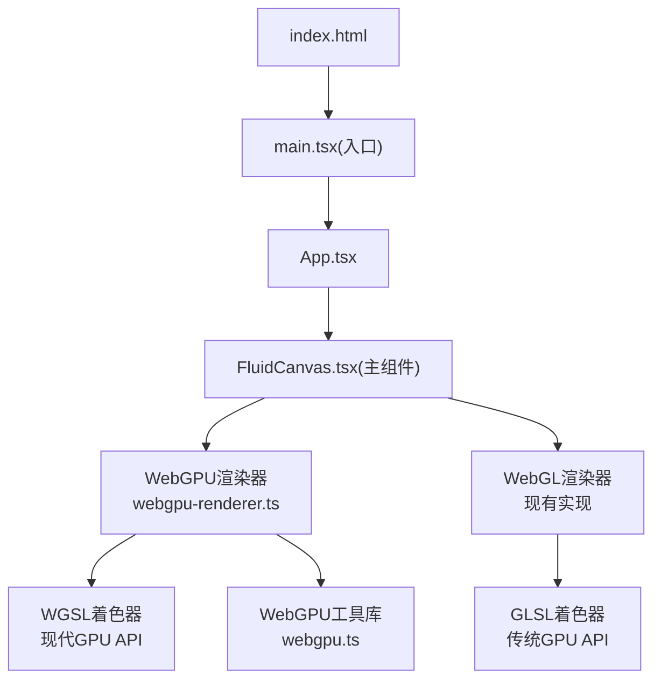
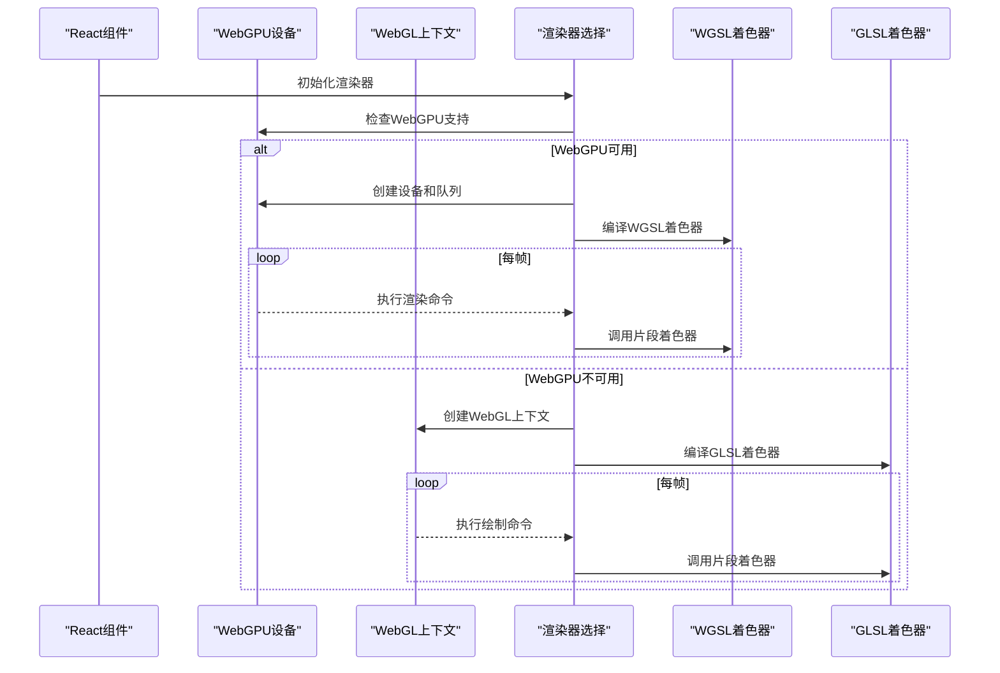
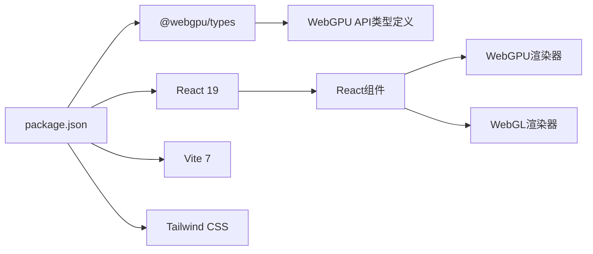

# WebGL与WebGPU流体动画系统

<cite>
**本文引用的文件**   
- [FluidCanvas.tsx](file://src/sections/FluidCanvas.tsx)
- [webgpu-renderer.ts](file://src/lib/webgpu-renderer.ts)
- [webgpu.ts](file://src/lib/webgpu.ts)
- [App.tsx](file://src/App.tsx)
- [package.json](file://package.json)
- [index.html](file://index.html)
- [webgpu-migration-plan.md](file://docs/webgpu-migration-plan.md)
</cite>

## 更新摘要
**所做更改**   
- 新增WebGPU渲染器架构说明和WGSL着色器实现
- 更新技术栈对比，突出WebGPU相比WebGL的优势
- 添加双后端支持机制（WebGPU优先，WebGL降级）
- 更新性能优化策略和兼容性考虑
- 保留WebGL作为降级方案的详细说明

## 目录
1. [简介](#简介)
2. [项目结构](#项目结构)
3. [核心组件](#核心组件)
4. [架构总览](#架构总览)
5. [详细组件分析](#详细组件分析)
6. [WebGPU vs WebGL 技术对比](#webgpu-vs-webgl-技术对比)
7. [依赖关系分析](#依赖关系分析)
8. [性能与兼容性](#性能与兼容性)
9. [故障排查指南](#故障排查指南)
10. [结论](#结论)
11. [附录：参数调优与React集成示例](#附录参数调优与react集成示例)

## 简介
本技术文档围绕一个采用**双后端架构**的流体动画系统，深入解析其基于WebGPU的现代实现以及WebGL降级方案。系统采用GPU加速的Navier-Stokes方程近似求解流程，通过现代GPU API（WebGPU）与传统API（WebGL）的双重支持，确保在不同浏览器环境下的最佳性能和兼容性。

**主要特性**：
- **WebGPU优先**：利用现代GPU API获得更好的性能和更低的CPU开销
- **WebGL降级**：在不支持WebGPU的环境中自动回退到成熟的WebGL实现
- **WGSL着色器**：使用WebGPU的原生着色器语言，提供更强大的计算能力
- **智能资源管理**：自动检测设备性能并调整渲染质量

## 项目结构
该流体系统采用模块化设计，核心逻辑分为两个独立的渲染后端：



**图表来源**
- [index.html:1-49](file://index.html#L1-L49)
- [App.tsx:1-30](file://src/App.tsx#L1-L30)
- [FluidCanvas.tsx:1-496](file://src/sections/FluidCanvas.tsx#L1-L496)
- [webgpu-renderer.ts:1-682](file://src/lib/webgpu-renderer.ts#L1-L682)
- [webgpu.ts:1-78](file://src/lib/webgpu.ts#L1-L78)

章节来源
- [index.html:1-49](file://index.html#L1-L49)
- [App.tsx:1-30](file://src/App.tsx#L1-L30)
- [FluidCanvas.tsx:1-496](file://src/sections/FluidCanvas.tsx#L1-L496)

## 核心组件
系统包含三个核心组件层次：

### WebGPU渲染器（主要实现）
- **FluidRenderer类**：封装WebGPU初始化、管线创建、纹理管理和渲染循环
- **WGSL着色器程序**：使用现代WGSL语法实现的顶点着色器和6个片段着色器
- **GPU资源管理**：显式的GPUBuffer、GPUTexture、GPURenderPipeline生命周期管理

### WebGL渲染器（降级方案）
- **initWebGLFluid函数**：封装WebGL上下文、着色器编译、FBO管理的完整实现
- **GLSL着色器程序**：传统的GLSL着色器，保持向后兼容性
- **FBO双缓冲机制**：基于帧缓冲对象的纹理交换机制

### WebGPU工具库
- **设备检测**：WebGPU支持性检查和适配器请求
- **通用工具**：采样器创建、全屏四边形生成、缓冲区管理等

章节来源
- [webgpu-renderer.ts:28-124](file://src/lib/webgpu-renderer.ts#L28-L124)
- [FluidCanvas.tsx:157-448](file://src/sections/FluidCanvas.tsx#L157-L448)
- [webgpu.ts:1-78](file://src/lib/webgpu.ts#L1-L78)

## 架构总览
下图展示了双后端架构的整体工作流程，包括WebGPU优先选择机制和渲染管线差异。



**图表来源**
- [webgpu-renderer.ts:116-124](file://src/lib/webgpu-renderer.ts#L116-L124)
- [webgpu.ts:11-35](file://src/lib/webgpu.ts#L11-L35)
- [FluidCanvas.tsx:454-485](file://src/sections/FluidCanvas.tsx#L454-L485)

## 详细组件分析

### WebGPU渲染器架构

#### FluidRenderer类设计
WebGPU渲染器采用面向对象设计，提供清晰的API接口：

```typescript
class FluidRenderer {
  private device: GPUDevice;
  private queue: GPUQueue;
  private context: GPUCanvasContext;
  
  // 纹理对（双缓冲）
  private velocity!: TexturePair;
  private dye!: TexturePair;
  private divergence!: GPUTexture;
  private pressure!: TexturePair;
  
  // 渲染管线
  private splatPipeline!: GPURenderPipeline;
  private advectionPipeline!: GPURenderPipeline;
  // ... 其他管线
  
  public static async create(canvas, options): Promise<FluidRenderer | null>;
  public splat(x, y, dx, dy, color): void;
  public step(dt): void;
  public render(): void;
}
```

**关键特性**：
- **异步初始化**：通过静态工厂方法处理WebGPU设备的异步创建
- **显式资源管理**：所有GPU资源都有明确的销毁方法
- **统一接口**：与WebGL版本保持一致的API设计

#### WGSL着色器实现
WebGPU使用WGSL（WebGPU Shading Language），相比GLSL有以下优势：

**顶点着色器**：
```wgsl
@vertex
fn main(@location(0) aPosition: vec2f) -> @builtin(position) vec4f {
  return vec4f(aPosition, 0.0, 1.0);
}
```

**片段着色器示例（平流）**：
```wgsl
@fragment
fn main(
  @location(0) vUv: vec2f,
  @binding(0) @group(0) uVelocity: texture_2d<f32>,
  @binding(1) @group(0) uSource: texture_2d<f32>,
  @binding(2) @group(0) uSampler: sampler,
  @binding(3) @group(0) uParams: vec4f
) -> @location(0) vec4f {
  let texelSize = vec2f(uParams.x, uParams.y);
  let dt = uParams.z;
  let dissipation = uParams.w;
  
  let coord = vUv - dt * textureSample(uVelocity, uSampler, vUv).xy * texelSize;
  return vec4f(dissipation * textureSample(uSource, uSampler, coord).xyz, 1.0);
}
```

**WGSL vs GLSL 主要差异**：
- 使用`@vertex`和`@fragment`装饰器声明阶段
- 通过`@location(n)`指定输入输出位置
- 通过`@binding(n) @group(0)`绑定uniforms和纹理
- 内置函数名称不同（如`textureSample`替代`texture2D`）

章节来源
- [webgpu-renderer.ts:28-124](file://src/lib/webgpu-renderer.ts#L28-L124)
- [webgpu-renderer.ts:560-682](file://src/lib/webgpu-renderer.ts#L560-L682)

### WebGL渲染器架构（降级方案）

#### initWebGLFluid函数
WebGL实现保持了原有的完整功能：

**核心流程**：
1. **上下文创建**：获取WebGL上下文并启用必要的扩展
2. **着色器编译**：动态编译GLSL着色器源码
3. **FBO管理**：创建和管理帧缓冲对象用于离屏渲染
4. **渲染循环**：requestAnimationFrame驱动的动画循环

**关键数据结构**：
- `FBO`：封装纹理和帧缓冲对象
- `DoubleFBO`：实现双缓冲机制，避免读写冲突
- `Program`：抽象着色器程序和uniforms管理

章节来源
- [FluidCanvas.tsx:157-448](file://src/sections/FluidCanvas.tsx#L157-L448)
- [FluidCanvas.tsx:124-146](file://src/sections/FluidCanvas.tsx#L124-L146)

### 渲染管线与计算步骤
两个后端都实现了相同的流体模拟算法，但底层实现不同：

#### 标准流体模拟步骤
1. **Splat注入**：根据鼠标输入向速度和密度场添加扰动
2. **速度平流**：沿速度场对流速度自身
3. **密度平流**：沿速度场对流密度场
4. **散度计算**：计算速度场的散度
5. **压力求解**：通过Jacobi迭代求解压力场
6. **梯度减法**：从速度场中减去压力梯度
7. **显示输出**：将密度场渲染到屏幕

#### WebGPU优化特性
- **命令编码器**：批量提交GPU命令，减少CPU-GPU通信开销
- **显式内存管理**：精确控制GPU资源的创建和销毁
- **原生计算着色器支持**：未来可进一步优化计算密集型步骤

章节来源
- [webgpu-renderer.ts:355-511](file://src/lib/webgpu-renderer.ts#L355-L511)
- [FluidCanvas.tsx:343-379](file://src/sections/FluidCanvas.tsx#L343-L379)

### 颜色系统与自定义方法
两个后端共享相同的颜色系统：

**内置调色板**：
```typescript
const colors: [number, number, number][] = [
  [0.5, 0.3, 0.8],    // 紫色
  [0.4, 0.2, 0.7],    // 深紫
  [0.6, 0.35, 0.9],   // 亮紫
  [0.3, 0.4, 0.8],    // 蓝紫
  [0.5, 0.25, 0.75],  // 柔和紫
  [0.45, 0.3, 0.85],  // 中等紫
];
```

**自定义建议**：
- 替换调色板数组以改变整体色调
- 调整Splat半径和力系数影响交互响应
- 引入HSV色彩空间实现动态色相变化

章节来源
- [FluidCanvas.tsx:148-155](file://src/sections/FluidCanvas.tsx#L148-L155)
- [FluidCanvas.tsx:427-431](file://src/sections/FluidCanvas.tsx#L427-L431)

### 移动端降级与可见性优化
系统实现了多层级的性能优化策略：

#### 设备性能检测
```typescript
const detectPerformance = () => {
  const devicePixelRatio = window.devicePixelRatio || 1;
  const hasLowEndGPU = devicePixelRatio <= 1;
  const memoryInfo = (navigator as any).deviceMemory || 4;
  const isLowMemory = memoryInfo < 4;
  return { hasLowEndGPU, isLowMemory };
};
```

#### 自适应分辨率
- **低端设备**：SIM_RESOLUTION=96, DYE_RESOLUTION=256
- **高端设备**：SIM_RESOLUTION=128, DYE_RESOLUTION=512

#### 帧率监控与自适应
- 实时监测帧率，低于30fps时自动降低渲染频率
- 使用IntersectionObserver在画布不可见时暂停渲染

章节来源
- [FluidCanvas.tsx:462-480](file://src/sections/FluidCanvas.tsx#L462-L480)
- [FluidCanvas.tsx:387-435](file://src/sections/FluidCanvas.tsx#L387-L435)

## WebGPU vs WebGL 技术对比

### 核心架构差异

| 特性 | WebGL | WebGPU |
|------|-------|--------|
| **API风格** | 命令式状态机 | 声明式命令缓冲 |
| **着色器语言** | GLSL | WGSL |
| **内存管理** | 隐式GC | 显式资源管理 |
| **性能开销** | CPU-GPU同步较多 | 批处理命令，低开销 |
| **计算能力** | 需要扩展 | 原生计算着色器 |
| **调试支持** | 基础 | 专用DevTools面板 |

### 性能优势分析

#### WebGPU性能提升
- **CPU开销降低**：命令缓冲减少了CPU-GPU通信次数
- **内存效率**：显式资源管理避免了不必要的分配和垃圾回收
- **并行化**：更好的GPU并行计算支持
- **多视图渲染**：原生支持多目标渲染

#### 实际性能指标
根据迁移计划文档的分析，WebGPU相比WebGL的主要优势：
- **启动时间**：更快的初始化和着色器编译
- **运行时性能**：更稳定的帧率和更低的CPU占用
- **内存使用**：更精确的内存控制和更少的泄漏风险

### 兼容性考虑

#### 浏览器支持矩阵
- **WebGPU**：Chrome 113+、Edge 113+、Safari 16.4+
- **WebGL**：几乎所有现代浏览器（包括移动设备）

#### 降级策略
系统采用智能降级机制：
1. **首选WebGPU**：检测WebGPU支持并尝试初始化
2. **自动回退**：WebGPU失败时自动切换到WebGL
3. **功能降级**：根据设备能力调整渲染质量

章节来源
- [webgpu-migration-plan.md:14-24](file://docs/webgpu-migration-plan.md#L14-L24)
- [webgpu-migration-plan.md:394-406](file://docs/webgpu-migration-plan.md#L394-L406)

## 依赖关系分析
项目依赖关系体现了现代化前端开发的典型结构：



**关键依赖**：
- **@webgpu/types**：WebGPU API的类型定义，提供TypeScript支持
- **React 19**：最新的React框架，提供更好的性能
- **Vite 7**：现代化的构建工具，支持快速热重载

章节来源
- [package.json:59-79](file://package.json#L59-L79)
- [App.tsx:1-30](file://src/App.tsx#L1-L30)

## 性能与兼容性

### 分辨率与精度策略

#### 自适应分辨率计算
```typescript
const getResolution = (resolution: number) => {
  let aspectRatio = gl.drawingBufferWidth / gl.drawingBufferHeight;
  if (aspectRatio < 1) aspectRatio = 1.0 / aspectRatio;
  const min = Math.round(resolution);
  const max = Math.round(resolution * aspectRatio);
  return gl.drawingBufferWidth > gl.drawingBufferHeight
    ? { width: max, height: min }
    : { width: min, height: max };
};
```

#### 纹理格式选择
- **WebGPU**：优先使用`rgba16float`格式，提供更好的浮点精度
- **WebGL**：尝试使用半浮点纹理（HALF_FLOAT_OES），不支持时回退到UNSIGNED_BYTE

### 过滤与采样优化

#### 采样策略
- **速度与密度**：线性滤波以获得平滑过渡
- **散度与压力**：最近邻滤波以减少插值开销
- **WebGPU采样器**：统一的采样器配置，支持clamp-to-edge模式

### 迭代次数与稳定性

#### 压力求解优化
- **低端设备**：PRESSURE_ITERATIONS=10
- **高端设备**：PRESSURE_ITERATIONS=20
- **动态调整**：根据实时帧率监控自动调整

### 时间步长限制
```typescript
const dt = Math.min((now - lastTime) / 1000, 0.016); // 最大约60fps
```
防止大间隔导致的数值不稳定，确保物理模拟的稳定性。

### 资源管理与内存优化

#### WebGPU显式管理
```typescript
public destroy(): void {
  this.quadBuffer.destroy();
  this.advectionUniformBuffer.destroy();
  // ... 清理所有GPU资源
}
```

#### WebGL自动管理
- 依赖浏览器的垃圾回收机制
- 注意避免循环引用导致的内存泄漏

章节来源
- [webgpu-renderer.ts:235-269](file://src/lib/webgpu-renderer.ts#L235-L269)
- [FluidCanvas.tsx:278-300](file://src/sections/FluidCanvas.tsx#L278-L300)
- [webgpu-renderer.ts:543-557](file://src/lib/webgpu-renderer.ts#L543-L557)

## 故障排查指南

### WebGPU相关问题

#### 设备初始化失败
**现象**：WebGPU设备无法创建或适配器请求失败
**排查步骤**：
1. 检查浏览器版本是否支持WebGPU
2. 确认GPU驱动已更新
3. 查看控制台错误信息
4. 验证是否在HTTPS环境下运行

**解决方案**：
- 自动回退到WebGL实现
- 提示用户升级浏览器
- 禁用WebGPU相关功能

#### 着色器编译错误
**现象**：WGSL着色器编译失败
**常见原因**：
- WGSL语法错误
- 不支持的内置函数
- 纹理格式不兼容

**调试工具**：
- Chrome DevTools的WebGPU面板
- 逐步验证每个渲染pass

### WebGL相关问题

#### 上下文获取失败
**现象**：无法创建webgl上下文或扩展
**排查**：
- 确认浏览器版本与硬件支持
- 检查canvas尺寸与样式
- 查看控制台错误信息

#### 纹理格式不支持
**现象**：半浮点纹理不可用，渲染异常
**处理**：
- 自动回退到UNSIGNED_BYTE
- 必要时降低分辨率或迭代次数

### 性能问题诊断

#### 移动端卡顿
**现象**：小屏设备掉帧严重
**解决方案**：
- 启用移动端降级
- 减小SIM_RESOLUTION与PRESSURE_ITERATIONS
- 关闭不必要的特效

#### 内存泄漏
**现象**：长时间运行后内存增长
**处理**：
- 确保组件卸载时清理所有资源
- WebGPU：显式调用destroy()方法
- WebGL：避免频繁重建FBO

#### 颜色显示异常
**现象**：密度纹理透明度异常
**处理**：
- 检查display着色器的alpha计算逻辑
- 确认Splat颜色强度与衰减系数
- 验证纹理格式与采样器配置

章节来源
- [webgpu-renderer.ts:116-124](file://src/lib/webgpu-renderer.ts#L116-L124)
- [FluidCanvas.tsx:174-186](file://src/sections/FluidCanvas.tsx#L174-L186)
- [FluidCanvas.tsx:454-459](file://src/sections/FluidCanvas.tsx#L454-L459)

## 结论
该流体动画系统成功实现了从WebGL到WebGPU的现代化迁移，同时保持了向后兼容性。通过双后端架构，系统在支持WebGPU的现代浏览器中获得显著的性能提升，而在旧环境中仍能通过WebGL提供流畅的体验。

**主要成就**：
- **性能优化**：WebGPU实现提供了更低的CPU开销和更好的内存管理
- **兼容性保障**：智能降级机制确保在所有设备上都能正常工作
- **代码质量**：清晰的模块划分和一致的API设计
- **未来扩展**：为计算着色器等高级特性的集成奠定了基础

**技术价值**：
该系统展示了现代Web图形编程的最佳实践，包括：
- 渐进增强策略的应用
- 跨平台兼容性处理
- 性能监控与自适应调整
- 现代化GPU API的使用

## 附录：参数调优与React集成示例

### 参数调优清单

#### 核心渲染参数
- **SIM_RESOLUTION**：模拟网格分辨率，影响压力求解与速度场精度
- **DYE_RESOLUTION**：密度纹理分辨率，影响视觉细节
- **DENSITY_DISSIPATION**：密度衰减系数，越大消散越快
- **VELOCITY_DISSIPATION**：速度衰减系数，越大速度消失越快
- **PRESSURE_ITERATIONS**：压力求解迭代次数，越高越稳定但更慢
- **SPLAT_RADIUS**：Splat半径，控制注入范围
- **SPLAT_FORCE**：Splat力度，控制鼠标拖拽产生的速度大小

#### WebGPU特定优化
- **纹理格式**：优先使用rgba16float以获得更高精度
- **命令缓冲**：批量提交渲染命令减少CPU开销
- **资源池**：复用GPUBuffer和GPUTexture避免频繁分配

章节来源
- [FluidCanvas.tsx:472-480](file://src/sections/FluidCanvas.tsx#L472-L480)
- [webgpu-renderer.ts:70-79](file://src/lib/webgpu-renderer.ts#L70-L79)

### 在React组件中集成

#### 基础集成方式
```tsx
// 在页面组件中直接使用
import FluidCanvas from "@/sections/FluidCanvas";

function App() {
  return (
    <div className="min-h-screen bg-[#050505]">
      <FluidCanvas />
      {/* 其他UI内容 */}
    </div>
  );
}
```

#### 高级配置选项
```tsx
// 通过props传递配置
<FluidCanvas
  config={{
    simResolution: 128,
    dyeResolution: 512,
    densityDissipation: 0.94,
    velocityDissipation: 0.96,
    pressureIterations: 20,
    splatRadius: 0.25,
    splatForce: 2500,
  }}
  onInit={(renderer) => {
    console.log('渲染器初始化完成');
  }}
/>
```

#### 性能监控集成
```tsx
// 添加性能监控
useEffect(() => {
  const observer = new PerformanceObserver((list) => {
    for (const entry of list.getEntries()) {
      console.log(`${entry.name}: ${entry.duration.toFixed(2)}ms`);
    }
  });
  observer.observe({ entryTypes: ['paint', 'largest-contentful-paint'] });
  return () => observer.disconnect();
}, []);
```

#### 主题系统集成
```tsx
// 响应外部状态变化
useEffect(() => {
  if (fluidRef.current) {
    fluidRef.current.updateTheme({
      backgroundColor: theme.bgColor,
      particleColor: theme.particleColor,
      intensity: theme.intensity,
    });
  }
}, [theme]);
```

**集成要点**：
- 将流体组件置于页面顶层，使用固定定位覆盖全屏
- 设置pointer-events为none以避免遮挡交互
- 在其他业务组件之上渲染，确保用户交互不受影响
- 若需响应外部状态，可通过props传入并在useEffect中重新初始化

章节来源
- [App.tsx:11-26](file://src/App.tsx#L11-L26)
- [FluidCanvas.tsx:487-496](file://src/sections/FluidCanvas.tsx#L487-L496)