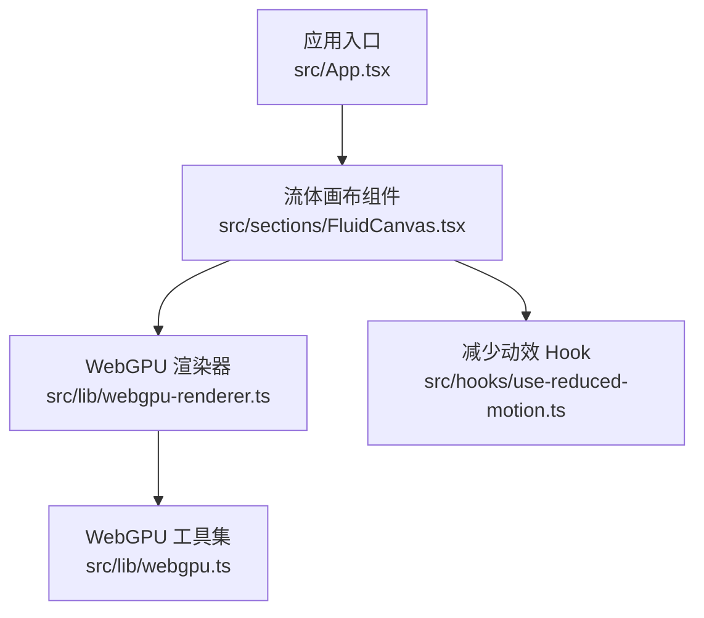
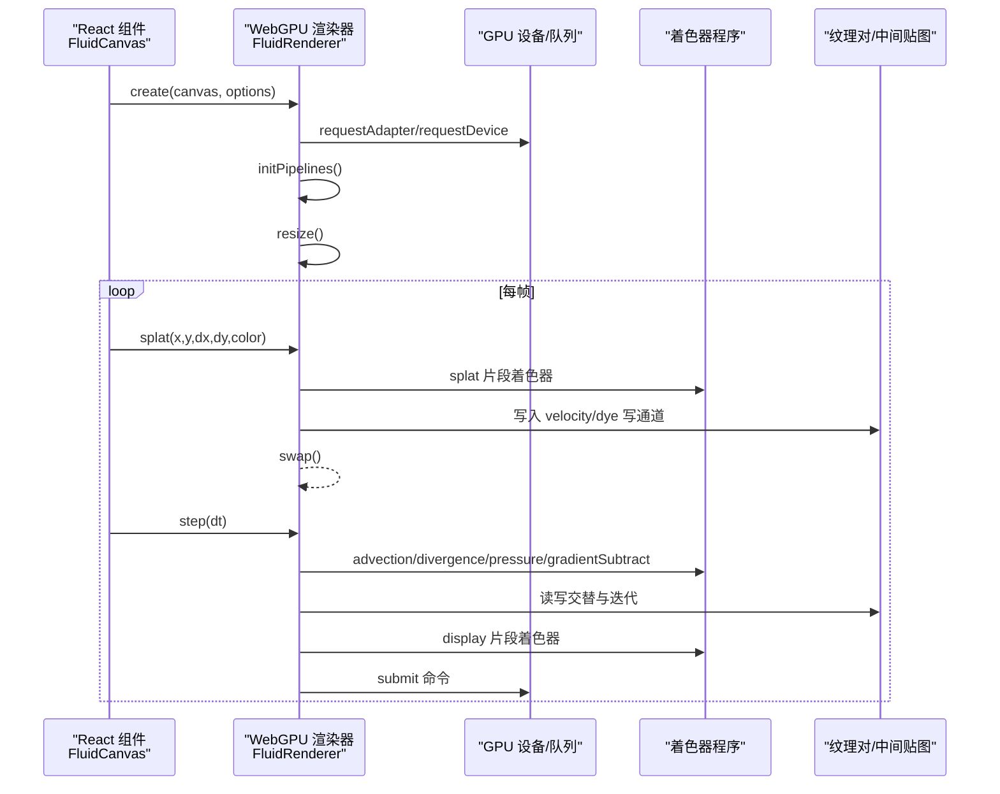
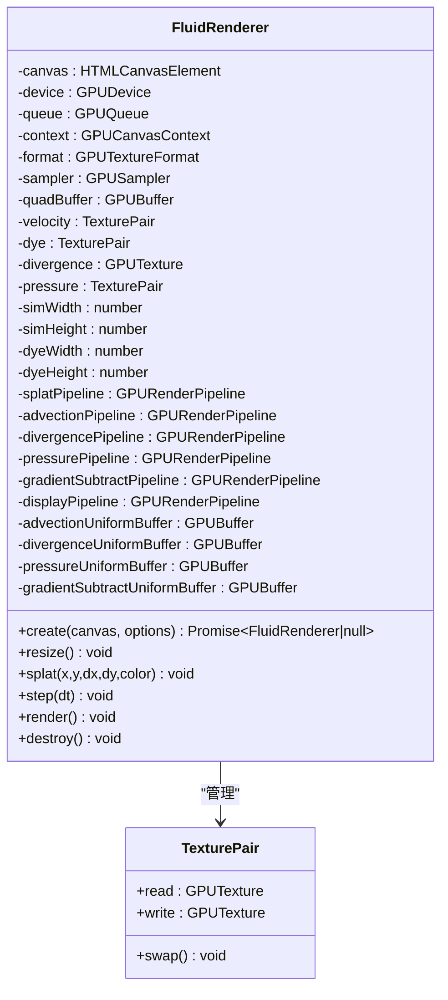
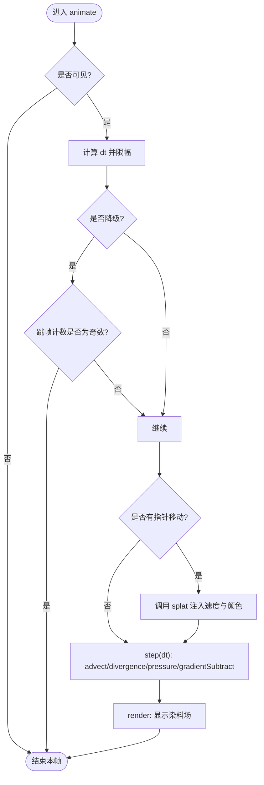
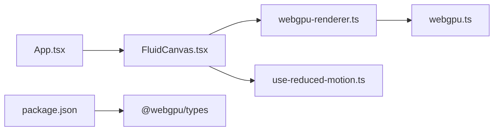

# WebGPU流体动画系统

<cite>
**本文引用的文件**
- [src/lib/webgpu.ts](file://src/lib/webgpu.ts)
- [src/lib/webgpu-renderer.ts](file://src/lib/webgpu-renderer.ts)
- [src/sections/FluidCanvas.tsx](file://src/sections/FluidCanvas.tsx)
- [src/App.tsx](file://src/App.tsx)
- [src/hooks/use-reduced-motion.ts](file://src/hooks/use-reduced-motion.ts)
- [package.json](file://package.json)
- [README.md](file://README.md)
</cite>

## 目录
1. [简介](#简介)
2. [项目结构](#项目结构)
3. [核心组件](#核心组件)
4. [架构总览](#架构总览)
5. [详细组件分析](#详细组件分析)
6. [依赖关系分析](#依赖关系分析)
7. [性能考量](#性能考量)
8. [故障排查指南](#故障排查指南)
9. [结论](#结论)
10. [附录](#附录)

## 简介
本项目在网页端实现了一个高性能的流体动画背景，采用双后端策略：优先使用 WebGPU 进行计算与渲染；若环境不支持则回退到 WebGL。该效果通过经典的不可压 Navier-Stokes 方程求解（平流、散度、压力泊松迭代、梯度减法）驱动速度场与染料场，最终将染料场输出到屏幕形成彩色流体动画。

## 项目结构
- 入口应用层：App 组合页面区块，并将流体画布置于最底层作为背景。
- 流体模块：
  - WebGPU 实现：封装设备初始化、管线创建、纹理对管理、帧循环步骤等。
  - WebGL 回退：在同一组件中内嵌完整的 WebGL 流体实现，保证兼容性。
- 辅助工具：WebGPU 基础能力检测、采样器、全屏四边形、Uniform 缓冲等。
- 可访问性：根据用户“减少动态效果”偏好禁用或降级动画。

图表来源
- [src/App.tsx:1-30](file://src/App.tsx#L1-L30)
- [src/sections/FluidCanvas.tsx:450-496](file://src/sections/FluidCanvas.tsx#L450-L496)
- [src/lib/webgpu-renderer.ts:1-127](file://src/lib/webgpu-renderer.ts#L1-L127)
- [src/lib/webgpu.ts:1-78](file://src/lib/webgpu.ts#L1-L78)
- [src/hooks/use-reduced-motion.ts:1-19](file://src/hooks/use-reduced-motion.ts#L1-L19)

章节来源
- [src/App.tsx:1-30](file://src/App.tsx#L1-L30)
- [README.md:1-73](file://README.md#L1-L73)

## 核心组件
- WebGPU 渲染器类：负责设备上下文、渲染管线、纹理对、Uniform 缓冲、分步模拟与显示绘制。
- WebGPU 工具函数：设备请求、首选格式、采样器、全屏四边形、Uniform 缓冲创建与更新。
- 流体画布组件：React 组件，负责生命周期、交互事件、参数自适应与清理。
- 减少动效 Hook：监听系统级“减少动态效果”设置，控制是否启用动画。

章节来源
- [src/lib/webgpu-renderer.ts:28-124](file://src/lib/webgpu-renderer.ts#L28-L124)
- [src/lib/webgpu.ts:7-78](file://src/lib/webgpu.ts#L7-L78)
- [src/sections/FluidCanvas.tsx:450-496](file://src/sections/FluidCanvas.tsx#L450-L496)
- [src/hooks/use-reduced-motion.ts:1-19](file://src/hooks/use-reduced-motion.ts#L1-L19)

## 架构总览
整体流程：应用启动后，流体画布组件挂载并尝试初始化 WebGPU 渲染器；若失败则回退到内置的 WebGL 实现。每帧执行 splat（可选）、advect、divergence、pressure（多次迭代）、gradient subtract，最后将染料场显示到屏幕。

图表来源
- [src/lib/webgpu-renderer.ts:116-124](file://src/lib/webgpu-renderer.ts#L116-L124)
- [src/lib/webgpu-renderer.ts:126-205](file://src/lib/webgpu-renderer.ts#L126-L205)
- [src/lib/webgpu-renderer.ts:245-269](file://src/lib/webgpu-renderer.ts#L245-L269)
- [src/lib/webgpu-renderer.ts:271-353](file://src/lib/webgpu-renderer.ts#L271-L353)
- [src/lib/webgpu-renderer.ts:355-511](file://src/lib/webgpu-renderer.ts#L355-L511)
- [src/lib/webgpu-renderer.ts:513-541](file://src/lib/webgpu-renderer.ts#L513-L541)

## 详细组件分析

### WebGPU 渲染器（FluidRenderer）
- 职责
  - 初始化 GPU 设备、上下文、首选纹理格式、采样器、全屏四边形顶点缓冲。
  - 创建多套渲染管线：splat、advection、divergence、pressure、gradientSubtract、display。
  - 维护纹理对（velocity、dye、pressure）与中间贴图（divergence），提供 read/write 与 swap。
  - 每帧执行流体模拟步骤与显示绘制。
- 关键数据结构
  - TexturePair：读/写纹理对及交换方法。
  - Uniform 缓冲：advection、divergence、pressure、gradientSubtract 的参数缓冲。
- 算法阶段
  - Splat：向速度与染料场注入局部扰动与颜色。
  - Advection：基于速度场对流速度与染料。
  - Divergence：计算速度场的散度。
  - Pressure：迭代求解压力场以消除散度。
  - Gradient Subtract：从速度场减去压力梯度，得到无散速度场。
  - Display：将染料场映射到屏幕。
- 资源管理
  - 统一按 256 字节对齐分配 Uniform 缓冲，避免跨平台限制。
  - 提供 destroy 释放所有 GPU 资源。

图表来源
- [src/lib/webgpu-renderer.ts:28-124](file://src/lib/webgpu-renderer.ts#L28-L124)
- [src/lib/webgpu-renderer.ts:8-12](file://src/lib/webgpu-renderer.ts#L8-L12)

章节来源
- [src/lib/webgpu-renderer.ts:28-124](file://src/lib/webgpu-renderer.ts#L28-L124)
- [src/lib/webgpu-renderer.ts:126-205](file://src/lib/webgpu-renderer.ts#L126-L205)
- [src/lib/webgpu-renderer.ts:207-269](file://src/lib/webgpu-renderer.ts#L207-L269)
- [src/lib/webgpu-renderer.ts:271-353](file://src/lib/webgpu-renderer.ts#L271-L353)
- [src/lib/webgpu-renderer.ts:355-511](file://src/lib/webgpu-renderer.ts#L355-L511)
- [src/lib/webgpu-renderer.ts:513-541](file://src/lib/webgpu-renderer.ts#L513-L541)
- [src/lib/webgpu-renderer.ts:543-558](file://src/lib/webgpu-renderer.ts#L543-L558)

### WebGPU 工具集
- 能力检测与设备获取：检查 navigator.gpu，请求适配器与设备，返回 adapter/device/queue。
- 首选格式：返回 canvas 首选纹理格式，用于显示阶段。
- 通用资源：采样器、全屏四边形顶点缓冲、Uniform 缓冲创建与更新。

章节来源
- [src/lib/webgpu.ts:7-35](file://src/lib/webgpu.ts#L7-L35)
- [src/lib/webgpu.ts:37-78](file://src/lib/webgpu.ts#L37-L78)

### 流体画布组件（WebGL 回退实现）
- 功能
  - 在 React 组件中直接内嵌完整 WebGL 流体实现，包含着色器、FBO 管理、帧循环与交互。
  - 支持鼠标移动产生 splat，自动调整分辨率与压力迭代次数以适应低端设备。
  - 使用 IntersectionObserver 与 FPS 统计做可见性与性能退化处理。
- 关键点
  - 使用 OES_texture_half_float 扩展提升精度与带宽。
  - DoubleFBO 模式实现读写交替。
  - 当检测到低像素比或低内存时降低 SIM/DYE 分辨率与压力迭代次数。

图表来源
- [src/sections/FluidCanvas.tsx:402-448](file://src/sections/FluidCanvas.tsx#L402-L448)
- [src/sections/FluidCanvas.tsx:327-341](file://src/sections/FluidCanvas.tsx#L327-L341)
- [src/sections/FluidCanvas.tsx:343-379](file://src/sections/FluidCanvas.tsx#L343-L379)
- [src/sections/FluidCanvas.tsx:381-385](file://src/sections/FluidCanvas.tsx#L381-L385)

章节来源
- [src/sections/FluidCanvas.tsx:157-448](file://src/sections/FluidCanvas.tsx#L157-L448)
- [src/sections/FluidCanvas.tsx:450-496](file://src/sections/FluidCanvas.tsx#L450-L496)

### 减少动效 Hook
- 作用：读取系统“减少动态效果”偏好，并在变化时响应更新状态。
- 影响：当开启时，流体画布组件不初始化动画，避免对用户造成不适。

章节来源
- [src/hooks/use-reduced-motion.ts:1-19](file://src/hooks/use-reduced-motion.ts#L1-L19)
- [src/sections/FluidCanvas.tsx:454-460](file://src/sections/FluidCanvas.tsx#L454-L460)

## 依赖关系分析
- 组件耦合
  - App 仅组合页面区块，不直接参与流体逻辑。
  - FluidCanvas 同时承载 WebGPU 与 WebGL 两条路径；当前默认使用 WebGL 回退实现，WebGPU 渲染器已具备但未被组件主动调用。
- 外部依赖
  - @webgpu/types：提供 TypeScript 类型定义，确保 WebGPU API 的类型安全。
  - React、Vite、Tailwind 等构建与样式生态。

图表来源
- [src/App.tsx:1-30](file://src/App.tsx#L1-L30)
- [src/sections/FluidCanvas.tsx:450-496](file://src/sections/FluidCanvas.tsx#L450-L496)
- [src/lib/webgpu-renderer.ts:1-127](file://src/lib/webgpu-renderer.ts#L1-L127)
- [src/lib/webgpu.ts:1-78](file://src/lib/webgpu.ts#L1-L78)
- [package.json:65-66](file://package.json#L65-L66)

章节来源
- [package.json:1-81](file://package.json#L1-L81)

## 性能考量
- 分辨率自适应
  - 根据设备像素比与内存信息降低 SIM/DYE 分辨率与压力迭代次数，保障低端设备流畅度。
- 跳帧与可见性优化
  - 使用 IntersectionObserver 隐藏时暂停渲染；FPS 低于阈值时跳帧以降低负载。
- 纹理与缓冲
  - 使用半浮点纹理扩展（WebGL）或 rgba16float（WebGPU）平衡精度与带宽。
  - Uniform 缓冲按 256 字节对齐，避免跨平台限制。
- 管线复用
  - 预创建渲染管线与全屏四边形缓冲，减少每帧开销。

[本节为通用指导，无需源码引用]

## 故障排查指南
- WebGPU 不可用
  - 现象：无法获取 GPU 设备或适配器。
  - 处理：确认浏览器版本与硬件支持；当前代码已提供能力检测与回退路径。
- 黑屏或无输出
  - 可能原因：未正确配置 Canvas 上下文、纹理格式不匹配、未提交命令。
  - 定位：检查 context.configure、首选格式、submit 调用链。
- 性能抖动
  - 可能原因：分辨率过高、压力迭代过多、频繁创建临时缓冲。
  - 建议：降低 SIM/DYE 分辨率与压力迭代次数；复用 Uniform 缓冲；减少每帧对象分配。
- 移动端发热
  - 建议：启用减少动效、降低分辨率、增加跳帧频率。

章节来源
- [src/lib/webgpu.ts:7-35](file://src/lib/webgpu.ts#L7-L35)
- [src/lib/webgpu-renderer.ts:116-124](file://src/lib/webgpu-renderer.ts#L116-L124)
- [src/lib/webgpu-renderer.ts:106-114](file://src/lib/webgpu-renderer.ts#L106-L114)
- [src/sections/FluidCanvas.tsx:402-448](file://src/sections/FluidCanvas.tsx#L402-L448)

## 结论
该项目实现了高可用的流体动画背景，具备 WebGPU 优先与 WebGL 回退的双后端策略，并通过分辨率自适应、跳帧与可见性优化等手段兼顾了视觉表现与性能。未来可在以下方面增强：
- 在 FluidCanvas 中集成 WebGPU 渲染器的创建与调用，实现真正的 WebGPU 主路径。
- 引入更细粒度的质量档位与运行时切换。
- 增加调试可视化（如速度场、压力场）以便调参与问题定位。

[本节为总结，无需源码引用]

## 附录
- 开发脚本与环境
  - 安装依赖、启动开发服务器、构建与预览命令见 README。
- 技术栈概览
  - React 19、TypeScript、Vite 7、Tailwind CSS 3、shadcn/ui、Lucide React。

章节来源
- [README.md:29-43](file://README.md#L29-L43)
- [README.md:20-28](file://README.md#L20-L28)