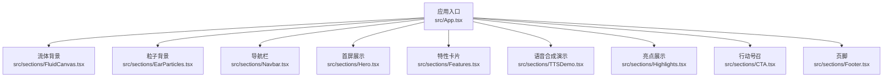
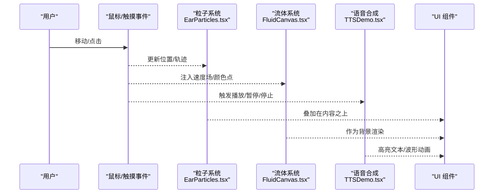
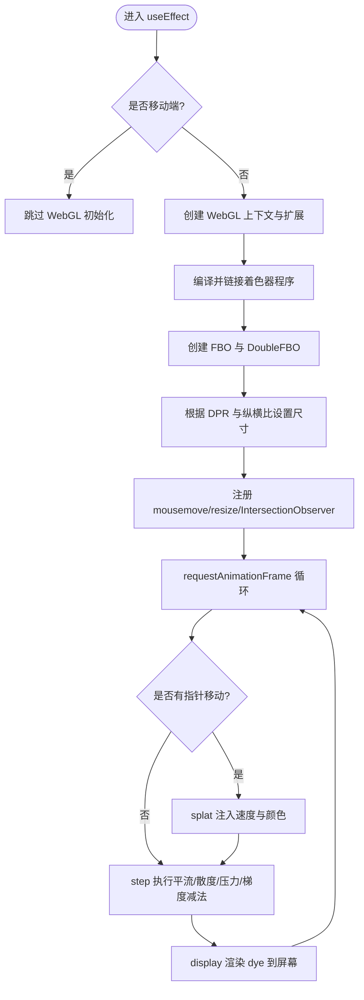
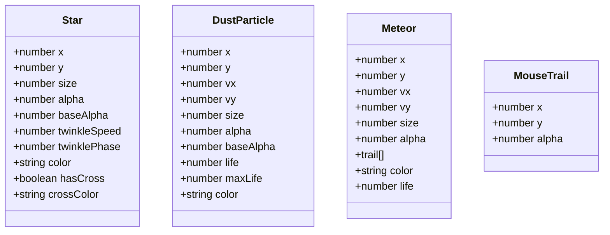
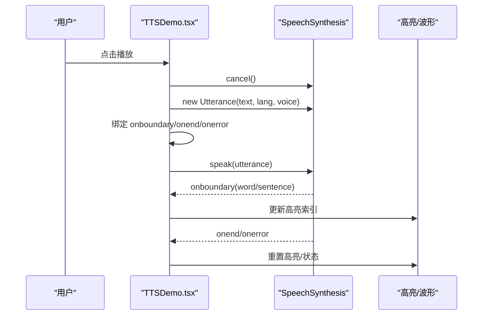
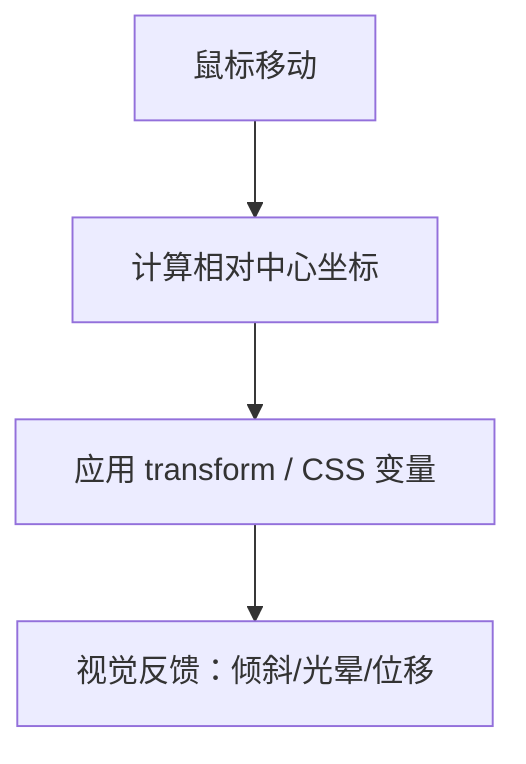
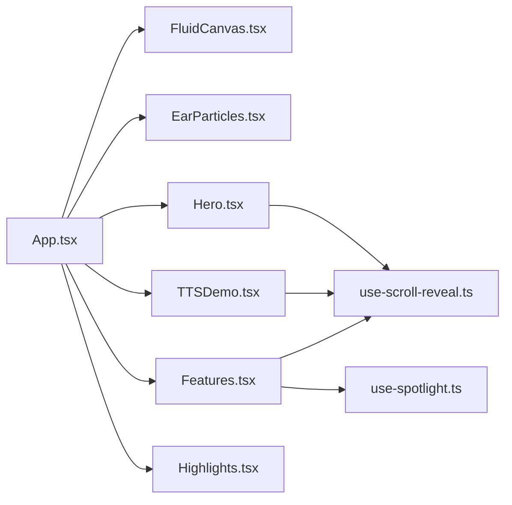

# 核心功能模块

<cite>
**本文引用的文件**   
- [App.tsx](file://src/App.tsx)
- [FluidCanvas.tsx](file://src/sections/FluidCanvas.tsx)
- [EarParticles.tsx](file://src/sections/EarParticles.tsx)
- [TTSDemo.tsx](file://src/sections/TTSDemo.tsx)
- [Hero.tsx](file://src/sections/Hero.tsx)
- [Features.tsx](file://src/sections/Features.tsx)
- [Highlights.tsx](file://src/sections/Highlights.tsx)
- [use-magnetic.ts](file://src/hooks/use-magnetic.ts)
- [use-spotlight.ts](file://src/hooks/use-spotlight.ts)
- [use-scroll-reveal.ts](file://src/hooks/use-scroll-reveal.ts)
- [package.json](file://package.json)
</cite>

## 目录
1. [简介](#简介)
2. [项目结构](#项目结构)
3. [核心组件](#核心组件)
4. [架构总览](#架构总览)
5. [详细组件分析](#详细组件分析)
6. [依赖关系分析](#依赖关系分析)
7. [性能考量](#性能考量)
8. [故障排查指南](#故障排查指南)
9. [结论](#结论)
10. [附录：使用模式与最佳实践](#附录使用模式与最佳实践)

## 简介
本文件面向挠荔枝官网的核心可视化与交互能力，系统性梳理以下四大模块：
- WebGL 流体动画系统（背景流体）
- Canvas 粒子系统（星空、光粒、流星、鼠标轨迹）
- 语音合成演示（Web Speech API）
- 3D 交互效果（倾斜卡片、聚光灯、磁性按钮）

文档将解释每个功能的实现原理、技术选型、集成方式、数据流向与优化策略，并提供可操作的调试技巧与最佳实践。内容兼顾初学者友好与资深开发者的深度需求。

## 项目结构
整体采用 React + Vite + Tailwind 的轻量前端架构，页面由多个“区块”组件组合而成，底层提供两个全屏渲染层：WebGL 流体与 Canvas 粒子，上层为业务内容与交互。

图表来源
- [App.tsx:1-30](file://src/App.tsx#L1-L30)

章节来源
- [App.tsx:1-30](file://src/App.tsx#L1-L30)

## 核心组件
- WebGL 流体动画：基于 WebGL 的 Navier-Stokes 流体模拟，通过 FBO 双缓冲与多阶段着色器完成平流、散度、压力求解与梯度减法，最终输出到屏幕。
- Canvas 粒子系统：纯 2D Canvas 绘制，包含星空闪烁、光粒布朗运动、流星拖尾、鼠标柔光跟随与轨迹衰减。
- 语音合成演示：基于 Web Speech API，支持多语言、声音选择、实时高亮、播放控制与波形动画。
- 3D 交互效果：Hero 区域 3D 倾斜卡片；Features 卡片聚光灯跟随；磁性按钮 Hook。

章节来源
- [FluidCanvas.tsx:1-470](file://src/sections/FluidCanvas.tsx#L1-L470)
- [EarParticles.tsx:1-560](file://src/sections/EarParticles.tsx#L1-L560)
- [TTSDemo.tsx:1-344](file://src/sections/TTSDemo.tsx#L1-L344)
- [Hero.tsx:1-141](file://src/sections/Hero.tsx#L1-L141)
- [Features.tsx:1-91](file://src/sections/Features.tsx#L1-L91)
- [use-magnetic.ts:1-32](file://src/hooks/use-magnetic.ts#L1-L32)
- [use-spotlight.ts:1-21](file://src/hooks/use-spotlight.ts#L1-L21)

## 架构总览
从渲染层次看，页面自底向上分为三层：
- 渲染层：WebGL 流体（最底层）、Canvas 粒子（中间层），两者均固定定位覆盖全屏，pointer-events-none 避免遮挡交互。
- UI 层：各区块组件（Hero、Features、TTSDemo 等），承载业务信息与交互。
- 交互层：鼠标/触摸事件驱动粒子与流体，Hook 提供通用交互能力。

图表来源
- [EarParticles.tsx:1-560](file://src/sections/EarParticles.tsx#L1-L560)
- [FluidCanvas.tsx:1-470](file://src/sections/FluidCanvas.tsx#L1-L470)
- [TTSDemo.tsx:1-344](file://src/sections/TTSDemo.tsx#L1-L344)

## 详细组件分析

### WebGL 流体动画系统
- 实现原理
  - 使用 WebGL 扩展 OES_texture_half_float 提升浮点精度与带宽效率。
  - 多阶段着色器流水线：Splat（注入速度与颜色）、Advection（平流）、Divergence（散度）、Pressure（Jacobi 迭代求解压力）、Gradient Subtract（梯度减法得到无散度速度场）、Display（显示）。
  - 双缓冲 FBO 读写交替，避免同步冲突。
  - 分辨率自适应：根据设备像素比与纵横比计算仿真与染料分辨率。
  - 不可见时暂停：IntersectionObserver 检测视口可见性，减少 CPU/GPU 消耗。
- 关键数据结构
  - DoubleFBO：read/write 双缓冲，swap 交换读写字面量。
  - Program：封装 program 与 uniforms，统一 bind。
- 数据流向
  - 鼠标移动 → splat 写入 velocity/dye → step 执行平流/散度/压力/梯度减法 → render 输出 dye 纹理到屏幕。
- 性能要点
  - 移动端降级：小于阈值直接不启用 WebGL。
  - 限制 DPR 上限，降低高分屏开销。
  - 半浮点纹理与 NEAREST/LINEAR 混合采样平衡质量与性能。
  - 不可见时跳过帧调度。

图表来源
- [FluidCanvas.tsx:153-470](file://src/sections/FluidCanvas.tsx#L153-L470)

章节来源
- [FluidCanvas.tsx:1-470](file://src/sections/FluidCanvas.tsx#L1-L470)

### Canvas 粒子系统
- 实现原理
  - 星空：随机分布、正弦函数驱动的闪烁、十字星芒与光晕。
  - 光粒：布朗运动、边界循环、生命周期淡入淡出；桌面端受鼠标引力影响，移动端微风漂移。
  - 流星：周期性生成，带拖尾数组记录历史位置，头部径向渐变。
  - 鼠标轨迹：沿路径插值生成若干点，随时间衰减透明度，形成收束感。
  - 鼠标柔光：lerp 平滑跟随，产生延迟流体感。
- 关键数据结构
  - Star/DustParticle/Meteor/MouseTrail：描述粒子状态与生命周期。
- 数据流向
  - 事件更新坐标 → 物理模型更新位置/速度/透明度 → 分层绘制（光粒→流星→星空→轨迹→柔光）。
- 性能要点
  - IntersectionObserver 不可见时跳过绘制但保持调度，保证响应。
  - 移动端简化绘制（仅圆点），减少渐变与复杂路径。
  - 限制拖尾长度与数量，避免内存增长。

图表来源
- [EarParticles.tsx:1-120](file://src/sections/EarParticles.tsx#L1-L120)

章节来源
- [EarParticles.tsx:1-560](file://src/sections/EarParticles.tsx#L1-L560)

### 语音合成演示
- 实现原理
  - 使用 window.speechSynthesis 与 SpeechSynthesisUtterance 进行朗读。
  - 动态加载 voices，按语言过滤并自动选择高质量声音（名称匹配关键词）。
  - onboundary 事件驱动逐词/句高亮，onend/onerror 重置状态。
  - 播放控制：开始、暂停/继续、停止；波形动画通过 key 重渲染触发 CSS 动画。
- 关键数据结构
  - PRESETS：预设文本与语言。
  - VOICE_QUALITY_HINTS：用于挑选更高质量声音的关键词集合。
- 数据流向
  - 用户选择语言/声音 → 构建 Utterance → 绑定事件 → speak/pause/resume/cancel → UI 高亮与波形联动。
- 兼容性处理
  - 检测 speechSynthesis 可用性，不支持时给出提示。
  - 组件卸载时 cancel 清理，防止后台持续播放。

图表来源
- [TTSDemo.tsx:100-180](file://src/sections/TTSDemo.tsx#L100-L180)

章节来源
- [TTSDemo.tsx:1-344](file://src/sections/TTSDemo.tsx#L1-L344)

### 3D 交互效果
- Hero 3D 倾斜卡片
  - 计算鼠标相对中心归一化坐标，映射为 rotateX/rotateY 角度，配合 perspective 营造空间感。
- 聚光灯卡片（Features）
  - useSpotlight Hook 将鼠标位置写入 CSS 变量 --x/--y，CSS 中用 radial-gradient 实现跟随光晕。
- 磁性按钮（useMagnetic）
  - 计算元素中心与鼠标偏移，transform translate 实现吸引效果。

图表来源
- [Hero.tsx:7-20](file://src/sections/Hero.tsx#L7-L20)
- [use-spotlight.ts:8-20](file://src/hooks/use-spotlight.ts#L8-L20)
- [use-magnetic.ts:7-31](file://src/hooks/use-magnetic.ts#L7-L31)

章节来源
- [Hero.tsx:1-141](file://src/sections/Hero.tsx#L1-L141)
- [Features.tsx:1-91](file://src/sections/Features.tsx#L1-L91)
- [use-spotlight.ts:1-21](file://src/hooks/use-spotlight.ts#L1-L21)
- [use-magnetic.ts:1-32](file://src/hooks/use-magnetic.ts#L1-L32)

## 依赖关系分析
- 组件耦合
  - App 聚合所有区块，低耦合、高内聚。
  - 流体与粒子独立运行，互不依赖，通过 DOM 层级叠加。
  - TTSDemo 依赖浏览器原生 API，不引入第三方库。
- 外部依赖
  - React、Tailwind、Lucide 图标、Radix UI 等，来自 package.json。
- 潜在循环依赖
  - 当前结构未见循环引用，均为单向导入。

图表来源
- [App.tsx:1-30](file://src/App.tsx#L1-L30)
- [Features.tsx:1-91](file://src/sections/Features.tsx#L1-L91)
- [TTSDemo.tsx:1-344](file://src/sections/TTSDemo.tsx#L1-L344)
- [use-spotlight.ts:1-21](file://src/hooks/use-spotlight.ts#L1-L21)
- [use-scroll-reveal.ts:1-34](file://src/hooks/use-scroll-reveal.ts#L1-L34)

章节来源
- [package.json:1-80](file://package.json#L1-L80)
- [App.tsx:1-30](file://src/App.tsx#L1-L30)

## 性能考量
- WebGL 流体
  - 移动端禁用或降低分辨率；限制 DPR 上限；使用半浮点纹理；不可见时暂停。
  - 建议：根据设备能力动态调整 PRESSURE_ITERATIONS、SIM_RESOLUTION、DYE_RESOLUTION。
- Canvas 粒子
  - 移动端简化绘制；限制拖尾长度与数量；不可见时跳过绘制。
  - 建议：对大场景使用离屏缓存或分块渲染；减少每帧对象分配。
- 语音合成
  - 避免频繁重建 Utterance；在输入变化时及时 cancel；按需加载 voices。
  - 建议：预取高质量声音列表，缓存结果；长文本分段朗读以减少卡顿。
- 通用
  - 使用 requestAnimationFrame 节流；IntersectionObserver 控制可见性；避免主线程阻塞。

[本节为通用指导，无需具体文件分析]

## 故障排查指南
- WebGL 流体无法启动
  - 检查 getContext("webgl") 返回值与 OES_texture_half_float 扩展是否可用。
  - 确认 shader 编译与 program link 成功；打印 gl.getError 辅助定位。
  - 参考路径：[FluidCanvas.tsx:174-213](file://src/sections/FluidCanvas.tsx#L174-L213)
- 粒子系统掉帧
  - 检查是否在不可见区域仍大量绘制；确认 IntersectionObserver 生效。
  - 检查拖尾数组是否无限增长；确保有上限与清理逻辑。
  - 参考路径：[EarParticles.tsx:116-126](file://src/sections/EarParticles.tsx#L116-L126)、[EarParticles.tsx:508-518](file://src/sections/EarParticles.tsx#L508-L518)
- 语音合成无声音
  - 检查浏览器是否支持 speechSynthesis；voices 是否异步加载完成。
  - 确认 selectedVoiceURI 对应有效 voice；必要时回退到默认声音。
  - 参考路径：[TTSDemo.tsx:56-91](file://src/sections/TTSDemo.tsx#L56-L91)、[TTSDemo.tsx:100-137](file://src/sections/TTSDemo.tsx#L100-L137)
- 3D 交互异常
  - 检查 getBoundingClientRect 与 pointer 坐标转换是否正确；确保 transform 未被其他样式覆盖。
  - 参考路径：[Hero.tsx:7-20](file://src/sections/Hero.tsx#L7-L20)、[use-spotlight.ts:11-17](file://src/hooks/use-spotlight.ts#L11-L17)

章节来源
- [FluidCanvas.tsx:174-213](file://src/sections/FluidCanvas.tsx#L174-L213)
- [EarParticles.tsx:116-126](file://src/sections/EarParticles.tsx#L116-L126)
- [EarParticles.tsx:508-518](file://src/sections/EarParticles.tsx#L508-L518)
- [TTSDemo.tsx:56-91](file://src/sections/TTSDemo.tsx#L56-L91)
- [TTSDemo.tsx:100-137](file://src/sections/TTSDemo.tsx#L100-L137)
- [Hero.tsx:7-20](file://src/sections/Hero.tsx#L7-L20)
- [use-spotlight.ts:11-17](file://src/hooks/use-spotlight.ts#L11-L17)

## 结论
本项目以“双层渲染 + 模块化 UI”的方式实现了流畅的沉浸式体验：WebGL 流体提供高级背景动效，Canvas 粒子增强氛围与互动，语音合成演示直观展示产品能力，3D 交互提升页面质感。通过合理的性能策略与清晰的依赖组织，系统在易用性与可扩展性之间取得良好平衡。

[本节为总结，无需具体文件分析]

## 附录：使用模式与最佳实践
- 集成方式
  - 在 App 根组件中按顺序挂载流体与粒子，确保它们位于内容之下且 pointer-events-none。
  - 将交互 Hook（磁性、聚光灯、滚动揭示）复用至相应组件，避免重复实现。
- 使用模式示例（路径指引）
  - 流体参数调优：[FluidCanvas.tsx:164-172](file://src/sections/FluidCanvas.tsx#L164-L172)
  - 粒子密度与行为：[EarParticles.tsx:54-66](file://src/sections/EarParticles.tsx#L54-L66)
  - 语音合成控制流程：[TTSDemo.tsx:100-157](file://src/sections/TTSDemo.tsx#L100-L157)
  - 3D 倾斜与光晕：[Hero.tsx:7-20](file://src/sections/Hero.tsx#L7-L20)、[Features.tsx:34-61](file://src/sections/Features.tsx#L34-L61)
- 最佳实践
  - 始终为重型渲染增加可见性检测与降级策略。
  - 对高频事件使用 passive 监听与节流/防抖。
  - 优先使用 CSS 变量与 GPU 加速属性（transform、opacity）减少重排重绘。
  - 对语音合成做兼容性与错误边界处理，保障用户体验。

[本节为通用指导，无需具体文件分析]