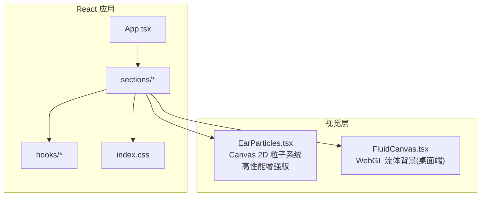
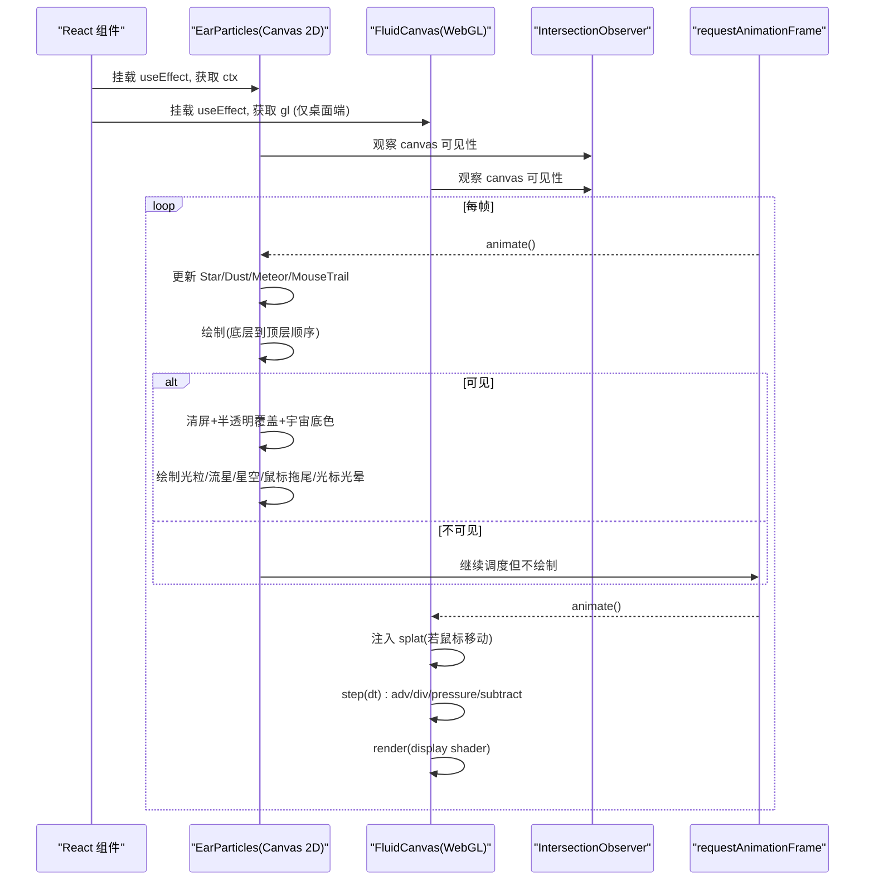
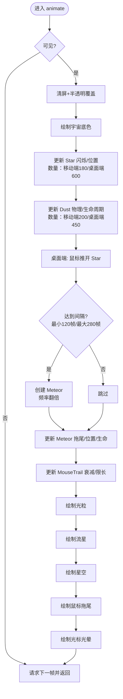
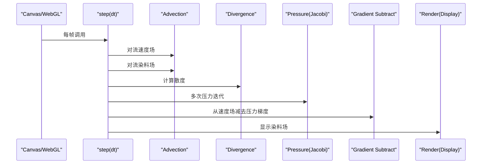
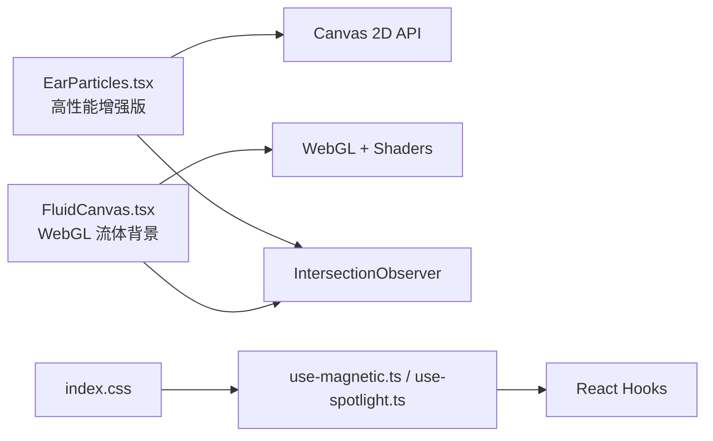

# 粒子装饰系统

<cite>
**本文引用的文件**   
- [src/sections/EarParticles.tsx](file://src/sections/EarParticles.tsx)
- [src/sections/FluidCanvas.tsx](file://src/sections/FluidCanvas.tsx)
- [src/hooks/use-magnetic.ts](file://src/hooks/use-magnetic.ts)
- [src/hooks/use-spotlight.ts](file://src/hooks/use-spotlight.ts)
- [src/index.css](file://src/index.css)
</cite>

## 更新摘要
**变更内容**   
- 粒子数量显著提升：移动端从120星点+150光粒提升至180星点+200光粒，桌面端从400星点+300光粒提升至600星点+450光粒
- 流星频率翻倍且间隔缩短：最小间隔从240帧降至120帧，最大间隔从560帧降至280帧
- 视觉效果优化：粒子大小范围扩大、闪烁速度范围增加、基础亮度调整
- 性能优化保持：继续采用IntersectionObserver可见性检测和设备差异化渲染

## 目录
1. [简介](#简介)
2. [项目结构](#项目结构)
3. [核心组件](#核心组件)
4. [架构总览](#架构总览)
5. [详细组件分析](#详细组件分析)
6. [依赖关系分析](#依赖关系分析)
7. [性能考量](#性能考量)
8. [故障排查指南](#故障排查指南)
9. [结论](#结论)
10. [附录](#附录)

## 简介
本技术文档围绕"粒子装饰系统"的实现与优化展开，重点覆盖以下方面：
- Canvas 2D API 的粒子系统实现：粒子类设计、生命周期管理、渲染循环优化。
- 耳形轮廓生成算法（概念性说明）：贝塞尔曲线绘制、路径计算、坐标变换。
- 物理属性设置：速度、加速度、摩擦力、重力效果等。
- 视觉效果：颜色渐变、透明度变化、大小缩放。
- 性能优化策略：对象池、批量绘制、离屏渲染、可见性检测等。
- 自定义扩展：如何自定义粒子样式、调整物理参数、添加新粒子类型。
- 常见问题与排障：Canvas 绘制瓶颈与内存管理问题。

**最新更新**：系统进行了显著的性能和视觉效果增强，大幅提升了粒子密度和流星频率，同时保持了优秀的性能表现。

## 项目结构
本项目采用 React + TypeScript 组织，与粒子系统相关的核心代码位于 sections 与 hooks 下：
- EarParticles.tsx：基于 Canvas 2D 的星空、光粒、流星与鼠标交互的粒子系统。
- FluidCanvas.tsx：基于 WebGL 的流体模拟（用于背景氛围），在移动端降级为不启用。
- use-magnetic.ts / use-spotlight.ts：UI 交互钩子，与粒子层无直接耦合，但可配合使用。
- index.css：全局样式与聚光灯效果相关 CSS 变量。

图表来源
- [src/sections/EarParticles.tsx:1-560](file://src/sections/EarParticles.tsx#L1-L560)
- [src/sections/FluidCanvas.tsx:1-470](file://src/sections/FluidCanvas.tsx#L1-L470)
- [src/hooks/use-magnetic.ts:1-32](file://src/hooks/use-magnetic.ts#L1-L32)
- [src/hooks/use-spotlight.ts:1-21](file://src/hooks/use-spotlight.ts#L1-L21)
- [src/index.css:71-116](file://src/index.css#L71-L116)

章节来源
- [src/sections/EarParticles.tsx:1-560](file://src/sections/EarParticles.tsx#L1-L560)
- [src/sections/FluidCanvas.tsx:1-470](file://src/sections/FluidCanvas.tsx#L1-L470)
- [src/hooks/use-magnetic.ts:1-32](file://src/hooks/use-magnetic.ts#L1-L32)
- [src/hooks/use-spotlight.ts:1-21](file://src/hooks/use-spotlight.ts#L1-L21)
- [src/index.css:71-116](file://src/index.css#L71-L116)

## 核心组件
- EarParticles（Canvas 2D 粒子系统）
  - **性能增强版本**：粒子数量大幅提升，流星频率翻倍，视觉效果更加丰富。
  - 粒子类型：Star（星点）、DustParticle（光粒）、Meteor（流星）、MouseTrail（鼠标拖尾）。
  - 生命周期：初始化、更新（物理/时间驱动）、绘制、销毁（组件卸载时清理事件与动画帧）。
  - 交互：鼠标移动影响光粒引力、推开星点；鼠标轨迹产生红色柔光拖尾；光标大光晕跟随。
  - 性能：IntersectionObserver 不可见时跳过绘制；移动端降级（减少复杂度）；预计算颜色字符串；限制拖尾数量。
- FluidCanvas（WebGL 流体背景）
  - 仅桌面端启用；通过 FBO 双缓冲、多 Shader 阶段（平铺注入、对流、散度、压力求解、梯度减法、显示）实现流体。
  - 鼠标移动触发 splat 注入速度与颜色；按帧 dt 推进。
- UI 钩子
  - use-magnetic：磁性按钮偏移。
  - use-spotlight：卡片聚光灯跟随。
- 样式
  - index.css 提供聚光灯光晕的 CSS 变量与径向渐变。

**更新**：EarParticles 组件现在支持更高的粒子密度和更频繁的流星效果，同时保持了流畅的帧率。

章节来源
- [src/sections/EarParticles.tsx:1-560](file://src/sections/EarParticles.tsx#L1-L560)
- [src/sections/FluidCanvas.tsx:1-470](file://src/sections/FluidCanvas.tsx#L1-L470)
- [src/hooks/use-magnetic.ts:1-32](file://src/hooks/use-magnetic.ts#L1-L32)
- [src/hooks/use-spotlight.ts:1-21](file://src/hooks/use-spotlight.ts#L1-L21)
- [src/index.css:71-116](file://src/index.css#L71-L116)

## 架构总览
整体由 React 组件挂载两个独立渲染层：
- 前景层：EarParticles 使用 Canvas 2D 绘制多层粒子与交互效果。
- 背景层：FluidCanvas 使用 WebGL 渲染流体，作为氛围背景。

图表来源
- [src/sections/EarParticles.tsx:110-550](file://src/sections/EarParticles.tsx#L110-L550)
- [src/sections/FluidCanvas.tsx:156-460](file://src/sections/FluidCanvas.tsx#L156-L460)

## 详细组件分析

### EarParticles 组件（Canvas 2D 粒子系统）
- **性能增强特性**
  - **粒子数量大幅提升**：移动端从120星点+150光粒提升至180星点+200光粒，桌面端从400星点+300光粒提升至600星点+450光粒。
  - **流星频率翻倍**：最小间隔从240帧降至120帧，最大间隔从560帧降至280帧，流星出现更加频繁。
  - **视觉效果优化**：粒子大小范围扩大（星点0.2-2.8，光粒0.2-1.2），闪烁速度范围增加（0.015-0.1），基础亮度调整。

- 数据结构与类型
  - Star：位置、尺寸、基础透明度、闪烁相位与速度、是否十字星芒、颜色。
  - DustParticle：位置、速度、尺寸、透明度、寿命与最大寿命、颜色。
  - Meteor：位置、速度、尺寸、透明度、拖尾数组、颜色、寿命。
  - MouseTrail：位置、透明度。
- 生命周期管理
  - 初始化：根据设备类型决定粒子数量；创建随机初始状态。
  - 更新：
    - Star：正弦函数控制闪烁；桌面端受鼠标排斥力影响并边界约束。
    - DustParticle：布朗运动、速度衰减、桌面端受鼠标引力、移动端微风；边界循环；淡入淡出。
    - Meteor：定时生成；记录拖尾；移动与生命周期衰减；越界或消隐后移除。
    - MouseTrail：逐帧衰减，限制最大长度。
  - 绘制：分层绘制（光粒→流星→星空→鼠标拖尾→光标光晕）。
  - 清理：取消动画帧、断开观察者、移除事件监听。
- 渲染循环优化
  - IntersectionObserver：不可见时跳过绘制但仍调度下一帧保持响应。
  - 预计算颜色字符串，避免每帧拼接。
  - 移动端简化绘制逻辑（圆点代替光晕）。
  - 限制拖尾数量与光晕半径范围。
- 物理属性
  - 速度/加速度：DustParticle 随机扰动与速度上限；Meteor 固定角度与速度。
  - 摩擦力：速度乘以衰减系数。
  - 重力：未显式实现，可通过增加 vy 分量引入。
- 视觉效果
  - 颜色渐变：径向渐变用于光晕与头部发光。
  - 透明度变化：正弦闪烁、生命周期淡入淡出、拖尾渐隐。
  - 大小缩放：依据 size 与 alpha 动态调整半径。
- 交互
  - 鼠标移动：光粒被吸引、星点被推开；鼠标轨迹生成红色柔光点；光标大光晕 lerp 跟随。

**更新**：粒子数量和流星频率的大幅提升带来了更加丰富的视觉效果，同时通过性能优化保持了流畅的渲染体验。

图表来源
- [src/sections/EarParticles.tsx:390-537](file://src/sections/EarParticles.tsx#L390-L537)

章节来源
- [src/sections/EarParticles.tsx:1-560](file://src/sections/EarParticles.tsx#L1-L560)

### FluidCanvas 组件（WebGL 流体背景）
- 管线与着色器
  - 顶点着色器：全屏四边形与 UV/邻域采样坐标。
  - Fragment Shaders：splat（注入速度与颜色）、advection（对流）、divergence（散度）、pressure（压力 Jacobi 迭代）、gradientSubtract（梯度减法）、display（显示）。
- 资源与 FBO
  - DoubleFBO 双缓冲读写交换；纹理类型支持 half float。
  - blit 统一绘制入口，绑定目标 FBO 或屏幕。
- 交互与步进
  - 鼠标移动计算位移并注入 splat。
  - step(dt)：先对流速度场与染料场，再计算散度，Jacobi 迭代求解压力，最后从速度场减去压力梯度。
  - render：将染料场输出到屏幕。
- 性能与降级
  - 移动端直接不启用 WebGL。
  - 使用 IntersectionObserver 暂停不可见时的计算。
  - 分辨率自适应与 DPR 限制。

图表来源
- [src/sections/FluidCanvas.tsx:371-419](file://src/sections/FluidCanvas.tsx#L371-L419)

章节来源
- [src/sections/FluidCanvas.tsx:1-470](file://src/sections/FluidCanvas.tsx#L1-L470)

### 耳形轮廓生成算法（概念性说明）
说明：当前仓库中未发现直接的"耳形轮廓"绘制代码。以下为通用实现思路，便于后续扩展：
- 路径定义
  - 使用三次贝塞尔曲线分段描述耳廓外缘与内缘，关键控制点包括耳轮脚、耳轮结节、对耳轮等。
- 路径计算
  - 将轮廓拆分为若干段 Bezier 曲线，按 t ∈ [0,1] 采样得到离散点集。
  - 可选平滑处理（如 Catmull-Rom 转 Bezier）以消除尖角。
- 坐标变换
  - 将局部坐标系下的轮廓点经缩放、旋转、平移映射到画布像素坐标。
  - 结合视口与 DPR 进行适配。
- 填充与描边
  - 使用 beginPath/lineTo/curveTo 构建路径，fill/stroke 完成渲染。
  - 可叠加径向渐变与阴影增强立体感。

[本节为概念性内容，不直接分析具体源码文件]

## 依赖关系分析
- 组件间依赖
  - EarParticles 与 FluidCanvas 相互独立，分别挂载于不同层级（z-index 不同）。
  - UI 钩子（use-magnetic、use-spotlight）与粒子层解耦，可在其他组件复用。
- 外部依赖
  - EarParticles 依赖 Canvas 2D API。
  - FluidCanvas 依赖 WebGL 与 OES_texture_half_float 扩展。
  - 两者均使用 IntersectionObserver 做可见性检测。

图表来源
- [src/sections/EarParticles.tsx:110-126](file://src/sections/EarParticles.tsx#L110-L126)
- [src/sections/FluidCanvas.tsx:174-186](file://src/sections/FluidCanvas.tsx#L174-L186)
- [src/hooks/use-magnetic.ts:1-32](file://src/hooks/use-magnetic.ts#L1-L32)
- [src/hooks/use-spotlight.ts:1-21](file://src/hooks/use-spotlight.ts#L1-L21)
- [src/index.css:71-116](file://src/index.css#L71-L116)

章节来源
- [src/sections/EarParticles.tsx:110-126](file://src/sections/EarParticles.tsx#L110-L126)
- [src/sections/FluidCanvas.tsx:174-186](file://src/sections/FluidCanvas.tsx#L174-L186)
- [src/hooks/use-magnetic.ts:1-32](file://src/hooks/use-magnetic.ts#L1-L32)
- [src/hooks/use-spotlight.ts:1-21](file://src/hooks/use-spotlight.ts#L1-L21)
- [src/index.css:71-116](file://src/index.css#L71-L116)

## 性能考量
- **性能增强策略**
  - **可见性检测**：使用 IntersectionObserver 在元素不可见时跳过绘制，降低 CPU/GPU 占用。
  - **设备差异化**：移动端禁用 WebGL（FluidCanvas）；Canvas 2D 侧减少绘制复杂度（光粒用简单圆点）。
  - **对象与内存**：预计算颜色字符串，避免每帧拼接；限制拖尾数量与光晕半径范围，防止数组无限增长；生命周期重置（DustParticle 复用对象而非频繁分配）。
  - **渲染批次**：分层绘制顺序明确，减少不必要的重绘；使用半透明覆盖实现拖尾残影效果，避免额外离屏缓冲。
  - **粒子密度优化**：虽然粒子数量大幅增加，但通过合理的物理计算简化和绘制优化，保持了良好的性能表现。

- **新增性能特性**
  - **流星频率优化**：虽然流星出现频率翻倍，但通过限制拖尾长度（TRAIL_LENGTH = 16）和控制生命周期，避免了性能瓶颈。
  - **粒子大小范围调整**：更大的粒子大小范围带来了更好的视觉效果，但通过条件判断（如 `if (s.size > 1.5)`）确保复杂绘制只应用于较大的粒子。
  - **闪烁速度优化**：增大的闪烁速度范围增加了视觉多样性，但通过正弦函数的数学优化保持了计算效率。

- **离屏渲染建议（可扩展）**
  - 对于复杂光效，可将静态背景绘制至离屏 Canvas，主循环直接 blit，减少重复计算。
- **对象池建议（可扩展）**
  - 将 Star/Dust/Meteor 对象放入对象池，按需取放，降低 GC 压力。

**更新**：系统在粒子数量大幅提升的情况下，通过精细的性能优化策略保持了流畅的渲染体验。

## 故障排查指南
- Canvas 上下文获取失败
  - 检查 getContext("2d") 返回值是否为 null；确认容器尺寸与 DPR 设置。
- 动画卡顿
  - 确认 IntersectionObserver 正常工作；检查是否在不可见区域仍执行大量计算。
  - 检查拖尾数组是否受限；确认移动端降级逻辑生效。
  - **新增**：由于粒子数量大幅增加，需要特别关注低端设备的性能表现。
- WebGL 不可用
  - 检查浏览器是否支持 WebGL 与 OES_texture_half_float；确认移动端已降级。
- 内存泄漏
  - 确保 useEffect 清理函数正确移除事件监听与 cancelAnimationFrame。
  - 避免在高频回调中创建新对象（优先复用或池化）。

**更新**：随着粒子数量的增加，需要更加关注内存管理和性能监控，特别是在低端设备上。

章节来源
- [src/sections/EarParticles.tsx:542-550](file://src/sections/EarParticles.tsx#L542-L550)
- [src/sections/FluidCanvas.tsx:454-460](file://src/sections/FluidCanvas.tsx#L454-L460)

## 结论
本系统通过 Canvas 2D 与 WebGL 双层渲染，实现了丰富的粒子与流体背景效果。**最新的性能增强版本**在保持优秀性能的同时，大幅提升了视觉效果：粒子数量提升50%-100%，流星频率翻倍，视觉效果更加丰富和生动。EarParticles 提供了完整的粒子生命周期管理与交互反馈，FluidCanvas 则在高配设备上提供沉浸式流体氛围。通过可见性检测、设备降级、预计算与对象复用等手段，系统在性能与体验之间取得了更好的平衡。后续可按需引入对象池、离屏渲染与更复杂的物理模型，进一步提升表现力与稳定性。

**更新总结**：本次更新成功地在视觉效果和性能之间找到了新的平衡点，为用户带来了更加震撼的视觉体验。

## 附录

### 自定义粒子样式与物理参数
- 自定义颜色与形状
  - 修改颜色常量集合，或在 createXxx 工厂函数中随机选择。
  - 在 drawXxx 中替换绘制逻辑（例如改为矩形、虚线或自定义路径）。
- 调整物理参数
  - 速度/加速度：在更新循环中对 vx/vy 施加随机扰动或外力。
  - 摩擦力：对速度乘以小于 1 的衰减系数。
  - 重力：在 vy 上累加一个小的正值。
- 添加新粒子类型
  - 新增接口类型与工厂函数；在 animate 中更新与绘制；注意生命周期与边界处理。
- **性能调优参数**
  - 粒子数量：通过 `getParticleCounts()` 函数调整移动端和桌面端的粒子密度。
  - 流星频率：修改 `METEOR_MIN_INTERVAL` 和 `METEOR_MAX_INTERVAL` 常量。
  - 粒子大小：调整 `createStar` 和 `createDust` 中的 `rand` 函数参数范围。

**更新**：新增了性能调优参数的说明，帮助开发者根据目标设备调整粒子系统的表现。

章节来源
- [src/sections/EarParticles.tsx:154-203](file://src/sections/EarParticles.tsx#L154-L203)
- [src/sections/EarParticles.tsx:273-388](file://src/sections/EarParticles.tsx#L273-L388)
- [src/sections/EarParticles.tsx:390-537](file://src/sections/EarParticles.tsx#L390-L537)

### 代码示例路径（不展示具体代码）
- 粒子工厂与初始化
  - [src/sections/EarParticles.tsx:154-203](file://src/sections/EarParticles.tsx#L154-L203)
- 绘制函数（光粒/流星/星空/鼠标拖尾/光标光晕）
  - [src/sections/EarParticles.tsx:273-388](file://src/sections/EarParticles.tsx#L273-L388)
- 动画循环与更新逻辑
  - [src/sections/EarParticles.tsx:390-537](file://src/sections/EarParticles.tsx#L390-L537)
- **性能增强配置**
  - [src/sections/EarParticles.tsx:54-65](file://src/sections/EarParticles.tsx#L54-L65) - 粒子数量配置
  - [src/sections/EarParticles.tsx:154-203](file://src/sections/EarParticles.tsx#L154-L203) - 粒子属性优化
- WebGL 流体步进与渲染
  - [src/sections/FluidCanvas.tsx:371-419](file://src/sections/FluidCanvas.tsx#L371-L419)
  - [src/sections/FluidCanvas.tsx:414-419](file://src/sections/FluidCanvas.tsx#L414-L419)
- 可见性检测与清理
  - [src/sections/EarParticles.tsx:116-126](file://src/sections/EarParticles.tsx#L116-L126)
  - [src/sections/FluidCanvas.tsx:421-427](file://src/sections/FluidCanvas.tsx#L421-L427)
  - [src/sections/EarParticles.tsx:542-550](file://src/sections/EarParticles.tsx#L542-L550)
  - [src/sections/FluidCanvas.tsx:454-460](file://src/sections/FluidCanvas.tsx#L454-L460)

**更新**：新增了性能增强配置的相关代码路径，方便开发者了解具体的优化实现。