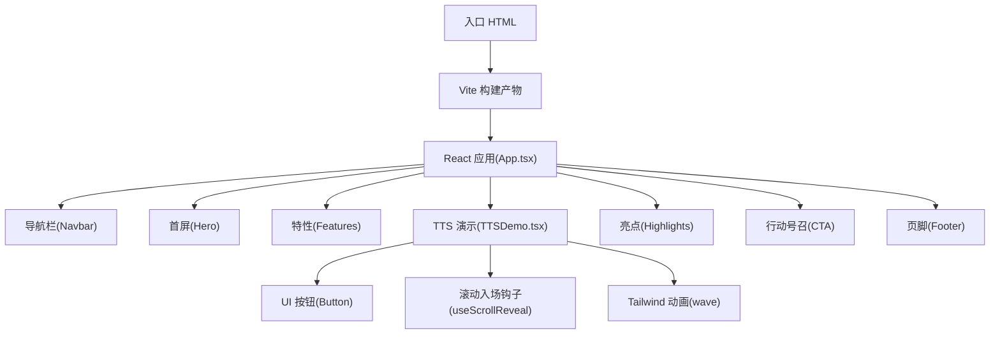
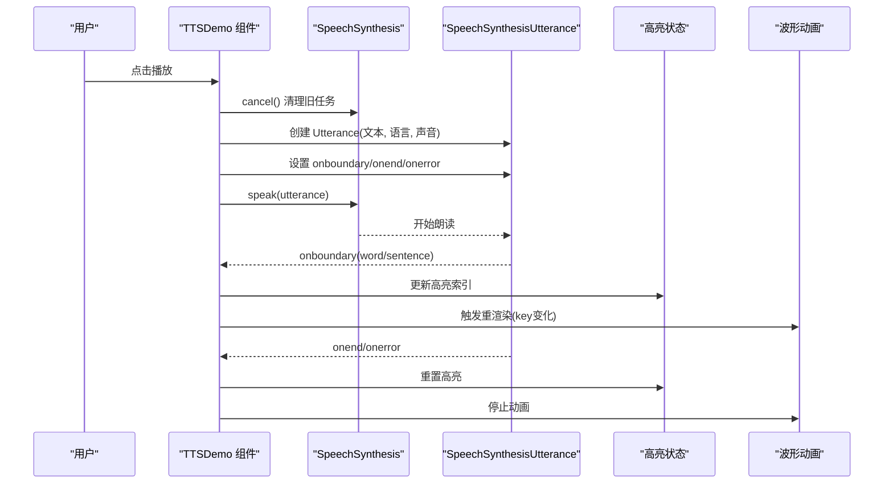
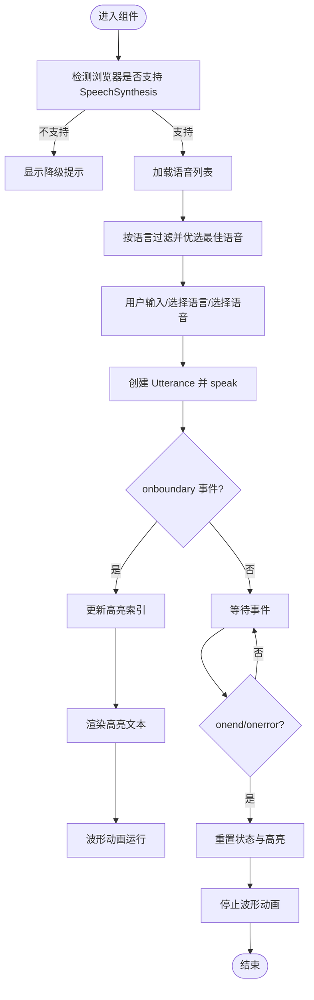
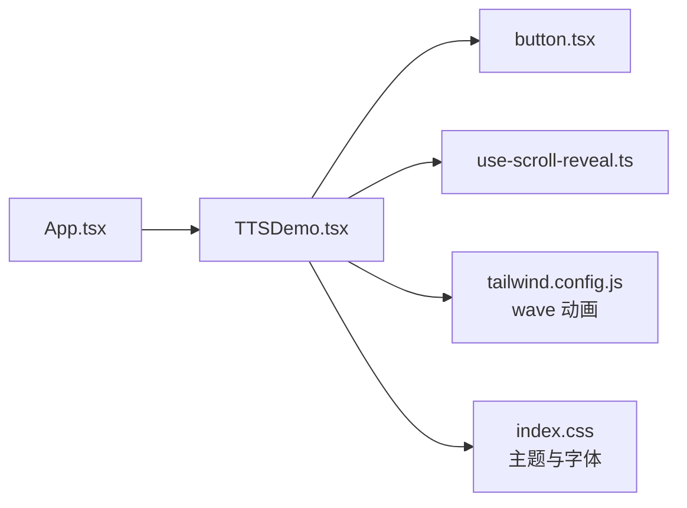

# 语音合成演示系统

<cite>
**本文引用的文件**
- [TTSDemo.tsx](file://src/sections/TTSDemo.tsx)
- [App.tsx](file://src/App.tsx)
- [button.tsx](file://src/components/ui/button.tsx)
- [use-scroll-reveal.ts](file://src/hooks/use-scroll-reveal.ts)
- [index.css](file://src/index.css)
- [tailwind.config.js](file://tailwind.config.js)
- [README.md](file://README.md)
- [package.json](file://package.json)
</cite>

## 目录
1. [简介](#简介)
2. [项目结构](#项目结构)
3. [核心组件](#核心组件)
4. [架构总览](#架构总览)
5. [详细组件分析](#详细组件分析)
6. [依赖关系分析](#依赖关系分析)
7. [性能与优化](#性能与优化)
8. [故障排查指南](#故障排查指南)
9. [结论](#结论)
10. [附录：扩展与示例](#附录扩展与示例)

## 简介
本仓库为“挠荔枝 Knowledge”产品官网，其中包含一个基于浏览器 SpeechSynthesis API 的在线语音合成演示。该演示支持多语言、语音选择、播放控制（播放/暂停/停止）、实时文本高亮同步以及波形动画效果。文档将围绕以下目标展开：
- 详细说明 SpeechSynthesis API 的集成实现，包括多语言支持与语音选择策略
- 解释实时文本高亮同步机制：边界事件监听、文本分割与高亮状态管理
- 说明波形动画的实现方式与音频可视化思路
- 提供错误处理策略、浏览器兼容性处理与无障碍访问支持
- 给出扩展实践：新增语言、自定义语音样式、扩展功能特性
- 总结常见问题与优化建议（权限、内存泄漏、性能）

[无具体代码文件分析引用]

## 项目结构
本项目采用 React + TypeScript + Vite + Tailwind CSS 的现代前端技术栈。TTS 演示位于页面区块中，通过根组件挂载到应用主流程。

图表来源
- [App.tsx:1-30](file://src/App.tsx#L1-L30)
- [TTSDemo.tsx:1-344](file://src/sections/TTSDemo.tsx#L1-L344)
- [tailwind.config.js:65-92](file://tailwind.config.js#L65-L92)

章节来源
- [README.md:1-73](file://README.md#L1-L73)
- [package.json:1-80](file://package.json#L1-L80)
- [App.tsx:1-30](file://src/App.tsx#L1-L30)

## 核心组件
- TTSDemo 组件：封装了 TTS 的核心交互逻辑，包括语音加载、过滤与选择、播放控制、实时高亮、波形动画等。
- Button 组件：基于 shadcn/ui 的可复用按钮，用于播放、暂停、停止等操作。
- useScrollReveal 钩子：为区域元素添加滚动入场动画，提升演示区视觉体验。
- Tailwind 配置：定义 wave 动画关键帧与动画类名，驱动波形条的动效。

章节来源
- [TTSDemo.tsx:1-344](file://src/sections/TTSDemo.tsx#L1-L344)
- [button.tsx:1-63](file://src/components/ui/button.tsx#L1-L63)
- [use-scroll-reveal.ts:1-34](file://src/hooks/use-scroll-reveal.ts#L1-L34)
- [tailwind.config.js:65-92](file://tailwind.config.js#L65-L92)

## 架构总览
从数据流与控制流角度，TTS 演示遵循“用户输入 → 引擎调用 → 事件回调 → UI 更新”的闭环。

图表来源
- [TTSDemo.tsx:100-137](file://src/sections/TTSDemo.tsx#L100-L137)
- [TTSDemo.tsx:167-180](file://src/sections/TTSDemo.tsx#L167-L180)
- [TTSDemo.tsx:312-331](file://src/sections/TTSDemo.tsx#L312-L331)

## 详细组件分析

### TTSDemo 组件
- 多语言支持
  - 预设语言列表包含中文、英文、日文、韩文、法文等，切换时自动匹配对应语音。
  - 通过语言前缀进行语音过滤，确保所选语音与当前语言一致。
- 语音选择与质量优选
  - 根据名称关键词（如 premium、neural、natural 等）优先选择高质量本地或云端语音。
  - 当存在多个候选语音时，提供下拉框让用户手动选择。
- 播放控制
  - 播放：创建 Utterance，绑定边界事件与结束/错误事件，调用 speak。
  - 暂停/继续：调用 pause/resume。
  - 停止：调用 cancel，并重置 UI 状态。
- 实时文本高亮同步
  - 使用 onboundary 事件，在 word 或 sentence 级别更新高亮位置。
  - 通过切分文本为 before/after 两部分，分别赋予不同样式，实现“已读/未读”视觉效果。
- 波形动画
  - 使用 key 值变化强制重新渲染一组条形节点，结合 animate-wave 类与延迟/时长差异，模拟波形跳动。
- 兼容性与可用性
  - 检测 speechSynthesis 是否可用，不可用时显示降级提示。
  - 所有交互按钮均提供 aria-label，便于屏幕阅读器识别。
  - 组件卸载时取消正在进行的朗读，避免资源泄露。

图表来源
- [TTSDemo.tsx:86-98](file://src/sections/TTSDemo.tsx#L86-L98)
- [TTSDemo.tsx:56-84](file://src/sections/TTSDemo.tsx#L56-L84)
- [TTSDemo.tsx:100-137](file://src/sections/TTSDemo.tsx#L100-L137)
- [TTSDemo.tsx:167-180](file://src/sections/TTSDemo.tsx#L167-L180)
- [TTSDemo.tsx:312-331](file://src/sections/TTSDemo.tsx#L312-L331)

章节来源
- [TTSDemo.tsx:1-344](file://src/sections/TTSDemo.tsx#L1-344)

### 按钮组件 (Button)
- 基于 class-variance-authority 与 Radix Slot 构建，支持多种变体与尺寸。
- 在 TTS 演示中用于播放、暂停、停止操作，具备焦点环与禁用态样式。

章节来源
- [button.tsx:1-63](file://src/components/ui/button.tsx#L1-L63)

### 滚动入场钩子 (useScrollReveal)
- 使用 IntersectionObserver 监听元素进入视口，添加 revealed 类以触发 fade-up 过渡。
- 在演示区头部使用，增强页面动效体验。

章节来源
- [use-scroll-reveal.ts:1-34](file://src/hooks/use-scroll-reveal.ts#L1-L34)

### 样式与动画
- Tailwind 配置中定义了 wave 关键帧与动画类名，配合动态延迟与时长，形成错落有致的波形效果。
- 全局样式引入字体与基础主题变量，保证品牌色与深色模式一致性。

章节来源
- [tailwind.config.js:65-92](file://tailwind.config.js#L65-L92)
- [index.css:1-116](file://src/index.css#L1-L116)

## 依赖关系分析
- 组件级依赖
  - TTSDemo 依赖 Button、useScrollReveal、Tailwind 动画。
  - App 作为根组件，聚合各页面区块，TTSDemo 作为其中之一被渲染。
- 外部依赖
  - 运行时依赖浏览器原生 SpeechSynthesis API。
  - 构建期依赖 React、TypeScript、Vite、Tailwind 生态。

图表来源
- [App.tsx:1-30](file://src/App.tsx#L1-L30)
- [TTSDemo.tsx:1-344](file://src/sections/TTSDemo.tsx#L1-L344)
- [button.tsx:1-63](file://src/components/ui/button.tsx#L1-L63)
- [use-scroll-reveal.ts:1-34](file://src/hooks/use-scroll-reveal.ts#L1-L34)
- [tailwind.config.js:65-92](file://tailwind.config.js#L65-L92)
- [index.css:1-116](file://src/index.css#L1-L116)

章节来源
- [package.json:1-80](file://package.json#L1-L80)
- [App.tsx:1-30](file://src/App.tsx#L1-L30)

## 性能与优化
- 语音列表加载
  - 使用 onvoiceschanged 异步加载，避免阻塞首次渲染；组件卸载时移除监听器，防止内存泄漏。
- 文本高亮
  - 仅在 onboundary 触发时更新高亮索引，减少不必要的重渲染；对长文本可考虑节流或增量渲染策略。
- 波形动画
  - 通过 key 变化触发整组节点重建，适合短周期演示；若需更精细的可视化，可改用 Canvas/WebGL 或 Web Audio API 的 AnalyserNode 获取真实频谱。
- 资源释放
  - 组件卸载与停止时调用 cancel，确保引擎释放资源；避免重复 speak 导致队列堆积。
- 浏览器兼容性
  - 在初始化阶段检测 speechSynthesis 可用性，并提供降级提示；对于不支持的环境，引导用户使用 App 或其他方案。

[本节为通用指导，不直接分析具体文件]

## 故障排查指南
- 无法发声或无声
  - 检查浏览器是否支持 SpeechSynthesis；确认未处于静音模式或系统音量过低。
  - 确认已正确设置 utterance.lang 与 voice，且语音列表非空。
- 高亮不同步或错位
  - 确认 onboundary 事件类型是否为 word/sentence；某些平台可能仅支持部分事件类型。
  - 文本中包含换行或特殊字符时，charIndex 可能与视觉呈现不一致，必要时进行预处理。
- 内存泄漏或卡顿
  - 确保在组件卸载与停止时调用 cancel；避免频繁创建大量 Utterance 对象。
  - 长文本朗读时，减少高频状态更新，必要时合并高亮更新。
- 无障碍问题
  - 为所有交互按钮提供 aria-label；确保键盘可聚焦与可操作。
  - 在高亮区域增加 role="status" 或 aria-live 提示，辅助阅读。

章节来源
- [TTSDemo.tsx:86-98](file://src/sections/TTSDemo.tsx#L86-L98)
- [TTSDemo.tsx:100-137](file://src/sections/TTSDemo.tsx#L100-L137)
- [TTSDemo.tsx:167-180](file://src/sections/TTSDemo.tsx#L167-L180)
- [TTSDemo.tsx:312-331](file://src/sections/TTSDemo.tsx#L312-L331)

## 结论
本演示以轻量方式展示了 SpeechSynthesis API 在前端的应用，涵盖多语言、语音选择、播放控制、实时高亮与波形动画等核心能力。通过合理的状态管理与事件驱动，实现了良好的用户体验。后续可在真实音频可视化、更多语言覆盖、高级参数调节等方面进一步扩展。

[本节为总结性内容，不直接分析具体文件]

## 附录：扩展与示例

### 新增语言支持
- 在预设列表中追加新的语言项（语言代码与示例文本）。
- 在语音过滤逻辑中，确保新语言的前缀能被正确匹配。
- 可选：为新语言添加高质量语音关键词，以便自动优选。

章节来源
- [TTSDemo.tsx:8-34](file://src/sections/TTSDemo.tsx#L8-L34)
- [TTSDemo.tsx:69-84](file://src/sections/TTSDemo.tsx#L69-L84)

### 自定义语音样式
- 通过 select 下拉展示语音名称与本地/云端标识，用户可手动切换。
- 可根据语音属性（如 localService、lang、name）进行分组或排序，提升选择体验。

章节来源
- [TTSDemo.tsx:232-249](file://src/sections/TTSDemo.tsx#L232-L249)

### 扩展功能特性
- 语速与音调控制：在 Utterance 上设置 rate/pitch 等属性，并通过滑块控件暴露给用户。
- 音量控制：可通过系统或媒体会话 API 调整输出音量（视平台支持情况）。
- 真实音频可视化：接入 Web Audio API 的 MediaElementAudioSourceNode 或 AnalyserNode，绘制频谱或波形。
- 进度与定位：利用 onboundary 的 charIndex 与文本长度计算百分比进度，支持跳转至指定段落。

章节来源
- [TTSDemo.tsx:100-137](file://src/sections/TTSDemo.tsx#L100-L137)
- [TTSDemo.tsx:167-180](file://src/sections/TTSDemo.tsx#L167-L180)