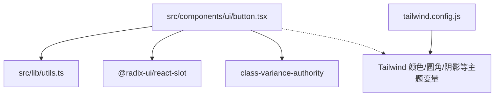
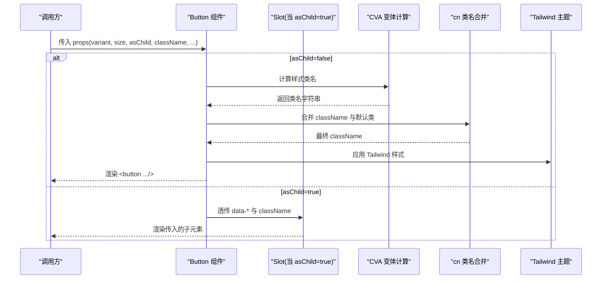
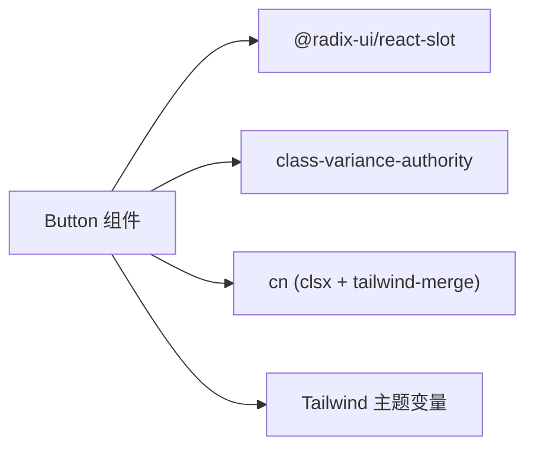

# Button组件

<cite>
**本文引用的文件**   
- [button.tsx](file://src/components/ui/button.tsx)
- [utils.ts](file://src/lib/utils.ts)
- [tailwind.config.js](file://tailwind.config.js)
</cite>

## 目录
1. [简介](#简介)
2. [项目结构](#项目结构)
3. [核心组件](#核心组件)
4. [架构总览](#架构总览)
5. [详细组件分析](#详细组件分析)
6. [依赖分析](#依赖分析)
7. [性能考虑](#性能考虑)
8. [故障排查指南](#故障排查指南)
9. [结论](#结论)
10. [附录](#附录)

## 简介
Button 是一个基于 React、TypeScript 与 Tailwind CSS 的通用按钮组件。它通过 class-variance-authority（CVA）管理变体与尺寸，结合 Radix Slot 实现 asChild 透传渲染能力，并借助 cn 工具函数合并样式类名。该组件提供丰富的视觉外观与交互状态，包括多种 variant 与 size 组合、焦点与禁用态、以及无障碍相关属性支持。

## 项目结构
本项目采用按功能/层组织的方式：UI 组件位于 src/components/ui，工具函数位于 src/lib，页面区块位于 src/sections。Button 组件属于 UI 基础组件，被上层业务组件复用。

图表来源
- [button.tsx:1-63](file://src/components/ui/button.tsx#L1-L63)
- [utils.ts:1-7](file://src/lib/utils.ts#L1-L7)
- [tailwind.config.js:1-92](file://tailwind.config.js#L1-L92)

章节来源
- [button.tsx:1-63](file://src/components/ui/button.tsx#L1-L63)
- [utils.ts:1-7](file://src/lib/utils.ts#L1-L7)
- [tailwind.config.js:1-92](file://tailwind.config.js#L1-L92)

## 核心组件
- 组件名称：Button
- 主要职责：
  - 渲染原生 button 或根据 asChild 透传给任意子元素
  - 应用统一的样式变体与尺寸
  - 处理焦点、禁用、无效等可访问性相关状态
  - 透传所有标准 HTML button 属性

关键特性
- 变体（variant）：default、destructive、outline、secondary、ghost、link
- 尺寸（size）：default、sm、lg、icon、icon-sm、icon-lg
- 透传渲染（asChild）：将 Button 的样式与数据属性应用到传入的子元素上
- 无障碍：保留原生语义、焦点可见样式、aria-invalid 支持
- 响应式：默认使用相对单位与 Tailwind 断点，适配不同屏幕

章节来源
- [button.tsx:7-37](file://src/components/ui/button.tsx#L7-L37)
- [button.tsx:39-60](file://src/components/ui/button.tsx#L39-L60)

## 架构总览
Button 由三部分构成：
- 样式系统：CVA 定义变体与尺寸，cn 合并类名
- 渲染逻辑：根据 asChild 选择 Slot 或原生 button
- 主题配置：Tailwind 扩展色板与圆角、阴影等设计令牌

图表来源
- [button.tsx:7-37](file://src/components/ui/button.tsx#L7-L37)
- [button.tsx:39-60](file://src/components/ui/button.tsx#L39-L60)
- [utils.ts:1-7](file://src/lib/utils.ts#L1-L7)
- [tailwind.config.js:1-92](file://tailwind.config.js#L1-L92)

## 详细组件分析

### 外观与交互
- 布局与排版
  - 内联弹性布局，内容居中，行高与字号统一，图标与文本间距一致
  - 圆角、过渡动画、禁用态透明度与指针事件控制
- 图标支持
  - 自动为内部 SVG 设置合理尺寸与收缩行为，避免撑开布局
- 焦点与键盘导航
  - 使用 focus-visible 显示边框与环状聚焦指示器，确保键盘可达性与可见性
  - 保持 outline-none 的同时提供自定义 ring 样式，兼顾美观与可访问性
- 无效状态
  - aria-invalid 时提供破坏性色彩边框与环提示，便于表单反馈

章节来源
- [button.tsx:8-8](file://src/components/ui/button.tsx#L8-L8)
- [button.tsx:23-30](file://src/components/ui/button.tsx#L23-L30)

### 变体（variant）说明
- default：主按钮，强调操作，悬停加深背景
- destructive：危险操作，白字配破坏色，暗色模式下有额外背景调整
- outline：描边风格，背景透明，悬停填充强调色
- secondary：次要按钮，使用次级色板
- ghost：无背景，仅悬停高亮，适合工具栏或并列操作
- link：链接风格，带下划线偏移与悬停下划线

章节来源
- [button.tsx:11-22](file://src/components/ui/button.tsx#L11-L22)

### 尺寸（size）说明
- default：常规高度与内边距
- sm：更紧凑，适合密集界面
- lg：更大点击区域，适合重要操作
- icon/icon-sm/icon-lg：正方形图标按钮，适合纯图标场景

章节来源
- [button.tsx:23-30](file://src/components/ui/button.tsx#L23-L30)

### asChild 透传渲染
- 作用：将 Button 的样式与 data-* 属性应用到传入的子元素上，常用于将按钮渲染为 a、span 或其他自定义组件
- 行为：
  - asChild=false：渲染原生 <button>
  - asChild=true：使用 Radix Slot 将 props 与 className 透传到子元素
- 适用场景：
  - 需要 a 标签的跳转行为但希望保持按钮样式
  - 与第三方组件集成，要求特定根节点类型

章节来源
- [button.tsx:43-59](file://src/components/ui/button.tsx#L43-L59)

### 无障碍与可访问性
- 语义化：默认渲染为 button，具备原生键盘交互与屏幕阅读器支持
- 焦点可见：focus-visible 提供清晰的焦点指示
- 表单校验：aria-invalid 触发破坏色边框与环提示
- 禁用态：disabled 时不可交互且降低不透明度

章节来源
- [button.tsx:8-8](file://src/components/ui/button.tsx#L8-L8)
- [button.tsx:39-60](file://src/components/ui/button.tsx#L39-L60)

### 响应式设计建议
- 尺寸与间距：优先使用 Tailwind 提供的相对单位与断点，在移动端适当减小 padding 与字体大小
- 图标按钮：在小屏上使用 icon-sm 或 icon，在大屏使用 icon 或 icon-lg
- 文字密度：在窄屏使用 sm 或 default，宽屏使用 lg 提升可读性与点击面积

章节来源
- [button.tsx:23-30](file://src/components/ui/button.tsx#L23-L30)
- [tailwind.config.js:55-64](file://tailwind.config.js#L55-L64)

### 实际使用示例（路径引用）
- 作为原生按钮（默认）
  - 参考：[button.tsx:39-60](file://src/components/ui/button.tsx#L39-L60)
- 作为链接（a 标签）
  - 参考：[button.tsx:43-59](file://src/components/ui/button.tsx#L43-L59)
- 图标按钮
  - 参考：[button.tsx:27-29](file://src/components/ui/button.tsx#L27-L29)
- 禁用态与表单无效态
  - 参考：[button.tsx:8-8](file://src/components/ui/button.tsx#L8-L8)

## 依赖分析
- 外部依赖
  - @radix-ui/react-slot：用于 asChild 透传渲染
  - class-variance-authority：管理变体与尺寸的组合样式
  - clsx + tailwind-merge：通过 cn 安全合并类名
- 主题与样式
  - Tailwind 扩展色板与圆角、阴影等设计令牌影响按钮外观

图表来源
- [button.tsx:1-5](file://src/components/ui/button.tsx#L1-L5)
- [utils.ts:1-7](file://src/lib/utils.ts#L1-L7)
- [tailwind.config.js:1-92](file://tailwind.config.js#L1-L92)

章节来源
- [button.tsx:1-5](file://src/components/ui/button.tsx#L1-L5)
- [utils.ts:1-7](file://src/lib/utils.ts#L1-L7)
- [tailwind.config.js:1-92](file://tailwind.config.js#L1-L92)

## 性能考虑
- 样式计算
  - CVA 在构建期生成类名，运行时开销极低；cn 合并类名也轻量高效
- DOM 更新
  - 避免频繁切换 variant/size 导致重排；批量更新 props
- 图标渲染
  - 使用固定尺寸的 SVG 可减少布局抖动；必要时缓存图标组件
- 主题变量
  - 使用 CSS 变量驱动的颜色与圆角，减少 Tailwind 类名膨胀

章节来源
- [button.tsx:7-37](file://src/components/ui/button.tsx#L7-L37)
- [utils.ts:1-7](file://src/lib/utils.ts#L1-L7)
- [tailwind.config.js:10-64](file://tailwind.config.js#L10-L64)

## 故障排查指南
- 样式未生效
  - 检查是否引入 Tailwind 主题变量与插件
  - 确认 cn 是否正确合并 className
- 焦点不可见
  - 确认浏览器是否支持 focus-visible，必要时回退到 outline
- asChild 后失去语义
  - 确保传入的子元素具备正确的角色与可交互属性（如 a 的 href）
- 图标尺寸异常
  - 检查 SVG 是否自带尺寸类，避免与 has-[>svg] 规则冲突

章节来源
- [button.tsx:8-8](file://src/components/ui/button.tsx#L8-L8)
- [button.tsx:43-59](file://src/components/ui/button.tsx#L43-L59)
- [utils.ts:1-7](file://src/lib/utils.ts#L1-L7)
- [tailwind.config.js:1-92](file://tailwind.config.js#L1-L92)

## 结论
Button 组件以 CVA 为核心，结合 cn 与 Tailwind 主题，提供了高内聚、低耦合的按钮抽象。其丰富的变体与尺寸覆盖常见场景，asChild 增强了灵活性，同时保留了良好的可访问性与响应式表现。建议在项目中统一使用该组件以保证一致的视觉与交互体验。

## 附录

### API 速查
- 属性
  - variant：default | destructive | outline | secondary | ghost | link
  - size：default | sm | lg | icon | icon-sm | icon-lg
  - asChild：boolean（是否透传给子元素）
  - className：string（附加类名）
  - 其他：透传所有 HTML button 属性
- 数据属性
  - data-slot="button"
  - data-variant={variant}
  - data-size={size}

章节来源
- [button.tsx:10-36](file://src/components/ui/button.tsx#L10-L36)
- [button.tsx:52-56](file://src/components/ui/button.tsx#L52-L56)

### 主题与样式要点
- 颜色与圆角、阴影来自 Tailwind 扩展，可通过 CSS 变量定制
- 焦点环与无效态使用 ring 与 destructive 色系，保证对比度与一致性

章节来源
- [tailwind.config.js:10-64](file://tailwind.config.js#L10-L64)