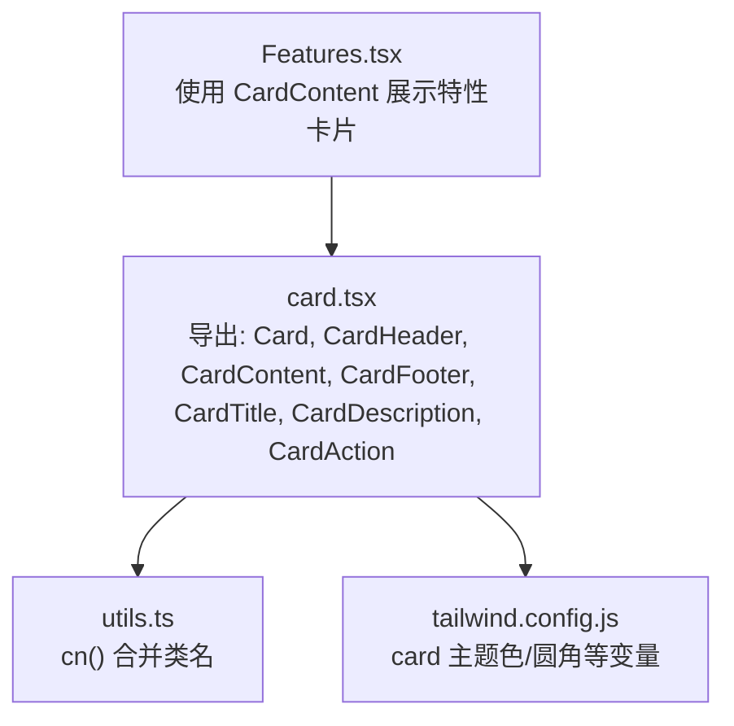
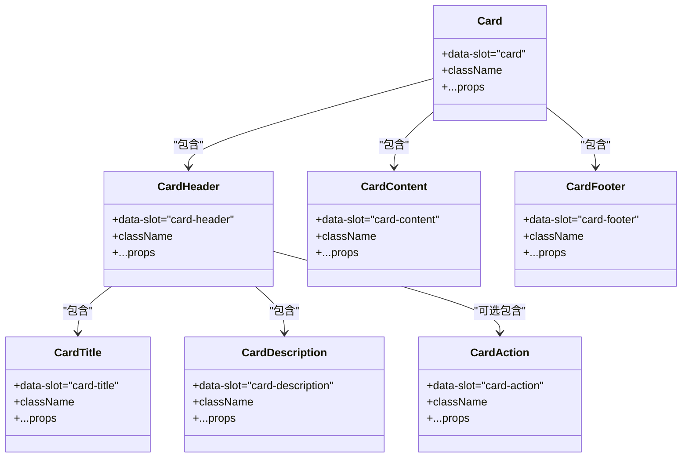
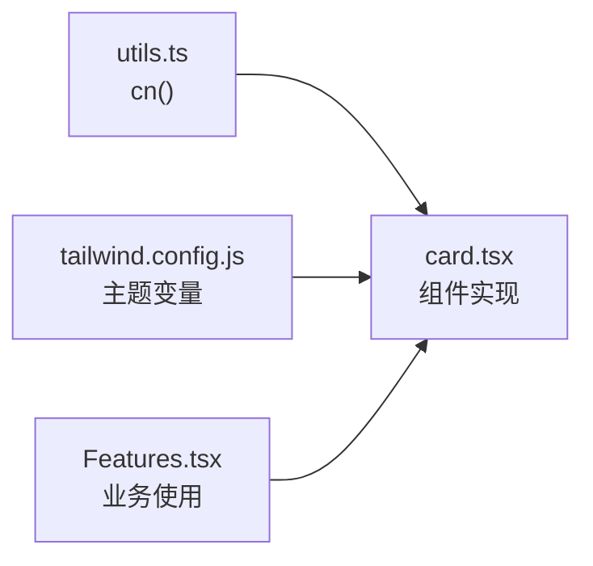

# Card组件

<cite>
**本文引用的文件**
- [src/components/ui/card.tsx](file://src/components/ui/card.tsx)
- [src/lib/utils.ts](file://src/lib/utils.ts)
- [tailwind.config.js](file://tailwind.config.js)
- [src/sections/Features.tsx](file://src/sections/Features.tsx)
- [README.md](file://README.md)
</cite>

## 目录
1. [简介](#简介)
2. [项目结构](#项目结构)
3. [核心组件](#核心组件)
4. [架构总览](#架构总览)
5. [详细组件分析](#详细组件分析)
6. [依赖关系分析](#依赖关系分析)
7. [性能与可访问性](#性能与可访问性)
8. [故障排查指南](#故障排查指南)
9. [结论](#结论)
10. [附录：使用示例与最佳实践](#附录使用示例与最佳实践)

## 简介
Card 组件是一套用于构建卡片容器的 UI 基础组件，提供语义化、可组合的布局块，包括容器、头部、内容区、底部以及标题与描述等子元素。该实现基于 React + TypeScript，样式采用 Tailwind CSS，并通过设计令牌（CSS 变量）支持主题切换与品牌定制。

## 项目结构
- 组件源码位于 src/components/ui/card.tsx，导出 Card、CardHeader、CardContent、CardFooter、CardTitle、CardDescription、CardAction 等子组件。
- 样式类名通过 cn 工具函数合并，避免冲突并支持覆盖。
- 颜色与圆角等视觉变量在 tailwind.config.js 中定义，便于统一主题管理。
- 实际页面中使用示例见 src/sections/Features.tsx，展示了如何组合 CardContent 进行内容排版。

图表来源
- [src/components/ui/card.tsx:1-93](file://src/components/ui/card.tsx#L1-L93)
- [src/lib/utils.ts:1-7](file://src/lib/utils.ts#L1-L7)
- [tailwind.config.js:40-64](file://tailwind.config.js#L40-L64)
- [src/sections/Features.tsx:1-122](file://src/sections/Features.tsx#L1-L122)

章节来源
- [src/components/ui/card.tsx:1-93](file://src/components/ui/card.tsx#L1-L93)
- [src/lib/utils.ts:1-7](file://src/lib/utils.ts#L1-L7)
- [tailwind.config.js:40-64](file://tailwind.config.js#L40-L64)
- [src/sections/Features.tsx:1-122](file://src/sections/Features.tsx#L1-L122)

## 核心组件
- Card：卡片容器，负责整体背景、边框、阴影、圆角与纵向间距。
- CardHeader：卡片头部区域，默认网格布局，支持放置标题、描述与操作按钮；当存在 CardAction 时自动两列布局。
- CardTitle：卡片标题文本样式。
- CardDescription：卡片描述文本样式。
- CardAction：头部右侧操作区（如按钮），与标题/描述形成两列布局。
- CardContent：卡片主体内容区，左右内边距一致。
- CardFooter：卡片底部区域，默认水平居中排列，顶部带分割线时可增加上内边距。

章节来源
- [src/components/ui/card.tsx:5-82](file://src/components/ui/card.tsx#L5-L82)

## 架构总览
Card 组件以“容器 + 分区”的方式组织 DOM，配合 Tailwind 原子类完成响应式与主题化。所有子组件均透传 props 与 className，便于上层按需扩展。

图表来源
- [src/components/ui/card.tsx:5-82](file://src/components/ui/card.tsx#L5-L82)

## 详细组件分析

### 视觉外观与布局
- 容器（Card）
  - 背景与前景色：使用 design token 变量，适配明暗主题。
  - 边框与阴影：默认细边框与轻量阴影，圆角适中。
  - 垂直间距：内部子元素之间设置统一间距，保证呼吸感。
- 头部（CardHeader）
  - 网格布局：两行结构，标题与描述占满宽度；当存在 CardAction 时，自动切换为两列布局，将动作置于右上角。
  - 条件样式：若头部自带下边框，则自动增加底部内边距以保持视觉平衡。
- 内容（CardContent）
  - 统一的左右内边距，确保内容与容器边缘对齐。
- 底部（CardFooter）
  - 默认水平排列，若带有上边框，则自动增加顶部内边距。

章节来源
- [src/components/ui/card.tsx:5-82](file://src/components/ui/card.tsx#L5-L82)

### 组合模式与使用方式
- 典型结构
  - Card 作为外层容器。
  - CardHeader 内放置 CardTitle、CardDescription 与可选的 CardAction。
  - CardContent 承载正文、图片、列表等任意内容。
  - CardFooter 放置辅助信息或操作按钮。
- 行为说明
  - 所有子组件均接受 className 与通用 HTML 属性，便于覆盖默认样式与绑定事件。
  - data-slot 标记用于选择器定位与条件样式（例如检测 CardAction 的存在）。

章节来源
- [src/components/ui/card.tsx:5-82](file://src/components/ui/card.tsx#L5-L82)

### 内容布局指南与间距规范
- 建议层级
  - 标题优先，描述次之，操作按钮靠右。
  - 正文内容放入 CardContent，保持左右留白一致。
  - 底部操作或元信息放入 CardFooter。
- 间距策略
  - 子元素间默认间距由容器控制，必要时可在子组件上追加间距类。
  - 头部与内容区、内容区与底部区的间距由各自组件默认样式保障。

章节来源
- [src/components/ui/card.tsx:5-82](file://src/components/ui/card.tsx#L5-L82)

### 样式自定义选项
- 主题色
  - 通过 tailwind.config.js 中的 card 相关变量调整背景与前景色，实现全局主题切换。
- 圆角与阴影
  - 圆角与阴影在配置中集中管理，可通过覆盖类名或新增变体进行定制。
- 类名合并
  - 使用 cn 工具函数合并类名，避免重复与冲突，支持外部传入 className 覆盖默认样式。

章节来源
- [src/components/ui/card.tsx:1-16](file://src/components/ui/card.tsx#L1-L16)
- [src/lib/utils.ts:1-7](file://src/lib/utils.ts#L1-L7)
- [tailwind.config.js:40-64](file://tailwind.config.js#L40-L64)

### 响应式设计与移动端适配
- 头部网格布局具备自适应能力，在小屏设备上标题与描述自然堆叠，有 CardAction 时仍保持合理的两列排布。
- 内容区与底部区在不同屏幕尺寸下保持一致的内边距，保证可读性与触控友好。
- 建议在复杂卡片中结合外层栅格系统（如 md:grid-cols-*）控制卡片列数与间距。

章节来源
- [src/components/ui/card.tsx:18-29](file://src/components/ui/card.tsx#L18-L29)
- [src/components/ui/card.tsx:64-82](file://src/components/ui/card.tsx#L64-L82)

### 无障碍访问与语义化标记
- 语义化
  - 标题建议使用 CardTitle，描述使用 CardDescription，有助于屏幕阅读器识别层次。
- 焦点与交互
  - 子组件透传原生属性，可为按钮等交互元素添加 aria-* 属性以提升可访问性。
- 对比度与可读性
  - 遵循主题色变量的对比度要求，必要时在 CardContent 中自定义文本颜色以确保可读性。

章节来源
- [src/components/ui/card.tsx:31-49](file://src/components/ui/card.tsx#L31-L49)

## 依赖关系分析
- 组件层
  - card.tsx 依赖 utils.ts 的 cn 函数进行类名合并。
- 样式层
  - tailwind.config.js 定义 card 主题色与圆角等变量，影响渲染结果。
- 使用层
  - Features.tsx 展示了如何在业务页面中组合 CardContent 进行内容展示。

图表来源
- [src/components/ui/card.tsx:1-16](file://src/components/ui/card.tsx#L1-L16)
- [src/lib/utils.ts:1-7](file://src/lib/utils.ts#L1-L7)
- [tailwind.config.js:40-64](file://tailwind.config.js#L40-L64)
- [src/sections/Features.tsx:1-122](file://src/sections/Features.tsx#L1-L122)

章节来源
- [src/components/ui/card.tsx:1-16](file://src/components/ui/card.tsx#L1-L16)
- [src/lib/utils.ts:1-7](file://src/lib/utils.ts#L1-L7)
- [tailwind.config.js:40-64](file://tailwind.config.js#L40-L64)
- [src/sections/Features.tsx:1-122](file://src/sections/Features.tsx#L1-L122)

## 性能与可访问性
- 性能
  - 组件均为无状态函数组件，渲染开销低。
  - 类名合并仅在渲染阶段执行，成本可控。
- 可访问性
  - 推荐使用语义化子组件（CardTitle/CardDescription）提升结构清晰度。
  - 对交互元素补充必要的 aria-* 属性，确保键盘导航与读屏体验。

[本节为通用指导，不直接分析具体文件]

## 故障排查指南
- 样式未生效
  - 检查是否通过 cn 合并了自定义 className，确认 Tailwind 已正确编译。
  - 核对 tailwind.config.js 中的 card 主题变量是否被覆盖或未定义。
- 布局异常
  - 若头部未出现两列布局，请确认是否在 CardHeader 内使用了 CardAction。
  - 检查是否意外覆盖了默认的 grid/flex 类名导致布局失效。
- 主题不一致
  - 确认根级主题变量（--card/--card-foreground）是否正确注入到文档中。

章节来源
- [src/components/ui/card.tsx:5-82](file://src/components/ui/card.tsx#L5-L82)
- [tailwind.config.js:40-64](file://tailwind.config.js#L40-L64)

## 结论
Card 组件以简洁的组合式 API 提供了完整的卡片布局能力，借助 Tailwind 的设计令牌与类名合并机制，实现了良好的主题化与可扩展性。通过合理划分 Header/Content/Footer 区域，并结合响应式与无障碍最佳实践，可在多端场景下稳定复用。

[本节为总结性内容，不直接分析具体文件]

## 附录：使用示例与最佳实践

### 完整 HTML 结构示例（概念示意）
- 外层容器：div[data-slot="card"]
- 头部区域：div[data-slot="card-header"]
  - 标题：div[data-slot="card-title"]
  - 描述：div[data-slot="card-description"]
  - 操作：div[data-slot="card-action"]（可选）
- 内容区域：div[data-slot="card-content"]
- 底部区域：div[data-slot="card-footer"]

[本小节为概念性结构说明，不直接映射到具体代码文件]

### React JSX 组合示例（路径指引）
- 参考业务页面中对 CardContent 的使用方式，了解如何在实际项目中组合卡片区块。
- 示例路径：[src/sections/Features.tsx:66-92](file://src/sections/Features.tsx#L66-L92)

章节来源
- [src/sections/Features.tsx:66-92](file://src/sections/Features.tsx#L66-L92)

### 内容布局指南
- 标题与描述放在 CardHeader，操作按钮放于 CardAction，正文放于 CardContent，底部信息放于 CardFooter。
- 保持左右内边距一致，避免内容贴边。

章节来源
- [src/components/ui/card.tsx:18-82](file://src/components/ui/card.tsx#L18-L82)

### 间距规范
- 子元素间默认间距由容器与分区组件统一控制，必要时在子组件上追加间距类微调。

章节来源
- [src/components/ui/card.tsx:5-82](file://src/components/ui/card.tsx#L5-L82)

### 样式自定义选项
- 通过 tailwind.config.js 调整 card 主题色与圆角，或使用 cn 合并自定义类名覆盖默认样式。

章节来源
- [src/lib/utils.ts:1-7](file://src/lib/utils.ts#L1-L7)
- [tailwind.config.js:40-64](file://tailwind.config.js#L40-L64)

### 响应式设计与移动端适配策略
- 利用头部网格布局的自适应能力，小屏自动堆叠，大屏两列布局。
- 在更复杂的页面中，结合外层栅格系统控制卡片列数与间距。

章节来源
- [src/components/ui/card.tsx:18-29](file://src/components/ui/card.tsx#L18-L29)

### 无障碍访问支持与语义化标记最佳实践
- 使用 CardTitle 与 CardDescription 表达层次。
- 为交互元素添加 aria-* 属性，确保键盘可达与读屏友好。

章节来源
- [src/components/ui/card.tsx:31-49](file://src/components/ui/card.tsx#L31-L49)