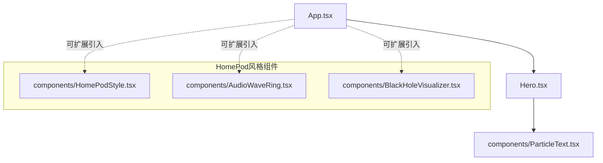
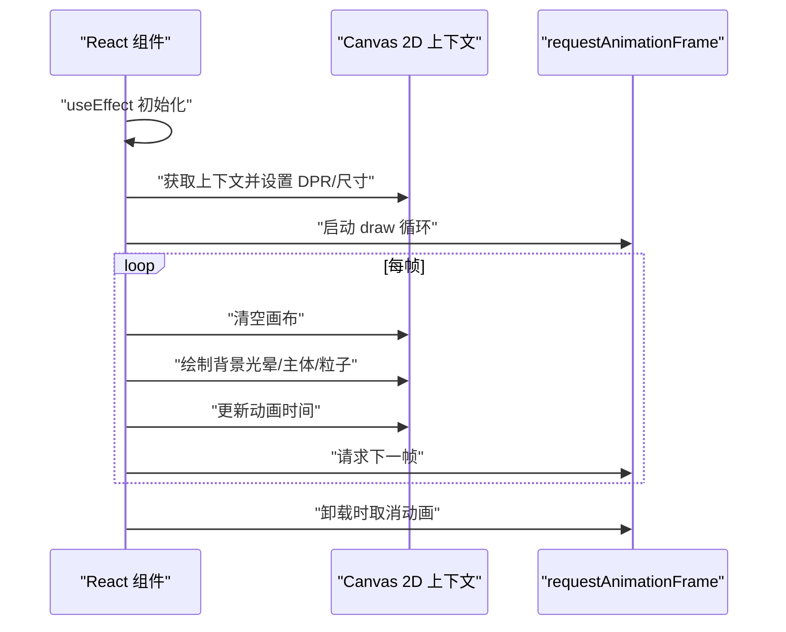
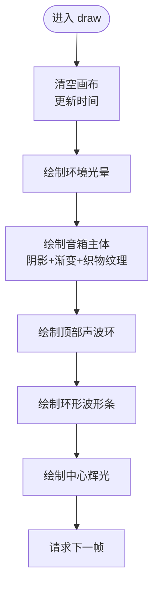
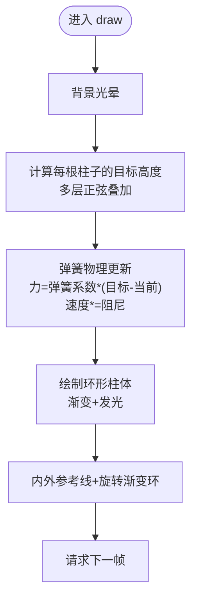
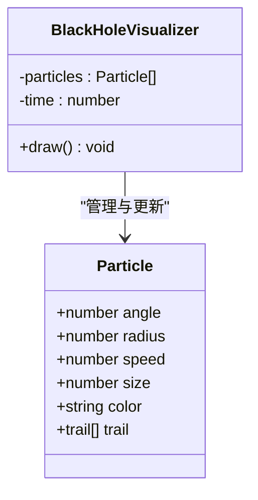
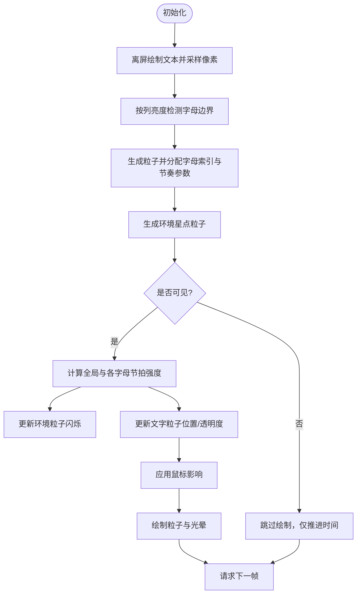
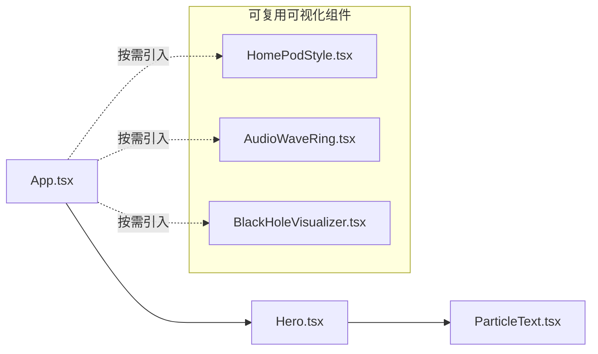

# HomePod风格组件

<cite>
**本文引用的文件**   
- [HomePodStyle.tsx](file://src/components/HomePodStyle.tsx)
- [AudioWaveRing.tsx](file://src/components/AudioWaveRing.tsx)
- [BlackHoleVisualizer.tsx](file://src/components/BlackHoleVisualizer.tsx)
- [ParticleText.tsx](file://src/components/ParticleText.tsx)
- [Hero.tsx](file://src/sections/Hero.tsx)
- [App.tsx](file://src/App.tsx)
- [README.md](file://README.md)
- [tailwind.config.js](file://tailwind.config.js)
- [package.json](file://package.json)
</cite>

## 目录
1. [简介](#简介)
2. [项目结构](#项目结构)
3. [核心组件](#核心组件)
4. [架构总览](#架构总览)
5. [详细组件分析](#详细组件分析)
6. [依赖关系分析](#依赖关系分析)
7. [性能考量](#性能考量)
8. [故障排查指南](#故障排查指南)
9. [结论](#结论)
10. [附录](#附录)

## 简介
本仓库为“挠荔枝 Knowledge”产品官网，围绕音频阅读体验构建沉浸式视觉。文档聚焦于一组“HomePod风格”的可视化组件：包括拟物化智能音箱、环形音频频谱、黑洞吸积盘粒子与粒子文字等。这些组件通过 Canvas 2D 实现高性能动画，结合 React Hooks 管理生命周期与交互，形成统一的视觉语言与可复用的展示模块。

## 项目结构
- 组件位于 src/components，按功能划分；页面区块位于 src/sections；根入口在 src/App.tsx。
- 样式基于 Tailwind CSS，主题色与动效在 tailwind.config.js 中扩展。
- 当前 Hero 区域已集成 ParticleText 作为主视觉；其余 HomePod 风格组件可作为独立展示或嵌入到不同页面区块。

图表来源
- [App.tsx:1-30](file://src/App.tsx#L1-L30)
- [Hero.tsx:1-146](file://src/sections/Hero.tsx#L1-L146)
- [ParticleText.tsx:1-440](file://src/components/ParticleText.tsx#L1-L440)
- [HomePodStyle.tsx:1-210](file://src/components/HomePodStyle.tsx#L1-L210)
- [AudioWaveRing.tsx:1-179](file://src/components/AudioWaveRing.tsx#L1-L179)
- [BlackHoleVisualizer.tsx:1-214](file://src/components/BlackHoleVisualizer.tsx#L1-L214)

章节来源
- [README.md:1-73](file://README.md#L1-L73)
- [App.tsx:1-30](file://src/App.tsx#L1-L30)
- [tailwind.config.js:1-92](file://tailwind.config.js#L1-L92)
- [package.json:1-81](file://package.json#L1-L81)

## 核心组件
- HomePodStyle：模拟 HomePod 外观与顶部声波、Siri 式波形条，营造“正在播放”的氛围。
- AudioWaveRing：环形音频频谱，使用弹簧物理实现平滑过渡，适合做播放器封面或进度可视化。
- BlackHoleVisualizer：黑洞吸积盘与粒子环绕效果，强调科技感与沉浸感。
- ParticleText：将文本采样为粒子，结合节拍系统与环境星点，呈现律动感强的标题动画。

章节来源
- [HomePodStyle.tsx:1-210](file://src/components/HomePodStyle.tsx#L1-L210)
- [AudioWaveRing.tsx:1-179](file://src/components/AudioWaveRing.tsx#L1-L179)
- [BlackHoleVisualizer.tsx:1-214](file://src/components/BlackHoleVisualizer.tsx#L1-L214)
- [ParticleText.tsx:1-440](file://src/components/ParticleText.tsx#L1-L440)

## 架构总览
所有可视化组件遵循统一模式：
- 使用 useRef 获取 canvas 引用，useEffect 初始化绘制循环。
- 通过 requestAnimationFrame 驱动帧更新，并在卸载时 cancelAnimationFrame 清理。
- 根据设备像素比设置画布尺寸，保证高 DPI 清晰度。
- 以纯函数 draw 为核心渲染逻辑，避免外部状态耦合。

图表来源
- [HomePodStyle.tsx:6-192](file://src/components/HomePodStyle.tsx#L6-L192)
- [AudioWaveRing.tsx:6-156](file://src/components/AudioWaveRing.tsx#L6-L156)
- [BlackHoleVisualizer.tsx:6-191](file://src/components/BlackHoleVisualizer.tsx#L6-L191)
- [ParticleText.tsx:41-432](file://src/components/ParticleText.tsx#L41-L432)

## 详细组件分析

### HomePodStyle 组件
- 目标：呈现 HomePod 样式的圆形音箱主体，叠加环境光、织物纹理、顶部高光与底部阴影，以及顶部向外扩散的声波与 Siri 式条形波形。
- 关键实现要点：
  - 径向渐变与阴影组合塑造立体感。
  - 多圈同心圆环模拟声波扩散，透明度随半径衰减。
  - 环形排列的短条模拟语音波形，颜色从暖橙渐变至深橙，带发光效果。
  - 中心播放按钮使用绝对定位覆盖层，不参与 Canvas 绘制。
- 复杂度与性能：
  - 每帧绘制固定数量的图形元素（常数级），开销稳定。
  - 使用 shadowBlur 带来一定 GPU/CPU 压力，建议控制并发数量。
- 可配置项（概念）：
  - 尺寸、半径、波形数量、动画速度、颜色主题。

图表来源
- [HomePodStyle.tsx:28-185](file://src/components/HomePodStyle.tsx#L28-L185)

章节来源
- [HomePodStyle.tsx:1-210](file://src/components/HomePodStyle.tsx#L1-L210)

### AudioWaveRing 组件
- 目标：环形音频频谱可视化，适合用作播放器封面或进度可视化。
- 关键实现要点：
  - 80 根条形柱沿圆周分布，高度由多层正弦波叠加生成目标值。
  - 采用弹簧阻尼模型（spring/damping）对高度进行平滑插值，提升观感。
  - 外圈旋转渐变环增强层次与动态。
- 复杂度与性能：
  - 每帧更新 80 个条形柱的目标值与物理状态，计算量线性增长但可控。
  - 大量 roundRect 与 shadowBlur 可能影响低端设备性能，可考虑减少 bars 数量或关闭阴影。
- 可配置项（概念）：
  - 环形半径、柱子数量、弹簧参数、颜色范围、旋转速度。

图表来源
- [AudioWaveRing.tsx:40-149](file://src/components/AudioWaveRing.tsx#L40-L149)

章节来源
- [AudioWaveRing.tsx:1-179](file://src/components/AudioWaveRing.tsx#L1-L179)

### BlackHoleVisualizer 组件
- 目标：黑洞吸积盘与粒子环绕效果，体现科技与沉浸感。
- 关键实现要点：
  - 三层吸积盘环，分别以不同速度与方向旋转，配合线性渐变描边。
  - 80 个粒子螺旋向内运动，到达事件视界后重置位置，保留拖尾轨迹。
  - 中心黑洞使用径向渐变与脉冲边框强化深度感。
- 复杂度与性能：
  - 每帧遍历粒子数组并绘制拖尾，复杂度 O(N)，N=80。
  - 大量 shadowBlur 与渐变绘制，建议在移动端降低粒子数或关闭部分发光。
- 可配置项（概念）：
  - 黑洞半径、粒子数量、颜色集合、吸积盘层数与转速、拖尾长度。

图表来源
- [BlackHoleVisualizer.tsx:25-53](file://src/components/BlackHoleVisualizer.tsx#L25-L53)
- [BlackHoleVisualizer.tsx:58-184](file://src/components/BlackHoleVisualizer.tsx#L58-L184)

章节来源
- [BlackHoleVisualizer.tsx:1-214](file://src/components/BlackHoleVisualizer.tsx#L1-L214)

### ParticleText 组件
- 目标：将文本采样为粒子，结合节拍系统与鼠标交互，呈现律动感强的标题动画。
- 关键实现要点：
  - 离屏 Canvas 绘制文本，采样像素生成粒子网格，按列亮度检测字母边界，为每个字母分配独立节奏特征（BPM 偏移、节拍相位、频段权重、摇摆感、延迟）。
  - 内置节拍系统：底鼓、军鼓、Hi-hat、低频 Bass，各字母独立响应，产生差异化律动。
  - 环境星点粒子跟随节拍闪烁，提供氛围。
  - 鼠标移动影响局部粒子位移，视口不可见时暂停动画以节省资源。
- 复杂度与性能：
  - 采样阶段 O(W×H/s^2)，s 为采样间隔；动画阶段 O(P)，P 为粒子总数。
  - 大量径向渐变与发光绘制，建议移动端降低采样密度与粒子数量。
- 可配置项（概念）：
  - 文本内容、字体大小、采样间隔、粒子数量、节拍 BPM、鼠标影响半径与强度。

图表来源
- [ParticleText.tsx:69-180](file://src/components/ParticleText.tsx#L69-L180)
- [ParticleText.tsx:208-232](file://src/components/ParticleText.tsx#L208-L232)
- [ParticleText.tsx:248-422](file://src/components/ParticleText.tsx#L248-L422)

章节来源
- [ParticleText.tsx:1-440](file://src/components/ParticleText.tsx#L1-L440)
- [Hero.tsx:1-146](file://src/sections/Hero.tsx#L1-L146)

## 依赖关系分析
- 组件间无直接相互依赖，均为独立可复用模块。
- 页面集成：
  - Hero 已引入 ParticleText 作为主视觉。
  - 其他 HomePod 风格组件可通过在任意 sections 或页面中按需引入。
- 运行时依赖：
  - React 19、TypeScript、Vite 7、Tailwind CSS 3。
  - 图标库 lucide-react 用于 UI 图标。
  - WebGPU 类型声明存在但未在当前组件中使用。

图表来源
- [App.tsx:1-30](file://src/App.tsx#L1-L30)
- [Hero.tsx:1-146](file://src/sections/Hero.tsx#L1-L146)
- [ParticleText.tsx:1-440](file://src/components/ParticleText.tsx#L1-L440)
- [HomePodStyle.tsx:1-210](file://src/components/HomePodStyle.tsx#L1-L210)
- [AudioWaveRing.tsx:1-179](file://src/components/AudioWaveRing.tsx#L1-L179)
- [BlackHoleVisualizer.tsx:1-214](file://src/components/BlackHoleVisualizer.tsx#L1-L214)

章节来源
- [package.json:1-81](file://package.json#L1-L81)
- [tailwind.config.js:1-92](file://tailwind.config.js#L1-L92)

## 性能考量
- 通用优化建议：
  - 合理设置 DPR，避免过高的像素密度导致绘制压力。
  - 减少 shadowBlur 的使用频率与范围，必要时用预渲染或离屏缓存替代。
  - 在移动端降低粒子数量、采样间隔与动画幅度。
  - 使用 IntersectionObserver 在不可见时暂停动画（ParticleText 已实现）。
- 组件特定建议：
  - HomePodStyle：控制声波环数量与阴影强度，避免同时过多发光。
  - AudioWaveRing：在低端设备上减少 bars 数量或关闭外圈旋转渐变。
  - BlackHoleVisualizer：限制拖尾长度与粒子数量，降低 shadowBlur。
  - ParticleText：移动端降低采样间隔与粒子总数，减小鼠标影响半径。

[本节为通用指导，不直接分析具体文件]

## 故障排查指南
- 常见问题与处理：
  - 动画未启动或黑屏：检查 useEffect 中 canvas.getContext("2d") 是否为空，确认容器尺寸非零。
  - 内存泄漏：确保卸载时调用 cancelAnimationFrame，移除事件监听与 observer。
  - 低帧率：减少阴影与渐变数量，降低粒子数量或采样密度，禁用不必要的发光。
  - 触摸设备交互异常：确认鼠标事件在 touch 设备上的兼容处理（如需要可添加 touchmove）。
- 定位方法：
  - 在 draw 循环内打印关键变量（时间、粒子数量、目标高度）辅助调试。
  - 使用浏览器性能面板观察主线程占用与重绘热点。

章节来源
- [HomePodStyle.tsx:189-192](file://src/components/HomePodStyle.tsx#L189-L192)
- [AudioWaveRing.tsx:153-156](file://src/components/AudioWaveRing.tsx#L153-L156)
- [BlackHoleVisualizer.tsx:188-191](file://src/components/BlackHoleVisualizer.tsx#L188-L191)
- [ParticleText.tsx:426-432](file://src/components/ParticleText.tsx#L426-L432)

## 结论
这组 HomePod 风格组件以 Canvas 2D 为核心，结合 React Hooks 的生命周期管理与物理/节拍算法，提供了高质量的沉浸式可视化能力。它们彼此解耦、易于复用，可在不同页面区块中灵活组合，显著提升产品的品牌感知与用户体验。后续可在性能与可配置性方面继续优化，例如引入参数化主题、动态分辨率适配与更细粒度的性能开关。

[本节为总结，不直接分析具体文件]

## 附录
- 技术栈概览：
  - React 19、TypeScript、Vite 7、Tailwind CSS 3、shadcn/ui、lucide-react。
- 本地开发命令：
  - 安装依赖、启动开发服务器、构建生产版本、预览生产构建。
- 品牌与主题：
  - 默认深色主题，品牌色为荔枝红，字体族包含 Inter、Noto Sans SC 与系统字体。

章节来源
- [README.md:29-43](file://README.md#L29-L43)
- [README.md:64-68](file://README.md#L64-L68)
- [tailwind.config.js:7-10](file://tailwind.config.js#L7-L10)
- [package.json:6-11](file://package.json#L6-L11)