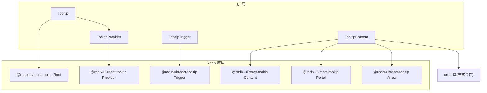
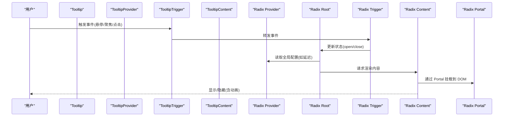
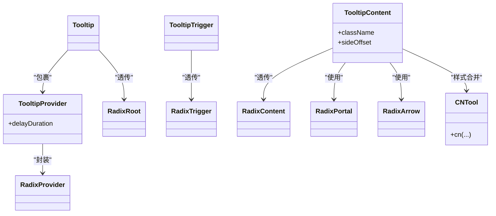

# Tooltip组件

<cite>
**本文引用的文件**
- [tooltip.tsx](file://src/components/ui/tooltip.tsx)
- [utils.ts](file://src/lib/utils.ts)
</cite>

## 目录
1. [简介](#简介)
2. [项目结构](#项目结构)
3. [核心组件](#核心组件)
4. [架构总览](#架构总览)
5. [详细组件分析](#详细组件分析)
6. [依赖关系分析](#依赖关系分析)
7. [性能与内存管理](#性能与内存管理)
8. [可访问性与键盘导航](#可访问性与键盘导航)
9. [故障排查](#故障排查)
10. [结论](#结论)

## 简介
本组件基于 Radix UI 的无样式工具提示原语，封装了 Tooltip、TooltipTrigger、TooltipContent、TooltipProvider 四个子组件，提供：
- 触发机制：支持鼠标悬停、焦点触发等交互模式（由底层原语驱动）
- 显示行为：延迟显示、进入/退出动画、箭头定位
- 定位策略：Portal 渲染、自动边距与偏移控制
- 可访问性：内置 ARIA 属性与键盘导航支持
- 样式扩展：通过 className 合并与 Tailwind 类名实现主题化

## 项目结构
本项目采用按功能组织的方式，UI 组件位于 src/components/ui，工具函数位于 src/lib。Tooltip 相关代码集中在 tooltip.tsx，样式合并工具在 utils.ts。

图表来源
- [tooltip.tsx:8-19](file://src/components/ui/tooltip.tsx#L8-L19)
- [tooltip.tsx:21-29](file://src/components/ui/tooltip.tsx#L21-L29)
- [tooltip.tsx:31-35](file://src/components/ui/tooltip.tsx#L31-L35)
- [tooltip.tsx:37-59](file://src/components/ui/tooltip.tsx#L37-L59)
- [utils.ts:4-6](file://src/lib/utils.ts#L4-L6)

章节来源
- [tooltip.tsx:1-62](file://src/components/ui/tooltip.tsx#L1-L62)
- [utils.ts:1-7](file://src/lib/utils.ts#L1-L7)

## 核心组件
- TooltipProvider：全局配置提供者，暴露 delayDuration 以统一设置延迟显示时长。
- Tooltip：根容器，内部包裹 Provider 并透传所有 props 给底层 Root。
- TooltipTrigger：触发器包装，透传 props 给底层 Trigger，作为用户交互入口。
- TooltipContent：内容容器，使用 Portal 渲染到文档树外部，包含默认样式、动画与箭头；支持 sideOffset 控制偏移。

章节来源
- [tooltip.tsx:8-19](file://src/components/ui/tooltip.tsx#L8-L19)
- [tooltip.tsx:21-29](file://src/components/ui/tooltip.tsx#L21-L29)
- [tooltip.tsx:31-35](file://src/components/ui/tooltip.tsx#L31-L35)
- [tooltip.tsx:37-59](file://src/components/ui/tooltip.tsx#L37-L59)

## 架构总览
Tooltip 组件整体遵循“提供者 + 根 + 触发器 + 内容”的分层设计，借助 Radix 原语完成状态管理与 DOM 挂载，自身聚焦于：
- 默认值注入（如延迟、偏移）
- 样式合并与默认外观
- 将复杂原语组合为易用的 API

图表来源
- [tooltip.tsx:8-19](file://src/components/ui/tooltip.tsx#L8-L19)
- [tooltip.tsx:21-29](file://src/components/ui/tooltip.tsx#L21-L29)
- [tooltip.tsx:31-35](file://src/components/ui/tooltip.tsx#L31-L35)
- [tooltip.tsx:37-59](file://src/components/ui/tooltip.tsx#L37-L59)

## 详细组件分析

### TooltipProvider
- 职责：集中式配置 Tooltip 的全局行为，当前暴露 delayDuration 用于统一延迟。
- 关键特性：
  - 延迟显示：delayDuration 毫秒后显示，避免误触抖动。
  - 透传 props：保留对底层 Provider 的其他能力扩展。
- 使用建议：
  - 在应用或页面层级放置一个 Provider，确保所有 Tooltip 共享一致的延迟策略。
  - 若需要更细粒度控制，可在具体 Tooltip 上覆盖延迟。

章节来源
- [tooltip.tsx:8-19](file://src/components/ui/tooltip.tsx#L8-L19)

### Tooltip
- 职责：作为 Tooltip 树的根节点，内部自动包裹 Provider，简化使用。
- 关键特性：
  - 自动注入 Provider，无需额外嵌套。
  - 透传 props 给底层 Root，保持与 Radix 一致的能力边界。
- 使用建议：
  - 将 Tooltip 作为外层容器，内部包含 Trigger 与 Content。

章节来源
- [tooltip.tsx:21-29](file://src/components/ui/tooltip.tsx#L21-L29)

### TooltipTrigger
- 职责：定义触发区域，接收用户交互事件。
- 关键特性：
  - 透传 props，允许绑定自定义事件处理器或样式。
  - 与 Radix Trigger 对齐，支持多种触发方式（悬停、聚焦、点击）。
- 使用建议：
  - 将按钮、图标或其他可交互元素作为触发器。
  - 如需键盘导航，确保触发器是可聚焦元素。

章节来源
- [tooltip.tsx:31-35](file://src/components/ui/tooltip.tsx#L31-L35)

### TooltipContent
- 职责：承载提示内容，负责定位、动画与箭头展示。
- 关键特性：
  - Portal 渲染：脱离父级布局限制，避免溢出裁剪。
  - 默认样式：背景、文本、圆角、字号、内边距、层级等。
  - 动画过渡：进入时淡入+缩放，退出时淡出+缩小；根据方位滑入方向不同。
  - 箭头：跟随定位自动旋转与位移。
  - 偏移控制：sideOffset 控制与触发器的间距。
  - 样式合并：通过 cn 工具合并 className，便于覆盖默认样式。
- 使用建议：
  - 通过 className 覆盖默认样式，或使用 sideOffset 调整位置。
  - 注意 Portal 渲染后的 z-index 与上下文层级。

章节来源
- [tooltip.tsx:37-59](file://src/components/ui/tooltip.tsx#L37-L59)
- [utils.ts:4-6](file://src/lib/utils.ts#L4-L6)

### 交互模式与示例说明
- 鼠标悬停触发：将 TooltipTrigger 包裹在可悬停的元素上，移动指针进入即显示，离开则关闭。
- 焦点触发：将 TooltipTrigger 包裹在可聚焦元素（如按钮、链接）上，Tab 聚焦后显示，失焦关闭。
- 点击触发：在移动端或触控场景下，可通过点击触发显示，再次点击或点击空白处关闭。
- 组合用法：在一个 Tooltip 中同时包含一个 TooltipTrigger 和一个 TooltipContent，即可实现完整提示。

章节来源
- [tooltip.tsx:21-29](file://src/components/ui/tooltip.tsx#L21-L29)
- [tooltip.tsx:31-35](file://src/components/ui/tooltip.tsx#L31-L35)
- [tooltip.tsx:37-59](file://src/components/ui/tooltip.tsx#L37-L59)

### 延迟显示与动画过渡
- 延迟显示：通过 TooltipProvider 的 delayDuration 配置全局延迟，减少频繁触发导致的闪烁。
- 动画过渡：
  - 进入：fade-in + zoom-in，提升出现时的平滑感。
  - 退出：fade-out + zoom-out，配合 data-[state=closed] 状态类。
  - 滑入方向：根据 data-[side=...] 动态选择从哪个方向滑入。
- 自定义动画：通过 className 覆盖默认动画类，或引入第三方动画库替换。

章节来源
- [tooltip.tsx:8-19](file://src/components/ui/tooltip.tsx#L8-L19)
- [tooltip.tsx:37-59](file://src/components/ui/tooltip.tsx#L37-L59)

### 定位策略与偏移
- Portal 渲染：内容被挂载到文档树外部，避免父级 overflow 裁剪问题。
- 自动方位：根据可用空间与触发器位置，自动选择 top/bottom/left/right。
- 偏移控制：sideOffset 控制内容与触发器之间的像素距离。
- 箭头定位：Arrow 随方位变化自动旋转与位移，保持视觉指向正确。

章节来源
- [tooltip.tsx:37-59](file://src/components/ui/tooltip.tsx#L37-L59)

### 自定义样式与主题
- 样式合并：通过 cn 工具合并多个 class 值，优先覆盖默认样式。
- 主题适配：利用 Tailwind 语义化颜色变量（前景/背景），轻松切换明暗主题。
- 层级控制：默认 z-50 保证浮层不被遮挡，必要时提高层级。

章节来源
- [tooltip.tsx:37-59](file://src/components/ui/tooltip.tsx#L37-L59)
- [utils.ts:4-6](file://src/lib/utils.ts#L4-L6)

## 依赖关系分析
- 外部依赖：
  - @radix-ui/react-tooltip：提供无样式、可访问的工具提示原语，包括 Provider、Root、Trigger、Content、Portal、Arrow。
- 内部依赖：
  - cn 工具：基于 clsx 与 tailwind-merge 的样式合并函数，用于安全地合并 Tailwind 类名。

图表来源
- [tooltip.tsx:8-19](file://src/components/ui/tooltip.tsx#L8-L19)
- [tooltip.tsx:21-29](file://src/components/ui/tooltip.tsx#L21-L29)
- [tooltip.tsx:31-35](file://src/components/ui/tooltip.tsx#L31-L35)
- [tooltip.tsx:37-59](file://src/components/ui/tooltip.tsx#L37-L59)
- [utils.ts:4-6](file://src/lib/utils.ts#L4-L6)

章节来源
- [tooltip.tsx:1-62](file://src/components/ui/tooltip.tsx#L1-L62)
- [utils.ts:1-7](file://src/lib/utils.ts#L1-L7)

## 性能与内存管理
- 延迟显示降低抖动：合理设置 delayDuration，减少快速进出触发导致的频繁重排与重绘。
- Portal 渲染优化：内容挂载到独立容器，避免影响父级布局计算，减少回流。
- 动画性能：
  - 使用 transform 与 opacity 相关的动画类，利于 GPU 加速。
  - 避免在动画过程中修改布局属性，防止强制同步布局。
- 样式合并开销：cn 工具仅在渲染时执行，开销较小；避免传入过多重复或冲突的类名。
- 内存管理：
  - 组件由 React 生命周期管理，卸载时自动清理事件监听与定时器。
  - 避免在 Tooltip 内部创建重型对象或闭包引用大对象，防止阻止垃圾回收。
- 大量 Tooltip 场景：
  - 使用单个 TooltipProvider 统一管理延迟与状态。
  - 按需渲染内容，避免在 Content 中放置昂贵子树。

[本节为通用指导，不直接分析具体文件]

## 可访问性与键盘导航
- ARIA 属性：Radix 原语自动注入 aria-* 属性，屏幕阅读器可识别提示内容与状态。
- 键盘导航：
  - 触发器需为可聚焦元素（如按钮、链接），Tab 键聚焦后显示提示。
  - 失焦或按下 Escape 通常关闭提示（由原语处理）。
- 屏幕阅读器支持：
  - 提示内容会被朗读，避免仅依赖视觉信息传达重要内容。
- 最佳实践：
  - 为 TooltipTrigger 提供明确的语义标签与描述。
  - 避免在提示中放置复杂交互控件，保持简洁可读。

章节来源
- [tooltip.tsx:21-29](file://src/components/ui/tooltip.tsx#L21-L29)
- [tooltip.tsx:31-35](file://src/components/ui/tooltip.tsx#L31-L35)
- [tooltip.tsx:37-59](file://src/components/ui/tooltip.tsx#L37-L59)

## 故障排查
- 提示未显示：
  - 检查是否在同一 Tooltip 树中包含 Trigger 与 Content。
  - 确认触发器是否为可交互/可聚焦元素。
- 定位异常或被裁剪：
  - 确认父级是否存在 overflow 裁剪；Portal 已规避此问题，但仍需检查 z-index 与层级。
- 动画不生效：
  - 检查是否覆盖了默认动画类；确保 Tailwind 动画插件启用。
- 样式冲突：
  - 使用 cn 工具合并类名，避免重复或冲突的 Tailwind 类。
- 延迟不符合预期：
  - 检查 TooltipProvider 的 delayDuration 设置，或在具体 Tooltip 上覆盖。

章节来源
- [tooltip.tsx:8-19](file://src/components/ui/tooltip.tsx#L8-L19)
- [tooltip.tsx:37-59](file://src/components/ui/tooltip.tsx#L37-L59)
- [utils.ts:4-6](file://src/lib/utils.ts#L4-L6)

## 结论
该 Tooltip 组件在保持最小 API 的同时，提供了完整的交互、定位、动画与可访问性能力。通过 TooltipProvider 统一配置延迟，结合 Portal 与默认样式，能够快速构建高质量的工具提示体验。建议在项目中复用 Provider，按需覆盖样式与偏移，以获得一致且高性能的用户反馈。

[本节为总结性内容，不直接分析具体文件]