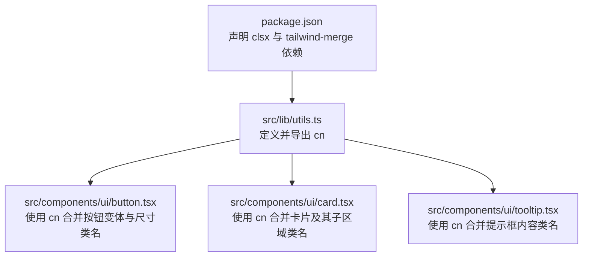
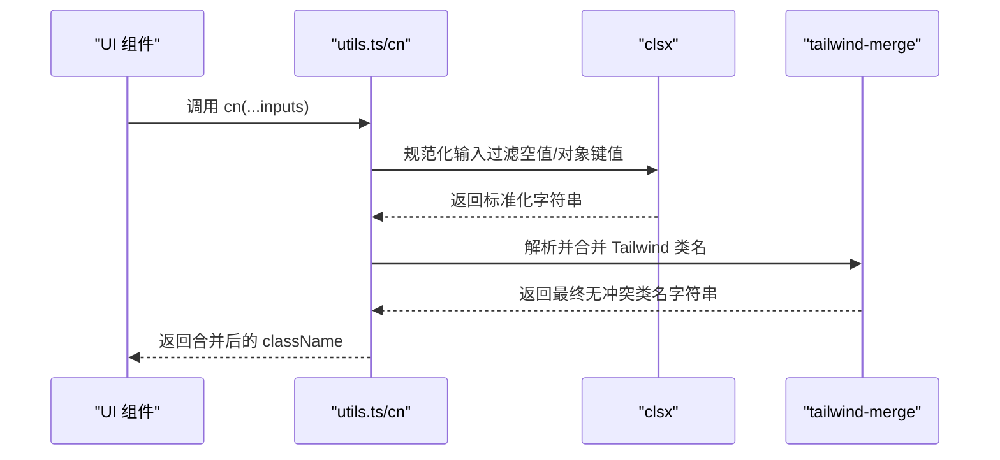
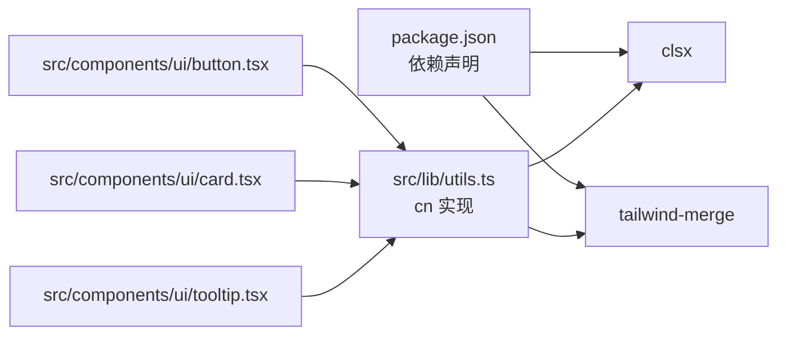

# 工具函数

<cite>
**本文引用的文件**
- [src/lib/utils.ts](file://src/lib/utils.ts)
- [src/components/ui/button.tsx](file://src/components/ui/button.tsx)
- [src/components/ui/card.tsx](file://src/components/ui/card.tsx)
- [src/components/ui/tooltip.tsx](file://src/components/ui/tooltip.tsx)
- [package.json](file://package.json)
</cite>

## 目录
1. [简介](#简介)
2. [项目结构](#项目结构)
3. [核心组件](#核心组件)
4. [架构总览](#架构总览)
5. [详细组件分析](#详细组件分析)
6. [依赖分析](#依赖分析)
7. [性能考虑](#性能考虑)
8. [故障排查指南](#故障排查指南)
9. [结论](#结论)
10. [附录](#附录)

## 简介
本文件聚焦于 UI 组件库中的工具函数，重点介绍类名合并函数 cn 的实现原理与使用方法。该函数通过组合 clsx 与 tailwind-merge，提供对条件类名、动态样式以及 Tailwind CSS 的无缝集成支持。文档同时给出在不同场景下的使用方式说明、参数类型与返回值约定、错误处理机制、性能优化建议与最佳实践，并包含与其他工具库的对比与迁移指导。

## 项目结构
本项目采用基于功能分层的组织方式：
- src/lib/utils.ts：导出通用工具函数 cn，作为类名合并的统一入口
- src/components/ui/*：UI 组件（Button、Card、Tooltip）统一通过 cn 进行类名合并
- package.json：声明依赖 clsx 与 tailwind-merge，为 cn 的实现提供基础能力

图表来源
- [src/lib/utils.ts:1-7](file://src/lib/utils.ts#L1-L7)
- [src/components/ui/button.tsx:1-63](file://src/components/ui/button.tsx#L1-L63)
- [src/components/ui/card.tsx:1-93](file://src/components/ui/card.tsx#L1-L93)
- [src/components/ui/tooltip.tsx:1-62](file://src/components/ui/tooltip.tsx#L1-L62)
- [package.json:1-80](file://package.json#L1-L80)

章节来源
- [src/lib/utils.ts:1-7](file://src/lib/utils.ts#L1-L7)
- [src/components/ui/button.tsx:1-63](file://src/components/ui/button.tsx#L1-L63)
- [src/components/ui/card.tsx:1-93](file://src/components/ui/card.tsx#L1-L93)
- [src/components/ui/tooltip.tsx:1-62](file://src/components/ui/tooltip.tsx#L1-L62)
- [package.json:1-80](file://package.json#L1-L80)

## 核心组件
- cn 函数
  - 作用：将多个类名输入安全地合并，并正确处理 Tailwind 冲突覆盖
  - 实现要点：先由 clsx 规范化输入（过滤空值、对象键值等），再由 tailwind-merge 解析并解决 Tailwind 类名的优先级与覆盖关系
  - 适用场景：组件默认类名 + 外部传入 className；结合 class-variance-authority 生成的变体字符串；条件渲染的动态类名集合

章节来源
- [src/lib/utils.ts:1-7](file://src/lib/utils.ts#L1-L7)

## 架构总览
cn 在 UI 组件中的调用链路如下：

图表来源
- [src/lib/utils.ts:1-7](file://src/lib/utils.ts#L1-L7)
- [src/components/ui/button.tsx:1-63](file://src/components/ui/button.tsx#L1-L63)
- [src/components/ui/card.tsx:1-93](file://src/components/ui/card.tsx#L1-L93)
- [src/components/ui/tooltip.tsx:1-62](file://src/components/ui/tooltip.tsx#L1-L62)

## 详细组件分析

### cn 函数详解
- 参数
  - inputs: ClassValue[]（来自 clsx 的类型定义）。可接受字符串、对象、数组、null/undefined 等常见形式
- 返回值
  - string：经过 clsx 规范化与 tailwind-merge 去重/覆盖后的最终类名字符串
- 内部流程
  - 第一步：clsx(inputs) 将复杂输入归一化为字符串，自动忽略 falsy 值，并将对象键值展开为类名
  - 第二步：twMerge(...) 识别 Tailwind 类名，按规则处理冲突与覆盖，保证后出现的类名优先生效
- 典型用法模式
  - 组件默认类名 + 外部 className 覆盖
  - 与 class-variance-authority 的变体结果拼接
  - 条件表达式或三元运算符产生的动态类名片段

章节来源
- [src/lib/utils.ts:1-7](file://src/lib/utils.ts#L1-L7)

#### 使用示例路径（不展示代码内容）
- 基础合并：组件默认类名与外部 className 合并
  - 参考路径：[src/components/ui/card.tsx:5-16](file://src/components/ui/card.tsx#L5-L16)
- 与变体系统协作：cva 生成类名后再交由 cn 做 Tailwind 覆盖
  - 参考路径：[src/components/ui/button.tsx:7-37](file://src/components/ui/button.tsx#L7-L37), [src/components/ui/button.tsx:39-60](file://src/components/ui/button.tsx#L39-L60)
- 条件类名：根据状态或属性动态添加/移除类名
  - 参考路径：[src/components/ui/tooltip.tsx:37-59](file://src/components/ui/tooltip.tsx#L37-L59)

### 与 class-variance-authority 的协作
- cva 负责“变体”层面的样式选择（variant、size 等），输出类名字符串
- cn 负责“合并与覆盖”，确保外部传入的 className 能正确覆盖默认或变体类名
- 推荐模式：将 cva 的结果与外部 className 一并传入 cn，以获得一致的覆盖语义

章节来源
- [src/components/ui/button.tsx:1-63](file://src/components/ui/button.tsx#L1-L63)

### 与 Tailwind CSS 的集成
- tailwind-merge 会识别 Tailwind 原子类，按规则处理冲突（如间距、颜色、尺寸等），避免手动排序带来的维护成本
- 建议在组件中始终通过 cn 输出 className，以保证覆盖行为一致且可预测

章节来源
- [src/lib/utils.ts:1-7](file://src/lib/utils.ts#L1-L7)

## 依赖分析
- 直接依赖
  - clsx：用于输入规范化与对象到类名的展开
  - tailwind-merge：用于 Tailwind 类名的智能合并与冲突解决
- 间接依赖
  - 各 UI 组件通过 cn 间接依赖上述两个库

图表来源
- [package.json:1-80](file://package.json#L1-L80)
- [src/lib/utils.ts:1-7](file://src/lib/utils.ts#L1-L7)
- [src/components/ui/button.tsx:1-63](file://src/components/ui/button.tsx#L1-L63)
- [src/components/ui/card.tsx:1-93](file://src/components/ui/card.tsx#L1-L93)
- [src/components/ui/tooltip.tsx:1-62](file://src/components/ui/tooltip.tsx#L1-L62)

章节来源
- [package.json:1-80](file://package.json#L1-L80)
- [src/lib/utils.ts:1-7](file://src/lib/utils.ts#L1-L7)

## 性能考虑
- 时间复杂度
  - clsx：线性扫描输入，整体 O(n)
  - tailwind-merge：对类名进行解析与冲突检测，近似 O(m)，m 为类名数量
- 空间复杂度
  - 主要消耗在中间字符串与解析结构上，整体 O(n + m)
- 优化建议
  - 避免在高频渲染路径中构造过大的类名集合
  - 尽量将静态类名放在组件默认值中，减少运行时计算
  - 合理使用条件表达式，仅在必要时生成额外类名
  - 对于大型列表或复杂交互，可将类名计算结果缓存（例如 useMemo）

## 故障排查指南
- 常见问题
  - 外部 className 未生效：确认是否通过 cn 合并，而非字符串拼接
  - Tailwind 类名覆盖不符合预期：检查类名顺序与冲突类别（如间距、尺寸、颜色），确保期望的类名在后
  - 对象形式的类名无效：确认对象值为布尔值，仅当值为真时才会展开对应类名
- 定位步骤
  - 打印 cn 的输入与输出，验证中间结果是否符合预期
  - 逐步缩小范围，确认是 clsx 还是 tailwind-merge 的行为差异导致的问题
  - 若使用了自定义 Tailwind 插件或第三方主题，确认其类名能被 tailwind-merge 识别

## 结论
cn 以极简的方式封装了 clsx 与 tailwind-merge 的能力，为 UI 组件提供了稳定、可预测的类名合并方案。配合 class-variance-authority 与 Tailwind CSS，可以在保持高可读性的同时获得良好的覆盖语义与性能表现。遵循本文的最佳实践与注意事项，可在实际项目中高效、可靠地使用 cn。

## 附录

### 参数与返回值规范
- 参数
  - inputs: ClassValue[]（来自 clsx 的类型定义）
    - 支持字符串、对象、数组、null/undefined 等
- 返回值
  - string：合并后的最终类名字符串

章节来源
- [src/lib/utils.ts:1-7](file://src/lib/utils.ts#L1-L7)

### 与其他工具库的对比与迁移
- 对比维度
  - 类名合并策略：clsx 侧重规范化与展开，tailwind-merge 专注 Tailwind 冲突解决
  - 覆盖语义：tailwind-merge 提供更细粒度的 Tailwind 覆盖控制
  - 生态集成：与 shadcn/ui、class-variance-authority 天然契合
- 迁移建议
  - 从纯字符串拼接迁移到 cn：将所有 className 合并点替换为 cn(...)
  - 从其他合并库迁移：保留原有逻辑，将合并逻辑替换为 cn，并确保外部 className 仍位于末尾以便覆盖
  - 与 cva 协作：将 cva 的输出与外部 className 一起传入 cn

章节来源
- [src/lib/utils.ts:1-7](file://src/lib/utils.ts#L1-L7)
- [src/components/ui/button.tsx:1-63](file://src/components/ui/button.tsx#L1-L63)
- [src/components/ui/card.tsx:1-93](file://src/components/ui/card.tsx#L1-L93)
- [src/components/ui/tooltip.tsx:1-62](file://src/components/ui/tooltip.tsx#L1-L62)