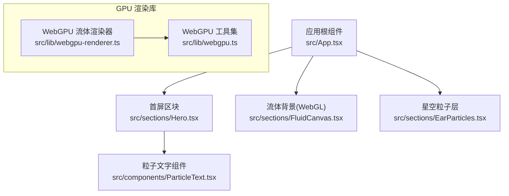
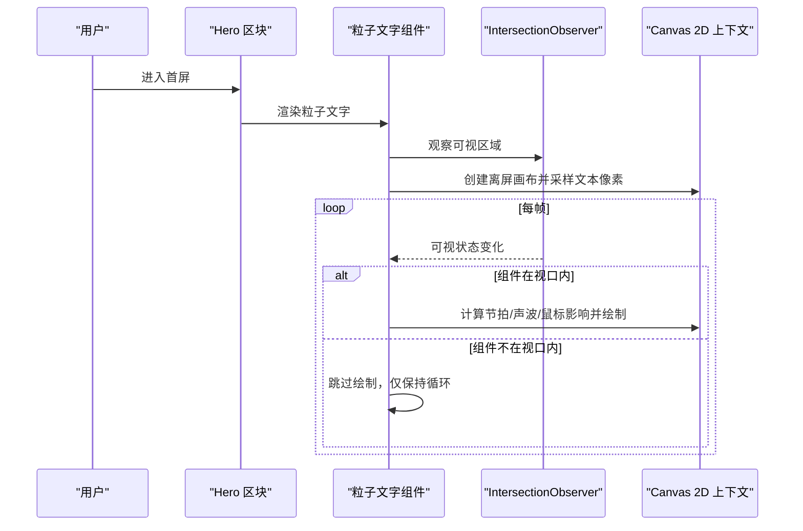
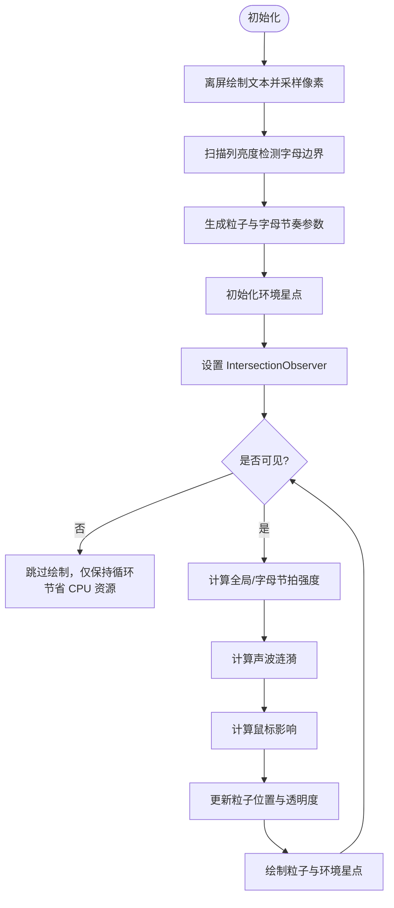
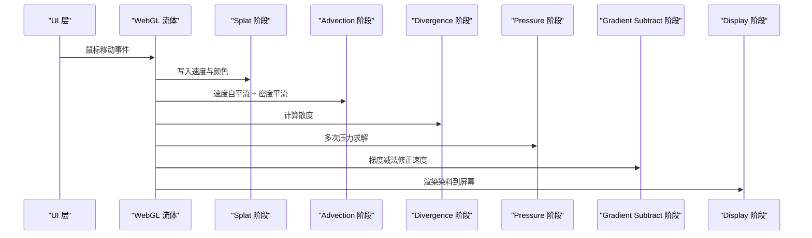
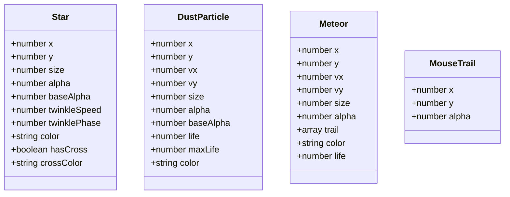
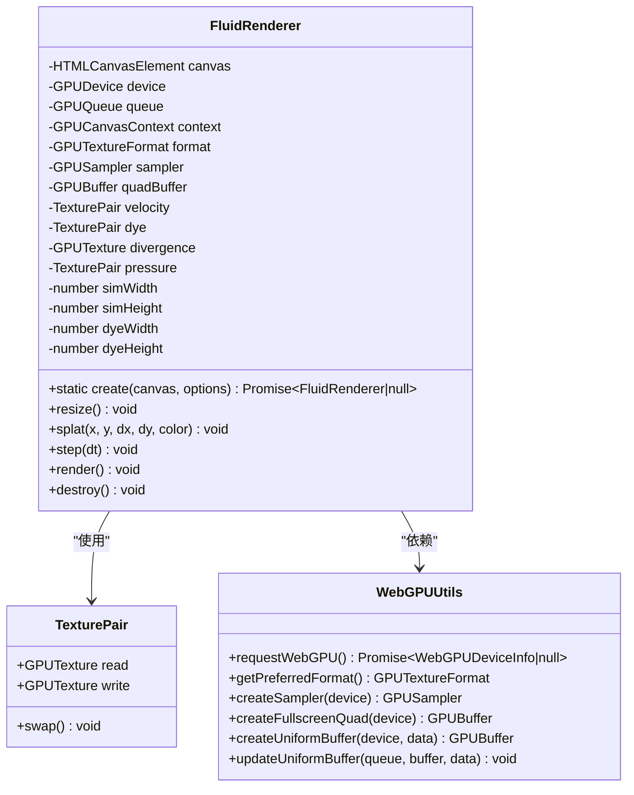
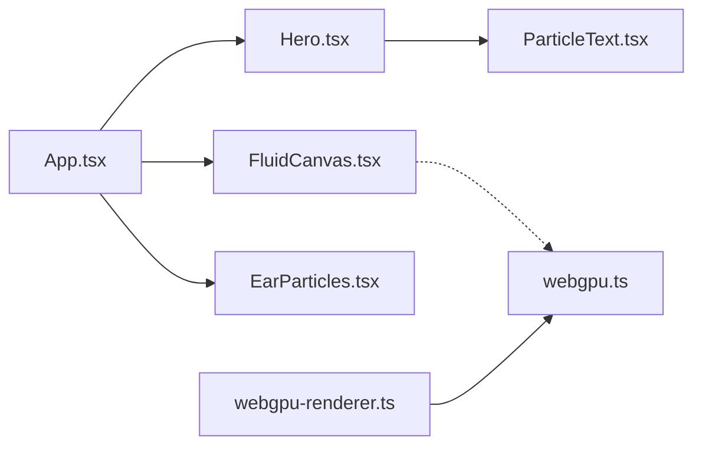

# 粒子文字动画系统

<cite>
**本文引用的文件列表**
- [src/components/ParticleText.tsx](file://src/components/ParticleText.tsx)
- [src/sections/Hero.tsx](file://src/sections/Hero.tsx)
- [src/App.tsx](file://src/App.tsx)
- [src/lib/webgpu-renderer.ts](file://src/lib/webgpu-renderer.ts)
- [src/lib/webgpu.ts](file://src/lib/webgpu.ts)
- [src/sections/FluidCanvas.tsx](file://src/sections/FluidCanvas.tsx)
- [src/sections/EarParticles.tsx](file://src/sections/EarParticles.tsx)
- [src/hooks/use-magnetic.ts](file://src/hooks/use-magnetic.ts)
- [README.md](file://README.md)
- [package.json](file://package.json)
</cite>

## 更新摘要
**变更内容**
- 新增 IntersectionObserver 智能可见性检测优化，显著降低 CPU 占用
- 移除未使用的音频相关变量，进一步优化组件性能
- 增强性能监控和资源管理说明

## 目录
1. [简介](#简介)
2. [项目结构](#项目结构)
3. [核心组件](#核心组件)
4. [架构总览](#架构总览)
5. [详细组件分析](#详细组件分析)
6. [依赖关系分析](#依赖关系分析)
7. [性能考量](#性能考量)
8. [故障排查指南](#故障排查指南)
9. [结论](#结论)
10. [附录](#附录)

## 简介
本仓库为"挠荔枝 Knowledge"产品官网，包含多个高性能视觉与动画模块。其中"粒子文字动画系统"以 Canvas 2D 为核心，将文本像素采样为大量粒子，结合节拍驱动、鼠标交互与环境星点，形成具有律动感的"Knowledge"粒子文字效果。**最新优化**：通过 IntersectionObserver 智能可见性检测，当组件不在视口内时自动暂停动画渲染，显著降低 CPU 占用；同时移除了未使用的音频相关变量，进一步优化了组件性能。项目还集成了 WebGL 流体背景与 WebGPU 流体渲染器（备用），以及全屏星空粒子层，共同构建沉浸式首页体验。

## 项目结构
- 入口与页面组织：App 组合各区块；Hero 区块承载粒子文字主视觉。
- 可视化组件：
  - 粒子文字：基于 Canvas 2D 的文本粒子化与节拍驱动，**新增智能可见性检测**。
  - 流体背景：WebGL 实现的全屏流体交互。
  - 星空粒子：全屏环境粒子层，含流星、光粒与鼠标拖尾。
- GPU 加速：提供 WebGPU 流体渲染器封装，便于扩展或替换底层渲染。

图表来源
- [src/App.tsx:1-30](file://src/App.tsx#L1-L30)
- [src/sections/Hero.tsx:1-146](file://src/sections/Hero.tsx#L1-L146)
- [src/components/ParticleText.tsx:1-440](file://src/components/ParticleText.tsx#L1-L440)
- [src/sections/FluidCanvas.tsx:1-496](file://src/sections/FluidCanvas.tsx#L1-L496)
- [src/sections/EarParticles.tsx:1-615](file://src/sections/EarParticles.tsx#L1-L615)
- [src/lib/webgpu-renderer.ts:1-682](file://src/lib/webgpu-renderer.ts#L1-L682)
- [src/lib/webgpu.ts:1-78](file://src/lib/webgpu.ts#L1-L78)

章节来源
- [src/App.tsx:1-30](file://src/App.tsx#L1-L30)
- [README.md:1-73](file://README.md#L1-L73)
- [package.json:1-81](file://package.json#L1-L81)

## 核心组件
- 粒子文字组件：负责文本采样、字母边界检测、粒子初始化、节拍驱动、鼠标交互与环境星点绘制，**新增 IntersectionObserver 智能可见性检测优化**。
- 流体背景（WebGL）：全屏流体模拟，支持鼠标拖拽注入速度与颜色。
- 星空粒子层：全屏环境粒子，包含闪烁星点、漂移光粒、流星与鼠标拖尾。
- WebGPU 流体渲染器：基于 WebGPU 的流体模拟管线封装，提供 splat、step、render 等接口。

章节来源
- [src/components/ParticleText.tsx:1-440](file://src/components/ParticleText.tsx#L1-L440)
- [src/sections/FluidCanvas.tsx:1-496](file://src/sections/FluidCanvas.tsx#L1-L496)
- [src/sections/EarParticles.tsx:1-615](file://src/sections/EarParticles.tsx#L1-L615)
- [src/lib/webgpu-renderer.ts:1-682](file://src/lib/webgpu-renderer.ts#L1-L682)

## 架构总览
整体采用分层设计：
- 表现层：React 组件（Hero、ParticleText、FluidCanvas、EarParticles）。
- 渲染层：Canvas 2D（粒子文字）、WebGL（流体）、WebGPU（可选流体）。
- 工具层：WebGPU 工具函数（设备请求、纹理格式、采样器、全屏四边形等）。
- 交互层：鼠标事件、**IntersectionObserver 智能可见性检测**、FPS 自适应降级。

图表来源
- [src/sections/Hero.tsx:1-146](file://src/sections/Hero.tsx#L1-L146)
- [src/components/ParticleText.tsx:1-440](file://src/components/ParticleText.tsx#L1-L440)

## 详细组件分析

### 粒子文字组件（Canvas 2D）
- 文本采样与字母分组
  - 使用离屏 Canvas 绘制文本，读取像素数据，按列平均亮度检测字母边界，得到每个字母的 x 区间。
  - 根据粒子所在 x 位置映射到对应字母索引，用于后续独立节拍参数。
- 粒子数据结构
  - 基础属性：baseX/baseY、size、alpha、phase、offsetX/Y、pulseX/Y、warmth。
  - 字母节奏：letterIdx、bpmOffset、beatPhaseOffset、kickWeight、hihatWeight、swingAmount、grooveDelay。
- 节拍系统
  - 全局 BPM 与 hi-hat 碎拍；每个字母拥有独立的 BPM 偏移、节拍相位偏移、频段权重与摇摆感。
  - 综合强度由底鼓、军鼓、hi-hat 与低频 Bass 加权合成，驱动位移与透明度脉动。
- 声波涟漪
  - 从中心向外扩散的正弦波，距离引入延迟，增强空间层次感。
- 鼠标交互
  - 在半径内对粒子施加排斥力，平滑衰减，提升互动感。
- 环境星点
  - 少量漂浮星点随 kick 节拍闪烁，较大星点带径向渐变光晕。
- **性能优化（已更新）**
  - **IntersectionObserver 智能可见性检测**：当组件不在视口内时自动暂停渲染，显著降低 CPU 占用。
  - 移动端降低分辨率与采样间隔；减少不必要的重绘。
  - **移除未使用的音频相关变量**：清理了 snare、bass、beatIntensity 等未使用的全局变量，优化内存使用。

图表来源
- [src/components/ParticleText.tsx:1-440](file://src/components/ParticleText.tsx#L1-L440)

章节来源
- [src/components/ParticleText.tsx:1-440](file://src/components/ParticleText.tsx#L1-L440)

### 流体背景（WebGL）
- 功能概述
  - 全屏流体模拟，支持鼠标拖拽注入速度与颜色，产生流动色彩背景。
- 关键流程
  - 初始化 WebGL 上下文与着色器程序（splat、advection、divergence、pressure、gradientSubtract、display）。
  - 双缓冲 FBO 管理速度场与染料场，逐步执行 advect → divergence → pressure solve → gradient subtract。
  - 显示阶段将染料场输出到屏幕。
- 性能策略
  - 低配设备自动降低 SIM/DYE 分辨率与压力迭代次数；FPS 监控触发隔帧渲染降级。
  - IntersectionObserver 不可见时暂停动画。

图表来源
- [src/sections/FluidCanvas.tsx:1-496](file://src/sections/FluidCanvas.tsx#L1-L496)

章节来源
- [src/sections/FluidCanvas.tsx:1-496](file://src/sections/FluidCanvas.tsx#L1-L496)

### 星空粒子层（全屏环境）
- 元素构成
  - 星点：随机大小与亮度，部分带十字星芒与光晕。
  - 光粒：布朗运动，桌面端受鼠标引力，移动端微风效果。
  - 流星：周期性出现，带拖尾轨迹。
  - 鼠标拖尾：沿路径留下渐隐光点，配合柔光大光晕跟随。
- 性能与适配
  - 低端设备减半粒子数量；FPS 低于阈值时降级为简单绘制；IntersectionObserver 控制运行。

图表来源
- [src/sections/EarParticles.tsx:1-615](file://src/sections/EarParticles.tsx#L1-L615)

章节来源
- [src/sections/EarParticles.tsx:1-615](file://src/sections/EarParticles.tsx#L1-L615)

### WebGPU 流体渲染器（可选）
- 能力概览
  - 封装 WebGPU 设备、队列、管道与纹理对，提供 splat、step、render 接口。
  - 内置 WGSL 片段着色器实现 splat、advection、divergence、pressure、gradientSubtract、display。
- 关键流程
  - 初始化：创建 Uniform 缓冲区、Sampler、全屏四边形顶点缓冲。
  - 配置 Canvas 上下文与首选纹理格式。
  - 每步：写入 uniform（时间步长、耗散系数、像素尺寸），绑定纹理与缓冲，提交命令编码。
- 资源管理
  - 提供 destroy 方法释放 Buffer/Texture，避免内存泄漏。

图表来源
- [src/lib/webgpu-renderer.ts:1-682](file://src/lib/webgpu-renderer.ts#L1-L682)
- [src/lib/webgpu.ts:1-78](file://src/lib/webgpu.ts#L1-L78)

章节来源
- [src/lib/webgpu-renderer.ts:1-682](file://src/lib/webgpu-renderer.ts#L1-L682)
- [src/lib/webgpu.ts:1-78](file://src/lib/webgpu.ts#L1-L78)

### 磁吸按钮 Hook
- 功能说明
  - 当鼠标靠近锚点时，根据距离与强度计算偏移量，使按钮向鼠标方向轻微移动，离开后复位。
- 使用场景
  - Hero 区块中的下载按钮，增强交互吸引力。

章节来源
- [src/hooks/use-magnetic.ts:1-32](file://src/hooks/use-magnetic.ts#L1-L32)
- [src/sections/Hero.tsx:1-146](file://src/sections/Hero.tsx#L1-L146)

## 依赖关系分析
- 组件耦合
  - Hero 依赖 ParticleText 作为主视觉；App 组合所有区块。
  - FluidCanvas 与 EarParticles 均为全屏背景层，彼此独立。
- 外部依赖
  - React 19、Vite 7、Tailwind CSS 3、shadcn/ui 等。
  - WebGPU 类型定义用于 TS 编译期检查。
- 潜在循环依赖
  - 当前结构无直接循环导入；各模块职责清晰。

图表来源
- [src/App.tsx:1-30](file://src/App.tsx#L1-L30)
- [src/sections/Hero.tsx:1-146](file://src/sections/Hero.tsx#L1-L146)
- [src/components/ParticleText.tsx:1-440](file://src/components/ParticleText.tsx#L1-L440)
- [src/sections/FluidCanvas.tsx:1-496](file://src/sections/FluidCanvas.tsx#L1-L496)
- [src/sections/EarParticles.tsx:1-615](file://src/sections/EarParticles.tsx#L1-L615)
- [src/lib/webgpu-renderer.ts:1-682](file://src/lib/webgpu-renderer.ts#L1-L682)
- [src/lib/webgpu.ts:1-78](file://src/lib/webgpu.ts#L1-L78)

章节来源
- [package.json:1-81](file://package.json#L1-L81)

## 性能考量
- **粒子文字（已优化）**
  - **IntersectionObserver 智能可见性检测**：当组件不在视口内时自动暂停渲染，显著降低 CPU 占用。
  - 移动端降低字体大小、采样间隔与环境粒子数量。
  - **移除未使用的音频相关变量**：清理了 snare、bass、beatIntensity 等全局变量，优化内存使用。
- 流体背景
  - 低端设备降低 SIM/DYE 分辨率与压力迭代次数；FPS 低于阈值时隔帧渲染。
- 星空粒子
  - 低端设备减半粒子数量；复杂绘制在降级模式下简化。
- 通用建议
  - 使用 requestAnimationFrame 节流；避免频繁创建对象；预计算颜色字符串减少运行时开销。

## 故障排查指南
- 粒子文字未显示
  - 检查 Canvas 上下文获取是否成功；确认离屏画布尺寸与 DPR 设置正确。
  - 确认文本像素采样阈值与字母边界检测逻辑是否命中。
  - **检查 IntersectionObserver 是否正确工作**：确认 isVisible 状态切换正常。
- 流体背景无响应
  - 检查 WebGL 上下文与扩展是否启用；确认指针坐标归一化与 splat 调用时机。
  - 若 FPS 过低，查看降级逻辑是否生效。
- WebGPU 渲染器失败
  - 确认浏览器支持 WebGPU；requestWebGPU 返回 null 时需回退到 WebGL 或其他方案。
  - 检查纹理格式与 Sampler 配置是否正确。
- 星空粒子卡顿
  - 检查低端设备判定与粒子数量；确认 IntersectionObserver 与 FPS 监控逻辑。

章节来源
- [src/components/ParticleText.tsx:1-440](file://src/components/ParticleText.tsx#L1-L440)
- [src/sections/FluidCanvas.tsx:1-496](file://src/sections/FluidCanvas.tsx#L1-L496)
- [src/lib/webgpu-renderer.ts:1-682](file://src/lib/webgpu-renderer.ts#L1-L682)
- [src/sections/EarParticles.tsx:1-615](file://src/sections/EarParticles.tsx#L1-L615)

## 结论
该粒子文字动画系统通过文本像素采样与节拍驱动，实现了富有律动感与层次感的视觉效果。**最新的性能优化**包括 IntersectionObserver 智能可见性检测和未使用变量清理，进一步提升了运行效率。配合全屏流体背景与星空粒子层，构建了沉浸式的首页体验。系统在性能方面做了充分适配与降级处理，确保在不同设备上均有良好表现。WebGPU 渲染器的存在为未来扩展提供了更高效的流体模拟能力。

## 附录
- 技术栈与脚本
  - React 19、TypeScript、Vite 7、Tailwind CSS 3、shadcn/ui、Lucide React 等。
  - 开发脚本：dev/build/lint/preview。
- 品牌与设计
  - 品牌色：荔枝红 #D44B3D；默认深色主题。

章节来源
- [README.md:1-73](file://README.md#L1-L73)
- [package.json:1-81](file://package.json#L1-L81)