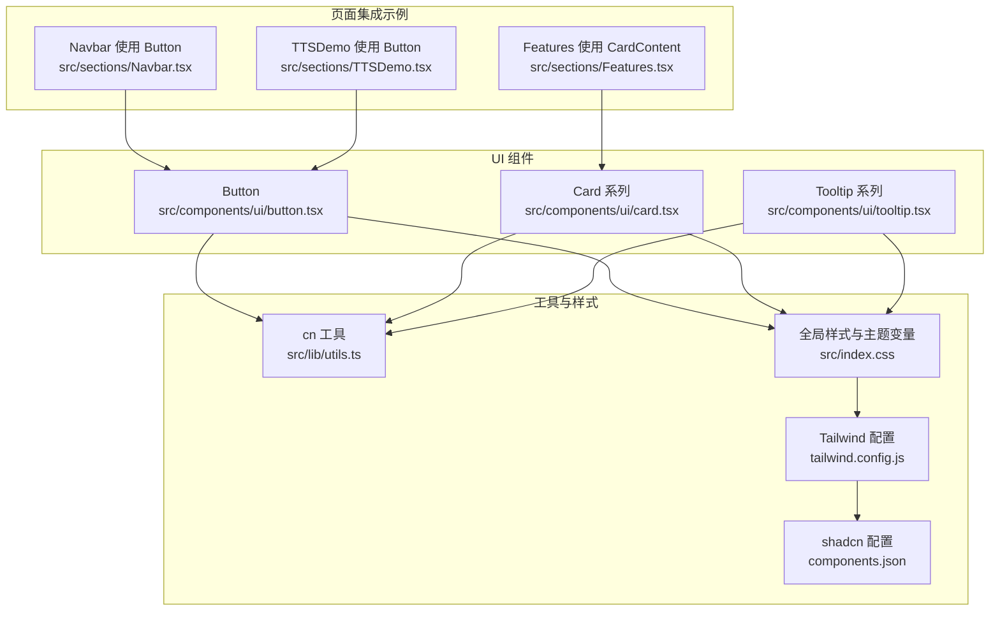
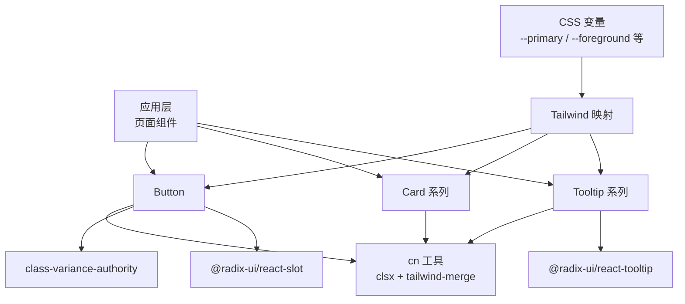
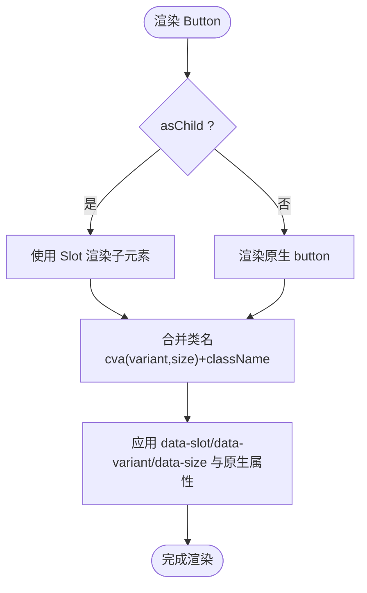
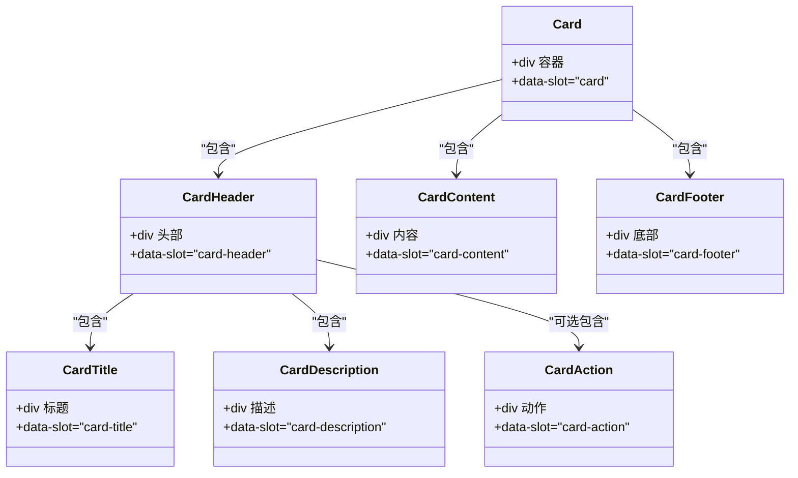
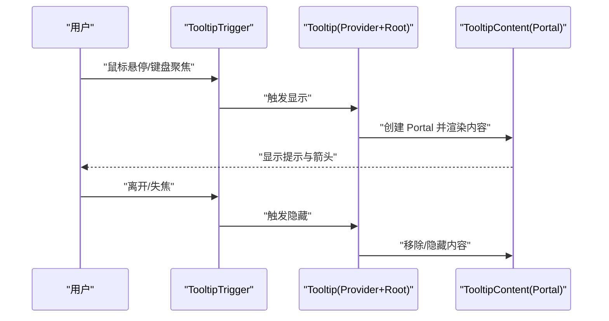
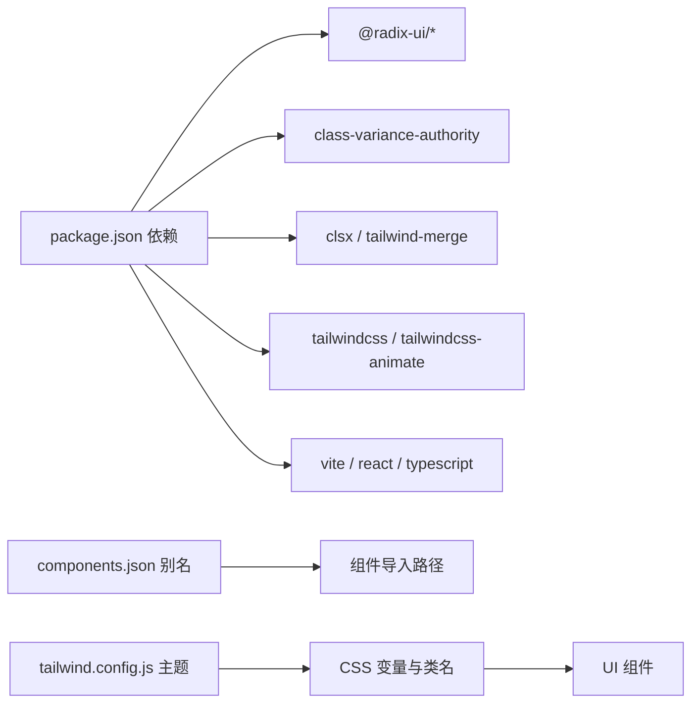

# 组件库

<cite>
**本文引用的文件**
- [button.tsx](file://src/components/ui/button.tsx)
- [card.tsx](file://src/components/ui/card.tsx)
- [tooltip.tsx](file://src/components/ui/tooltip.tsx)
- [utils.ts](file://src/lib/utils.ts)
- [index.css](file://src/index.css)
- [tailwind.config.js](file://tailwind.config.js)
- [components.json](file://components.json)
- [package.json](file://package.json)
- [Navbar.tsx](file://src/sections/Navbar.tsx)
- [Features.tsx](file://src/sections/Features.tsx)
- [TTSDemo.tsx](file://src/sections/TTSDemo.tsx)
</cite>

## 目录
1. [简介](#简介)
2. [项目结构](#项目结构)
3. [核心组件](#核心组件)
4. [架构总览](#架构总览)
5. [详细组件分析](#详细组件分析)
6. [依赖分析](#依赖分析)
7. [性能考虑](#性能考虑)
8. [故障排查指南](#故障排查指南)
9. [结论](#结论)
10. [附录](#附录)

## 简介
本文件为挠荔枝官网的 UI 组件库文档，聚焦基础 UI 组件 Button、Card、Tooltip 的视觉外观、行为与交互模式。文档覆盖属性、事件、插槽与自定义选项，提供使用示例路径、响应式设计与无障碍访问建议、状态与动画说明、样式与主题定制方式，以及跨浏览器兼容性与性能优化要点，并记录组件组合与集成模式。

## 项目结构
UI 组件位于 src/components/ui 下，采用 shadcn/ui 风格与 Tailwind CSS 原子化样式体系；主题变量集中于全局样式，通过 Tailwind 配置映射到语义化颜色与圆角等设计令牌。

图表来源
- [button.tsx:1-63](file://src/components/ui/button.tsx#L1-L63)
- [card.tsx:1-93](file://src/components/ui/card.tsx#L1-L93)
- [tooltip.tsx:1-62](file://src/components/ui/tooltip.tsx#L1-L62)
- [utils.ts:1-7](file://src/lib/utils.ts#L1-L7)
- [index.css:1-116](file://src/index.css#L1-L116)
- [tailwind.config.js:1-92](file://tailwind.config.js#L1-L92)
- [components.json:1-23](file://components.json#L1-L23)
- [Navbar.tsx:1-117](file://src/sections/Navbar.tsx#L1-L117)
- [Features.tsx:1-91](file://src/sections/Features.tsx#L1-L91)
- [TTSDemo.tsx:1-344](file://src/sections/TTSDemo.tsx#L1-L344)

章节来源
- [components.json:1-23](file://components.json#L1-L23)
- [tailwind.config.js:1-92](file://tailwind.config.js#L1-L92)
- [index.css:1-116](file://src/index.css#L1-L116)

## 核心组件
本节概述各组件的职责、默认外观与可配置项，便于快速上手与统一规范。

- Button
  - 职责：通用触发按钮，支持多种变体与尺寸，适配图标与文本组合。
  - 外观：默认主色填充，悬停加深；轮廓、次要、幽灵、链接等变体；多尺寸（默认、小、大、图标族）。
  - 交互：焦点环、禁用态、ARIA 无效态提示；可通过 asChild 透传至外部元素。
  - 关键属性：variant、size、asChild、className 及原生 button 属性。
  - 事件：透传所有原生事件（onClick 等）。
  - 插槽：作为 Slot 使用时可将子元素渲染为原生目标节点。
  - 自定义：通过 class-variance-authority 扩展变体与尺寸；通过 cn 合并类名。

- Card 系列
  - 职责：信息卡片容器与分区布局，包含 Header、Title、Description、Action、Content、Footer。
  - 外观：圆角边框、阴影、内边距与间距；头部支持网格布局与右侧 Action 对齐。
  - 交互：无内置交互，适合承载内容区块与操作入口。
  - 关键属性：各子组件均接受 className 与原生 div 属性。
  - 组合：推荐按“Header + Title/Description + Content + Footer”顺序组织。

- Tooltip 系列
  - 职责：轻量级浮层提示，用于补充说明或快捷提示。
  - 外观：前景/背景对比色、圆角、小字号；带箭头指向触发器。
  - 交互：悬停/聚焦显示，离开隐藏；支持延迟与偏移；Portal 渲染避免层级问题。
  - 关键属性：Provider 延迟、Root 控制、Trigger 触发器、Content 内容与 sideOffset。
  - 事件：透传 Radix 底层事件（如 onOpenChange 等）。
  - 自定义：通过 className 覆盖样式；结合 animate-in/tw-animate-css 实现入场动画。

章节来源
- [button.tsx:1-63](file://src/components/ui/button.tsx#L1-L63)
- [card.tsx:1-93](file://src/components/ui/card.tsx#L1-L93)
- [tooltip.tsx:1-62](file://src/components/ui/tooltip.tsx#L1-L62)

## 架构总览
组件基于 React + TypeScript，样式由 Tailwind CSS 驱动，主题通过 CSS 变量与 Tailwind 映射；组件间通过 props 与组合模式协作，Tooltip 借助 Radix Portal 解决定位与层级问题。

图表来源
- [button.tsx:1-63](file://src/components/ui/button.tsx#L1-L63)
- [card.tsx:1-93](file://src/components/ui/card.tsx#L1-L93)
- [tooltip.tsx:1-62](file://src/components/ui/tooltip.tsx#L1-L62)
- [utils.ts:1-7](file://src/lib/utils.ts#L1-L7)
- [index.css:1-116](file://src/index.css#L1-L116)
- [tailwind.config.js:1-92](file://tailwind.config.js#L1-L92)

## 详细组件分析

### Button 组件
- 属性
  - variant：default、destructive、outline、secondary、ghost、link
  - size：default、sm、lg、icon、icon-sm、icon-lg
  - asChild：boolean，是否将自身渲染为子元素的目标节点
  - className：string，附加样式
  - 其余：透传所有原生 button 属性（type、disabled、aria-* 等）
- 事件
  - 透传原生事件（onClick、onFocus、onBlur 等）
- 插槽
  - 当 asChild=true 时，子元素将被渲染为实际 DOM 节点，常用于与路由或第三方组件集成
- 状态与交互
  - 禁用态：pointer-events-none、opacity 降低
  - 焦点态：focus-visible 环与边框高亮
  - 无效态：aria-invalid 时 ring/border 使用破坏色
- 动画与过渡
  - transition-all 平滑过渡；hover 时背景/文字变化
- 自定义与主题
  - 通过 Tailwind 语义色（primary、background、accent 等）与 CSS 变量实现明暗主题切换
  - 通过 cva 扩展新的 variant/size
- 使用示例路径
  - 导航栏下载按钮：[Navbar.tsx:21-24](file://src/sections/Navbar.tsx#L21-L24)
  - TTS 演示播放/暂停/停止按钮：[TTSDemo.tsx:280-310](file://src/sections/TTSDemo.tsx#L280-L310)

图表来源
- [button.tsx:39-60](file://src/components/ui/button.tsx#L39-L60)
- [utils.ts:4-6](file://src/lib/utils.ts#L4-L6)

章节来源
- [button.tsx:1-63](file://src/components/ui/button.tsx#L1-L63)
- [Navbar.tsx:1-117](file://src/sections/Navbar.tsx#L1-L117)
- [TTSDemo.tsx:1-344](file://src/sections/TTSDemo.tsx#L1-L344)

### Card 组件家族
- 组件清单
  - Card：外层容器，圆角、边框、阴影、纵向堆叠
  - CardHeader：头部区域，网格布局，支持右侧 Action 对齐
  - CardTitle：标题，强调字重
  - CardDescription：描述，较小字号与弱化色
  - CardAction：头部右侧操作区
  - CardContent：主体内容区
  - CardFooter：底部操作区，支持顶部分割线
- 属性
  - 每个子组件均接受 className 与原生 div 属性
- 布局与响应式
  - 头部使用 grid 布局，配合 has-data-[slot=card-action] 条件调整列分布
  - 间距与内边距通过 Tailwind 原子类控制，易于在移动端微调
- 使用示例路径
  - 特性卡片内容区：[Features.tsx:45-58](file://src/sections/Features.tsx#L45-L58)

图表来源
- [card.tsx:5-82](file://src/components/ui/card.tsx#L5-L82)

章节来源
- [card.tsx:1-93](file://src/components/ui/card.tsx#L1-L93)
- [Features.tsx:1-91](file://src/sections/Features.tsx#L1-L91)

### Tooltip 组件家族
- 组件清单
  - TooltipProvider：全局 Provider，设置延迟等
  - Tooltip：根节点，自动包裹 Provider
  - TooltipTrigger：触发器
  - TooltipContent：内容面板，Portal 渲染，含箭头
- 属性
  - Provider：delayDuration
  - Root：受控/非受控打开关闭、侧向等
  - Trigger：任意可聚焦/可交互元素
  - Content：sideOffset、children、className
- 事件
  - 透传 Radix 事件（如 onOpenChange、onPointerDownOutside 等）
- 动画与过渡
  - 使用 animate-in/tw-animate-css 实现淡入缩放与滑入效果
- 使用示例路径
  - 当前仓库未直接引用 Tooltip 的具体页面示例，可按需引入：[tooltip.tsx:1-62](file://src/components/ui/tooltip.tsx#L1-L62)

图表来源
- [tooltip.tsx:8-59](file://src/components/ui/tooltip.tsx#L8-L59)

章节来源
- [tooltip.tsx:1-62](file://src/components/ui/tooltip.tsx#L1-L62)

## 依赖分析
- 运行时依赖
  - @radix-ui/react-tooltip：无障碍友好的 Tooltip 基础能力
  - @radix-ui/react-slot：将组件渲染为子元素目标节点
  - class-variance-authority：声明式变体管理
  - clsx + tailwind-merge：类名安全合并
- 构建与样式
  - Tailwind CSS 3 + tailwindcss-animate：原子化样式与动画
  - Vite + React 19 + TypeScript：现代前端工程化
- 主题与别名
  - components.json 定义别名（@/components、@/lib、@/ui 等），便于导入
  - tailwind.config.js 映射语义色、圆角、阴影、动画 keyframes

图表来源
- [package.json:12-57](file://package.json#L12-L57)
- [components.json:14-21](file://components.json#L14-L21)
- [tailwind.config.js:1-92](file://tailwind.config.js#L1-L92)

章节来源
- [package.json:1-80](file://package.json#L1-L80)
- [components.json:1-23](file://components.json#L1-L23)
- [tailwind.config.js:1-92](file://tailwind.config.js#L1-L92)

## 性能考虑
- 类名合并
  - 使用 cn 工具进行 clsx + tailwind-merge 合并，避免重复与冲突类名，减少样式计算开销
- 动画与过渡
  - 优先使用 CSS transform/opacity 动画，避免重排；组件已采用 transition-all 与 tw-animate-css 的轻量动画
- 渲染层级
  - Tooltip 使用 Portal 渲染，避免复杂嵌套导致的层级与重绘问题
- 资源加载
  - 字体与图标按需加载；Tailwind 仅生成使用到的类，减小产物体积
- 事件处理
  - 高频事件（如滚动、指针移动）建议在业务层节流/防抖；组件本身不引入额外监听

章节来源
- [utils.ts:1-7](file://src/lib/utils.ts#L1-L7)
- [tooltip.tsx:44-58](file://src/components/ui/tooltip.tsx#L44-L58)
- [tailwind.config.js:65-91](file://tailwind.config.js#L65-L91)

## 故障排查指南
- 主题变量未生效
  - 检查 index.css 中 CSS 变量定义与 .dark 模式是否正确挂载
  - 确认 tailwind.config.js 中的 colors 映射与 prefix 配置
- 类名冲突或样式不生效
  - 确保通过 cn 合并类名；避免直接拼接字符串导致 tailwind-merge 失效
- Tooltip 无法显示或被遮挡
  - 检查父容器 overflow/transform 影响；确认 Portal 渲染层级 z-index 未被覆盖
- 按钮不可点击
  - 检查 disabled 属性与 pointer-events 样式；确认 asChild 后子元素是否具备可点击性
- 无障碍提示缺失
  - 为交互元素添加 aria-label、aria-describedby 等必要属性；Tooltip 内容应关联触发器

章节来源
- [index.css:7-68](file://src/index.css#L7-L68)
- [tailwind.config.js:10-54](file://tailwind.config.js#L10-L54)
- [utils.ts:4-6](file://src/lib/utils.ts#L4-L6)
- [tooltip.tsx:44-58](file://src/components/ui/tooltip.tsx#L44-L58)
- [button.tsx:39-60](file://src/components/ui/button.tsx#L39-L60)

## 结论
本组件库以 shadcn/ui 为基础，结合 Tailwind 与 CSS 变量实现了高度可定制的 UI 系统。Button、Card、Tooltip 覆盖了常见交互场景，具备良好的可组合性与可扩展性。通过统一的类名合并、语义化主题与 Portal 渲染，兼顾了可维护性、可访问性与性能表现。

## 附录

### 使用示例与代码片段路径
- Button 在导航栏中的应用
  - 路径：[Navbar.tsx:21-24](file://src/sections/Navbar.tsx#L21-L24)
- Button 在 TTS 演示中的应用（播放/暂停/停止）
  - 路径：[TTSDemo.tsx:280-310](file://src/sections/TTSDemo.tsx#L280-L310)
- CardContent 在特性卡片中的应用
  - 路径：[Features.tsx:45-58](file://src/sections/Features.tsx#L45-L58)

### 响应式设计指南
- 使用 Tailwind 断点（sm/md/lg/xl）控制布局与字号
- 头部网格与 Action 对齐在不同屏幕下自适应
- 按钮在小屏上可采用全宽或图标尺寸，提升触控体验

### 无障碍访问合规指南
- 为所有可交互元素提供语义标签与 ARIA 属性（aria-label、aria-describedby、role 等）
- 确保键盘可达与焦点可见（focus-visible 环）
- Tooltip 内容应与触发器建立关联，避免纯装饰性信息被读屏忽略

### 状态、动画与过渡
- Button：hover/focus/disabled/aria-invalid 状态清晰
- Tooltip：打开/关闭使用淡入缩放与滑入动画
- 全局动画：通过 tailwindcss-animate 与自定义 keyframes 提供一致动效

### 样式自定义与主题支持
- 通过修改 index.css 中的 CSS 变量（--primary、--foreground 等）实现品牌色与明暗主题
- 通过 tailwind.config.js 扩展颜色、圆角、阴影与动画
- 通过 cva 扩展 Button 的 variant/size，保持类型安全

### 跨浏览器兼容性
- 使用 Web Speech API 的页面（TTS 演示）需在支持该 API 的浏览器中运行；不支持时应给出降级提示
- Tooltip 依赖 Radix 与 Portal，主流现代浏览器均可良好工作

### 组件组合与集成模式
- Button 可作为独立触发器，也可通过 asChild 与路由/第三方组件无缝集成
- Card 系列按语义分区组合，便于复用与二次封装
- Tooltip 与任何可聚焦/可交互元素组合，提供上下文帮助