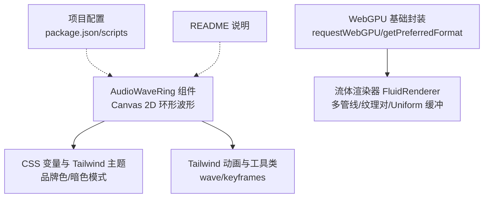
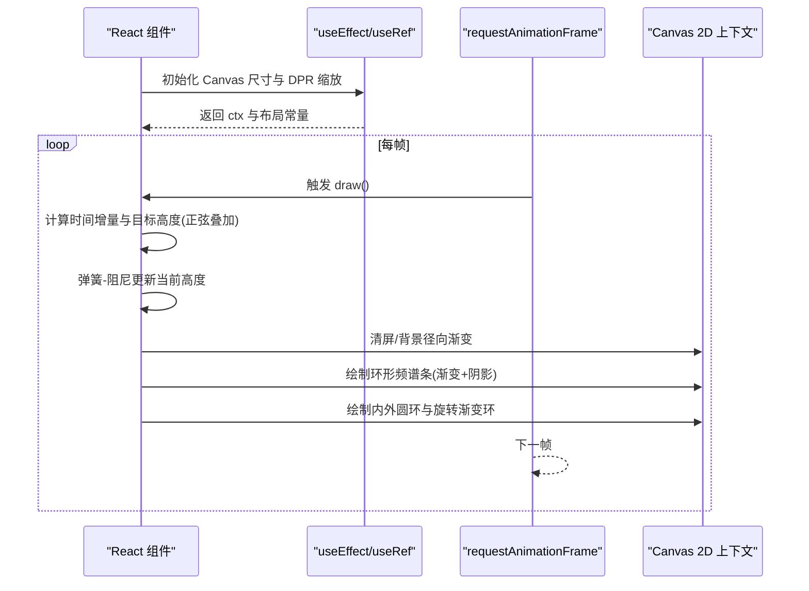
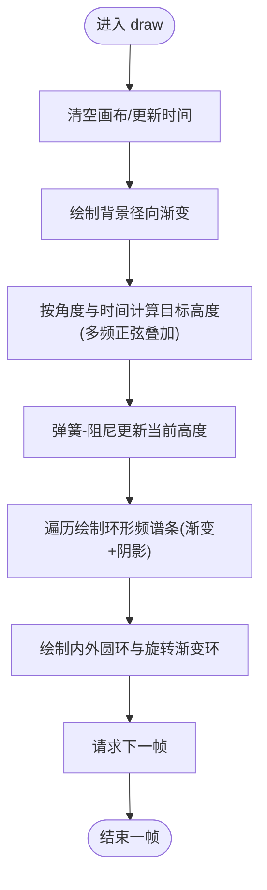
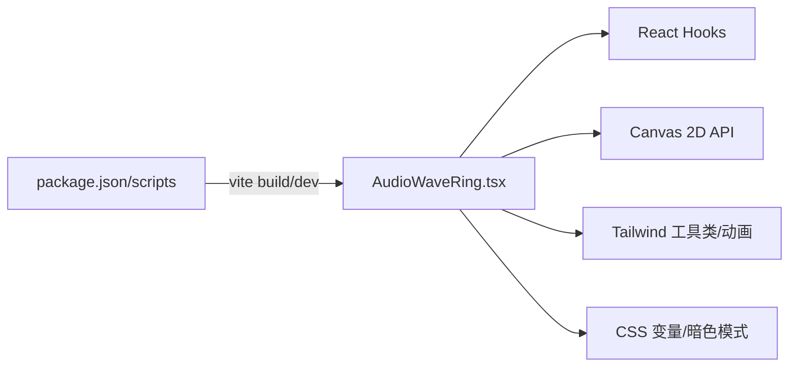

# 音频波形环组件

<cite>
**本文引用的文件**
- [src/components/AudioWaveRing.tsx](file://src/components/AudioWaveRing.tsx)
- [README.md](file://README.md)
- [package.json](file://package.json)
- [tailwind.config.js](file://tailwind.config.js)
- [src/index.css](file://src/index.css)
- [src/lib/webgpu-renderer.ts](file://src/lib/webgpu-renderer.ts)
- [src/lib/webgpu.ts](file://src/lib/webgpu.ts)
</cite>

## 目录
1. [简介](#简介)
2. [项目结构](#项目结构)
3. [核心组件](#核心组件)
4. [架构总览](#架构总览)
5. [详细组件分析](#详细组件分析)
6. [依赖关系分析](#依赖关系分析)
7. [性能考量](#性能考量)
8. [故障排查指南](#故障排查指南)
9. [结论](#结论)
10. [附录](#附录)

## 简介
本文件聚焦于“音频波形环”可视化组件，该组件以 Canvas 2D 绘制环形频谱条，并通过正弦波叠加与弹簧阻尼动画实现平滑、有机的律动效果。组件采用固定尺寸画布与设备像素比适配，结合径向渐变背景、辉光阴影与旋转渐变外环，营造沉浸式音频氛围视觉。同时，仓库内还包含基于 WebGPU 的流体渲染器（FluidRenderer），可用于更复杂的 GPU 加速可视化场景。

## 项目结构
围绕音频波形环的相关代码主要位于以下位置：
- 组件实现：src/components/AudioWaveRing.tsx
- 样式与主题：src/index.css、tailwind.config.js
- 构建与脚本：package.json
- 文档说明：README.md
- 可选 GPU 渲染能力：src/lib/webgpu-renderer.ts、src/lib/webgpu.ts

图表来源
- [src/components/AudioWaveRing.tsx:1-179](file://src/components/AudioWaveRing.tsx#L1-L179)
- [src/index.css:1-314](file://src/index.css#L1-L314)
- [tailwind.config.js:1-92](file://tailwind.config.js#L1-L92)
- [src/lib/webgpu.ts:1-78](file://src/lib/webgpu.ts#L1-L78)
- [src/lib/webgpu-renderer.ts:1-682](file://src/lib/webgpu-renderer.ts#L1-L682)
- [package.json:1-81](file://package.json#L1-L81)
- [README.md:1-73](file://README.md#L1-L73)

章节来源
- [README.md:1-73](file://README.md#L1-L73)
- [package.json:1-81](file://package.json#L1-L81)

## 核心组件
- AudioWaveRing：纯函数式 React 组件，内部使用 useEffect + useRef 管理 Canvas 生命周期与动画循环；通过 requestAnimationFrame 驱动帧更新，计算目标高度并应用弹簧物理，最终在 Canvas 上绘制环形频谱条、背景辉光与装饰性圆环。

章节来源
- [src/components/AudioWaveRing.tsx:1-179](file://src/components/AudioWaveRing.tsx#L1-L179)

## 架构总览
从渲染路径看，组件遵循“状态计算 → 物理模拟 → 绘制输出”的闭环：
- 状态计算：根据时间与角度生成多频正弦波叠加的目标高度序列
- 物理模拟：弹簧-阻尼系统使当前高度平滑逼近目标高度
- 绘制输出：逐条绘制带渐变的矩形条，附加阴影辉光，并绘制内外装饰圆环与旋转渐变环

图表来源
- [src/components/AudioWaveRing.tsx:6-156](file://src/components/AudioWaveRing.tsx#L6-L156)

## 详细组件分析

### 组件结构与职责
- 生命周期管理：在挂载时创建 Canvas 上下文、设置尺寸与 DPR 缩放，启动动画循环；卸载时取消动画帧，避免内存泄漏。
- 渲染参数：中心点、环半径、柱数量、柱宽等几何参数集中定义，便于调优。
- 动画数据：维护三组数组——当前高度、目标高度、速度，用于弹簧物理。
- 视觉效果：背景径向渐变、条形渐变、阴影辉光、内外圆环线、旋转渐变环。

章节来源
- [src/components/AudioWaveRing.tsx:1-179](file://src/components/AudioWaveRing.tsx#L1-L179)

### 动画算法流程

图表来源
- [src/components/AudioWaveRing.tsx:40-149](file://src/components/AudioWaveRing.tsx#L40-L149)

### 关键数据结构与复杂度
- 数据结构
  - barHeights: number[] —— 当前高度
  - barTargets: number[] —— 目标高度
  - barVelocities: number[] —— 速度
- 时间复杂度
  - 每帧 O(N)，N 为柱数（默认 80）
- 空间复杂度
  - O(N) 存储三组数组

章节来源
- [src/components/AudioWaveRing.tsx:27-35](file://src/components/AudioWaveRing.tsx#L27-L35)
- [src/components/AudioWaveRing.tsx:56-75](file://src/components/AudioWaveRing.tsx#L56-L75)

### 可配置项与扩展建议
- 可调参数（建议通过 props 暴露）
  - 柱数量 bars、环半径 ringRadius、柱宽 barWidth
  - 弹簧系数 spring、阻尼 damping
  - 背景辉光强度、颜色与范围
  - 渐变配色方案（HSL 色调区间）
- 交互增强
  - 鼠标悬停改变局部柱高或相位偏移
  - 点击触发脉冲扩散
- 性能优化
  - 将高频三角函数结果缓存或预计算
  - 降低 DPR 上限或在低性能设备上减少 bars
  - 使用离屏 Canvas 缓存静态背景层

章节来源
- [src/components/AudioWaveRing.tsx:21-35](file://src/components/AudioWaveRing.tsx#L21-L35)
- [src/components/AudioWaveRing.tsx:66-75](file://src/components/AudioWaveRing.tsx#L66-L75)

### 与 WebGPU 渲染器的关系
- 当前 AudioWaveRing 使用 Canvas 2D，未直接依赖 WebGPU。
- 若需更高性能的复杂粒子/流体效果，可参考 FluidRenderer 的多管线与双缓冲纹理设计思路，迁移至 WebGPU 以提升吞吐。

章节来源
- [src/lib/webgpu-renderer.ts:28-124](file://src/lib/webgpu-renderer.ts#L28-L124)
- [src/lib/webgpu.ts:11-35](file://src/lib/webgpu.ts#L11-L35)

## 依赖关系分析
- 运行时依赖
  - React Hooks：useEffect、useRef
  - Canvas 2D API：getContext、createLinearGradient、createRadialGradient、roundRect、shadowBlur 等
- 样式依赖
  - Tailwind CSS 工具类与自定义 keyframes（wave）
  - CSS 变量与暗色模式主题
- 构建与脚本
  - Vite 开发/构建命令
  - TypeScript 类型检查

图表来源
- [src/components/AudioWaveRing.tsx:1-179](file://src/components/AudioWaveRing.tsx#L1-L179)
- [tailwind.config.js:65-92](file://tailwind.config.js#L65-L92)
- [src/index.css:1-314](file://src/index.css#L1-L314)
- [package.json:6-11](file://package.json#L6-L11)

章节来源
- [tailwind.config.js:1-92](file://tailwind.config.js#L1-L92)
- [src/index.css:1-314](file://src/index.css#L1-L314)
- [package.json:1-81](file://package.json#L1-L81)

## 性能考量
- 绘制成本
  - 每帧 N 次 roundRect 与渐变绘制，N=80 时开销适中；在高 DPI 屏幕下注意 DPR 放大带来的像素填充压力。
- 物理步进
  - 弹簧-阻尼稳定收敛，但需避免过大 spring 导致抖动。
- 优化建议
  - 限制最大 DPR（如 min(dpr, 2)）
  - 在低端设备上减少 bars 或关闭部分辉光
  - 将静态背景层缓存到离屏 Canvas，仅重绘动态条
  - 使用 requestIdleCallback 在非关键帧执行非实时逻辑

[本节为通用指导，不直接分析具体文件]

## 故障排查指南
- 现象：组件不显示或黑屏
  - 可能原因：Canvas 上下文获取失败、容器尺寸为 0、DPR 异常
  - 排查要点：确认 canvas.getContext("2d") 返回值、容器宽高、window.devicePixelRatio
- 现象：动画卡顿或掉帧
  - 可能原因：bars 过多、DPR 过高、频繁创建渐变对象
  - 排查要点：降低 bars/DPR、复用渐变对象、减少 shadowBlur
- 现象：暗黑模式下色彩对比不足
  - 可能原因：HSL 亮度值与背景融合度不够
  - 排查要点：调整 hue/saturation/lightness 区间，提升前景对比

章节来源
- [src/components/AudioWaveRing.tsx:10-19](file://src/components/AudioWaveRing.tsx#L10-L19)
- [src/components/AudioWaveRing.tsx:40-149](file://src/components/AudioWaveRing.tsx#L40-L149)

## 结论
AudioWaveRing 组件以简洁的 Canvas 2D 实现实现了流畅且富有层次的环形音频波形可视化。其核心在于“正弦叠加目标 + 弹簧阻尼平滑”的动画范式，配合丰富的渐变与辉光效果，能在不引入重型依赖的前提下提供高质量的视觉体验。对于需要更高并发与复杂粒子的场景，可借鉴仓库中的 WebGPU 流体渲染器进行升级。

[本节为总结性内容，不直接分析具体文件]

## 附录

### 快速上手
- 安装依赖与运行
  - 参考 README 与 package.json 脚本
- 集成组件
  - 在页面中导入并渲染 AudioWaveRing 组件即可

章节来源
- [README.md:29-43](file://README.md#L29-L43)
- [package.json:6-11](file://package.json#L6-L11)