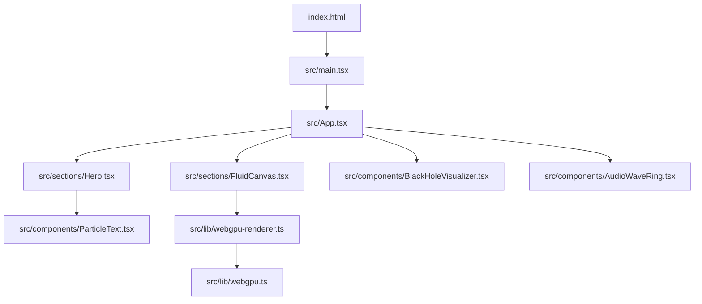
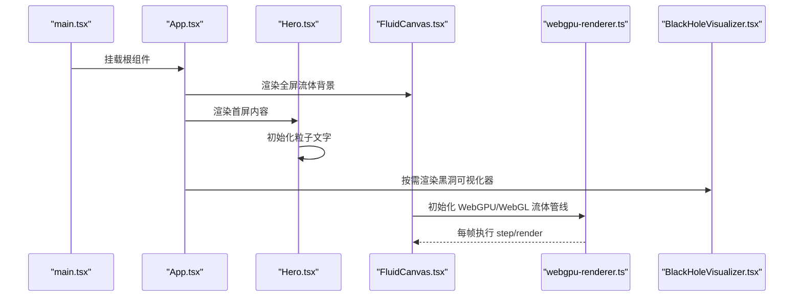
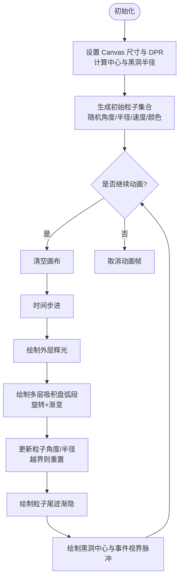
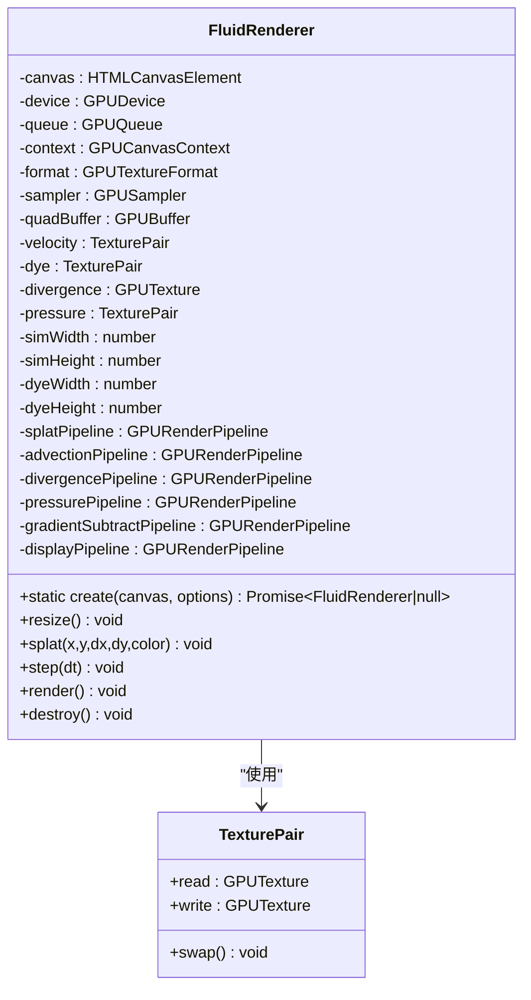
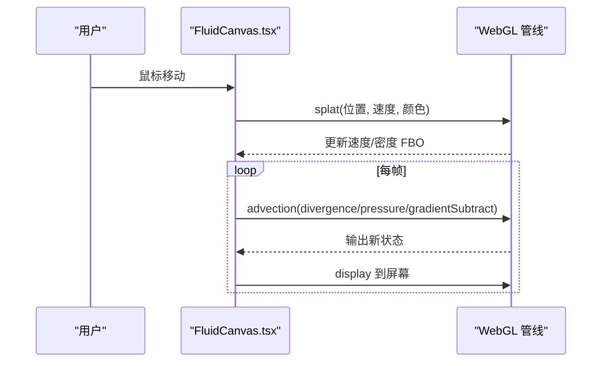
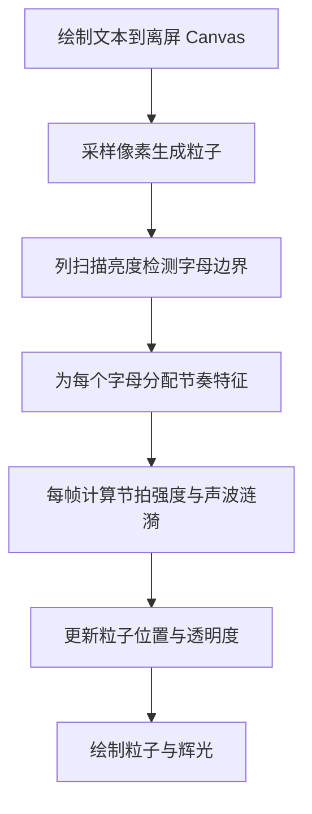
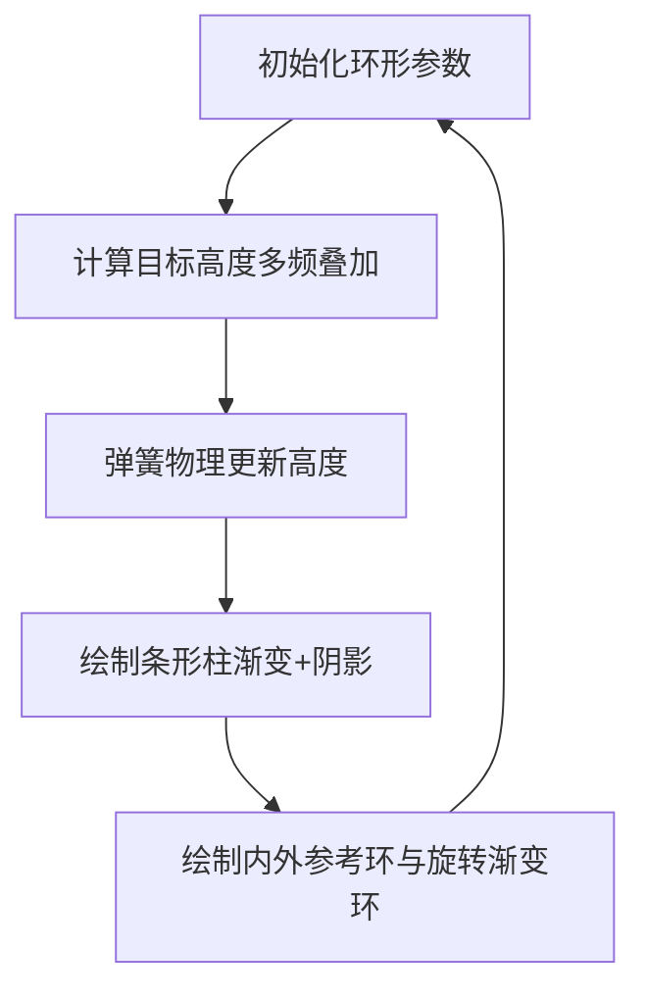
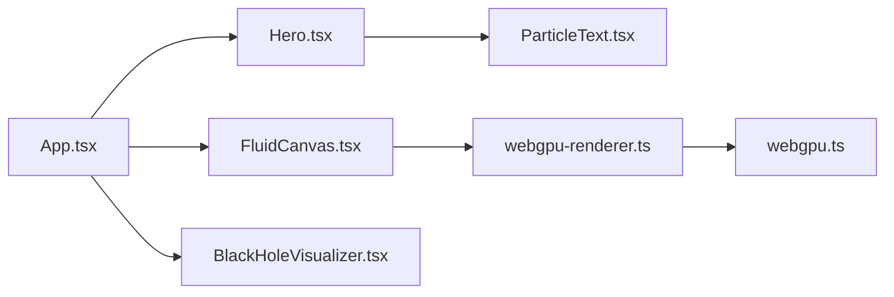

# 黑洞可视化器

<cite>
**本文引用的文件**   
- [README.md](file://README.md)
- [package.json](file://package.json)
- [tailwind.config.js](file://tailwind.config.js)
- [index.html](file://index.html)
- [src/main.tsx](file://src/main.tsx)
- [src/App.tsx](file://src/App.tsx)
- [src/sections/FluidCanvas.tsx](file://src/sections/FluidCanvas.tsx)
- [src/lib/webgpu-renderer.ts](file://src/lib/webgpu-renderer.ts)
- [src/lib/webgpu.ts](file://src/lib/webgpu.ts)
- [src/components/BlackHoleVisualizer.tsx](file://src/components/BlackHoleVisualizer.tsx)
- [src/components/AudioWaveRing.tsx](file://src/components/AudioWaveRing.tsx)
- [src/components/ParticleText.tsx](file://src/components/ParticleText.tsx)
- [src/sections/Hero.tsx](file://src/sections/Hero.tsx)
</cite>

## 目录
1. [简介](#简介)
2. [项目结构](#项目结构)
3. [核心组件](#核心组件)
4. [架构总览](#架构总览)
5. [详细组件分析](#详细组件分析)
6. [依赖关系分析](#依赖关系分析)
7. [性能与优化](#性能与优化)
8. [故障排查指南](#故障排查指南)
9. [结论](#结论)
10. [附录](#附录)

## 简介
本项目为“挠荔枝 Knowledge”产品官网，采用 React + TypeScript + Vite 构建，使用 Tailwind CSS 进行样式管理。页面包含多种视觉特效：WebGL/WebGPU 流体背景、粒子文字、音频波形环以及一个独立的“黑洞可视化器”组件。该文档聚焦于“黑洞可视化器”的实现与集成方式，并扩展到整个页面的渲染架构与关键交互流程。

## 项目结构
- 入口与根应用
  - index.html：站点入口（含 SEO/OG 元数据）
  - src/main.tsx：React 根挂载
  - src/App.tsx：页面布局与区块组合
- 视觉层
  - src/sections/FluidCanvas.tsx：全屏 WebGL 流体背景
  - src/lib/webgpu-renderer.ts：WebGPU 流体渲染器（类封装）
  - src/lib/webgpu.ts：WebGPU 设备与工具函数
  - src/components/ParticleText.tsx：粒子化文字动画
  - src/components/AudioWaveRing.tsx：音频波形环形动画
  - src/components/BlackHoleVisualizer.tsx：黑洞可视化器（Canvas 2D）
- 配置与样式
  - tailwind.config.js：主题、颜色、动画等扩展
  - package.json：脚本与依赖

图表来源
- [src/main.tsx:1-11](file://src/main.tsx#L1-L11)
- [src/App.tsx:1-30](file://src/App.tsx#L1-L30)
- [src/sections/FluidCanvas.tsx:1-496](file://src/sections/FluidCanvas.tsx#L1-L496)
- [src/lib/webgpu-renderer.ts:1-682](file://src/lib/webgpu-renderer.ts#L1-L682)
- [src/lib/webgpu.ts:1-78](file://src/lib/webgpu.ts#L1-L78)
- [src/components/BlackHoleVisualizer.tsx:1-214](file://src/components/BlackHoleVisualizer.tsx#L1-L214)
- [src/components/AudioWaveRing.tsx:1-179](file://src/components/AudioWaveRing.tsx#L1-L179)
- [src/components/ParticleText.tsx:1-440](file://src/components/ParticleText.tsx#L1-L440)

章节来源
- [README.md:1-73](file://README.md#L1-L73)
- [package.json:1-81](file://package.json#L1-L81)
- [tailwind.config.js:1-92](file://tailwind.config.js#L1-L92)

## 核心组件
- 黑洞可视化器（Canvas 2D）
  - 功能：绘制黑洞中心、吸积盘光环、螺旋粒子轨迹与事件视界脉冲光晕。
  - 技术点：Canvas 2D 渐变、阴影、requestAnimationFrame 循环、粒子系统。
  - 生命周期：在 useEffect 中初始化，返回清理函数取消动画帧。
- WebGPU 流体渲染器
  - 功能：基于 WebGPU 的流体模拟（速度场、密度场、散度、压力求解、显示）。
  - 技术点：双缓冲纹理、管线创建、Uniform 缓冲区、命令编码与提交。
- WebGL 流体背景
  - 功能：全屏流体背景，鼠标拖拽注入速度与颜色。
  - 技术点：FBO 双缓冲、半浮点纹理扩展、多阶段着色器。
- 粒子文字
  - 功能：将文本采样为像素，生成大量粒子并按字母分组实现独立节拍响应。
  - 技术点：离屏 Canvas 采样、IntersectionObserver 可见性检测、鼠标影响半径。
- 音频波形环
  - 功能：环形频谱条，弹簧物理驱动平滑过渡，多层正弦波叠加。
  - 技术点：圆角矩形绘制、径向渐变、旋转坐标系。

章节来源
- [src/components/BlackHoleVisualizer.tsx:1-214](file://src/components/BlackHoleVisualizer.tsx#L1-L214)
- [src/lib/webgpu-renderer.ts:1-682](file://src/lib/webgpu-renderer.ts#L1-L682)
- [src/sections/FluidCanvas.tsx:1-496](file://src/sections/FluidCanvas.tsx#L1-L496)
- [src/components/ParticleText.tsx:1-440](file://src/components/ParticleText.tsx#L1-L440)
- [src/components/AudioWaveRing.tsx:1-179](file://src/components/AudioWaveRing.tsx#L1-L179)

## 架构总览
整体渲染由多个独立画布叠加组成：
- 底层：WebGL/WebGPU 流体背景（全屏固定定位）
- 中层：Hero 区域粒子文字
- 上层：各内容区块（导航、特性、演示、CTA、页脚）
- 可选：黑洞可视化器作为可复用组件嵌入任意位置

图表来源
- [src/main.tsx:1-11](file://src/main.tsx#L1-L11)
- [src/App.tsx:1-30](file://src/App.tsx#L1-L30)
- [src/sections/FluidCanvas.tsx:1-496](file://src/sections/FluidCanvas.tsx#L1-L496)
- [src/lib/webgpu-renderer.ts:1-682](file://src/lib/webgpu-renderer.ts#L1-L682)
- [src/components/BlackHoleVisualizer.tsx:1-214](file://src/components/BlackHoleVisualizer.tsx#L1-L214)

## 详细组件分析

### 黑洞可视化器（Canvas 2D）
- 渲染目标
  - 外发光：径向渐变填充背景
  - 吸积盘：多层椭圆弧带线性渐变，交替旋转方向
  - 粒子系统：角度递增、半径递减，进入视界后重置；尾迹数组记录历史位置并渐隐
  - 黑洞中心：径向渐变黑心 + 事件视界脉冲描边（正弦调制）
- 数据结构
  - 粒子对象：角度、半径、速度、尺寸、颜色、尾迹数组
- 动画循环
  - requestAnimationFrame 驱动，时间步进约 16ms
  - 每帧清除画布、更新全局时间、重绘所有图层
- 资源清理
  - 组件卸载时 cancelAnimationFrame 停止循环

图表来源
- [src/components/BlackHoleVisualizer.tsx:1-214](file://src/components/BlackHoleVisualizer.tsx#L1-L214)

章节来源
- [src/components/BlackHoleVisualizer.tsx:1-214](file://src/components/BlackHoleVisualizer.tsx#L1-L214)

### WebGPU 流体渲染器（类）
- 职责
  - 初始化 WebGPU 设备、上下文、采样器、全屏四边形顶点缓冲
  - 创建渲染管线（splat、advection、divergence、pressure、gradientSubtract、display）
  - 管理双缓冲纹理对（速度、密度、压力）及散度纹理
  - 提供 splat、step、render、resize、destroy 接口
- 关键流程
  - create：请求适配器与设备，构造实例
  - resize：根据 DPR 与宽高比计算仿真分辨率，重建纹理与 Uniform
  - splat：写入速度与密度（两次 pass），交换读写缓冲
  - step：速度自平流、密度平流、散度计算、压力迭代、梯度减除
  - render：将密度纹理采样到屏幕
- 复杂度
  - 每帧多次 GPU 渲染 pass，主要开销在 fragment shader 采样与纹理读写
  - 压力迭代次数可调，直接影响稳定性与性能

图表来源
- [src/lib/webgpu-renderer.ts:1-682](file://src/lib/webgpu-renderer.ts#L1-L682)

章节来源
- [src/lib/webgpu-renderer.ts:1-682](file://src/lib/webgpu-renderer.ts#L1-L682)
- [src/lib/webgpu.ts:1-78](file://src/lib/webgpu.ts#L1-L78)

### WebGL 流体背景
- 特点
  - 使用 WebGL 与 OES_texture_half_float 扩展
  - 通过 FBO 双缓冲实现速度场与密度场的迭代
  - 支持鼠标移动注入速度与颜色（splat）
  - 自动降级策略：低 FPS 时跳帧
- 管线
  - 顶点着色器统一，片段着色器按阶段切换（splat/advection/divergence/pressure/gradientSubtract/display）
- 交互
  - 监听 mousemove，计算归一化坐标与位移增量，调用 splat

图表来源
- [src/sections/FluidCanvas.tsx:1-496](file://src/sections/FluidCanvas.tsx#L1-L496)

章节来源
- [src/sections/FluidCanvas.tsx:1-496](file://src/sections/FluidCanvas.tsx#L1-L496)

### 粒子文字
- 原理
  - 离屏 Canvas 绘制文本，采样像素生成粒子
  - 按列扫描亮度检测字母边界，为每个字母分配独立节奏参数
  - 环境星点粒子随节拍闪烁，主粒子受鼠标影响产生排斥/吸引
- 性能
  - IntersectionObserver 控制可见性，不可见时仅维持空循环
  - 移动端降低采样间隔与环境粒子数量

图表来源
- [src/components/ParticleText.tsx:1-440](file://src/components/ParticleText.tsx#L1-L440)

章节来源
- [src/components/ParticleText.tsx:1-440](file://src/components/ParticleText.tsx#L1-L440)

### 音频波形环
- 原理
  - 环形排列条形柱，使用多重正弦波合成目标高度
  - 弹簧阻尼模型驱动平滑过渡
  - 径向渐变与旋转渐变环增强层次
- 交互
  - 无直接交互，纯动画驱动

图表来源
- [src/components/AudioWaveRing.tsx:1-179](file://src/components/AudioWaveRing.tsx#L1-L179)

章节来源
- [src/components/AudioWaveRing.tsx:1-179](file://src/components/AudioWaveRing.tsx#L1-L179)

## 依赖关系分析
- 运行时依赖
  - React 19、ReactDOM 19：组件树与 DOM 渲染
  - Vite 7：开发与构建
  - Tailwind CSS 3：原子化样式与动画
  - shadcn/ui 生态（Radix 系列）：UI 基础组件
  - @webgpu/types：类型定义
- 模块耦合
  - App 组合各区块与组件，保持松耦合
  - 流体背景与 WebGPU 渲染器解耦，便于替换或禁用
  - 黑洞可视化器为独立组件，可被任意区块引用

图表来源
- [src/App.tsx:1-30](file://src/App.tsx#L1-L30)
- [src/sections/FluidCanvas.tsx:1-496](file://src/sections/FluidCanvas.tsx#L1-L496)
- [src/lib/webgpu-renderer.ts:1-682](file://src/lib/webgpu-renderer.ts#L1-L682)
- [src/lib/webgpu.ts:1-78](file://src/lib/webgpu.ts#L1-L78)
- [src/components/ParticleText.tsx:1-440](file://src/components/ParticleText.tsx#L1-L440)
- [src/components/BlackHoleVisualizer.tsx:1-214](file://src/components/BlackHoleVisualizer.tsx#L1-L214)

章节来源
- [package.json:1-81](file://package.json#L1-L81)
- [tailwind.config.js:1-92](file://tailwind.config.js#L1-L92)

## 性能与优化
- 自适应分辨率
  - WebGL 流体背景根据设备像素比与内存信息动态调整仿真与密度分辨率，并在低 FPS 时跳帧
- 可见性优化
  - 粒子文字与流体背景均使用 IntersectionObserver，不可见时减少计算
- 渲染路径选择
  - 提供 WebGL 与 WebGPU 两套流体实现，可按需启用
- 动画节流
  - 黑洞可视化器与音频波形环使用 requestAnimationFrame，避免阻塞主线程
- 建议
  - 在高 DPI 设备上限制最大 DPR（如 ≤2）
  - 对复杂场景开启 reduced motion 选项以关闭动画
  - 将重型效果置于懒加载区块，按需初始化

[本节为通用指导，不直接分析具体文件]

## 故障排查指南
- WebGPU 不可用
  - 现象：WebGPU 渲染器无法创建设备
  - 排查：检查浏览器是否支持 navigator.gpu；确认未处于受限环境
  - 处理：回退至 WebGL 流体背景或禁用流体效果
- 低性能设备卡顿
  - 现象：FPS 下降、掉帧
  - 排查：观察设备像素比与 deviceMemory；检查是否同时运行多个重型动画
  - 处理：降低仿真分辨率、减少压力迭代次数、启用跳帧
- 粒子文字无响应
  - 现象：鼠标移动无效
  - 排查：确认 canvas 已挂载且事件绑定成功；检查 IntersectionObserver 状态
  - 处理：确保元素在视口内；必要时移除可见性判断用于调试
- 黑洞可视化器不显示
  - 现象：Canvas 空白
  - 排查：确认 getContext("2d") 可用；检查 DPR 设置与尺寸
  - 处理：降级 DPR 为 1；确保父容器有明确尺寸

章节来源
- [src/sections/FluidCanvas.tsx:1-496](file://src/sections/FluidCanvas.tsx#L1-L496)
- [src/lib/webgpu-renderer.ts:1-682](file://src/lib/webgpu-renderer.ts#L1-L682)
- [src/lib/webgpu.ts:1-78](file://src/lib/webgpu.ts#L1-L78)
- [src/components/ParticleText.tsx:1-440](file://src/components/ParticleText.tsx#L1-L440)
- [src/components/BlackHoleVisualizer.tsx:1-214](file://src/components/BlackHoleVisualizer.tsx#L1-L214)

## 结论
本项目通过分层渲染与模块化设计，将黑洞可视化器、流体背景、粒子文字与音频波形环有机整合。黑洞可视化器作为轻量级 Canvas 2D 组件，易于嵌入与复用；WebGL/WebGPU 流体背景提供沉浸式体验；粒子文字与音频波形环增强了品牌表达与互动感。整体架构清晰、可扩展性强，适合在不同设备上进行性能调优与功能裁剪。

[本节为总结，不直接分析具体文件]

## 附录
- 开发脚本
  - 安装依赖、启动开发服务器、构建与预览
- 品牌与样式
  - 品牌色、字体、暗色模式与动画扩展

章节来源
- [README.md:1-73](file://README.md#L1-L73)
- [package.json:1-81](file://package.json#L1-L81)
- [tailwind.config.js:1-92](file://tailwind.config.js#L1-L92)