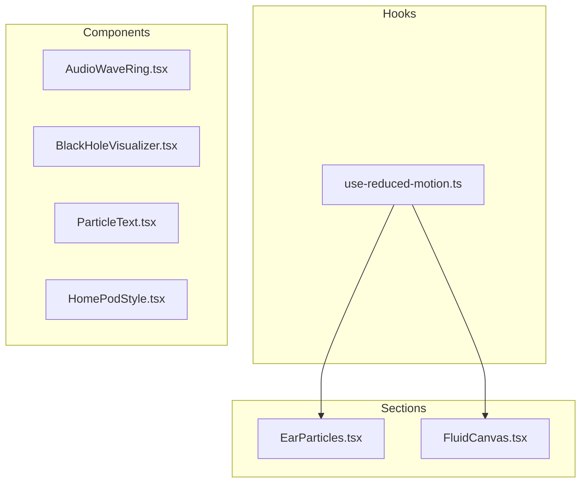
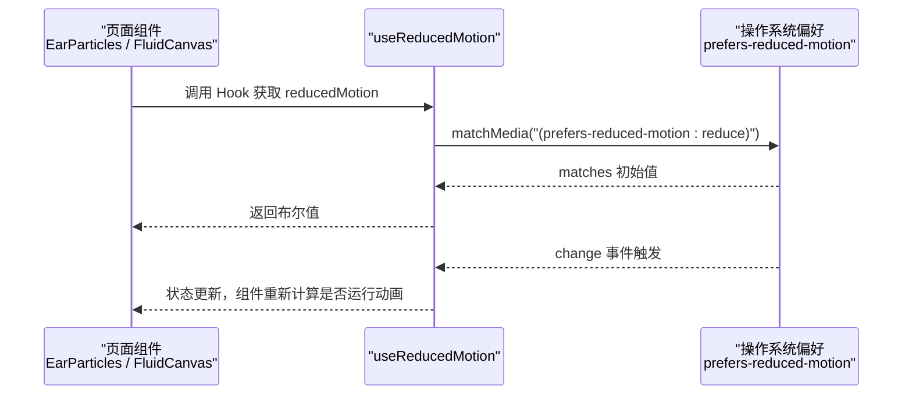
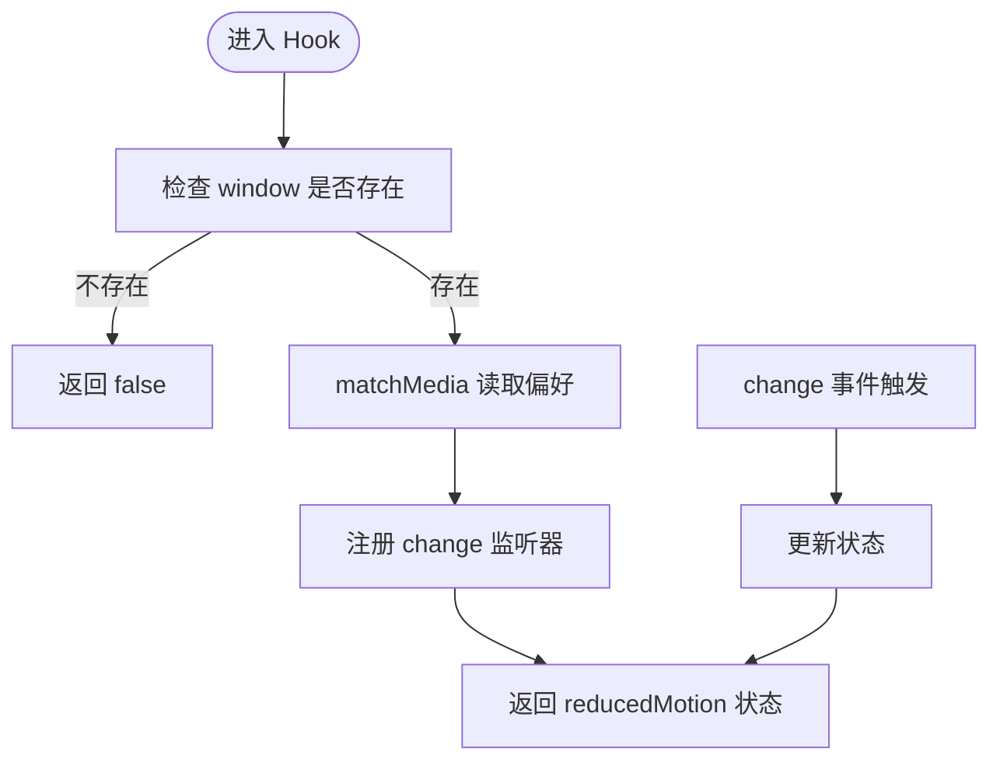
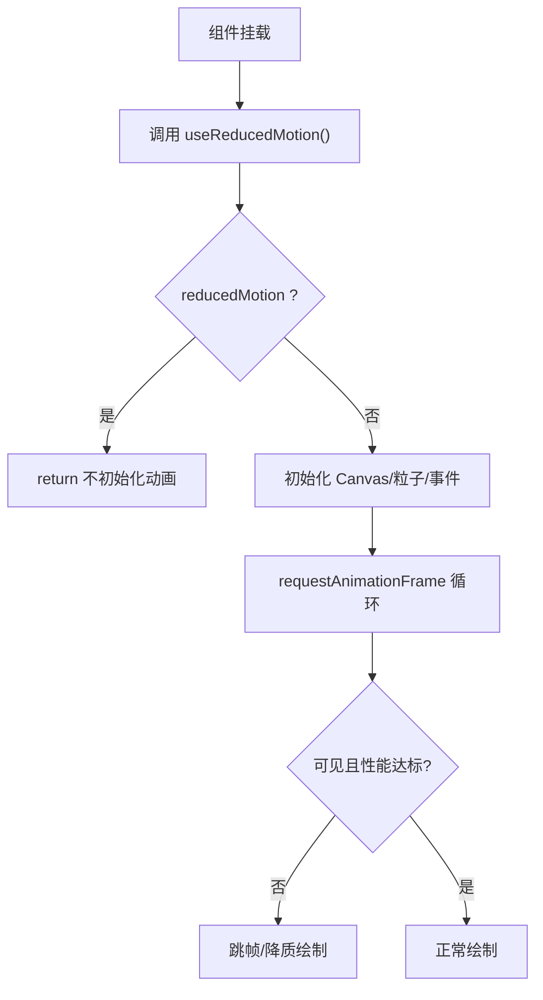
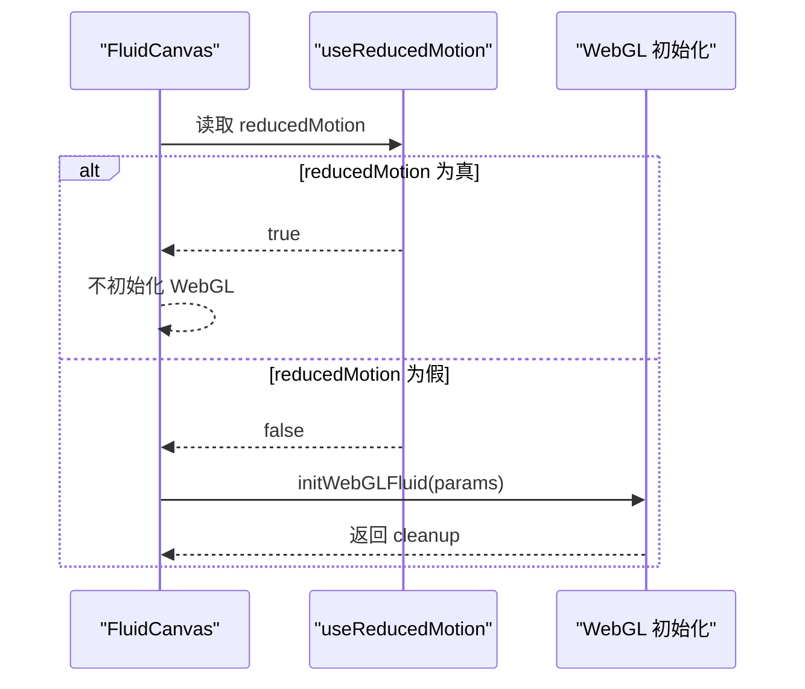
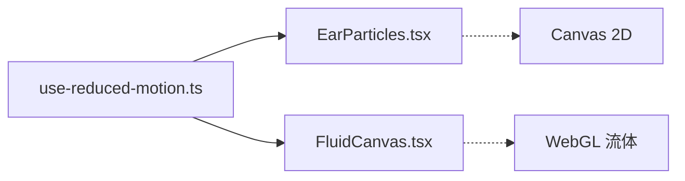

# 减少动画偏好Hook

<cite>
**本文引用的文件**   
- [use-reduced-motion.ts](file://src/hooks/use-reduced-motion.ts)
- [EarParticles.tsx](file://src/sections/EarParticles.tsx)
- [FluidCanvas.tsx](file://src/sections/FluidCanvas.tsx)
- [AudioWaveRing.tsx](file://src/components/AudioWaveRing.tsx)
- [BlackHoleVisualizer.tsx](file://src/components/BlackHoleVisualizer.tsx)
- [ParticleText.tsx](file://src/components/ParticleText.tsx)
- [HomePodStyle.tsx](file://src/components/HomePodStyle.tsx)
</cite>

## 目录
1. [简介](#简介)
2. [项目结构](#项目结构)
3. [核心组件](#核心组件)
4. [架构总览](#架构总览)
5. [详细组件分析](#详细组件分析)
6. [依赖关系分析](#依赖关系分析)
7. [性能考量](#性能考量)
8. [故障排查指南](#故障排查指南)
9. [结论](#结论)

## 简介
本文件围绕“减少动画偏好”能力，系统化梳理项目中基于系统级“减少动画”偏好的实现与使用方式。核心是一个可复用的 Hook：当用户系统开启“减少动画”时，页面中的复杂动画（尤其是 Canvas/WebGL）将自动降级或停止，从而提升可访问性与性能体验。

## 项目结构
本项目采用按功能域组织的方式：
- hooks：通用逻辑封装，如 useReducedMotion
- sections：页面区块，包含大量视觉动画（粒子、流体等）
- components：可复用可视化组件（音频环、黑洞、粒子文字、HomePod风格）

图表来源
- [use-reduced-motion.ts:1-19](file://src/hooks/use-reduced-motion.ts#L1-L19)
- [EarParticles.tsx:1-120](file://src/sections/EarParticles.tsx#L1-L120)
- [FluidCanvas.tsx:1-20](file://src/sections/FluidCanvas.tsx#L1-L20)

章节来源
- [use-reduced-motion.ts:1-19](file://src/hooks/use-reduced-motion.ts#L1-L19)
- [EarParticles.tsx:1-120](file://src/sections/EarParticles.tsx#L1-L120)
- [FluidCanvas.tsx:1-20](file://src/sections/FluidCanvas.tsx#L1-L20)

## 核心组件
- useReducedMotion：读取并监听系统“减少动画”偏好，返回布尔值；在 SSR 环境下安全回退为 false。
- EarParticles：星空/光粒/流星等复杂 Canvas 动画，启用 reduced motion 时直接跳过初始化。
- FluidCanvas：WebGL 流体模拟，启用 reduced motion 时不创建 WebGL 上下文与渲染循环。
- 其他可视化组件（AudioWaveRing、BlackHoleVisualizer、ParticleText、HomePodStyle）：当前未接入 reduced motion 控制，仍会持续运行动画。

章节来源
- [use-reduced-motion.ts:1-19](file://src/hooks/use-reduced-motion.ts#L1-L19)
- [EarParticles.tsx:112-125](file://src/sections/EarParticles.tsx#L112-L125)
- [FluidCanvas.tsx:450-485](file://src/sections/FluidCanvas.tsx#L450-L485)
- [AudioWaveRing.tsx:1-179](file://src/components/AudioWaveRing.tsx#L1-L179)
- [BlackHoleVisualizer.tsx:1-214](file://src/components/BlackHoleVisualizer.tsx#L1-L214)
- [ParticleText.tsx:1-184](file://src/components/ParticleText.tsx#L1-L184)
- [HomePodStyle.tsx:1-210](file://src/components/HomePodStyle.tsx#L1-L210)

## 架构总览
从调用方到 Hook 的交互如下：

图表来源
- [use-reduced-motion.ts:3-18](file://src/hooks/use-reduced-motion.ts#L3-L18)
- [EarParticles.tsx:112-125](file://src/sections/EarParticles.tsx#L112-L125)
- [FluidCanvas.tsx:450-485](file://src/sections/FluidCanvas.tsx#L450-L485)

## 详细组件分析

### Hook：useReducedMotion
- 功能要点
  - 通过 window.matchMedia 读取系统“减少动画”偏好
  - 订阅 change 事件，动态响应系统设置变化
  - 服务端渲染时避免访问 window，默认返回 false
- 复杂度
  - 时间复杂度 O(1)，空间复杂度 O(1)
- 错误处理
  - 对 window 存在性进行保护，避免 SSR 报错
- 优化建议
  - 可在首次匹配后缓存结果，减少重复查询
  - 可考虑防抖/节流以应对频繁 change 事件（实际场景较少）

图表来源
- [use-reduced-motion.ts:3-18](file://src/hooks/use-reduced-motion.ts#L3-L18)

章节来源
- [use-reduced-motion.ts:1-19](file://src/hooks/use-reduced-motion.ts#L1-L19)

### 使用方一：EarParticles
- 行为
  - 若 reducedMotion 为真，则直接 return，不初始化 Canvas 与动画循环
  - 否则执行完整初始化：粒子数量自适应、IntersectionObserver 可见性控制、FPS 监控与降级
- 数据流
  - 使用 useReducedMotion 返回值作为早期退出条件
- 性能策略
  - 低配设备检测降低粒子数
  - 不可见时暂停渲染
  - FPS 低于阈值时跳帧渲染

图表来源
- [EarParticles.tsx:112-125](file://src/sections/EarParticles.tsx#L112-L125)
- [EarParticles.tsx:417-451](file://src/sections/EarParticles.tsx#L417-L451)
- [EarParticles.tsx:575-589](file://src/sections/EarParticles.tsx#L575-L589)

章节来源
- [EarParticles.tsx:112-125](file://src/sections/EarParticles.tsx#L112-L125)
- [EarParticles.tsx:417-451](file://src/sections/EarParticles.tsx#L417-L451)
- [EarParticles.tsx:575-589](file://src/sections/EarParticles.tsx#L575-L589)

### 使用方二：FluidCanvas
- 行为
  - 若 reducedMotion 为真，则不创建 WebGL 上下文与渲染循环
  - 否则根据设备性能调整仿真分辨率、压力迭代次数等参数
- 数据流
  - 使用 reducedMotion 作为 useEffect 依赖，确保切换系统偏好后能正确清理/重建
- 性能策略
  - 低端 GPU/内存不足时降低 SIM_RESOLUTION、DYE_RESOLUTION、PRESSURE_ITERATIONS

图表来源
- [FluidCanvas.tsx:450-485](file://src/sections/FluidCanvas.tsx#L450-L485)

章节来源
- [FluidCanvas.tsx:450-485](file://src/sections/FluidCanvas.tsx#L450-L485)

### 尚未接入 reduced motion 的可视化组件
以下组件目前未使用 useReducedMotion，会在所有设备上持续运行动画：
- AudioWaveRing：环形音频波形动画
- BlackHoleVisualizer：黑洞吸积盘粒子动画
- ParticleText：粒子化文字效果
- HomePodStyle：HomePod 风格声波可视化

建议后续统一接入 useReducedMotion，以实现一致的无障碍与性能体验。

章节来源
- [AudioWaveRing.tsx:1-179](file://src/components/AudioWaveRing.tsx#L1-L179)
- [BlackHoleVisualizer.tsx:1-214](file://src/components/BlackHoleVisualizer.tsx#L1-L214)
- [ParticleText.tsx:1-184](file://src/components/ParticleText.tsx#L1-L184)
- [HomePodStyle.tsx:1-210](file://src/components/HomePodStyle.tsx#L1-L210)

## 依赖关系分析
- 耦合度
  - useReducedMotion 被多个重动画组件消费，形成“低耦合、高内聚”的共享能力
- 外部依赖
  - 浏览器 API：window.matchMedia、requestAnimationFrame、IntersectionObserver、WebGL
- 潜在循环依赖
  - 无循环引用，Hook 仅暴露纯函数式状态

图表来源
- [use-reduced-motion.ts:1-19](file://src/hooks/use-reduced-motion.ts#L1-L19)
- [EarParticles.tsx:1-120](file://src/sections/EarParticles.tsx#L1-L120)
- [FluidCanvas.tsx:1-20](file://src/sections/FluidCanvas.tsx#L1-L20)

章节来源
- [use-reduced-motion.ts:1-19](file://src/hooks/use-reduced-motion.ts#L1-L19)
- [EarParticles.tsx:1-120](file://src/sections/EarParticles.tsx#L1-L120)
- [FluidCanvas.tsx:1-20](file://src/sections/FluidCanvas.tsx#L1-L20)

## 性能考量
- 已实现的优化
  - 系统偏好优先：直接关闭复杂动画，显著降低 CPU/GPU 占用
  - 可见性裁剪：不在视口内的区域暂停渲染
  - 动态降级：低配设备减少粒子/纹理分辨率与迭代次数
  - 跳帧策略：FPS 过低时主动跳过部分帧
- 可扩展优化
  - 为更多组件接入 reduced motion
  - 引入 requestIdleCallback 或分片渲染以降低主线程阻塞
  - 对高频事件（mousemove/touchmove）做节流/去抖
  - 使用 OffscreenCanvas 或 Web Worker 分担计算

[本节为通用指导，无需具体文件来源]

## 故障排查指南
- 症状：开启“减少动画”后仍有动画运行
  - 排查点：确认组件是否正确消费 useReducedMotion 并在 early return 中短路初始化
  - 参考路径
    - [EarParticles.tsx:112-125](file://src/sections/EarParticles.tsx#L112-L125)
    - [FluidCanvas.tsx:450-485](file://src/sections/FluidCanvas.tsx#L450-L485)
- 症状：SSR 环境报错
  - 排查点：Hook 内部是否对 window 存在性做了保护
  - 参考路径
    - [use-reduced-motion.ts:4-6](file://src/hooks/use-reduced-motion.ts#L4-L6)
- 症状：切换系统偏好后未生效
  - 排查点：是否订阅了 change 事件并更新状态；组件是否将该状态纳入依赖
  - 参考路径
    - [use-reduced-motion.ts:9-16](file://src/hooks/use-reduced-motion.ts#L9-L16)
    - [FluidCanvas.tsx:485](file://src/sections/FluidCanvas.tsx#L485)

章节来源
- [use-reduced-motion.ts:4-6](file://src/hooks/use-reduced-motion.ts#L4-L6)
- [use-reduced-motion.ts:9-16](file://src/hooks/use-reduced-motion.ts#L9-L16)
- [EarParticles.tsx:112-125](file://src/sections/EarParticles.tsx#L112-L125)
- [FluidCanvas.tsx:450-485](file://src/sections/FluidCanvas.tsx#L450-L485)

## 结论
- useReducedMotion 提供了统一的“减少动画”能力入口，已在关键重动画模块落地，有效兼顾可访问性与性能。
- 建议逐步将剩余可视化组件接入该 Hook，形成一致的用户体验与资源消耗模型。
- 配合可见性裁剪、设备检测与跳帧策略，整体性能表现稳健，具备进一步优化的空间。