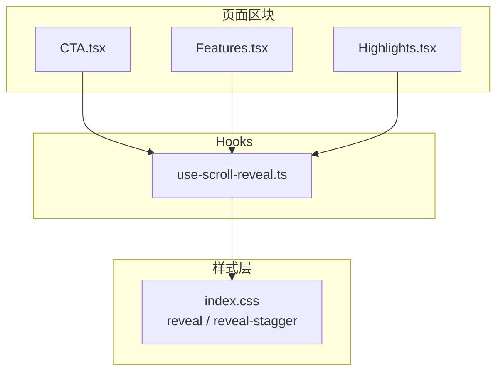
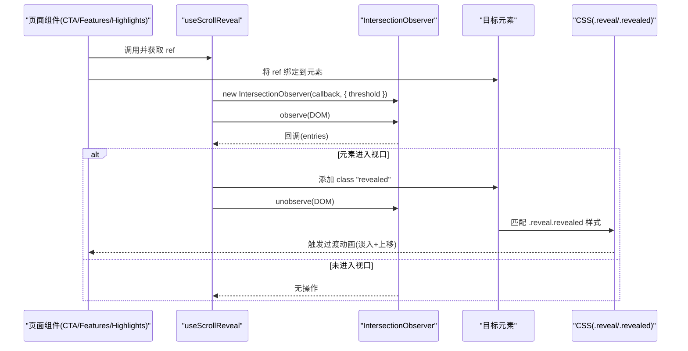
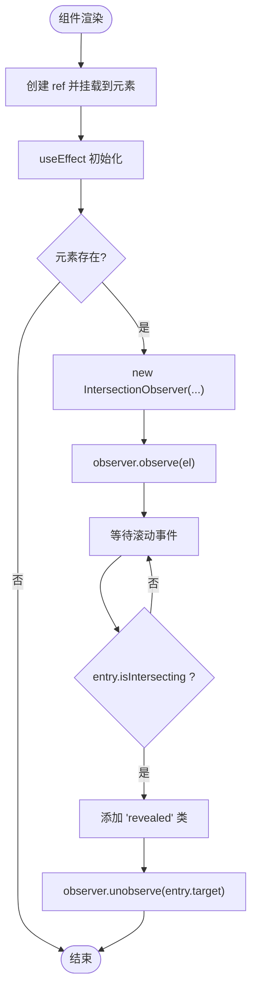
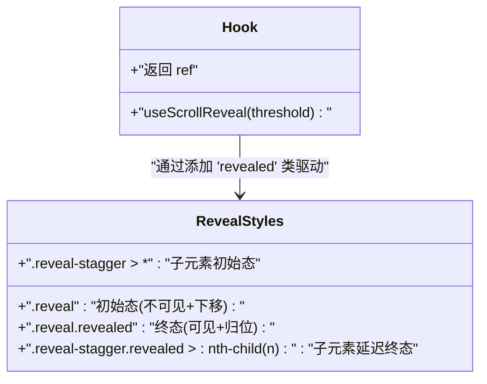
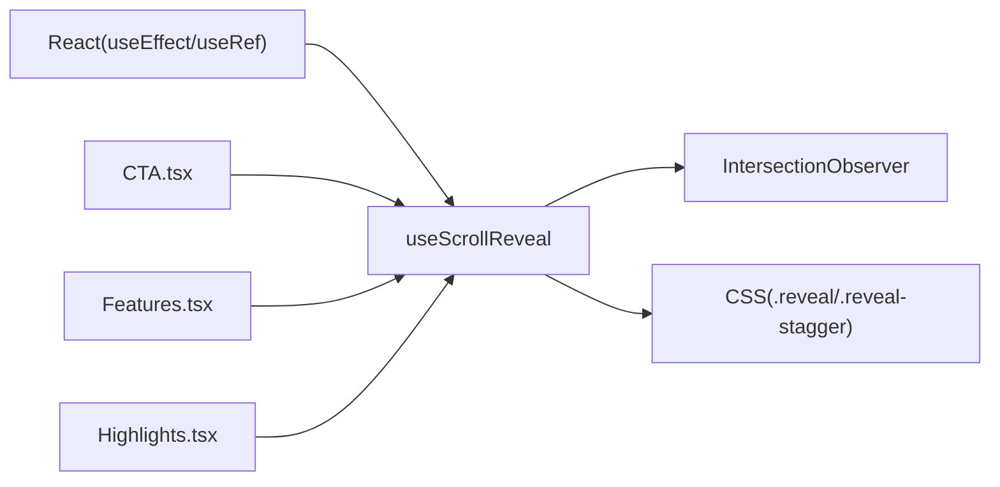

# 滚动显示动画Hook

<cite>
**本文引用的文件**   
- [use-scroll-reveal.ts](file://src/hooks/use-scroll-reveal.ts)
- [index.css](file://src/index.css)
- [CTA.tsx](file://src/sections/CTA.tsx)
- [Features.tsx](file://src/sections/Features.tsx)
- [Highlights.tsx](file://src/sections/Highlights.tsx)
</cite>

## 目录
1. [简介](#简介)
2. [项目结构](#项目结构)
3. [核心组件](#核心组件)
4. [架构总览](#架构总览)
5. [详细组件分析](#详细组件分析)
6. [依赖分析](#依赖分析)
7. [性能考虑](#性能考虑)
8. [故障排查指南](#故障排查指南)
9. [结论](#结论)
10. [附录](#附录)

## 简介
本文件为 useScrollReveal Hook 的完整技术文档。该 Hook 基于 IntersectionObserver API，用于在元素进入视口时触发“滚动入场”动画（默认从下方淡入上移）。通过配置阈值控制触发时机，配合 CSS 过渡实现流畅的视觉反馈。文档涵盖：
- 实现原理与数据流
- Hook 参数、返回值与使用方式
- 动画效果定制方法
- 响应式设计与移动端适配建议
- 性能优化策略与常见问题处理

## 项目结构
本项目采用按功能域组织的方式，滚动入场动画相关代码位于 hooks 与样式层：
- Hook 定义：src/hooks/use-scroll-reveal.ts
- 动画样式：src/index.css（reveal / reveal-stagger）
- 使用示例：多个页面区块（如 CTA、Features、Highlights）

图表来源
- [use-scroll-reveal.ts:1-34](file://src/hooks/use-scroll-reveal.ts#L1-L34)
- [index.css:80-116](file://src/index.css#L80-L116)
- [CTA.tsx:1-65](file://src/sections/CTA.tsx#L1-L65)
- [Features.tsx:1-122](file://src/sections/Features.tsx#L1-L122)
- [Highlights.tsx:1-119](file://src/sections/Highlights.tsx#L1-L119)

章节来源
- [use-scroll-reveal.ts:1-34](file://src/hooks/use-scroll-reveal.ts#L1-L34)
- [index.css:80-116](file://src/index.css#L80-L116)
- [CTA.tsx:1-65](file://src/sections/CTA.tsx#L1-L65)
- [Features.tsx:1-122](file://src/sections/Features.tsx#L1-L122)
- [Highlights.tsx:1-119](file://src/sections/Highlights.tsx#L1-L119)

## 核心组件
- Hook 名称：useScrollReveal
- 职责：为传入的 DOM 元素注册 IntersectionObserver，当元素满足可见比例阈值时，为其添加 revealed 类名以触发 CSS 过渡动画；为保证仅触发一次，观察后自动取消观察。
- 返回值：React ref，可绑定到任意 HTML 元素。
- 参数：threshold（可选），数值型，表示触发所需的最小可见比例，默认 0.15。

章节来源
- [use-scroll-reveal.ts:1-34](file://src/hooks/use-scroll-reveal.ts#L1-L34)

## 架构总览
下图展示了 Hook 与样式、页面组件之间的交互关系与数据流。

图表来源
- [use-scroll-reveal.ts:12-30](file://src/hooks/use-scroll-reveal.ts#L12-L30)
- [index.css:80-102](file://src/index.css#L80-L102)
- [CTA.tsx:5-12](file://src/sections/CTA.tsx#L5-L12)
- [Features.tsx:94-117](file://src/sections/Features.tsx#L94-L117)
- [Highlights.tsx:72-85](file://src/sections/Highlights.tsx#L72-L85)

## 详细组件分析

### Hook 实现与行为
- 生命周期管理：在 useEffect 中创建观察者并在卸载时断开连接，避免内存泄漏。
- 触发条件：当 entry.isIntersecting 为真且达到 threshold 比例时，添加 revealed 类名。
- 单次触发：添加类名后立即 observer.unobserve(entry.target)，确保动画只播放一次。
- 类型安全：泛型 T extends HTMLElement，返回强类型的 ref。

图表来源
- [use-scroll-reveal.ts:12-30](file://src/hooks/use-scroll-reveal.ts#L12-L30)

章节来源
- [use-scroll-reveal.ts:1-34](file://src/hooks/use-scroll-reveal.ts#L1-L34)

### 动画样式与效果定制
- 基础入场：.reveal 初始状态为不透明且下移，.reveal.revealed 恢复为完全可见且回到原位，过渡曲线与时长由 CSS 控制。
- 交错入场：.reveal-stagger 容器下的子元素依次延迟出现，适合卡片列表等场景。
- 自定义建议：
  - 调整 transition-duration 与 cubic-bezier 以获得更顺滑或更干脆的动效。
  - 修改 translateY 值控制起始位移距离。
  - 如需不同方向入场，可在新增类名中覆盖 transform 属性。

图表来源
- [index.css:80-102](file://src/index.css#L80-L102)
- [use-scroll-reveal.ts:16-26](file://src/hooks/use-scroll-reveal.ts#L16-L26)

章节来源
- [index.css:80-102](file://src/index.css#L80-L102)

### 使用示例与最佳实践
- 基本用法：在需要滚入动画的元素上绑定 ref，并添加 reveal 类名。
- 交错列表：对父容器使用 reveal-stagger，其子元素会依次入场。
- 组合其他 Hook：可与其它交互 Hook 同时使用，互不影响。

参考路径
- [CTA.tsx:5-12](file://src/sections/CTA.tsx#L5-L12)
- [Features.tsx:94-117](file://src/sections/Features.tsx#L94-L117)
- [Highlights.tsx:72-85](file://src/sections/Highlights.tsx#L72-L85)

章节来源
- [CTA.tsx:5-12](file://src/sections/CTA.tsx#L5-L12)
- [Features.tsx:94-117](file://src/sections/Features.tsx#L94-L117)
- [Highlights.tsx:72-85](file://src/sections/Highlights.tsx#L72-L85)

## 依赖分析
- 外部依赖：仅依赖 React（useEffect、useRef）与浏览器原生 IntersectionObserver。
- 内部耦合：与 index.css 中的 reveal/reveal-stagger 样式紧密耦合，通过类名切换驱动动画。
- 组件耦合：被多个页面区块复用，属于低耦合高内聚的工具型 Hook。

图表来源
- [use-scroll-reveal.ts:1-34](file://src/hooks/use-scroll-reveal.ts#L1-L34)
- [index.css:80-102](file://src/index.css#L80-L102)
- [CTA.tsx:1-65](file://src/sections/CTA.tsx#L1-L65)
- [Features.tsx:1-122](file://src/sections/Features.tsx#L1-L122)
- [Highlights.tsx:1-119](file://src/sections/Highlights.tsx#L1-L119)

章节来源
- [use-scroll-reveal.ts:1-34](file://src/hooks/use-scroll-reveal.ts#L1-L34)
- [index.css:80-102](file://src/index.css#L80-L102)

## 性能考虑
- 观察器开销：每个使用 Hook 的元素都会创建一个 IntersectionObserver，并在触发后取消观察，避免持续监听带来的额外开销。
- 阈值选择：默认 0.15 能在较早时机触发，兼顾体验与性能；若页面元素极多，可适当增大阈值减少回调次数。
- 动画性能：
  - 优先使用 transform 与 opacity 进行动画，避免触发布局重排。
  - 合理设置 transition-duration 与 easing，避免过长的过渡时间影响首屏感知。
- 批量与节流：当前实现已保证单次触发，无需额外节流；若需复杂序列动画，建议在 CSS 中使用 stagger 或 animation-delay 控制。
- 内存管理：effect 清理函数确保组件卸载时断开所有观察，防止内存泄漏。

[本节为通用指导，不直接分析具体文件]

## 故障排查指南
- 元素未触发动画
  - 检查是否为目标元素绑定了 ref 并添加了 reveal 类名。
  - 确认元素是否在滚动容器中，且未被 overflow:hidden 遮挡导致无法进入视口。
  - 检查 threshold 是否过大导致难以触发。
- 动画重复播放
  - 当前实现已取消观察，不会重复触发；若仍出现，请确认是否存在多处引用同一元素或动态替换节点导致重新挂载。
- 旧版浏览器兼容
  - IntersectionObserver 在现代浏览器广泛支持；如需兼容老旧环境，可提供降级方案（例如在 effect 中检测并回退到 scroll 事件监听）。
- 样式冲突
  - 若自定义了 transform/opacity 的过渡，注意与 reveal 样式叠加顺序，必要时提高选择器优先级或使用 CSS 变量覆盖。

章节来源
- [use-scroll-reveal.ts:16-29](file://src/hooks/use-scroll-reveal.ts#L16-L29)
- [index.css:80-102](file://src/index.css#L80-L102)

## 结论
useScrollReveal 是一个轻量、易用的滚动入场动画 Hook，结合简洁的 CSS 过渡即可实现流畅的“淡入上移”效果。通过合理的阈值配置与样式定制，可满足不同页面的动效需求。其实现遵循现代 Web API，具备良好性能与可维护性，适合在大量内容区块中复用。

[本节为总结性内容，不直接分析具体文件]

## 附录

### 参数与返回值说明
- 参数
  - threshold: number（可选）
    - 含义：触发所需的最小可见比例
    - 默认值：0.15
    - 取值范围：0~1
- 返回值
  - ref: React.RefObject<T extends HTMLElement>
    - 用途：绑定到需要滚入动画的 DOM 元素

章节来源
- [use-scroll-reveal.ts:7-10](file://src/hooks/use-scroll-reveal.ts#L7-L10)

### 常见使用模式速查
- 单个元素入场
  - 在目标元素上绑定 ref 并添加 reveal 类名
  - 参考路径：[CTA.tsx:5-12](file://src/sections/CTA.tsx#L5-L12)
- 列表交错入场
  - 父容器使用 reveal-stagger，子元素自然形成延迟入场
  - 参考路径：[Features.tsx:94-117](file://src/sections/Features.tsx#L94-L117)
- 标题区入场
  - 对标题区域单独应用 reveal，提升信息层级感
  - 参考路径：[Highlights.tsx:72-85](file://src/sections/Highlights.tsx#L72-L85)

章节来源
- [CTA.tsx:5-12](file://src/sections/CTA.tsx#L5-L12)
- [Features.tsx:94-117](file://src/sections/Features.tsx#L94-L117)
- [Highlights.tsx:72-85](file://src/sections/Highlights.tsx#L72-L85)