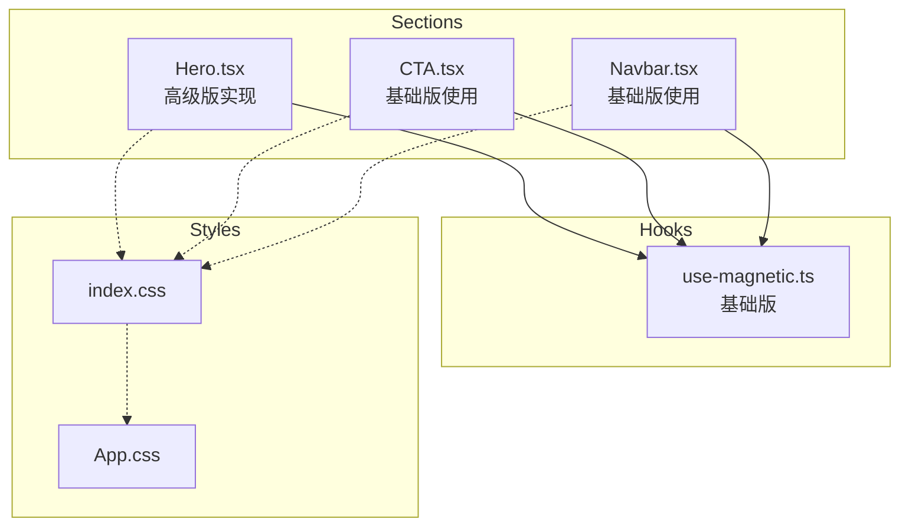
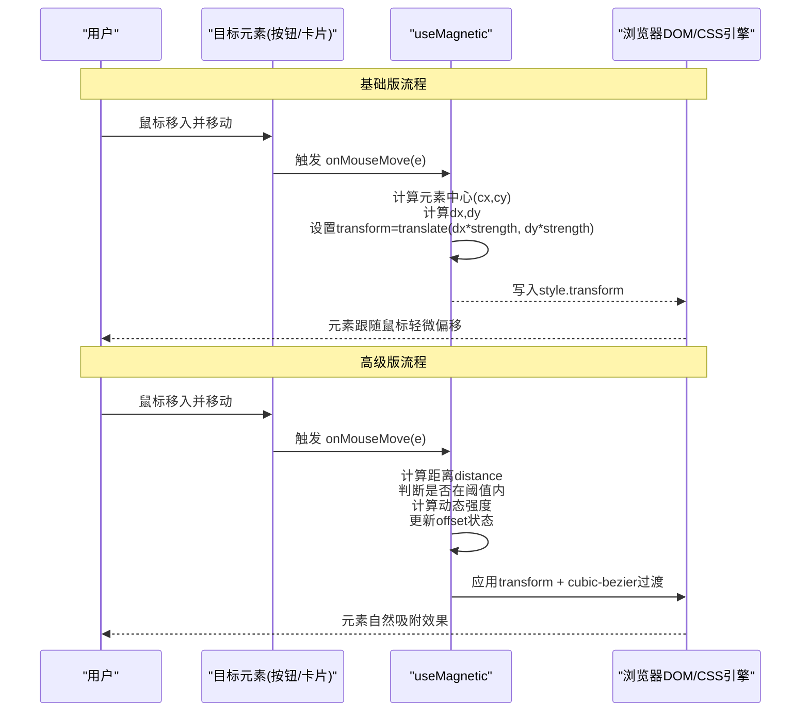
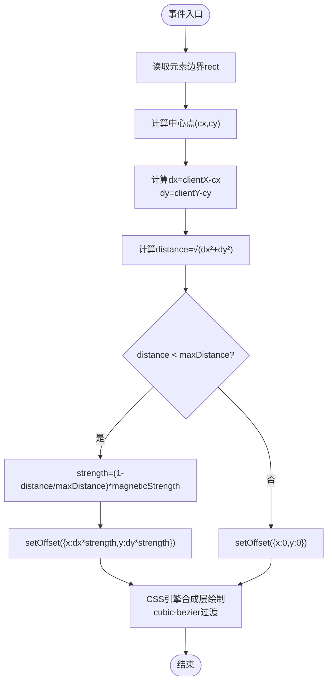
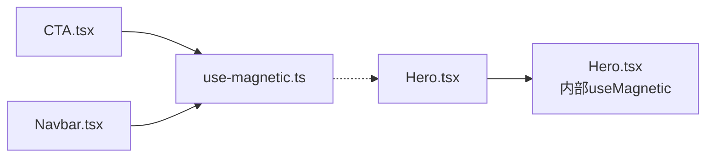

# 磁性吸附效果Hook

<cite>
**本文引用的文件**   
- [use-magnetic.ts](file://src/hooks/use-magnetic.ts)
- [Hero.tsx](file://src/sections/Hero.tsx)
- [CTA.tsx](file://src/sections/CTA.tsx)
- [Navbar.tsx](file://src/sections/Navbar.tsx)
- [index.css](file://src/index.css)
- [App.css](file://src/App.css)
- [FluidCanvas.tsx](file://src/sections/FluidCanvas.tsx)
</cite>

## 更新摘要
**变更内容**   
- 新增Hero组件中的高级磁性吸附实现，支持距离阈值和动态强度控制
- 扩展了磁性吸附的使用场景，从简单的按钮吸附到复杂的交互式元素
- 新增对cubic-bezier缓动函数的支持，提供更自然的动画体验
- 增强了Hook的功能性，支持更精确的距离计算和吸引力控制

## 目录
1. [简介](#简介)
2. [项目结构](#项目结构)
3. [核心组件](#核心组件)
4. [架构总览](#架构总览)
5. [详细组件分析](#详细组件分析)
6. [依赖关系分析](#依赖关系分析)
7. [性能考量](#性能考量)
8. [故障排查指南](#故障排查指南)
9. [结论](#结论)
10. [附录](#附录)

## 简介
本文件为 useMagnetic Hook 的完整技术文档，聚焦于"磁性吸附"交互效果的实现原理、参数配置与使用方式。该 Hook 通过监听鼠标移动事件，计算元素中心与指针的相对位移，并以线性缩放的方式将元素向鼠标方向偏移；当鼠标离开时，元素平滑回到原位。配合 CSS transform 与 transition，可形成自然的"被吸引"视觉反馈。

**更新** 现已支持两种实现模式：基础版用于简单按钮吸附，高级版用于复杂交互场景，支持距离阈值控制和动态强度调整。

## 项目结构
本项目采用按功能组织的前端结构：
- hooks：封装可复用的交互逻辑（如磁性吸附）
- sections：页面区块组件，演示 Hook 的实际用法
- lib：通用工具函数
- 样式：全局样式与动画类

**图表来源**
- [use-magnetic.ts:1-32](file://src/hooks/use-magnetic.ts#L1-L32)
- [Hero.tsx:5-40](file://src/sections/Hero.tsx#L5-L40)
- [CTA.tsx:1-65](file://src/sections/CTA.tsx#L1-L65)
- [Navbar.tsx:1-117](file://src/sections/Navbar.tsx#L1-L117)
- [index.css:80-116](file://src/index.css#L80-L116)
- [App.css:1-29](file://src/App.css#L1-L29)

章节来源
- [use-magnetic.ts:1-32](file://src/hooks/use-magnetic.ts#L1-L32)
- [Hero.tsx:1-198](file://src/sections/Hero.tsx#L1-L198)
- [CTA.tsx:1-65](file://src/sections/CTA.tsx#L1-L65)
- [Navbar.tsx:1-117](file://src/sections/Navbar.tsx#L1-L117)
- [index.css:80-116](file://src/index.css#L80-L116)
- [App.css:1-29](file://src/App.css#L1-L29)

## 核心组件
### 基础版 useMagnetic(strength = 0.3)
- 作用：返回 ref 与两个事件处理器，用于在鼠标进入/移动/离开目标元素时产生磁性吸附效果。
- 参数：
  - strength：磁力强度，默认 0.3。值越大，元素跟随鼠标的偏移越明显。
- 返回值：
  - magRef：指向目标元素的引用
  - onMouseMove：鼠标移动回调，根据鼠标位置更新 transform
  - onMouseLeave：鼠标离开回调，重置 transform 到初始状态

### 高级版 useMagnetic(magneticStrength = 0.3)
- 作用：提供增强的磁性吸附效果，支持距离阈值控制和动态强度调整。
- 特性：
  - 距离阈值：仅在鼠标靠近一定范围内（默认150px）才触发吸附
  - 动态强度：距离越近，吸引力越强，提供更自然的交互体验
  - 状态管理：使用React state管理偏移量，支持更复杂的动画控制
- 返回值：
  - ref：指向目标元素的引用
  - offset：当前偏移量 { x, y }
  - onMouseMove：增强的鼠标移动处理
  - onMouseLeave：重置偏移量

**章节来源**
- [use-magnetic.ts:1-32](file://src/hooks/use-magnetic.ts#L1-L32)
- [Hero.tsx:5-40](file://src/sections/Hero.tsx#L5-L40)

## 架构总览
从调用方到渲染层的整体流程如下：

**图表来源**
- [use-magnetic.ts:10-28](file://src/hooks/use-magnetic.ts#L10-L28)
- [Hero.tsx:9-37](file://src/sections/Hero.tsx#L9-L37)
- [CTA.tsx:28-42](file://src/sections/CTA.tsx#L28-L42)
- [Navbar.tsx:11-26](file://src/sections/Navbar.tsx#L11-L26)

## 详细组件分析

### 数学与动画原理

#### 基础版算法
- 坐标与偏移计算
  - 获取元素矩形区域，计算中心点 (cx, cy)
  - 计算鼠标相对于中心的差值 dx = clientX - cx，dy = clientY - cy
  - 以 strength 为系数进行线性缩放，得到最终偏移量
- 变换与过渡
  - 使用 CSS transform: translate(...) 驱动位移，避免布局抖动
  - 通过 CSS transition 控制位移与回弹的时长与缓动曲线，形成顺滑的吸附与复位

#### 高级版增强算法
- 距离计算与阈值控制
  - 计算鼠标到元素中心的欧几里得距离：distance = √(dx² + dy²)
  - 设置最大距离阈值（默认150px），超出范围不触发吸附
- 动态强度调节
  - 根据距离计算实时强度：strength = (1 - distance / maxDistance) * magneticStrength
  - 距离越近，吸引力越强，提供更自然的物理模拟效果
- 状态管理与动画
  - 使用React state管理偏移量，支持更复杂的动画组合
  - 支持自定义cubic-bezier缓动函数，提供更细腻的动画体验

**图表来源**
- [use-magnetic.ts:10-22](file://src/hooks/use-magnetic.ts#L10-L22)
- [Hero.tsx:16-32](file://src/sections/Hero.tsx#L16-L32)

章节来源
- [use-magnetic.ts:10-28](file://src/hooks/use-magnetic.ts#L10-L28)
- [Hero.tsx:9-37](file://src/sections/Hero.tsx#L9-L37)

### 参数配置说明

#### 基础版参数
- strength（数值，默认 0.3）
  - 含义：吸附强度系数，越大偏移越明显
  - 建议范围：0.1~0.5（过小不明显，过大易超出预期）
- 距离阈值
  - 当前实现未内置距离阈值判断，所有移动都会触发偏移
  - 如需仅在靠近时生效，可在上层组件中自行增加条件判断
- 动画缓动函数
  - 由调用方通过 className 或 style 指定 transition 的 timing-function
  - 示例中使用了 ease-out 风格，使回弹更自然

#### 高级版增强参数
- magneticStrength（数值，默认 0.3）
  - 含义：基础磁力强度，作为动态强度的上限
- maxDistance（数值，默认 150）
  - 含义：磁吸作用的最大距离阈值
  - 影响：超过此距离的元素不会受到磁吸影响
- 动态强度算法
  - 公式：strength = (1 - distance / maxDistance) * magneticStrength
  - 效果：距离越近，吸引力越强，提供更自然的物理模拟

**章节来源**
- [use-magnetic.ts:7-22](file://src/hooks/use-magnetic.ts#L7-L22)
- [Hero.tsx:5-33](file://src/sections/Hero.tsx#L5-L33)
- [CTA.tsx:35](file://src/sections/CTA.tsx#L35)
- [Navbar.tsx:17](file://src/sections/Navbar.tsx#L17)

### 使用示例

#### 基础版使用场景
- 导航栏下载按钮磁性吸附
  - 引入 Hook，传入 strength
  - 将 magRef 绑定到外层 a 标签，onMouseMove/onMouseLeave 绑定到同一节点
  - 在外层 a 上添加 transition-transform 等过渡类名
- CTA区域 App Store 下载按钮磁性吸附
  - 同上，将磁吸应用于 App Store 下载按钮的外层链接

#### 高级版使用场景
- Hero区域 App Store 下载按钮磁性效果
  - 使用增强的 useMagnetic 函数，支持距离阈值控制
  - 结合 cubic-bezier 缓动函数，提供更自然的动画体验
  - 适用于需要精细控制的复杂交互场景

**章节来源**
- [Navbar.tsx:11-26](file://src/sections/Navbar.tsx#L11-L26)
- [CTA.tsx:28-42](file://src/sections/CTA.tsx#L28-L42)
- [Hero.tsx:172-197](file://src/sections/Hero.tsx#L172-L197)

### 3D 变换与 CSS 过渡的配合
- 若需加入 3D 旋转或透视，可在外层容器上设置 perspective 与 rotateX/Y/Z，再叠加 translate
- 注意：
  - 同时使用 transform 的多个属性时，应合并为一次赋值，避免覆盖
  - 3D 变换会启用 GPU 加速，但过多层级可能带来合成成本上升
  - 过渡时间不宜过长，以免拖慢交互响应
- **新增** cubic-bezier 缓动函数支持
  - 使用 `cubic-bezier(0.25, 0.46, 0.45, 0.94)` 提供更自然的吸附效果
  - 相比默认的 ease-out，cubic-bezier 能更好地模拟物理运动规律

**章节来源**
- [index.css:80-116](file://src/index.css#L80-L116)
- [App.css:1-29](file://src/App.css#L1-L29)
- [Hero.tsx:182](file://src/sections/Hero.tsx#L182)

## 依赖关系分析
- 模块耦合
  - useMagnetic 仅依赖 React 基础能力（ref、事件处理），无外部库依赖
  - 调用方负责提供合适的 transition 样式，以实现平滑动画
- 直接依赖
  - CTA.tsx、Navbar.tsx 均直接导入并使用 useMagnetic
  - Hero.tsx 实现了独立的高级版 useMagnetic 函数
- 潜在循环依赖
  - 未发现循环依赖

**图表来源**
- [CTA.tsx:3](file://src/sections/CTA.tsx#L3)
- [Navbar.tsx:4](file://src/sections/Navbar.tsx#L4)
- [Hero.tsx:5](file://src/sections/Hero.tsx#L5)
- [use-magnetic.ts:1-32](file://src/hooks/use-magnetic.ts#L1-L32)

章节来源
- [CTA.tsx:1-65](file://src/sections/CTA.tsx#L1-L65)
- [Navbar.tsx:1-117](file://src/sections/Navbar.tsx#L1-L117)
- [Hero.tsx:1-198](file://src/sections/Hero.tsx#L1-L198)
- [use-magnetic.ts:1-32](file://src/hooks/use-magnetic.ts#L1-L32)

## 性能考量
- 事件频率与节流
  - mousemove 事件频率高，建议在需要时结合 requestAnimationFrame 对更新进行限流，减少频繁写入 style
  - 参考项目中其他动画模块对 requestAnimationFrame 的使用模式，统一调度渲染
- 合成层优化
  - 优先使用 transform 与 opacity 驱动动画，避免触发重排
  - 合理设置 transition-duration 与 easing，平衡流畅度与响应性
  - **新增** cubic-bezier 缓动函数比默认缓动函数性能略好，因为减少了中间帧的计算复杂度
- 内存管理
  - 确保事件监听与定时器在组件卸载时清理，避免泄漏
  - 参考项目中对 requestAnimationFrame 的取消与事件移除实践
- **新增** 高级版性能优化
  - 距离阈值判断减少了不必要的计算和状态更新
  - 动态强度算法避免了过大的偏移值，降低GPU负载

**章节来源**
- [FluidCanvas.tsx:429-460](file://src/sections/FluidCanvas.tsx#L429-L460)
- [Hero.tsx:16-32](file://src/sections/Hero.tsx#L16-L32)

## 故障排查指南
- 现象：鼠标移动无吸附效果
  - 检查是否正确将 magRef 与 onMouseMove/onMouseLeave 绑定到同一元素
  - 确认外层元素存在且可见，getBoundingClientRect 能正确返回尺寸
- 现象：吸附过于敏感或迟钝
  - 调整 strength 参数，降低或提高吸附强度
  - 对于高级版，调整 magneticStrength 和 maxDistance 参数
  - 如需仅在靠近时生效，可在上层增加距离阈值判断
- 现象：动画卡顿或不跟手
  - 检查是否存在大量重排操作或复杂背景渲染
  - 适当缩短 transition-duration，或使用更轻量的过渡曲线
  - **新增** 尝试不同的 cubic-bezier 值以获得更好的性能表现
- 现象：移动端体验不佳
  - 考虑在移动端禁用或降级磁性吸附，或改用 touch 事件适配
  - 参考项目中对移动端的降级策略
- **新增** 高级版特定问题
  - 如果吸附效果不明显，检查 maxDistance 设置是否过小
  - 如果动画过于剧烈，调整 magneticStrength 值或修改 cubic-bezier 参数

**章节来源**
- [use-magnetic.ts:10-28](file://src/hooks/use-magnetic.ts#L10-L28)
- [Hero.tsx:9-37](file://src/sections/Hero.tsx#L9-L37)
- [CTA.tsx:28-42](file://src/sections/CTA.tsx#L28-L42)
- [Navbar.tsx:11-26](file://src/sections/Navbar.tsx#L11-L26)

## 结论
useMagnetic Hook 以极简方式实现了"磁性吸附"交互，核心在于基于鼠标相对位置的线性偏移与 CSS transform/transition 的配合。通过调节 strength 与过渡曲线，即可在不同场景下获得一致的微交互体验。

**更新** 现已提供两种实现版本：基础版适用于简单按钮吸附，高级版支持距离阈值控制和动态强度调整，适用于复杂的交互场景。对于高频事件与复杂页面，建议结合 requestAnimationFrame 与合理的样式策略，并获得更佳的性能表现。cubic-bezier 缓动函数的支持进一步提升了用户体验的自然感。

## 附录
- 快速上手清单
  - 基础版：引入 Hook 并传入 strength，将 magRef 与 on* 事件绑定到目标元素，为目标元素添加 transition-transform 等过渡类名
  - 高级版：使用增强的 useMagnetic 函数，配置 magneticStrength 和 maxDistance，结合 cubic-bezier 缓动函数
  - 根据需求调整 strength 与过渡时长/缓动
- 扩展思路
  - 增加距离阈值：仅在鼠标靠近一定范围内才触发吸附（高级版已实现）
  - 支持 3D 变换：在 transform 中组合 rotate/translate，并配合 perspective
  - 移动端适配：监听 touchmove/touchend，或在移动端禁用吸附
  - **新增** 自定义缓动函数：探索不同的 cubic-bezier 值以获得独特的动画效果
  - **新增** 多元素联动：实现多个磁性元素的协同运动效果

[本节为概念性内容，不直接分析具体文件]