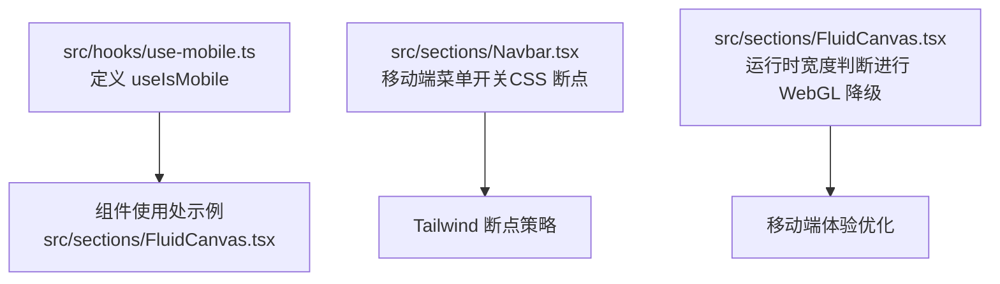
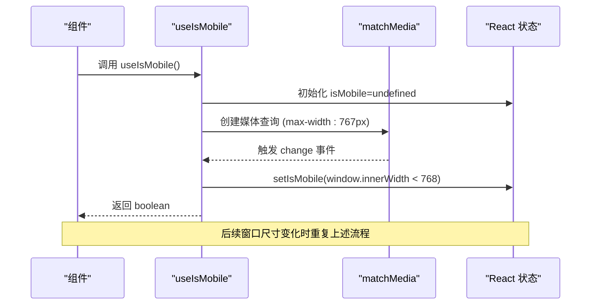
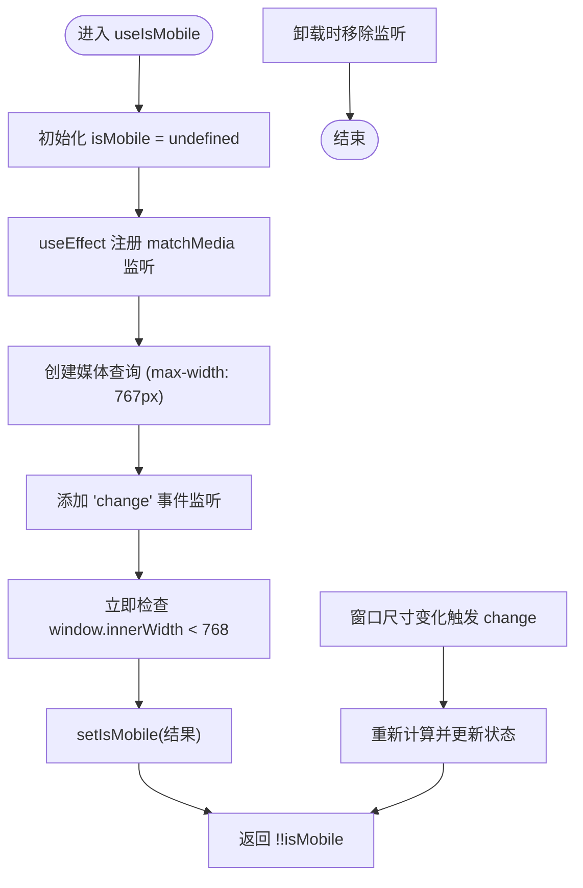
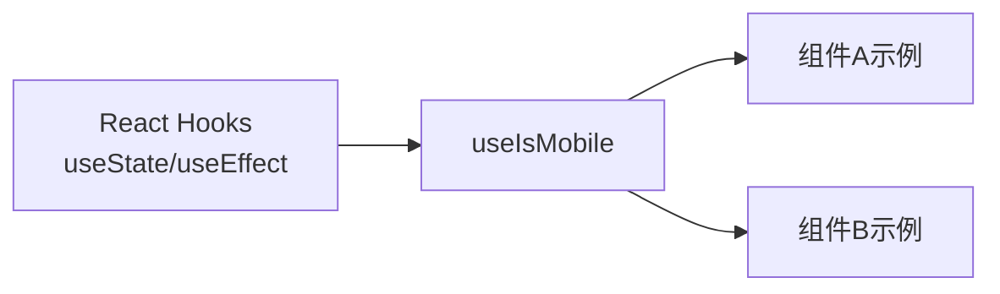

# 移动端检测Hook

<cite>
**本文引用的文件**
- [src/hooks/use-mobile.ts](file://src/hooks/use-mobile.ts)
- [src/sections/FluidCanvas.tsx](file://src/sections/FluidCanvas.tsx)
- [src/sections/Navbar.tsx](file://src/sections/Navbar.tsx)
</cite>

## 目录
1. [简介](#简介)
2. [项目结构](#项目结构)
3. [核心组件](#核心组件)
4. [架构总览](#架构总览)
5. [详细组件分析](#详细组件分析)
6. [依赖分析](#依赖分析)
7. [性能考虑](#性能考虑)
8. [故障排查指南](#故障排查指南)
9. [结论](#结论)
10. [附录](#附录)

## 简介
本文件为 useMobile Hook 的全面文档，聚焦于移动端设备检测的实现原理、返回值与使用方法、在组件中的条件渲染示例、响应式设计与触摸优化实践、浏览器兼容性与性能考量，以及测试方法与调试技巧。该 Hook 基于屏幕宽度断点进行判断，并通过媒体查询监听窗口尺寸变化，从而在运行时动态更新“是否移动端”的状态。

## 项目结构
本项目采用按功能域组织的前端工程结构，Hook 位于 src/hooks 下，页面与区块组件位于 src/sections。useMobile Hook 定义在 src/hooks/use-mobile.ts，并在部分组件中通过直接读取 window.innerWidth 的方式实现移动端降级或布局切换（例如流体画布的性能降级）。

图表来源
- [src/hooks/use-mobile.ts:1-20](file://src/hooks/use-mobile.ts#L1-L20)
- [src/sections/FluidCanvas.tsx:156-199](file://src/sections/FluidCanvas.tsx#L156-L199)
- [src/sections/Navbar.tsx:74-113](file://src/sections/Navbar.tsx#L74-L113)

章节来源
- [src/hooks/use-mobile.ts:1-20](file://src/hooks/use-mobile.ts#L1-L20)
- [src/sections/FluidCanvas.tsx:156-199](file://src/sections/FluidCanvas.tsx#L156-L199)
- [src/sections/Navbar.tsx:74-113](file://src/sections/Navbar.tsx#L74-L113)

## 核心组件
- Hook 名称：useIsMobile
- 职责：返回当前视口是否处于“移动端”状态（布尔值），并随窗口尺寸变化自动更新。
- 实现要点：
  - 使用 React 的 useState 维护 isMobile 状态，初始值为 undefined，避免服务端渲染时的闪烁。
  - 使用 useEffect 注册 matchMedia 监听器，监听 max-width 断点变化。
  - 断点常量 MOBILE_BREAKPOINT 定义为 768px，小于该值视为移动端。
  - 在 effect 内部立即执行一次判断，确保首次渲染即得到正确结果。
  - 清理函数移除事件监听，防止内存泄漏。
- 返回值：boolean，true 表示移动端，false 表示非移动端。

章节来源
- [src/hooks/use-mobile.ts:1-20](file://src/hooks/use-mobile.ts#L1-L20)

## 架构总览
从系统层面看，useIsMobile Hook 作为可复用的逻辑单元，被多个组件按需引入，用于根据设备类型进行条件渲染或行为切换。同时，项目中还存在其他基于 CSS 断点的响应式方案（如 Navbar 的 md:hidden），二者互补：
- Hook 提供运行时 JS 层面的设备判断，适合需要触发复杂逻辑或昂贵资源加载控制的场景。
- CSS 断点适合样式层面的显隐与布局调整，开销更低。

图表来源
- [src/hooks/use-mobile.ts:5-19](file://src/hooks/use-mobile.ts#L5-L19)

## 详细组件分析

### Hook 实现细节与复杂度
- 数据结构与状态
  - isMobile: boolean | undefined，初始 undefined，随后在 effect 内同步设置。
- 时间复杂度
  - 每次窗口尺寸变化仅进行一次比较与状态更新，O(1)。
- 空间复杂度
  - 仅维护一个布尔状态与一个媒体查询对象引用，O(1)。
- 错误处理与边界情况
  - 若 SSR 环境不支持 window.matchMedia，可在外层包裹 try/catch 或特性检测；当前实现未包含此保护。
  - 当窗口尺寸频繁变化时，建议结合防抖/节流减少重渲染（可选优化）。
- 兼容性
  - matchMedia 在现代浏览器广泛支持；对于极老版本需降级到 window.addEventListener("resize", ...) 方案。

图表来源
- [src/hooks/use-mobile.ts:5-19](file://src/hooks/use-mobile.ts#L5-L19)

章节来源
- [src/hooks/use-mobile.ts:1-20](file://src/hooks/use-mobile.ts#L1-L20)

### 在组件中的使用方式与条件渲染
- 基本用法
  - 在任意函数组件中导入并使用 const isMobile = useIsMobile()，然后基于 isMobile 的值进行条件渲染或逻辑分支。
- 典型模式
  - 条件渲染不同 UI：移动端显示简化版导航，桌面端显示完整导航。
  - 控制昂贵资源加载：移动端禁用 WebGL 或降低分辨率，提升性能。
  - 交互差异：移动端禁用鼠标悬停效果，改用点击或触摸事件。

注意：当前仓库中 FluidCanvas 组件直接使用 window.innerWidth 进行运行时判断以实现移动端降级，可作为参考思路。

章节来源
- [src/sections/FluidCanvas.tsx:156-199](file://src/sections/FluidCanvas.tsx#L156-L199)

### 响应式设计的应用示例
- 布局适配
  - 使用 Tailwind 的断点类（如 hidden/md:flex）在样式层完成显隐与布局切换，配合 Hook 在 JS 层做更复杂的逻辑分支。
- 触摸优化
  - 在移动端关闭鼠标相关的高成本动画（如磁性按钮、聚光灯跟随），改为点击或滑动交互。
- 示例参考
  - Navbar 组件通过 md:hidden 控制移动端菜单按钮的显示，并在点击时展开折叠菜单，体现移动端交互习惯。

章节来源
- [src/sections/Navbar.tsx:74-113](file://src/sections/Navbar.tsx#L74-L113)

### 浏览器兼容性与性能考虑
- 兼容性
  - matchMedia 在主流现代浏览器均受支持；如需兼容旧环境，可增加特性检测与 resize 回退。
- 性能
  - 仅在窗口尺寸变化时更新状态，避免不必要的重渲染。
  - 对高频 resize 场景可引入防抖/节流以减少状态更新频率。
  - 在移动端优先禁用高负载特效（如 WebGL、复杂粒子），保证流畅度。

[本节为通用指导，不直接分析具体文件]

## 依赖分析
- 外部依赖
  - React：useState、useEffect。
- 内部依赖
  - 无其他自定义模块依赖，纯函数式 Hook。
- 耦合与内聚
  - 低耦合：Hook 不依赖任何组件或全局状态，易于复用。
  - 高内聚：所有移动端检测逻辑集中在单一文件，便于维护与扩展。

图表来源
- [src/hooks/use-mobile.ts:1-20](file://src/hooks/use-mobile.ts#L1-L20)

章节来源
- [src/hooks/use-mobile.ts:1-20](file://src/hooks/use-mobile.ts#L1-L20)

## 性能考虑
- 避免在高频事件中更新状态：当前实现使用 matchMedia 的 change 事件，已较高效；若未来扩展到 resize 事件，请加入防抖/节流。
- 首屏渲染：由于初始状态为 undefined，建议在组件中对 isMobile 为 undefined 的情况提供默认 UI，避免闪烁。
- 资源降级：在移动端禁用高负载特效（如 WebGL、复杂动画），参考 FluidCanvas 的运行时判断逻辑。

[本节为通用指导，不直接分析具体文件]

## 故障排查指南
- 症状：移动端仍加载了高负载特效
  - 排查：确认是否在运行时进行了正确的宽度判断，或是否遗漏了移动端降级逻辑。
  - 参考：查看 FluidCanvas 中基于 window.innerWidth 的判断与 WebGL 初始化流程。
- 症状：窗口旋转后状态未更新
  - 排查：确认 matchMedia 监听是否正确注册，且清理函数是否生效。
- 症状：SSR 环境下报错
  - 排查：在 Node 环境中 window.matchMedia 可能不存在，需在 Hook 中加入特性检测或 try/catch 保护。
- 症状：频繁重渲染导致卡顿
  - 排查：检查是否存在高频 resize 事件导致的多次状态更新，必要时引入防抖/节流。

章节来源
- [src/sections/FluidCanvas.tsx:156-199](file://src/sections/FluidCanvas.tsx#L156-L199)
- [src/hooks/use-mobile.ts:8-16](file://src/hooks/use-mobile.ts#L8-L16)

## 结论
useIsMobile Hook 以简洁高效的实现提供了可靠的移动端检测能力，适用于条件渲染、资源加载控制与交互差异化等场景。结合 CSS 断点与运行时判断，可以在多设备上获得一致且高性能的用户体验。建议在复杂场景中增加特性检测与防抖/节流，进一步提升鲁棒性与性能。

[本节为总结性内容，不直接分析具体文件]

## 附录

### 使用示例（路径指引）
- 在组件中使用 Hook 进行条件渲染
  - 参考路径：[src/hooks/use-mobile.ts](file://src/hooks/use-mobile.ts)
- 运行时宽度判断与移动端降级
  - 参考路径：[src/sections/FluidCanvas.tsx:156-199](file://src/sections/FluidCanvas.tsx#L156-L199)
- 基于 CSS 断点的移动端菜单
  - 参考路径：[src/sections/Navbar.tsx:74-113](file://src/sections/Navbar.tsx#L74-L113)

### 测试方法
- 单元测试
  - 模拟 window.matchMedia 与 window.innerWidth，验证在不同断点下的返回值。
  - 验证 effect 的清理函数是否正确移除监听。
- 集成测试
  - 在组件中组合 useIsMobile 与其他逻辑，断言在不同视口大小下的渲染结果。
- 手动测试
  - 在真实移动设备与桌面设备上切换视口，观察 UI 与性能表现。

[本节为通用指导，不直接分析具体文件]

### 调试技巧
- 控制台打印
  - 在 onChange 回调中打印 window.innerWidth 与 isMobile 的变化，辅助定位问题。
- 浏览器开发者工具
  - 使用设备模拟器切换视口，观察状态更新与重渲染次数。
- 性能面板
  - 监控重渲染与主线程任务，评估防抖/节流的收益。

[本节为通用指导，不直接分析具体文件]