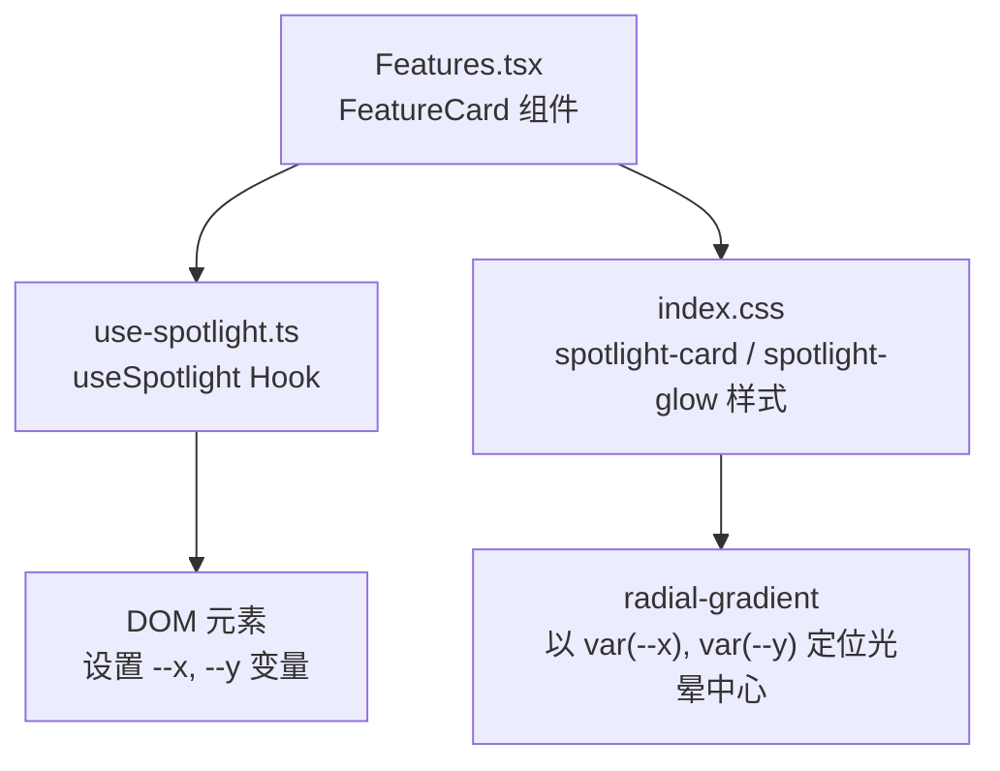
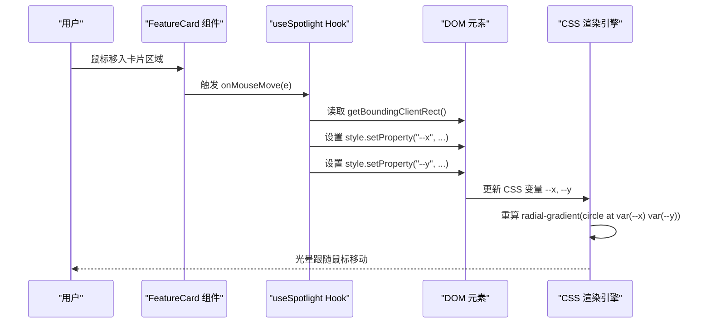
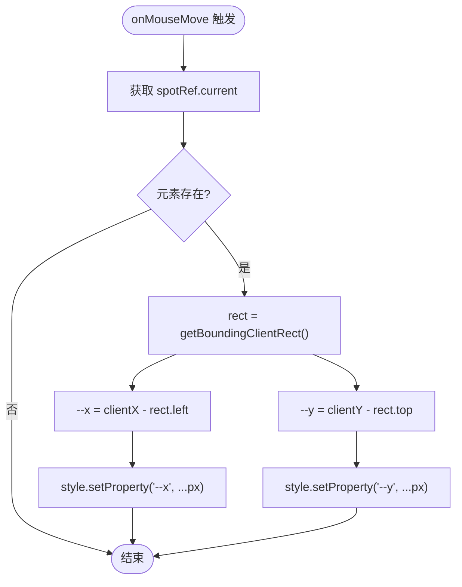
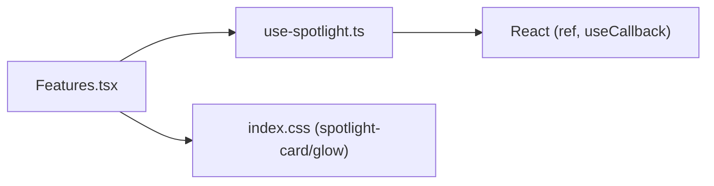

# 聚光灯效果Hook

<cite>
**本文引用的文件**   
- [use-spotlight.ts](file://src/hooks/use-spotlight.ts)
- [Features.tsx](file://src/sections/Features.tsx)
- [index.css](file://src/index.css)
</cite>

## 目录
1. [简介](#简介)
2. [项目结构](#项目结构)
3. [核心组件](#核心组件)
4. [架构总览](#架构总览)
5. [详细组件分析](#详细组件分析)
6. [依赖关系分析](#依赖关系分析)
7. [性能考量](#性能考量)
8. [故障排查指南](#故障排查指南)
9. [结论](#结论)
10. [附录](#附录)

## 简介
本文件为 useSpotlight Hook 的完整技术文档，聚焦于“鼠标跟随光晕（聚光灯）”效果的实现原理与最佳实践。内容涵盖：
- CSS 变量更新机制（--x、--y）
- 事件监听处理流程
- 性能优化策略
- Hook 返回值 spotRef 与 onMouseMove 的使用方法
- 在 CSS 中使用 radial-gradient 配合 CSS 变量实现光晕
- 常见问题与解决方案
- 面向初学者的渐进式说明与面向高级开发者的深度解析

## 项目结构
本项目采用按功能域组织的方式，聚光灯效果由以下三部分协同完成：
- Hook 层：计算并更新 CSS 变量
- 组件层：将 ref 与事件绑定到卡片容器
- 样式层：通过 CSS 变量驱动径向渐变光晕

图示来源
- [Features.tsx:66-91](file://src/sections/Features.tsx#L66-L91)
- [use-spotlight.ts:8-20](file://src/hooks/use-spotlight.ts#L8-L20)
- [index.css:104-116](file://src/index.css#L104-L116)

章节来源
- [Features.tsx:66-91](file://src/sections/Features.tsx#L66-L91)
- [use-spotlight.ts:8-20](file://src/hooks/use-spotlight.ts#L8-L20)
- [index.css:104-116](file://src/index.css#L104-L116)

## 核心组件
- useSpotlight Hook
  - 职责：维护一个 DOM 引用，并在鼠标移动时计算光标相对容器的坐标，写入当前元素的 CSS 变量 --x 与 --y。
  - 返回值：
    - spotRef：用于挂载到卡片容器元素
    - onMouseMove：用于绑定到同一容器的 mousemove 事件
- FeatureCard 组件
  - 使用 Hook 返回的 spotRef 和 onMouseMove 绑定到卡片根节点
  - 内部包含一个绝对定位的光晕层 .spotlight-glow，默认隐藏，悬停显示
- 样式层
  - .spotlight-card 初始化 --x、--y 默认值
  - .spotlight-glow 使用 radial-gradient 以 var(--x)、var(--y) 作为圆心绘制光晕

章节来源
- [use-spotlight.ts:8-20](file://src/hooks/use-spotlight.ts#L8-L20)
- [Features.tsx:66-91](file://src/sections/Features.tsx#L66-L91)
- [index.css:104-116](file://src/index.css#L104-L116)

## 架构总览
从用户交互到视觉反馈的完整链路如下：

图示来源
- [Features.tsx:66-91](file://src/sections/Features.tsx#L66-L91)
- [use-spotlight.ts:11-17](file://src/hooks/use-spotlight.ts#L11-L17)
- [index.css:108-115](file://src/index.css#L108-L115)

## 详细组件分析

### Hook 实现与数据流
- 数据结构
  - 无外部状态，仅维护一个 React Ref 指向容器元素
- 关键算法
  - 获取容器边界矩形 rect = getBoundingClientRect()
  - 计算相对坐标：e.clientX - rect.left、e.clientY - rect.top
  - 将结果写入当前元素的 CSS 变量 --x、--y
- 复杂度
  - 时间复杂度：O(1) 每次事件
  - 空间复杂度：O(1)
- 错误处理
  - 若 ref.current 为空则直接返回，避免空引用异常
- 性能要点
  - 使用 useCallback 稳定函数引用，减少不必要的重渲染
  - 直接操作 style.setProperty 最小化 DOM 变更
  - 未引入节流/防抖，适合轻量级卡片场景；如需大量卡片可考虑节流或 requestAnimationFrame

图示来源
- [use-spotlight.ts:11-17](file://src/hooks/use-spotlight.ts#L11-L17)

章节来源
- [use-spotlight.ts:8-20](file://src/hooks/use-spotlight.ts#L8-L20)

### 组件集成方式
- 在卡片根节点上同时绑定 ref 与事件：
  - ref={spotRef}
  - onMouseMove={onMouseMove}
- 在卡片内部放置一个绝对覆盖层 .spotlight-glow，默认不显示，悬停时显示
- 该设计使光晕仅在交互时出现，降低默认渲染开销

章节来源
- [Features.tsx:66-91](file://src/sections/Features.tsx#L66-L91)

### 样式与 CSS 变量联动
- 初始化变量
  - .spotlight-card 定义 --x: 50%; --y: 50% 作为默认中心
- 光晕绘制
  - .spotlight-glow 使用 radial-gradient(400px circle at var(--x) var(--y), ...)
  - 颜色与透明度可按主题调整
- 可见性控制
  - 通过 group-hover 控制 .spotlight-glow 的 opacity，实现悬停显隐

章节来源
- [index.css:104-116](file://src/index.css#L104-L116)
- [Features.tsx:75-76](file://src/sections/Features.tsx#L75-L76)

## 依赖关系分析
- 模块耦合
  - Features.tsx 依赖 useSpotlight Hook
  - useSpotlight 仅依赖 React 基础能力（ref、callback），无外部库
  - index.css 提供样式契约，与 Hook 的 CSS 变量约定解耦
- 外部依赖
  - 无第三方运行时依赖
- 潜在循环依赖
  - 不存在循环依赖

图示来源
- [Features.tsx:1-4](file://src/sections/Features.tsx#L1-L4)
- [use-spotlight.ts:1-2](file://src/hooks/use-spotlight.ts#L1-L2)
- [index.css:104-116](file://src/index.css#L104-L116)

章节来源
- [Features.tsx:1-4](file://src/sections/Features.tsx#L1-L4)
- [use-spotlight.ts:1-2](file://src/hooks/use-spotlight.ts#L1-L2)
- [index.css:104-116](file://src/index.css#L104-L116)

## 性能考量
- 事件频率
  - mousemove 高频触发，建议：
    - 对大量卡片列表使用节流（如 16ms 一次）或 requestAnimationFrame 合并更新
    - 或使用 IntersectionObserver 仅对可视卡片启用监听
- 布局抖动
  - 仅修改 CSS 变量，不改变布局属性，避免强制同步布局
- GPU 加速
  - 光晕层使用 pointer-events-none 且为纯背景图，不参与命中测试，减少合成压力
- 内存与泄漏
  - 当前实现无需额外清理；若扩展为全局监听需确保移除事件监听器

[本节为通用指导，不涉及具体文件分析]

## 故障排查指南
- 光晕不跟随鼠标
  - 检查是否在容器上同时绑定了 ref 与 onMouseMove
  - 确认 .spotlight-card 是否设置了 --x、--y 初始值
  - 确认 .spotlight-glow 是否被正确定位且未被其他层级遮挡
- 光晕只在悬停显示
  - 这是预期行为；如需始终显示，请移除 opacity 切换逻辑
- 移动端体验不佳
  - mousemove 在触屏设备上可能不触发；可补充 touchmove 支持
- 性能卡顿
  - 大量卡片时引入节流或 rAF；或仅对可视区域启用

章节来源
- [Features.tsx:66-91](file://src/sections/Features.tsx#L66-L91)
- [index.css:104-116](file://src/index.css#L104-L116)

## 结论
useSpotlight 以极小的代码量实现了高性能的鼠标跟随光晕效果。其核心在于：
- 通过 ref + mousemove 实时计算相对坐标
- 将坐标写入 CSS 变量 --x、--y
- 利用 radial-gradient 的 at 语法动态定位光晕中心
该方案具备低耦合、易扩展、易定制的优点，适合在卡片、按钮、面板等交互元素中复用。

[本节为总结性内容，不涉及具体文件分析]

## 附录

### 快速集成步骤
- 在目标组件中导入并使用 Hook
  - 调用 const { spotRef, onMouseMove } = useSpotlight()
- 将 spotRef 与 onMouseMove 绑定到卡片根节点
- 在卡片内部添加 .spotlight-glow 层，并确保父容器具有相对定位
- 在样式文件中保留 spotlight-card 与 spotlight-glow 的 CSS 规则

章节来源
- [Features.tsx:66-91](file://src/sections/Features.tsx#L66-L91)
- [index.css:104-116](file://src/index.css#L104-L116)

### 自定义与进阶技巧
- 调整光晕大小与强度
  - 修改 radial-gradient 的半径与颜色透明度
- 多色光晕
  - 使用多个渐变叠加或混合模式
- 主题适配
  - 基于 CSS 变量或 Tailwind 类名切换不同配色
- 动画过渡
  - 为 .spotlight-glow 增加 transition 实现淡入淡出

章节来源
- [index.css:108-115](file://src/index.css#L108-L115)