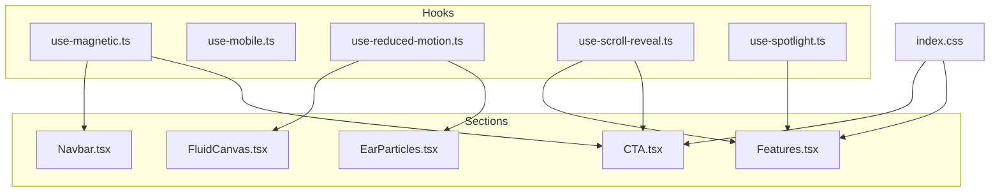
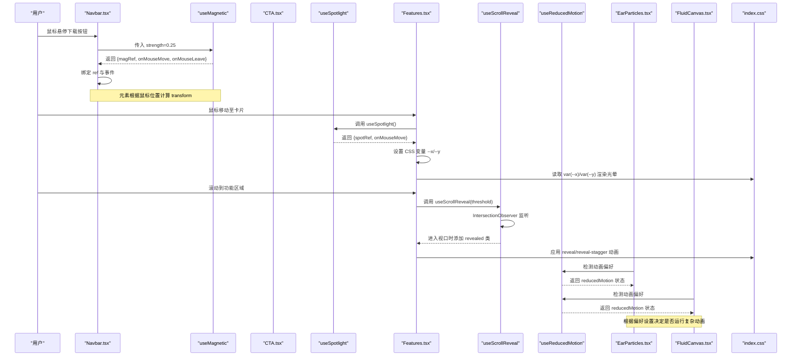
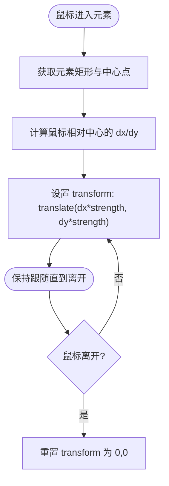
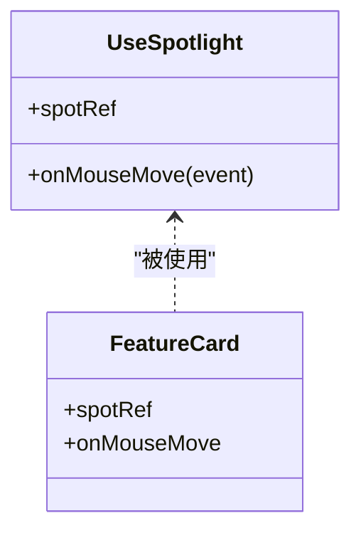
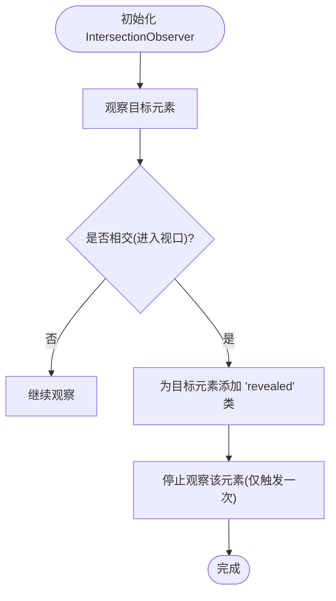
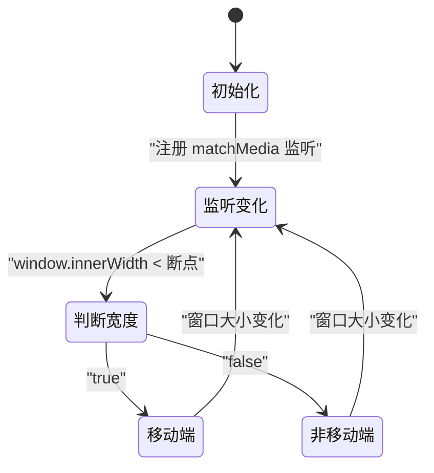
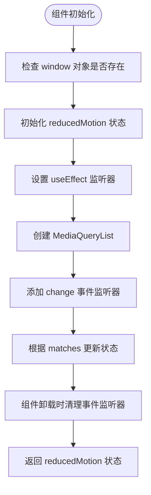
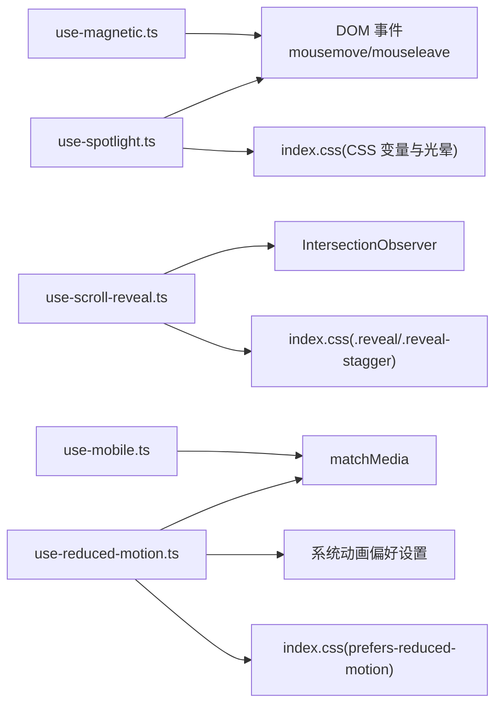

# 自定义Hooks

<cite>
**本文引用的文件**   
- [use-magnetic.ts](file://src/hooks/use-magnetic.ts)
- [use-mobile.ts](file://src/hooks/use-mobile.ts)
- [use-reduced-motion.ts](file://src/hooks/use-reduced-motion.ts)
- [use-scroll-reveal.ts](file://src/hooks/use-scroll-reveal.ts)
- [use-spotlight.ts](file://src/hooks/use-spotlight.ts)
- [EarParticles.tsx](file://src/sections/EarParticles.tsx)
- [FluidCanvas.tsx](file://src/sections/FluidCanvas.tsx)
- [CTA.tsx](file://src/sections/CTA.tsx)
- [Features.tsx](file://src/sections/Features.tsx)
- [Navbar.tsx](file://src/sections/Navbar.tsx)
- [index.css](file://src/index.css)
</cite>

## 更新摘要
**变更内容**   
- 新增 useReducedMotion Hook 详细说明
- 完善无障碍访问支持章节
- 更新性能优化建议以包含动画偏好检测最佳实践
- 添加实际使用示例和集成模式

## 目录
1. [简介](#简介)
2. [项目结构](#项目结构)
3. [核心组件](#核心组件)
4. [架构总览](#架构总览)
5. [详细组件分析](#详细组件分析)
6. [依赖关系分析](#依赖关系分析)
7. [性能考虑](#性能考虑)
8. [无障碍访问支持](#无障碍访问支持)
9. [故障排查指南](#故障排查指南)
10. [结论](#结论)
11. [附录](#附录)

## 简介
本文件为挠荔枝官网的自定义 Hooks 提供系统化文档，覆盖以下能力：
- 聚光灯效果（鼠标跟随光晕）
- 滚动显示动画（进入视口触发淡入上移）
- 磁性吸附（按钮随鼠标偏移）
- 移动端检测（基于断点的响应式状态）
- **动画偏好检测**（尊重用户系统设置，提升无障碍访问体验）

文档将逐一说明每个 Hook 的实现原理、参数与返回值、使用场景、集成模式、组合方式、性能优化建议、常见问题与调试技巧，并提供可视化图示帮助理解。

## 项目结构
这些 Hook 位于 src/hooks 目录下，并在多个页面区块中使用，配合全局样式实现动效和无障碍访问支持。

**图表来源**
- [use-magnetic.ts:1-32](file://src/hooks/use-magnetic.ts#L1-L32)
- [use-mobile.ts:1-20](file://src/hooks/use-mobile.ts#L1-L20)
- [use-reduced-motion.ts:1-19](file://src/hooks/use-reduced-motion.ts#L1-L19)
- [use-scroll-reveal.ts:1-34](file://src/hooks/use-scroll-reveal.ts#L1-L34)
- [use-spotlight.ts:1-21](file://src/hooks/use-spotlight.ts#L1-L21)
- [EarParticles.tsx:1-615](file://src/sections/EarParticles.tsx#L1-L615)
- [FluidCanvas.tsx:1-496](file://src/sections/FluidCanvas.tsx#L1-L496)
- [CTA.tsx:1-65](file://src/sections/CTA.tsx#L1-L65)
- [Features.tsx:1-91](file://src/sections/Features.tsx#L1-L91)
- [Navbar.tsx:1-117](file://src/sections/Navbar.tsx#L1-L117)
- [index.css:240-286](file://src/index.css#L240-L286)

## 核心组件
本节对五个 Hook 进行概览性说明，后续章节再深入展开。

- useMagnetic：为可交互元素添加"磁性"跟随效果，鼠标靠近时元素向鼠标方向轻微偏移，离开后复位。
- useScrollReveal：为元素添加滚动入场动画，当元素进入视口一定比例时触发 CSS 类切换，实现淡入上移等效果。
- useSpotlight：为卡片容器添加鼠标跟随的光晕效果，通过更新 CSS 变量驱动径向渐变背景。
- useIsMobile：基于窗口尺寸断点返回布尔值，用于在移动端/桌面端切换不同行为或 UI。
- **useReducedMotion**：**检测用户系统的动画偏好设置，当用户启用减少动画选项时返回 true，用于禁用复杂动画以提升可访问性和性能。**

## 架构总览
Hook 与页面组件之间的调用关系如下：

**图表来源**
- [Navbar.tsx:11-26](file://src/sections/Navbar.tsx#L11-L26)
- [use-magnetic.ts:7-31](file://src/hooks/use-magnetic.ts#L7-L31)
- [Features.tsx:34-61](file://src/sections/Features.tsx#L34-L61)
- [use-spotlight.ts:8-20](file://src/hooks/use-spotlight.ts#L8-L20)
- [index.css:104-116](file://src/index.css#L104-L116)
- [Features.tsx:63-91](file://src/sections/Features.tsx#L63-L91)
- [use-scroll-reveal.ts:7-33](file://src/hooks/use-scroll-reveal.ts#L7-L33)
- [index.css:80-103](file://src/index.css#L80-L103)
- [EarParticles.tsx:115-124](file://src/sections/EarParticles.tsx#L115-L124)
- [FluidCanvas.tsx:1-200](file://src/sections/FluidCanvas.tsx#L1-L200)

## 详细组件分析

### useMagnetic（磁性吸附）
- 作用：为锚点或按钮等元素添加磁性跟随效果，提升交互质感。
- 参数：
  - strength：磁力强度，默认 0.3，数值越大偏移越明显。
- 返回值：
  - magRef：指向目标元素的引用。
  - onMouseMove：鼠标移动回调，计算相对中心偏移并设置 transform。
  - onMouseLeave：鼠标离开回调，重置 transform。
- 使用场景：导航栏下载按钮、CTA 区域的 App Store 按钮等需要强调的交互元素。
- 集成要点：
  - 将 magRef 绑定到目标元素。
  - 同时绑定 onMouseMove 和 onMouseLeave。
  - 建议在父级元素上避免其他 transform 冲突，或在业务层合并 transform。
- 示例路径：
  - [Navbar.tsx:11-26](file://src/sections/Navbar.tsx#L11-L26)
  - [CTA.tsx:28-42](file://src/sections/CTA.tsx#L28-L42)

**图表来源**
- [use-magnetic.ts:10-28](file://src/hooks/use-magnetic.ts#L10-L28)

**章节来源**
- [use-magnetic.ts:1-32](file://src/hooks/use-magnetic.ts#L1-L32)
- [Navbar.tsx:11-26](file://src/sections/Navbar.tsx#L11-L26)
- [CTA.tsx:28-42](file://src/sections/CTA.tsx#L28-L42)

### useSpotlight（聚光灯效果）
- 作用：为卡片容器添加鼠标跟随的光晕效果，通过 CSS 变量驱动径向渐变。
- 参数：无。
- 返回值：
  - spotRef：指向卡片容器的引用。
  - onMouseMove：鼠标移动回调，计算光标相对于容器的坐标并设置 CSS 变量 --x 与 --y。
- 使用场景：功能卡片、特性展示区等需要聚焦感知的交互区域。
- 集成要点：
  - 将 spotRef 绑定到外层容器。
  - 在容器内放置一个绝对定位的"光晕层"，使用 radial-gradient 以 var(--x)/var(--y) 作为圆心。
  - 可通过 CSS 控制光晕半径、颜色与透明度。
- 示例路径：
  - [Features.tsx:34-61](file://src/sections/Features.tsx#L34-L61)
  - [index.css:104-116](file://src/index.css#L104-L116)

**图表来源**
- [use-spotlight.ts:8-20](file://src/hooks/use-spotlight.ts#L8-L20)
- [Features.tsx:34-61](file://src/sections/Features.tsx#L34-L61)

**章节来源**
- [use-spotlight.ts:1-21](file://src/hooks/use-spotlight.ts#L1-L21)
- [Features.tsx:34-61](file://src/sections/Features.tsx#L34-L61)
- [index.css:104-116](file://src/index.css#L104-L116)

### useScrollReveal（滚动显示动画）
- 作用：当元素进入视口达到指定阈值时，为其添加 "revealed" 类，从而触发 CSS 过渡动画。
- 参数：
  - threshold：触发比例，默认 0.15，表示元素可见 15% 时触发。
- 返回值：
  - ref：指向目标元素的引用。
- 使用场景：区块标题、卡片列表等希望"滚动进入时出现"的元素。
- 集成要点：
  - 将 ref 绑定到目标元素。
  - 在 CSS 中定义初始状态（如 opacity: 0; transform: translateY(...)）与 .revealed 的最终状态。
  - 对于子元素延迟入场，可使用 .reveal-stagger 配合 nth-child 的 transition-delay。
- 示例路径：
  - [Features.tsx:63-91](file://src/sections/Features.tsx#L63-L91)
  - [index.css:80-103](file://src/index.css#L80-L103)

**图表来源**
- [use-scroll-reveal.ts:12-30](file://src/hooks/use-scroll-reveal.ts#L12-L30)
- [index.css:80-103](file://src/index.css#L80-L103)

**章节来源**
- [use-scroll-reveal.ts:1-34](file://src/hooks/use-scroll-reveal.ts#L1-L34)
- [Features.tsx:63-91](file://src/sections/Features.tsx#L63-L91)
- [index.css:80-103](file://src/index.css#L80-L103)

### useIsMobile（移动端检测）
- 作用：基于窗口宽度断点返回布尔值，便于在不同设备下切换逻辑或 UI。
- 参数：无。
- 返回值：
  - isMobile：当前是否为移动端（true/false）。
- 使用场景：条件渲染、禁用某些桌面专属交互、调整布局策略等。
- 集成要点：
  - 断点常量可在 Hook 内部维护，也可抽离为配置项。
  - 若需更细粒度控制，可结合多组媒体查询或使用第三方库。
- 示例路径：
  - [use-mobile.ts:1-20](file://src/hooks/use-mobile.ts#L1-L20)

**图表来源**
- [use-mobile.ts:5-19](file://src/hooks/use-mobile.ts#L5-L19)

**章节来源**
- [use-mobile.ts:1-20](file://src/hooks/use-mobile.ts#L1-L20)

### useReducedMotion（动画偏好检测）**新增**
- 作用：检测用户系统的动画偏好设置，当用户启用"减少动画"选项时返回 true，用于禁用复杂动画以提升可访问性和性能。
- 参数：无。
- 返回值：
  - reducedMotion：当前是否启用了减少动画偏好（true/false）。
- 使用场景：
  - 复杂 Canvas 动画（粒子效果、流体模拟等）
  - 大量 DOM 操作动画
  - 高性能要求的应用场景
  - 无障碍访问需求
- 集成要点：
  - 在组件初始化时检查 reducedMotion 状态。
  - 当 reducedMotion 为 true 时，跳过复杂的动画逻辑。
  - 可与 CSS prefers-reduced-motion 媒体查询配合使用。
- 实际使用示例：
  - [EarParticles.tsx:115-124](file://src/sections/EarParticles.tsx#L115-L124) - 星空粒子效果
  - [FluidCanvas.tsx:1-200](file://src/sections/FluidCanvas.tsx#L1-L200) - WebGL 流体模拟

**图表来源**
- [use-reduced-motion.ts:3-18](file://src/hooks/use-reduced-motion.ts#L3-L18)

**章节来源**
- [use-reduced-motion.ts:1-19](file://src/hooks/use-reduced-motion.ts#L1-L19)
- [EarParticles.tsx:115-124](file://src/sections/EarParticles.tsx#L115-L124)
- [FluidCanvas.tsx:1-200](file://src/sections/FluidCanvas.tsx#L1-L200)

## 依赖关系分析
- Hook 之间相互独立，无直接依赖关系，可按需组合使用。
- 与 CSS 的耦合点：
  - useScrollReveal 依赖 .reveal 与 .reveal-stagger 的样式定义。
  - useSpotlight 依赖 CSS 变量 --x/--y 与径向渐变光晕层。
  - **useReducedMotion 与 index.css 中的 prefers-reduced-motion 媒体查询协同工作。**
- 与 DOM 事件的耦合点：
  - useMagnetic 与 useSpotlight 均依赖 mousemove/mouseleave 事件。
  - **useReducedMotion 依赖 window.matchMedia API 和 change 事件。**
- 与浏览器 API 的耦合点：
  - useScrollReveal 使用 IntersectionObserver。
  - useIsMobile 使用 window.matchMedia。
  - **useReducedMotion 使用 window.matchMedia 监听系统动画偏好变化。**

**图表来源**
- [use-magnetic.ts:10-28](file://src/hooks/use-magnetic.ts#L10-L28)
- [use-spotlight.ts:11-17](file://src/hooks/use-spotlight.ts#L11-L17)
- [use-scroll-reveal.ts:12-30](file://src/hooks/use-scroll-reveal.ts#L12-L30)
- [use-mobile.ts:8-16](file://src/hooks/use-mobile.ts#L8-L16)
- [use-reduced-motion.ts:9-16](file://src/hooks/use-reduced-motion.ts#L9-L16)
- [index.css:246-286](file://src/index.css#L246-L286)

**章节来源**
- [use-magnetic.ts:1-32](file://src/hooks/use-magnetic.ts#L1-L32)
- [use-spotlight.ts:1-21](file://src/hooks/use-spotlight.ts#L1-L21)
- [use-scroll-reveal.ts:1-34](file://src/hooks/use-scroll-reveal.ts#L1-L34)
- [use-mobile.ts:1-20](file://src/hooks/use-mobile.ts#L1-L20)
- [use-reduced-motion.ts:1-19](file://src/hooks/use-reduced-motion.ts#L1-L19)
- [index.css:246-286](file://src/index.css#L246-L286)

## 性能考虑
- 事件节流/防抖：
  - mousemove 频率较高，建议在业务层对 onmousemove 做节流处理，降低重排与重绘压力。
- 减少不必要的 reflow：
  - 尽量只修改 transform 与 opacity，避免频繁读写布局属性。
- IntersectionObserver 的使用：
  - 已实现"仅触发一次"的 unobserve，避免重复监听带来的开销。
- CSS 变量与 GPU 加速：
  - 聚光灯效果通过 CSS 变量与径向渐变实现，GPU 友好；确保光晕层为绝对定位且 pointer-events: none，避免命中测试影响性能。
- 移动端适配：
  - 在移动端可考虑关闭部分动效（例如磁性吸附），以提升流畅度与续航。
- **动画偏好检测的最佳实践**：
  - **使用 useReducedMotion Hook 检测用户系统设置，自动禁用复杂动画。**
  - **结合 CSS prefers-reduced-motion 媒体查询提供兜底方案。**
  - **在 Canvas/WebGL 动画中优先检查 reducedMotion 状态，避免不必要的计算。**
  - **为低性能设备提供降级方案，减少粒子数量和视觉效果。**

## 无障碍访问支持

### 动画偏好检测机制
网站实现了完整的无障碍访问支持，通过 `useReducedMotion` Hook 和 CSS 媒体查询双重保障：

#### JavaScript 层面
- **实时检测**：使用 `window.matchMedia("(prefers-reduced-motion: reduce)")` 检测用户系统设置
- **动态响应**：监听系统设置变化，实时更新组件状态
- **服务端渲染兼容**：在 SSR 环境下安全返回 false

#### CSS 层面
- **全局兜底**：通过 `@media (prefers-reduced-motion: reduce)` 媒体查询禁用所有动画
- **渐进增强**：为特定动画类提供降级样式
- **滚动行为**：强制使用默认滚动行为而非平滑滚动

#### 实际应用示例
- **星空粒子效果**：当检测到减少动画偏好时，完全跳过 Canvas 动画初始化
- **WebGL 流体模拟**：根据用户偏好决定是否启动复杂的物理计算
- **CSS 动画**：所有关键帧动画和过渡效果都被禁用

### 用户体验优化
- **尊重用户选择**：严格遵循用户的系统级动画偏好设置
- **性能优先**：在低性能设备上自动降级动画质量
- **内存管理**：及时清理动画相关的资源监听器
- **兼容性保障**：为不支持 matchMedia 的环境提供回退方案

**章节来源**
- [use-reduced-motion.ts:1-19](file://src/hooks/use-reduced-motion.ts#L1-L19)
- [index.css:246-286](file://src/index.css#L246-L286)
- [EarParticles.tsx:115-124](file://src/sections/EarParticles.tsx#L115-L124)

## 故障排查指南
- 磁吸效果未生效
  - 检查是否正确绑定 magRef 与 onMouseMove/onMouseLeave。
  - 确认目标元素未被父级 transform 覆盖导致位移异常。
  - 参考路径：[Navbar.tsx:11-26](file://src/sections/Navbar.tsx#L11-L26)、[CTA.tsx:28-42](file://src/sections/CTA.tsx#L28-L42)
- 聚光灯光晕不跟随
  - 确认 spotRef 绑定到外层容器，而非内容块。
  - 检查 CSS 变量 --x/--y 是否被正确设置，以及光晕层是否使用了 var(--x)/var(--y)。
  - 参考路径：[Features.tsx:34-61](file://src/sections/Features.tsx#L34-L61)、[index.css:104-116](file://src/index.css#L104-L116)
- 滚动动画不触发
  - 检查目标元素是否设置了正确的类名（如 reveal 或 reveal-stagger）。
  - 确认 threshold 合理，必要时调大阈值以便快速触发。
  - 参考路径：[use-scroll-reveal.ts:12-30](file://src/hooks/use-scroll-reveal.ts#L12-L30)、[index.css:80-103](file://src/index.css#L80-L103)
- 移动端检测不准确
  - 确认断点值是否符合预期，必要时在组件中打印 isMobile 验证。
  - 参考路径：[use-mobile.ts:5-19](file://src/hooks/use-mobile.ts#L5-L19)
- **动画偏好检测问题**
  - **检查浏览器是否支持 matchMedia API**
  - **确认系统设置中"减少动画"选项是否正确配置**
  - **验证 useEffect 是否正确监听到 change 事件**
  - **参考路径：[use-reduced-motion.ts:9-16](file://src/hooks/use-reduced-motion.ts#L9-L16)**
- **Canvas 动画性能问题**
  - **检查 reducedMotion 状态是否正确阻止动画初始化**
  - **确认粒子数量是否根据设备性能自动调整**
  - **参考路径：[EarParticles.tsx:122-138](file://src/sections/EarParticles.tsx#L122-L138)**

**章节来源**
- [Navbar.tsx:11-26](file://src/sections/Navbar.tsx#L11-L26)
- [CTA.tsx:28-42](file://src/sections/CTA.tsx#L28-L42)
- [Features.tsx:34-61](file://src/sections/Features.tsx#L34-L61)
- [use-scroll-reveal.ts:12-30](file://src/hooks/use-scroll-reveal.ts#L12-L30)
- [index.css:80-116](file://src/index.css#L80-L116)
- [use-mobile.ts:5-19](file://src/hooks/use-mobile.ts#L5-L19)
- [use-reduced-motion.ts:9-16](file://src/hooks/use-reduced-motion.ts#L9-L16)
- [EarParticles.tsx:122-138](file://src/sections/EarParticles.tsx#L122-L138)

## 结论
这五个 Hook 分别解决了常见的交互与动效需求：磁性吸附增强点击引导，聚光灯提升视觉焦点，滚动入场改善信息节奏，移动端检测支撑差异化体验，**动画偏好检测确保无障碍访问**。它们彼此独立、易于组合，并与 CSS 紧密协作，形成轻量而高效的交互体系。在实际项目中，建议结合性能优化与错误排查清单，按需启用与定制，以获得最佳的用户体验。

## 附录
- 组合使用建议
  - 在功能卡片区域同时使用 useSpotlight 与 useScrollReveal：先通过滚动入场展示卡片，再在卡片上叠加聚光灯效果。
  - 在导航栏与 CTA 区域使用 useMagnetic：强化关键行动按钮的吸引力。
  - 在需要区分移动端行为的区域引入 useIsMobile：例如在移动端隐藏复杂动效或简化交互。
  - **在所有复杂动画场景中引入 useReducedMotion：确保无障碍访问和性能优化。**
- 扩展思路
  - 为 useMagnetic 增加阻尼与回弹曲线，使运动更自然。
  - 为 useScrollReveal 支持多种入场动画类型（淡入、缩放、滑入等）。
  - 为 useSpotlight 支持多光源与动态半径。
  - 为 useIsMobile 支持多断点与媒体查询组合。
  - **为 useReducedMotion 增加更多动画偏好选项（如减少透明度变化、减少闪烁等）。**
- **无障碍访问最佳实践**
  - **始终尊重用户的系统级动画偏好设置**
  - **为复杂动画提供明确的降级方案**
  - **确保键盘导航不受动画影响**
  - **定期测试不同设备和浏览器的兼容性**