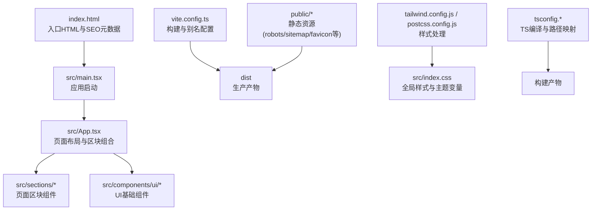
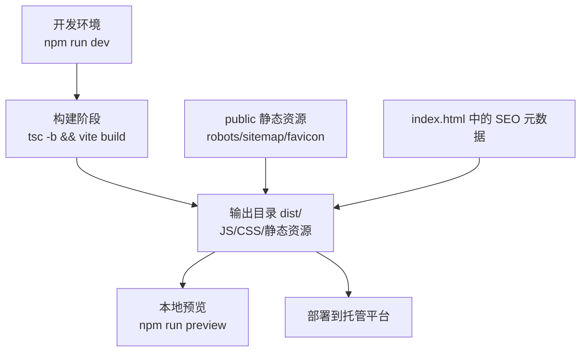
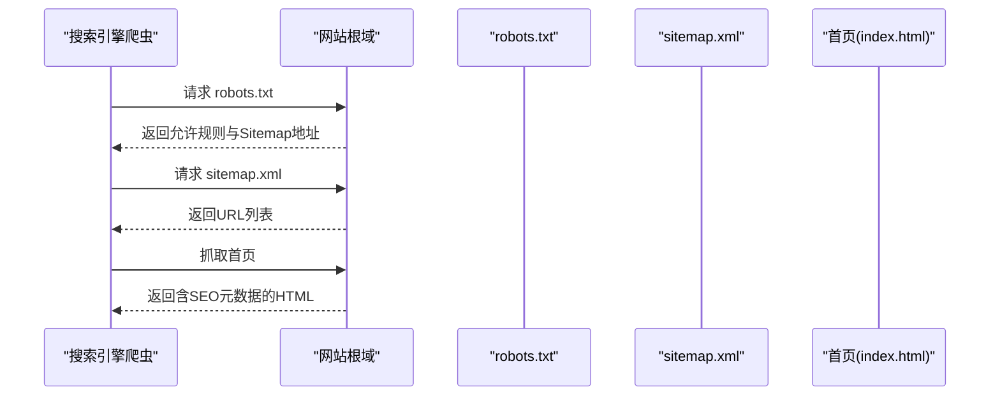
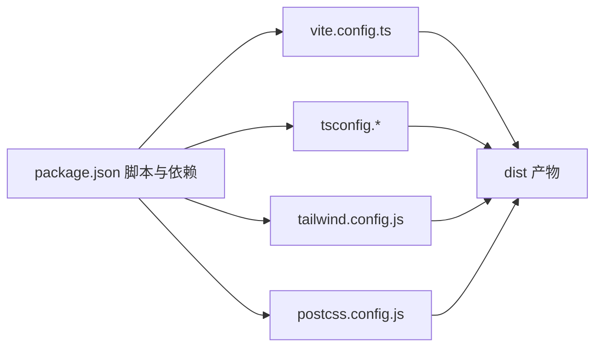

# 部署指南

<cite>
**本文引用的文件**   
- [vite.config.ts](file://vite.config.ts)
- [package.json](file://package.json)
- [index.html](file://index.html)
- [public/robots.txt](file://public/robots.txt)
- [public/sitemap.xml](file://public/sitemap.xml)
- [tailwind.config.js](file://tailwind.config.js)
- [postcss.config.js](file://postcss.config.js)
- [tsconfig.json](file://tsconfig.json)
- [tsconfig.app.json](file://tsconfig.app.json)
- [tsconfig.node.json](file://tsconfig.node.json)
- [src/main.tsx](file://src/main.tsx)
- [src/App.tsx](file://src/App.tsx)
- [src/index.css](file://src/index.css)
- [README.md](file://README.md)
</cite>

## 目录
1. [简介](#简介)
2. [项目结构](#项目结构)
3. [核心组件](#核心组件)
4. [架构总览](#架构总览)
5. [详细组件分析](#详细组件分析)
6. [依赖分析](#依赖分析)
7. [性能考虑](#性能考虑)
8. [故障排除指南](#故障排除指南)
9. [结论](#结论)
10. [附录](#附录)

## 简介
本指南面向挠荔枝官网的构建与生产部署，覆盖 Vite 构建配置、环境变量管理、静态资源与 CDN 优化、SEO 配置（robots.txt 与 sitemap.xml）、主流静态托管平台（GitHub Pages、Vercel、Netlify）部署流程、域名与 HTTPS 设置、性能监控方案，以及上线后的测试验证与常见问题排查。文档内容均基于仓库现有配置与源码进行说明，确保可操作性和一致性。

## 项目结构
本项目采用 Vite + React + TypeScript + Tailwind CSS 的现代前端工程化方案。根目录包含入口 HTML、构建与样式配置、TypeScript 多项目引用配置、ESLint 规则等；业务代码位于 src 目录，静态资源位于 public 目录。

图表来源
- [index.html:1-49](file://index.html#L1-L49)
- [src/main.tsx:1-11](file://src/main.tsx#L1-L11)
- [src/App.tsx:1-30](file://src/App.tsx#L1-L30)
- [vite.config.ts:1-15](file://vite.config.ts#L1-L15)
- [tailwind.config.js:1-92](file://tailwind.config.js#L1-L92)
- [postcss.config.js:1-7](file://postcss.config.js#L1-L7)
- [tsconfig.json:1-17](file://tsconfig.json#L1-L17)
- [tsconfig.app.json:1-34](file://tsconfig.app.json#L1-L34)
- [tsconfig.node.json:1-26](file://tsconfig.node.json#L1-L26)

章节来源
- [README.md:1-73](file://README.md#L1-L73)
- [package.json:1-80](file://package.json#L1-L80)

## 核心组件
- 构建系统：Vite 7，React 插件，路径别名 @ 指向 src。
- 样式管线：Tailwind CSS 3 + PostCSS Autoprefixer，主题色通过 CSS 变量定义。
- TypeScript：多 tsconfig 引用，严格模式，模块解析为 bundler 模式。
- 入口与路由：单页应用，入口 index.html 注入 #root，main.tsx 挂载 App。
- SEO 与静态资源：index.html 内嵌 OG/Twitter 元信息，public 下提供 robots.txt 与 sitemap.xml。

章节来源
- [vite.config.ts:1-15](file://vite.config.ts#L1-L15)
- [tailwind.config.js:1-92](file://tailwind.config.js#L1-L92)
- [postcss.config.js:1-7](file://postcss.config.js#L1-L7)
- [tsconfig.json:1-17](file://tsconfig.json#L1-L17)
- [tsconfig.app.json:1-34](file://tsconfig.app.json#L1-L34)
- [tsconfig.node.json:1-26](file://tsconfig.node.json#L1-L26)
- [index.html:1-49](file://index.html#L1-L49)
- [src/main.tsx:1-11](file://src/main.tsx#L1-L11)
- [src/App.tsx:1-30](file://src/App.tsx#L1-L30)

## 架构总览
下图展示了从源码到生产产物的关键流程，包括构建、静态资源与 SEO 文件的组织方式。

图表来源
- [package.json:6-11](file://package.json#L6-L11)
- [vite.config.ts:6-14](file://vite.config.ts#L6-L14)
- [index.html:1-49](file://index.html#L1-L49)
- [public/robots.txt:1-5](file://public/robots.txt#L1-L5)
- [public/sitemap.xml:1-10](file://public/sitemap.xml#L1-L10)

## 详细组件分析

### Vite 构建配置与生产优化
- base 路径：当前设置为相对路径，便于在子路径或某些托管环境中正确加载资源。
- 插件：启用官方 React 插件，支持 JSX 与快速热更新。
- 路径别名：@ 指向 src，统一导入风格。
- 建议的生产优化项（按需添加）：
  - 开启 gzip/brotli 压缩（可通过托管平台或中间件实现）。
  - 资源哈希与缓存策略（Vite 默认已对 JS/CSS 使用内容哈希）。
  - 图片与字体预加载、懒加载策略（结合 <link rel="preload"> 与组件级懒加载）。
  - 第三方库按需引入与 Tree-shaking（保持现代打包器特性）。

章节来源
- [vite.config.ts:1-15](file://vite.config.ts#L1-L15)
- [package.json:6-11](file://package.json#L6-L11)

### 环境变量管理与配置文件组织
- 现状：仓库未包含 .env 或 .env.production 文件，也未在构建脚本中显式读取环境变量。
- 推荐实践：
  - 创建 .env.development 与 .env.production，存放 API 地址、埋点开关、功能开关等。
  - 在 Vite 中通过 import.meta.env 访问前缀为 VITE_ 的环境变量。
  - 将敏感信息仅保存在托管平台的“环境变量”面板中，不提交至仓库。
  - 在 index.html 中如需注入站点标识，可通过构建时替换或运行时读取环境变量。

章节来源
- [package.json:6-11](file://package.json#L6-L11)
- [vite.config.ts:1-15](file://vite.config.ts#L1-L15)

### CDN 资源配置与资源优化策略
- 字体与图标：
  - Google Fonts 通过外部链接引入，生产环境建议下载并自托管以提升稳定性与隐私合规性。
  - 图标使用 Lucide React，属于包内资源，由打包器处理。
- 静态资源：
  - favicon 与 OG 图片位于 public 目录，构建后随 dist 发布。
  - 建议在托管平台开启 HTTP/2 与缓存头（Cache-Control），并为静态资源设置长期缓存与版本化文件名。
- 资源体积优化：
  - 图片使用现代格式（WebP/AVIF）并提供降级。
  - 大段动画与 Canvas 渲染注意移动端性能，必要时降低分辨率或帧率。

章节来源
- [src/index.css:1-116](file://src/index.css#L1-L116)
- [index.html:1-49](file://index.html#L1-L49)
- [tailwind.config.js:1-92](file://tailwind.config.js#L1-L92)

### SEO 优化配置（robots.txt 与 sitemap.xml）
- robots.txt：允许所有爬虫抓取根路径，并声明站点地图位置。
- sitemap.xml：包含首页 URL、更新时间、变更频率与优先级。
- index.html：包含标题、描述、关键词、OG/Twitter 卡片、规范链接与结构化数据（JSON-LD）。

图表来源
- [public/robots.txt:1-5](file://public/robots.txt#L1-L5)
- [public/sitemap.xml:1-10](file://public/sitemap.xml#L1-L10)
- [index.html:1-49](file://index.html#L1-L49)

章节来源
- [public/robots.txt:1-5](file://public/robots.txt#L1-L5)
- [public/sitemap.xml:1-10](file://public/sitemap.xml#L1-L10)
- [index.html:1-49](file://index.html#L1-L49)

### 静态网站托管平台部署流程

#### GitHub Pages
- 准备分支与目录：通常使用 gh-pages 分支并将构建产物放入根目录或指定目录。
- 构建命令：执行 tsc -b 与 vite build，产出 dist 目录。
- 部署步骤：
  - 在仓库 Settings > Pages 中选择源分支与目录（如 dist）。
  - 若使用 Actions，可在 workflow 中安装依赖、构建并上传 dist。
- 注意事项：
  - base 为相对路径时，需确认 Pages 服务的路由规则与资源路径一致。
  - 自定义域名需在 Pages 设置中绑定，并在 DNS 中添加 CNAME 记录。

章节来源
- [package.json:6-11](file://package.json#L6-L11)
- [vite.config.ts:6-14](file://vite.config.ts#L6-L14)

#### Vercel
- 自动检测：选择项目根目录，框架识别为 Vite/React。
- 构建命令：tsc -b && vite build。
- 输出目录：dist。
- 环境变量：在 Vercel 项目的 Environment Variables 中配置，运行期通过 import.meta.env 访问。
- 自定义域名与 HTTPS：在 Domains 中绑定域名，Vercel 自动签发并续期 HTTPS。

章节来源
- [package.json:6-11](file://package.json#L6-L11)
- [vite.config.ts:6-14](file://vite.config.ts#L6-L14)

#### Netlify
- 构建命令：tsc -b && vite build。
- 发布目录：dist。
- 重定向与头部：可在 netlify.toml 或 UI 中配置 301 重定向与 Cache-Control。
- 环境变量：在 Netlify 项目的 Environment 中配置。
- 自定义域名与 HTTPS：在 Domain Management 中绑定域名，自动启用 HTTPS。

章节来源
- [package.json:6-11](file://package.json#L6-L11)
- [vite.config.ts:6-14](file://vite.config.ts#L6-L14)

### 域名配置、HTTPS 与性能监控
- 域名与 DNS：
  - 在托管平台绑定自定义域名，按提示添加 CNAME/A 记录。
  - 若使用子路径部署，确保 base 与平台路由一致。
- HTTPS：
  - 推荐使用托管平台提供的自动证书（Vercel/Netlify/GitHub Pages 均支持）。
  - 自建服务器则使用 Let's Encrypt 或云厂商证书。
- 性能监控：
  - 接入 Web Vitals 上报（LCP、FID、CLS、INP 等指标）。
  - 使用浏览器开发者工具 Performance 面板与 Lighthouse 进行基准测试。
  - 结合托管平台日志与错误追踪（如 Sentry）定位问题。

[本节为通用指导，无需特定文件来源]

## 依赖分析
- 构建与脚本：
  - 开发：vite
  - 构建：tsc -b 与 vite build
  - 预览：vite preview
- 样式与类型：
  - Tailwind CSS 3、PostCSS Autoprefixer
  - TypeScript 严格模式，模块解析为 bundler 模式
- 运行时：
  - React 19、ReactDOM 19
  - shadcn/ui 生态组件（Radix 系列）
  - 其他工具库（日期、表单、可视化等）

图表来源
- [package.json:1-80](file://package.json#L1-L80)
- [vite.config.ts:1-15](file://vite.config.ts#L1-L15)
- [tsconfig.json:1-17](file://tsconfig.json#L1-L17)
- [tsconfig.app.json:1-34](file://tsconfig.app.json#L1-L34)
- [tsconfig.node.json:1-26](file://tsconfig.node.json#L1-L26)
- [tailwind.config.js:1-92](file://tailwind.config.js#L1-L92)
- [postcss.config.js:1-7](file://postcss.config.js#L1-L7)

章节来源
- [package.json:1-80](file://package.json#L1-L80)
- [vite.config.ts:1-15](file://vite.config.ts#L1-L15)
- [tsconfig.json:1-17](file://tsconfig.json#L1-L17)
- [tsconfig.app.json:1-34](file://tsconfig.app.json#L1-L34)
- [tsconfig.node.json:1-26](file://tsconfig.node.json#L1-L26)
- [tailwind.config.js:1-92](file://tailwind.config.js#L1-L92)
- [postcss.config.js:1-7](file://postcss.config.js#L1-L7)

## 性能考虑
- 首屏加载：
  - 减少首屏 JS/CSS 体积，拆分非关键逻辑与组件。
  - 预加载关键字体与首屏图片，避免阻塞渲染。
- 网络与缓存：
  - 启用 HTTP/2、Gzip/Brotli 压缩。
  - 为静态资源设置长期缓存与版本号，利用浏览器缓存。
- 渲染性能：
  - 复杂动画与 Canvas 场景在移动端降质或延迟初始化。
  - 合理使用 IntersectionObserver 做滚动入场与懒加载。
- 可观测性：
  - 采集 Core Web Vitals，建立基线与告警阈值。
  - 定期使用 Lighthouse CI 进行回归检查。

[本节为通用指导，无需特定文件来源]

## 故障排除指南
- 构建失败：
  - 检查 Node 与 npm 版本是否满足要求。
  - 清理 node_modules 与锁文件后重新安装依赖。
  - 确认 TypeScript 编译无错误（tsc -b）。
- 资源 404：
  - 检查 base 路径是否与托管平台路由匹配。
  - 确认 public 下的静态资源是否正确复制到 dist。
- 样式异常：
  - 确认 Tailwind 扫描路径包含所有模板与组件。
  - 检查 PostCSS 插件顺序与 Autoprefixer 兼容性。
- 环境变量未生效：
  - 确认环境变量名以 VITE_ 开头且已在托管平台配置。
  - 构建后无法在运行时修改环境变量，需重新构建。
- SEO 未收录：
  - 检查 robots.txt 是否允许抓取。
  - 确认 sitemap.xml 可被访问且 URL 有效。
  - 在搜索引擎控制台提交站点地图。

章节来源
- [package.json:6-11](file://package.json#L6-L11)
- [vite.config.ts:6-14](file://vite.config.ts#L6-L14)
- [tailwind.config.js:1-92](file://tailwind.config.js#L1-L92)
- [postcss.config.js:1-7](file://postcss.config.js#L1-L7)
- [public/robots.txt:1-5](file://public/robots.txt#L1-L5)
- [public/sitemap.xml:1-10](file://public/sitemap.xml#L1-L10)

## 结论
本项目具备清晰的构建与样式管线，SEO 基础完善，适合直接部署到主流静态托管平台。建议在生产环境补充环境变量管理、CDN 自托管字体与图片、性能监控与自动化测试，以确保上线质量与可维护性。

[本节为总结性内容，无需特定文件来源]

## 附录

### 本地开发与预览
- 安装依赖：npm install
- 启动开发服务器：npm run dev
- 构建生产版本：npm run build
- 预览生产构建：npm run preview

章节来源
- [package.json:6-11](file://package.json#L6-L11)
- [README.md:29-43](file://README.md#L29-L43)

### 应用结构与入口
- 入口 HTML：index.html 负责 SEO 元数据与脚本注入。
- 应用启动：src/main.tsx 创建根节点并挂载 App。
- 页面布局：src/App.tsx 组合各区块组件。

章节来源
- [index.html:1-49](file://index.html#L1-L49)
- [src/main.tsx:1-11](file://src/main.tsx#L1-L11)
- [src/App.tsx:1-30](file://src/App.tsx#L1-L30)