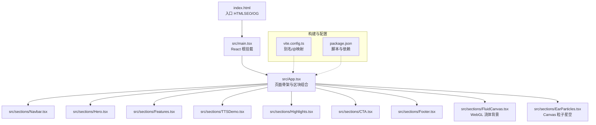
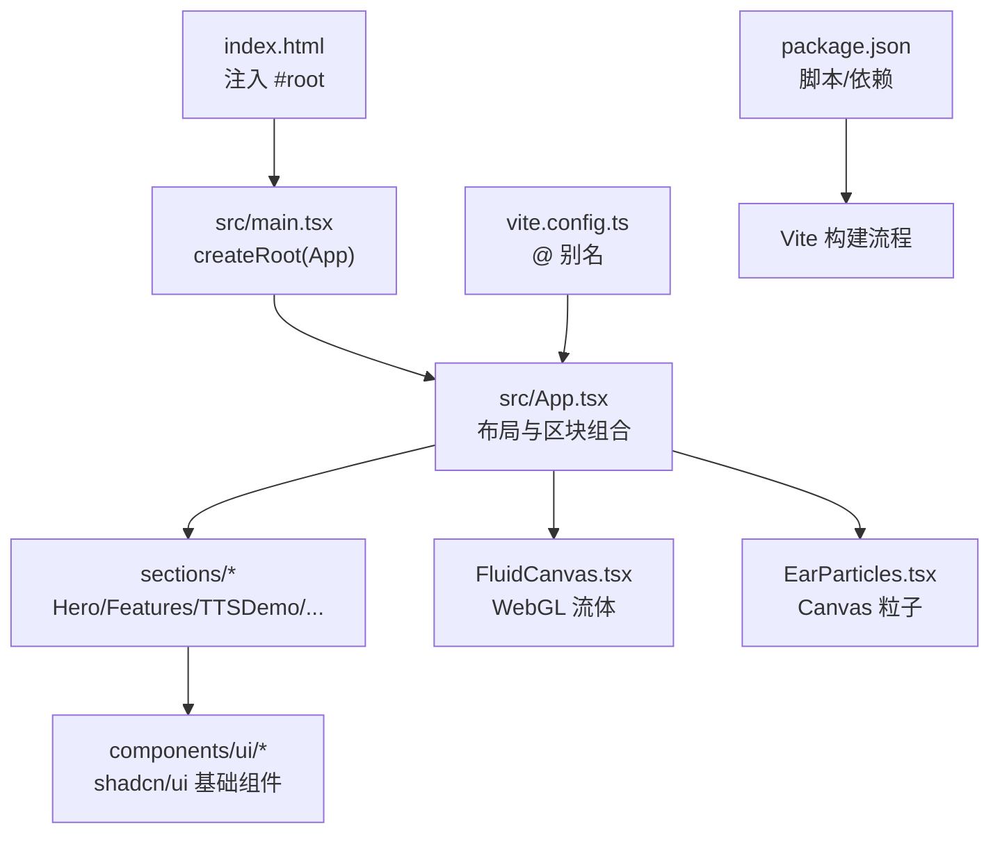
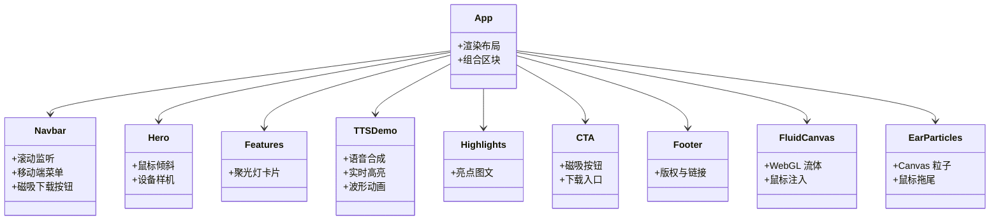
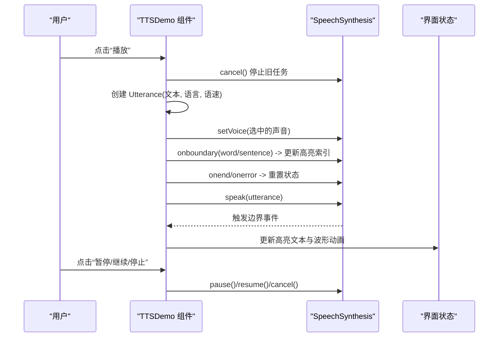
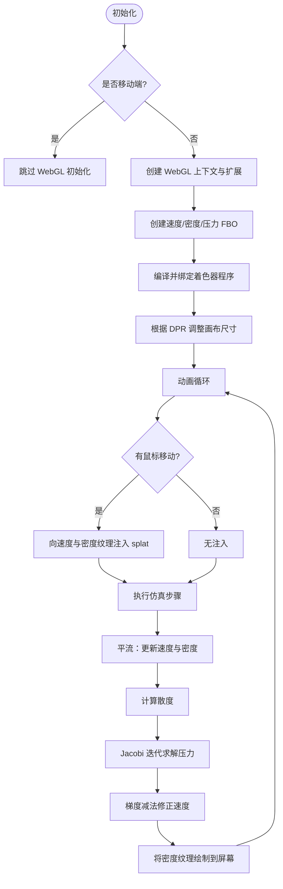
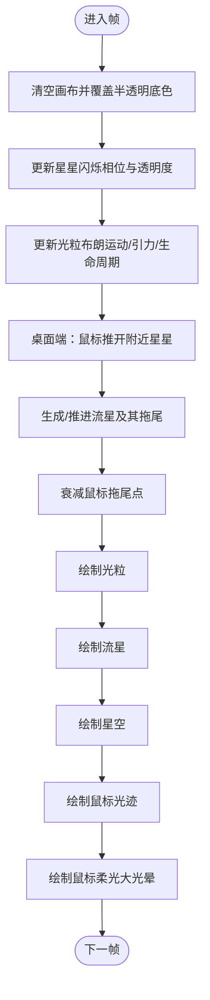
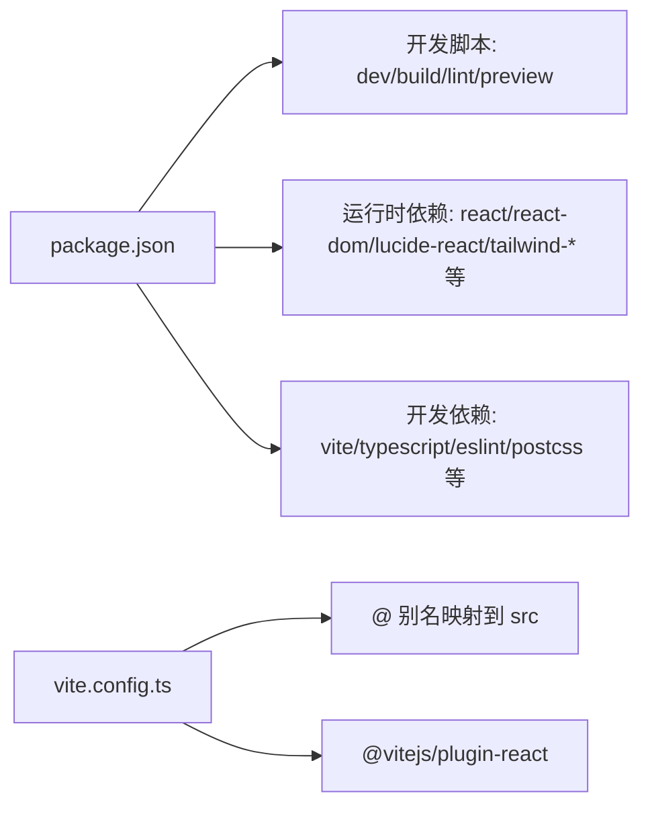

# 项目概述

<cite>
**本文引用的文件**   
- [README.md](file://README.md)
- [package.json](file://package.json)
- [index.html](file://index.html)
- [vite.config.ts](file://vite.config.ts)
- [src/main.tsx](file://src/main.tsx)
- [src/App.tsx](file://src/App.tsx)
- [src/sections/Hero.tsx](file://src/sections/Hero.tsx)
- [src/sections/Features.tsx](file://src/sections/Features.tsx)
- [src/sections/TTSDemo.tsx](file://src/sections/TTSDemo.tsx)
- [src/sections/Highlights.tsx](file://src/sections/Highlights.tsx)
- [src/sections/CTA.tsx](file://src/sections/CTA.tsx)
- [src/sections/Navbar.tsx](file://src/sections/Navbar.tsx)
- [src/sections/Footer.tsx](file://src/sections/Footer.tsx)
- [src/sections/FluidCanvas.tsx](file://src/sections/FluidCanvas.tsx)
- [src/sections/EarParticles.tsx](file://src/sections/EarParticles.tsx)
</cite>

## 目录
1. [简介](#简介)
2. [项目结构](#项目结构)
3. [核心组件](#核心组件)
4. [架构总览](#架构总览)
5. [详细组件分析](#详细组件分析)
6. [依赖分析](#依赖分析)
7. [性能考量](#性能考量)
8. [故障排查指南](#故障排查指南)
9. [结论](#结论)
10. [附录：快速开始](#附录快速开始)

## 简介
挠荔枝 Knowledge 是一款 iOS 有声阅读器应用的产品官网，采用 React + TypeScript 构建，基于 Vite 进行开发与构建。网站以营销落地页的形式，集中展示产品的核心价值主张与关键能力，包括多格式导入、智能朗读、后台播放、锁屏控制、明暗主题等。页面还集成了 WebGL 流体动画、Canvas 粒子星空与流星效果、语音合成在线演示等高级交互特性，旨在通过沉浸式视觉与可体验的 TTS 演示，提升用户下载转化意愿。

## 项目结构
项目采用“按功能区块”组织页面的方式，根组件负责组合各区块；视觉动效与交互逻辑集中在 sections 目录下，UI 基础组件来自 shadcn/ui，样式使用 Tailwind CSS，构建工具为 Vite，并通过别名 @ 指向 src 目录。

图表来源
- [index.html:1-49](file://index.html#L1-L49)
- [src/main.tsx:1-11](file://src/main.tsx#L1-L11)
- [src/App.tsx:1-30](file://src/App.tsx#L1-L30)
- [vite.config.ts:1-15](file://vite.config.ts#L1-L15)
- [package.json:1-80](file://package.json#L1-L80)

章节来源
- [README.md:1-73](file://README.md#L1-L73)
- [index.html:1-49](file://index.html#L1-L49)
- [src/main.tsx:1-11](file://src/main.tsx#L1-L11)
- [src/App.tsx:1-30](file://src/App.tsx#L1-L30)
- [vite.config.ts:1-15](file://vite.config.ts#L1-L15)
- [package.json:1-80](file://package.json#L1-L80)

## 核心组件
- 导航栏 Navbar：固定顶部，滚动时背景模糊加深，移动端提供折叠菜单与磁吸下载按钮。
- Hero 首屏：品牌标语、价值主张、App Store 下载入口与设备样机，支持鼠标视差倾斜。
- Features 特性卡片：三张卡片展示“多格式导入、智能朗读、随心配置”，内置聚光灯跟随效果。
- TTSDemo 语音合成演示：在线体验 Web Speech API，支持语言切换、声音选择、实时高亮与波形动画。
- Highlights 亮点区：网页一键朗读、后台播放、明暗主题三大差异化卖点。
- CTA 下载引导：强视觉号召区域，磁吸按钮与 App Store 直达链接。
- Footer 页脚：品牌信息、站点链接、法律链接与版权信息。
- FluidCanvas WebGL 流体：桌面端启用 WebGL 流体模拟，鼠标交互产生彩色烟雾扩散。
- EarParticles Canvas 粒子：全屏星空、光粒、流星与鼠标柔光拖尾，移动端降级简化。

章节来源
- [src/sections/Navbar.tsx:1-117](file://src/sections/Navbar.tsx#L1-L117)
- [src/sections/Hero.tsx:1-141](file://src/sections/Hero.tsx#L1-L141)
- [src/sections/Features.tsx:1-91](file://src/sections/Features.tsx#L1-L91)
- [src/sections/TTSDemo.tsx:1-344](file://src/sections/TTSDemo.tsx#L1-L344)
- [src/sections/Highlights.tsx:1-119](file://src/sections/Highlights.tsx#L1-L119)
- [src/sections/CTA.tsx:1-65](file://src/sections/CTA.tsx#L1-L65)
- [src/sections/Footer.tsx:1-62](file://src/sections/Footer.tsx#L1-L62)
- [src/sections/FluidCanvas.tsx:1-470](file://src/sections/FluidCanvas.tsx#L1-L470)
- [src/sections/EarParticles.tsx:1-560](file://src/sections/EarParticles.tsx#L1-L560)

## 架构总览
整体采用单页落地页架构：HTML 注入根节点，main.tsx 挂载 React 根，App.tsx 组合各区块组件。视觉层由两个独立的全屏 Canvas/WebGL 组件叠加在内容之下，互不阻塞主线程渲染。TTS 演示通过浏览器原生 API 实现，无需后端。

图表来源
- [index.html:1-49](file://index.html#L1-L49)
- [src/main.tsx:1-11](file://src/main.tsx#L1-L11)
- [src/App.tsx:1-30](file://src/App.tsx#L1-L30)
- [vite.config.ts:1-15](file://vite.config.ts#L1-L15)
- [package.json:1-80](file://package.json#L1-L80)

## 详细组件分析

### 组件关系与数据流
- 组件层级：App 作为容器，依次渲染背景层、导航、主体区块与页脚。
- 交互链路：鼠标事件驱动 Hero 倾斜、Navbar 磁吸按钮位移、FluidCanvas 流体注入、EarParticles 粒子受力与拖尾。
- 状态管理：各区块内部使用 React Hooks 维护本地状态（如 TTS 播放状态、高亮位置、是否可见等）。

图表来源
- [src/App.tsx:1-30](file://src/App.tsx#L1-L30)
- [src/sections/Navbar.tsx:1-117](file://src/sections/Navbar.tsx#L1-L117)
- [src/sections/Hero.tsx:1-141](file://src/sections/Hero.tsx#L1-L141)
- [src/sections/Features.tsx:1-91](file://src/sections/Features.tsx#L1-L91)
- [src/sections/TTSDemo.tsx:1-344](file://src/sections/TTSDemo.tsx#L1-L344)
- [src/sections/Highlights.tsx:1-119](file://src/sections/Highlights.tsx#L1-L119)
- [src/sections/CTA.tsx:1-65](file://src/sections/CTA.tsx#L1-L65)
- [src/sections/Footer.tsx:1-62](file://src/sections/Footer.tsx#L1-L62)
- [src/sections/FluidCanvas.tsx:1-470](file://src/sections/FluidCanvas.tsx#L1-L470)
- [src/sections/EarParticles.tsx:1-560](file://src/sections/EarParticles.tsx#L1-L560)

### 语音合成演示（TTSDemo）调用时序

图表来源
- [src/sections/TTSDemo.tsx:1-344](file://src/sections/TTSDemo.tsx#L1-L344)

### WebGL 流体渲染流程

图表来源
- [src/sections/FluidCanvas.tsx:1-470](file://src/sections/FluidCanvas.tsx#L1-L470)

### 粒子系统更新流程（EarParticles）

图表来源
- [src/sections/EarParticles.tsx:1-560](file://src/sections/EarParticles.tsx#L1-L560)

## 依赖分析
- 运行时依赖：React 19、ReactDOM 19、Lucide React 图标库、Tailwind 相关工具链、Radix UI 系列组件、Embla Carousel、Recharts、Sonner 等。
- 开发依赖：Vite 7、TypeScript、ESLint、PostCSS、Autoprefixer、Tailwind CSS 及动画插件。
- 构建脚本：dev/build/lint/preview 四个常用命令，build 先执行类型检查再打包。

图表来源
- [package.json:1-80](file://package.json#L1-L80)
- [vite.config.ts:1-15](file://vite.config.ts#L1-L15)

章节来源
- [package.json:1-80](file://package.json#L1-L80)
- [vite.config.ts:1-15](file://vite.config.ts#L1-L15)

## 性能考量
- 移动端降级：WebGL 流体在移动端禁用，避免低端设备卡顿；Canvas 粒子在移动端减少复杂度与绘制开销。
- 不可见优化：流体与粒子均使用 IntersectionObserver，当元素不在视口内时暂停动画循环，降低 CPU/GPU 占用。
- 高分屏适配：根据 devicePixelRatio 调整画布分辨率，限制最大倍率以避免过度消耗。
- 事件节流：pointer/mouse 事件使用 passive 监听，减少滚动抖动与主线程阻塞。
- 资源体积：静态资源与图片位于 public 目录，按需加载；未引入重型第三方图形库，保持轻量。

[本节为通用指导，不涉及具体代码片段]

## 故障排查指南
- 语音合成不可用：部分浏览器或平台不支持 SpeechSynthesis，组件会检测并提示下载 App。请确认浏览器版本与权限设置。
- 声音列表为空：某些环境需要等待 voiceschanged 事件后再获取声音列表，组件已处理该异步场景。
- WebGL 不可用：若浏览器不支持 WebGL 或 GPU 受限，流体背景不会启动，不影响其他功能。
- 移动端性能问题：已自动降级，若仍卡顿，建议关闭不必要的动画或在更现代设备上测试。
- 构建失败：确保 Node 版本满足要求，清理缓存后重试；如遇类型错误，优先运行 lint 与 build 查看报错定位。

章节来源
- [src/sections/TTSDemo.tsx:1-344](file://src/sections/TTSDemo.tsx#L1-L344)
- [src/sections/FluidCanvas.tsx:1-470](file://src/sections/FluidCanvas.tsx#L1-L470)
- [src/sections/EarParticles.tsx:1-560](file://src/sections/EarParticles.tsx#L1-L560)

## 结论
本项目以清晰的模块化结构与丰富的前端技术栈，成功打造了一个兼具品牌表达与产品体验的营销落地页。通过 WebGL 流体与 Canvas 粒子营造沉浸氛围，结合在线 TTS 演示直观呈现产品价值，有效提升了用户的感知与下载意愿。整体架构简洁、可扩展性强，便于后续新增功能区块与优化性能。

[本节为总结性内容，不涉及具体代码片段]

## 附录：快速开始
- 环境准备
  - 安装 Node.js（建议使用最新稳定版）
  - 推荐使用 npm 包管理器
- 安装依赖
  - 在项目根目录执行：npm install
- 启动开发服务器
  - 执行：npm run dev
  - 打开浏览器访问本地地址即可预览
- 构建与预览
  - 生产构建：npm run build
  - 本地预览构建产物：npm run preview
- 代码规范
  - 运行 ESLint：npm run lint

章节来源
- [README.md:29-43](file://README.md#L29-L43)
- [package.json:6-11](file://package.json#L6-L11)